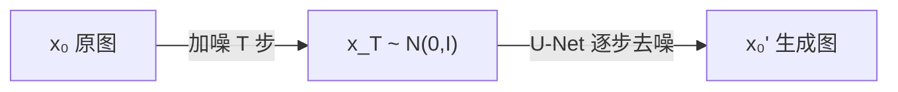

# 扩散模型 Diffusion 与 Stable Diffusion 入门

> **文件编码**：UTF-8。  
> **前置**：[09 视觉 CNN](09-视觉CNN入门.md)、[03 PyTorch 入门](03-PyTorch入门与张量操作.md)、[05 训练循环](05-nn.Module与训练循环.md)。  
> **定位**：理解 **DDPM / Latent Diffusion / Stable Diffusion** 原理与 HuggingFace `diffusers` 推理；扩展生成模型视野，与 LLM 并列的 **多模态生成** 能力。

---

## 0. 读前导读

### 0.1 用一句话弄懂本章

**扩散模型** = 先往数据里加噪，再学 **逐步去噪** 还原图像；Stable Diffusion 在 **潜空间** 做扩散，用 **U-Net + CLIP 文本条件** 实现文生图。

### 0.2 你需要提前知道什么

- CNN、卷积、上采样（09 章）
- PyTorch 训练循环（05 章）
- CLIP 文本编码（27 章）

### 0.3 本章知识地图（☐→☑）

- [ ] 解释前向扩散 \(q(x_t|x_{t-1})\) 与反向去噪 \(p_\theta(x_{t-1}|x_t)\)
- [ ] 用 `diffusers` 跑通 SD 1.5 / SDXL 文生图
- [ ] 理解 classifier-free guidance（CFG）
- [ ] 知道 LoRA 如何注入 SD（与 15 章 PEFT 类比）
- [ ] 完成 §闭卷自测 ≥8/10

### 0.4 建议学习时长

- **4～6 天**（推理为主；训练选读）

---

## 1. 这份文档学什么

- 生成模型谱系：GAN → VAE → Flow → **Diffusion**
- DDPM 数学直觉：噪声 schedule、重参数化
- Latent Diffusion：VAE 压缩 + U-Net 去噪
- Stable Diffusion 组件：Tokenizer、Text Encoder、UNet、VAE
- HuggingFace `diffusers` Pipeline API
- ControlNet / IP-Adapter 概念（扩展）
- 与 [LLMInfra](../LLMInfra/00-学习路线图与说明.md) 推理优化（TensorRT）的衔接

---

## 2. 生成模型为什么需要 Diffusion

| 方法 | 优点 | 缺点 |
|------|------|------|
| GAN | 采样快 | 模式崩塌、训练不稳定 |
| VAE | 稳定 | 图像模糊 |
| **Diffusion** | 质量高、多样性好 | 采样步数多（慢） |

大模型时代：**DiT（Diffusion Transformer）** 与 LLM 共享 Transformer 工程经验。

---

## 3. DDPM 直觉



**前向**：\(x_t = \sqrt{\bar\alpha_t}\, x_0 + \sqrt{1-\bar\alpha_t}\,\epsilon\)

**训练目标**：预测噪声 \(\epsilon_\theta(x_t, t)\)，MSE loss。

```python
# 伪代码：单步训练
noise = torch.randn_like(x0)
t = torch.randint(0, T, (batch,))
xt = sqrt_ab[t] * x0 + sqrt_1m_ab[t] * noise
loss = F.mse_loss(model(xt, t), noise)
```

---

## 4. Stable Diffusion 架构

```text
prompt ──► CLIP Text Encoder ──► cross-attention ──► U-Net ──► latent z
                                                          ▲
image ──► VAE Encoder ──► latent（训练时）─────────────────┘
latent z ──► VAE Decoder ──► 像素图
```

| 组件 | 作用 | 显存 |
|------|------|------|
| VAE | 8× 空间压缩 | 中 |
| U-Net | 去噪主干 | **大** |
| Text Encoder | 条件 | 小 |

**512×512 原图** → **64×64×4** latent，计算量降一个数量级。

---

## 5. diffusers 最小推理

```bash
pip install diffusers transformers accelerate safetensors
```

```python
import torch
from diffusers import StableDiffusionPipeline

pipe = StableDiffusionPipeline.from_pretrained(
    "runwayml/stable-diffusion-v1-5",
    torch_dtype=torch.float16,
)
pipe = pipe.to("cuda")

prompt = "a cat wearing astronaut helmet, digital art"
image = pipe(
    prompt,
    num_inference_steps=30,
    guidance_scale=7.5,
).images[0]
image.save("out.png")
```

| 参数 | 含义 |
|------|------|
| `num_inference_steps` | 去噪步数，越多越细、越慢 |
| `guidance_scale` | CFG 强度，7～12 常见 |

---

## 6. Classifier-Free Guidance（CFG）

训练时随机 **drop 文本条件**；推理时：

\[
\epsilon_\text{cfg} = \epsilon_\text{uncond} + s \cdot (\epsilon_\text{cond} - \epsilon_\text{uncond})
\]

\(s\) = `guidance_scale`。过大 → 过饱和、伪影。

---

## 7. SD LoRA 微调（与 15 章类比）

```python
from diffusers import StableDiffusionPipeline
from peft import LoraConfig

# 对 U-Net attention 层注入 LoRA，数据集为 (image, caption) 对
# 详见 kohya-ss / diffusers DreamBooth 文档
```

| LLM LoRA | SD LoRA |
|----------|---------|
| target q/k/v | target U-Net attn |
| 文本 SFT | 图像+caption |
| peft | diffusers + peft |

---

## 8. 加速与部署

| 手段 | 说明 |
|------|------|
| DDIM / DPM-Solver | 少步高质量采样 |
| xFormers / SDPA | attention 加速 |
| TensorRT | [LLMInfra 推理优化](../LLMInfra/16-推理Serving与Batch调度.md) 同类思路 |
| 量化 | INT8 U-Net（精度 trade-off） |

---

## 9. 与 LLM 路线的关系

| 技能 | LLM | Diffusion |
|------|-----|-----------|
| Transformer | GPT 解码 | DiT / U-Net 内 attn |
| 微调 | LoRA SFT | DreamBooth / LoRA |
| 推理引擎 | vLLM | TensorRT / ComfyUI |
| 多模态 | LLaVA（32 章） | SD + CLIP |

**Infra 岗**：不必精通 SD 训练，但 **应能解释 Pipeline 组件与显存瓶颈**。

---

## 10. 常见问题

**Q：12G 显存能跑 SD 吗？**  
A：fp16 + attention slicing 可以 512²；SDXL 建议 16G+。

**Q：Diffusion 和 LLM 面试重叠？**  
A：都考 Transformer、条件生成、采样；SD 额外考 VAE 与 schedule。

---

## 闭卷自测

1. 扩散模型前向过程在做什么？
2. DDPM 训练目标预测的是 \(x_0\) 还是 \(\epsilon\)？
3. Stable Diffusion 为什么在 latent 空间扩散？
4. CFG 的 `guidance_scale` 过大有什么现象？
5. SD Pipeline 四大组件是什么？
6. VAE 的作用？
7. `num_inference_steps` 与速度/质量 trade-off？
8. DreamBooth 解决什么问题？
9. DiT 与 U-Net SD 的区别？
10. diffusers 与 transformers 分工？

<details>
<summary>参考答案</summary>

1. 逐步向数据加高斯噪声直至近似纯噪声。
2. 常见实现预测噪声 \(\epsilon\)。
3. 降低 U-Net 计算分辨率，省显存与时间。
4. 过饱和、对比度过高、伪影。
5. Tokenizer、Text Encoder、UNet、VAE Decoder（+ Scheduler）。
6. 图像 ↔ latent 编解码，压缩空间维度。
7. 步数越多质量可能越好但线性变慢。
8. 用少量照片个性化主体（如特定人脸/物体）。
9. DiT 用纯 Transformer 替代 U-Net 做去噪。
10. diffusers 管生成模型 Pipeline；transformers 管 LLM/VLM/CLIP 等。

</details>

---

## 下一章

[42 Gradio / Streamlit 模型 Demo 与产品化](42-Gradio-Streamlit模型Demo与产品化.md)

选读：[27 多模态 CLIP](27-多模态CLIP入门.md) · [32 LLaVA](32-多模态LLaVA与视觉语言模型.md)
