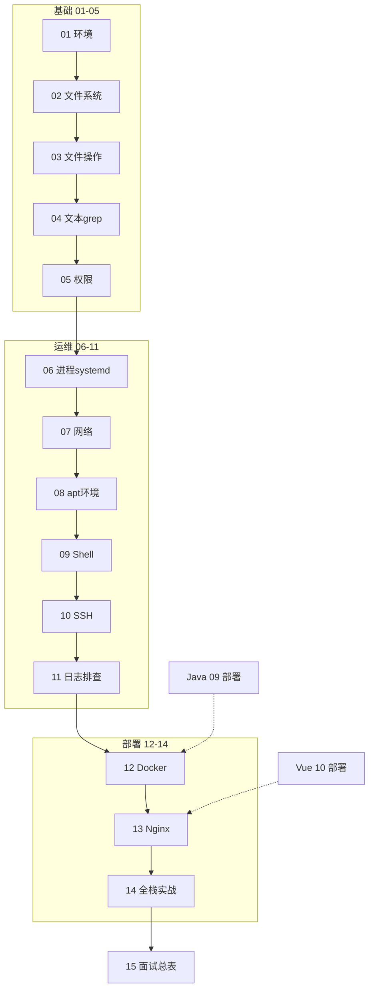

# Linux 学习路线图与说明

<!-- 修改说明: 2026-06-30 按 EXPANSION-STANDARD 扩充 §0 零基础导读、学习方法详解、闭卷自测、费曼检验 -->

> **文件编码**：本文件夹内所有 `.md` 均为 **UTF-8**。终端与编辑器建议 UTF-8；PowerShell / Cursor 右下角确认编码。

---

## 0. 读前导读（零基础也能跟上）

> **读者假设**：你会用 Windows 开关软件、能上网下载 ISO；[todo.md](../../todo.md) 已把 **C++ 01～36 主线 + VMware/WSL** 定为工程环境。本文件是 **00 路线图**，不教具体命令——它告诉你 **01～15 学什么、按什么顺序、怎么练才不白看**。

### 0.1 用一句话弄懂本系列

**一句话**：Linux 系列 = 在 **Ubuntu 虚拟机（或云服务器）** 里，从 **敲命令、管权限、装 JDK/MySQL** 到 **SSH 上线、Docker 起中间件、Nginx 反代全栈**，最终把 [todo.md](../../todo.md) 的 **notehub-fullstack** 部署起来，并能在面试里 **口述部署链路与排障步骤**。

**生活类比——餐厅后厨 vs 前台**：

| 概念 | 生活类比 | 系列章节 |
|------|----------|----------|
| **Linux 服务器** | 餐厅后厨：顾客看不见，但菜从这里出 | 01～11 基础运维 |
| **终端 / Shell** | 后厨对讲机：用文字下指令 | 01～04 |
| **权限 chmod** | 谁能进冷库、谁能改菜单 | 05 |
| **systemd** | 定时开关炉、自动重启烤箱 | 06、14 |
| **SSH / scp** | 外卖员把半成品送到分店 | 10、14 |
| **Docker** | 标准化料包：到哪都能复刻同一锅汤 | 12 |
| **Nginx** | 餐厅大门：顾客只进正门，后厨不对外 | 13、14 |
| **日志 grep/tail** | 查监控录像找哪一步炒糊了 | 04、11 |

**为什么重要**：Java/Python 后端 demo 在 Windows 能跑，**上线几乎都在 Linux**；[Java 09](../Java/09-LinuxDockerNginx部署基础.md) 只够跑通 demo，本系列 **01～15 系统补 OS 与部署**——与 Java 09/10 **互补不重复**。

**本章用到的地方**：§2 与 Java 分工、§4 学习顺序、§8～§8.1 学习方法、§9 练习总表。

---

### 0.2 你需要提前知道什么（零基础解释列）

| 术语 / 能力 | 零基础解释 | 真不会请先学 |
|-------------|------------|--------------|
| **操作系统 OS** | 管理 CPU、内存、文件的「大管家」 | 无需，01 章会讲 |
| **Ubuntu** | 一种流行的 Linux 发行版（像 Windows 的「品牌」） | 01 章安装 |
| **虚拟机 VM** | 在 Windows 里再跑一台「小电脑」 | 01 章 VMware |
| **终端** | 黑窗口里打字发命令 | 01 章 §4 |
| **命令行** | 不用鼠标图标，用 `ls`、`cd` 操作 | 01～03 |
| **后端 / API** | 服务器上的程序，浏览器通过 HTTP 访问 | Java 04 或 Vue 08 |
| **部署** | 把写好的程序放到服务器上长期运行 | 14 章 |
| **Git** | 代码版本管理 | [Git 01](../../前端学习/Git/01-Git入门与安装配置.md) 可选 |

| 你现在的水平 | 建议动作 |
|--------------|----------|
| 从未碰过 Linux | **01 章跟做 VMware**，再回来看 00 §4 顺序 |
| VMware 已装好 | 00 通读 1 h → 直接从 **02 或 03** 练命令 |
| Java 学到 06、要装 MySQL | **08 章** 与 Java 并行 |
| Vue 08 联调中 | **07 curl** + 以后 **13 Nginx** |
| 准备 C++ 10～12 / mini-http | **01～03、07 curl、10 SSH**；与 [C++ 11](../C++/11-Linux与系统编程入门.md) 互补 |
| C++ 桌面轨 Qt 部署 | **01～03** 即可；现场 Linux 可选 |
| 只想背面试题 | ⏸ 先 **01～05 实操** 再读 15，否则答不深 |

**最低门槛**：能记住 Ubuntu 登录密码；不怕「黑屏打字」；愿意 **手敲命令** 而不是只读 markdown。

---

### 0.3 本系列知识地图（00 读完后 ☐→☑）

- [ ] 能说明 Linux 系列为何在 `后端学习/` 而非 `前端学习/`
- [ ] 能按编号 **01→15** 各用一句话概括主题
- [ ] 能画出 **VMware Ubuntu → jar → Nginx → 浏览器** 简图
- [ ] 知道 **Java 09** 与本系列的分工（业务部署 vs 系统学 OS）
- [ ] 建好 `~/linux-practice` 练习目录（见 §6）
- [ ] 对照 [todo.md](../../todo.md) 说出 **第 1 周、第 5 周** 对应哪些 Linux 章
- [ ] 理解 **四步法 + 刻意练习节奏**（§8、§8.1）
- [ ] 完成 §17 分级练习 **基础档**
- [ ] 闭卷自测 ≥ 8/10（§22）

---

### 0.4 建议学习时长与节奏（全系列）

| 阶段 | 章节 | 建议周数 | 与 todo 对齐 |
|------|------|----------|--------------|
| 地基 | 01～05 | 2～3 周 | 暑假第 1～2 周 |
| 系统管理 | 06～08 | 1.5～2 周 | 第 2～3 周 |
| 自动化与远程 | 09～10 | 1 周 | 第 4 周 |
| 排障 | 11 | 0.5 周 | 穿插 |
| 容器与 Web | 12～13 | 1 周 | 第 5 周 |
| 实战 | 14 | 1～1.5 周 | 第 5 周核心 |
| 复习 | 15 | 持续 | 第 6 周 + 面试前 |

**全程约 6～10 周**（与 Java/Vue 并行可压缩）。**不要** 一天读完 00 就以为会 Linux——00 是 **地图**，01～14 是 **练车**。

---

### 0.5 读完 00 你能做什么（可验证）

1. 向同学解释：**为什么后端要学 Linux 而不是只学 Java 语法**（结合 jar 部署一句场景）。
2. 打开 [01 章](./01-Linux入门与环境搭建.md)，完成 **第一天 Checklist**（§15）。
3. 在纸上画出 **01→14** 箭头，标出 **todo 第 5 周** 对应的 10～14。
4. 列出本机计划：**VMware 还是云服务器**、Ubuntu 版本、每天练命令 **15～30 分钟**。
5. 说明 **本系列与 [Java 09](../Java/09-LinuxDockerNginx部署基础.md) 各读一遍还是只精读 Linux 系列**（建议：Java 09 跑通 demo，Linux 12～14 练熟命令）。

---

### 0.6 零基础常问（读 01 前消除焦虑）

| 问题 | 短答 |
|------|------|
| 我不会编程能学吗？ | **01～05 可以**；09 Shell、14 部署需要一点 Java/Vue 项目经验 |
| 命令要全背吗？ | **不用**；背 15 章速查 **30 条高频**，其余查 `--help` 与本资料报错表 |
| VMware 和 WSL 选哪个？ | 本系列 **默认 VMware**（更接近真实服务器）；WSL 差异见 01 章 |
| 没有云服务器够吗？ | **暑假 VMware 够**；14 章建议第二遍上 ECS 写进简历 |
| 和 C++ 11 章 Linux 重复吗？ | **不重复**：C++ 偏系统编程 API；本系列偏 **运维命令 + Web 部署** |
| 前端要学吗？ | Vue 10 部署依赖 **SSH/Nginx**；可跨目录学 10、13、14 |

---

## 1. 这套资料放在哪里？为什么在后端学习下？

Linux **不是**某一门编程语言，而是 **操作系统 + 工程环境**，前后端、运维、算法岗都会用到。本仓库把它放在：

```text
study/
└── 后端学习/
    └── Linux/          ← 你在这里（00～15）
```

**为什么不在 `前端学习/` 下？**

| 对比 | Git / 计网 | Linux |
|------|------------|-------|
| 引入时机 | 前端 HTML 11 章就初识 | 主要在 **部署、服务器、后端环境** 阶段才刚需 |
| 与 Java/Python 关系 | 弱 | **强** — Java 09、Python 09 部署章都依赖 Linux |
| 你的暑假计划 | Git 贯穿 | VMware Ubuntu 是 Linux 主战场（见 [todo.md](../../todo.md)） |

**谁应该学本系列？**

- 走 **Go / Java / Python 后端**、需要把项目部署到 Linux 服务器的同学
- **Go 路线**：W1 学 01～04 命令，W7 配合 [Go/13](../Go/13-Docker与Linux部署Go服务.md) 部署 shorturl
- 用 **VMware Ubuntu**（或 **WSL2**）练命令行、装 MySQL/Redis 的初学者
- 前端同学做 **Vue 10 部署**、需要懂 Nginx / SSH / 日志排查
- 目标：**面试能答 Linux 基础八股 + 线上故障能查日志**

**不适合**：已多年运维/SRE 经验、只查某一命令参数手册的人（可直接看 15 章索引）。

---

## 2. 与 Java 09 / Python 09 的分工

各语言路线里都有一章「Linux + Docker + Nginx 部署」，但 **只够跑通 demo**，不够系统学 OS。

| 维度 | Java 09 / Python 09 | 本 Linux 系列 |
|------|---------------------|---------------|
| 定位 | **为当前语言项目上线** | **系统掌握 Linux 本身** |
| Linux 命令 | 常用 20 条速查 | 01～11 从零到排查 |
| 权限 / 用户 | 点到为止 | 05 章专章 + 练习 |
| systemd / 日志 | 会用即可 | 06、11 章深入 |
| Shell 脚本 | 几乎不涉及 | 09 章 deploy.sh |
| SSH / 云服务器 | 简要 | 10 章专章 |
| Docker | 起中间件 | 12 章系统讲 |
| Nginx | 反代 jar | 13 章 + 14 全栈实战 |
| 面试 | 分散在各语言 14 章 | **15 章 Linux 专题总表** |

**推荐顺序**：

```text
方案 A（暑假冲刺 · 推荐）
  Linux 01～06（工程基础）
    → 并行 Java 04～06 或 Vue 08
    → Linux 07～10
    → Java 09 复习 + Linux 12～14（部署）
    → Linux 15 + Java 14 面试

方案 B（跟 Java 路线穿插）
  Java 01～03
    → Linux 01～05
    → Java 04～08
    → Linux 06～11
    → Java 09 + Linux 12～14
    → Java 10～15

方案 C（2026 Go 暑假主线 · 推荐）
  Git 01～02（Day 1～2）
    → Linux 01～04（Day 3～4，WSL 即可）
    → 并行 Go 01～05（W1～W2）
    → Linux 07 curl + 10 SSH（W2 末）
    → Go 13 Docker 部署短链（W7）
    → Linux 12～14 系统补全 + 15 面试总表
  详见 [Go 00 路线图](../Go/00-学习路线图与说明.md) 与 [go-backend-learning-plan.md](../../go-backend-learning-plan.md)
```

---

## 3. 技术栈主线（本资料默认环境）

```text
VMware Workstation + Ubuntu 22.04 LTS（桌面或 Server 均可）
  → 终端与 FHS 文件系统
  → 文件操作 / 权限 / 进程
  → 网络 / apt 装 JDK·MySQL·Redis·Node·Git
  → Bash 脚本
  → SSH 连云服务器
  → 日志与故障排查
  → Docker 容器
  → Nginx 反代 + 静态资源
  → 全栈 notehub 部署实战
  → 面试专题
```

与 [todo.md](../../todo.md) 暑假计划对齐：

| todo 周次 | Linux 章节 |
|-----------|------------|
| 预习 | 01（VMware 开机） |
| 第 1 周 | 01～03 + [Git 01～03](../../前端学习/Git/01-Git入门与安装配置.md) |
| 第 2 周 | 04～05；08 装 MySQL |
| 第 3 周 | 07（curl 联调） |
| 第 5 周 | 10～14 部署 |
| 第 6 周 | 11 排查 + 15 复习 |

---

## 4. 学习顺序（按编号 00～15）

```text
00 学习路线图（你现在在这里）
 ↓
01 Linux 入门与环境搭建（VMware、终端、共享文件夹）
 ↓
02 文件系统与目录结构（FHS、路径、inode、链接）
 ↓
03 文件与目录操作命令（ls/cp/mv/find/tar）
 ↓
04 文本查看编辑与搜索（grep/tail/vim/管道重定向）
 ↓
05 用户组与文件权限（chmod/sudo/umask）
 ↓
06 进程与服务管理（ps/systemctl/journalctl/cron）
 ↓
07 网络命令与防火墙基础（ip/curl/ss/ufw）
 ↓
08 软件包管理与开发环境安装（apt + JDK/MySQL/Redis/Node）
 ↓
09 Shell 脚本入门（deploy.sh、backup.sh）
 ↓
10 SSH 远程登录与文件传输（密钥、scp、云服务器）
 ↓
11 日志分析与故障排查（排障剧本）
 ↓
12 Docker 容器基础（镜像、compose）
 ↓
13 Nginx 与 Web 服务部署（反代、静态站）
 ↓
14 全栈项目 Linux 部署实战（notehub 上线）
 ↓
15 面试专题与知识点总表（复习索引）
```



### 4.1 阶段目标

| 阶段 | 文档 | 目标 |
|------|------|------|
| 入门 | 01～03 | 能在 Ubuntu 终端导航、建目录、打包文件 |
| 文本与权限 | 04～05 | 会 grep 日志、改权限、用 sudo |
| 系统管理 | 06～08 | 管服务、装 JDK/MySQL、懂端口与防火墙 |
| 自动化 | 09～10 | 写部署脚本、SSH 上传 jar |
| 排障 | 11 | 磁盘满、端口占用、Permission denied 能查 |
| 容器与 Web | 12～13 | Docker 起中间件、Nginx 反代 API |
| 实战 | 14 | notehub 全栈上线 |
| 冲刺 | 15 | 面试题 + 命令速查 |

---

## 5. 各章衔接索引

| 编号 | 上一章产出 | 本章解决什么 |
|------|------------|--------------|
| 01 | 00：知道学什么 | VMware Ubuntu 能开机、开终端、敲第一条命令 |
| 02 | 01：会 cd/ls | 理解 `/` 下各目录干什么、绝对路径 |
| 03 | 02：懂路径 | 熟练 cp/mv/find/tar，建项目目录结构 |
| 04 | 03：有文件可练 | 看日志、grep 报错、vim 改配置 |
| 05 | 04：能改文件 | 理解 rwx、sudo、服务为何 Permission denied |
| 06 | 05：权限过关 | 启停 nginx/mysql、看 Java 进程、定时任务 |
| 07 | 06：进程+端口 | curl 测 API、防火墙放行、联调排查 |
| 08 | 07：网络通 | apt 装齐 Java/MySQL/Redis/Node/Git |
| 09 | 08：环境就绪 | 一键 deploy.sh 代替手敲 20 条命令 |
| 10 | 09：脚本会上传 | SSH 密钥登录云服务器、scp 传 jar/dist |
| 11 | 10：服务在跑 | 502/磁盘满/OOM 能按剧本查 |
| 12 | 11：会排查 | Docker 隔离起 MySQL/Redis，环境一致 |
| 13 | 12：容器可选 | Nginx 同域托管 Vue + 反代 Spring Boot |
| 14 | 01～13 全部 | 串成 notehub 完整上线 |
| 15 | 01～14 | 复习 + 面试 |

---

## 6. 主线练手环境：`linux-practice`

各章练习建议统一在 Ubuntu 里维护：

```text
/home/你的用户名/linux-practice/
├── logs/              # 04 章 tail -f、grep
├── shared/            # 05 章权限练习
├── scripts/           # 09 章 deploy.sh、backup.sh
├── apps/
│   ├── notehub-api/   # 14 章 jar 位置
│   └── notehub-web/   # dist 静态文件
├── backup/            # 09 章 backup 输出
└── README.md          # 记录本机 IP、安装的软件版本
```

与 Git 仓库关系：可在 `linux-practice` 里 `git init`，脚本和 nginx 配置纳入版本管理（见 [Git 02](../../前端学习/Git/02-本地版本控制核心操作.md)）。

---

## 7. 必备环境与工具

### 7.1 虚拟机（推荐 · 与 todo 一致）

| 组件 | 建议 |
|------|------|
| 宿主 OS | Windows 10/11 |
| 虚拟化 | **VMware Workstation Player / Pro** |
| 客户机 | **Ubuntu 22.04 LTS** Desktop 或 Server |
| 内存 | 至少分给 Ubuntu **4 GB**（8 GB 更顺） |
| 磁盘 | 动态 40 GB+ |

WSL2 可用但本系列 **默认按 VMware 写**；差异见 [01 章 §WSL 对比](./01-Linux入门与环境搭建.md)。

### 7.2 云服务器（10 章后可选）

- 阿里云 / 腾讯云 **学生机** 或最廉价 ECS
- 系统选 **Ubuntu 22.04**
- 安全组放行：22（SSH）、80（HTTP）、443（HTTPS 可选）

### 7.3 Windows 侧工具

| 工具 | 用途 |
|------|------|
| PowerShell | 宿主命令、SSH 客户端（Win10+ 自带 OpenSSH） |
| Cursor / VS Code | 编辑 + Remote-SSH（10 章后） |
| MobaXterm / Tabby（可选） | 图形化 SSH/SFTP |

### 7.4 环境验证清单（01 章前）

在 **Ubuntu 终端**执行：

```bash
whoami
# 预期：你的用户名，非 root

pwd
# 预期：/home/你的用户名

uname -a
# 预期：含 Linux 与 x86_64

lsb_release -a
# 预期：Ubuntu 22.04.x LTS

git --version
# 若未装：08 章会装；01 章可先跳过
```

---

## 8. 推荐学习四步法（每章都做）

1. **通读**：这章解决什么问题？和 Java 部署哪一步对应？
2. **跟敲**：在 `linux-practice` 里**真实敲命令**，对照预期输出
3. **做小练习**：章节末尾「分级练习」至少完成基础档
4. **复述**：合上书，用自己的话讲「权限 755 是什么」「systemctl 干什么」

### 8.1 学习方法详解（零基础 → 能部署）

#### 8.1.1 三种无效学法（请避开）

| 无效做法 | 为什么没用 | 正确替代 |
|----------|------------|----------|
| 只读 markdown 不开机 | 肌肉记忆为零，面试一问就穿 | 每天 **VM 开机 15 min** 敲 § 跟做 |
| 复制粘贴命令不读输出 | 报错看不懂，排障不会 | 每条命令对照 **「预期输出」** 块 |
| 跳章直接 14 部署 | 权限/端口/日志全懵 | **01→05 最少过关** 再 14 |
| 同时开 5 章对照 | 认知过载 | **一次只开一章 + 00 索引** |

#### 8.1.2 单章学习节奏（建议 2～3 小时/章，14 章除外）

```text
第 1 遍（40 min）  读 §0 导读 + 「本章与上一章的关系」→ 知道本章在整条链路的哪一环
第 2 遍（60 min）  跟敲「手把手实操」→ 出错先查章内报错表，再查 FAQ
第 3 遍（30 min）  做分级练习「基础档」→ 对照参考答案改错
第 4 遍（20 min）  闭卷自测 + 费曼 3 分钟口述 → 不足标 ☐ 下章前回补
```

**刻意练习原则**：同一命令 **隔日再敲一遍** 比一次敲 20 遍更有效（01～03 的 `ls/cd/cp/find`，06 的 `systemctl`，07 的 `curl/ss` 尤其适用）。

#### 8.1.3 与 Java / Vue 并行时的「最小交叉表」

| 你在学 | 同步开 Linux | 原因 |
|--------|--------------|------|
| Java 01～03 | Linux 01～02 | 终端与目录不冲突，打地基 |
| Java 04～06 | Linux 05～08 | 要连 MySQL，08 装环境 |
| Java 07 Redis | Linux 12 Docker | Redis 可用容器练 |
| Vue 08 联调 | Linux 07 curl | 宿主机调 VM 上 API |
| Java 09 部署 | Linux 12～14 | **以 Linux 系列为主**，Java 09 当业务对照 |
| Vue 10 build | Linux 13 Nginx | dist 托管与反代 |
| 面试前 | Linux 15 + Java 14 | 场景题合并练 |

#### 8.1.4 练习目录 `linux-practice` 怎么用

每章产出 **留痕**，方便复习与面试 STAR：

```text
~/linux-practice/
├── logs/           # 04: echo 假 ERROR，练 tail -f / grep
├── shared/         # 05: chmod 协作练习
├── scripts/        # 09: deploy.sh、backup.sh
├── apps/           # 14: jar 与 dist 最终位置
├── backup/         # 09: tar 备份输出
└── NOTES.md        # 每章 3 条「我今天学会了什么」（费曼素材）
```

**NOTES.md 模板**（每章追加 3 行即可）：

```markdown
## 03 章 2026-xx-xx
- 命令：find . -name "*.log" 找当前目录下所有 log
- 踩坑：rm -rf 删错目录，已从 backup 恢复
- 面试一句：tar -czf 是打包并 gzip 压缩
```

#### 8.1.5 排障思维（11 章 preview，全程适用）

遇到「服务不对」按 **固定顺序**，避免玄学重启：

```text
1. 进程在吗？     systemctl status / ps / docker ps
2. 端口在听吗？   ss -tlnp
3. 本机 curl 通吗？ curl 127.0.0.1
4. 防火墙拦吗？   ufw status / 云安全组
5. 日志说什么？   journalctl / tail / docker logs / nginx error.log
6. 资源够吗？     df -h / free -h
```

把此顺序写在 `NOTES.md` 顶部，**14 章部署失败时逐条打勾**。

#### 8.1.6 自测与复习节奏

| 时间点 | 动作 |
|--------|------|
| 每章结束 | 闭卷自测 ≥ 8/10；费曼口述录音 3 min |
| 05 章后 | 重做 01～05 知识地图全部 ☑ |
| 11 章后 | 模拟「磁盘满」「502」各 5 min 口述 |
| 14 章后 | 验收清单 12/15 + 浏览器全流程录屏 |
| 第 6 周 | [15 章](./15-面试专题与知识点总表.md) 自评 12/15 + [todo §10.1](../../todo.md) |
| 面试前 3 天 | 15 章 §3 命令速查 + §7 部署 2 分钟模板 |

#### 8.1.7 Windows 与 Ubuntu 分工（暑假推荐）

| 环境 | 做什么 |
|------|--------|
| Windows + Cursor/IDEA | 写 Java/Vue 代码、`mvn package`、`npm run build` |
| VMware Ubuntu | 敲 Linux 命令、装 MySQL、跑 jar、配 Nginx、Docker |
| 云 ECS（可选） | 14 章第二遍：公网 URL、HTTPS、安全组 |

**不要** 在 Windows 上假装「会用 Linux」——WSL 能练部分命令，但 **本系列作业以 VMware 验收为准**。

---

## 9. 全路线分级练习总表

| 章节 | 基础 | 进阶 | 挑战 | 答案位置 |
|------|------|------|------|----------|
| 01 | 开 VM + 10 条命令 | 配共享文件夹 | 从 Windows SSH 进 VM | 01 §练习 |
| 02 | 画 FHS 树 | 建软链接 | 解释 inode | 02 §练习 |
| 03 | 建 notehub 目录树 | find 找 .log | tar 打包 logs | 03 §练习 |
| 04 | grep ERROR | tail -f 模拟 | awk 统计 IP | 04 §练习 |
| 05 | chmod 755 | 共享目录协作 | 解释 setuid | 05 §练习 |
| 06 | systemctl nginx | 写 systemd unit | cron 备份 | 06 §练习 |
| 07 | curl localhost API | ufw 放行 | 排查 Connection refused | 07 §练习 |
| 08 | 装 JDK+MySQL | check-env.sh | 换清华源 | 08 §练习 |
| 09 | hello.sh | deploy.sh | set -e 调试 | 09 §练习 |
| 10 | 密钥登录 VM | scp 传 jar | 写 ~/.ssh/config | 10 §练习 |
| 11 | 查磁盘满 | 端口占用剧本 | 502 全链路 | 11 §练习 |
| 12 | docker run mysql | compose 三件套 | 写 Dockerfile | 12 §练习 |
| 13 | 反代 /api | 托管 Vue dist | 配 gzip | 13 §练习 |
| 14 | 本地 VM 全栈 | 云服务器上线 | compose 版部署 | 14 §验收清单 |
| 15 | 自测 20 题 | 模拟面试 | 白板画部署架构 | 15 §自评表 |

---

## 10. 学习时间参考（每天 2～3 小时）

| 文档 | 建议天数 | 说明 |
|------|----------|------|
| 01 | 2～3 天 | VMware 折腾可能占 1 天 |
| 02 | 2～3 天 | FHS 要记 |
| 03 | 3～4 天 | 命令肌肉记忆 |
| 04 | 4～5 天 | vim 需要练 |
| 05 | 3～4 天 | 权限是面试高频 |
| 06 | 4～5 天 | systemd 必会 |
| 07 | 3～4 天 | 与 [计网 04](../../前端学习/计算机网络/04-HTTP协议深入.md) 对照 |
| 08 | 2～3 天 | 装环境 day |
| 09 | 4～5 天 | 脚本多写 |
| 10 | 2～3 天 | 有云服务器更快 |
| 11 | 3～4 天 | 反复练剧本 |
| 12 | 4～5 天 | 与 Java 09 重叠可加速 |
| 13 | 3～4 天 | 与 Vue 10 对照 |
| 14 | 5～7 天 | 综合实战 |
| 15 | 持续 | 面试前反复 |

**全程约 6～10 周**（可与 Java/Vue 并行，暑假 6 周够覆盖 01～11 + 14 核心）。

---

## 11. 与全栈路线的交叉引用

| Linux 章 | 前端 | 后端 |
|----------|------|------|
| 07 curl | [Vue 08 联调](../../前端学习/Vue/08-Axios网络请求与前后端联调.md) | [Java 04 接口](../../后端学习/Java/04-SpringBoot核心开发.md) |
| 08 apt 装 Node | [Vue 01 环境](../../前端学习/Vue/01-Vue入门与环境搭建.md) | — |
| 08 apt 装 JDK/MySQL | — | [Java 01～06](../../后端学习/Java/00-学习路线图与说明.md) |
| 10 SSH/scp | [Vue 10 部署](../../前端学习/Vue/10-Vite构建与项目部署.md) | [Java 09 部署](../../后端学习/Java/09-LinuxDockerNginx部署基础.md) |
| 13 Nginx | Vue 10 | Java 09 |
| 14 全栈实战 | [Vue 11 项目](../../前端学习/Vue/11-Vue项目实战与面试准备.md) | [Java 10 项目](../../后端学习/Java/10-后端项目实战与面试准备.md) |

---

## 12. 学完后你应该能做哪些事

- [ ] 独立操作 VMware Ubuntu 终端，不用 GUI 完成日常任务
- [ ] 解释 FHS 主要目录、读写执行权限、sudo 作用
- [ ] 用 systemctl 管理后端服务，journalctl 查启动失败原因
- [ ] apt 安装 JDK、MySQL、Redis、Nginx、Docker
- [ ] 写 Bash 部署脚本，SSH + scp 上传 jar 和前端 dist
- [ ] 用 grep/tail 查应用日志，按 11 章剧本排查常见问题
- [ ] Docker Compose 起 MySQL + Redis
- [ ] Nginx 配置 `/api` 反代 + 静态站同域
- [ ] 把 [todo.md](../../todo.md) 里的 notehub 项目部署到 VM 或云服务器
- [ ] 回答 15 章中的 Linux 面试高频题

---

## 13. 常见问题 FAQ

### Q1：必须先学完 Java 再学 Linux 吗？

不必须。**01～05 可与 Java 01～04 并行**。装 MySQL（08 章）建议在 Java 06 前或同步。

### Q2：Ubuntu Desktop 还是 Server？

**初学者 Desktop** 更友好（有图形界面）；熟练后可换 Server 练纯命令行。命令几乎一样。

### Q3：每个命令都要背吗？

**不用背手册**，但要背 **高频 30 条**（15 章速查表）。其余知道 `man` / `--help` / 本资料报错表即可。

### Q4：和 C++ 11 章 Linux 重复吗？

[C++ 11](../../后端学习/C++/11-Linux与系统编程入门.md) 偏 **系统编程、文件描述符、进程 API**；本系列偏 **运维式命令行 + Web 部署**，互补不重复。

### Q5：Windows 上练 Linux 够吗？

暑假 **VMware 足够**；找实习前建议 **买一台云服务器**（10、14 章）体验真实公网环境。

### Q6：root 和 sudo 怎么用？

**日常禁止直接用 root 登录**。需要管理员权限时在命令前加 `sudo`（05 章详讲）。

---

## 14. 文档索引速查

| 编号 | 文件名 | 一句话 |
|------|--------|--------|
| 00 | 学习路线图与说明 | 怎么学、顺序、环境 |
| 01 | Linux 入门与环境搭建 | VMware、终端、首命令 |
| 02 | 文件系统与目录结构 | FHS、路径、链接 |
| 03 | 文件与目录操作命令 | ls/cp/find/tar |
| 04 | 文本查看编辑与搜索 | grep/vim/管道 |
| 05 | 用户组与文件权限 | chmod/sudo |
| 06 | 进程与服务管理 | systemctl/journalctl |
| 07 | 网络命令与防火墙基础 | curl/ss/ufw |
| 08 | 软件包管理与开发环境安装 | apt/JDK/MySQL |
| 09 | Shell 脚本入门 | deploy.sh |
| 10 | SSH 远程登录与文件传输 | 密钥、scp |
| 11 | 日志分析与故障排查 | 排障剧本 |
| 12 | Docker 容器基础 | 镜像、compose |
| 13 | Nginx 与 Web 服务部署 | 反代、静态站 |
| 14 | 全栈项目 Linux 部署实战 | notehub 上线 |
| 15 | 面试专题与知识点总表 | 复习索引 |

规范细节见 [修改规范](../../修改规范.md) §5.9。

---

## 15. 第一天 Checklist（跟 01 章一起做）

```text
□ VMware 已装，Ubuntu 22.04 能开机
□ 进入终端，whoami / pwd 正常
□ 配置 VMware 共享文件夹（或 SFTP）
□ mkdir ~/linux-practice && cd ~/linux-practice
□ 创建 README.md 记录学习开始日期
□ （可选）git init，首 commit：chore: init linux-practice
□ 浏览 02～05 章标题，知道下周学什么
```

---

## 16. 5 分钟跟做：验证环境

```bash
whoami && pwd && uname -r
lsb_release -ds
mkdir -p ~/linux-practice && echo "linux-practice ready" > ~/linux-practice/README.md
cat ~/linux-practice/README.md
```

**预期**：用户名非 root；路径在 `/home/...`；内核版本号；`Ubuntu 22.04.x LTS`；README 内容正确。

---

## 17. 分级练习

**基础**：用三句话说明 Linux 系列为何放在 `后端学习/` 下。

**进阶**：画出 01→14 中与 [todo.md](../../todo.md) 暑假第 1 周、第 5 周对应的章节号。

**挑战**：列出你本机 VMware Ubuntu 的 IP（`ip addr`），写一条从 Windows SSH 连接的命令（10 章预习）。

### 17.1 参考答案

**基础**：

1. Linux 主要服务后端部署与服务器环境，与 Java 09/Python 09 强相关。
2. 前端 Git/计网 在前端目录是因为更早引入；Linux 在部署阶段才刚需。
3. 前端部署（Vue 10）同样依赖 SSH/Nginx，可跨目录学习。

**进阶**：第 1 周 → Linux 01～03 + Git 01～03；第 5 周 → Linux 10～14 + Java 09 + Vue 10。

**挑战**：示例 `ssh youruser@192.168.xxx.xxx`（IP 以 `ip addr show` 为准）。

---

## 18. 常见报错（环境类）

| 报错 / 现象 | 可能原因 | 解决方案 |
|-------------|----------|----------|
| VMware 无法启动 VM | 未开 BIOS 虚拟化 | 进 BIOS 开 Intel VT-x / AMD-V |
| Ubuntu 黑屏 | 显存不足 | VM 设置加显存或装 Server 版 |
| 终端中文乱码 |  locale 未设 UTF-8 | `sudo apt install language-pack-zh-hans`；`LANG=en_US.UTF-8` |
| 共享文件夹看不到 | VMware Tools 未装 | VM 菜单 Install VMware Tools |
| `command not found` | 未安装该软件 | 08 章 apt install |
| 复制粘贴不工作 | 终端快捷键 | Shift+Ctrl+C/V 或右键 |
| 忘记 Ubuntu 密码 | — | 恢复模式 reset（搜 Ubuntu recovery） |
| 磁盘空间不足 | 虚拟磁盘太小 | VM 设置扩容 + `growpart`/`resize2fs` |
| 网络 ping 不通外网 | NAT/桥接配置 | VMware 网络选 NAT；检查宿主网络 |
| `Permission denied` | 权限或 sudo | 05 章；不要什么都 sudo su |

---

## 19. 学完标准

- [ ] 能说出 01～15 各章主题
- [ ] 知道本系列与 Java 09 的分工
- [ ] VMware Ubuntu 能打开终端并完成 §16 验证
- [ ] 建好 `~/linux-practice` 目录
- [ ] 读过 [todo.md](../../todo.md) 里 Linux 相关周计划

---

## 20. 我的笔记区

```text
学习开始日期：
VMware / Ubuntu 版本：
ubuntu 用户名：
VM IP（ip addr）：
云服务器 IP（若有）：
当前进度（编号）：
薄弱点：
下周计划：
```

---

## 21. 常见问题 FAQ（路线图专用）

**Q1：00 章要练命令吗？**  
**不必须**。00 是地图；命令从 01 开始。§16 的 5 分钟跟做是 **可选热身**。

**Q2：01～15 必须严格顺序吗？**  
**01～05 建议顺序**；06 以后可与 Java 并行，但 **10 前要有 09**，**14 前要有 10～13**。

**Q3：Java 09 和 Linux 12～13 重复读吗？**  
Java 09 看 **业务配置**（application.yml、接口路径）；Linux 12～13 练 **命令与排障**。建议 **Linux 为主、Java 09 对照**。

**Q4：一天学几章合适？**  
**1 章/天**（2～3 h）可持续；14 章可拆 3～5 天。忌一天跳 3 章不敲命令。

**Q5：VM 内存不够怎么办？**  
至少 **4 GB** 给 Ubuntu；只跑 MySQL+jar 可关桌面用 Server 版；Docker 三件套建议 **8 GB**。

**Q6：练习要不要写进 Git？**  
建议 `linux-practice` 里 `git init`，脚本与 nginx 配置纳入版本管理（见 [Git 02](../../前端学习/Git/02-本地版本控制核心操作.md)）。

**Q7：WSL2 能替代 VMware 吗？**  
能练 **部分命令**；共享文件夹、网络模式与真实 ECS 有差。简历写「Linux 部署」仍以 **VM 或云** 经验为准。

**Q8：学完 15 章就够找实习吗？**  
Linux **基础盘** 够应对多数 Java 后端实习追问；还需 **Java 10 项目 + 真部署 URL** 一起讲。

**Q9：英文不好能学吗？**  
命令与报错关键字就那些；本资料 **中文解释 + 预期输出**；遇 `man` 页可配合 `--help` 与本章报错表。

**Q10：中间断了半个月怎么办？**  
回 **上一章闭卷自测**；< 8 分则重跟做「手把手」；**不要** 从 14 硬上。

---

## 22. 闭卷自测（00 路线图）

### 概念题（6 道）

1. Linux 系列为何放在 `后端学习/` 下？写两点。
2. 本系列与 Java 09 的分工各一句话。
3. VMware Ubuntu 与云 ECS 在 14 章各扮演什么角色？
4. 「四步法」哪一步最容易被跳过？跳过会怎样？
5. `linux-practice` 目录各子文件夹对应哪几章？
6. 排障六步中，为什么 **curl 本机** 要在查防火墙之前？

### 动手/规划题（2 道）

7. 对照 [todo.md](../../todo.md)，写出 **第 1 周** 与 **第 5 周** 应完成的 Linux 章节号。
8. 写一份你个人的 **7 天计划**：每天 1 章编号 + 预计时长（可只写 01～07）。

### 综合题（2 道）

9. 向零基础室友用 **餐厅类比** 解释 Nginx 在 notehub 部署中的作用（3 句内）。
10. 若只有 **每天 1.5 小时**，如何安排 6 周覆盖 01～11 + 14 核心？（列周次与章节）

### 自测参考答案

1. ① 部署与服务器环境刚需在后端阶段 ② 与 Java 09/Python 09 强相关 ③ Vue 部署也依赖 SSH/Nginx（任写两点）。
2. Java 09：为当前语言项目快速上线；Linux 系列：系统掌握 OS 与运维命令。
3. VM：练手不怕搞坏；ECS：公网 demo URL、安全组、HTTPS。
4. 跟敲；只读则面试与 14 章部署全挂。
5. logs→04；shared→05；scripts→09；apps→14；backup→09。
6. 本机不通说明服务/端口/配置问题，非网络层；避免误改防火墙掩盖根因。
7. 第 1 周：01～03 + Git 01～03；第 5 周：10～14 + Java 09 + Vue 10（与 §17 进阶答一致）。
8. 示例：D1 01，D2 02… 按 §10 表微调；关键 **每天手敲**。
9. 示例：顾客只进餐厅大门（80 端口）；前台接待并点单；后厨 Spring Boot 做菜，顾客不直接进后厨。
10. 示例：W1 01-03，W2 04-06，W3 07-09，W4 10-11，W5 12-13，W6 14 验收；15 面试前刷。

---

## 23. 费曼检验

**任务**：3 分钟向 **没学过编程的朋友** 说明「这份 Linux 00 路线图是干什么的、你接下来第一周要做什么」。

**对照提纲**：

1. **定位**：不是编程课，是 **在 Ubuntu 里练服务器技能**，为了以后把网站放上去。
2. **工具**：VMware 里装 Ubuntu，像房间里的 **练习用第二台电脑**。
3. **顺序**：先 01 开终端 → 02～05 文件权限 → … → 14 把 notehub 上线；00 是 **地图**。
4. **方法**：每章 **跟敲命令 + 做练习 + 自测**，不要只读（可提 §8.1 无效学法一条）。

---

## 24. 下一章预告

00 章建立了地图：Linux 学什么、放哪、和 Java/Vue/todo 怎么配合、01～15 顺序。

下一章（**01 Linux 入门与环境搭建**）你会 **真正打开 VMware Ubuntu**：熟悉终端界面、配置 Windows 共享文件夹、敲 `pwd`/`whoami`/`uname`、理解 root 与普通用户，并完成 **环境验证清单**——这是整个暑假 Linux 练习的起点。

---

*下一章：[01 Linux 入门与环境搭建](./01-Linux入门与环境搭建.md)*

*本章已按 EXPANSION-STANDARD 扩充（§0 零基础导读 + §8.1 学习方法 + FAQ + 闭卷自测 + 费曼）。*

**EXPANSION-STANDARD 自检**：☑ §0.1～0.6 ☑ 学习方法 §8.1 ☑ FAQ≥10 §21 ☑ 闭卷 10 题 §22 ☑ 费曼 §23 ☑ VMware/todo 语境
