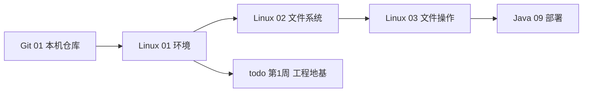

# Linux 入门与环境搭建

<!-- 修改说明: 2026-06-30 按 EXPANSION-STANDARD 扩充 §0 读前导读、命令步骤表、FAQ、闭卷自测、费曼检验；环境假设 VMware Ubuntu（见 todo.md） -->

## 0. 读前导读（零基础也能跟上）

> **读者假设**：你会用 Windows 开机关软件；[todo.md](../../todo.md) 已把 **VMware + Ubuntu** 定为暑假工程地基。本章在虚拟机里搭好 Linux 练习环境，不要求会编程。

### 0.1 用一句话弄懂本章

**一句话**：在 **VMware** 里装一台 **Ubuntu 虚拟机**，打开终端（黑屏打字），跑通 `pwd`、`whoami` 等第一批命令，并（可选）与 Windows 的 `F:\study` 共享文件夹——以后部署 jar、Docker、SSH 都在这台「模拟服务器」上练。

**生活类比——虚拟机 vs 真服务器**：

| 概念 | 生活类比 | 本章对应 |
|------|----------|----------|
| **Windows 宿主机** | 你的真实笔记本 | 装 VMware、Cursor 写代码 |
| **Ubuntu 虚拟机（VM）** | 笔记本里再跑一台「小电脑」 | 暑假 Linux 主战场 |
| **终端 / Shell** | 对电脑「发文字指令」的窗口 | `Ctrl+Alt+T` 打开 |
| **家目录 `~`** | 你的个人抽屉 | `/home/study` |
| **共享文件夹** | Windows 与 Ubuntu 共用的 USB 桥 | `/mnt/hgfs/study` |

**为什么重要**：大厂后端服务跑在 Linux 上；本地 VMware 可反复重装、不怕敲错命令；与 [Java 09](../../后端学习/Java/09-LinuxDockerNginx部署基础.md) 部署、`todo.md` 第 1 周「每日 Linux 3～5 条命令」直接衔接。

**本章用到的地方**：§2 装 VM、§4 第一批命令、§5 共享、§8 验证清单。

---

### 0.2 你需要提前知道什么（真不会就先跳到哪一章）

| 你现在的水平 | 建议动作 |
|--------------|----------|
| 从未装过虚拟机 | **从 §2 手把手跟做**，预留 2～3 小时 |
| VMware 已装、Ubuntu 能进桌面 | 跳过 §2.2～2.3，从 §2.4 更新系统开始 |
| 终端能开但命令全忘 | 直接 §4 + §8 验证清单 |
| 想练文件操作命令 | 先完成本章，再学 [03 文件与目录操作命令](./03-文件与目录操作命令.md) |
| 想认 `/etc`、`/var/log` | 本章 §8 通过后学 [02 文件系统与目录结构](./02-文件系统与目录结构.md) |

**最低门槛**：会下载 ISO、会记 Ubuntu 登录密码；Windows 上 [Git 01](../../前端学习/Git/01-Git入门与安装配置.md) 可选（§8.6 会在 Linux 里 `git init`）。

---

### 0.3 本章知识地图（学完后应能勾选全部 ☐→☑）

- [ ] 在 VMware 里创建并启动 Ubuntu 24.04（或 22.04）虚拟机
- [ ] 用 `Ctrl+Alt+T` 打开终端，读懂提示符 `用户名@主机名:路径$`
- [ ] 会 `pwd`、`whoami`、`uname -a`、`ls`、`date`、`clear`
- [ ] 跑通 `sudo apt update && sudo apt upgrade` 且无 `E:` 错误
- [ ] 知道 `~` 等于 `/home/你的用户名`
- [ ] （可选）Windows `F:\study` 在 Ubuntu 里 `ls /mnt/hgfs/study` 可见
- [ ] 在 `~/study/linux-practice` 创建练习目录
- [ ] 知道 SSH 是「远程登录」，可选练 `ssh localhost`
- [ ] 能一句话说明 VMware 与 WSL 的区别
- [ ] §8 验证清单 ≥ 7 项通过
- [ ] 闭卷自测 10 题正确 ≥ 8 题

---

### 0.4 建议学习时长与节奏

| 阶段 | 建议时间 | 做什么 |
|------|----------|--------|
| 通读 §0 + 本章关系 | 20 分钟 | 建立「VM = 模拟服务器」心智 |
| 跟做 §2 安装 Ubuntu | 1.5～2.5 小时 | 含下载 ISO、首次安装、重启 |
| §3～§4 终端与第一批命令 | 40 分钟 | **每条命令手敲**，对照预期输出 |
| §5 共享文件夹 | 30 分钟 | 装 open-vm-tools、验证 hgfs |
| §8 完整验证清单 | 30 分钟 | 打勾 8 项后再进 02 章 |
| 自测 + FAQ + 费曼 | 30 分钟 | 闭卷自测 + 向同学口述 3 分钟 |

**节奏建议**（对齐 [todo.md](../../todo.md) 第 1 周）：装完 VM 后 **每天 15～30 分钟** 开机 → 终端 → `pwd` `ls` `cd ~`，比一次啃完 700 行更有效。

---

### 0.5 学完本章你能做什么（可验证的具体动作）

1. **启动** VMware 中 `Ubuntu-Linux-Study`，进入桌面并打开终端。
2. **执行** `whoami` → 输出你的用户名；`pwd` → 输出 `/home/用户名`。
3. **更新** 软件源：`sudo apt update`，末尾无 `E:` 报错。
4. **创建** `~/study/linux-practice` 并在其中 `git init`（见 §8.6）。
5. **（可选）** `cat /mnt/hgfs/study/todo.md | head -n 3` 看到「个人暑假学习计划」标题。
6. **向他人解释**：为什么后端要用 Linux 练手而不是只看书（结合 jar 部署场景）。

---

### 0.6 本章术语首次出现速查（生活类比版）

| 术语（English） | 一句话 | 生活类比 |
|-----------------|--------|----------|
| **虚拟机 VM（Virtual Machine）** | 软件模拟的一台完整电脑 | 在房间隔出「练习间」，弄坏了重装，不动主卧（Windows） |
| **终端 Terminal** | 用文字输入命令的窗口 | 餐厅后厨对讲机：说「上一份面」而不是点图标 |
| **Shell** | 解释你输入命令的程序 | 对讲机那头听懂指令的服务员（Ubuntu 默认多为 bash） |
| **sudo** | 以管理员身份执行一条命令 | 临时拿店长钥匙开库房 |
| **apt** | Ubuntu 装软件/更新的包管理器 | 应用商店 + 系统更新合一 |
| **SSH（Secure Shell）** | 加密的远程登录 | 用加密视频电话操作远处那台服务器 |
| **VMware Tools / open-vm-tools** | 让 VM 与宿主机更好协作（共享文件夹等） | 练习间与主卧之间的专用通道 |

---

## 本章与上一章的关系

本系列是 **`后端学习/Linux/`** 独立路线，面向大一后端/全栈方向。你在 [todo.md](../../todo.md) 里已把 **VMware + Ubuntu** 定为暑假「工程地基」Week 1 的主环境；若已跟过 [Git 01](../../前端学习/Git/01-Git入门与安装配置.md)，本机 Git 与练习仓库应已就绪——**Linux 虚拟机是后端部署、Docker、Nginx 的「真实服务器替身」**。

[Java 09](../../后端学习/Java/09-LinuxDockerNginx部署基础.md) 会用到本章环境：在 Ubuntu 里跑 jar、查日志、用 docker-compose 起 MySQL/Redis。若 Java 09 里的 Linux 命令看着吃力，**先完成本章 01～03**，再回去读 09 会顺很多。

这一章你要完成：

1. 在 **VMware Workstation** 里安装并首次启动 **Ubuntu 24.04 LTS**（或 22.04）
2. 打开终端，理解「Shell / 命令行 / 图形界面」的关系
3. 跑通第一批命令：`pwd`、`whoami`、`uname`、`ls`、`date`
4. 配置 **Windows ↔ Ubuntu 文件夹共享**（把 `f:\study` 或项目目录带进去）
5. 预览 **SSH** 是什么（02～04 章会实操远程登录）
6. 知道 **VMware Ubuntu vs WSL** 怎么选（本资料以 VMware 为主）
7. 完成 **环境验证清单**，达到「能每天开机练命令」的状态

若你正在学 [Git 02](../../前端学习/Git/02-本地版本控制核心操作.md)，可在 Ubuntu 终端里 `git clone` 同一练习仓库——**Windows 写代码、Linux 练部署** 是常见组合。

---

## 1. 为什么后端必须会一点 Linux

真实后端服务几乎都在 **Linux 服务器**上跑：Spring Boot jar、MySQL、Redis、Nginx、Docker。你在 Windows + IDEA 里能跑通 demo，上线时却要回答：

| 场景 | 需要 Linux 能力 |
|------|-----------------|
| 部署 jar | `java -jar`、`nohup`、看进程 |
| 查故障 | `tail -f` 日志、`ss` 看端口 |
| 装中间件 | apt 装包、改配置文件 |
| 联调 | 防火墙、curl 测接口 |
| 面试 | 「你们服务部署在什么环境？」 |

**大一目标**：不是成为运维专家，而是 **不怕黑屏、会 cd/ls、能 SSH 进机器、能跟文档敲命令**。本章只搭环境；命令细节在 02、03 章展开。

```mermaid
flowchart TB
  subgraph win [Windows 宿主机]
    IDE[IDEA / VS Code / Cursor]
    Git[Git 练习]
    VMware[VMware Workstation]
  end
  subgraph vm [Ubuntu 虚拟机]
    Shell[终端 Shell]
    Study[/home/你的用户名/study]
    Future[未来: jar / Docker / Nginx]
  end
  IDE -->|编辑代码| Git
  Git -->|push / pull| Remote[GitHub]
  VMware --> vm
  win -->|共享文件夹| Study
  Shell --> Future
```

---

## 2. VMware 安装 Ubuntu（手把手全流程）

### 2.1 准备材料

| 项 | 建议 |
|----|------|
| VMware | **VMware Workstation Pro** 或 **Player**（学校实验版/个人版均可） |
| ISO | [Ubuntu Desktop 24.04 LTS](https://ubuntu.com/download/desktop)（64-bit） |
| 磁盘 | 虚拟机 **≥ 40 GB**，宿主机剩余 **≥ 20 GB** |
| 内存 | 分给 VM **≥ 4 GB**（8 GB 宿主机时给 4 GB；16 GB 宿主机可给 6～8 GB） |
| CPU | **2 核** 起 |

国内下载慢可搜「Ubuntu 清华镜像 iso」。

### 2.2 新建虚拟机

| 步骤 | 你的动作 | 预期看到什么 | 若不对 |
|------|----------|--------------|--------|
| 1 | VMware → **Create a New Virtual Machine** | 新建向导第一页 | 菜单无此项 → 确认装的是 Workstation/Player |
| 2 | 选 **Installer disc image file (iso)** → 浏览选中 `ubuntu-24.04-desktop-amd64.iso` | ISO 路径显示在框内 | 灰显 → 先下载 64-bit Desktop ISO |
| 3 | 客户机 OS：**Linux** → **Ubuntu 64-bit** | 类型为 Linux / Ubuntu | — |
| 4 | 名称 `Ubuntu-Linux-Study`；位置勿放满盘 C 盘 | 路径如 `D:\VMs\` | 磁盘满 → 换盘符 |
| 5 | 磁盘 **40 GB+**；**Customize Hardware**：Memory **4096 MB**、CPU **2**、Network **NAT** | 硬件摘要正确 | 内存 <2GB → 调高否则安装卡 logo |
| 6 | Finish → **Power on** 启动 VM | Ubuntu 安装界面或 Live 桌面 | 黑屏 → 见 §11 报错表 |

详细选项说明：

1. VMware → **Create a New Virtual Machine**
2. 选 **Installer disc image file (iso)** → 浏览选中 `ubuntu-24.04-desktop-amd64.iso`
3. 客户机操作系统：**Linux** → **Ubuntu 64-bit**
4. 虚拟机名称：`Ubuntu-Linux-Study`；位置：默认或 `D:\VMs\`（别放 C 盘满盘）
5. 磁盘：**Split virtual disk** 或单文件均可；大小 **40 GB+**
6. **Customize Hardware**（重要）：
   - Memory：**4096 MB** 或更高
   - Processors：**2**
   - Network Adapter：**NAT**（初学默认即可，能上网）
   - 其他默认

### 2.3 安装 Ubuntu 向导（关键选项）

启动 VM，进入安装界面：

| 步骤 | 建议 |
|------|------|
| 语言 | **中文（简体）** 或 English（命令行资料中英对照） |
| 键盘 | 中文默认 |
| 更新与其他软件 | 选 **正常安装**；勾选 **下载更新**（有网时） |
| 安装类型 | **清除整个磁盘**（仅影响虚拟磁盘，**不会**删 Windows 文件） |
| 时区 | **Shanghai**
| 你的姓名 / 计算机名 / 用户名 / 密码 | 自己记牢；**用户名建议小写英文**，如 `study` |
| 完成后 | 重启 → 提示按 Enter 弹出 ISO → 进桌面 |

**预期**：重启后看到 Ubuntu 桌面，右上角有网络图标。

### 2.4 首次登录后：系统更新

按 `Ctrl + Alt + T` 打开终端，按表顺序执行：

| 步骤 | 你的动作 | 预期看到什么 | 若不对 |
|------|----------|--------------|--------|
| 1 | `sudo apt update` | 末尾 `Reading package lists... Done`，无 `E:` 行 | 见 §11「Temporary failure resolving」 |
| 2 | 输入 Ubuntu 登录密码（输入时不显示字符） | 回车后继续下载索引 | `sudoers` 报错 → 用安装时创建的主用户 |
| 3 | `sudo apt upgrade -y` | 进度条跑完，无 `E:` | `Could not get lock` → 等几分钟或重启 VM |
| 4 | `sudo reboot` | VM 重启，重新登录桌面 | 卡死 → 强制重启 VM 再试 |

```bash
sudo apt update
```

**预期输出**（末尾类似）：

```text
Reading package lists... Done
Building dependency tree... Done
Reading state information... Done
All packages are up to date.
```

```bash
sudo apt upgrade -y
```

**预期**：可能下载数百 MB，进度条跑完无 `E:` 错误即成功。

```bash
sudo reboot
```

---

## 3. 终端基础：Shell 是什么

### 3.1 图形界面 vs 终端

- **图形界面（GUI）**：桌面、文件管理器——像 Windows 资源管理器
- **终端（Terminal）**：文字界面，输入 **命令**，由 **Shell** 解释执行
- 默认 Shell 多为 **bash**（Ubuntu 24.04 默认可能是 bash，也可能装了 dash；入门当 bash 即可）

打开方式：

- 快捷键：`Ctrl + Alt + T`
- 或：应用程序 → 搜索「终端 / Terminal」

### 3.2 提示符长什么样

登录后常见：

```text
study@ubuntu-linux-study:~$
```

含义：

| 部分 | 含义 |
|------|------|
| `study` | 当前用户名（`whoami`） |
| `ubuntu-linux-study` | 主机名 |
| `~` | 当前目录是 **家目录** `/home/study` |
| `$` | 普通用户（root 是 `#`） |

### 3.3 命令的基本格式

```text
命令名 [选项] [参数]
```

示例：

```bash
ls -l /home
```

- `ls`：命令
- `-l`：选项（long 列表）
- `/home`：参数（路径）

**注意**：Linux **区分大小写**；`LS` 通常不存在。

---

## 4. 第一批命令：认识「我在哪、我是谁、什么系统」

> 以下均在 **VMware Ubuntu 终端** 执行；练习目录建议 `~/study/linux-practice`（01 章 §5.2 已建）。

| 步骤 | 命令 | 预期看到什么 | 若不对 |
|------|------|--------------|--------|
| 1 | `pwd` | `/home/你的用户名` | `command not found` → 见 §11 PATH |
| 2 | `whoami` | 与登录名一致，如 `study` | — |
| 3 | `uname` | 单行 `Linux` | — |
| 4 | `uname -a` | 含 `x86_64`、`Ubuntu`、`GNU/Linux` | — |
| 5 | `date` | 当前日期时间 | 时区不对 → 安装时选 Shanghai |
| 6 | `ls` | `Desktop` `Documents` 等 | 空目录也正常 |
| 7 | `clear` | 屏幕清空，无报错 | — |
| 8 | `ls --help \| head -n 5` | `ls` 用法前几行 | `\|` 管道 03 章详讲 |

### 4.1 pwd — 打印当前工作目录

```bash
pwd
```

**预期输出**：

```text
/home/study
```

（用户名不同则路径不同。）

### 4.2 whoami — 当前用户

```bash
whoami
```

**预期输出**：

```text
study
```

### 4.3 uname — 系统信息

```bash
uname
```

**预期输出**：

```text
Linux
```

```bash
uname -a
```

**预期输出示例**：

```text
Linux ubuntu-linux-study 6.8.0-XX-generic #XX-Ubuntu SMP PREEMPT_DYNAMIC ... x86_64 x86_64 x86_64 GNU/Linux
```

面试/文档里看到 `x86_64` 即 64 位 PC 架构。

### 4.4 补充：date、ls、clear

```bash
date
```

**预期输出**：

```text
Mon Jun 23 10:30:00 CST 2026
```

```bash
ls
```

**预期输出**（家目录可能为空或有个 `Desktop`、`Documents`）：

```text
Desktop  Documents  Downloads  Music  Pictures  Public  Templates  Videos
```

```bash
clear
```

**预期**：清屏，无报错。

### 4.5 用 --help 查命令（养成习惯）

```bash
ls --help | head -n 5
```

**预期**：打印 `ls` 用法前几行（`| head` 03 章详讲，这里知道「能查帮助」即可）。

---

## 5. Windows 与 Ubuntu 文件共享

后端学习时，常希望在 **Windows 用 Cursor 编辑**，在 **Ubuntu 里编译/运行/部署**。共享文件夹是最省事的桥梁。

### 5.1 VMware 共享文件夹（推荐）

**术语（共享文件夹 / Shared Folder）**：让 Windows 宿主机某个目录在 Ubuntu 里只读或可写访问。
**生活类比**：主卧书桌（`F:\study`）和练习间（Ubuntu）之间开一扇传文件的小窗。
**为什么重要**：[todo.md](../../todo.md) 在 Windows 用 Cursor 看 Markdown，在 Ubuntu 练命令/部署，不必两边复制粘贴。
**本章用到的地方**：§5.1、§8.5。

| 步骤 | 你的动作（Windows + Ubuntu） | 预期看到什么 | 若不对 |
|------|------------------------------|--------------|--------|
| 1 | VMware → **虚拟机** → **设置** → **选项** → **共享文件夹** → **总是启用** | 共享列表可添加 | 无选项 → 先完成 Ubuntu 安装 |
| 2 | **添加** 主机路径 `F:\study`，名称 `study`，勾选 **启用此共享** | 列表出现 `study` | 路径错 → 改成你仓库实际盘符 |
| 3 | Ubuntu：`sudo apt install -y open-vm-tools open-vm-tools-desktop` | 安装完成无 `E:` | 见 §11 包名错误 |
| 4 | `sudo reboot` 后登录 | 桌面正常 | — |
| 5 | `ls /mnt/hgfs/study` | 与 Windows `f:\study` 内容一致（含 `todo.md`） | 空目录 → 见 §11 hgfs 表 |

**宿主机 Windows**：

1. VMware 菜单 → **虚拟机** → **设置** → **选项** → **共享文件夹**
2. 选 **总是启用** → **添加** → 主机路径 `F:\study` → 名称 `study`
3. 勾选 **启用此共享**

**Ubuntu 客户机**（需先装 VMware Tools）：

```bash
sudo apt install -y open-vm-tools open-vm-tools-desktop
sudo reboot
```

重启后，共享通常在：

```text
/mnt/hgfs/study
```

验证：

```bash
ls /mnt/hgfs/study
```

**预期输出**（与你 Windows 的 `f:\study` 一致）：

```text
todo.md  前端学习  后端学习  ...
```

若 `/mnt/hgfs` 为空，见 §12 常见报错表。

### 5.2 在 Ubuntu 里建练习目录（不依赖共享也可）

```bash
mkdir -p ~/study/linux-practice
cd ~/study/linux-practice
pwd
```

**预期输出**：

```text
/home/study/study/linux-practice
```

### 5.3 路径对照（避免晕）

| Windows | Ubuntu（共享） | Ubuntu（本地） |
|---------|----------------|----------------|
| `F:\study` | `/mnt/hgfs/study` | — |
| `F:\study\projects` | `/mnt/hgfs/study/projects` | `~/study/linux-practice` |

**建议**：Daily 命令练习用 `~/study/linux-practice`；读仓库 Markdown 用共享路径只读即可。**不要**在共享目录里做大量小文件编译（慢），大项目编译放 Linux 本地磁盘。

---

## 6. SSH 入门预览（本章只建立概念）

**SSH（Secure Shell）** 是加密的远程登录协议。以后云服务器只有 IP，没有桌面，全靠：

```bash
ssh 用户名@服务器IP
```

本章 **不要求** 立刻连远程；只需知道：

| 概念 | 说明 |
|------|------|
| 客户端 | Ubuntu 自带 `ssh`；Windows 可用 PowerShell 的 `ssh` |
| 服务端 | `openssh-server` 装在**被登录的那台机器** |
| 密钥登录 | `ssh-keygen` 生成公钥，免密登录（04 章前后实操） |
| 与后端关系 | 部署 jar、看 `/var/log`、docker 命令，都在 SSH 会话里 |

**本机预览**（可选）：

```bash
sudo apt install -y openssh-server
systemctl status ssh --no-pager
```

**预期输出**（片段）：

```text
Active: active (running)
```

```bash
ssh localhost
```

第一次会问 `yes/no` → 输入 `yes` → 输入密码 → 出现远程提示符 → 输入 `exit` 退出。

---

## 7. VMware Ubuntu vs WSL 简要对比

[todo.md](../../todo.md) 已定 VMware；仍有人会问 WSL：

| 对比项 | VMware Ubuntu | WSL2（Windows 子系统） |
|--------|---------------|------------------------|
| 本质 | 完整虚拟硬件 + Guest OS | Windows 上的 Linux 内核 + 发行版 |
| 与 Windows 集成 | 需共享文件夹 | 直接访问 `\\wsl$\`、路径互访方便 |
| 资源占用 | 较高（整 VM 内存） | 相对较低 |
| 网络/防火墙 | 独立 NAT，更像真服务器 | 与 Windows 网络耦合，排查略不同 |
| Docker | 在 VM 里装 Docker（09 章） | Docker Desktop + WSL 后端很常见 |
| 本资料 | ✅ **主环境** | 可作补充，章节以 VMware 为准 |
| 面试说法 | 「本地用 VMware 模拟 Linux 服务器练部署」 | 「开发机 WSL 方便，生产仍是 Linux 云主机」 |

**结论**：跟本仓库走 **VMware**；WSL 不冲突，但 02～03 章路径、挂载、VMware Tools 以 VM 为准。

---

## 8. 手把手实操：环境验证清单（完整走一遍）

按顺序打勾，**全部通过** 再进 02 章。

### 8.1 虚拟机与网络

```bash
# 1. 能上网
ping -c 3 www.baidu.com
```

**预期输出**：

```text
3 packets transmitted, 3 received, 0% packet loss
```

```bash
# 2. 系统版本
cat /etc/os-release | head -n 2
```

**预期输出**：

```text
PRETTY_NAME="Ubuntu 24.04 LTS"
NAME="Ubuntu"
```

（22.04 则显示 22.04，均可。）

### 8.2 用户与权限

```bash
whoami
id
```

**预期输出示例**：

```text
study
uid=1000(study) gid=1000(study) groups=1000(study),...
```

### 8.3 基础命令三连

```bash
cd ~
pwd
uname -a
ls
date
```

**预期**：无 command not found；`pwd` 为 `/home/你的用户名`。

### 8.4 包管理可用

```bash
sudo apt install -y tree
tree --version
```

**预期输出**：

```text
tree v2.1.1 © 1996 - 2023 by Steve Baker, Thomas Moore, Francesc Rocher, Florian Sesser, Kyosuke Tokoro
```

（版本号略有不同无妨。）

### 8.5 共享文件夹（若已配置）

```bash
ls /mnt/hgfs/study/todo.md
```

**预期输出**：

```text
/mnt/hgfs/study/todo.md
```

（文件存在则 ls 无报错；或 `cat` 能看到 todo 标题。）

### 8.6 Git 在 Linux 里可用（与 Git 章联动）

```bash
sudo apt install -y git
git --version
```

**预期输出**：

```text
git version 2.43.0
```

```bash
cd ~/study/linux-practice
git init
git status
```

**预期输出**：

```text
Initialized empty Git repository in /home/study/study/linux-practice/.git/
On branch main
No commits yet
nothing to commit (create/copy files and use "git add" to track)
```

与 [Git 01](../../前端学习/Git/01-Git入门与安装配置.md) Windows 上流程一致，只是路径在 Linux。

### 8.7 创建本章学习笔记

```bash
cd ~/study/linux-practice
cat > linux-01-checklist.txt << 'EOF'
Linux 01 环境验证完成
日期: $(date)
用户: $(whoami)
主机: $(hostname)
EOF
cat linux-01-checklist.txt
```

**预期**：文件内容含你的用户名与日期（若 heredoc 里 `$(date)` 未展开，手动改一行也行，03 章会讲重定向）。

### 8.8 验证清单表格（打印自检）

| # | 检查项 | 命令/操作 | 通过 |
|---|--------|-----------|------|
| 1 | VM 能启动进桌面 | 目视 | ☐ |
| 2 | 终端能打开 | Ctrl+Alt+T | ☐ |
| 3 | 能 ping 通外网 | `ping -c 3 baidu.com` | ☐ |
| 4 | `pwd` / `whoami` / `uname -a` 正常 | §4 | ☐ |
| 5 | `sudo apt update` 无 E 错误 | §2.4 | ☐ |
| 6 | 共享文件夹能看到 study（可选） | `ls /mnt/hgfs/study` | ☐ |
| 7 | `git --version` 有输出 | §8.6 | ☐ |
| 8 | `~/study/linux-practice` 已创建 | §5.2 | ☐ |

---

## 9. 与 Java 09、暑假计划的衔接

[todo.md](../../todo.md) **第 1 周**要求：Git、Linux、Java 基础三位一体。本章完成后：

- **每日 15 分钟**：Ubuntu 开机 → 终端 → `pwd` `ls` `cd`（02、03 章扩展）
- **Java 09**：在**同一台 VM**里练习 `java -jar`、`docker`、`nginx`——不必另装系统
- **Git**：Linux 里 `git clone` 你的 GitHub 练习仓，commit 仍在 Windows 或 Linux 均可



---

## 10. 深入解释：两个「为什么」

### 10.1 为什么后端练 Linux 要用虚拟机而不是只看书？

**场景**：你在 Windows 上看了 100 页命令大全，第一次 SSH 上云服务器，连 `cd /var/log` 和 `Ctrl+C` 取消命令都不确定——部署文档第一步就卡住。

虚拟机提供 **可毁可重建** 的 Linux：

- 误删文件？快照还原或重装 VM
- 练 `sudo`、`apt`、`systemctl` 无心理负担
- 网络、磁盘、多用户更接近 [Java 09](../../后端学习/Java/09-LinuxDockerNginx部署基础.md) 里的生产形态

WSL 也能练，但 VMware **隔离更彻底**，适合模拟「只有 SSH 的一台云主机」。

### 10.2 为什么安装 Ubuntu 时选「清除整个磁盘」仍然安全？

安装程序里的「磁盘」指的是 **VMware 虚拟磁盘文件**（如 `Ubuntu-Linux-Study.vmdk`），**不是**你笔记本的 C 盘/D 盘。只要 ISO 安装只在 VM 向导里进行、没有误把 Windows 物理盘当安装目标，**Windows 文件不会被格式化**。

**仍要小心**：若用 **U 盘物理机安装** Ubuntu 并选错盘，才会删真数据——那是另一流程，本资料不做。

---

## 11. 常见报错与排查

| 报错信息（关键词） | 可能原因 | 解决方案 |
|-------------------|---------|---------|
| `Temporary failure resolving` / ping 100% loss | VM 无网络 | VMware 网络选 NAT；Windows 宿主机先能上网；VM 设置里恢复默认网络 |
| `Could not get lock /var/lib/dpkg/lock` | 另一个 apt 正在跑 | 等几分钟；或重启 VM 后再 `sudo apt update` |
| `E: Unable to locate package` | 包名错或未 update | `sudo apt update` 后重试；检查拼写 |
| `sudo: command not found` | 极简镜像无 sudo | 用 root 或 `su -`；Desktop Ubuntu 一般自带 sudo |
| `study is not in the sudoers file` | 用户无管理员权限 | 安装时应用主用户；或进 recovery 加 sudo 组（进阶） |
| `/mnt/hgfs` 为空 | VMware Tools 未装或未启用共享 | 装 `open-vm-tools-desktop`；虚拟机设置里启用共享文件夹 |
| `bash: ls: command not found` | PATH 损坏或进错环境 | `echo $PATH`；重启；勿乱改 profile |
| 虚拟机黑屏 / 卡 logo | 内存不足或 3D 加速问题 | VM 内存调到 4GB+；显示设置关 3D 或换兼容模式 |
| `ssh: connect to host localhost port 22: Connection refused` | sshd 未装或未启动 | `sudo apt install openssh-server`；`sudo systemctl start ssh` |
| 中文输入法乱码 / 终端方块 |  locale 或字体 | `sudo apt install language-pack-zh-hans`；重启 |
| 共享路径 Permission denied | hgfs 挂载权限 | 用 `sudo usermod -aG fuse $USER` 后重登；或复制到 `~/study` 再练 |
| 安装 Ubuntu 找不到磁盘 | 未新建虚拟磁盘 | 向导里添加 40GB 磁盘后再装 |

---

## 12. 分级练习

**基础**：开机 → 打开终端 → 依次执行 `whoami`、`pwd`、`uname -a`、`date`，把四条输出复制到 `~/study/linux-practice/day1.txt`。

**进阶**：配置 VMware 共享 `F:\study`，在 Ubuntu 里 `cat /mnt/hgfs/study/todo.md | head -n 5`，确认能看到「个人暑假学习计划」标题。

**挑战**：安装 `openssh-server`，在 **Windows PowerShell** 里 `ssh study@虚拟机IP` 登录（VM IP 用 Ubuntu 里 `ip a` 看 `192.168.x.x`）；登录后 `pwd` 再 `exit`。

### 12.1 参考答案（基础）

```bash
cd ~/study/linux-practice
{
  echo "=== Linux Day 1 ==="
  whoami
  pwd
  uname -a
  date
} > day1.txt
cat day1.txt
```

**预期**：`day1.txt` 含四段输出，无 error。

### 12.2 参考答案（进阶）

```bash
ls /mnt/hgfs/study/todo.md
head -n 5 /mnt/hgfs/study/todo.md
```

**预期输出首行**：

```text
# 个人暑假学习计划（2026 · 大一升大二）
```

### 12.3 参考答案（挑战）

Ubuntu 内：

```bash
sudo apt install -y openssh-server
ip -4 addr show | grep inet
```

记下 `192.168.xxx.xxx`（NAT 网段）。Windows PowerShell：

```powershell
ssh study@192.168.xxx.xxx
```

输入 Ubuntu 密码 → 提示符变为 `study@...` → `pwd` 输出 `/home/study` → `exit`。

---

## 13. 练习建议

| 时段 | 内容 | 时长 |
|------|------|------|
| 每天 | 开机 VM，终端里 `pwd` `ls` `cd ~`，熟悉提示符 | 5～10 分钟 |
| 第 1 周 | 跟完 01～03 章 + [Git 01～02](../../前端学习/Git/01-Git入门与安装配置.md) | 按 [todo.md](../../todo.md) |
| 周末 | 重做 §8 验证清单，打满 8 项 | 30 分钟 |
| 习惯 | 重要命令在本章笔记里**手敲一遍**，少复制粘贴 | 长期 |

**与 Windows 分工**：Markdown 阅读、Vue/Java 编码可在 Windows；**所有「像在服务器上」的操作**在 Ubuntu VM 练。

---

## 14. 本章知识点清单（可自查）

- [ ] VMware 里 Ubuntu 能正常开关机
- [ ] 会用 `Ctrl+Alt+T` 开终端
- [ ] 会 `pwd`、`whoami`、`uname -a`、`ls`、`date`
- [ ] 跑通 `sudo apt update && sudo apt upgrade`
- [ ] 知道 `~` 和 `/home/用户名` 的关系
- [ ] （可选）共享文件夹能访问 `f:\study`
- [ ] 知道 SSH 是远程登录，本章可选练 `ssh localhost`
- [ ] 能说明 VMware 与 WSL 的区别（一句）
- [ ] §8 验证清单 ≥ 7 项通过

---

## 15. 学完标准

完成本章后，你应能**不看文档**完成：

1. 启动 VMware Ubuntu，打开终端，执行 `pwd` / `whoami` / `uname -a` 并读懂输出
2. 使用 `sudo apt update` 更新软件源（知道要输入用户密码）
3. 在 `~/study/linux-practice` 下 `git init` 或 `mkdir` 练习目录
4. 向他人解释：**为什么后端要用 Linux 练手**（结合 Java 部署场景）
5. 完成 §8 环境验证清单

**量化自检**：

- [ ] 连续 3 天成功开机进入 Ubuntu 终端
- [ ] `ping -c 3 baidu.com` 0% packet loss
- [ ] 练习目录路径能脱口而出（如 `/home/study/study/linux-practice`）

---

---

## 16. 常见问题 FAQ

**Q：必须装 VMware 吗？WSL 行不行？**  
[todo.md](../../todo.md) 定 **VMware + Ubuntu** 为主环境；WSL 可作补充，但本系列共享文件夹、网络排查以 VM 为准（见 §7）。

**Q：Ubuntu 22.04 和 24.04 选哪个？**  
都可以；24.04 LTS 更新，22.04 资料更多。命令差异对本章可忽略。

**Q：`sudo` 密码是什么？**  
安装 Ubuntu 时你为 **主用户** 设的登录密码；输入时终端 **不显示星号**，正常。

**Q：共享文件夹 `/mnt/hgfs` 为空？**  
先装 `open-vm-tools-desktop` 并重启；确认 VMware 设置里共享已启用且路径正确（见 §11）。

**Q：能不能直接在 Windows 练 Linux 命令？**  
WSL 或 Git Bash 能练一部分，但 **部署、systemd、/var/log** 等仍建议 VMware 完整 Ubuntu。

**Q：VM 占内存太大怎么办？**  
宿主机 8GB 内存给 VM 4GB 是 [todo.md](../../todo.md) 建议下限；练命令时可关 Windows 浏览器多余标签。

**Q：安装时「清除整个磁盘」会删 Windows 吗？**  
不会，那是 **虚拟磁盘**（见 §10.2）；切勿在 **物理机 U 盘安装** 时选错盘。

**Q：每天练多久够？**  
[todo.md](../../todo.md)：**20～30 分钟**、3～5 条命令；本章 §8 通过后可进 02、03 章。

---

## 17. 闭卷自测

> 先遮住「自测参考答案」，在 VMware Ubuntu 终端或纸上作答。

### 概念题（6 道）

1. 用生活类比说明 **虚拟机** 与 **Windows 宿主机** 的关系。
2. **终端** 和 **Shell** 分别是什么？Ubuntu 默认 Shell 入门当什么即可？
3. 提示符 `study@ubuntu-linux-study:~$` 里 `~` 和 `$` 各表示什么？
4. 为什么后端开发要在 Linux 环境练手？举 **部署 jar** 或 **查日志** 一个场景。
5. **SSH** 解决什么问题？本章为什么只要求建立概念？
6. VMware **NAT** 网络对初学者有什么意义（一句话）？

### 动手题（2 道）

7. 在 Ubuntu 终端依次执行：`cd ~` → `mkdir -p ~/study/linux-practice` → `pwd` → `whoami` → `uname -a`。写出 `pwd` 和 `whoami` 的预期形式。
8. 执行 `sudo apt update` 后，如何用 **一行命令** 判断外网是否通？预期成功输出含什么关键词？

### 综合题（2 道）

9. [todo.md](../../todo.md) 要求 Windows 与 Ubuntu 文件共享：写出 Windows 路径、Ubuntu 挂载路径、以及验证用的 `ls` 命令。
10. §8 验证清单 8 项中，若 **第 3 项 ping 失败** 但 **第 5 项 apt 成功**，可能说明什么？应查 §11 哪一类报错？

### 自测参考答案

1. VM 像笔记本里隔出的练习间，弄坏可重装；宿主机是真实 Windows，装 VMware 和 IDE。
2. 终端是打字下命令的窗口；Shell 是解释命令的程序；入门当 bash 即可。
3. `~` = 当前用户家目录；`$` = 普通用户（root 为 `#`）。
4. 例：生产 Spring Boot 用 `java -jar`、日志在 `/var/log`；不会 SSH/cd 则部署文档第一步卡住。
5. SSH = 加密远程登录云服务器；本章先搭本地 VM，04 章前后再实操密钥登录。
6. NAT 让 VM 通过宿主机上网，初学默认即可，无需手配桥接。
7. `pwd` → `/home/study/.../linux-practice`（用户名不同则路径不同）；`whoami` → 你的登录名。
8. `ping -c 3 www.baidu.com`；成功含 `3 received` 或 `0% packet loss`。
9. Windows `F:\study` → Ubuntu `/mnt/hgfs/study` → `ls /mnt/hgfs/study/todo.md`。
10. apt 走软件源可能仍通，ping 失败多为 DNS 或 ICMP 被拦；查 §11「Temporary failure resolving / ping 100% loss」。

---

## 18. 费曼检验

**任务**：请在不看资料的情况下，用 **3 分钟** 向没学过 Linux 的同学解释「为什么暑假要用 VMware 装 Ubuntu 练后端」。

**对照提纲**（说完后自检是否覆盖）：

1. **问题**：真实服务器是 Linux，只在 Windows 上看命令大全，第一次 SSH 容易懵。
2. **方案**：VMware = 可反复重装的练习机；与 Windows 分工：Cursor 写代码、Ubuntu 练部署。
3. **本章成果**：能开终端、`pwd`/`whoami`、apt 更新、（可选）共享 `F:\study`。

若同学能复述「VM 模拟服务器 + 终端下命令」，本章核心已掌握。

---

## 19. 下一章预告

01 章你已有 **可工作的 Ubuntu 终端** 和 **第一批认知命令**。但一进入 `/etc`、`/var/log` 或后端文档里的路径，容易晕：**绝对路径和相对路径有什么区别？`/home` 和 `/root` 谁能写？inode 是什么？软链接和硬链接？**

下一章（**02 文件系统与目录结构**）讲 **FHS 标准目录**、路径规则、**inode 与链接**、`df`/`du` 看磁盘、`tree` 看结构，并预览 **`/proc`**——为 03 章大量文件操作命令打地基。练完 02，再读 [Java 09](../../后端学习/Java/09-LinuxDockerNginx部署基础.md) 里的路径与日志目录会轻松很多。

---

**继续学习**：[02 文件系统与目录结构](./02-文件系统与目录结构.md)
