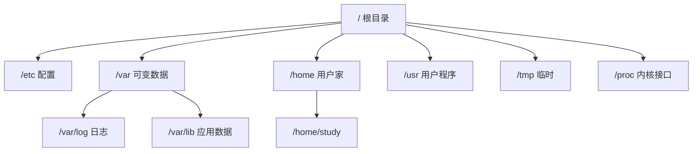

# 文件系统与目录结构

<!-- 修改说明: 2026-06-30 按 EXPANSION-STANDARD 扩充 §0、命令步骤表、FAQ、闭卷自测、费曼检验 -->

## 0. 读前导读（零基础也能跟上）

> **读者假设**：你已在 **VMware Ubuntu**（[01 章](./01-Linux入门与环境搭建.md)）里打开终端，建好 `~/study/linux-practice`，会 `pwd`、`ls`、`cd`。[todo.md](../../todo.md) 第 1 周要求每天练 Linux 命令——本章让你 **认路**，03 章再 **动手建删文件**。

### 0.1 用一句话弄懂本章

**一句话**：Linux 整台机器是一棵以 **`/`** 为根的目录树；**`/etc` 放配置、`/var` 放会变的数据（日志）、`/home` 放用户家目录**——认路后再练 `mkdir`/`cp` 才不会删错盘。

**生活类比——整栋楼 vs 房间号**：

| 路径 | 生活类比 | 后端场景 |
|------|----------|----------|
| `/` | 大楼总前台 | 所有绝对路径起点 |
| `/etc` | 物业规定、开关配置箱 | Nginx、MySQL 配置文件 |
| `/var/log` | 保安值班日志本 | Spring Boot / 系统日志 |
| `/home/study` | 你的宿舍 | 代码、练习目录 |
| `/tmp` | 临时堆放区 | 编译中间文件 |
| `/mnt/hgfs/study` | 与 Windows 连通的传物窗口 | [01 章](./01-Linux入门与环境搭建.md) 共享 `F:\study` |

**为什么重要**：[Java 09](../../后端学习/Java/09-LinuxDockerNginx部署基础.md) 里 `/var/log`、`/etc/nginx` 不再陌生；面试常问 FHS、inode、软链区别。

**本章用到的地方**：§2 FHS、§3 路径、§5 链接、§9 路径地图实操。

---

### 0.2 你需要提前知道什么

| 水平 | 建议 |
|------|------|
| 01 章 §8 未通过 | 先完成 [01 环境验证](./01-Linux入门与环境搭建.md) §8 |
| 只会 `ls` 不懂输出 | 先读 01 §4，本章 §2.1 再 `ls /` |
| 已认 FHS，想练命令 | 本章 + [03 文件操作](./03-文件与目录操作命令.md) 连续学 |
| Windows 路径习惯 `C:\` | 牢记 Linux 用 **`/`** 且 **区分大小写** |

---

### 0.3 本章知识地图（学完后应能勾选全部 ☐→☑）

- [ ] 说出 `/etc`、`/var`、`/home`、`/usr`、`/tmp` 各一句用途
- [ ] 区分绝对路径与相对路径；会用 `.` `..` `~`
- [ ] 用 `ls -i` 看过 inode 号
- [ ] 做过硬链接 + 软链接实验并说明删源文件后区别
- [ ] 会用 `df -h`、`du -sh`、`df -i`
- [ ] 会用 `tree -L 2` 展示目录结构
- [ ] 读过 `/proc/cpuinfo` 或 `meminfo` 片段
- [ ] 完成 §9 `fhs-notes.md` 路径地图
- [ ] 闭卷自测 ≥ 8/10

---

### 0.4 建议学习时长与节奏

| 阶段 | 时间 | 内容 |
|------|------|------|
| §0 + §2 FHS | 45 分钟 | `ls /`、`ls /etc \| head` 实地看 |
| §3 路径 + §4 inode | 40 分钟 | `cd ..`、`ls -i` |
| §5 链接实验 | 30 分钟 | 在 `linux-practice` 必做 |
| §6～§8 df/du/tree/proc | 40 分钟 | |
| §9 路径地图 + 自测 | 45 分钟 | |

**每日 5 分钟**（[todo.md](../../todo.md)）：`df -h /` + `ls /var/log | head`。

---

### 0.5 学完本章你能做什么

1. 从 `/` 口述到 `~/study/linux-practice` 的 **绝对路径**。
2. 看到部署文档写 `/var/log/myapp` 知道是 **日志目录** 而非配置。
3. 用 `df -h` 判断根分区是否快满。
4. 创建硬链、软链并用 `ls -li` 对比 inode。
5. 用 `tree -L 2` 向他人展示练习目录结构。

---

### 0.6 术语首次出现速查

| 术语（English） | 一句话 | 生活类比 |
|-----------------|--------|----------|
| **FHS** | Linux 目录布局标准 | 全国商场统一「几楼餐饮、几楼服装」 |
| **inode** | 文件的元数据与磁盘块索引号 | 图书馆索书号，书名可改号不变 |
| **硬链接 hard link** | 多个文件名同一 inode | 同一人两个外号 |
| **软链接 symbolic link** | 存路径的快捷方式 | 门牌指向「请去 302」 |
| **挂载 mount** | 把分区/共享接到目录树上 | 把 U 盘插到 `/media` 这个「挂钩」 |

---

## 本章与上一章的关系

[01 章](./01-Linux入门与环境搭建.md) 你已在 VMware Ubuntu 里打开终端，跑通 `pwd`、`whoami`、`uname`，并建好 `~/study/linux-practice`。当时 `ls` 只看到 `Desktop`、`Documents` 等——**这些名字背后的「整棵目录树」是什么？为什么后端文档总写 `/var/log`、`/etc/nginx`？**

本章建立 **Linux 文件系统地图**：

1. **FHS** 标准： `/`、`/etc`、`/var`、`/home`、`/usr`、`/tmp` 各干什么
2. **绝对路径 vs 相对路径**，以及 `.` / `..` / `~` / `-`
3. **inode** 是什么（理解硬链接、磁盘满「有空间却写不进」）
4. **硬链接 vs 软链接**（`ln` / `ln -s`）
5. **挂载** 概念 + `df` / `du` 看空间
6. **`tree`** 可视化目录；**`/proc`** 预览（进程与内核信息的「假文件系统」）

03 章会在这些路径上大量练 `ls`、`cd`、`mkdir`、`cp`、`mv`、`rm`——**先懂结构，再练肌肉记忆**。与 [Java 09](../../后端学习/Java/09-LinuxDockerNginx部署基础.md) 的关系：部署 jar 时日志在 `/var/log` 或项目 `logs/`；Nginx 配置在 `/etc/nginx`；Docker 数据常在 `/var/lib/docker`——本章认路，09 章才找得到门。

[todo.md](../../todo.md) 第 1 周「Linux 每日练」：本章学完后，每天 `tree -L 2 /etc` 看两眼，熟悉「配置在 etc」的条件反射。

---

## 1. Linux 里「一切皆文件」

在 Linux 世界观里：

- 普通文本、目录、硬盘、键盘、进程信息……都可视为 **文件** 或通过文件接口访问
- 目录也是文件，内容是「文件名 → inode 编号」的列表
- `/proc/cpuinfo` 不是磁盘上的真实文本，但你可以 `cat` 它——内核实时生成

这对后端的意义：**日志是文件、配置是文件、管道和 socket 也走文件描述符**——[Git 02](../../前端学习/Git/02-本地版本控制核心操作.md) 里 `.git` 是目录树，Linux 整台机器也是一棵树，只是根在 `/`。



---

## 2. FHS：标准目录速查（必背）

**FHS（Filesystem Hierarchy Standard）** 规定常见 Linux 发行版目录用途。Ubuntu 基本遵循。

| 目录 | 含义 | 后端/运维常见用途 |
|------|------|-------------------|
| `/` | 根，整棵树顶点 | 所有绝对路径起点 |
| `/bin` | 基本命令（单用户模式也要用） | `ls`、`cp` 等（常链到 `/usr/bin`） |
| `/sbin` | 系统管理命令 | `ifconfig`、`reboot`（需 root 多） |
| `/etc` | **配置文件** | `nginx/`、`mysql/`、`apt/`、`ssh/` |
| `/home` | **普通用户家目录** | `/home/study`、项目代码常放这里 |
| `/root` | root 用户家 | 勿与普通用户混淆 |
| `/usr` | 用户级程序与库 | `/usr/bin/java`、`/usr/lib` |
| `/var` | **经常变化的数据** | `/var/log` 日志、`/var/lib/mysql` 数据 |
| `/tmp` | 临时文件，重启可清 | 临时上传、编译中间文件 |
| `/opt` | 可选第三方大包 | 有时厂商软件装这里 |
| `/dev` | 设备文件 | 磁盘 `/dev/sda` |
| `/proc` | 进程与内核信息（虚拟） | `cpuinfo`、`meminfo`、进程目录 |
| `/mnt` | 临时挂载点 | VMware 共享 `/mnt/hgfs` |
| `/media` | 可移动介质自动挂载 | U 盘 |

### 2.1 用 ls 实地看一眼（只读，别乱改）

在 **VMware Ubuntu 终端**执行：

| 步骤 | 命令 | 预期看到什么 | 若不对 |
|------|------|--------------|--------|
| 1 | `ls /` | `bin etc home var usr tmp ...` 等 | `No such file` → 不可能，检查是否拼成 `\` |
| 2 | `ls /etc \| head` | 多个 `.conf` 或目录名如 `apt` | Permission denied 个别文件可忽略 |
| 3 | `ls /var/log \| head` | `auth.log`、`syslog` 等 | 空 → 系统刚装也应有 bootstrap 类文件 |
| 4 | `ls -ld /home/$USER` | `drwxr-x---` 与您的用户名 | | 

```bash
ls /
```

**预期输出**（顺序可能不同）：

```text
bin  boot  dev  etc  home  lib  lib64  lost+found  media  mnt  opt  proc  root  run  sbin  srv  sys  tmp  usr  var
```

```bash
ls /etc | head
```

**预期输出**（示例）：

```text
adduser.conf
alternatives
apache2
apt
...
```

```bash
ls /var/log | head
```

**预期输出**：

```text
alternatives.log
apt
auth.log
bootstrap.log
...
```

**记忆口诀**：**etc 配，var 变，home 住，usr 程序，tmp 暂**。

---

## 3. 绝对路径与相对路径

### 3.1 绝对路径

从根 `/` 开始，唯一确定位置：

```text
/home/study/study/linux-practice/day1.txt
/etc/passwd
/var/log/syslog
```

### 3.2 相对路径

相对于 **当前工作目录**（`pwd`）：

| 符号 | 含义 |
|------|------|
| `.` | 当前目录 |
| `..` | 上一级目录 |
| `~` | 当前用户家目录 |
| `-` | 上一次 `cd` 前的目录（03 章 cd 详练） |

若当前在 `/home/study`：

```bash
cd study/linux-practice
pwd
```

**预期输出**：

```text
/home/study/study/linux-practice
```

```bash
cd ..
pwd
```

**预期输出**：

```text
/home/study
```

### 3.3 路径对照练习

```bash
cd ~
pwd
ls -d ./study ../study 2>/dev/null; ls -d ~/study/linux-practice
```

**预期**：`~/study/linux-practice` 与 `/home/study/study/linux-practice` 指向同一处（若 01 章已创建）。

### 3.4 后端文档里的路径习惯

| 写法 | 场景 |
|------|------|
| `/opt/app/app.jar` | 绝对路径部署 |
| `./start.sh` | 脚本同目录启动 |
| `../config/application.yml` | 相对上级配置 |
| `$HOME/logs` | 环境变量 + 相对家目录 |

[Java 09](../../后端学习/Java/09-LinuxDockerNginx部署基础.md) 启动 jar 时常写：

```bash
cd /home/study/app
java -jar app.jar
```

——先 **cd 到绝对路径**，再相对当前目录找 jar。

---

## 4. inode：文件系统的「身份证号」

### 4.1 是什么

- 每个文件/目录有一个 **inode**（index node），存元数据：权限、所有者、大小、时间戳、**数据块位置**
- 目录项 = 「文件名 + inode 号」
- **文件名不在 inode 里**——所以硬链接可以多个文件名指向同一 inode

### 4.2 查看 inode 号

```bash
ls -i /etc/passwd
```

**预期输出**（数字为你的实际 inode）：

```text
1234567 /etc/passwd
```

```bash
ls -li ~/study/linux-practice
```

**预期**：每行最左数字为 inode。

### 4.3 和磁盘满的关系（面试常问）

- 磁盘满有两种：**空间满**（块用完）和 **inode 满**（小文件极多，inode 用尽）
- 查 inode 使用率：

```bash
df -i /
```

**预期输出**（片段）：

```text
Filesystem      Inodes  IUsed   IFree IUse% Mounted on
/dev/sda3      6553600 200000 6353600    4% /
```

`IUse%` 若接近 100%，即使有「空闲空间」也无法创建新文件。

---

## 5. 硬链接与软链接

### 5.1 硬链接（hard link）

同一 inode，多个目录项；**不能跨文件系统**，**不能链目录**（普通用户）。

```bash
cd ~/study/linux-practice
echo "hello inode" > original.txt
ln original.txt hard-link.txt
ls -li original.txt hard-link.txt
```

**预期输出**（inode 相同）：

```text
789012 -rw-rw-r-- 2 study study 12 Jun 23 11:00 hard-link.txt
789012 -rw-rw-r-- 2 study study 12 Jun 23 11:00 original.txt
```

第二列 `2` 表示 **硬链接计数**。删一个名，另一个仍可访问：

```bash
rm original.txt
cat hard-link.txt
```

**预期输出**：

```text
hello inode
```

### 5.2 软链接 / 符号链接（symbolic link）

类似 Windows「快捷方式」，存的是 **目标路径**；可跨文件系统、可链目录。

```bash
ln -s hard-link.txt soft-link.txt
ls -li soft-link.txt
```

**预期输出**（inode 不同，箭头指向）：

```text
789013 lrwxrwxrwx 1 study study 13 Jun 23 11:01 soft-link.txt -> hard-link.txt
```

```bash
cat soft-link.txt
```

**预期输出**：

```text
hello inode
```

### 5.3 对比表

| 对比项 | 硬链接 | 软链接 |
|--------|--------|--------|
| 命令 | `ln 源 目标` | `ln -s 源 目标` |
| inode | 与源相同 | 新 inode |
| 删源文件 | 硬链接仍可用 | 链接失效（ dangling ） |
| 目录 | 一般不允许 | 允许 |
| 后端场景 | 少用 | 配置模板链到 `sites-enabled`（Nginx） |

---

## 6. 挂载（mount）与 df / du

### 6.1 挂载是什么

Linux 用一棵目录树访问所有存储：**把分区/共享/NFS「挂」到某个空目录**（挂载点），例如：

- 根分区 → `/`
- VMware 共享 → `/mnt/hgfs/study`（[01 章](./01-Linux入门与环境搭建.md)）

```bash
mount | head -n 5
```

**预期输出**（示例）：

```text
sysfs on /sys type sysfs (rw,nosuid,nodev,noexec,relatime)
proc on /proc type proc (rw,nosuid,nodev,noexec,relatime)
...
/dev/sda3 on / type ext4 (rw,relatime)
```

### 6.2 df — 看分区空间

```bash
df -h
```

**预期输出**（示例）：

```text
Filesystem      Size  Used Avail Use% Mounted on
tmpfs           392M  1.5M  391M   1% /run
/dev/sda3        39G  8.2G   29G  23% /
tmpfs           2.0G     0  2.0G   0% /dev/shm
```

- `-h`：human readable（G/M）
- 关注 `/` 的 **Use%**，部署前别满盘

### 6.3 du — 看目录占用

```bash
du -sh ~
du -sh /var/log
```

**预期输出**（大小因机器而异）：

```text
156M    /home/study
512M    /var/log
```

```bash
du -h --max-depth=1 ~/study 2>/dev/null
```

**预期**：列出 `linux-practice` 等子目录各占多少。

**后端场景**：日志暴涨 → `du -sh /var/log/* | sort -hr | head` 找大户（03 章配合 `find`）。

---

## 7. tree — 树形列出目录

01 章验证清单已装 `tree`：

```bash
tree -L 2 /etc/nginx 2>/dev/null || tree -L 1 /etc | head -n 20
```

若未装 Nginx，只看 `/etc` 一层：

```bash
tree -L 1 /home/study
```

**预期输出**（示例）：

```text
/home/study
├── Desktop
├── Documents
├── study
│   └── linux-practice
└── ...
```

常用选项：

| 选项 | 含义 |
|------|------|
| `-L n` | 最多 n 层 |
| `-d` | 只显示目录 |
| `-a` | 含隐藏文件 |
| `-h` | 显示大小（部分版本） |

在练习目录造结构（03 章会再用）：

```bash
mkdir -p ~/study/linux-practice/demo/{src,logs,config}
tree ~/study/linux-practice/demo
```

**预期输出**：

```text
/home/study/study/linux-practice/demo
├── config
├── logs
└── src

3 directories, 0 files
```

---

## 8. /proc 预览：活的内核窗口

`/proc` 是 **procfs**，不在磁盘上占真实空间，由内核动态提供。

### 8.1 看 CPU

```bash
cat /proc/cpuinfo | head -n 10
```

**预期输出**（片段）：

```text
processor       : 0
vendor_id       : GenuineIntel
cpu family      : 6
model           : ...
```

### 8.2 看内存

```bash
cat /proc/meminfo | head -n 5
```

**预期输出**：

```text
MemTotal:        8000000 kB
MemFree:         3200000 kB
MemAvailable:    4500000 kB
...
```

### 8.3 看当前进程 ID

```bash
echo $$
cat /proc/$$/cmdline | tr '\0' ' '; echo
```

**预期**：`$$` 是当前 shell 的 PID；`cmdline` 含 `bash` 等。

**与 Java 09 衔接**：`ps -ef | grep java` 看到的 PID，在 `/proc/PID/` 下有 `cwd`、`fd`、`status`——查进程工作目录、打开的文件（进阶运维）。

**注意**：`/proc` 下不要乱写；**只读为主**。

---

## 9. 手把手实操：绘制你的「后端路径地图」

目标：在 `~/study/linux-practice` 里用笔记 + 命令记录 **与 Spring Boot 部署相关** 的目录含义（即使还没部署，先认路）。

### 9.1 创建笔记文件

```bash
cd ~/study/linux-practice
cat > fhs-notes.md << 'EOF'
# 我的 FHS 笔记

## 与本机路径
- 家目录: 
- 练习目录: ~/study/linux-practice
- Java 09 会用的概念目录:
  - /var/log   → 系统与应用日志
  - /etc       → nginx、mysql 配置
  - /tmp       → 临时文件
  - /home/USER/app → 常见 jar 部署位置（自建）

## 今日命令记录
EOF
```

### 9.2 填家目录绝对路径

```bash
echo "- 家目录: $(cd ~ && pwd)" >> fhs-notes.md
tree -L 2 ~ >> fhs-notes.md 2>/dev/null || ls -la ~ >> fhs-notes.md
```

### 9.3 对比 df 与 du

```bash
df -h / >> fhs-notes.md
echo "---" >> fhs-notes.md
du -sh ~/study >> fhs-notes.md
```

### 9.4 链接实验归档

```bash
echo "demo link test" > link-demo.txt
ln link-demo.txt link-demo-hard.txt
ln -s link-demo.txt link-demo-soft.txt
ls -li link-demo*.txt >> fhs-notes.md
```

### 9.5 检查成果

```bash
wc -l fhs-notes.md
head -n 30 fhs-notes.md
```

**预期**：笔记 ≥ 20 行，含 tree 或 ls、df、inode 列表。

---

## 10. 与 Git、Java 的路径思维对照

| 概念 | Git（[Git 01](../../前端学习/Git/01-Git入门与安装配置.md)） | Linux 本章 |
|------|-----------------------------------------------------------|------------|
| 根 | 仓库根（含 `.git`） | `/` |
| 配置 | `.git/config` | `/etc` |
| 工作区文件 | 项目根下源码 | `/home/study/...` |
| 历史对象 | `.git/objects` | 不直接对应；数据库在 `/var/lib` |
| 忽略规则 | `.gitignore` | 无全局 ignore；临时放 `/tmp` |

clone 仓库后 **绝对路径** 示例：

```text
/home/study/projects/java-demo
```

在仓库里 **相对路径** 读配置：

```text
src/main/resources/application.yml
```

---

## 11. 深入解释：两个「为什么」

### 11.1 为什么配置放 `/etc` 而日志放 `/var/log`？

历史设计：**/etc** 来自 "Editable Text Configuration"；**/var** 来自 "variable data"。

- 配置 **读多写少**，升级时覆盖 `/etc/nginx/nginx.conf` 有明确语义
- 日志 **只增不减**，单独分区或挂盘时可只扩 `/var`，不动系统分区
- 权限分离：`/etc` 常需 root 改；应用写 `/var/log/myapp` 可给专用用户

**小案例**：Spring Boot 默认打日志到控制台；上线常 `--logging.file.path=/var/log/myapp` 或项目下 `logs/`——懂 FHS 后，你会选 **/var** 或 **家目录 app/**，而不是把 gigabytes 日志塞进 `/etc`。

### 11.2 为什么软链接在 Nginx / 开机脚本里很常见？

Nginx 站点配置：

```text
/etc/nginx/sites-available/default
/etc/nginx/sites-enabled/default  → 软链到 sites-available
```

启用站点 = **建链**，禁用 = **删链**，主文件不动。硬链接做不到「指向另一路径字符串」且不适合目录管理。

Java 侧类比：Maven `settings.xml` 有时链到 `~/.m2/settings.xml`——同一「一处改、多处生效」思路。

---

## 12. 常见报错与排查

| 报错信息（关键词） | 可能原因 | 解决方案 |
|-------------------|---------|---------|
| `No such file or directory` | 路径错、软链目标已删 | `ls -l` 查链；`pwd` 确认当前目录 |
| `Permission denied` | 无读/写/执行权限 | `ls -l` 看权限；`sudo` 或改所有者（03 章 chmod） |
| `Too many links` | 硬链接过多（罕见） | 换软链；硬链接不能链目录 |
| `Invalid cross-device link` | 硬链接跨分区 | 改用 `ln -s` |
| `df: command not found` | 极简环境 | `sudo apt install coreutils` |
| `tree: command not found` | 未安装 | `sudo apt install tree` |
| `/proc/xxx: No such file` | 进程已退出 | PID 失效；重新 `ps` 取新 PID |
| 挂载点 `Transport endpoint is not connected` | VMware hgfs 断开 | 重启 VM；重挂共享 |
| `du: cannot access` | 无权限目录 | `sudo du` 或跳过 |
| inode 100% | 海量小文件 | 清理缓存/日志；`df -i` 定位 |
| `ln: failed to create symbolic link` | 目标已存在 | 换名或 `rm` 旧链（确认再删） |
| 路径含空格未加引号 |  shell 拆词 | 用 `"` 或 `'` 包住路径 |

---

## 13. 分级练习

**基础**：不查资料写出 `/etc`、`/var/log`、`/home`、`/tmp`、`/usr/bin` 各一句用途；在终端用 `ls` 验证各目录存在。

**进阶**：在 `linux-practice` 建 `project/logs/app.log`（空文件即可），对 `logs` 做 `tree -L 2` 截图或复制输出；`du -sh project`。

**挑战**：对 `/etc/hosts` 做 **只读** 查看：`ls -li /etc/hosts` 记录 inode；**不要修改** hosts。说明为何改 hosts 能「假 DNS」（计网选读 [todo.md](../../todo.md) 计网章节）。

### 13.1 参考答案（基础）

```bash
for d in /etc /var/log /home /tmp /usr/bin; do
  echo "=== $d ==="
  ls -ld "$d"
done
```

**预期**：五个 `drwx` 或 `-rw` 行，无 No such file。

### 13.2 参考答案（进阶）

```bash
cd ~/study/linux-practice
mkdir -p project/logs
touch project/logs/app.log
tree project
du -sh project
```

**预期**：

```text
project
└── logs
    └── app.log
8.0K    project
```

### 13.3 参考答案（挑战）

```bash
ls -li /etc/hosts
cat /etc/hosts
```

**预期**：inode 一行；内容含 `127.0.0.1 localhost`。

**解释**：hosts 静态把域名映射到 IP，优先级常高于 DNS；改 `127.0.0.1 test.local` 则访问 `test.local` 走本机——**本练习不要改**，只理解机制。

---

## 14. 练习建议

| 时段 | 内容 |
|------|------|
| 每天 5 分钟 | `df -h /` 看磁盘；`cd /var/log && ls` 认文件名 |
| 本章周内 | 手画一遍 §2 目录树（纸笔或 Excalidraw） |
| 与 03 章衔接 | 先 `tree` 再 `mkdir/cp`，结构清晰少误删 |
| 面试 | 能答：inode、硬链/软链区别、FHS 五个目录 |

---

## 15. 本章知识点清单（可自查）

- [ ] 说出 FHS 中 `/etc`、`/var`、`/home`、`/usr`、`/tmp` 的作用
- [ ] 区分绝对路径与相对路径；会用 `.` `..` `~`
- [ ] 用 `ls -i` 看过 inode
- [ ] 做过硬链接 + 软链接实验
- [ ] 会用 `df -h` 和 `du -sh`
- [ ] 会用 `tree -L 2`
- [ ] 读过 `/proc/cpuinfo` 或 `meminfo` 片段
- [ ] 完成 §9 路径地图笔记

---

## 16. 学完标准

完成本章后，你应能**不看文档**：

1. 从 `/` 解释到 `/home/你的用户名/study/linux-practice` 的绝对路径
2. 用 `df -h` 判断根分区是否够用
3. 创建硬链接、软链接并说明删源文件后的区别
4. 看到 [Java 09](../../后端学习/Java/09-LinuxDockerNginx部署基础.md) 里的 `/var/log` 不再陌生
5. 用 `tree` 展示任意练习目录结构

**量化自检**：

- [ ] `fhs-notes.md` 或等价笔记已提交到 Git 练习仓（可选）
- [ ] 能默写 5 个 FHS 目录及用途

---

---

## 18. 常见问题 FAQ

**Q：`/etc` 和 `/usr` 都有 bin，有什么区别？**  
`/bin`、`/sbin` 保证单用户/救援时可用；`/usr/bin` 放更多用户态程序。Ubuntu 常把 `/bin` 链到 `/usr/bin`，认 FHS **语义** 即可。

**Q：inode 满了会怎样？**  
有大量小文件时可能 **有磁盘空间却无法新建文件**；用 `df -i /` 看 `IUse%`。

**Q：硬链接和复制文件一样吗？**  
不一样。硬链 **不复制数据块**，只多一个目录项；改一处两边都变。复制是两套数据。

**Q：软链删了源文件会怎样？**  
链还在但 **dangling**，访问报 `No such file`；Nginx `sites-enabled` 用软链就是为「启用/禁用站点只删链」。

**Q：能在 VMware 共享目录 `/mnt/hgfs/study` 做链接实验吗？**  
建议在 `~/study/linux-practice` 做；hgfs 对硬链支持差，且慢。

**Q：为什么要学 `/proc`？**  
它是 **活的** 内核窗口，查 CPU/内存/进程；[Java 09](../../后端学习/Java/09-LinuxDockerNginx部署基础.md) 查 Java 进程 PID 时会用到。

**Q：和 Windows `C:\Users\xxx` 怎么对应？**  
`/home/你的用户名` ≈ `C:\Users\xxx`；但 Linux **没有 C 盘概念**，只有挂载到 `/` 的一棵树。

---

## 19. 闭卷自测

### 概念题（6 道）

1. 用口诀或表格说出 **etc / var / home / usr / tmp** 各干什么。
2. **绝对路径** 和 **相对路径** 区别？当前在 `/home/study` 时，`study/linux-practice` 是什么路径？
3. **inode** 存什么？文件名存在 inode 里吗？
4. **硬链接** 和 **软链接** 在 inode、跨分区、删源文件三方面有何不同？
5. **`df -h`** 和 **`du -sh 目录`** 分别回答什么问题？
6. 为什么日志放 `/var/log` 而不是 `/etc`？（一句设计理由）

### 动手题（2 道）

7. 在 `~/study/linux-practice` 创建 `original.txt` 与硬链 `hard-link.txt`，用 **一条** `ls -li` 命令如何看出 inode 相同？
8. 写出查看根分区 **inode 使用率** 的命令。

### 综合题（2 道）

9. [Java 09](../../后端学习/Java/09-LinuxDockerNginx部署基础.md) 部署 jar 在 `/home/study/app`，日志配在 `/var/log/myapp`——用 FHS 解释为何这样分。
10. 软链 `link-demo-soft.txt -> link-demo.txt`，删除 `link-demo.txt` 后 `cat link-demo-soft.txt` 会怎样？硬链场景下删 `original.txt` 呢？

### 自测参考答案

1. etc 配置；var 可变数据（含 log）；home 用户家；usr 用户程序；tmp 临时。
2. 绝对从 `/` 开始；相对当前目录，等价 `/home/study/study/linux-practice`。
3. inode 存权限、大小、时间戳、数据块指针等；**文件名在目录项里**，不在 inode。
4. 硬链同 inode、不跨分区、删源仍可用；软链新 inode、可跨分区、删源链失效。
5. `df` 看分区整体剩余；`du` 看某目录占用总和。
6. etc 读多写少语义清晰；var 常增长，可单独扩容或挂盘。
7. `ls -li original.txt hard-link.txt`，第一列 inode 数字相同。
8. `df -i /`
9. 应用在 home 用户可写；日志只增，放 var 符合 FHS，便于运维统一清理。
10. 软链：`No such file or directory`；硬链：`cat hard-link.txt` 仍可见内容。

---

## 20. 费曼检验

**任务**：3 分钟向室友解释「Linux 目录树是什么、为什么后端文档总写 `/var/log`」。

**对照提纲**：

1. 整系统是一棵树，根是 `/`；路径像从大厅到宿舍的 **绝对地址**。
2. FHS 约定 etc=配置、var=会变的数据、home=用户文件。
3. 部署认路：改 Nginx 去 etc，查故障去 var/log。

---

## 21. 下一章预告

02 章你已有 **目录地图** 和 **inode/链接** 直觉。下一章（**03 文件与目录操作命令**）密集练习 **`ls` 全家桶、`cd` / `pushd` / `popd`、`mkdir -p`、`cp -r`、`mv`、`rm -rf` 安全守则、`find`、`locate`、打包 `tar.gz`**，并用 **通配符 glob** 完成「后端项目目录结构」实验——相当于在 Linux 里搭一个迷你 `java-demo` 骨架，与 [Git 02](../../前端学习/Git/02-本地版本控制核心操作.md) 的「敢改敢提交」同一节奏：**先会建、会拷、会找，再谈部署**。

---

**上一章**：[01 Linux 入门与环境搭建](./01-Linux入门与环境搭建.md) · **继续**：[03 文件与目录操作命令](./03-文件与目录操作命令.md)
