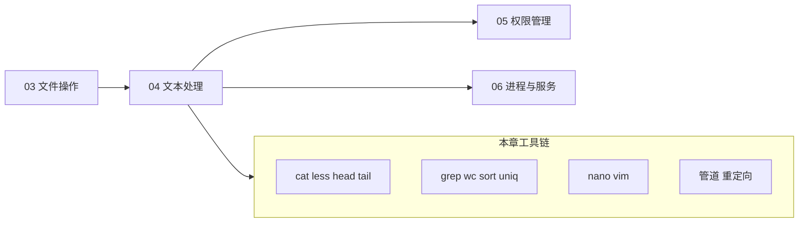

# 文本查看、编辑与搜索

<!-- 修改说明: 2026-06-30 按 EXPANSION-STANDARD 扩充 §0、命令步骤表、FAQ≥10、闭卷自测、费曼检验；环境假设 VMware Ubuntu（见 todo.md） -->

> **文件编码**：UTF-8。本章示例在 **VMware 虚拟机 Ubuntu** 终端中操作；Windows 主机仅用于 SSH 连接或复制粘贴，命令以 Linux 为准。主战场：`~/study/linux-practice`（与 [01](./01-Linux入门与环境搭建.md)、[03](./03-文件与目录操作命令.md) 一致；[todo.md](../../todo.md) 第 1 周必会 `cat grep`）。

---

## 0. 读前导读（零基础也能跟上）

### 0.1 用一句话弄懂本章

**一句话**：Linux 里配置文件、日志、脚本都是**纯文本**——用 `cat`/`less`/`tail -f` **看**，用 `grep` **搜**，用 `nano`/`vim` **改**，用管道 `|` **串起来**做统计；Spring Boot 排错第一步往往是 `tail -f` 盯日志。

**生活类比——查病历与改处方**：

| 工具 | 生活类比 |
|------|----------|
| `cat` | 把整本病历一次性倒桌上（小册子才行） |
| `less` | 分页翻厚病历，还能 `/error` 搜索 |
| `tail -f` | 盯着监护仪实时曲线（新日志一行行蹦） |
| `grep` | 在全院档案里搜「过敏」关键字 |
| `nano` | 带快捷键提示的记事本 |
| `vim` | 高手键盘流编辑器（服务器标配） |
| 管道 `\|` | 流水线：过滤 → 排序 → 计数 |

**为什么重要**：[todo.md](../../todo.md) 必会 `cat grep`；第 4 周 `grep` 日志；[Java 09](../../后端学习/Java/09-LinuxDockerNginx部署基础.md) 部署后 `journalctl`/`tail -f` 排错。

---

### 0.2 你需要提前知道什么

| 水平 | 建议 |
|------|------|
| 03 章未读 | 先会 `cd`、`mkdir`、`>` 重定向到文件 |
| 只会 Windows 记事本 | 从 §6 nano 入手，vim 跟 §7 最小集 |
| 已会 Spring Boot | 重点 §2 tail -f、§3 grep -r、§8 管道 |

---

### 0.3 本章知识地图（学完后应能勾选全部 ☐→☑）

- [ ] 区分 cat / less / head / tail 使用场景
- [ ] 双终端 `tail -f` 实时盯日志
- [ ] `grep -rni` 在目录递归搜索
- [ ] `sort \| uniq -c` 统计 IP 或状态码
- [ ] nano 保存退出；vim `i` → `:wq`
- [ ] 理解 `>`、`>>`、`2>&1` 与管道
- [ ] 完成 §9 日志分析小项目
- [ ] 闭卷自测 ≥ 8/10

---

### 0.4 建议学习时长与节奏

| 阶段 | 时间 | 内容 |
|------|------|------|
| §1～§4 查看与 grep | 1.5 h | 每节在 VM 手敲 |
| §5～§8 管道与编辑器 | 1.5 h | vim 可另开 30 min vimtutor |
| §9 综合实操 | 45 min | 与 notehub 日志目录联动 |
| 自测 | 30 min | |

**每日**（todo）：在 VM 里 `grep -rn "ERROR" ~/study/linux-practice/logs/` 练 3 条。

---

### 0.5 学完本章你能做什么（可验证）

1. 对 `app.log` 用 `tail -f`，另一终端 `echo ERROR` 验证实时输出。
2. 在 `~/study/linux-practice` 下 `grep -rn "port" .` 找出所有含 port 的行。
3. 用管道统计 access.log 各 HTTP 状态码次数。
4. nano 改 `application.properties`；vim 改 hosts 备份并 `:wq`。
5. 解释为何几百 MB 日志不能用 `cat` 直接看。

---

### 0.6 术语速查

| 术语 | 类比 |
|------|------|
| **stdout / stderr** | 正常输出 vs 报错输出（两个「喇叭」） |
| **管道 `\|`** | 左边输出当右边输入 |
| **glob** | `*.log` = 所有 log 结尾文件 |
| **流编辑器 sed** | 批量查找替换的「自动改字机」 |

---

## 本章与上一章的关系

[03 章 文件与目录操作命令](./03-文件与目录操作命令.md) 你已会 `cd`、`ls`、`mkdir`、`cp`、`mv`、`rm`，能在磁盘上**创建和搬运**文件。但后端日常大量工作是：**读日志、搜关键字、改配置、统计行数、管道组合命令**——这些都离不开「文本处理」。

| 上一章（03） | 本章（04） | 下一章（05） |
|--------------|------------|--------------|
| 创建/删除文件 | 查看文件内容 | 谁有权读写 |
| 路径与通配符 | grep 搜索、管道 | chmod / chown |
| 复制移动 | nano / vim 编辑 | sudo 提权 |
| `~/projects` 目录 | 日志 tail -f | 共享目录权限 |



**本章你要完成**：

1. 用 `cat` / `less` / `head` / `tail` 查看各类文本，用 `tail -f` **实时盯日志**
2. 用 `grep -r -n -i` 在目录里搜关键字
3. 用 `wc`、`sort`、`uniq`、`cut`、`awk`、`sed` 做基础统计与提取
4. 用 **nano** 和 **vim** 完成最小可用编辑（`i` → 改 → `ESC` → `:wq`）
5. 掌握管道 `|` 与重定向 `>`、`>>`、`2>&1`

若你按 [00 路线图](./00-学习路线图与说明.md) 在 `~/study/linux-practice` 练习，本章会在该目录生成 `logs/`、`data/` 等实验文件——**05 章权限练习会复用这些目录**。

---

## 1. 文本查看：从 cat 到 less

Linux 里「一切皆文件」，配置文件、日志、脚本都是**纯文本**。先看再改，是安全习惯。

| 步骤 | 你的动作 | 预期看到什么 | 若不对 |
|------|----------|--------------|--------|
| 1 | `mkdir -p ~/study/linux-practice && cd ~/study/linux-practice` | 进入练习目录 | 见 [03 章](./03-文件与目录操作命令.md) |
| 2 | `echo -e "line1\nline2\nline3" > demo.txt` | 无输出 | 检查路径权限 |
| 3 | `cat demo.txt` | 三行文本 | `ls -l demo.txt` 确认文件存在 |
| 4 | `less demo.txt` 按 `q` 退出 | 分页显示 | 大文件用 less 不用 cat |
| 5 | `head -n 2 demo.txt` | 前两行 | `-n` 指定行数 |

### 1.1 cat：一次性输出全文

```bash
cd ~/study/linux-practice
echo -e "line1\nline2\nline3" > demo.txt
cat demo.txt
```

**预期输出**：

```text
line1
line2
line3
```

**适用场景**：小文件（几 KB～几十 KB）、快速确认内容。  
**不适用**：几百 MB 的日志——会刷屏占满终端，甚至卡顿。

合并多个文件到屏幕：

```bash
cat demo.txt /etc/hostname
```

**预期输出**（hostname 为你虚拟机名）：

```text
line1
line2
line3
ubuntu-server
```

### 1.2 less：大文件分页阅读（推荐）

```bash
less /var/log/syslog
```

**常用快捷键**（在 less 内部）：

| 按键 | 作用 |
|------|------|
| `空格` / `f` | 下一页 |
| `b` | 上一页 |
| `g` | 跳到文件头 |
| `G` | 跳到文件尾 |
| `/error` | 向下搜索 `error` |
| `n` / `N` | 下一个 / 上一个匹配 |
| `q` | 退出 |

**预期行为**：屏幕底部出现 `(END)` 或行号提示，按 `q` 回到 shell。

### 1.3 more：老式分页（了解即可）

```bash
more demo.txt
```

功能比 `less` 弱（不能随意向上翻页）。**新学习直接用 less**；老脚本或嵌入式环境可能还有 `more`。

### 1.4 head / tail：看头看尾

```bash
seq 1 100 > numbers.txt
head numbers.txt
head -n 5 numbers.txt
tail numbers.txt
tail -n 3 numbers.txt
```

**预期输出**：

```text
# head（默认 10 行）
1
2
...
10

# head -n 5
1
2
3
4
5

# tail -n 3
98
99
100
```

---

## 2. tail -f：实时跟踪日志（后端必备）

部署 Java / Python / Nginx 后，排错第一步往往是：**盯着日志文件看新行**。

| 步骤 | 你的动作 | 预期看到什么 | 若不对 |
|------|----------|--------------|--------|
| 1 | 终端 A：`mkdir -p ~/study/linux-practice/logs` | 目录存在 | `mkdir -p` |
| 2 | 终端 A：创建 `app.log`（见下方 cat） | 文件含 3 行历史 | 路径用 Tab 补全 |
| 3 | 终端 A：`tail -f app.log` | 显示 3 行后光标等待 | 文件路径要对 |
| 4 | 终端 B：`echo "... ERROR ..." >> app.log` | 终端 A **立刻**追加一行 | 两终端 cwd 一致 |
| 5 | 终端 A：`Ctrl+C` | 退出跟踪，文件仍在 | 不会删日志 |

### 2.1 手把手：模拟应用日志

```bash
mkdir -p ~/study/linux-practice/logs
cd ~/study/linux-practice/logs

# 终端 A：先写几行历史日志
cat > app.log << 'EOF'
2026-06-23 10:00:01 INFO  Server started on port 8080
2026-06-23 10:00:02 INFO  Database connected
2026-06-23 10:00:05 WARN  Cache miss for key=user:1001
EOF

# 终端 A：实时跟踪（会挂起，等待新内容）
tail -f app.log
```

**预期输出**（终端 A 先显示已有 3 行，然后光标等待）：

```text
2026-06-23 10:00:01 INFO  Server started on port 8080
2026-06-23 10:00:02 INFO  Database connected
2026-06-23 10:00:05 WARN  Cache miss for key=user:1001
```

打开**终端 B**（VMware 里再开一个 SSH 或 `Ctrl+Shift+T` 新标签）：

```bash
echo "2026-06-23 10:01:00 ERROR Connection timeout to redis:6379" >> ~/study/linux-practice/logs/app.log
```

**终端 A 立刻追加显示**：

```text
2026-06-23 10:01:00 ERROR Connection timeout to redis:6379
```

按 `Ctrl+C` 停止 `tail -f`（不会删文件，只是退出跟踪）。

### 2.2 常用组合

```bash
# 先看最后 50 行，再跟踪
tail -n 50 -f app.log

# 同时跟踪多个日志（Spring Boot 常见）
tail -f app.log access.log

# 跟踪并过滤 ERROR（管道，§9 详讲）
tail -f app.log | grep --line-buffered ERROR
```

---

## 3. grep：在文本里找 needle

`grep` = **G**lobal **R**egular **E**xpression **P**rint，从行里匹配模式。

| 步骤 | 你的动作 | 预期看到什么 | 若不对 |
|------|----------|--------------|--------|
| 1 | `grep "ERROR" logs/app.log` | 含 ERROR 的行 | 路径先 `cd` 到 practice |
| 2 | `grep -n "INFO" logs/app.log` | 行号前缀 `1:` | 加 `-n` |
| 3 | `grep -i "error" logs/app.log` | 大小写不敏感匹配 | 加 `-i` |
| 4 | `grep -r "port" config/` | 递归多文件 | 目录需 `-r` |
| 5 | `grep -rn "8080" .` | 路径:行号:内容 | 在项目根执行 |

### 3.1 基础用法

```bash
grep "ERROR" ~/study/linux-practice/logs/app.log
grep -i "error" ~/study/linux-practice/logs/app.log   # 忽略大小写
grep -n "INFO" ~/study/linux-practice/logs/app.log  # 显示行号
grep -v "INFO" ~/study/linux-practice/logs/app.log  # 反向：不含 INFO 的行
```

**预期输出（grep -n "INFO"）**：

```text
1:2026-06-23 10:00:01 INFO  Server started on port 8080
2:2026-06-23 10:00:02 INFO  Database connected
```

### 3.2 递归搜索目录 grep -r

```bash
mkdir -p ~/study/linux-practice/config
echo "db.host=127.0.0.1" > ~/study/linux-practice/config/db.properties
echo "server.port=8080" > ~/study/linux-practice/config/app.properties

grep -r "port" ~/study/linux-practice/config/
grep -rn "8080" ~/study/linux-practice/
grep -rni "error" ~/study/linux-practice/
```

**预期输出（grep -rn "8080"）**：

```text
/home/student/linux-practice/config/app.properties:1:server.port=8080
/home/student/linux-practice/logs/app.log:1:2026-06-23 10:00:01 INFO  Server started on port 8080
```

| 选项 | 含义 |
|------|------|
| `-r` / `-R` | 递归子目录 |
| `-n` | 行号 |
| `-i` | 忽略大小写 |
| `-l` | 只列文件名（不显示匹配行） |
| `-c` | 每个文件匹配行数 |
| `--color=auto` | 高亮（多数发行版默认） |

### 3.3 排除目录（查项目时实用）

```bash
grep -rn "TODO" ~/study/linux-practice --exclude-dir=.git
```

---

## 4. wc、sort、uniq：统计与去重

### 4.1 wc：字数、行数、字节

```bash
wc demo.txt
wc -l numbers.txt    # 行数
wc -w demo.txt       # 单词数
wc -c demo.txt       # 字节数
```

**预期输出**：

```text
 3  3 18 demo.txt
# 格式：行数  单词数  字节数  文件名

100 numbers.txt
```

### 4.2 sort 与 uniq（常配对）

```bash
cat > access.log << 'EOF'
192.168.1.10 GET /api/users
192.168.1.20 GET /api/orders
192.168.1.10 GET /api/users
192.168.1.10 POST /api/login
192.168.1.20 GET /api/users
EOF

# 统计各 IP 出现次数（经典管道组合）
cut -d' ' -f1 access.log | sort | uniq -c | sort -rn
```

**预期输出**：

```text
      3 192.168.1.10
      2 192.168.1.20
```

**注意**：`uniq` 只去除**相邻**重复行，所以前面必须先 `sort`。

---

## 5. cut、awk、sed 入门

### 5.1 cut：按列切

```bash
# 以空格分隔，取第 1 列（IP）
cut -d' ' -f1 access.log

# /etc/passwd 以 : 分隔，取用户名（第 1 列）
cut -d: -f1 /etc/passwd | head -5
```

**预期输出（passwd 前 5 用户）**：

```text
root
daemon
bin
sys
sync
```

### 5.2 awk：按字段处理（打印第 1、4 列）

```bash
awk '{print $1, $4}' access.log
awk '/ERROR/ {print $0}' ~/study/linux-practice/logs/app.log
awk -F: '{print $1, $3}' /etc/passwd | head -3
```

**预期输出（awk -F: 前 3 行）**：

```text
root 0
daemon 1
bin 2
```

`-F:` 指定冒号分隔；`$1` 用户名，`$3`  UID。

### 5.3 sed：流编辑器（替换入门）

```bash
# 把 INFO 替换成 [INFO]（仅输出到屏幕，不改原文件）
sed 's/INFO/[INFO]/' ~/study/linux-practice/logs/app.log

# 原地修改（备份 .bak）
sed -i.bak 's/WARN/[WARN]/g' ~/study/linux-practice/logs/app.log
cat ~/study/linux-practice/logs/app.log
```

**预期输出**：

```text
2026-06-23 10:00:01 INFO  Server started on port 8080
...
2026-06-23 10:00:05 [WARN]  Cache miss for key=user:1001
```

| 命令 | 作用 |
|------|------|
| `sed 's/old/new/'` | 每行第一个 old → new |
| `sed 's/old/new/g'` | 全局替换 |
| `sed -n '5,10p' file` | 只打印 5～10 行 |
| `sed -i 's/old/new/g' file` | 直接改文件（谨慎） |

---

## 6. nano：新手首选编辑器

Ubuntu 默认常带 nano，底部有快捷键提示。

### 6.1 手把手编辑配置文件

```bash
nano ~/study/linux-practice/config/app.properties
```

操作步骤：

1. 光标移到文末，添加一行：`debug=true`
2. `Ctrl+O` → 回车 **保存**
3. `Ctrl+X` **退出**

验证：

```bash
cat ~/study/linux-practice/config/app.properties
```

**预期输出**：

```text
server.port=8080
debug=true
```

### 6.2 nano 常用快捷键

| 快捷键 | 作用 |
|--------|------|
| `Ctrl+O` | 写入（保存） |
| `Ctrl+X` | 退出 |
| `Ctrl+K` | 剪切整行 |
| `Ctrl+U` | 粘贴 |
| `Ctrl+W` | 搜索 |
| `Ctrl+\` | 替换 |

---

## 7. vim 基础：i、ESC、:wq

服务器上常只有 vim。**最小生存技能**：能改一行配置并保存退出。

### 7.1 模式概念

```mermaid
stateDiagram-v2
  [*] --> Normal: vim 打开文件
  Normal --> Insert: 按 i/a/o
  Insert --> Normal: 按 ESC
  Normal --> Command: 按 :
  Command --> Normal: 回车执行命令
  Command --> [*]: :q! 或 :wq
```

| 模式 | 作用 | 如何进入 |
|------|------|----------|
| 普通模式 Normal | 移动、删除、复制 | 默认；Insert 里按 ESC |
| 插入模式 Insert | 像记事本一样打字 | 按 `i`（光标前）或 `a`（光标后） |
| 命令模式 Command | 保存、退出、替换 | 普通模式下按 `:` |

### 7.2 手把手：用 vim 改 hosts（练习用）

```bash
cp /etc/hosts ~/study/linux-practice/hosts.backup
vim ~/study/linux-practice/hosts.backup
```

在 vim 里：

1. 按 `G` 跳到末行
2. 按 `o` 在下方新开一行并进入插入模式
3. 输入：`127.0.0.1 myapp.local`
4. 按 `ESC`
5. 输入 `:wq` 回车（write + quit）

验证：

```bash
tail -1 ~/study/linux-practice/hosts.backup
```

**预期输出**：

```text
127.0.0.1 myapp.local
```

### 7.3 救命命令（背下来）

| 场景 | 命令 |
|------|------|
| 保存并退出 | `:wq` 或 `:x` |
| 不保存强制退出 | `:q!` |
| 只保存 | `:w` |
| 删除当前行 | 普通模式下 `dd` |
| 撤销 | `u` |
| 搜索 | `/keyword` 然后 `n` |

**不要用 `:wq` 编辑 `/etc/` 下系统文件**，除非你知道后果；练习请在 `~/study/linux-practice` 下进行。

---

## 8. 管道与重定向

### 8.1 管道 |

把**左边命令的标准输出**作为**右边命令的标准输入**。

```bash
cat numbers.txt | head -5
ps aux | grep ssh
grep "ERROR" app.log | wc -l
```

**预期输出（grep ERROR | wc -l）**：

```text
1
```

### 8.2 输出重定向

```bash
echo "fresh start" > ~/study/linux-practice/logs/new.log    # 覆盖写
echo "second line" >> ~/study/linux-practice/logs/new.log   # 追加
```

**预期**：

```bash
cat ~/study/linux-practice/logs/new.log
```

```text
fresh start
second line
```

### 8.3 标准错误 2>&1

```bash
# 正确输出和错误输出都追加到同一个文件
some_command >> output.log 2>&1

# 演示：故意访问不存在目录
ls /not-exist 2>> ~/study/linux-practice/logs/errors.log
ls /not-exist >> ~/study/linux-practice/logs/errors.log 2>&1
cat ~/study/linux-practice/logs/errors.log
```

**预期 errors.log 含**：

```text
ls: cannot access '/not-exist': No such file or directory
```

| 符号 | 含义 |
|------|------|
| `>` | 覆盖重定向 stdout（文件描述符 1） |
| `>>` | 追加重定向 stdout |
| `2>` | 重定向 stderr（文件描述符 2） |
| `2>&1` | stderr 指向 stdout 同一目的地 |
| `<` | 从文件读入 stdin |

**记忆口诀**：`2>&1` 写在**最后**，表示「错误也跟着标准输出走」。

---

## 9. 综合实操：日志分析小项目

在 VMware Ubuntu 里完整跟做一遍。

```bash
cd ~/study/linux-practice
mkdir -p logs data scripts

# 生成模拟访问日志
cat > logs/access.log << 'EOF'
10.0.0.1 GET /api/login 200
10.0.0.2 GET /api/users 500
10.0.0.1 POST /api/login 200
10.0.0.3 GET /api/orders 404
10.0.0.2 GET /api/users 500
10.0.0.1 GET /api/health 200
EOF

# 任务 1：统计 500 错误有几条
grep " 500" logs/access.log | wc -l

# 任务 2：列出所有不重复的 IP
cut -d' ' -f1 logs/access.log | sort -u

# 任务 3：把 ERROR 级别从 app.log 导出到单独文件
grep ERROR logs/app.log > logs/error-only.log 2>/dev/null || true

# 任务 4：写脚本（nano 或 vim）
cat > scripts/summarize.sh << 'SCRIPT'
#!/bin/bash
LOG="$1"
echo "=== Total lines: $(wc -l < "$LOG") ==="
echo "=== Status codes ==="
awk '{print $NF}' "$LOG" | sort | uniq -c | sort -rn
SCRIPT
chmod +x scripts/summarize.sh
./scripts/summarize.sh logs/access.log
```

**预期 summarize 输出**：

```text
=== Total lines: 6 ===
=== Status codes ===
      3 200
      2 500
      1 404
```

---

## 10. 深入解释

### 10.1 为什么 less 比 cat 更适合读日志？

`cat` 会把整个文件读入并输出到终端。`/var/log/syslog` 在运行几周的机器上可达**数百 MB**，一次性输出会：

1. **占满 scrollback**，找不到开头
2. 触发大量 IO，远程 SSH 时更明显卡顿
3. 无法交互搜索（less 里 `/pattern` 很方便）

`less` 按需读取（分页），`tail` 只读末尾——**看日志的标准姿势是 `tail -n 100` 或 `less +G file`（直接跳末尾）**。

### 10.2 管道与重定向背后的「三个标准流」

每个 Linux 进程启动时默认有三个流：

| 流 | 文件描述符 | 默认连接 |
|----|------------|----------|
| stdin 标准输入 | 0 | 键盘 |
| stdout 标准输出 | 1 | 终端屏幕 |
| stderr 标准错误 | 2 | 终端屏幕 |

`cmd1 | cmd2` 只连接 **stdout(1)**；若 `cmd1` 报错，错误仍打印在屏幕上，**不会**进管道。所以生产脚本常写：

```bash
command >> /var/log/app.log 2>&1
```

这样 INFO 和 ERROR 都进同一日志，便于 `grep` 和 logrotate 管理——[06 章](./06-进程与服务管理.md) 讲 systemd 时会把应用输出重定向到 journal，原理相同。

---

## 11. 本章知识点清单

- [ ] 能区分 cat / less / head / tail 的使用场景
- [ ] 会用 `tail -f` 实时看日志，`Ctrl+C` 退出
- [ ] 会用 `grep -rni` 在目录里搜索
- [ ] 会用 `wc -l`、`sort | uniq -c` 做简单统计
- [ ] 会用 `cut`、`awk '{print $n}'`、`sed 's///g'` 做入门处理
- [ ] nano 能保存退出；vim 能 `i` 编辑、`:wq` 保存、`:q!` 放弃
- [ ] 理解 `>`、`>>`、`2>&1` 和管道 `|`

---

## 12. 分级练习

**基础**：在 `~/study/linux-practice/logs/app.log` 里用 `grep -n` 找出所有含 `port` 的行，用 `wc -l` 统计行数。

**进阶**：从 `logs/access.log` 统计每个 HTTP 状态码出现次数，结果按次数降序（提示：`awk` + `sort` + `uniq -c`）。

**挑战**：写 `scripts/watch-errors.sh`：参数为日志路径，每 2 秒 `grep ERROR` 并带时间戳追加到 `logs/alerts.log`（提示：`while sleep 2; do ... done`，或预习 `watch` 命令）。

### 12.1 参考答案（基础）

```bash
grep -n "port" ~/study/linux-practice/logs/app.log
grep -c "port" ~/study/linux-practice/logs/app.log
```

**预期**：

```text
1:2026-06-23 10:00:01 INFO  Server started on port 8080
1
```

### 12.2 参考答案（进阶）

```bash
awk '{print $NF}' ~/study/linux-practice/logs/access.log | sort | uniq -c | sort -rn
```

**预期**：

```text
      3 200
      2 500
      1 404
```

### 12.3 参考答案（挑战）

```bash
cat > ~/study/linux-practice/scripts/watch-errors.sh << 'EOF'
#!/bin/bash
LOG="${1:?usage: watch-errors.sh /path/to/log}"
OUT=~/study/linux-practice/logs/alerts.log
while true; do
  grep ERROR "$LOG" 2>/dev/null | while read -r line; do
    echo "$(date '+%Y-%m-%d %H:%M:%S') $line" >> "$OUT"
  done
  sleep 2
done
EOF
chmod +x ~/study/linux-practice/scripts/watch-errors.sh
# 测试：后台运行后 echo ERROR 到日志观察 alerts.log
```

---

## 13. 常见报错与排查

| 报错信息（关键词） | 可能原因 | 解决方案 |
|-------------------|---------|---------|
| `No such file or directory` | 路径错误或文件未创建 | `ls -la` 确认路径；先 `mkdir -p` |
| `Permission denied` | 无读权限 | `ls -l` 看权限；05 章学 chmod，或 `sudo` |
| `grep: ...: Is a directory` | 对目录直接 grep 未加 `-r` | 使用 `grep -r pattern dir/` |
| `Binary file matches` | grep 命中二进制 | 加 `-a` 或 `--binary-files=without-match` |
| `sed: -e expression #1, char ...` | sed 语法错误 | 检查引号与分隔符，如 `s/old/new/g` |
| `awk: cmd. line:1: ...` | awk 字段号越界 | 用 `cat -A file` 看隐藏字符；调整 `-F` |
| `E325: ATTENTION`（vim） | .swap 文件冲突 | 确认无其他 vim 进程；按提示 `D` 删除 swap 或 `R` 恢复 |
| `E45: 'readonly' option is set` | 只读文件 | 勿改系统文件；或 `:w !sudo tee %`（进阶） |
| `Input/output error` | 磁盘或 VMware 虚拟盘问题 | 检查虚拟机磁盘空间 `df -h`；重启 VM |
| `tail: cannot open ...` | 文件不存在 | 先创建或修正路径 |
| `cat: ...: Permission denied` | 无读权限 | 05 章权限；`/var/log` 部分需 sudo |
| `command not found: nano` | 未安装 | `sudo apt install nano` |
| `vim: command not found` | 未安装 vim | `sudo apt install vim` |
| `Broken pipe` | 管道下游提前退出 | 通常可忽略；或检查 `head` 关闭管道 |

---

## 14. 练习建议

1. **每天 5 分钟 tail -f**：自己 `echo` 追加日志，熟悉双终端协作
2. **用 less 读 `/var/log/syslog`**：练 `/` 搜索、`G` 跳尾
3. **vimtutor**：终端执行 `vimtutor`，30 分钟系统练 vim（强烈推荐）
4. **grep 你的项目**：若有 Java/Python 代码，在 `~/projects` 里 `grep -rn "TODO"`
5. **管道思维**：把「过滤 → 排序 → 统计」拆成多段命令，一段段加

---

## 15. 学完标准

完成本章后，你应能**不看文档**完成：

1. 查看任意文本：小文件 `cat`，大文件 `less`，日志 `tail -n` / `tail -f`
2. 在 `~/study/linux-practice` 下 `grep -rni` 搜关键字并读懂 `-r -n -i`
3. 用管道统计 access.log 里 IP 或状态码出现次数
4. nano 改 properties；vim 改 hosts 备份并 `:wq` 保存
5. 把命令输出**追加**到文件，并理解 `2>&1`

**量化自检**：

- [ ] `~/study/linux-practice/logs/` 至少有 2 个 `.log` 文件
- [ ] 成功运行过 `tail -f` 并在另一终端触发新行
- [ ] 完成 `scripts/summarize.sh` 或等价一行管道
- [ ] vim 至少保存退出 3 次无 panic

---

---

## 15.5 VMware + todo.md 联动练习（第 2～4 周）

> 在 **VMware Ubuntu** 完成；路径统一 `~/study/linux-practice`。Windows 仅 SSH 粘贴命令。

| 周次（todo） | 练习 | 命令要点 |
|--------------|------|----------|
| 第 1 周 | 每日 grep 3 条 | `grep -rn "ERROR" logs/` |
| 第 2 周 | 读 Spring 配置 | `grep port config/*.properties` |
| 第 3 周 | curl 前先 grep 日志 | `tail -f` + 另一终端 curl |
| 第 4 周 | 日志分析 | §9 summarize.sh |

**15 分钟跟做清单**：

```bash
cd ~/study/linux-practice
mkdir -p logs config scripts
echo "server.port=8080" > config/app.properties
echo "2026-06-30 INFO Started" > logs/app.log
grep -rn "8080" .
tail -n 5 logs/app.log
nano config/app.properties   # 加 debug=true，Ctrl+O Ctrl+X
vim -y logs/app.log 2>/dev/null || vim logs/app.log  # 练 :q!
```

| 步骤 | 命令 | 预期 |
|------|------|------|
| 1 | `wc -l logs/app.log` | 行数 ≥1 |
| 2 | `grep INFO logs/app.log \| wc -l` | 管道计数 |
| 3 | `cat config/app.properties \| grep port` | 8080 |
| 4 | `ls /not-exist 2>> logs/err.log` | err.log 有报错 |
| 5 | `head -1 logs/err.log` | Permission/No such file 类信息 |

与 [03 章 notehub-api 目录](./03-文件与目录操作命令.md) 联用：在 `notehub-api` 里 `find . -name "*.yml"` 找配置，再用本章 `grep spring` 过滤。

---

## 16. 常见问题 FAQ

**Q1：`cat` 和 `less` 怎么选？**  
小文件（几 KB～几十 KB）用 `cat`；大日志、`/var/log/syslog` 用 `less` 或 `tail`。几百 MB 文件 `cat` 会刷屏卡顿。

**Q2：`tail -f` 退出后日志还在吗？**  
在。`Ctrl+C` 只停止**跟踪**，不删文件。与 `rm` 无关。

**Q3：`grep` 搜目录为什么报错 Is a directory？**  
对目录搜索必须 **`grep -r pattern dir/`**，不能对目录直接 grep 单文件。

**Q4：`grep -v` 做什么？**  
反向匹配：输出**不含** pattern 的行。例如 `grep -v INFO app.log` 看非 INFO 行。

**Q5：管道左边报错为什么右边收不到？**  
管道 `\|` 只连接 **stdout(1)**；错误走 **stderr(2)** 仍打屏幕。脚本常写 `cmd >> log 2>&1`。

**Q6：nano 和 vim 服务器上哪个一定有？**  
Ubuntu 通常带 nano；最小化镜像可能只有 vi/vim。生产改配置 **vim 必会最小集**：`i`、`:wq`、`:q!`。

**Q7：vim 底部 `E325: ATTENTION` 是什么？**  
上次异常退出留下 `.swap` 文件。确认无其他 vim 打开同一文件后，按提示 `D` 删 swap 或 `R` 恢复。

**Q8：`sort | uniq -c` 为什么要先 sort？**  
`uniq` 只合并**相邻**重复行；不 sort 则相同 IP 分散时统计不准。

**Q9：`sed -i` 会备份吗？**  
`sed -i.bak` 会留 `.bak`；裸 `-i` 直接改原文件。改系统配置前 **`cp` 备份**。

**Q10：Windows 复制的命令在 VMware 里路径不对？**  
Linux 路径用 `/`，家目录 `~` = `/home/你的用户名`；练习统一 `~/study/linux-practice`。

**Q11：`Permission denied` 读 `/var/log/auth.log`？**  
系统日志常需 **`sudo cat`** 或加入 adm 组；详见 [05 章](./05-用户组与文件权限.md)。

**Q12：notehub 项目日志应该放哪？**  
开发：`~/study/linux-practice/logs/` 或 Spring Boot `logging.file.name`；生产：`/var/log/` 或 journalctl。

---

## 17. 闭卷自测

### 概念题（6 道）

1. 说出 cat、less、tail 各适合什么场景（各一句）。
2. `tail -f` 与 `tail -n 50 -f` 区别？
3. `grep -rni` 四个常用选项各表示什么？
4. 为什么 `uniq` 前必须 `sort`？
5. 解释 `2>&1` 在 `cmd >> log 2>&1` 里的作用。
6. vim 三种模式（Normal / Insert / Command）如何切换？

### 动手题（2 道）

7. 写一条命令：统计 `logs/app.log` 中含 `ERROR` 的行数。
8. 写管道：从 `access.log` 取第 1 列 IP，`sort | uniq -c | sort -rn` 统计次数（说明每段作用）。

### 综合题（2 道）

9. Spring Boot 启动后你要盯日志：写出「终端 A + 终端 B」完整步骤（含 `tail -f` 与追加测试行）。
10. [todo.md](../../todo.md) 第 4 周要求 `grep` 日志——若要在 notehub 项目里找所有 `.yml` 配置中的 `port`，写完整命令链。

### 自测参考答案

1. cat 小文件一次性看；less 大文件分页+搜索；tail 看末尾/实时跟踪。
2. 后者先显示最后 50 行再跟踪；前者从文件当前末尾开始。
3. `-r` 递归目录；`-n` 行号；`-i` 忽略大小写（若题目含 `-l` 则只列文件名）。
4. uniq 只去相邻重复；sort 把相同项排在一起才能正确计数。
5. 把 stderr(2) 重定向到 stdout(1) 同一目的地，错误与正常输出都进 log。
6. 默认 Normal；`i`/`a`/`o` 进 Insert；ESC 回 Normal；`:` 进 Command（`:wq` 保存退出）。
7. `grep -c ERROR ~/study/linux-practice/logs/app.log` 或 `grep ERROR ... | wc -l`。
8. `cut -d' ' -f1 access.log | sort | uniq -c | sort -rn` — cut 取 IP，sort 排序，uniq -c 计数，sort -rn 按次数降序。
9. A: `cd ~/study/linux-practice/logs && tail -f app.log`；B: `echo "$(date) ERROR test" >> ~/study/linux-practice/logs/app.log`；A 应即时出现新行；A 按 Ctrl+C 结束。
10. `find ~/study/linux-practice -name "*.yml" -exec grep -Hn "port" {} \;` 或 `grep -rn "port" --include="*.yml" ~/study/linux-practice`。

**速记卡**：

| 命令 | 一句话 |
|------|--------|
| `tail -f` | 实时日志，Ctrl+C 退出 |
| `grep -rn` | 项目内搜关键字 |
| `less +G` | 大文件跳末尾 |
| `sed -i.bak` | 改文件留备份 |
| `\| wc -l` | 统计行数 |
| `2>&1` | 错误跟正常一起进 log |

---

## 18. 费曼检验

**任务**：请在不看资料的情况下，用 3 分钟向没学过 Linux 的朋友解释「后端工程师如何用命令行查日志、搜 ERROR」。

**对照提纲**：

1. **看**：小文件 `cat`，大文件 `less`，实时用 `tail -f`（像盯监护仪）。
2. **搜**：`grep ERROR` 过滤；`grep -r` 在整个项目目录找。
3. **串**：管道把「过滤 → 排序 → 计数」连起来；改配置用 nano 或 vim，改系统文件前先在 `~/study/linux-practice` 练手。

---

## 19. 下一章预告

04 章你能**读、搜、改**文本，但常会遇到 `Permission denied`——改 `/etc/nginx/nginx.conf`、读别人目录、让团队成员共写 upload 目录，都涉及 **用户、组、文件权限**。

下一章（**05 用户组与文件权限**）讲 `/etc/passwd`、`useradd`、`chmod` 数字与符号、`chown`、`umask`、`sudo visudo`，以及 setuid/seticky 和**共享目录**实战——为部署 Web 服务、跑 Java/Python 进程打基础。

---

*继续学习：[05 用户组与文件权限](./05-用户组与文件权限.md)*

*本章已按 EXPANSION-STANDARD 扩充（§0+tail -f/grep 步骤表+FAQ+自测+费曼）。*

**EXPANSION-STANDARD 自检**：☑ §0.1～0.5 ☑ 命令步骤表 §1/§2/§3 ☑ FAQ≥10 ☑ 闭卷 10 题 ☑ 费曼 ☑ VMware Ubuntu 语境
