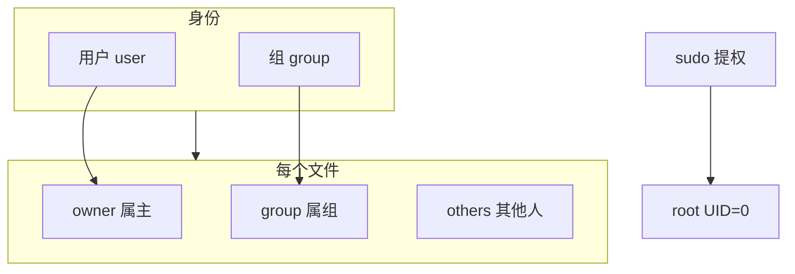
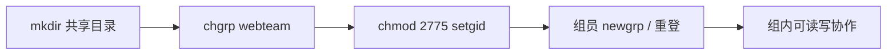

# 用户、组与文件权限

<!-- 修改说明: 2026-06-30 按 EXPANSION-STANDARD 扩充 §0、命令步骤表、FAQ≥10、闭卷自测、费曼检验；环境假设 VMware Ubuntu（见 todo.md） -->

> **文件编码**：UTF-8。本章在 **VMware Ubuntu** 虚拟机中操作；涉及 `useradd`、`chmod` 等需 **root 或 sudo** 权限。练习用户请用 `student` 等普通账号 + `sudo`，**勿在 production 机器上随意实验**。主战场：`~/study/linux-practice`（[todo.md](../../todo.md) 必会 `chmod`）。

---

## 0. 读前导读（零基础也能跟上）

### 0.1 用一句话弄懂本章

**一句话**：Linux 每个文件都有 **属主、属组、rwx 权限**——`chmod` 改谁能读写执行，`chown` 改归属，`sudo` 临时当管理员；notehub 的 `.env` 要 `600`，团队 upload 目录要 `2775`。

**生活类比——小区门禁**：

| 概念 | 类比 |
|------|------|
| **owner（属主）** | 户主 |
| **group（属组）** | 同一户的成员 |
| **others** | 外来访客 |
| **rwx** | 能看 / 能改 / 能进房间 |
| **sudo** | 临时拿物业万能钥匙 |
| **umask** | 新房交付时的默认门锁档位 |
| **setgid 2775** | 公共储物间：谁放的东西都算「物业组」的 |

**为什么重要**：[04 章](./04-文本查看编辑与搜索.md) `Permission denied` 的根因在本章；部署 Nginx/MySQL 要会 `chown www-data`；[todo.md](../../todo.md) 第 1 周必会 `chmod`。

---

### 0.2 你需要提前知道什么

| 水平 | 建议 |
|------|------|
| 04 章未读 | 至少会 `ls -l`、`cat` 读配置 |
| 不懂八进制 | 先背 644/755/600/775 四个常用 |
| 已装 MySQL | §9 共享目录与数据库 `bind-address` 权限可对照 |

---

### 0.3 本章知识地图（☐→☑）

- [ ] 读懂 `/etc/passwd` 七个字段
- [ ] `useradd -m`、`usermod -aG` 创建用户加组
- [ ] `ls -l` 区分文件/目录的 rwx 含义
- [ ] chmod 数字模式 644、755、600、775、2775
- [ ] `chown user:group` 与 umask 0022
- [ ] `sudo`、`visudo` 安全提权
- [ ] 完成 §9 webteam 共享目录实验
- [ ] 闭卷自测 ≥ 8/10

---

### 0.4 建议学习时长

| 阶段 | 时间 |
|------|------|
| §1～§4 用户与 chmod | 1.5 h |
| §5～§8 sudo 与特殊位 | 1 h |
| §9 综合实操 | 1 h |
| 自测 | 30 min |

---

### 0.5 学完你能做什么

1. 对 notehub 的 `secret.key` 设 **600**，仅自己可读。
2. 搭建 `/srv/webteam/upload` **2775** 组内协作目录。
3. 解释目录为何必须有 **x** 才能 `cd` 进去。
4. 用 `sudo` 装软件而不直接用 root 登录。

---

## 本章与上一章的关系

[04 章 文本查看编辑与搜索](./04-文本查看编辑与搜索.md) 你已能 `grep` 日志、vim 改配置，但执行 `cat /var/log/auth.log` 或改 Nginx 配置时可能遇到 **Permission denied**——这不是命令错了，而是 **Linux 安全模型**在起作用：每个文件属于某个**用户**和**组**，并有读(r)写(w)执行(x)权限。

| 上一章（04） | 本章（05） | 下一章（06） |
|--------------|------------|--------------|
| 读写文本文件 | 谁有权读写 | 进程谁启动 |
| `Permission denied` | chmod / chown | systemctl / sudo |
| `~/study/linux-practice` | 共享目录实战 | 服务端口与日志 |
| grep /etc/passwd | 理解用户体系 | journalctl 权限 |



**本章你要完成**：

1. 读懂 `/etc/passwd`、`/etc/group` 字段含义
2. 用 `useradd`、`usermod` 管理用户（练习环境）
3. `chmod` 数字模式与符号模式、`chown`、`chgrp`
4. 理解 `umask`，新建文件默认权限从哪来
5. 配置 `sudo`（`visudo`），安全提权
6. setuid / setgid / sticky 入门 + **共享目录**综合练习

---

## 1. Linux 用户与组基础

### 1.1 为什么需要用户？

多用户操作系统要隔离：

- 你的 `~/study/linux-practice` 别人不能随便删
- Web 服务常以 `www-data` 运行，不能读 root 的 shadow 文件
- 审计：谁改了 `/etc/nginx/nginx.conf`

每个登录用户有：

| 属性 | 说明 |
|------|------|
| **UID** | 用户 ID 数字，root 为 0 |
| **GID** | 主组 ID |
| **家目录** | 如 `/home/student` |
| **登录 Shell** | 如 `/bin/bash` |

### 1.2 /etc/passwd 字段

```bash
getent passwd student
# 或
grep "^student:" /etc/passwd
```

**预期输出示例**：

```text
student:x:1000:1000:Student User,,,:/home/student:/bin/bash
```

| 字段（冒号分隔） | 示例 | 含义 |
|------------------|------|------|
| 1 用户名 | student | 登录名 |
| 2 密码占位 | x | 真实密码在 `/etc/shadow`（需 root 读） |
| 3 UID | 1000 | 用户 ID |
| 4 GID | 1000 | 主组 ID |
| 5 GECOS | Student User,,, | 全名/备注 |
| 6 家目录 | /home/student | `$HOME` |
| 7 Shell | /bin/bash | 登录后默认 Shell |

查看 root：

```bash
grep "^root:" /etc/passwd
```

**预期**：

```text
root:x:0:0:root:/root:/bin/bash
```

### 1.3 /etc/group 字段

```bash
getent group sudo
grep "^student:" /etc/group
```

**预期（sudo 组）**：

```text
sudo:x:27:student
```

| 字段 | 含义 |
|------|------|
| 组名 | sudo |
| 密码占位 | x |
| GID | 27 |
| 成员列表 | student（逗号分隔，可为空） |

```bash
groups
id
```

**预期**：

```text
student : student adm cdrom sudo dip plugdev ...
uid=1000(student) gid=1000(student) groups=1000(student),27(sudo),...
```

---

## 2. useradd 与 usermod（手把手）

> **警告**：在 VMware **练习机**上操作。删除用户前确认无重要数据。

| 步骤 | 你的动作 | 预期看到什么 | 若不对 |
|------|----------|--------------|--------|
| 1 | `sudo useradd -m -s /bin/bash -c "Dev User" devuser` | 无输出 | 需 sudo；用户已存在则换名 |
| 2 | `sudo passwd devuser` | 两次输入密码 | 密码太简单会警告，练习可忽略 |
| 3 | `grep devuser /etc/passwd` | 一行七字段 | `getent passwd devuser` |
| 4 | `ls -la /home/devuser` | 属主 devuser | 缺 `-m` 则无家目录 |
| 5 | `sudo groupadd webteam && sudo usermod -aG webteam devuser` | 无输出 | **必须 -aG** 追加组 |
| 6 | `id devuser` | groups 含 webteam | 需重登或 `newgrp webteam` |

### 2.1 创建练习用户

```bash
sudo useradd -m -s /bin/bash -c "Dev User" devuser
sudo passwd devuser
# 输入两次密码（练习用简单密码即可，生产环境要复杂）
```

| 选项 | 含义 |
|------|------|
| `-m` | 创建家目录 `/home/devuser` |
| `-s /bin/bash` | 指定 Shell |
| `-c "..."` | 注释（GECOS） |

验证：

```bash
grep devuser /etc/passwd
ls -la /home/devuser
```

**预期**：

```text
devuser:x:1001:1001:Dev User:/home/devuser:/bin/bash

/home/devuser 目录存在，属主 devuser
```

### 2.2 usermod：加入附加组

```bash
# 创建项目组
sudo groupadd webteam

# 把 devuser 加入 webteam
sudo usermod -aG webteam devuser

# 验证（需 devuser 重新登录或 newgrp 才刷新）
id devuser
```

**预期**：

```text
uid=1001(devuser) gid=1001(devuser) groups=1001(devuser),1002(webteam)
```

**注意**：`usermod -G`（大写）会**替换**全部附加组；追加用 **`-aG`**。

### 2.3 删除用户（了解）

```bash
# 仅了解，本章练习末尾可选清理
sudo userdel -r devuser   # -r 删除家目录
sudo groupdel webteam
```

---

## 3. 文件权限：ls -l 读懂 rwx

```bash
ls -l ~/study/linux-practice/logs/app.log
ls -ld ~/study/linux-practice
```

**预期示例**：

```text
-rw-rw-r-- 1 student student 256 Jun 23 10:00 app.log
drwxrwxr-x 5 student student 4096 Jun 23 09:00 linux-practice
```

### 3.1 权限位含义

```
-rwxrwxr-x
│└┬┘└┬┘└┬┘
│  │   │ └── others 其他人
│  │   └──── group 属组
│  └──────── owner 属主
└─────────── 文件类型（- 普通文件，d 目录，l 链接）
```

| 权限 | 对文件 | 对目录 |
|------|--------|--------|
| r (4) | 读内容 | 列目录内容 `ls` |
| w (2) | 改内容 | 创建/删除/改名目录内条目 |
| x (1) | 当程序执行 | 进入目录 `cd` |

**目录必须有 x 才能 cd 进去**；仅有 r 只能 `ls` 文件名，不能 `cd`（常见面试点）。

---

## 4. chmod：符号模式与数字模式

| 步骤 | 你的动作 | 预期看到什么 | 若不对 |
|------|----------|--------------|--------|
| 1 | `touch ~/study/linux-practice/demo.txt && ls -l demo.txt` | 默认约 `-rw-r--r--` | 看 umask |
| 2 | `chmod 644 demo.txt && ls -l demo.txt` | `-rw-r--r--` | 数字算错见 §4.2 表 |
| 3 | `chmod 600 demo.txt` | `-rw-------` | 仅 owner 读写 |
| 4 | `mkdir -p scripts && chmod 755 scripts` | `drwxr-xr-x` | 目录常用 755 |
| 5 | `chmod +x scripts/*.sh` | 属主 x 位出现 | 符号模式 `u+x` |

### 4.1 符号模式

```bash
chmod u+x script.sh      # 属主加执行
chmod g-w file.txt       # 属组去写
chmod o+r file.txt       # 其他人加读
chmod a+x script.sh      # 所有人加执行（a=all）
chmod u=rwx,g=rx,o=r file.txt
```

| 符号 | 含义 |
|------|------|
| u g o a | user / group / others / all |
| + - = | 增加 / 移除 / 设为 |

### 4.2 数字模式（八进制，后端必会）

每位 rwx 对应 4+2+1：

| 二进制 | 数字 | 权限 |
|--------|------|------|
| 111 | 7 | rwx |
| 110 | 6 | rw- |
| 101 | 5 | r-x |
| 100 | 4 | r-- |
| 000 | 0 | --- |

```bash
chmod 644 demo.txt    # rw-r--r--
chmod 755 script.sh   # rwxr-xr-x
chmod 600 secret.key  # rw------- 仅属主
chmod 775 shared_dir  # rwxrwxr-x 目录常用
```

**预期（chmod 644 后 ls -l）**：

```text
-rw-r--r-- 1 student student ...
```

### 4.3 递归 chmod（谨慎）

```bash
chmod -R 755 ~/study/linux-practice/scripts
```

**不要**对系统目录 `chmod -R 777 /`——会破坏安全，系统可能无法启动。

---

## 5. chown 与 chgrp

改**属主**和**属组**（通常要 sudo，除非你是 owner 且规则允许）。

```bash
sudo touch /tmp/rootfile.txt
ls -l /tmp/rootfile.txt
# 属主 root

sudo chown student:student /tmp/rootfile.txt
ls -l /tmp/rootfile.txt
```

**预期**：

```text
-rw-r--r-- 1 student student 0 Jun 23 11:00 /tmp/rootfile.txt
```

```bash
sudo chgrp webteam /tmp/rootfile.txt   # 只改组
sudo chown student:webteam /tmp/rootfile.txt  # 用户:组
sudo chown -R student:student ~/study/linux-practice/shared
```

---

## 6. umask：新建文件的默认权限

```bash
umask
umask -S
touch ~/study/linux-practice/newfile.txt
mkdir ~/study/linux-practice/newdir
ls -l ~/study/linux-practice/newfile.txt
ls -ld ~/study/linux-practice/newdir
```

**预期（umask 0022 常见）**：

```text
0022
u=rwx,g=wx,o=rx

-rw-r--r--  newfile.txt    # 666 & ~022 = 644
drwxr-xr-x  newdir         # 777 & ~022 = 755
```

**计算**：默认文件 `666`，目录 `777`，减去 umask 各位。

临时修改（当前 shell）：

```bash
umask 002
touch ~/study/linux-practice/u002.txt
ls -l ~/study/linux-practice/u002.txt
```

**预期**：

```text
-rw-rw-r--  u002.txt
```

持久化写入 `~/.bashrc` 或 `/etc/profile`（进阶）。

---

## 7. sudo 与 visudo

普通用户执行 root 级命令，通过 **sudo**（Switch User DO）。

### 7.1 基本用法

```bash
sudo apt update
sudo ls /root
whoami        # student
sudo whoami   # root
```

**预期**：

```text
root
```

Ubuntu 安装时创建的 user 通常在 **sudo** 组，已有权限。

### 7.2 visudo：安全编辑 sudoers

**永远不要**直接 `nano /etc/sudoers`——语法错误会锁死 sudo。用：

```bash
sudo visudo
```

在文件末尾添加（练习：让 devuser 只能重启 nginx——需先装 nginx 或换命令）：

```text
# 示例：devuser 免密执行特定命令（练习机可用）
devuser ALL=(ALL) NOPASSWD: /usr/bin/systemctl restart nginx
```

保存后测试（以 devuser 登录）：

```bash
sudo systemctl restart nginx
```

### 7.3 sudo 与权限的关系

- `sudo` 解决的是**命令执行身份**（临时变 root）
- `chmod` 解决的是**文件访问规则**
- 两者配合：部署时用 sudo 把文件属主改为 `www-data`，再用 chmod 644

---

## 8. 特殊权限：setuid、setgid、sticky

### 8.1 setuid（s 在 owner x 位）

```bash
ls -l /usr/bin/passwd
```

**预期**：

```text
-rwsr-xr-x 1 root root ... /usr/bin/passwd
```

`s` 表示 setuid：用户执行该程序时**临时以文件属主（root）身份**运行——`passwd` 需写 `/etc/shadow`，普通用户本身无写权限。

### 8.2 setgid（s 在 group x 位）

对目录设 setgid 后，**在该目录新建的文件继承目录的组**——共享目录常用。

```bash
sudo mkdir -p /srv/shared
sudo chgrp webteam /srv/shared
sudo chmod 2775 /srv/shared
ls -ld /srv/shared
```

**预期**：

```text
drwxrwsr-x 2 root webteam ... /srv/shared
#        ^ group 的 x 变成 s
```

### 8.3 sticky bit（t 在 others x 位）

```bash
ls -ld /tmp
```

**预期**：

```text
drwxrwxrwt ... /tmp
#       ^ t
```

`/tmp` 所有人可写，但 sticky 保证**只有文件 owner 能删自己的文件**（不能删别人的临时文件）。

| 特殊位 | 数字 | 典型场景 |
|--------|------|----------|
| setuid | 4xxx | passwd、sudo |
| setgid | 2xxx | 共享目录组继承 |
| sticky | 1xxx | /tmp |

---

## 9. 综合实操：搭建团队共享目录

在 VMware 里完整跟做（模拟 Web 团队 upload 目录）。

### 9.1 准备用户与组

```bash
sudo groupadd webteam
sudo useradd -m -s /bin/bash alice
sudo useradd -m -s /bin/bash bob
sudo passwd alice
sudo passwd bob
sudo usermod -aG webteam alice
sudo usermod -aG webteam bob
sudo usermod -aG webteam student
```

### 9.2 创建共享目录并设权限

```bash
sudo mkdir -p /srv/webteam/upload
sudo chown root:webteam /srv/webteam/upload
sudo chmod 2775 /srv/webteam/upload
ls -ld /srv/webteam/upload
```

**预期**：

```text
drwxrwsr-x 2 root webteam 4096 ... /srv/webteam/upload
```

### 9.3 验证协作

```bash
# 以 student 测试
sudo -u alice touch /srv/webteam/upload/from-alice.txt
sudo -u bob touch /srv/webteam/upload/from-bob.txt
ls -l /srv/webteam/upload/
```

**预期**：两个文件属组都是 **webteam**，组成员可互相修改（需 g+w，775 已满足）。

```bash
# alice 改 bob 的文件（应成功）
sudo -u alice bash -c 'echo "alice was here" >> /srv/webteam/upload/from-bob.txt'
cat /srv/webteam/upload/from-bob.txt
```

### 9.4 故意失败案例（理解 others）

```bash
sudo mkdir -p /srv/webteam/readonly
sudo chown root:root /srv/webteam/readonly
sudo chmod 755 /srv/webteam/readonly
sudo -u alice touch /srv/webteam/readonly/test.txt
```

**预期**：

```text
touch: cannot touch '/srv/webteam/readonly/test.txt': Permission denied
```

others 只有 r-x，目录无 w，无法创建文件。



---

## 10. 深入解释

### 10.1 为什么目录权限里「x」如此重要？

目录的 **r** 只允许读取目录项**名字**（`ls` 列出文件名）；**x** 才允许**穿过**该目录访问 inode（`cd`、`stat` 子文件、打开 `dir/file.txt`）。

若目录是 `r--r--r--`（444）：

- 可能能 `ls` 看到文件名
- 但 `cd dir` 或 `cat dir/file` 会 **Permission denied**

共享目录标准组合：**775 或 2775**（owner+group 可 rwx，others 只读或不可访问视需求而定）。

### 10.2 sudo 与 su 的区别

| 命令 | 行为 | 审计 |
|------|------|------|
| `su -` | 切换到 root，需 root 密码 | 弱 |
| `sudo cmd` | 以 root 执行**单条**命令，需本人密码（或 NOPASSWD） | `/var/log/auth.log` 有记录 |

生产环境禁用 root SSH 登录、用 sudo 赋权最小命令集，是基线安全实践。`visudo` 里用 `NOPASSWD` 仅限**窄命令**（如 reload nginx），不要 `NOPASSWD: ALL`。

---

## 11. 本章知识点清单

- [ ] 能解释 `/etc/passwd` 七个字段
- [ ] 会用 `useradd -m`、`usermod -aG`
- [ ] `ls -l` 读懂 rwx 对文件/目录的不同
- [ ] chmod 会用 644、755、600、775
- [ ] 会用 `chown user:group`
- [ ] 知道 umask 0022 → 新文件 644
- [ ] 会用 `sudo`、`visudo`（不直接改 sudoers）
- [ ] 能解释 setgid 目录 2775 的协作场景

---

## 12. 分级练习

**基础**：在 `~/study/linux-practice` 创建 `private/`，权限 **700**，仅自己可进；创建 `public/`，权限 **755**。

**进阶**：创建组 `study`，用户 `devuser` 加入；`/srv/study/share` 设 **2770**，验证 devuser 与 student（若在组内）可互写。

**挑战**：写一个脚本 `setup-shared.sh`：参数为组名和路径，自动 `groupadd`（若不存在）、`mkdir`、`chgrp`、`chmod 2775`；用 `sudo` 运行。

### 12.1 参考答案（基础）

```bash
mkdir -p ~/study/linux-practice/private ~/study/linux-practice/public
chmod 700 ~/study/linux-practice/private
chmod 755 ~/study/linux-practice/public
ls -ld ~/study/linux-practice/private ~/study/linux-practice/public
```

**预期**：

```text
drwx------ 2 student student ... private
drwxr-xr-x 2 student student ... public
```

### 12.2 参考答案（进阶）

```bash
sudo groupadd study 2>/dev/null || true
sudo usermod -aG study student
sudo usermod -aG study devuser
sudo mkdir -p /srv/study/share
sudo chown root:study /srv/study/share
sudo chmod 2770 /srv/study/share
# 重新登录或 newgrp study 后
touch /srv/study/share/test.txt
```

### 12.3 参考答案（挑战）

```bash
cat > ~/study/linux-practice/scripts/setup-shared.sh << 'EOF'
#!/bin/bash
GRP="$1"
DIR="$2"
[[ -z "$GRP" || -z "$DIR" ]] && { echo "Usage: $0 group dir"; exit 1; }
getent group "$GRP" >/dev/null || groupadd "$GRP"
mkdir -p "$DIR"
chown root:"$GRP" "$DIR"
chmod 2775 "$DIR"
ls -ld "$DIR"
EOF
chmod +x ~/study/linux-practice/scripts/setup-shared.sh
sudo ~/study/linux-practice/scripts/setup-shared.sh webteam /srv/webteam/data
```

---

## 13. 常见报错与排查

| 报错信息（关键词） | 可能原因 | 解决方案 |
|-------------------|---------|---------|
| `Permission denied` | 无 r/w/x | `ls -l` 查权限；chmod/chown 或 sudo |
| `Operation not permitted` | 非 owner 改权限 | sudo chown 后再 chmod |
| `useradd: user 'x' already exists` | 用户名重复 | 换名或 `userdel` 后重建 |
| `useradd: group x exists` | 组已存在 | 跳过 groupadd 或 usermod -aG |
| `usermod: group 'x' does not exist` | 组未创建 | 先 `groupadd` |
| `sudo: command not found` | 未装 sudo | `su -` 用 root 装 `apt install sudo` |
| `student is not in the sudoers file` | 无 sudo 权限 | root 把用户加入 sudo 组 |
| `/etc/sudoers: syntax error` | visudo 改坏 | 从 recovery 模式修复（练习机可重装） |
| `chmod: changing permissions of 'x': Operation not permitted` | 不可变属性或 NFS | `lsattr` 查 i 位；NFS 根_squash |
| `chown: changing ownership of 'x': Operation not permitted` | 非 root | 使用 sudo |
| `failed to parse /etc/passwd` | 系统文件损坏 | 极罕见；从备份恢复 |
| `Cannot lock /etc/passwd` | 并发 useradd | 稍后重试 |
| `insufficient permission`（VMware 共享文件夹） | hgfs 权限映射 | 在 Linux 本地目录练习 |

---

## 14. 练习建议

1. **每个新文件先 `ls -l`**，养成看权限习惯
2. 用 `chmod 600` 保护含密码的 `.env` 练习文件
3. 开两个终端：`su - devuser` 与 student 互测共享目录
4. 读 `man chmod`、`man useradd` 的 EXAMPLES 段
5. 面试前默写：755、644、600、775、2775 各代表什么

---

## 15. 学完标准

完成本章后，你应能**不看文档**完成：

1. 从 `ls -l` 读出属主、属组、rwx，并说明对目录的意义
2. 创建用户、加组、建 **2775** 共享目录并完成互写测试
3. 用数字 chmod 设置 644/755/600
4. 解释 umask 0022 与新文件 644 的关系
5. 用 sudo 执行管理命令，知道 visudo 而非直接改 sudoers

**量化自检**：

- [ ] `/srv/webteam/upload` 或等价共享目录搭建成功
- [ ] 至少解释过一次 setuid passwd 与 setgid 目录
- [ ] 故意制造并修复一次 Permission denied

---

---

## 15.5 VMware 权限实验与 notehub 文件清单

| 文件/目录 | 建议权限 | 命令 |
|-----------|----------|------|
| `.env` / `secret.key` | 600 | `chmod 600 .env` |
| `scripts/*.sh` | 755 | `chmod 755 scripts/*.sh` |
| `logs/` | 755 目录 | `chmod 755 logs` |
| 团队 `upload/` | 2775 | §9 webteam |

**跟做（VM 内 10 分钟）**：

```bash
cd ~/study/linux-practice
mkdir -p private public logs
chmod 700 private && chmod 755 public
touch .env && echo "JWT_SECRET=demo" > .env && chmod 600 .env
ls -la .env private public
sudo -u nobody cat .env 2>&1 | head -1   # 预期 Permission denied
```

| 步骤 | 动作 | 预期 |
|------|------|------|
| 1 | `ls -l .env` | `-rw-------` |
| 2 | `ls -ld private` | `drwx------` |
| 3 | `sudo ls /root` | 需密码，root 可见 |
| 4 | `umask` | 常见 0022 |
| 5 | `touch umask-test && ls -l umask-test` | 644 |

[todo.md](../../todo.md) 装 MySQL 后：`ls -l /var/log/mysql/` 理解为何需 sudo 读日志（见 FAQ Q10）。

---

## 16. 常见问题 FAQ

**Q1：644 和 755 分别什么意思？**  
644 = `rw-r--r--` 文件常用（owner 读写，其他人只读）；755 = `rwxr-xr-x` 目录/脚本（owner 全权限，其他人读+执行/进入）。

**Q2：为什么目录没有 x 就 cd 不进去？**  
目录的 x 表示**穿过**该目录访问 inode；只有 r 能 `ls` 文件名但不能 `cd` 或打开子文件。

**Q3：`chmod 777` 可以吗？**  
练习目录临时调试可以；**生产禁止**——任何人可改可删，等于无权限控制。

**Q4：`usermod -G` 和 `-aG` 区别？**  
`-G` **替换**全部附加组（易把 sudo 组弄丢）；追加组必须用 **`-aG`**。

**Q5：umask 0022 怎么算出新建文件 644？**  
文件默认 666，`666 & ~022 = 644`；目录默认 777 → 755。

**Q6：改 `/etc/nginx/nginx.conf` 为什么要 sudo？**  
属主 root，普通用户无 w 位；用 `sudo nano` 或改完 `sudo chown`（不推荐乱改属主）。

**Q7：setuid 的 `s` 在 passwd 上是什么？**  
`/usr/bin/passwd` 运行时可临时以 root 写 `/etc/shadow`；普通用户自己不能改 shadow。

**Q8：2775 共享目录为什么要 setgid？**  
新建文件**继承目录属组** webteam，组员才能互相改文件，否则默认属主个人组。

**Q9：sudo 和 su 选哪个？**  
日常 **`sudo 单条命令`**，有审计日志；`su -` 切 root shell 练习机少用。

**Q10：VMware 共享文件夹里 chmod 无效？**  
hgfs 权限映射怪异；**权限实验在 VM 本地** `~/study/linux-practice` 做。

**Q11：notehub 的 `.env` 建议权限？**  
**600**（`-rw-------`），仅运行用户可读，防同机其他用户偷密钥。

**Q12：`student is not in the sudoers file` 怎么办？**  
安装 Ubuntu 时创建的用户通常在 sudo 组；否则需 root 执行 `usermod -aG sudo student` 后重登。

---

## 17. 闭卷自测

### 概念题（6 道）

1. `/etc/passwd` 第三、四字段 UID/GID 含义？
2. 目录 `r`、`w`、`x` 各允许什么操作？
3. 数字 chmod 中 4、2、1 各代表什么？
4. umask 0022 时新建目录默认权限？
5. setuid、setgid、sticky 各解决什么场景（各一句）？
6. `sudo` 与 `chmod` 分别解决什么问题？

### 动手题（2 道）

7. 创建 `~/study/linux-practice/private` 权限 **700**、 `public` **755** 的两条命令。
8. 写搭建 2775 共享目录的四步：`mkdir`、`chgrp`、`chmod`、验证 `ls -ld`。

### 综合题（2 道）

9. devuser 无法写入 `/srv/webteam/upload`，你会按什么顺序排查（至少 4 步）？
10. [todo.md](../../todo.md) 在 Ubuntu 装 MySQL——为何 `/var/log/mysql/` 普通用户可能无法 `tail`？如何合法查看？

### 自测参考答案

1. UID 用户 ID；GID 主组 ID；root 为 0。
2. r=ls 列名；w=创建删改目录项；x=cd 进入/访问子路径。
3. 4=r，2=w，1=x；组合如 7=rwx。
4. 777 & ~022 = **755**（`drwxr-xr-x`）。
5. setuid：程序临时属主权限（passwd）；setgid：目录继承组；sticky：/tmp 仅 owner 删自己文件。
6. sudo=临时 root 执行命令；chmod=文件访问规则。
7. `mkdir -p ~/study/linux-practice/private ~/study/linux-practice/public && chmod 700 private && chmod 755 public`。
8. `sudo mkdir -p /srv/share && sudo chgrp webteam /srv/share && sudo chmod 2775 /srv/share && ls -ld /srv/share`。
9. `ls -ld` 看目录权限→`id devuser` 是否在 webteam→是否 newgrp/重登→目录 others 是否缺 w→SELinux/AppArmor（进阶）。
10. 日志属主 mysql/adm；用 `sudo tail` 或加入 adm 组；不要用 chmod 777 日志目录。

**权限数字速记**：

| 数字 | 文件 | 目录 |
|------|------|------|
| 644 | rw-r--r-- 配置 | — |
| 600 | rw------- 密钥 | — |
| 755 | rwxr-xr-x 脚本 | rwxr-xr-x |
| 700 | rwx------ 私有 | drwx------ |
| 775 | — | 组协作 rwxrwxr-x |
| 2775 | — | setgid 组继承 |

---

## 18. 费曼检验

**任务**：3 分钟向同学解释「为什么 notehub 团队 upload 目录要用 2775 而不是 777」。

**对照提纲**：

1. **777** 任何人可删别人文件；**2775** 组内协作、others 通常只读或不可写。
2. **setgid(2)** 让新上传文件属组一致，组员能互改。
3. 配合 **webteam 组** + `usermod -aG`，比单纯 777 安全且够用。

---

## 19. 下一章预告

05 章解决了「**谁**能碰哪些文件」。后端部署还要问：「**哪个进程**在跑、占多少 CPU、怎么停服务、怎么开机自启、端口被谁占用？」

下一章（**06 进程与服务管理**）讲 `ps aux`、`top`/`htop`、`kill` 信号、`jobs`/`fg`/`bg`、`nohup`、**systemd** 的 `systemctl` 与 `journalctl`、`crontab` 定时任务，以及 `lsof`、`ss`/`netstat` 查端口——把 Java/Python/Nginx 服务管起来。

---

*继续学习：[06 进程与服务管理](./06-进程与服务管理.md)*

*本章已按 EXPANSION-STANDARD 扩充（§0+useradd/chmod 步骤表+FAQ+自测+费曼）。*

**EXPANSION-STANDARD 自检**：☑ §0 ☑ 步骤表 §2/§4 ☑ FAQ≥10 ☑ 闭卷 10 题 ☑ 费曼 ☑ VMware Ubuntu
