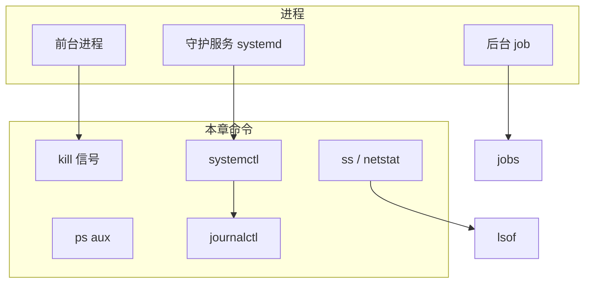
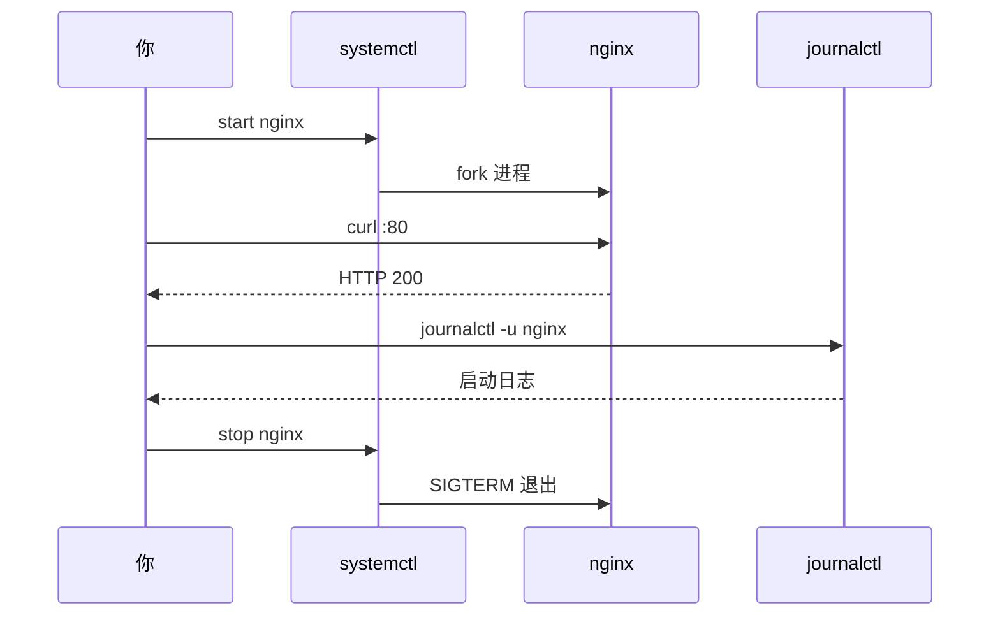

# 进程与服务管理

<!-- 修改说明: 2026-06-30 按 EXPANSION-STANDARD 扩充 §0、命令步骤表、FAQ≥10、闭卷自测、费曼检验；环境假设 VMware Ubuntu（见 todo.md） -->

> **文件编码**：UTF-8。本章在 **VMware Ubuntu** 终端操作，涵盖前台/后台进程、信号、systemd 服务、定时任务与端口排查——后端部署与运维的核心技能。[todo.md](../../todo.md) 必会 `ps top`；第 3 周 `curl` 联调依赖本章端口排查。

---

## 0. 读前导读（零基础也能跟上）

### 0.1 用一句话弄懂本章

**一句话**：程序跑起来叫 **进程**——用 `ps`/`top` 看谁占 CPU，`kill` 发信号停掉，`systemctl` 管 Nginx/MySQL **开机自启**，`ss`/`lsof` 查 **8080 被谁占用**。

**生活类比**：

| 概念 | 类比 |
|------|------|
| **进程 PID** | 餐厅桌号，每桌一道菜 |
| **SIGTERM** | 礼貌请客人结账离开 |
| **SIGKILL -9** | 保安强行抬走（无法拒绝） |
| **systemd** | 商场物业：开店、打烊、断电重启 |
| **nohup** | 你下班了任务还在后台干 |
| **crontab** | 闹钟定时执行任务 |
| **ss -tlnp** | 看哪些门（端口）在接客 |

---

### 0.2 你需要提前知道什么

| 水平 | 建议 |
|------|------|
| 05 章 Permission denied | 先理解 sudo |
| 未装 nginx | §6 会 `apt install nginx` |
| Spring Boot 已跑通 | 对照 8080 端口排查 §10 |

---

### 0.3 本章知识地图（☐→☑）

- [ ] `ps aux` 找 PID；`top`/`htop` 看资源
- [ ] `kill` vs `kill -9` 使用顺序
- [ ] `jobs`/`fg`/`bg`、`nohup ... &`
- [ ] `systemctl start/stop/enable/status`
- [ ] `journalctl -u -f -n`
- [ ] `crontab -e` 五段格式
- [ ] `ss -tlnp` / `lsof -i :PORT`
- [ ] 闭卷自测 ≥ 8/10

---

### 0.4 建议学习时长

| 阶段 | 时间 |
|------|------|
| §1～§5 进程与信号 | 1.5 h |
| §6～§7 systemd/nginx | 1.5 h |
| §8～§10 cron/端口/综合 | 1 h |
| 自测 | 30 min |

---

### 0.5 学完你能做什么

1. 排查「8080 端口被占用」并释放。
2. 安装 nginx，`enable` 开机自启，`journalctl -f` 盯日志。
3. 写 crontab 每 5 分钟写时间戳到日志。
4. 解释为何生产优先 `systemctl stop` 而非 `kill -9` MySQL。

---

## 本章与上一章的关系

[05 章 用户组与文件权限](./05-用户组与文件权限.md) 解决了「谁能读哪些文件」。程序跑起来后变成 **进程（process）**：占 CPU/内存、监听端口、写日志。Nginx/Java/Python 要以**服务**形式长期运行，崩溃要能拉起，开机要能自启——这些都由 **systemd** 和本章工具链负责。

| 上一章（05） | 本章（06） | 后续章节 |
|--------------|------------|----------|
| 文件权限 | 进程生命周期 | Docker / Nginx 部署 |
| sudo 提权 | systemctl 管服务 | 日志集中化 |
| www-data 用户 | 服务以谁运行 | 监控告警 |
| 共享目录 | 端口与 lsof | 07 网络基础 |



**本章你要完成**：

1. `ps aux` 看进程，`top`/`htop` 看实时资源
2. `kill` 信号（TERM、KILL、HUP）优雅与强制停止
3. `jobs`、`fg`、`bg` 与 `nohup` 后台跑任务
4. **systemd**：`systemctl start/stop/status/enable`、`journalctl` 看服务日志
5. `crontab` 定时任务
6. `lsof`、`ss`/`netstat` 查端口占用

---

## 1. 进程是什么

进程 = **正在运行的程序实例**。同一程序可开多个进程（如多个 worker）。

```bash
ps
ps -ef
ps aux
ps aux | head -5
```

**预期（ps aux | head -5）**：

```text
USER       PID %CPU %MEM    VSZ   RSS TTY      STAT START   TIME COMMAND
root         1  0.0  0.5 168000 11000 ?        Ss   Jun22   0:05 /sbin/init
root         2  0.0  0.0      0     0 ?        S    Jun22   0:00 [kthreadd]
student   1234  0.0  0.1  12345  3000 pts/0    R+   10:00   0:00 ps aux
```

| 列 | 含义 |
|----|------|
| USER | 运行用户 |
| PID | 进程 ID（唯一） |
| %CPU / %MEM | 资源占用 |
| STAT | 状态（R 运行，S 睡眠，Z 僵尸等） |
| COMMAND | 命令行 |

查特定进程：

```bash
ps aux | grep ssh
pgrep -a ssh
pidof bash
```

---

## 2. top 与 htop：实时监视

### 2.1 top

```bash
top
```

**交互键**：

| 键 | 作用 |
|----|------|
| `q` | 退出 |
| `M` | 按内存排序 |
| `P` | 按 CPU 排序 |
| `k` | 杀进程（输入 PID） |
| `1` | 显示各 CPU 核心 |

**预期**：顶部显示 load average、Tasks、%Cpu、内存；下方进程列表刷新。

### 2.2 htop（更友好，需安装）

```bash
sudo apt update
sudo apt install -y htop
htop
```

F9 发信号，F6 排序，方向键选择进程。VMware 给虚拟机 **2 核 2GB** 足够练习。

---

## 3. kill 与信号

停止进程不是「删除文件」，而是发**信号（signal）**。

### 3.1 常用信号

| 信号 | 数字 | 默认/用途 |
|------|------|-----------|
| SIGTERM | 15 | 礼貌请求退出（默认 kill） |
| SIGKILL | 9 | 强制杀死，无法捕获 |
| SIGHUP | 1 | 挂起/重载配置（很多 daemon） |
| SIGINT | 2 | 等同 Ctrl+C |

```bash
sleep 300 &
echo $!    # 打印刚后台任务的 PID
kill $!    # 发 SIGTERM
kill -9 $!  # 若仍不退出，SIGKILL（慎用）
kill -l    # 列出所有信号名
```

**预期（kill -l 部分）**：

```text
 1) SIGHUP   2) SIGINT   3) SIGQUIT   9) SIGKILL  15) SIGTERM
```

### 3.2 按名杀（谨慎）

```bash
pkill -f "sleep 300"
killall sleep
```

**生产环境**优先 `systemctl stop servicename`，不要随手 `kill -9` 数据库进程。

---

## 4. jobs、fg、bg：当前 Shell 的作业控制

仅对**当前终端**启动的后台任务有效（未 nohup 断开仍可能收 SIGHUP）。

### 4.1 手把手

```bash
sleep 200
# Ctrl+Z 挂起

jobs -l
```

**预期**：

```text
[1]+ 12345 Stopped                 sleep 200
```

```bash
bg %1          # 放到后台继续跑
jobs
fg %1          # 拉回前台
# Ctrl+C 结束
```

| 命令 | 作用 |
|------|------|
| `cmd &` | 启动后立刻后台 |
| `Ctrl+Z` | 挂起前台 |
| `bg %n` | 第 n 个 job 后台运行 |
| `fg %n` | 第 n 个 job 前台 |
| `jobs -l` | 列出 job 与 PID |

---

## 5. nohup：断开 SSH 仍继续跑

```bash
cd ~/study/linux-practice
nohup bash -c 'for i in $(seq 1 60); do echo "tick $i $(date)"; sleep 5; done' > logs/nohup.out 2>&1 &
echo $!
disown    # 可选：与 shell 完全脱离
tail -f logs/nohup.out
```

**预期 nohup.out**：

```text
nohup: ignoring input and appending output to 'logs/nohup.out'
tick 1 Mon Jun 23 10:00:00 CST 2026
tick 2 Mon Jun 23 10:00:05 CST 2026
...
```

关闭 SSH 窗口后进程仍运行（直到脚本结束或 kill PID）。

| 方式 | 适用 |
|------|------|
| `nohup ... &` | 临时长任务、批处理 |
| `systemd service` | 生产服务（推荐） |
| `screen` / `tmux` | 可重新 attach 的交互会话 |

---

## 6. systemd 与 systemctl

Ubuntu 16.04+ 默认 **systemd** 管理启动与服务。

| 步骤 | 你的动作 | 预期看到什么 | 若不对 |
|------|----------|--------------|--------|
| 1 | `sudo apt install -y nginx` | 安装完成 | `apt update` 先 |
| 2 | `sudo systemctl start nginx` | 无报错 | `nginx -t` 查配置 |
| 3 | `sudo systemctl status nginx` | `Active: active (running)` | 失败看 journalctl |
| 4 | `curl -I http://127.0.0.1/` | `HTTP/1.1 200 OK` | 防火墙 [07 章](./07-网络命令与防火墙基础.md) |
| 5 | `sudo systemctl enable nginx` | 创建 symlink | `is-enabled` 验证 |
| 6 | `sudo ss -tlnp \| grep :80` | nginx 监听 80 | stop 后应消失 |

### 6.1 单元（unit）类型

| 类型 | 说明 | 示例 |
|------|------|------|
| service | 守护进程 | nginx.service |
| timer | 定时（替代部分 cron） | apt-daily.timer |
| socket | 套接字激活 | docker.socket |

```bash
systemctl list-units --type=service --state=running | head -10
systemctl status ssh
```

**预期（systemctl status ssh 片段）**：

```text
● ssh.service - OpenBSD Secure Shell server
     Loaded: loaded (/lib/systemd/system/ssh.service; enabled; ...)
     Active: active (running) since ...
```

### 6.2 安装并管理 Nginx（手把手）

```bash
sudo apt update
sudo apt install -y nginx
sudo systemctl start nginx
sudo systemctl status nginx
curl -I http://127.0.0.1/
```

**预期 curl**：

```text
HTTP/1.1 200 OK
Server: nginx/1.18.0 (Ubuntu)
...
```

```bash
sudo systemctl stop nginx
sudo systemctl status nginx   # inactive (dead)

sudo systemctl start nginx
sudo systemctl restart nginx  # 停+启（改配置后常用）
sudo systemctl reload nginx   # 重载配置（若支持）

sudo systemctl enable nginx   # 开机自启
systemctl is-enabled nginx
```

**预期**：

```text
enabled
```

```bash
sudo systemctl disable nginx  # 取消自启（练习后可 enable 回去）
```

### 6.3 自定义练习服务（可选进阶）

```bash
sudo tee /etc/systemd/system/hello.service << 'EOF'
[Unit]
Description=Hello practice service
After=network.target

[Service]
Type=simple
User=student
WorkingDirectory=/home/student/linux-practice
ExecStart=/bin/bash -c 'while true; do date >> logs/hello-service.log; sleep 10; done'
Restart=on-failure

[Install]
WantedBy=multi-user.target
EOF

sudo systemctl daemon-reload
sudo systemctl start hello
sudo systemctl status hello
tail ~/study/linux-practice/logs/hello-service.log
sudo systemctl stop hello
sudo systemctl disable hello
```

---

## 7. journalctl：systemd 日志

服务 stdout/stderr 默认进 **journal**。

```bash
sudo journalctl -u nginx -n 20 --no-pager
sudo journalctl -u nginx -f          # 类似 tail -f
sudo journalctl -u nginx --since "1 hour ago"
sudo journalctl -p err -b            # 本次启动以来的 error 级
journalctl --user -u hello 2>/dev/null || true
```

**预期（nginx -n 5 片段）**：

```text
Jun 23 10:00:00 ubuntu systemd[1]: Started A high performance web server...
```

| 选项 | 含义 |
|------|------|
| `-u UNIT` | 指定服务 |
| `-f` | 跟踪 |
| `-n N` | 最后 N 行 |
| `--since` / `--until` | 时间范围 |
| `-p priority` | emerg..alert..crit..err..warning..notice..info..debug |

与 [04 章](./04-文本查看编辑与搜索.md) 的 `tail -f app.log` 互补：**应用写文件** vs **systemd 捕获输出**。

---

## 8. crontab：定时任务

```bash
crontab -l    # 当前用户任务（可能为空）
crontab -e    # 编辑（默认 nano）
```

添加一行（每 5 分钟写时间戳到日志）：

```cron
*/5 * * * * date >> /home/student/linux-practice/logs/cron.log 2>&1
```

**五段含义**：

```text
分 时 日 月 周  命令
*/5 * * * *  ...
```

| 字段 | 范围 |
|------|------|
| 分 | 0-59 |
| 时 | 0-23 |
| 日 | 1-31 |
| 月 | 1-12 |
| 周 | 0-7（0 与 7 均为周日） |

验证：

```bash
# 等 5 分钟或改为一分钟 */1 测试
cat ~/study/linux-practice/logs/cron.log
```

**预期**：

```text
Mon Jun 23 10:05:01 CST 2026
Mon Jun 23 10:10:01 CST 2026
```

系统 cron：`/etc/crontab`、`/etc/cron.d/`（需 root）。查看 cron 服务：

```bash
systemctl status cron
```

---

## 9. lsof：什么进程打开了什么

需安装：

```bash
sudo apt install -y lsof
sudo lsof -i :80
sudo lsof -i :22
lsof ~/study/linux-practice/logs/app.log
```

**预期（lsof -i :80，nginx 运行时）**：

```text
COMMAND  PID     USER   FD   TYPE DEVICE SIZE/OFF NODE NAME
nginx   1234     root    6u  IPv4  12345      0t0  TCP *:http (LISTEN)
nginx   1235 www-data    6u  IPv4  12345      0t0  TCP *:http (LISTEN)
```

| 用法 | 作用 |
|------|------|
| `lsof -i :PORT` | 谁监听/占用端口 |
| `lsof -p PID` | 进程打开了哪些文件 |
| `lsof file` | 谁占着该文件 |

---

## 10. ss 与 netstat：查端口与连接

现代 Linux 优先 **ss**（更快）；**netstat** 常来自 `net-tools` 包。

```bash
ss -tlnp
sudo ss -tlnp    # 显示进程名需 sudo
ss -tunap | grep 8080
```

**预期（ss -tlnp 片段）**：

```text
State  Recv-Q Send-Q Local Address:Port Peer Address:Port Process
LISTEN 0      128    0.0.0.0:22        0.0.0.0:*     users:(("sshd",pid=999,fd=3))
LISTEN 0      511    0.0.0.0:80        0.0.0.0:*     users:(("nginx",pid=1234,fd=6))
```

```bash
sudo apt install -y net-tools
netstat -tlnp
netstat -tunap | grep LISTEN
```

| 选项 | 含义 |
|------|------|
| `-t` | TCP |
| `-u` | UDP |
| `-l` | 仅监听 LISTEN |
| `-n` | 数字显示端口 |
| `-p` | 进程（常需 sudo） |

**排查「端口被占用」标准流程**：

```bash
sudo ss -tlnp | grep :8080
# 或
sudo lsof -i :8080
kill <PID>   # 或 systemctl stop xxx
```

---

## 11. 综合实操：从启动到排错

在 VMware 里完整走一遍「服务生命周期」。

```bash
# 1. 启动 nginx
sudo systemctl start nginx
sudo systemctl enable nginx

# 2. 确认端口
sudo ss -tlnp | grep :80

# 3. 看日志
sudo journalctl -u nginx -n 10 --no-pager
tail -f /var/log/nginx/access.log &
TAIL_PID=$!

# 4. 产生访问
curl http://127.0.0.1/

# 5. 优雅重载配置
sudo nginx -t && sudo systemctl reload nginx

# 6. 模拟故障停止
sudo systemctl stop nginx
sudo ss -tlnp | grep :80   # 应无输出

# 7. 恢复
sudo systemctl start nginx
kill $TAIL_PID 2>/dev/null
```



---

## 12. 深入解释

### 12.1 SIGTERM 与 SIGKILL：为什么别一上来 -9？

进程收到 **SIGTERM** 后可以：

1. 刷盘、关闭数据库连接
2. 通知子进程退出
3. 删除临时文件

**SIGKILL(9)** 由内核立即终止，**无法被捕获或忽略**，可能导致数据损坏或僵尸锁文件。

正确顺序：`systemctl stop` / `kill PID`（TERM）→ 等待数秒 → 仍存活再 `kill -9`。数据库、消息队列尤其禁止粗暴 -9。

### 12.2 systemd 为何取代 SysV init？

| 对比 | SysV init | systemd |
|------|-----------|---------|
| 启动 | 串行脚本 | 并行依赖（After/Wants） |
| 日志 | 各写各的文件 | 统一 journalctl |
| 管理 | `/etc/init.d/` 脚本 | unit 文件 + systemctl |
| 自启 | chkconfig | enable/disable |

后端部署文档几乎清一色 `systemctl restart xxx`；Docker 容器内可能是 tini/supervisord，但 **VM 上的 Ubuntu 服务一定是 systemd**。

---

## 13. 本章知识点清单

- [ ] `ps aux` 找 PID，`top`/`htop` 看资源
- [ ] `kill` / `kill -9` 区别，优先 TERM
- [ ] `jobs`、`fg`、`bg`、`nohup ... &`
- [ ] `systemctl start/stop/restart/status/enable/disable`
- [ ] `journalctl -u -f -n`
- [ ] `crontab -e` 五段格式
- [ ] `ss -tlnp` / `lsof -i :PORT` 查占用

---

## 14. 分级练习

**基础**：后台运行 `sleep 1000 &`，用 `jobs` 和 `ps` 找到 PID，`kill` 结束。

**进阶**：安装 nginx，`enable` 开机自启，改默认页 `/var/www/html/index.html` 为自定义内容，`reload` 后 curl 验证。

**挑战**：编写 `hello.service`（§6.3），设置 `Restart=always`，`kill -9` 主进程后观察 systemd 是否自动拉起（`status` 里看 restart 计数）。

### 14.1 参考答案（基础）

```bash
sleep 1000 &
jobs -l
PID=$(pgrep -n sleep)
kill $PID
jobs
ps aux | grep "[s]leep 1000"   # 应无输出
```

### 14.2 参考答案（进阶）

```bash
sudo apt install -y nginx
echo "<h1>Linux 06 Practice</h1>" | sudo tee /var/www/html/index.html
sudo systemctl enable nginx
sudo systemctl reload nginx
curl http://127.0.0.1/
systemctl is-enabled nginx
```

**预期 curl 含** `Linux 06 Practice`。

### 14.3 参考答案（挑战）

```bash
# 使用 §6.3 hello.service，改 Restart=always
sudo sed -i 's/Restart=on-failure/Restart=always/' /etc/systemd/system/hello.service
sudo systemctl daemon-reload
sudo systemctl restart hello
MAIN_PID=$(systemctl show -p MainPID --value hello)
sudo kill -9 "$MAIN_PID"
sleep 2
systemctl status hello
```

**预期**：`Active: active (running)` 且 status 显示 restart 次数增加。

---

## 15. 常见报错与排查

| 报错信息（关键词） | 可能原因 | 解决方案 |
|-------------------|---------|---------|
| `Failed to start nginx.service` | 配置语法错或端口占用 | `nginx -t`；`ss -tlnp \| grep :80` |
| `Address already in use` | 端口被占 | `sudo lsof -i :PORT`；停冲突服务 |
| `Job for nginx.service failed` | unit 脚本失败 | `journalctl -xeu nginx` |
| `Unit nginx.service not found` | 未安装 | `apt install nginx` |
| `Permission denied`（绑定 80） | 非 root 绑低端口 | sudo 或 authbind/setcap（进阶） |
| `no job control` | 非交互 shell | 不用 jobs；用 systemd |
| `bash: kill: (123) - No such process` | PID 已退出 | 重新 ps 查 PID |
| `crontab: installing new crontab` 无执行 | 路径/权限错 | cron 里用绝对路径；查 `/var/log/syslog` |
| `lsof: command not found` | 未安装 | `apt install lsof` |
| `Netstat command not found` | 未装 net-tools | `apt install net-tools` 或改用 ss |
| `Cannot allocate memory` | VM 内存不足 | VMware 调大内存；`free -h` |
| `Too many open files` | ulimit 太小 | `ulimit -n`；调 `/etc/security/limits.conf`（进阶） |
| zombie defunct | 父进程未 wait | 重启父服务；非单独 kill 僵尸 |
| `nohup: failed to run command` | 命令路径错 | 用绝对路径 `/usr/bin/bash` |

---

## 16. 练习建议

1. **每天 `systemctl status`** 看 ssh、nginx、cron
2. 故意 `stop nginx`，用 `curl` 和 `ss` 确认端口释放
3. 对比同一时刻 `journalctl -u nginx` 与 `/var/log/nginx/error.log`
4. VMware 快照前停服务，快照后练习 kill/restart
5. 把 [04 章](./04-文本查看编辑与搜索.md) 的 `tail -f` 和本章 `journalctl -f` 连着用

---

## 17. 学完标准

完成本章后，你应能**不看文档**完成：

1. 查找占用 **8080** 端口的进程并停止
2. 安装、start、enable、status、journalctl 跟踪 **nginx**
3. 写一条 **crontab** 定时追加日志
4. 解释 SIGTERM 与 SIGKILL 使用场景
5. 用 `nohup` 跑后台脚本并 `tail` 其输出

**量化自检**：

- [ ] 成功 enable 至少 1 个服务
- [ ] 用过 `journalctl -u xxx -f` 至少 5 分钟
- [ ] 完成 crontab 且 `cron.log` 有时间戳
- [ ] 用 ss 或 lsof 解决过一次端口冲突

---

---

## 17.5 VMware 服务排查速查（联调 notehub）

| 症状 | 第一条命令 | 第二条命令 |
|------|------------|------------|
| 页面打不开 | `systemctl status nginx` | `curl -I http://127.0.0.1/` |
| 8080 占用 | `sudo ss -tlnp \| grep 8080` | `sudo kill <PID>` 或 stop 服务 |
| jar 崩溃 | `journalctl -u notehub -n 30` | `tail -f ~/study/linux-practice/logs/*.log` |
| cron 不跑 | `systemctl status cron` | `grep CRON /var/log/syslog` |

**15 分钟 systemd 复习**：

```bash
sudo systemctl status ssh
ps aux | head -5
sleep 60 &
jobs -l
kill $(pgrep -n sleep)
sudo ss -tlnp | grep :22
crontab -l
```

| 步骤 | 动作 | 预期 |
|------|------|------|
| 1 | `systemctl is-enabled ssh` | enabled |
| 2 | `pgrep -a sshd` | sshd 进程 |
| 3 | `sudo journalctl -u ssh -n 3 --no-pager` | 最近日志 |
| 4 | `free -h` | VM 内存够 2GB+ |
| 5 | `top -bn1 \| head -15` | 非交互 snapshot |

[todo.md](../../todo.md) 第 5 周：`java -jar` 前先 `ss -tlnp` 确认端口；部署后用 `systemctl` 托管（见 [Java 09](../../后端学习/Java/09-LinuxDockerNginx部署基础.md)）。

---

## 18. 常见问题 FAQ

**Q1：怎么查 8080 被谁占用？**  
`sudo ss -tlnp | grep 8080` 或 `sudo lsof -i :8080`，记下 PID 后 `kill` 或 `systemctl stop`。

**Q2：`kill` 和 `kill -9` 先用哪个？**  
先 **SIGTERM（默认 kill）** 礼貌退出；数秒后仍存活再用 **kill -9**；数据库勿一上来 -9。

**Q3：`systemctl status` 里 active (running) 和 enabled 区别？**  
running=当前在跑；enabled=**开机自启**已配置。可 running 但 disabled。

**Q4：SSH 断开后我的脚本停了？**  
前台进程收 SIGHUP；用 **`nohup cmd &`** 或 **systemd service** 或 tmux。

**Q5：journalctl 和 tail -f app.log 区别？**  
journalctl 看 **systemd 托管**服务的 stdout/stderr；应用自己写文件的用 tail -f（[04 章](./04-文本查看编辑与搜索.md)）。

**Q6：crontab 写了不执行？**  
命令用**绝对路径**；查 `/var/log/syslog`；`systemctl status cron` 是否在跑。

**Q7：僵尸进程 Z 状态怎么办？**  
杀**父进程**或重启父服务；单独 kill 僵尸无效（已死，等父 wait）。

**Q8：VMware 里 top 显示 CPU 100% 正常吗？**  
编译/误操作可能；`top` 按 P 排序找元凶；内存 `free -h` 看是否 OOM。

**Q9：notehub jar 怎么做成服务？**  
写 `/etc/systemd/system/notehub.service`，`ExecStart=/usr/bin/java -jar ...`，`systemctl enable --now notehub`（[Java 09](../../后端学习/Java/09-LinuxDockerNginx部署基础.md)）。

**Q10：`Address already in use` 但 ss 看不到？**  
可能刚释放处于 TIME_WAIT；换端口或 `ss -tlnp` 加 sudo；检查是否只绑了 127.0.0.1。

**Q11：hello.service 改完不生效？**  
必须 **`sudo systemctl daemon-reload`** 再 restart。

**Q12：ps aux 里 COMMAND 被截断？**  
`ps auxww` 或 `cat /proc/PID/cmdline` 看完整命令行。

---

## 19. 闭卷自测

### 概念题（6 道）

1. PID 是什么？如何查当前 shell 后台任务 PID？
2. SIGTERM 与 SIGKILL 区别与使用顺序？
3. `systemctl restart` 与 `reload` 区别（nginx 场景）？
4. crontab 五段分别表示什么？`*/5 * * * *` 含义？
5. `ss -tlnp` 各参数含义？
6. 为何生产服务推荐 systemd 而非 nohup？

### 动手题（2 道）

7. 后台启动 `sleep 1000`，写出查 PID 并 kill 的完整命令。
8. 写出安装 nginx、enable、curl 验证、journalctl 看最后 10 行的命令序列。

### 综合题（2 道）

9. Spring Boot 8080 启动失败报端口占用——写出排查四步命令链。
10. [todo.md](../../todo.md) 第 5 周要在 Ubuntu `java -jar` + curl——服务异常退出时你会看哪两个日志来源？

### 自测参考答案

1. 进程 ID；`jobs -l` 或 `$!` 或 `pgrep sleep`。
2. TERM 可捕获做清理；KILL 强杀不可捕获；先 TERM 后 KILL。
3. restart 停+启；reload 重载配置不中断连接（若服务支持）。
4. 分 时 日 月 周；每 5 分钟执行一次。
5. -t TCP；-l 仅 LISTEN；-n 数字端口；-p 进程（常需 sudo）。
6. 开机自启、统一日志、失败重启策略、依赖顺序。
7. `sleep 1000 &` → `kill $(pgrep -n sleep)` 或 `kill $!`。
8. `sudo apt install -y nginx && sudo systemctl enable --now nginx && curl -I http://127.0.0.1/ && sudo journalctl -u nginx -n 10 --no-pager`。
9. `sudo ss -tlnp | grep 8080` → 确认 listener → stop/kill 占用的进程 → 再启动 jar → `curl localhost:8080/actuator/health`。
10. `journalctl -u notehub -f`（若 systemd）+ 应用 `logs/` 下 tail -f；另 `systemctl status`。

**systemctl 动词速记**：start/stop/restart/reload/status/enable/disable；改 unit 后 **daemon-reload**。

---

## 20. 费曼检验

**任务**：3 分钟说明「notehub 部署到 VMware Ubuntu 后，如何确认服务在跑、端口开着、出问题先看什么」。

**对照提纲**：

1. **`systemctl status`** + **`ss -tlnp | grep 8080`** 确认进程与监听。
2. **`curl` 本机 API** 验证业务层；不行再 **journalctl -u -f** 或 tail 应用日志。
3. 停服务优先 **systemctl stop**；改配置 **reload**；定时任务用 **crontab** 绝对路径。

---

## 面试深挖补充：进程状态、僵尸/OOM 与 systemd unit

前面 §1～§20 把进程管理的"用法"铺开了，但面试官深挖的是几个**底层原理**：`ps` 里的 STAT 字母到底什么意思？僵尸进程怎么产生的、为什么有害？OOM Killer 怎么决定杀谁？怎么自己写一个 systemd unit 让 Java 应用开机自启？这一节把这些问题一次讲透。

> 这节是给 §3/§6/§12 等"基础认知"小节补上"底层为什么"，建议对照着读。

### A. 进程状态机：R/S/D/Z/T（高频）

**一句话**：Linux 进程有几种状态，`ps`/`top` 的 STAT 列用字母表示——`R` 运行、`S` 可中断睡眠、`D` 不可中断睡眠、`Z` 僵尸、`T` 暂停/被追踪。看懂这些字母是排查"进程卡住"的第一步。

**五种基本状态**：

| 字母 | 状态 | 含义 | 典型场景 |
|------|------|------|----------|
| `R` | Running/Runnable | 正在 CPU 上跑，或在就绪队列等 CPU | 正常计算的进程 |
| `S` | Interruptible Sleep | 可中断睡眠，等待事件（IO、信号、定时） | 等 socket 读、sleep、等锁 |
| `D` | Uninterruptible Sleep | 不可中断睡眠，**不响应信号**（连 kill -9 都没用） | 等磁盘 IO、内核态持锁 |
| `Z` | Zombie | 僵尸，已退出但父进程还没回收 | 见 §B |
| `T` | Stopped/Traced | 暂停（SIGSTOP/Ctrl+Z）或被调试器追踪 | `kill -19`、gdb attach |

**额外修饰位**：
- `+`：前台进程组（如 `R+`）。
- `s`：会话首进程（如 `Ss`，典型是 sshd、bash）。
- `l`：多线程（如 `Sl`，Java 进程常见）。
- `<`：高优先级。
- `N`：低优先级（nice >0）。

**怎么查**：`ps aux` 的第 8 列 STAT；`top` 的 S 列。Java 服务卡死时常看到一堆 `Sl`（多线程睡眠，正常）或个别 `D`（等 IO，需警惕）。

**为什么 `D` 状态连 `kill -9` 都没用**：`D` 是不可中断睡眠，进程在内核态等待某个 IO 完成，此时不处理任何信号——信号要等进程回到用户态才被处理。所以磁盘卡死、NFS hang 时进程会长时间 `D`，`kill -9` 也杀不掉，只能等 IO 恢复或重启。这是排查"D 状态进程"要往磁盘/网络 IO 方向查的原因。

**面试标准答法**：
> Linux 进程状态有 R 运行/就绪、S 可中断睡眠（等 IO/信号）、D 不可中断睡眠（等内核 IO，不响应 kill -9）、Z 僵尸、T 暂停。ps/top 的 STAT 列显示，还有 +前台、s会话首、l多线程等修饰位。D 状态杀不掉是因为信号要回用户态才处理，进程卡在内核态等 IO 时收不到信号，要往磁盘/网络 IO 方向排查。

---

### B. 僵尸进程与孤儿进程（高频易混）

**一句话**：僵尸进程是**子进程已退出但父进程没调用 wait 回收**，残留一个占用 PID 和少量内核结构的"尸体"；孤儿进程是**父进程先死了**，子进程被 init（PID 1，systemd）收养，由 init 负责回收——孤儿无害，僵尸有害。

**僵尸进程怎么产生**：
1. 子进程退出时，内核保留它的退出状态（exit code、资源统计）在进程表里，状态变 `Z`。
2. 内核给父进程发 **SIGCHLD** 信号，通知"你的子进程死了，来收尸"。
3. 父进程应该调用 `wait()`/`waitpid()` 读取子进程退出状态，内核才真正释放那一条进程表项。
4. 如果父进程**不 wait 也不处理 SIGCHLD**，子进程就一直停在 `Z` 状态——这就是僵尸。

**僵尸的危害**：
- 每个僵尸占一个 PID。Linux PID 数量有限（默认 32768，可调到更高），僵尸堆积会**耗尽 PID**，导致无法 fork 新进程（"fork: Resource temporarily unavailable"）。
- 僵尸本身不占内存和 CPU（尸体很轻），但占进程表项。

**怎么处理僵尸**：
1. 找出僵尸的父进程：`ps -o pid,ppid,stat,cmd -p <zombie_pid>` 看 PPID。
2. 让父进程去回收：
   - 如果父进程是 bug 没处理 SIGCHLD，修代码（注册 SIGCHLD 处理或显式 wait）。
   - 临时手段：给父进程发 SIGCHLD `kill -CHLD <parent_pid>`，提醒它去回收。
3. 杀掉父进程：父进程退出后，僵尸变成孤儿，被 init（PID 1）收养并自动回收。这是兜底但会连累父进程其它功能。

**为什么不能直接 `kill -9` 僵尸**：僵尸已经死了，`kill -9` 对一个已退出的进程没意义。要清掉它必须让它父进程 wait 或父进程也退出。

**孤儿进程为什么无害**：
- 父进程先死，子进程的 PPID 被重新设为 1（init/systemd）。
- init 设计上会自动 wait 它收养的孤儿，所以孤儿不会变僵尸。
- 后台守护进程（daemon）本质就是主动脱离父进程变成"孤儿"被 init 收养，这是正常机制，不是 bug。
- `nohup` + `&` 让进程在 SSH 断开后继续跑，原理之一就是脱离终端会话（§5 讲过），和孤儿机制配合。

**面试标准答法**：
> 僵尸进程是子进程已退出但父进程没 wait 回收，占 PID 不占内存，堆积会耗尽 PID 导致无法 fork。处理靠让父进程 wait（修代码或发 SIGCHLD）或杀掉父进程让 init 收养回收，kill -9 对已死的僵尸无效。孤儿进程是父进程先死、子进程被 init(PID1) 收养自动回收，无害，daemon 和 nohup 本质就是利用孤儿机制。

---

### C. OOM Killer：内存不够时内核杀谁

**一句话**：系统物理内存+swap 耗尽、无法再分配时，Linux 内核的 OOM Killer 会被触发，按"打分"挑一个"占内存多又不太重要"的进程杀掉，腾出内存保住系统。Java 服务常是被杀的重灾区。

**触发时机**：内核分配内存（malloc 触发的缺页、fork、页面分配）时，如果内存不足且无法回收（已经尝试过回收缓存页等），调用 OOM Killer。

**oom_score 怎么算**：
- 每个进程有 `/proc/<pid>/oom_score`（0～1000 分），分数越高越容易被杀。
- 主要因素：
  - 占用内存越大，分越高（这是主因）。
  - 进程优先级（nice/oom_score_adj）可调整：`oom_score_adj` 范围 -1000～1000，设 -1000 表示"绝不杀我"，1000 表示"优先杀我"。
  - root 进程、长期运行进程略有保护。
- OOM Killer 选 `oom_score` 最高的进程杀。

**Java 为什么常被 OOM 杀**：
- JVM 堆大（动辄几个 G），oom_score 自然高。
- JVM 收到 SIGKILL 直接被杀，没有优雅退出的机会（不像 SIGTERM 能跑 shutdown hook）。
- 现象：`dmesg` 里出现 `Out of memory: Killed process xxx (java)`，应用突然消失，没有 Java 层的 OOM 异常日志（区别于 JVM 堆内 OOM，那是 java.lang.OutOfMemoryError，进程还活着）。

**怎么排查和预防**：
1. **确认是被 OOM 杀的**：`dmesg -T | grep -i "killed process"` 或 `journalctl -k | grep -i oom`，能看到被杀的进程和当时内存情况。
2. **调低 Java 进程的 oom_score**：`echo -1000 > /proc/<java_pid>/oom_score_adj`（临时），或在 systemd unit 里设 `OOMScoreAdjust=-500`（持久）。
3. **合理设 JVM 堆**：`-Xmx` 不要超过物理内存的合理比例，留出堆外内存（Direct Buffer、Metaspace、线程栈、GC 开销）和系统开销。容器里还要受 cgroup 内存限制约束。
4. **加 swap 或保证物理内存足够**：内存真的不够，调参是治标，扩内存或拆服务才是治本。
5. **区别两种 OOM**：
   - **内核 OOM Killer**：系统级，进程被 SIGKILL，dmesg 有记录，JVM 无日志就消失。
   - **JVM 堆 OOM**：java.lang.OutOfMemoryError: Java heap space，进程还在，有异常栈，可通过 -Xmx 或排查泄漏解决。

**面试标准答法**：
> OOM Killer 在系统内存+swap 耗尽时触发，按 oom_score 打分杀分最高的进程，主要看占用内存大小，可用 oom_score_adj 调整（-1000 绝不杀）。Java 因堆大常被杀，dmesg 有 Killed process (java) 记录且 JVM 无日志就消失。排查用 dmesg/journalctl -k，预防靠调低 OOMScoreAdjust、合理 -Xmx、保证内存。要区分内核 OOM（进程被杀）和 JVM 堆 OOM（OutOfMemoryError 进程还在）。

---

### D. SIGCHLD 与 wait：僵尸的根因在信号处理

**为什么 §B 的僵尸问题要单独讲 SIGCHLD**：僵尸的本质是"父进程没处理子进程退出"。处理方式有两种，都和 SIGCHLD 有关：

1. **显式 wait**：父进程在某个时机调用 `wait()`/`waitpid()` 阻塞等子进程退出，拿到状态后内核回收。
2. **处理 SIGCHLD 信号**：子进程退出时内核给父进程发 SIGCHLD，父进程在信号处理函数里调 `waitpid(-1, &status, WNOHANG)` 循环回收所有已退出的子进程。

**两种会导致僵尸的常见父进程写法**：
- 父进程 fork 后忙自己的事，从不 wait、也不管 SIGCHLD → 子进程全部变僵尸。
- 父进程**显式忽略 SIGCHLD**（`signal(SIGCHLD, SIG_IGN)`）——这种情况内核反而会自动回收子进程（不产生僵尸），但这是 POSIX 的特殊约定，别和"不处理"搞混。

**shell 里为什么偶尔看到僵尸**：bash 跑一个前台命令再 fork 子进程，如果子进程的子进程退出而中间那个没 wait，可能短暂出现僵尸；但 bash 通常会处理 SIGCHLD 回收。看到持久僵尸一般是某个服务程序的 bug。

**对后端的意义**：你写 Java/Python 服务如果自己 fork 子进程（比如执行外部命令、多进程 worker），要理解这个机制——Java 的 `Process` API 由 JVM 内部处理子进程回收，通常不用你操心；但用 C/Go 直接 fork 要自己管。

**面试标准答法**：
> 僵尸根因是父进程没处理子进程退出。子进程退出内核发 SIGCHLD 给父进程，父进程要么显式 wait/waitpid 拿状态，要么在 SIGCHLD 处理函数里 waitpid(WNOHANG) 循环回收。显式忽略 SIGCHLD（SIG_IGN）内核反而自动回收不产生僵尸。Java Process API 由 JVM 内部处理，直接 fork 才需自己管。

---

### E. systemd unit 文件：自己写一个开机自启服务

**为什么面试爱问**：后端部署 Java 应用到 VM，标准做法就是写一个 systemd service，让应用开机自启、崩溃重启、统一用 `systemctl`/`journalctl` 管理。能现场写一个 unit 文件是基本功。

**unit 文件结构（三个核心段）**：

```ini
[Unit]
Description=My Java Backend Service        # 描述，systemctl status 会显示
Documentation=https://my.service/docs
After=network-online.target                # 在网络就绪后再启动（依赖顺序）
Wants=network-online.target                # 弱依赖：尽量在网络就绪后启动，网络挂了不影响我

[Service]
Type=simple                                # 启动类型，见下表
User=appuser                               # 用哪个用户跑（别用 root）
WorkingDirectory=/opt/myapp                # 工作目录
ExecStart=/usr/bin/java -jar /opt/myapp/app.jar  # 启动命令（必须绝对路径）
ExecStop=/bin/kill -TERM $MAINPID          # 停止命令（可省，默认发 SIGTERM）
Restart=on-failure                         # 崩溃自动重启
RestartSec=5s                              # 重启间隔
SuccessExitStatus=143                      # SIGTERM 退出码 143 算正常退出（不被当成失败重启）
Environment=SPRING_PROFILES_ACTIVE=prod    # 环境变量
OOMScoreAdjust=-500                        # 降低被 OOM Killer 杀的概率（呼应 §C）
LimitNOFILE=65536                          # 文件描述符上限（Java 服务常调大）

[Install]
WantedBy=multi-user.target                 # 装到哪个 target，multi-user 相当于运行级 3（多用户命令行）
```

**Type 的几种取值（面试常问区别）**：

| Type | 含义 | 适用场景 |
|------|------|----------|
| `simple`（默认） | ExecStart 启动的进程就是主进程，systemd 认为 fork 出来就启动完成 | 前台运行的程序（java -jar、Python uvicorn） |
| `forking` | ExecStart 会 fork 子进程然后父进程退出，主进程是子进程 | 传统 daemon（nginx、sshd 老式写法） |
| `notify` | 服务通过 sd_notify 通知 systemd"我准备好了" | 需要就绪检测的服务（现代服务配合 sd_notify） |
| `oneshot` | 跑一次就结束的任务 | 开机脚本、初始化任务 |

**依赖关系：Wants/Requires/After/Before**：
- `Wants=`：弱依赖，启动对方但对方失败不影响自己。
- `Requires=`：强依赖，对方失败自己也跟着失败。
- `After=`/`Before=`：仅**顺序**，不是依赖。要"等对方起来再启动"必须同时写 `Requires=`+`After=`（After 只保证顺序、不保证对方成功）。

**部署一个 Java 服务的完整步骤**：

```bash
# 1. 写 unit 文件（放 /etc/systemd/system/，系统级）
sudo vim /etc/systemd/system/myapp.service
# 把上面的 [Unit]/[Service]/[Install] 内容粘进去，改 ExecStart 路径

# 2. 重载 systemd 配置（每次改 unit 文件都要执行）
sudo systemctl daemon-reload

# 3. 设置开机自启
sudo systemctl enable myapp

# 4. 启动
sudo systemctl start myapp

# 5. 查状态（看是否 active、看最近日志）
sudo systemctl status myapp

# 6. 看实时日志（systemd 统一日志）
sudo journalctl -u myapp -f
```

**改了 unit 文件必须 `daemon-reload`**：systemd 把 unit 文件缓存到内存，改了文件不 reload 不会生效——这是新手最常踩的坑（"我明明改了配置为什么没生效"）。

**为什么 `SuccessExitStatus=143`**：`systemctl stop` 给进程发 SIGTERM，进程被信号终止的退出码是 128+15=143。默认 systemd 把 143 当成异常退出会触发 `Restart=on-failure` 重启——但你 stop 是故意的，不该重启。设 `SuccessExitStatus=143` 让 143 算成功退出，不触发重启。Java/Go 服务都常用这个。

**面试标准答法**：
> systemd unit 文件分 [Unit]（描述和依赖 After/Wants/Requires）、[Service]（Type 启动类型、User、ExecStart 绝对路径、Restart、OOMScoreAdjust、LimitNOFILE）、[Install]（WantedBy=multi-user.target）。Java 服务用 Type=simple、ExecStart=java -jar。部署步骤：写 unit 到 /etc/systemd/system、daemon-reload、enable、start、journalctl -u 看日志。改 unit 必须 daemon-reload。SuccessExitStatus=143 让 SIGTERM 退出不被当成失败重启。After 只保证顺序要配 Requires 才保证依赖成功。

---

### F. 这几个深挖点的关联

- **A 进程状态 + B 僵尸**：僵尸就是 `Z` 状态进程，理解状态机才能在 ps 里一眼认出僵尸。
- **B 僵尸 + D SIGCHLD**：僵尸的根因和解决都在 SIGCHLD 的处理上。
- **C OOM + E systemd unit**：unit 文件里的 `OOMScoreAdjust` 就是用来降低 Java 进程被 OOM 杀的概率，两者直接呼应。
- **E systemd + §12.2**：理解了 unit 文件，才真正理解"systemd 为何取代 SysV init"——unit 的依赖声明、并行启动、统一日志是 SysV 脚本做不到的。

---

### G. 面试自检（这节看完应能答）

- [ ] R/S/D/Z/T 五种进程状态分别什么含义？D 状态为什么 kill -9 杀不掉？
- [ ] 僵尸进程怎么产生？危害是什么？为什么不能直接 kill -9 僵尸？怎么处理？
- [ ] 孤儿进程为什么无害？daemon 和 nohup 怎么利用孤儿机制？
- [ ] OOM Killer 按什么打分杀进程？Java 为什么常被杀？怎么排查、怎么预防？
- [ ] 内核 OOM Killer 杀进程 和 JVM 堆 OutOfMemoryError 有什么区别？
- [ ] systemd unit 文件三个段是什么？Type=simple 和 forking 区别？After 和 Requires 区别？
- [ ] 改了 unit 文件要执行什么命令？为什么 Java 服务的 unit 要设 SuccessExitStatus=143？

---

## 21. 下一章预告

06 章你能在 VMware 里**管进程、管服务、查端口、定任务**。真实后端还要把应用**打包、放容器、反代、上 HTTPS**——[07 网络基础与 SSH](./07-网络命令与防火墙基础.md)（或路线图中的 Docker/Nginx 章节）会把本章的 nginx 与 systemd 接到**外网访问**与**多机协作**场景。

在此之前，建议巩固：保持 nginx 运行，每天 `curl localhost`，并习惯出问题先 **`systemctl status` + `journalctl -xe`**。

---

*继续学习：见 [07 网络命令与防火墙基础](./07-网络命令与防火墙基础.md)*

*本章已按 EXPANSION-STANDARD 扩充（§0+systemctl 步骤表+FAQ+自测+费曼）。*

**EXPANSION-STANDARD 自检**：☑ §0 ☑ 步骤表 §6 ☑ FAQ≥10 ☑ 闭卷 10 题 ☑ 费曼 ☑ VMware Ubuntu
