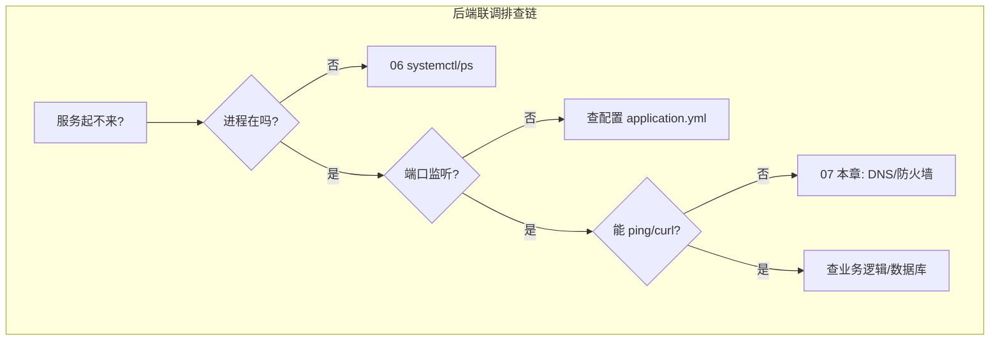
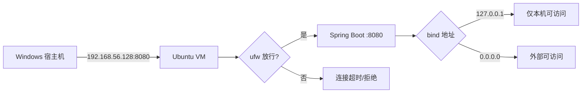

# 网络命令与防火墙基础

<!-- 修改说明: 2026-06-30 按 EXPANSION-STANDARD 扩充 §0、命令步骤表、FAQ≥10、闭卷自测、费曼检验；环境假设 VMware Ubuntu（见 todo.md） -->

> **文件编码**：UTF-8。本章示例以 **VMware + Ubuntu 22.04/24.04 LTS** 为主；Windows 宿主机用 PowerShell 对照说明。面向 **Java / Python 后端** 联调与部署排查。[todo.md](../../todo.md) 必会 `curl`；第 3 周前后端联调、第 5 周部署均依赖本章。

---

## 0. 读前导读（零基础也能跟上）

### 0.1 用一句话弄懂本章

**一句话**：服务启动了却连不上——用 `ip a` 看 **IP**，`ping`/`curl` 测 **通不通**，`ss -tlnp` 看 **端口有没有监听**，`dig`/`/etc/hosts` 查 **DNS**，`ufw` 看 **防火墙有没有拦**。

**生活类比**：

| 工具 | 类比 |
|------|------|
| **ip addr** | 查自己家门牌号 |
| **ping** | 对邻居喊一声看有没有回应 |
| **curl** | 按门铃并看对方是否开门（HTTP） |
| **ss -tlnp** | 看哪家店在营业（LISTEN） |
| **/etc/hosts** | 私人通讯录强行备注 |
| **ufw** | 小区保安要不要放行访客 |
| **NAT/桥接** | 虚拟机是「内网房间」还是「街上独立店铺」 |

---

### 0.2 你需要提前知道什么

| 水平 | 建议 |
|------|------|
| 06 章 ss/lsof | 本章 §5 复习并扩展 |
| 计网 03 DNS | 选读 [计网 03](../../前端学习/计算机网络/03-IP地址与DNS解析.md) |
| Spring Boot 8080 | 跟做 §9 宿主机访问排查 |

---

### 0.3 本章知识地图（☐→☑）

- [ ] 读 `ip addr`：lo vs ens33
- [ ] `ping`、`dig`、`/etc/hosts` DNS 排查
- [ ] `curl` GET/POST JSON 与状态码
- [ ] `ss -tlnp`、`nc -zv` 测端口
- [ ] `ufw allow` 放行且 **SSH 先放行**
- [ ] 完成 §9 Windows→VM 8080 排查全流程
- [ ] 闭卷自测 ≥ 8/10

---

### 0.4 建议学习时长

| 阶段 | 时间 |
|------|------|
| §1～§3 IP/DNS | 1 h |
| §4～§6 curl/端口 | 1.5 h |
| §7～§9 ufw+综合排查 | 1.5 h |
| 自测 | 30 min |

---

### 0.5 学完你能做什么

1. 从 Windows `curl http://VM-IP:8080/api/health` 联调 notehub。
2. 解释 `Connection refused` vs `Connection timed out`。
3. 配置 `/etc/hosts` 让 `dev-api.local` 指向 VM。
4. 启用 ufw 且不断 SSH。

---

## 本章与上一章的关系

[06 章](./06-进程与服务管理.md) 你已会用 `ps`、`systemctl`、`journalctl` 查进程和日志——当 Spring Boot 报 `Connection refused` 或端口占用时，问题往往出在 **网络层**：IP 对不对、DNS 能不能解析、端口有没有监听、防火墙有没有拦。

本章补「网络诊断工具箱」：从本机网卡到远程连通性，从 DNS 到端口探测，再到 **curl 调 API** 和 **ufw 防火墙** 入门。学完后你能独立回答：**「服务启动了，为什么还是连不上？」**

| 上一章（06） | 本章（07） | 下一章（08） |
|--------------|------------|--------------|
| 进程、端口占用 | IP、DNS、连通性 | apt 装 JDK/MySQL |
| journalctl 看日志 | curl 测 HTTP API | 开发环境一键搭好 |
| systemctl 启停 | ufw 放行端口 | Git/Node 工具链 |



**与平行系列对照**：DNS、HTTP 报文理论见 [计算机网络 03](../../前端学习/计算机网络/03-IP地址与DNS解析.md)、[04](../../前端学习/计算机网络/04-HTTP协议深入.md)；CORS 跨域属浏览器策略，**本章用 curl 测后端 API 不涉及 CORS**（curl 无同源限制）。

---

## 1. VMware Ubuntu 网络模式速查

### 1.1 三种模式对比

| 模式 | 虚拟机 IP | 宿主机能否直接访问 | 典型用途 |
|------|-----------|-------------------|----------|
| **NAT** | 10.x / 192.168.x（VMnet8） | 需端口转发 | 上网学习、默认推荐 |
| **桥接** | 与宿主机同网段 | 能，像局域网另一台电脑 | 模拟真实服务器 |
| **Host-Only** | 仅与宿主机互通 | 能（专用网卡） | 隔离实验 |

### 1.2 查看本机 IP：`ip addr`

| 步骤 | 你的动作 | 预期看到什么 | 若不对 |
|------|----------|--------------|--------|
| 1 | `ip -4 addr show` | lo 127.0.0.1 + ens33 等 IPv4 | 网卡名可能 eth0/enp0s3 |
| 2 | `hostname -I` | 一行 VM IP（如 192.168.x.x） | 无 IP 查 VMware 网络模式 |
| 3 | `ping -c 2 127.0.0.1` | 0% packet loss | 本机栈异常 |
| 4 | `ping -c 2 8.8.8.8` | 通或不通 | NAT 未联网查 VM 设置 |
| 5 | VMware 确认 NAT/桥接 | 与 §1.1 表一致 | 桥接才能局域网直接访问 |

```bash
ip addr
# 简写
ip a
```

**预期输出（节选）**：

```text
1: lo: <LOOPBACK,UP,LOWER_UP> ...
    inet 127.0.0.1/8 scope host lo
2: ens33: <BROADCAST,MULTICAST,UP,LOWER_UP> ...
    inet 192.168.56.128/24 brd 192.168.56.255 scope global dynamic ens33
```

**读法**：

- `lo`：回环，永远 `127.0.0.1`，本机自测用
- `ens33`（或 `eth0`、`enp0s3`）：真实网卡，**后端 bind 地址** 常写 `0.0.0.0`（所有网卡）或此 IP
- `/24`：子网掩码，表示前 24 位是网络号

```bash
# 只看 IPv4，更清爽
ip -4 addr show ens33
hostname -I
```

**预期 `hostname -I`**：

```text
192.168.56.128
```

### 1.3 深入解释：为什么 Spring Boot 要 `server.address=0.0.0.0`

若只监听 `127.0.0.1`，**只有虚拟机内部**能访问；Windows 宿主机浏览器访问 `http://192.168.56.128:8080` 会失败。生产与 Docker 容器同理——对外服务必须监听 `0.0.0.0` 或具体外网网卡 IP。

---

## 2. 连通性测试：ping 与 traceroute

### 2.1 ping 基本用法

```bash
# 测本机回环
ping -c 4 127.0.0.1

# 测网关（NAT 下常见 192.168.x.1）
ping -c 4 192.168.56.1

# 测公网 DNS
ping -c 4 114.114.114.114
ping -c 4 8.8.8.8
```

**预期成功输出**：

```text
PING 8.8.8.8 (8.8.8.8) 56(84) bytes of data.
64 bytes from 8.8.8.8: icmp_seq=1 ttl=128 time=45.2 ms
...
4 packets transmitted, 4 received, 0% packet loss
```

**注意**：很多云服务器 **禁 ICMP**，ping 不通不代表 HTTP 不通——要用 `curl` 验证业务端口。

### 2.2 路由追踪（了解）

```bash
traceroute 8.8.8.8
# Ubuntu 24.04 可能预装 tracepath
tracepath 8.8.8.8
```

后端排查中 ping 主要用于：**虚拟机能否上网**、**能否到达 MySQL/Redis 主机**。

---

## 3. DNS 解析：/etc/hosts、dig、nslookup

### 3.1 /etc/hosts 本地 hosts 映射

开发时常用：**不依赖 DNS，强制域名指向某 IP**。

```bash
sudo nano /etc/hosts
```

添加一行（示例）：

```text
192.168.56.128   dev-api.local
127.0.0.1        localhost
```

保存后：

```bash
ping -c 2 dev-api.local
curl -s http://dev-api.local:8080/actuator/health
```

**预期 ping**：

```text
PING dev-api.local (192.168.56.128) ...
```

**深入解释**：`/etc/hosts` 优先级 **高于** DNS 服务器。微服务本地联调时，可让 `mysql.local`、`redis.local` 指向 Docker 或 VMware IP，避免改代码里的 IP。

### 3.2 dig 与 nslookup

```bash
# 安装 bind9-dnsutils（若无 dig）
sudo apt install -y dnsutils

dig www.baidu.com +short
dig www.baidu.com A
dig @8.8.8.8 github.com
```

**预期 `dig +short`**：

```text
39.156.66.10
```

```bash
nslookup www.baidu.com
nslookup mysql.example.com 8.8.8.8
```

**预期 nslookup**：

```text
Server:         127.0.0.53
Address:        127.0.0.53#53

Non-authoritative answer:
Name:   www.baidu.com
Address: 39.156.66.10
```

**后端场景**：应用报 `UnknownHostException`，先用 `dig` 看域名能否解析，再查 `/etc/resolv.conf` 里的 nameserver。

```bash
cat /etc/resolv.conf
```

---

## 4. HTTP 客户端：curl 与 wget

### 4.1 curl 基础（后端必备）

| 步骤 | 你的动作 | 预期看到什么 | 若不对 |
|------|----------|--------------|--------|
| 1 | `curl -I http://127.0.0.1:8080/` | `HTTP/1.1 200` 或 404 | 服务未起→[06 章](./06-进程与服务管理.md) |
| 2 | `curl -s -o /dev/null -w "%{http_code}\n" URL` | 仅数字状态码 | URL 写全 |
| 3 | POST JSON（见下方） | 200 + JSON body | Content-Type 必带 |
| 4 | `curl -v URL` 2>&1 \| head | 请求/响应头 | 查 TLS/重定向 |
| 5 | Windows 同 URL 测试 | 与 VM 内对比 | 不通走 §9 排查 |

```bash
# GET 请求，显示响应头
curl -i http://127.0.0.1:8080/api/users

# 只要 HTTP 状态码
curl -o /dev/null -s -w "%{http_code}\n" http://127.0.0.1:8080/api/users

# POST JSON（Spring Boot / FastAPI 联调）
curl -X POST http://127.0.0.1:8080/api/login \
  -H "Content-Type: application/json" \
  -d '{"username":"admin","password":"123456"}'

# 带 Bearer Token
curl -H "Authorization: Bearer eyJhbGciOi..." \
  http://127.0.0.1:8080/api/profile
```

**预期 POST 成功（示例）**：

```text
HTTP/1.1 200
Content-Type: application/json

{"code":0,"data":{"token":"..."}}
```

### 4.2 curl 进阶参数

| 参数 | 含义 |
|------|------|
| `-v` |  verbose，看 TLS/请求头细节 |
| `-s` |  silent，不显示进度条 |
| `-S` |  配合 `-s`，仍显示错误 |
| `-L` |  跟随 301/302 重定向 |
| `-k` |  忽略 HTTPS 证书错误（仅开发） |
| `--connect-timeout 5` | 连接超时 5 秒 |
| `-o file` | 响应写入文件 |

```bash
# 测 HTTPS 接口
curl -vk https://localhost:8443/health

# 下载并保存
curl -o response.json http://127.0.0.1:8080/api/config
```

### 4.3 wget 与 curl 区别

```bash
wget -O page.html https://example.com
wget -c https://example.com/big.jar   # 断点续传
```

| 工具 | 擅长 |
|------|------|
| **curl** | API 调试、自定义 Header/Method、脚本集成 |
| **wget** | 递归下载、大文件断点续传 |

后端日常 **90% 用 curl**；装软件包或下镜像用 wget 更多。

### 4.4 深入解释：curl 不受 CORS 限制

浏览器发跨域请求会触发 **CORS** 预检；`curl` 是命令行 HTTP 客户端，**没有同源策略**。因此：

- 用 curl 测通 API ≠ 前端一定能调通（还可能有 CORS、Cookie、HTTPS 混合内容）
- 用 curl **连不上** → 优先查网络、端口、防火墙、服务是否启动

CORS 详见 [计算机网络 06](../../前端学习/计算机网络/06-缓存Cookie与会话机制.md)。

---

## 5. 端口与 socket：`ss -tlnp`

### 5.1 查看监听端口

```bash
ss -tlnp
```

**预期输出（Spring Boot 8080 已启动）**：

```text
State   Recv-Q  Send-Q  Local Address:Port   Peer Address:Port  Process
LISTEN  0       100     *:8080                *:*                users:(("java",pid=4521,fd=68))
LISTEN  0       151     127.0.0.1:3306        *:*                users:(("mysqld",pid=1100,fd=23))
LISTEN  0       511     127.0.0.1:6379        *:*                users:(("redis-server",pid=1200,fd=6))
LISTEN  0       4096    127.0.0.1:53          *:*                users:(("systemd-resolve",pid=650,fd=14))
```

**参数说明**：

| 参数 | 含义 |
|------|------|
| `-t` | TCP |
| `-l` | 仅 LISTEN 状态 |
| `-n` | 数字显示端口（不解析服务名） |
| `-p` | 显示进程（需 root 或 sudo 看全） |

```bash
# 过滤 8080
ss -tlnp | grep 8080

# 查看 ESTABLISHED 连接
ss -tnp | grep ESTAB
```

### 5.2 与 netstat 对照

```bash
sudo apt install -y net-tools   # 若需 netstat
netstat -tlnp | grep 8080
```

新系统推荐 **`ss`**（更快）；老教程、面试仍常问 `netstat`。

---

## 6. 端口探测：telnet 与 nc（netcat）

### 6.1 安装与 telnet 测试

```bash
sudo apt install -y telnet netcat-openbsd

# 测 MySQL 3306 是否可达（不会真的登录）
telnet 127.0.0.1 3306
```

**预期成功**：

```text
Trying 127.0.0.1...
Connected to 127.0.0.1.
Escape character is '^]'.
J^@^@^@...   （MySQL 握手乱码，说明端口开）
```

按 `Ctrl+]` 再输入 `quit` 退出。

**预期失败（端口未监听）**：

```text
Trying 127.0.0.1...
telnet: Unable to connect to remote host: Connection refused
```

### 6.2 nc 一行测端口

```bash
nc -zv 127.0.0.1 8080
nc -zv 127.0.0.1 3306
nc -zv 192.168.56.128 8080
```

**预期成功**：

```text
Connection to 127.0.0.1 8080 port [tcp/*] succeeded!
```

**预期失败**：

```text
nc: connect to 127.0.0.1 port 9090 (tcp) failed: Connection refused
```

### 6.3 简易 HTTP 请求（了解）

```bash
printf "GET / HTTP/1.0\r\nHost: localhost\r\n\r\n" | nc 127.0.0.1 8080
```

可看到原始 HTTP 响应头，理解 [HTTP 04 章](../../前端学习/计算机网络/04-HTTP协议深入.md) 报文结构。

---

## 7. 防火墙基础：ufw 与 firewalld 对照

Ubuntu 默认用 **ufw**（Uncomplicated Firewall）；CentOS/RHEL 常用 **firewalld**。后端在 VMware 做实验，重点是 **放行业务端口**。

### 7.1 ufw 常用命令（Ubuntu）

```bash
sudo ufw status
sudo ufw status verbose
```

**预期（未启用）**：

```text
Status: inactive
```

```bash
# 启用防火墙（SSH 先放行，防锁死）
sudo ufw allow OpenSSH
sudo ufw allow 8080/tcp
sudo ufw allow 3306/tcp    # 仅开发环境；生产勿对公网开放 DB
sudo ufw enable
sudo ufw status numbered
```

**预期启用后**：

```text
Status: active

To                         Action      From
--                         ------      ----
OpenSSH                    ALLOW       Anywhere
8080/tcp                   ALLOW       Anywhere
```

```bash
sudo ufw delete allow 8080/tcp
sudo ufw reload
sudo ufw disable
```

### 7.2 firewalld 对照（CentOS 了解）

```bash
sudo firewall-cmd --state
sudo firewall-cmd --list-all
sudo firewall-cmd --permanent --add-port=8080/tcp
sudo firewall-cmd --reload
```

### 7.3 深入解释：VMware NAT 与防火墙两层

即使 ufw 放行了 8080，**NAT 模式下 Windows 访问虚拟机** 还需确认：

1. 服务监听 `0.0.0.0:8080` 而非仅 `127.0.0.1`
2. ufw / iptables 未拦截
3. VMware **端口转发**（NAT 设置 → 编辑虚拟网络 → NAT 设置 → 端口转发）或改用 **桥接**



---

## 8. 路由与默认网关

```bash
ip route
# 或
route -n
```

**预期**：

```text
default via 192.168.56.1 dev ens33 proto dhcp metric 100
192.168.56.0/24 dev ens33 proto kernel scope link src 192.168.56.128
```

**后端场景**：容器或虚拟机无法访问外网 Maven/ pip 源，查 default gateway 是否存在、`ping 网关` 是否通。

---

## 9. 手把手实操：从零排查「宿主机访问不了后端 API」

**场景**：Spring Boot 在 VMware Ubuntu 上已 `systemctl start myapp`，Windows 浏览器访问 `http://192.168.56.128:8080/api/health` 失败。

### 9.1 步骤 1：确认 IP

```bash
hostname -I
ip a show ens33
```

记下 `192.168.56.128`（你的可能不同）。

### 9.2 步骤 2：虚拟机内部 curl

```bash
curl -s -o /dev/null -w "%{http_code}\n" http://127.0.0.1:8080/api/health
curl -s -o /dev/null -w "%{http_code}\n" http://192.168.56.128:8080/api/health
```

**预期**：两次都返回 `200`。若仅 127.0.0.1 通 → 改 `server.address=0.0.0.0`。

### 9.3 步骤 3：确认端口监听

```bash
ss -tlnp | grep 8080
```

**预期**：`*:8080` 或 `0.0.0.0:8080`，不是 `127.0.0.1:8080`。

### 9.4 步骤 4：防火墙

```bash
sudo ufw status
sudo ufw allow 8080/tcp
```

### 9.5 步骤 5：hosts 可选（域名联调）

Windows `C:\Windows\System32\drivers\etc\hosts` 添加：

```text
192.168.56.128   dev-api.local
```

虚拟机 `/etc/hosts` 同步。浏览器访问 `http://dev-api.local:8080/api/health`。

### 9.6 步骤 6：Windows 侧验证

```powershell
curl http://192.168.56.128:8080/api/health
Test-NetConnection -ComputerName 192.168.56.128 -Port 8080
```

**预期 PowerShell**：

```text
TcpTestSucceeded : True
```

---

## 10. 命令预期输出速查表

| 操作 | 命令 | 成功时长什么样 |
|------|------|----------------|
| 看 IP | `ip -4 a` | `inet 192.168.x.x/24` |
| 本机 ping | `ping -c 1 127.0.0.1` | `0% packet loss` |
| DNS | `dig baidu.com +short` | 返回 IP 列表 |
| GET API | `curl -i http://127.0.0.1:8080/` | `HTTP/1.1 200` |
| POST JSON | `curl -X POST ... -d '{}'` | `200` + JSON body |
| 监听端口 | `ss -tlnp \| grep 8080` | `LISTEN *:8080` |
| 测端口 | `nc -zv 127.0.0.1 8080` | `succeeded` |
| ufw 放行 | `sudo ufw allow 8080/tcp` | `Rules updated` |
| hosts | `ping dev-api.local` | 解析到配置的 IP |

---

## 11. 常见报错与排查

| 报错信息（关键词） | 可能原因 | 解决方案 |
|-------------------|---------|---------|
| `Connection refused` | 目标端口无进程监听 | `ss -tlnp` 查端口；启动服务 |
| `Connection timed out` | 防火墙/路由/安全组拦截 | `ufw status`；云厂商安全组；VMware 网络模式 |
| `Could not resolve host` | DNS 失败 | `dig` 域名；查 `/etc/resolv.conf`；临时写 `/etc/hosts` |
| `Name or service not known` | 同上 | hosts 或 DNS 配置 |
| `Network is unreachable` | 无默认路由/网卡 down | `ip route`；`sudo ip link set ens33 up` |
| `Temporary failure in name resolution` | systemd-resolved 异常 | `sudo systemctl restart systemd-resolved` |
| `curl: (7) Failed to connect` | 服务未起或地址错 | 核对 IP:端口；本机先 curl 127.0.0.1 |
| `curl: (28) Connection timed out` | 网络不通或防火墙 | ping 网关；ufw；NAT 端口转发 |
| `telnet: Unable to connect` | 端口关闭 | 启动 MySQL/Redis；查 bind-address |
| `Permission denied`（ss -p） | 非 root 看不到进程名 | `sudo ss -tlnp` |
| `ping: unknown host` | hosts/DNS 无记录 | 检查 `/etc/hosts` 拼写 |
| `Operation not permitted`（ufw） | 需 sudo | `sudo ufw ...` |
| SSH 断连 after ufw enable | 未放行 22 | 虚拟机控制台 `ufw allow OpenSSH` |
| `HTTP 502/504`（curl 测 Nginx） |  upstream 挂了 | 查后端进程；Nginx error log（09 章后学） |

---

## 12. 分级练习

**基础**：在虚拟机用 `ip a`、`ss -tlnp`、`curl` 列出本机所有 LISTEN 端口及对应进程。

**进阶**：配置 `/etc/hosts` 让 `api.local` 指向本机，用 curl 访问 `http://api.local:8080`（需本地有 HTTP 服务，可用 `python3 -m http.server 8080` 临时模拟）。

**挑战**：启用 ufw，仅放行 22、8080；从 Windows `Test-NetConnection` 验证 8080 通、3306 不通（若 MySQL 在跑）。

### 12.1 参考答案（基础）

```bash
ss -tlnp
# 人工整理输出，例如：
# 8080 -> java
# 3306 -> mysqld
# 6379 -> redis-server
curl -s -o /dev/null -w "%{http_code}\n" http://127.0.0.1:8080/ || echo "8080 无 HTTP 服务"
```

### 12.2 参考答案（进阶）

```bash
echo "127.0.0.1 api.local" | sudo tee -a /etc/hosts
python3 -m http.server 8080 &
curl -I http://api.local:8080
kill %1
```

**预期 curl -I**：

```text
HTTP/1.0 200 OK
Server: SimpleHTTP/0.6 Python/3.12.3
```

### 12.3 参考答案（挑战）

```bash
sudo ufw --force reset
sudo ufw allow OpenSSH
sudo ufw allow 8080/tcp
sudo ufw enable
sudo ufw status
nc -zv 127.0.0.1 3306    # 本机仍可能通（ufw  INPUT 规则视配置）
```

---

## 13. 本章知识点清单

- [ ] 能读 `ip addr` 输出，说出 lo 与 ens33 区别
- [ ] 会用 `ping`、`dig`/`nslookup` 做 DNS 排查
- [ ] 会用 `curl` 发 GET/POST 并读状态码
- [ ] 会用 `ss -tlnp` 查监听端口与进程
- [ ] 会用 `nc -zv` / `telnet` 测端口
- [ ] 会编辑 `/etc/hosts` 做本地域名映射
- [ ] 会用 `ufw allow` 放行端口，知道 SSH 先放行
- [ ] 能按 9 节流程排查「外网/宿主机连不上 API」
- [ ] 知道 curl 不受 CORS 限制，与浏览器联调区别

---

## 14. 练习建议

1. **每天联调前**跑一遍：`ip a` → `ss -tlnp` → `curl health`，形成肌肉记忆。
2. 故意 **关掉 MySQL**，用 `nc -zv 127.0.0.1 3306` 和 Spring Boot 报错对照，理解 `Connection refused`。
3. 在 VMware 试 **桥接 vs NAT**：同一 Spring Boot，记录 Windows 访问 URL 差异。
4. 把常用 curl 命令存成 `~/bin/test-api.sh`（09 章会写脚本）。
5. 阅读 [计网 03 DNS 链](../../前端学习/计算机网络/03-IP地址与DNS解析.md)，把 `dig` 输出与理论对应。

---

## 15. 学完标准

1. **不看文档**完成：查 IP → 查 8080 监听 → curl 本地 API → 从 Windows 访问成功
2. 能解释 `Connection refused` 与 `Connection timed out` 区别
3. 能独立配置 `/etc/hosts` 并完成 curl 验证
4. 能使用 ufw 放行 8080 且 **不影响 SSH**
5. 完成分级练习 **基础 + 进阶** 各一次
6. 常见报错表至少 **独立解决过 3 种**

**量化自检**：

- [ ] 写出 curl POST JSON 的完整一行命令
- [ ] 说出 `ss -tlnp` 每个参数含义
- [ ] 画出 VMware NAT 下 Windows 访问 VM 8080 的排查流程（可手绘或 mermaid）

---

---

## 15.5 联调命令链总表（Windows + VMware）

| 场景 | VMware 内 | Windows 宿主机 |
|------|-----------|----------------|
| 查 VM IP | `hostname -I` | — |
| 本机 API | `curl http://127.0.0.1:8080/api/health` | — |
| 局域网 API | `curl http://$(hostname -I \| awk '{print $1}'):8080/...` | `curl http://192.168.x.x:8080/...` |
| 端口 | `sudo ss -tlnp \| grep 8080` | `Test-NetConnection -Port 8080` |
| DNS 练习 | `echo "127.0.0.1 api.local" \| sudo tee -a /etc/hosts` | 同步 hosts（§9.5） |
| 防火墙 | `sudo ufw status` | — |

**Spring Boot 监听排查表**：

| ss 输出 | 含义 | 修复 |
|---------|------|------|
| `127.0.0.1:8080` | 仅本机 | `server.address=0.0.0.0` |
| `*:8080` | 对外可连 | 查 ufw/NAT |
| 无输出 | 未启动 | systemctl/java -jar |
| `:::8080` | IPv6 全监听 | 一般 OK |

```bash
# todo 第 3 周每日 3 命令（示例）
ip -4 addr show scope global
ss -tlnp | grep -E '8080|3306'
curl -s -o /dev/null -w "%{http_code}\n" http://127.0.0.1:8080/ || echo "no service"
```

与 [Vue 08](../../前端学习/Vue/08-Axios网络请求与前后端联调.md) 联调：VM 内 curl 200 而 Windows 失败 → 本章 §9 六步；VM 内也失败 → [06 章](./06-进程与服务管理.md) 进程/端口。

---

## 16. 常见问题 FAQ

**Q1：`Connection refused` 和 `Connection timed out` 区别？**  
refused=**端口无监听**或本机拒绝；timeout=包被丢（防火墙/路由/安全组/NAT 未转发）。

**Q2：为什么 VM 内 curl 127.0.0.1 通，Windows 访问 VM IP 不通？**  
可能只监听 127.0.0.1；改 `server.address=0.0.0.0`；查 ufw；NAT 需端口转发或改桥接。

**Q3：ping 不通云服务器正常吗？**  
很多云 **禁 ICMP**；用 `curl`/`nc` 测业务端口。

**Q4：curl 能测通 CORS 问题吗？**  
**不能**。curl 无同源策略；浏览器跨域失败见 [Web安全 05](../../前端学习/Web安全/05-CORS与同源策略安全.md)。

**Q5：`dig` 和 `nslookup` 选哪个？**  
都能用；`dig +short` 脚本友好；排查 `UnknownHostException` 先 dig。

**Q6：/etc/hosts 和 DNS 谁优先？**  
**hosts 优先**；本地开发常把 `dev-api.local` 指到 VM IP。

**Q7：ufw enable 后 SSH 断了怎么办？**  
VMware 控制台登录，**先** `ufw allow OpenSSH` 再 enable；已锁则 `ufw disable` 或删规则。

**Q8：生产 MySQL 3306 要 ufw allow 吗？**  
**开发 VM 可**；**公网服务器禁止**对 0.0.0.0 开放 3306。

**Q9：nc 和 telnet 测端口区别？**  
`nc -zv` 一行快；telnet 交互式；二者都只看 TCP 连通，不验证 HTTP。

**Q10：Spring Boot 在 Docker 里 Windows 怎么 curl？**  
映射 `-p 8080:8080` 后 curl **宿主机 localhost:8080**；未映射则进容器网络。

**Q11：VMware NAT 端口转发在哪？**  
Edit → Virtual Network Editor → VMnet8 NAT → Port Forwarding；或用 **桥接** 简化。

**Q12：todo 里 apt 装软件前要 curl 测什么？**  
装完后 `curl -I` 测本地服务；装 JDK 用 `java -version` 与网络无关，但下包失败先 `ping 8.8.8.8`。

---

## 17. 闭卷自测

### 概念题（6 道）

1. 同源三要素是什么？`http://localhost:5173` 与 `:8080` 同源吗？
2. VMware NAT 与桥接对 Windows 访问 VM 的主要区别？
3. 为何 Spring Boot 生产要 `0.0.0.0` 而非 `127.0.0.1`？
4. `ss -tlnp` 中 `*:8080` 与 `127.0.0.1:8080` 含义差？
5. ufw 启用前为什么要先 allow OpenSSH？
6. curl 与浏览器联调差异（CORS 一句）？

### 动手题（2 道）

7. 写 curl POST 登录 JSON 的完整命令（username/password 占位即可）。
8. 写从查 8080 监听到 nc 验证的两条命令。

### 综合题（2 道）

9. 按 §9 顺序口述「Windows 访问不了 VM 上 8080 API」排查六步。
10. [todo.md](../../todo.md) 第 3 周 Vue 联调：开发用 Vite proxy 还是直连 8080+CORS？各一句优缺点。

### 自测参考答案

1. 协议+主机+端口；**不同源**（端口不同）。
2. NAT 需端口转发或仅 VM 出网；桥接 VM 获局域网 IP，宿主机可直接访问。
3. 127.0.0.1 仅本机；0.0.0.0 所有网卡，外部可连。
4. *:8080 对所有接口监听；127.0.0.1 仅本机。
5. 防 enable 后 22 被拦导致 SSH 永久失联。
6. curl 不受 CORS 限制；浏览器跨域读响应需服务端 CORS 头。
7. `curl -X POST http://127.0.0.1:8080/api/login -H "Content-Type: application/json" -d '{"username":"u","password":"p"}'`
8. `sudo ss -tlnp | grep 8080`；`nc -zv 127.0.0.1 8080`
9. 确认 IP→VM 内 curl 127 与 VM IP→ss 监听 0.0.0.0→ufw→bind 地址→Windows Test-NetConnection→NAT/桥接。
10. proxy：浏览器同源无 CORS，简单；直连：接近生产跨域，需 Spring CORS 白名单。

**curl 速记**：`-i` 含头；`-s` 静默；`-w "%{http_code}"` 仅状态码；`-X POST -d` body；`-H` 自定义头。

---

## 18. 费曼检验

**任务**：3 分钟向队友说明「notehub 在 VMware 跑起来后，Windows 浏览器调 API 失败，你按什么顺序查」。

**对照提纲**：

1. **进程与端口**：systemctl/status + ss 8080 是否 LISTEN 在 0.0.0.0。
2. **VM 内 curl**：127.0.0.1 与 VM IP 都要 200。
3. **防火墙与网络**：ufw、NAT/桥接、Windows 能否 ping/TcpTest 8080。

---

## 面试深挖补充：TCP 连接状态与抓包排查

前面 §1～§18 把网络"连通性排查"铺开了，但面试官深挖的是几个**底层原理**：`ss` 里一堆 ESTABLISHED/TIME_WAIT/CLOSE_WAIT 到底什么意思、哪些是问题？TIME_WAIT 堆积为什么危险、怎么解决？CLOSE_WAIT 堆积又是什么 bug？tcpdump 怎么抓三次握手？这一节把这些问题一次讲透。

> 这节是给 §5 端口与 socket、§9 排查流程等"基础"小节补上"底层为什么"，建议对照着读。

### A. TCP 连接状态全景（高频）

**一句话**：一条 TCP 连接从建立到关闭要经历一系列状态，`ss -tan`/`netstat -an` 的 State 列就是这些状态。看懂状态分布是判断"连接健康还是出问题"的关键。

**核心状态（按连接生命周期顺序）**：

| 状态 | 谁会处于 | 含义 |
|------|----------|------|
| `LISTEN` | 服务端 | 等客户端连接，端口在监听 |
| `SYN_SENT` | 客户端 | 发了 SYN，等服务端 SYN+ACK |
| `SYN_RECV` | 服务端 | 收到 SYN 回了 SYN+ACK，等客户端 ACK |
| `ESTABLISHED` | 双方 | 三次握手完成，连接就绪可传数据 |
| `FIN_WAIT_1` | 主动关闭方 | 发了 FIN，等对方 ACK |
| `FIN_WAIT_2` | 主动关闭方 | 收到对方 ACK，等对方 FIN（半关闭，我不再发数据但还能收） |
| `CLOSE_WAIT` | 被动关闭方 | 收到对方 FIN 回了 ACK，**等应用调 close()** |
| `LAST_ACK` | 被动关闭方 | 应用调了 close，发了 FIN，等对方最后的 ACK |
| `TIME_WAIT` | 主动关闭方 | 收到对方 FIN 回了 ACK，等 2MSL 后真正关闭 |
| `CLOSING` | 罕见 | 双方同时关闭 |

**排查时重点关注的三种状态**：
- `ESTABLISHED` 多 = 正常，并发连接多。
- `TIME_WAIT` 多 = 短连接多，可能是问题（见 §B）。
- `CLOSE_WAIT` 多 = **几乎一定是应用 bug**（见 §C），要警惕。

**按状态过滤**：`ss -tan state time-wait | wc -l` 数 TIME_WAIT 数量；`ss -tan state close-wait` 看 CLOSE_WAIT。

**面试标准答法**：
> TCP 连接经历 LISTEN→SYN_SENT/SYN_RECV→ESTABLISHED→（关闭时）FIN_WAIT_1→FIN_WAIT_2→TIME_WAIT（主动方）或 CLOSE_WAIT→LAST_ACK（被动方）。ESTABLISHED 多正常，TIME_WAIT 多是短连接多可能有问题，CLOSE_WAIT 多几乎一定是应用没 close 连接的 bug。用 ss -tan state xxx 按状态过滤排查。

---

### B. TIME_WAIT 堆积：原因、危害与解决（高频）

**为什么会有 TIME_WAIT**：TCP 主动关闭连接的一方（通常是客户端，但服务端主动关也会）在收到对方的 FIN、回了最后一个 ACK 后，进入 TIME_WAIT，持续 **2MSL**（Linux 默认约 60s，MSL=30s）。等这么久两个目的：
1. **防止旧连接的延迟报文影响新连接**：如果立刻复用同样的四元组（src_ip:port → dst_ip:port）建新连接，旧连接迷路的报文可能被新连接误收。等 2MSL 让旧报文在网络中自然消亡。
2. **确保对方收到最后的 ACK**：如果最后的 ACK 丢了，对方（在 LAST_ACK）会重发 FIN，主动方在 TIME_WAIT 还能再回一次 ACK。如果主动方直接关闭，对方重发的 FIN 就收不到回应，对方会一直卡在 LAST_ACK 重试。

**为什么 TIME_WAIT 会堆积**：
- **高并发短连接**：每关闭一个连接就留一个 TIME_WAIT 60s，QPS 高时瞬间堆积成千上万个。
- 典型场景：HTTP/1.0 短连接、爬虫大量短连接、没有连接池的数据库/HTTP 客户端。

**危害**：
- **耗尽客户端端口**：客户端对外连接的源端口范围有限（`ip_local_port_range` 默认约 3.2 万～6.5 万），TIME_WAIT 占着端口 60s，堆积到耗尽后**无法新建连接**（"Cannot assign requested address"）。
- **耗尽服务端连接表**：服务端主动关闭时 TIME_WAIT 也占 socket 资源，堆积多占内存和文件描述符。

**解决（按推荐顺序）**：
1. **用长连接 / 连接池**（治本）：HTTP/1.1 keep-alive、数据库连接池（HikariCP）、HTTP 客户端连接池（OkHttp/Apache HttpClient）。从根上减少连接建立和关闭的次数。
2. **让客户端主动关闭**：TIME_WAIT 在谁那边谁就担成本。HTTP 服务端用 keep-alive 让客户端主动关，TIME_WAIT 堆在客户端（客户端端口多、影响小）。但很多场景服务端是被动方，由对方决定。
3. **`SO_REUSEADDR` + `tcp_tw_reuse=1`**：允许新连接复用 TIME_WAIT 状态的端口（仅对作为客户端发起连接有效，且要对方不是同一四元组的活跃连接）。`sysctl net.ipv4.tcp_tw_reuse=1`。
4. **调大 `ip_local_port_range`**：`sysctl net.ipv4.ip_local_port_range="10000 65535"`，扩大可用源端口范围。
5. **不要用 `tcp_tw_recycle`**：这个选项曾在 NAT 环境下导致丢包（对同一公网 IP 后的多客户端时间戳判断出错），**Linux 4.12 已移除**，面试要能说出"别用、已废弃"。

**面试标准答法**：
> TIME_WAIT 是主动关闭方在收到对方 FIN 回最后 ACK 后等 2MSL（约60s）的状态，两个目的：防旧连接延迟报文影响新连接、确保对方收到最后 ACK。高并发短连接会堆积 TIME_WAIT，耗尽客户端源端口导致无法新建连接。治本用长连接/连接池；缓解用 tcp_tw_reuse=1、SO_REUSEADDR、调大 ip_local_port_range。tcp_tw_recycle 因 NAT 丢包问题 4.12 已移除不能用。

---

### C. CLOSE_WAIT 堆积：应用没关连接（必考）

**为什么有 CLOSE_WAIT**：被动关闭方收到对方的 FIN、回了 ACK 后进入 CLOSE_WAIT，此时**等应用代码调用 close() 关闭 socket**，才会发 FIN 进入 LAST_ACK。所以 CLOSE_WAIT 持续时间 = 应用多久才调 close()。

**CLOSE_WAIT 堆积意味着什么**：**几乎 100% 是应用 bug**——某个地方创建了连接但没正确关闭。和 TIME_WAIT（协议正常产物）不同，CLOSE_WAIT 堆积是代码问题。

**常见 bug 场景**：
- HTTP 客户端没关 response body：`HttpResponse` 拿到后没 `close()` 或没用 try-with-resources，连接没释放回池或没关闭。
- 异常路径漏 close：正常路径关了连接，但抛异常的路径跳过了 close。
- 连接池配置错误：池里借出连接后归还逻辑有 bug，连接卡在 CLOSE_WAIT 既不在池里也不真正关闭。
- 数据库 ResultSet/Statement/Connection 没关。

**危害**：
- 连接泄漏，socket 和文件描述符占用持续增长。
- 达到进程 fd 上限（`ulimit -n`，默认 1024）后**无法新建连接**（"Too many open files"）。
- 对端资源也被占着，拖累对端。

**排查**：
1. `ss -tan state close-wait | wc -l` 看 CLOSE_WAIT 数量是否持续增长。
2. 找出是哪些连接：`ss -tanp state close-wait` 看对应进程。
3. 在应用里查代码：哪个客户端/连接创建后没 close？重点看异常处理、HTTP 调用、数据库访问。
4. Java 可用 `jstack` 看线程在哪个 socket 操作卡住；用 APM/Arthas 追踪连接生命周期。

**解决**：
- 修代码：所有 socket/HTTP response/Connection 用 try-with-resources 或 try-finally 保证 close。
- 用连接池统一管理，避免裸创建连接。
- 调大 fd 上限是缓解不是治本：`ulimit -n 65536` 或 systemd unit 里 `LimitNOFILE=65536`（呼应 Linux/06 §E）。

**TIME_WAIT vs CLOSE_WAIT 对比（面试必背）**：

| | TIME_WAIT | CLOSE_WAIT |
|---|-----------|------------|
| 谁产生的 | 主动关闭方 | 被动关闭方 |
| 协议正常吗 | 正常产物 | 协议允许但堆积=应用bug |
| 持续 | 固定 2MSL 约60s | 看应用多久调 close |
| 堆积原因 | 短连接多 | 应用没 close 连接 |
| 解决 | 长连接/tcp_tw_reuse/调端口范围 | 修代码 close、连接池 |

**面试标准答法**：
> CLOSE_WAIT 是被动关闭方收到 FIN 回 ACK 后等应用调 close 的状态，堆积几乎一定是应用 bug——某处创建连接没正确 close（HTTP response body 没关、异常路径漏 close、连接池归还 bug）。危害是 fd 泄漏到 Too many open files。排查用 ss -tan state close-wait 看数量和进程，查代码 close 逻辑。解决靠 try-with-resources 保证 close、用连接池。TIME_WAIT 是协议正常产物治标靠调参，CLOSE_WAIT 是 bug 必须改代码。

---

### D. ss vs netstat：为什么现在都用 ss

**一句话**：`ss`（socket statistics）和 `netstat` 功能重叠，但 ss 用内核 netlink 接口拿数据，性能远优于 netstat（后者遍历 /proc），连接数多时差距明显。现代发行版 netstat 已被 ss 取代。

**性能差异原因**：
- `netstat -an`：遍历 `/proc/net/tcp` 等文件，把每个 socket 解析出来，连接数上万时很慢、还会占 CPU。
- `ss`：通过 netlink 协议直接向内核查询，内核只返回需要的 socket，O(目标数) 而非 O(全部)。

**常用命令对照**：

| 用途 | netstat（老） | ss（新，推荐） |
|------|---------------|----------------|
| 看监听端口 | `netstat -tlnp` | `ss -tlnp` |
| 看所有连接 | `netstat -tan` | `ss -tan` |
| 按状态过滤 | （不支持直接过滤） | `ss -tan state time-wait` |
| 看某端口连接 | `netstat -an \| grep :8080` | `ss -tan '( dport = :8080 or sport = :8080 )'` |
| 看进程占用 | `netstat -tlnp` | `ss -tlnp` |

**记忆要点**：`-t` TCP、`-u` UDP、`-l` 仅 LISTEN、`-n` 不解析名字/端口（更快、更准）、`-p` 显示进程（要 root）。日常用 `ss -tlnp` 看监听、`ss -tan` 看连接状态分布。

**面试标准答法**：
> ss 和 netstat 功能重叠但 ss 用 netlink 直接查内核，性能优于 netstat 遍历 /proc，连接多时差距明显，现代发行版已用 ss 取代 netstat。常用 ss -tlnp 看监听、ss -tan 看所有连接、ss -tan state xxx 按状态过滤（netstat 不支持直接状态过滤）。参数 -t TCP -l 仅监听 -n 不解析 -p 显示进程。

---

### E. tcpdump：抓包看三次握手与四次挥手

**为什么后端要会 tcpdump**：当应用层看不出问题时（连接建不上、连接莫名断、数据对不上），抓包看 TCP 层是终极排查手段。面试常问"怎么抓包""三次握手长什么样"。

**基础语法**：
```bash
# 抓 80 端口的双向流量，-i 指定网卡，-nn 不解析 IP/端口名（更快更准）
sudo tcpdump -i eth0 -nn port 80

# 抓与某主机的流量
sudo tcpdump -i eth0 -nn host 10.0.0.5

# 抓 SYN 包（连接建立的第一个包）
sudo tcpdump -i eth0 -nn "tcp[tcpflags] & tcp-syn != 0"

# 存成文件用 Wireshark 分析（生产抓大流量推荐）
sudo tcpdump -i eth0 -nn port 80 -w /tmp/cap.pcap
# 然后把 cap.pcap 拖到本机用 Wireshark 打开

# 打印 ASCII 内容（看 HTTP 明文）
sudo tcpdump -i eth0 -nn -A port 80
```

**三次握手在 tcpdump 里的样子**（客户端连服务端）：
```
client > server: Flags [S],    seq x       # SYN（客户端发起）
server > client: Flags [S.],   seq y, ack x+1   # SYN+ACK（服务端应答）
client > server: Flags [.],    ack y+1     # ACK（客户端确认），连接 ESTABLISHED
```
- `[S]` = SYN，`[S.]` = SYN+ACK，`[.]` = ACK，`[F]` = FIN，`[P.]` = PSH+ACK（带数据）。

**四次挥手**：
```
client > server: Flags [F.],   # 主动方发 FIN
server > client: Flags [.],    # 被动方 ACK（被动方进 CLOSE_WAIT）
（被动方应用调 close 后）
server > client: Flags [F.],   # 被动方发 FIN
client > server: Flags [.],    # 主动方 ACK（主动方进 TIME_WAIT）
```

**排查实战**：
- 连不上服务端：抓包看 SYN 发出去没、有没有 SYN+ACK 回来。有 SYN 没 SYN+ACK = 服务端没收到/没监听/防火墙挡；有 SYN+ACK 但没最后的 ACK = 客户端问题。
- 连接莫名断：抓包看谁先发 FIN/RST，判断是哪端主动关还是被异常重置（RST）。
- 数据对不上：抓 `-A` 看明文内容（HTTPS 看不到内容但能看到 TLS 握手）。

**注意**：HTTPS 抓包只能看到 TLS 握手和加密数据，看不到明文——要看明文得在中间人或用 `SSLKEYLOGFILE` 配 Wireshark 解密，这是更进阶的话题。

**面试标准答法**：
> tcpdump 是 TCP 层抓包工具，-i 指定网卡 -nn 不解析 -w 存 pcap 文件用 Wireshark 分析 -A 打印 ASCII。三次握手 SYN→SYN+ACK→ACK 对应 Flags [S]/[S.]/[.]，四次挥手 FIN→ACK→FIN→ACK 对应 [F.]/[.]/[F.]/[.]。排查连不上看 SYN 有没有 SYN+ACK 回，连接断看谁先 FIN/RST。HTTPS 看不到明文，要解密需 SSLKEYLOGFILE 配 Wireshark。

---

### F. 这几个深挖点的关联

- **A 状态 + B/C**：理解了状态机，才知道 TIME_WAIT（主动方）和 CLOSE_WAIT（被动方）分别卡在哪一步、为什么。
- **B TIME_WAIT + D ss**：`ss -tan state time-wait` 是数 TIME_WAIT 的标准命令，理解 ss 才能高效排查。
- **C CLOSE_WAIT + Linux/06 §E**：CLOSE_WAIT 堆积到 fd 上限的解决呼应 systemd unit 的 `LimitNOFILE=65536`。
- **E tcpdump + A 状态**：抓包看到的 SYN/FIN 流转就是状态机转换的物理体现，对照看最直观。

---

### G. 面试自检（这节看完应能答）

- [ ] TCP 连接从 LISTEN 到 CLOSED 经历哪些状态？ESTABLISHED/TIME_WAIT/CLOSE_WAIT 分别谁会处于？
- [ ] TIME_WAIT 为什么持续 2MSL？堆积有什么危害？怎么解决（治本和缓解）？tcp_tw_recycle 为什么不能用？
- [ ] CLOSE_WAIT 堆积说明什么？常见 bug 场景有哪些？怎么排查解决？
- [ ] TIME_WAIT 和 CLOSE_WAIT 的区别（产生方、是否正常、解决方向）？
- [ ] ss 比 netstat 快的原因？怎么按状态过滤？
- [ ] tcpdump 怎么抓 80 端口？三次握手在抓包里长什么样？连接连不上怎么用抓包排查？

---

## 19. 下一章预告

07 章你能在 **网络层** 把服务「连得上、调得通」——但 Java 后端还需要 **JDK、MySQL、Redis、Node、Git** 等完整 toolchain。手动编译安装既慢又易踩坑。

下一章（**08 软件包管理与开发环境安装**）将系统讲 **apt/dpkg**、换国内源，并在 Ubuntu 上 **逐步安装 OpenJDK 17、MySQL 8、Redis、Node.js、Git**，每步附带预期输出。装好后，你的 VMware 就是一台标准 **Java/Python 后端开发机**，可与 [Java 04 Spring Boot](../Java/04-SpringBoot核心开发.md) 联调。

---

*下一章：[08 软件包管理与开发环境安装](./08-软件包管理与开发环境安装.md)*

*本章已按 EXPANSION-STANDARD 扩充（§0+ip/curl 步骤表+FAQ+自测+费曼）。*

**EXPANSION-STANDARD 自检**：☑ §0 ☑ 步骤表 §1.2/§4.1 ☑ FAQ≥10 ☑ 闭卷 10 题 ☑ 费曼 ☑ VMware Ubuntu
