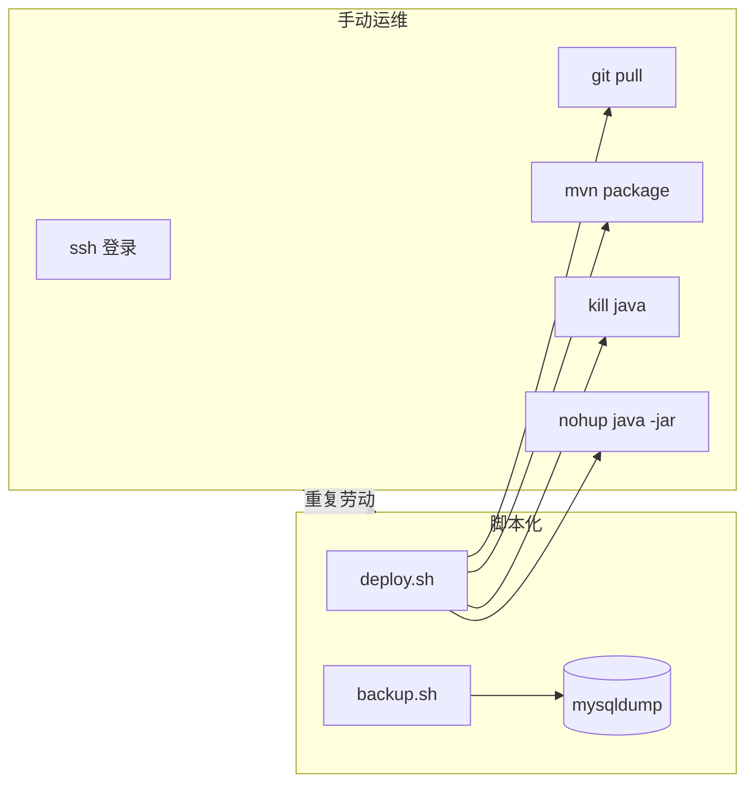

# Shell 脚本入门

<!-- 修改说明: 2026-06-30 按 EXPANSION-STANDARD 扩充 §0、命令步骤表、FAQ≥10、闭卷自测、费曼检验；环境假设 VMware Ubuntu + ~/study/linux-practice -->

> **文件编码**：UTF-8。本章在 **VMware Ubuntu** 上编写 **Bash** 脚本，面向 **Java / Python 后端** 部署、备份、巡检场景。脚本目录 **`~/study/linux-practice/scripts`**（与 [08 章](./08-软件包管理与开发环境安装.md) 的 `check-env.sh` 同根目录）。示例可在 08 章搭好的环境中直接运行。

---

## 0. 读前导读（零基础也能跟上）

### 0.1 用一句话弄懂本章

**一句话**：把你在终端里一行行敲的命令**写进 `.sh` 文件**，加 `if` 判断和 `for` 循环，以后 **`./deploy.sh deploy` 一条命令**完成拉代码、打包、重启。

**生活类比**：

| 概念 | 类比 |
|------|------|
| **Shell 脚本** | 菜谱：步骤固定，谁按菜谱做结果一致 |
| **shebang `#!/bin/bash`** | 菜谱封面写明「用中式炒锅」而非西式平底锅 |
| **`$1` 参数** | 顾客点单：「来一份 start」vs「来一份 stop」 |
| **`set -e`** | 某步炒糊了立刻停灶，不会继续上菜 |
| **`~/study/linux-practice/scripts`** | 你的脚本工具箱，与练习目录并列 |

**术语（Bash / Shell）**：Shell 是命令解释器；Bash 是 Ubuntu 默认的一种，语法比 `sh`（dash）更丰富。  
**为什么重要**：CI/CD、cron 定时备份、线上 deploy 底层都是脚本；不会写脚本就要重复手工运维。  
**本章用到的地方**：§1～§10 全部示例脚本。

---

### 0.2 你需要提前知道什么

| 水平 | 建议 |
|------|------|
| 08 章环境就绪 | JDK/MySQL/Redis 已装，`check-env.sh` 通过 |
| 会 `chmod +x` | 见 [05 章](./05-用户组与文件权限.md) |
| 目录 | `mkdir -p ~/study/linux-practice/scripts` |
| 跳章 | 不会 vim/nano 先读 [04 章](./04-文本查看编辑与搜索.md) |

---

### 0.3 本章知识地图（☐→☑）

- [ ] 写带 `#!/bin/bash` 的脚本并 `chmod +x`
- [ ] 使用 `$1`、`$#`、`${VAR:-default}`
- [ ] `if [ ]` 判断文件、进程、字符串
- [ ] `for`/`while` 循环与服务巡检
- [ ] 函数 + `local` + `set -euo pipefail`
- [ ] 读懂并运行 `deploy.sh`、`backup.sh`
- [ ] 区分 bash 与 sh（dash）
- [ ] 闭卷自测 ≥ 8/10

---

### 0.4 建议学习时长与节奏

| 阶段 | 时间 | 内容 |
|------|------|------|
| §1～§4 基础语法 | 1.5 h | hello.sh、变量、if |
| §5～§7 循环与严格模式 | 1 h | set -e 实验 |
| §8～§9 实战脚本 | 1.5 h | deploy + backup |
| §10 cron + 自测 | 45 min | 定时备份一条 |

---

### 0.5 学完本章你能做什么（可验证）

1. 在 `~/study/linux-practice/scripts` 创建 `hello.sh` 并成功运行。
2. 用 `backup.sh shop` 生成 `.sql.gz` 并能 `gunzip | mysql` 恢复。
3. 解释 `set -e` 与 `grep ... || true` 为何常一起出现。
4. `bash -n` 与 `shellcheck` 检查脚本无 error。

---

## 本章与上一章的关系

[08 章](./08-软件包管理与开发环境安装.md) 你用 apt 装好了 JDK、MySQL、Redis、Node、Git——日常还要反复执行：拉代码、打包、重启服务、备份数据库。把这些命令写成 **Shell 脚本**，可重复、可定时、可交给 CI/CD。

本章掌握：

1. **shebang** 与执行权限
2. 变量、环境变量、`$1` 位置参数
3. `if` / `test` / `[ ]` 条件判断
4. `for` / `while` 循环
5. 函数定义与 `return`
6. **`set -e`** 遇错即停
7. 实战 **`deploy.sh`**、**`backup.sh`**
8. **bash vs sh** 差异



**与平行系列**：[Java 09 部署](../Java/09-LinuxDockerNginx部署基础.md) 会用到启动脚本；[Git 02](../../前端学习/Git/02-本地版本控制核心操作.md) 的 commit 规范可写进 deploy 日志。

---

## 1. 第一个脚本：shebang 与执行方式

### 1.1 创建 hello.sh

| 步骤 | 你的动作 | 预期看到什么 | 若不对 |
|------|----------|--------------|--------|
| 1 | `mkdir -p ~/study/linux-practice/scripts` | 目录存在 | 权限见 05 章 |
| 2 | `nano ~/study/linux-practice/scripts/hello.sh` | 编辑器打开 | 用 vim 亦可 |
| 3 | 写入 shebang + echo（见下方） | 文件保存 | UTF-8 无 BOM |
| 4 | `chmod +x ~/study/linux-practice/scripts/hello.sh` | 无输出 | `ls -l` 应有 x 权限 |
| 5 | `~/study/linux-practice/scripts/hello.sh` | Hello + 日期 | bad interpreter → CRLF |

```bash
mkdir -p ~/study/linux-practice/scripts
nano ~/study/linux-practice/scripts/hello.sh
```

内容：

```bash
#!/bin/bash
# 我的第一个后端运维脚本
echo "Hello, Backend!"
echo "当前用户: $(whoami)"
echo "当前目录: $(pwd)"
date
```

### 1.2 赋予执行权限

```bash
chmod +x ~/study/linux-practice/scripts/hello.sh
```

### 1.3 三种运行方式

```bash
~/study/linux-practice/scripts/hello.sh           # 直接执行（依赖 shebang）
bash ~/study/linux-practice/scripts/hello.sh      # 显式用 bash 解释
source ~/study/linux-practice/scripts/hello.sh    # 当前 shell 执行（一般不用）
```

**预期输出**：

```text
Hello, Backend!
当前用户: youruser
当前目录: /home/youruser
Tue Jun 23 10:30:00 CST 2026
```

### 1.4 深入解释：shebang `#!` 是什么

第一行 `#!/bin/bash` 告诉内核：用 **/bin/bash** 解释此文件。若写成 `#!/bin/sh`，在 Ubuntu 上 `sh` 往往链接到 **dash**（更轻、POSIX），部分 bash 语法会报错——**后端部署脚本推荐 bash**。

```bash
ls -l /bin/sh
# 常见：/bin/sh -> dash
which bash
# /usr/bin/bash
```

---

## 2. 变量与引号

### 2.1 定义与使用

```bash
APP_NAME="shop-api"
PORT=8080
JAR_PATH="/opt/apps/shop-api.jar"

echo "应用: $APP_NAME 端口: $PORT"
echo '单引号不展开变量: $APP_NAME'
```

**预期**：

```text
应用: shop-api 端口: 8080
单引号不展开变量: $APP_NAME
```

### 2.2 命令替换与算术

```bash
NOW=$(date +%Y%m%d_%H%M%S)
FILES=$(ls ~/scripts | wc -l)
COUNT=$((PORT + 1))

echo "时间戳: $NOW, 脚本数: $FILES, COUNT=$COUNT"
```

### 2.3 环境变量

```bash
echo $HOME
echo $PATH
export LOG_DIR=/var/log/myapp
```

Java 启动时常用：

```bash
export JAVA_OPTS="-Xms512m -Xmx512m"
java $JAVA_OPTS -jar app.jar
```

### 2.4 只读与 unset

```bash
readonly DEPLOY_USER="deploy"
unset TEMP_VAR
```

---

## 3. 位置参数：$1、$2、$@、$#

```bash
#!/bin/bash
# save as ~/study/linux-practice/scripts/args-demo.sh
echo "脚本名: $0"
echo "参数个数: $#"
echo "第一个参数: $1"
echo "第二个参数: $2"
echo "全部参数: $@"
```

```bash
chmod +x ~/study/linux-practice/scripts/args-demo.sh
~/study/linux-practice/scripts/args-demo.sh start production
```

**预期**：

```text
脚本名: /home/youruser/study/linux-practice/scripts/args-demo.sh
参数个数: 2
第一个参数: start
第二个参数: production
全部参数: start production
```

**后端用法**：`./deploy.sh start`、`./deploy.sh stop`、`./backup.sh shop` 用 `$1` 区分子命令。

---

## 4. 条件判断：if 与 test

### 4.1 基本 if

```bash
#!/bin/bash
ENV=${1:-dev}   # 默认 dev

if [ "$ENV" = "prod" ]; then
  echo "生产环境，谨慎操作"
elif [ "$ENV" = "dev" ]; then
  echo "开发环境"
else
  echo "未知环境: $ENV"
fi
```

### 4.2 文件与进程测试

| 测试 | 含义 |
|------|------|
| `[ -f file ]` | 是普通文件 |
| `[ -d dir ]` | 目录存在 |
| `[ -x file ]` | 可执行 |
| `[ -z "$str" ]` | 字符串为空 |
| `[ -n "$str" ]` | 字符串非空 |

```bash
JAR="/opt/apps/app.jar"
if [ ! -f "$JAR" ]; then
  echo "错误: jar 不存在: $JAR"
  exit 1
fi

if pgrep -f "app.jar" > /dev/null; then
  echo "进程已在运行"
else
  echo "进程未运行"
fi
```

### 4.3 数值比较

```bash
DISK_USE=$(df / | awk 'NR==2 {print $5}' | tr -d '%')
if [ "$DISK_USE" -gt 90 ]; then
  echo "磁盘使用率超过 90%: ${DISK_USE}%"
fi
```

### 4.4 `[[ ]]` 与 bash 扩展（推荐 bash 脚本）

```bash
if [[ "$ENV" =~ ^(dev|test|prod)$ ]]; then
  echo "合法环境"
fi
```

---

## 5. 循环：for 与 while

### 5.1 for

```bash
for svc in mysql redis nginx; do
  if systemctl is-active --quiet "$svc"; then
    echo "$svc: running"
  else
    echo "$svc: stopped"
  fi
done
```

**预期（08 章环境）**：

```text
mysql: running
redis: running
nginx: stopped
```

```bash
# C 风格
for ((i=1; i<=3; i++)); do
  echo "尝试第 $i 次"
done
```

### 5.2 while 读文件

```bash
while IFS= read -r line; do
  echo "日志行: $line"
done < /var/log/syslog | head -5
```

### 5.3 无限循环与 break（健康检查）

```bash
retry=0
max=5
while [ $retry -lt $max ]; do
  if curl -sf http://127.0.0.1:8080/actuator/health > /dev/null; then
    echo "健康检查通过"
    break
  fi
  retry=$((retry + 1))
  sleep 2
done
```

---

## 6. 函数

```bash
#!/bin/bash

log_info() {
  echo "[INFO] $(date '+%F %T') $*"
}

log_error() {
  echo "[ERROR] $(date '+%F %T') $*" >&2
}

check_port() {
  local port=$1
  if ss -tln | grep -q ":${port} "; then
    return 0
  else
    return 1
  fi
}

log_info "开始部署"
if check_port 8080; then
  log_info "8080 已在监听"
else
  log_error "8080 未监听"
fi
```

**`local`**：函数内变量不污染全局，后端脚本建议养成习惯。

---

## 7. set -e 与严格模式

### 7.1 问题：命令失败仍继续

```bash
false
echo "这行仍会执行"   # 默认 bash 会继续
```

### 7.2 set -e：遇错退出

```bash
#!/bin/bash
set -e

false
echo "不会执行到这里"
```

**预期**：脚本在 `false` 处退出，非零状态码，无第二行输出。

### 7.3 常用组合

| 步骤 | 你的动作 | 预期看到什么 | 若不对 |
|------|----------|--------------|--------|
| 1 | 创建 `set-e-demo.sh` 含 `set -e` + `false` + echo | 第二行 echo **不执行** | 未加 set -e 会继续 |
| 2 | `bash set-e-demo.sh; echo $?` | 退出码非 0 | 正常 |
| 3 | 脚本里 `grep nosuch file.log \|\| true` | 不触发 set -e 退出 | 见 §14 FAQ |
| 4 | 在 deploy.sh 首行加 `set -euo pipefail` | mvn 失败则脚本停 | 故意改错 pom 验证 |

```bash
set -euo pipefail
# -e 命令失败退出
# -u 使用未定义变量报错
# -o pipefail 管道中任一命令失败则整个管道失败
```

**注意**：`grep` 无匹配返回 1 会触发 `set -e`，可：

```bash
grep "error" app.log || true
# 或
if grep -q "error" app.log; then ...
```

### 7.4 深入解释：为什么 deploy 脚本必须 set -e

若 `mvn package` 失败但脚本继续 `java -jar`，会启动 **旧 jar** 或空目录，造成「部署成功假象」。`set -e` 让失败停在编译阶段，便于排查。

---

## 8. 实战脚本一：deploy.sh

| 步骤 | 你的动作 | 预期看到什么 | 若不对 |
|------|----------|--------------|--------|
| 1 | 复制下方 deploy.sh 到 `~/study/linux-practice/scripts/` | 文件存在 | nano 保存 |
| 2 | `chmod +x deploy.sh` | 可执行 | Permission denied |
| 3 | `./deploy.sh status` | 未运行或 PID 信息 | 见 §14 报错表 |
| 4 | 有 jar 时 `./deploy.sh start` | 日志路径打印 | jar 路径错 §8 脚本内 JAR_PATH |
| 5 | `curl -sf http://127.0.0.1:8080/actuator/health` | HTTP 200（有 actuator 时） | 查 logs |

在 `~/study/linux-practice/scripts/deploy.sh` 创建 Spring Boot 风格部署脚本（路径可按你的 VM 调整）。

```bash
#!/bin/bash
set -euo pipefail

APP_NAME="shop-api"
APP_DIR="/opt/apps/${APP_NAME}"
JAR_NAME="${APP_NAME}.jar"
JAR_PATH="${APP_DIR}/${JAR_NAME}"
GIT_REPO="${GIT_REPO:-$HOME/projects/shop-api}"
BRANCH="${BRANCH:-main}"
JAVA_OPTS="${JAVA_OPTS:--Xms512m -Xmx1024m}"
LOG_FILE="${APP_DIR}/logs/app.log"
PID_FILE="${APP_DIR}/app.pid"

log() { echo "[$(date '+%F %T')] $*"; }

usage() {
  echo "用法: $0 {start|stop|restart|deploy|status}"
  exit 1
}

ensure_dir() {
  mkdir -p "${APP_DIR}/logs"
}

stop_app() {
  if [ -f "$PID_FILE" ]; then
    PID=$(cat "$PID_FILE")
    if kill -0 "$PID" 2>/dev/null; then
      log "停止进程 PID=$PID"
      kill "$PID"
      sleep 3
      kill -0 "$PID" 2>/dev/null && kill -9 "$PID" || true
    fi
    rm -f "$PID_FILE"
  else
    pkill -f "${JAR_NAME}" 2>/dev/null || true
  fi
}

start_app() {
  if [ ! -f "$JAR_PATH" ]; then
    log "错误: 找不到 $JAR_PATH"
    exit 1
  fi
  ensure_dir
  log "启动 $JAR_NAME"
  nohup java $JAVA_OPTS -jar "$JAR_PATH" >> "$LOG_FILE" 2>&1 &
  echo $! > "$PID_FILE"
  log "已启动 PID=$(cat $PID_FILE)，日志: $LOG_FILE"
}

deploy_app() {
  log "拉取代码 $GIT_REPO ($BRANCH)"
  if [ -d "$GIT_REPO/.git" ]; then
    git -C "$GIT_REPO" fetch origin
    git -C "$GIT_REPO" checkout "$BRANCH"
    git -C "$GIT_REPO" pull origin "$BRANCH"
  else
    log "错误: 非 git 目录 $GIT_REPO"
    exit 1
  fi

  log "Maven 打包"
  mvn -f "$GIT_REPO/pom.xml" clean package -DskipTests

  ensure_dir
  cp "$GIT_REPO/target/${JAR_NAME}" "$JAR_PATH"
  log "jar 已复制到 $JAR_PATH"

  stop_app
  start_app

  retry=0
  while [ $retry -lt 15 ]; do
    if curl -sf "http://127.0.0.1:8080/actuator/health" > /dev/null 2>&1; then
      log "健康检查通过"
      exit 0
    fi
    retry=$((retry + 1))
    sleep 2
  done
  log "警告: 健康检查超时，请查看 $LOG_FILE"
  exit 1
}

status_app() {
  if [ -f "$PID_FILE" ] && kill -0 "$(cat $PID_FILE)" 2>/dev/null; then
    log "运行中 PID=$(cat $PID_FILE)"
  else
    log "未运行"
  fi
  ss -tlnp | grep 8080 || true
}

case "${1:-}" in
  start)   start_app ;;
  stop)    stop_app ;;
  restart) stop_app; start_app ;;
  deploy)  deploy_app ;;
  status)  status_app ;;
  *)       usage ;;
esac
```

```bash
chmod +x ~/study/linux-practice/scripts/deploy.sh
~/study/linux-practice/scripts/deploy.sh status
```

**无 jar 时预期**：

```text
[2026-06-23 10:00:00] 未运行
```

---

## 9. 实战脚本二：backup.sh

MySQL 数据库备份，配合 08 章 dev 用户。

```bash
#!/bin/bash
set -euo pipefail

DB_NAME="${1:-shop}"
DB_USER="${DB_USER:-dev}"
DB_PASS="${DB_PASS:-Dev@123456}"
BACKUP_DIR="${BACKUP_DIR:-$HOME/study/linux-practice/backups/mysql}"
KEEP_DAYS="${KEEP_DAYS:-7}"
TIMESTAMP=$(date +%Y%m%d_%H%M%S)
BACKUP_FILE="${BACKUP_DIR}/${DB_NAME}_${TIMESTAMP}.sql.gz"

log() { echo "[$(date '+%F %T')] $*"; }

mkdir -p "$BACKUP_DIR"

log "备份数据库: $DB_NAME -> $BACKUP_FILE"
mysqldump -u"$DB_USER" -p"$DB_PASS" \
  --single-transaction \
  --routines \
  --triggers \
  "$DB_NAME" | gzip > "$BACKUP_FILE"

if [ -s "$BACKUP_FILE" ]; then
  log "备份成功，大小: $(du -h "$BACKUP_FILE" | cut -f1)"
else
  log "错误: 备份文件为空"
  exit 1
fi

log "清理 ${KEEP_DAYS} 天前的备份"
find "$BACKUP_DIR" -name "${DB_NAME}_*.sql.gz" -mtime +"$KEEP_DAYS" -delete

log "当前备份列表:"
ls -lh "$BACKUP_DIR"/${DB_NAME}_*.sql.gz 2>/dev/null | tail -5
```

```bash
chmod +x ~/study/linux-practice/scripts/backup.sh
# 需先有 shop 库（08 章练习）
~/study/linux-practice/scripts/backup.sh shop
```

**预期**：

```text
[2026-06-23 10:05:00] 备份数据库: shop -> /home/youruser/study/linux-practice/backups/mysql/shop_20260623_100500.sql.gz
mysqldump: [Warning] Using a password on the command line interface can be insecure.
[2026-06-23 10:05:01] 备份成功，大小: 4.0K
[2026-06-23 10:05:01] 清理 7 天前的备份
[2026-06-23 10:05:01] 当前备份列表:
-rw-r--r-- 1 user user 1.2K Jun 23 10:05 shop_20260623_100500.sql.gz
```

**安全提示**：生产环境密码放 **/root/.my.cnf** 或环境变量，勿提交 Git。

```ini
# ~/.my.cnf
[client]
user=dev
password=Dev@123456
```

然后脚本里 `mysqldump shop` 即可。

### 9.1 backup.sh 执行步骤表

| 步骤 | 你的动作 | 预期看到什么 | 若不对 |
|------|----------|--------------|--------|
| 1 | `mkdir -p ~/study/linux-practice/backups/mysql` | 目录存在 | BACKUP_DIR 环境变量 |
| 2 | `./backup.sh shop` | mysqldump Warning 可忽略 | Access denied → dev 用户 |
| 3 | `ls -lh ~/study/linux-practice/backups/mysql/` | `.sql.gz` 非 0 字节 | 空库也应有 header |
| 4 | `gunzip -c shop_*.sql.gz \| head -20` | SQL CREATE TABLE 等 | 验证可读 |
| 5 | 恢复测试库（进阶） | `mysql testdb <(gunzip -c file)` | 09 章挑战 restore |

---

## 10. bash vs sh：该用哪个

| 特性 | bash | sh (dash) |
|------|------|-----------|
| 数组 `${arr[0]}` | ✅ | ❌ |
| `[[ ]]` 正则 | ✅ | ❌ |
| `{1..10}` 扩展 | ✅ | ❌ |
| `source` | ✅ | 用 `.` |
| 性能 | 略慢 | 快（适合系统启动脚本） |
| Ubuntu `/bin/sh` | — | 通常指向 dash |

**建议**：

- 后端 **deploy / backup / 巡检**：`#!/bin/bash` + `set -euo pipefail`
- 仅 POSIX 且需最大兼容：写 `#!/bin/sh` 并避免 bash 语法

### 10.1 deploy.sh 子命令 case 块逐行读

| 行/块 | 含义 | 改错会怎样 |
|-------|------|------------|
| `case "${1:-}" in` | 第一个参数；空则匹配 `*` | 漏 default 则无提示退出 |
| `deploy) deploy_app ;;` | 完整发布流程 | 缺 stop 会端口占用 |
| `stop_app` + PID_FILE | 优雅 kill 再删 pid | PID 过期会误杀 |
| `mvn ... -DskipTests` | 跳过测试加快 deploy | 测试失败不会挡上线 |
| `curl -sf .../actuator/health` | 部署后探活 | 无 actuator 需改 URL |
| `set -euo pipefail` | mvn 失败不启动 jar | 生产脚本标配 |

```bash
# 检查脚本语法
bash -n ~/study/linux-practice/scripts/deploy.sh
shellcheck ~/study/linux-practice/scripts/deploy.sh   # apt install shellcheck
```

---

## 11. 定时任务 cron 入门（脚本落地）

| 步骤 | 你的动作 | 预期看到什么 | 若不对 |
|------|----------|--------------|--------|
| 1 | `crontab -e` | 打开编辑器 | 选 nano 若首次 |
| 2 | 写入绝对路径 cron 行 | 保存退出 | 见下方示例 |
| 3 | `crontab -l` | 显示刚加的行 | 用户 crontab 非 /etc/cron |
| 4 | 手动执行脚本一次 | backup 成功 | PATH 问题写全路径 |
| 5 | 等触发或改 `* * * * *` 测 1 分钟 | log 有新行 | 权限 +x |

```bash
crontab -e
```

添加（每天 2 点备份）：

```cron
0 2 * * * /home/youruser/study/linux-practice/scripts/backup.sh shop >> /home/youruser/study/linux-practice/backups/backup.log 2>&1
```

```bash
crontab -l
```

---

## 12. 手把手实操：完整走通 deploy 子命令

**简化演示**（无真实 Spring 项目时用 sleep 模拟 jar）：

```bash
mkdir -p /opt/apps/shop-api/logs
cat << 'EOF' > /tmp/fake-app.sh
#!/bin/bash
echo "fake app running"
sleep 3600
EOF
chmod +x /tmp/fake-app.sh
cp /tmp/fake-app.sh /opt/apps/shop-api/shop-api.jar
# 临时改 deploy 里 java -jar 为 bash shop-api.jar 仅演示流程 — 真实环境用 mvn 产物

~/study/linux-practice/scripts/deploy.sh start
~/study/linux-practice/scripts/deploy.sh status
~/study/linux-practice/scripts/deploy.sh stop
```

真实项目：将 `GIT_REPO` 指向你的 Spring Boot 仓库后 `./deploy.sh deploy`。

---

## 13. 命令与脚本预期输出速查

| 操作 | 命令 | 成功时长什么样 |
|------|------|----------------|
| 语法检查 | `bash -n script.sh` | 无输出 |
| 运行 hello | `~/study/linux-practice/scripts/hello.sh` | 打印 Hello + 日期 |
| 参数演示 | `args-demo.sh a b` | 参数个数 2 |
| set -e | 脚本含 `false` 后语句 | 提前退出 |
| deploy status | `deploy.sh status` | 运行中或未运行 |
| backup | `backup.sh shop` | 生成 .sql.gz |
| shellcheck | `shellcheck deploy.sh` | 无 error 或仅 style |

---

## 14. 常见报错与排查

| 报错信息（关键词） | 可能原因 | 解决方案 |
|-------------------|---------|---------|
| `Permission denied` | 无执行权限 | `chmod +x script.sh` |
| `bad interpreter: No such file` | Windows CRLF 换行 | `sed -i 's/\r$//' script.sh` 或 dos2unix |
| `command not found` | PATH 或拼写 | 用绝对路径；`which java` |
| `[: missing ]` | if 括号两侧缺空格 | `[ "$a" = "b" ]` 空格不能省 |
| `unary operator expected` | 变量空且未引号 | `"$VAR"` 加双引号 |
| `set -e` 意外退出 | grep/curl 返回非 0 | `\|\| true` 或 if 包裹 |
| `mvn: command not found` | Maven 未装 | `sudo apt install maven` |
| `mysqldump: Access denied` | 账号密码错 | 检查 ~/.my.cnf |
| `kill: (pid) - No such process` | PID 文件过期 | 删 PID 文件；pkill |
| `curl: (7) Failed to connect` | 服务未起 | 查日志；07 章网络排查 |
| `git: not a git repository` | GIT_REPO 路径错 | 改环境变量或 clone |
| `syntax error near unexpected token` | bash/sh 混用语法 | 改 shebang 为 bash |
| `npm: command not found` in sh | cron 环境 PATH 短 | crontab 里写绝对路径或 source profile |

---

## 15. 分级练习

**基础**：写 `greet.sh`，接受姓名 `$1`，打印「你好，$1，今天是 $(date +%A)」。

**进阶**：写 `check-services.sh`，检查 mysql、redis 是否 active，任一失败 exit 1（配合 `set -e`）。

**挑战**：扩展 `backup.sh` 支持 `./backup.sh shop restore /path/to/file.sql.gz` 恢复数据库。

### 15.1 参考答案（基础）

```bash
#!/bin/bash
NAME="${1:-World}"
echo "你好，${NAME}，今天是 $(date +%A)"
```

```bash
~/study/linux-practice/scripts/greet.sh 张三
# 你好，张三，今天是 Monday
```

### 15.2 参考答案（进阶）

```bash
#!/bin/bash
set -e
for svc in mysql redis-server; do
  systemctl is-active --quiet "$svc" || { echo "$svc 未运行"; exit 1; }
  echo "$svc OK"
done
echo "全部服务正常"
```

### 15.3 参考答案（挑战 restore 片段）

```bash
restore_db() {
  local file=$1
  [ -f "$file" ] || { echo "文件不存在"; exit 1; }
  gunzip -c "$file" | mysql -u"$DB_USER" -p"$DB_PASS" "$DB_NAME"
  log "恢复完成: $file"
}
# case 里增加: restore) restore_db "$2" ;;
```

---

## 16. 本章知识点清单

- [ ] 能写带 `#!/bin/bash` 的脚本并 chmod +x
- [ ] 会使用 `$1`、`$#`、`${VAR:-default}`
- [ ] 会用 `if [ ]` 判断文件、进程、字符串
- [ ] 会写 `for`/`while` 循环
- [ ] 会定义带 `local` 的函数
- [ ] 理解 `set -euo pipefail` 并正确使用
- [ ] 能读懂并修改 deploy.sh、backup.sh
- [ ] 知道 bash 与 sh 差异

---

## 17. 练习建议

1. 用 **shellcheck** 检查所有脚本，修复 warning。
2. 把 08 章 `check-env.sh` 改成函数化 + `set -e`。
3. 为 deploy.sh 增加 **日志轮转**：超过 100MB 压缩旧 log。
4. 在 VMware 快照后故意 deploy 失败，观察 `set -e` 停在哪一步。
5. 阅读 `/etc/init.d/*` 或 `systemd` unit 里的 `ExecStart`，对照本章启动逻辑。

---

## 18. 学完标准

1. **不看文档**写出：带参数、带 if、带函数的脚本并运行成功
2. 能独立解释 `set -e` 与 `\|\| true` 的使用场景
3. **backup.sh** 成功生成 gzip 备份并可手动恢复
4. **deploy.sh** 至少跑通 `status` / `start` / `stop`（可用 fake jar）
5. 能说明何时用 bash、何时用 sh
6. 常见报错表 **独立解决至少 3 种**

**量化自检**：

- [ ] 脚本无 CRLF（`file script.sh` 显示 ASCII text）
- [ ] `bash -n` 与 `shellcheck` 无 error
- [ ] 能写一条 crontab 定时备份

---

## 19. 常见问题 FAQ

**Q1：`#!/bin/bash` 和 `#!/bin/sh` 怎么选？**  
后端 deploy/backup 用 **bash**；Ubuntu 的 `sh` 常是 dash，不支持 `[[ ]]`、数组等。

**Q2：`Permission denied` 运行脚本？**  
`chmod +x script.sh`；或 `bash script.sh` 不需要 x 权限。

**Q3：`bad interpreter: No such file or directory`？**  
Windows **CRLF** 换行；`sed -i 's/\r$//' script.sh` 或 `dos2unix`。

**Q4：`set -e` 为什么 grep 会导致脚本退出？**  
grep 无匹配返回 1；用 `if grep -q ...` 或 `grep ... \|\| true`。

**Q5：`[: missing ]` 或 `unary operator expected`？**  
`[` 两侧必须有空格；变量用 `"$VAR"` 防空。

**Q6：cron 里脚本找不到 java/mvn？**  
cron 环境 PATH 很短；写绝对路径 `/usr/bin/java` 或在脚本里 `source /etc/profile`。

**Q7：`mysqldump: Access denied`？**  
检查 `DB_USER`/`DB_PASS` 或 `~/.my.cnf`；08 章 dev 用户是否创建。

**Q8：`$1` 为空时脚本行为？**  
用 `${1:-}` 或 `${1:-dev}` 给默认值；deploy 的 `case` 无匹配走 usage。

**Q9：`nohup java -jar` 和 systemd 哪个好？**  
练习用 nohup；生产用 systemd（11 章 journalctl）；Docker 用 compose（12 章）。

**Q10：backup 密码写在脚本里安全吗？**  
**不安全**；练习可接受；生产用 `.my.cnf` 600 权限或密钥管理。

**Q11：`shellcheck` 报 SC2086 双引号？**  
变量加 `"$VAR"` 防空格/空值；Java 启动参数 `$JAVA_OPTS` 有时故意不加引号需注释说明。

**Q12：如何把 08 章 `check-env.sh` 函数化？**  
每个检查写成 `check_java()` 函数，`main` 里依次调用，`set -e` 遇错即停。

---

## 20. 闭卷自测

### 概念题（6 道）

1. shebang 的作用是什么？
2. 单引号与双引号在 Shell 里对变量展开有何区别？
3. `set -euo pipefail` 三个 flag 各表示什么？
4. bash 与 dash（/bin/sh）在后端脚本选型上的建议？
5. `$#` 和 `$@` 分别是什么？
6. 为什么 deploy 脚本要在 mvn 失败时停止而不是继续 java -jar？

### 动手题（2 道）

7. 写 `check-services.sh`：检查 mysql 与 redis-server 是否 active，失败 exit 1（3 行核心逻辑即可）。
8. 写 crontab 一行：每天 2 点执行 `~/study/linux-practice/scripts/backup.sh shop` 并写日志。

### 综合题（2 道）

9. 口述 `deploy.sh deploy` 子命令的 5 个步骤（git → mvn → cp → stop → start）。
10. 脚本在 Windows 编辑后上传 VM 报 bad interpreter——完整修复流程 3 步。

### 自测参考答案

1. 告诉内核用哪个解释器执行脚本。
2. 单引号不展开变量；双引号展开 `$VAR`。
3. -e 遇错退出；-u 未定义变量报错；-o pipefail 管道任一失败则失败。
4. deploy/backup 用 bash；系统启动脚本可能用 sh。
5. $#=参数个数；$@=全部参数列表。
6. 避免编译失败仍启动旧 jar，造成部署假象。
7. 示例：`for svc in mysql redis-server; do systemctl is-active --quiet $svc \|\| exit 1; done`
8. `0 2 * * * /home/user/study/linux-practice/scripts/backup.sh shop >> .../backup.log 2>&1`
9. git pull → mvn package → cp jar → stop_app → start_app + 健康检查。
10. `file script.sh` 看 CRLF → `sed -i 's/\r$//'` → `chmod +x` 再运行。

---

## 21. 费曼检验

**任务**：3 分钟向同事解释「为什么线上发布要用 deploy.sh + set -e，而不是 SSH 上去手工敲十条命令」。

**对照提纲**：

1. **可重复**：脚本同一份，减少人为漏步骤（忘 pull、忘 restart）。
2. **可审计**：脚本进 Git，谁改了什么有记录；手工命令无 log。
3. **失败即停**：set -e 在 mvn 失败时停止，避免「半成功」上线；cron/CI 可直接调用同一脚本。

### 每日 5 分钟（VMware）

```bash
bash -n ~/study/linux-practice/scripts/*.sh
~/study/linux-practice/scripts/check-services.sh 2>/dev/null || \
  systemctl is-active mysql redis-server
```

---

## 22. 下一章预告

09 章你学会了用脚本 **自动化部署与备份**——单机要远程操作，还需要 **SSH 登录与文件传输**。

下一章（**10 SSH 远程登录与文件传输**）将讲 `ssh-keygen`、免密登录、`~/.ssh/config` 别名、`scp`/`sftp` 传 jar，以及 Windows 宿主机连 VMware Ubuntu 的完整流程。学完后可从 Windows 一条 `scp` 把 jar 传到 `~/study/linux-practice` 或 `/opt/app`。

---

*上一章：[08 软件包管理与开发环境安装](./08-软件包管理与开发环境安装.md) · 下一章：[10 SSH 远程登录与文件传输](./10-SSH远程登录与文件传输.md)*

*本章已按 EXPANSION-STANDARD 扩充（§0+hello/deploy 步骤表+FAQ+自测+费曼）。*

**EXPANSION-STANDARD 自检**：☑ §0 ☑ 步骤表 §1.1/§7.3/§8/§11 ☑ FAQ≥10 ☑ 闭卷 10 题 ☑ 费曼 ☑ VMware Ubuntu + ~/study/linux-practice
