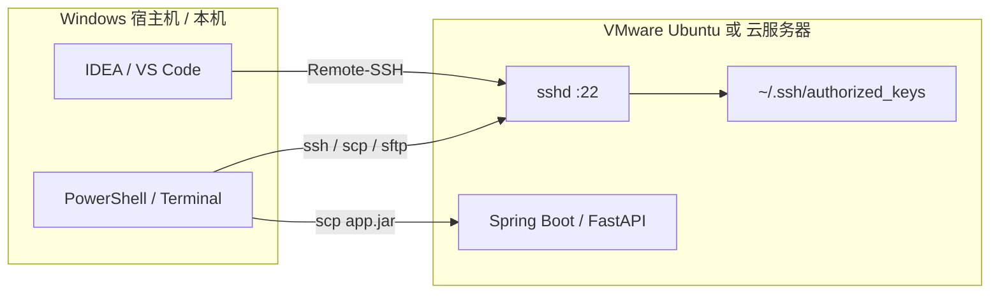
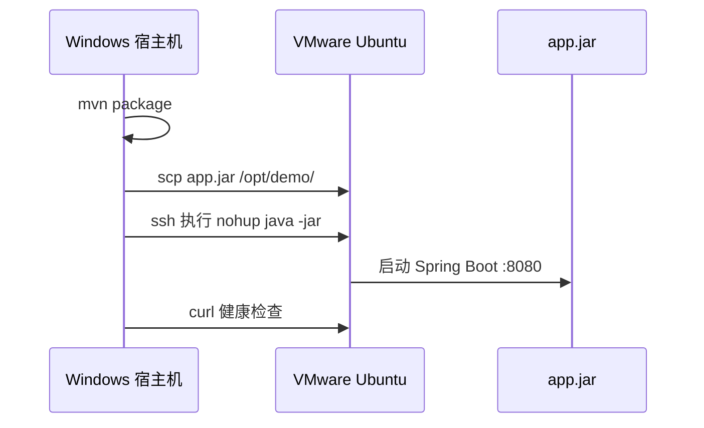
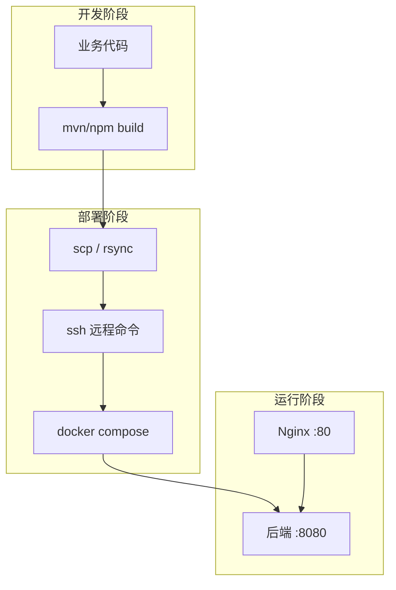

# SSH 远程登录与文件传输

<!-- 修改说明: 2026-06-30 按 EXPANSION-STANDARD 扩充 §0、命令步骤表、FAQ≥10、闭卷自测、费曼检验；环境假设 VMware Ubuntu + ~/study/linux-practice -->

> **文件编码**：UTF-8。本章示例以 **VMware Ubuntu 22.04/24.04 虚拟机** 为主；Windows 宿主机用 **PowerShell / Windows Terminal** 作为 SSH 客户端。远程目录含 **`~/study/linux-practice`**（与前几章练习根目录一致）。面向全栈部署：从本地开发机连上云服务器或 VMware 里的 Linux，上传 jar、配置、日志。

---

## 0. 读前导读（零基础也能跟上）

### 0.1 用一句话弄懂本章

**一句话**：**SSH** 是加密的「远程桌面命令行」+ **scp/sftp** 是加密的「远程拷文件」——用 **密钥** 代替密码，用 **config 别名** 代替记 IP。

**生活类比**：

| 概念 | 类比 |
|------|------|
| **SSH** | 有门禁卡才能进的远程办公室 |
| **私钥 / 公钥** | 你口袋里的钥匙 + 服务器上的锁芯 |
| **authorized_keys** | 服务器登记「哪些钥匙能开」 |
| **~/.ssh/config** | 通讯录：`ssh vm-ubuntu` 代替背 IP |
| **scp** | 加密 U 盘，一次拷一个 jar |
| **sshpass** | 把密码写在纸条上贴门缝——**别用** |

**术语（SSH / Secure Shell）**：在不安全网络上建立加密终端与文件传输通道，默认端口 22。  
**为什么重要**：几乎所有上线、传 jar、CI 部署、IDE Remote-SSH 都依赖 SSH。  
**本章用到的地方**：§2～§10 全流程。

---

### 0.2 你需要提前知道什么

| 水平 | 建议 |
|------|------|
| 07 章 IP/ufw | 桥接模式下 Windows 能 ping VM |
| 08/09 章 | VM 内已有 Java 环境与脚本 |
| Windows 终端 | PowerShell 或 Windows Terminal |
| 练习目录 | VM 内 `mkdir -p ~/study/linux-practice` |

---

### 0.3 本章知识地图（☐→☑）

- [ ] VMware NAT/桥接与 `ip a` 查 IP
- [ ] 安装并启动 `openssh-server`
- [ ] 密码登录 + 首次 known_hosts 提示
- [ ] ed25519 密钥 + authorized_keys 免密
- [ ] 编写 `~/.ssh/config` 别名
- [ ] `scp` 上传 jar、`sftp` 交互传文件
- [ ] 知道为何不用 sshpass
- [ ] 闭卷自测 ≥ 8/10

---

### 0.4 建议学习时长与节奏

| 阶段 | 时间 | 内容 |
|------|------|------|
| §2～§3 环境与首次登录 | 45 min | 桥接 + 密码 ssh |
| §4～§5 密钥与 config | 1 h | 免密 + 别名 |
| §6～§7 scp/sftp | 45 min | 传 jar 到 /opt 或 linux-practice |
| §10 手把手 + 自测 | 1 h | 完整部署链路 |

---

### 0.5 学完本章你能做什么（可验证）

1. Windows 执行 `ssh vm-ubuntu` 免密进入 VM。
2. `scp app.jar vm-ubuntu:~/study/linux-practice/` 成功上传。
3. 解释 `Connection refused` 与 `Permission denied (publickey)` 排查顺序。
4. 配置 SSH 隧道 `-L 3307:127.0.0.1:3306` 从 Windows 连 VM 内 MySQL。

---

## 本章与上一章的关系

[09 Shell 脚本入门](09-Shell脚本入门.md) 你已能用 `deploy.sh` 打包、上传、重启——脚本里的 `ssh`、`scp` 若还靠明文密码，既不方便也不安全。[07 网络命令与防火墙基础](07-网络命令与防火墙基础.md) 讲过 22 端口与 `ufw` 放行；本章在「门已开」的前提下，系统讲 **怎么登录、怎么传文件、怎么免密、怎么管理多台机器**。

| 上一章（09） | 本章（10） | 下一章（11） |
|--------------|------------|--------------|
| deploy.sh 远程命令 | `ssh user@host` 登录 | 登录后看 `/var/log` |
| 脚本里 scp 传 jar | 密钥认证、config 别名 | journalctl 排障 |
| 自动化部署雏形 | 云服务器首次登录 | 应用日志 grep |



**学完本章你能**：用密钥登录 VMware 或阿里云/腾讯云 ECS；把 `app.jar`、`docker-compose.yml` 传到 `/opt/app`；用 `config` 文件一行命令 `ssh prod`；知道为什么不要用 `sshpass` 明文密码；预览如何关闭密码登录（下一章排障会用到）。

---

## 1. SSH 是什么

**SSH（Secure Shell）** 是在不安全的网络上建立**加密通道**的协议，默认端口 **22**。

后端部署里 SSH 解决三件事：

1. **远程 shell**：在服务器上执行 `java -jar`、`docker compose up`、`tail -f`。
2. **文件传输**：`scp` / `sftp` 上传 jar、配置、SQL 脚本。
3. **自动化与 IDE**：GitHub Actions、Jenkins、VS Code Remote-SSH 底层都是 SSH。

**深入解释**：SSH 使用**非对称加密**协商会话密钥——你看到的 `ssh-keygen` 生成的是**密钥对**（私钥留在本机，公钥放到服务器 `authorized_keys`）。每次连接时服务器用公钥验证「你是否持有对应私钥」，无需在网络上传密码明文。

---

## 2. 环境准备：VMware Ubuntu 与 Windows 客户端

### 2.1 VMware 虚拟机网络（NAT / 桥接）

| 模式 | 宿主机访问 VM | 适用场景 |
|------|---------------|----------|
| **NAT** | 需端口转发或 `vmnet8` 网关 IP | 单机练习，外网不直接访问 VM |
| **桥接** | 与宿主机同网段，如 `192.168.1.105` | 局域网内 `ssh user@192.168.1.105` |

在 Ubuntu 内查看 IP：

```bash
ip a | grep inet
# 预期输出（示例）：
#     inet 192.168.1.105/24 brd 192.168.1.255 scope global dynamic eth0
#     inet 127.0.0.1/8 scope host lo
```

Windows 宿主机测试连通：

```powershell
ping 192.168.1.105
# 预期：Reply from 192.168.1.105 ...（桥接模式）
```

### 2.2 确保 Ubuntu 已安装并启动 sshd

| 步骤 | 你的动作 | 预期看到什么 | 若不对 |
|------|----------|--------------|--------|
| 1 | `sudo apt update && sudo apt install -y openssh-server` | Setting up openssh-server | 08 章网络/apt |
| 2 | `sudo systemctl enable --now ssh` | 无报错 | systemctl status 查看 |
| 3 | `sudo systemctl status ssh` | `Active: active (running)` | journalctl -u ssh |
| 4 | `ss -tlnp \| grep :22` | LISTEN 0.0.0.0:22 | ufw 未拦 22 |
| 5 | Windows `ssh user@VM-IP` | 密码或密钥登录成功 | 见 §11 报错表 |

```bash
sudo apt update
sudo apt install -y openssh-server
sudo systemctl enable --now ssh
sudo systemctl status ssh
# 预期：Active: active (running)
```

```bash
ss -tlnp | grep :22
# 预期：
# LISTEN 0 128 0.0.0.0:22 0.0.0.0:* users:(("sshd",pid=1234,fd=3))
```

---

## 3. 第一次密码登录

### 3.1 基本语法

```bash
ssh 用户名@主机地址
# 示例
ssh ubuntu@192.168.1.105
ssh root@47.96.xxx.xxx
```

**命令预期输出（首次连接）**：

```
The authenticity of host '192.168.1.105 (192.168.1.105)' can't be established.
ED25519 key fingerprint is SHA256:xxxxxxxxxxxxxxxxxxxxxxxxxxxxxxxxxxxxxxx.
Are you sure you want to continue connecting (yes/no/[fingerprint])? yes
Warning: Permanently added '192.168.1.105' (ED25519) to the list of known hosts.
ubuntu@192.168.1.105's password:
```

输入密码后提示符变为：

```
ubuntu@vm-ubuntu:~$
```

**深入解释**：`known_hosts` 存的是**服务器**公钥指纹，防止中间人攻击。云服务器重装系统后指纹会变，需编辑 `~/.ssh/known_hosts` 删除对应行，或 `ssh-keygen -R 192.168.1.105`。

### 3.2 云服务器首次登录（阿里云 / 腾讯云示例）

1. 控制台创建 ECS，镜像选 **Ubuntu 22.04**，安全组放行 **22**。
2. 创建时选择「密钥对」或「密码」；若选密钥对，Windows 需 `.pem` 文件并设置权限。
3. 公网 IP 如 `47.96.xxx.xxx`，登录：

```powershell
# Windows PowerShell（密钥文件）
ssh -i C:\Users\honor\.ssh\aliyun.pem ubuntu@47.96.xxx.xxx
```

```bash
# 若使用密码
ssh root@47.96.xxx.xxx
# 部分镜像默认禁止 root 密码登录，需用 ubuntu 用户 + sudo
```

---

## 4. 密钥认证：ssh-keygen ed25519

### 4.1 为什么推荐 ed25519

| 算法 | 密钥长度 | 说明 |
|------|----------|------|
| RSA | 2048/4096 | 老环境兼容好 |
| **ed25519** | 256 bit | 更短、更快、默认推荐 |

### 4.2 在 Windows 生成密钥对

| 步骤 | 你的动作 | 预期看到什么 | 若不对 |
|------|----------|--------------|--------|
| 1 | PowerShell 执行 `ssh-keygen -t ed25519 ...` | 生成 id_ed25519 与 .pub | 路径写错 |
| 2 | `Get-Content ~/.ssh/id_ed25519.pub` | 一行 ssh-ed25519 AAAA... | 文件不存在 |
| 3 | 复制公钥到 VM authorized_keys | 见 §4.3 | Permission denied |
| 4 | `ssh user@VM-IP` 再次登录 | **不再**提示 password | 权限 700/600 |
| 5 | `ssh vm-ubuntu`（配 config 后） | 直接进入 shell | 检查 Host 块 |

**PowerShell**：

```powershell
ssh-keygen -t ed25519 -C "honor@study-laptop" -f $env:USERPROFILE\.ssh\id_ed25519
# 提示 Enter passphrase：可直接回车（练习环境）或设 passphrase（更安全）
```

**命令预期输出**：

```
Generating public/private ed25519 key pair.
Enter passphrase (empty for no passphrase):
Your identification has been saved in C:\Users\honor\.ssh\id_ed25519
Your public key has been saved in C:\Users\honor\.ssh\id_ed25519.pub
The key fingerprint is:
SHA256:AbCdEf... honor@study-laptop
```

查看公钥（待复制到服务器）：

```powershell
Get-Content $env:USERPROFILE\.ssh\id_ed25519.pub
# 预期一行：ssh-ed25519 AAAAC3Nza... honor@study-laptop
```

### 4.3 把公钥写入服务器 authorized_keys

**方法一：ssh-copy-id（WSL / Git Bash 可用）**

```bash
ssh-copy-id -i ~/.ssh/id_ed25519.pub ubuntu@192.168.1.105
# 预期：Number of key(s) added: 1
```

**方法二：手动（Windows 纯 PowerShell 常用）**

```powershell
type $env:USERPROFILE\.ssh\id_ed25519.pub | ssh ubuntu@192.168.1.105 "mkdir -p ~/.ssh && chmod 700 ~/.ssh && cat >> ~/.ssh/authorized_keys && chmod 600 ~/.ssh/authorized_keys"
```

**服务器上权限必须正确**（否则 sshd 会拒绝）：

```bash
chmod 700 ~/.ssh
chmod 600 ~/.ssh/authorized_keys
ls -la ~/.ssh/
# 预期：
# drwx------  2 ubuntu ubuntu 4096 ... .
# -rw-------  1 ubuntu ubuntu  103 ... authorized_keys
```

### 4.4 免密登录验证

```powershell
ssh ubuntu@192.168.1.105
# 预期：不再提示 password，直接进入 shell
```

**深入解释**：sshd 配置项 `PubkeyAuthentication yes`（默认开启）；`PasswordAuthentication yes` 时仍可用密码——生产环境应在确认密钥可用后改为 `PasswordAuthentication no`（见 §9 预览）。

---

## 5. SSH 客户端配置文件

路径：

- Windows：`C:\Users\honor\.ssh\config`
- Linux/macOS：`~/.ssh/config`

### 5.1 多主机别名示例

```
# VMware 练习机
Host vm-ubuntu
    HostName 192.168.1.105
    User ubuntu
    IdentityFile ~/.ssh/id_ed25519
    Port 22

# 阿里云生产（示例）
Host prod-api
    HostName 47.96.xxx.xxx
    User ubuntu
    IdentityFile ~/.ssh/aliyun.pem
    Port 22
    ServerAliveInterval 60
```

使用：

```powershell
ssh vm-ubuntu
scp app.jar vm-ubuntu:/opt/app/
```

**ServerAliveInterval**：每 60 秒发心跳，防止 NAT 防火墙踢掉长连接——排障 `tail -f` 时很有用。

### 5.2 VS Code / Cursor Remote-SSH

1. 安装扩展 **Remote - SSH**。
2. `F1` → `Remote-SSH: Connect to Host` → 选 `vm-ubuntu`（读取 config）。
3. 在远程窗口打开 `/opt/app`，直接编辑服务器上的 `application.yml`。

---

## 6. scp 远程复制文件

### 6.1 上传 jar 到服务器

| 步骤 | 你的动作 | 预期看到什么 | 若不对 |
|------|----------|--------------|--------|
| 1 | VM 内 `mkdir -p ~/study/linux-practice/jars` | 目录存在 | ssh 登录后执行 |
| 2 | 本地 `mvn package` 生成 jar | target/*.jar | Maven 环境 |
| 3 | `scp target\app.jar vm-ubuntu:~/study/linux-practice/jars/` | 100% 进度条 | 权限/路径 |
| 4 | VM 内 `ls -lh ~/study/linux-practice/jars/` | jar 大小正确 | scp 路径写错 |
| 5 | `java -jar ...` 或 deploy.sh | 服务启动 | 08/09 章 |

```powershell
# 本地 → 远程（练习目录）
scp F:\study\demo\target\app.jar vm-ubuntu:~/study/linux-practice/jars/
# 生产常见路径
scp F:\study\demo\target\app.jar vm-ubuntu:/opt/app/
# 预期：app.jar 100%  xxMB  x.xMB/s  00:xx
```

```powershell
# 上传整个目录（部署脚本 + compose）
scp -r F:\study\demo\deploy vm-ubuntu:/opt/app/
```

### 6.2 下载日志到本地

```powershell
scp vm-ubuntu:/opt/app/logs/spring.log F:\study\logs-backup\
```

### 6.3 常用参数

| 参数 | 含义 |
|------|------|
| `-r` | 递归目录 |
| `-P 22` | 指定端口（注意 scp 是大写 P） |
| `-i key.pem` | 指定私钥 |

```bash
scp -P 2222 -i ~/.ssh/id_ed25519 app.jar user@host:/opt/
```

**深入解释**：`scp` 基于 SSH 协议，适合脚本化一次性传输；大文件或需断点续传可考虑 `rsync -avz -e ssh`（进阶）。

---

## 7. sftp 交互式文件传输

```powershell
sftp vm-ubuntu
```

**命令预期输出与会话示例**：

```
Connected to vm-ubuntu.
sftp> pwd
Remote working directory: /home/ubuntu
sftp> cd /opt/app
sftp> put F:/study/demo/target/app.jar
Uploading app.jar to /opt/app/app.jar
app.jar                              100%   45MB   5.0MB/s   00:09
sftp> ls -l
-rw-r--r--    ? 1000     1000     47185920 ... app.jar
sftp> get logs/error.log C:/Users/honor/Downloads/
sftp> bye
```

适合：不熟悉路径时逐条确认、只传几个文件、运维手工操作。

### 7.1 sftp 交互步骤表

| 步骤 | 你的动作 | 预期看到什么 | 若不对 |
|------|----------|--------------|--------|
| 1 | `sftp vm-ubuntu` | Connected to... | SSH 先通 |
| 2 | `cd ~/study/linux-practice/jars` | Remote working directory 变更 | mkdir 先建目录 |
| 3 | `put local/app.jar` | Uploading 100% | 本地路径用 / 或 \ |
| 4 | `ls -l` | 远程文件列表 | 权限 -rw-r--r-- |
| 5 | `bye` | 退出 sftp | — |

---

## 8. sshpass 与明文密码：强烈不推荐

```bash
# ❌ 反例：密码出现在命令行和历史记录
sshpass -p 'MyPassword123' ssh user@host
```

| 问题 | 说明 |
|------|------|
| 历史记录 | shell history 泄露密码 |
| 进程列表 | `ps` 可见 `-p` 参数 |
| CI 日志 | 流水线日志可能打印命令 |
| 合规 | 多数公司明文禁止 |

**正确做法**：ed25519 密钥 + `authorized_keys`；CI 用 **Deploy Key** 或 **SSH Agent** + 密钥密文存 GitHub Secrets。

若必须临时用密码：交互式输入 `ssh user@host`，不要用 `sshpass`。

### 8.1 rsync 进阶（大目录同步）

**术语（rsync）**：基于 SSH 的增量同步工具，比 scp 更适合重复部署整个目录。

| 步骤 | 你的动作 | 预期看到什么 | 若不对 |
|------|----------|--------------|--------|
| 1 | `rsync --version \| head -1` | rsync 3.x | `apt install rsync` |
| 2 | `rsync -avz --progress -e ssh local/ vm-ubuntu:~/study/linux-practice/deploy/` | 文件列表与进度 | SSH 需先通 |
| 3 | 再次 rsync 同一目录 | 仅传输变更文件 | 称「增量」 |
| 4 | `--delete`（慎用） | 远程删本地已删文件 | 生产先 dry-run `-n` |
| 5 | 对比 scp | scp 无增量；rsync 适合 dist/ 整目录 | 见 FAQ |

```powershell
rsync -avz -e ssh F:/study/demo/deploy/ vm-ubuntu:~/study/linux-practice/deploy/
```

---

## 9. 安全加固预览：关闭密码登录

确认密钥登录稳定后再做（防把自己锁门外）：

```bash
# 另开一个新终端，密钥登录成功后再改
sudo nano /etc/ssh/sshd_config
```

关键项：

```
PubkeyAuthentication yes
PasswordAuthentication no
PermitRootLogin prohibit-password   # 或 no
```

```bash
sudo sshd -t          # 语法检查，无输出即 OK
sudo systemctl reload sshd
```

**务必**保留一个已登录的会话，用**新终端**测试 `ssh vm-ubuntu` 成功后再关旧会话。

[11 日志分析与故障排查](11-日志分析与故障排查.md) 会讲：改错配置导致无法登录时，如何通过 VMware 控制台 / 云 VNC 救援。

### 9.1 关闭密码登录步骤表

| 步骤 | 你的动作 | 预期看到什么 | 若不对 |
|------|----------|--------------|--------|
| 1 | **新终端** `ssh -i key user@host` 成功 | 免密进入 | 勿先关 PasswordAuthentication |
| 2 | `sudo sshd -t` 改 config 前 | 无输出 | 有语法错误先修 |
| 3 | 设 `PasswordAuthentication no` | 保存 | 保留 PubkeyAuthentication yes |
| 4 | `sudo systemctl reload sshd` | 无 failed | 旧 SSH 会话仍可用 |
| 5 | 再开终端密钥登录 | 成功；密码登录失败 | VMware 控制台救援 |

---

## 10. 手把手实操：从零到上传 Spring Boot jar

**目标**：Windows → VMware Ubuntu，密钥登录，jar 放到 `/opt/demo`，后台启动。

### 步骤 1：VM 内创建部署目录

| 步骤 | 你的动作 | 预期看到什么 | 若不对 |
|------|----------|--------------|--------|
| 1 | `mkdir -p ~/study/linux-practice/demo/logs` | 目录树存在 | 权限 |
| 2 | 或 `sudo mkdir -p /opt/demo && sudo chown $USER` | 属主正确 | scp Permission denied |
| 3 | Windows 配置 config + 密钥 | `ssh vm-ubuntu` 免密 | §4 |
| 4 | `scp jar vm-ubuntu:~/study/linux-practice/demo/` | 上传完成 | 路径 |
| 5 | `curl localhost:8080/health` | HTTP 200 | 07/11 章排查 |

```bash
sudo mkdir -p /opt/demo/logs
sudo chown -R ubuntu:ubuntu /opt/demo
# 练习亦可用：
mkdir -p ~/study/linux-practice/demo/logs
```

### 步骤 2：Windows 生成密钥并 copy-id（见 §4）

### 步骤 3：本地打包（示例 Java 项目）

```powershell
cd F:\study\demo
mvn -q clean package -DskipTests
# 预期：target/demo-0.0.1-SNAPSHOT.jar
```

### 步骤 4：上传并启动

```powershell
scp target\demo-0.0.1-SNAPSHOT.jar vm-ubuntu:/opt/demo/app.jar
ssh vm-ubuntu
```

VM 内：

```bash
cd /opt/demo
nohup java -jar app.jar --server.port=8080 > logs/app.log 2>&1 &
echo $!
# 预期：打印 PID，如 4567
curl -s http://127.0.0.1:8080/actuator/health
# 或 curl http://127.0.0.1:8080/api/health
```

### 步骤 5：Windows 验证（桥接时可访问 VM IP）

```powershell
curl http://192.168.1.105:8080/actuator/health
```



---

## 11. 常见报错与排查

| 报错信息（关键词） | 可能原因 | 解决方案 |
|-------------------|---------|---------|
| `Connection refused` | sshd 未启动 / 22 未监听 | `sudo systemctl start ssh`；检查安全组 |
| `Connection timed out` | IP 错 / 防火墙 / 安全组未放行 22 | `ping`、云控制台安全组、VMware 桥接 |
| `Permission denied (publickey,password)` | 密钥未授权或权限错 | 检查 `authorized_keys`；`chmod 600` |
| `WARNING: UNPROTECTED PRIVATE KEY FILE` | Windows 私钥权限过宽 | 右键 pem → 仅当前用户可读 |
| `Host key verification failed` | 服务器重装，指纹变了 | `ssh-keygen -R host` |
| `Too many authentication failures` | 客户端尝试太多密钥 | `ssh -o IdentitiesOnly=yes -i key user@host` |
| `scp: /opt/app: Permission denied` | 目标目录无写权限 | `sudo chown ubuntu:ubuntu /opt/app` |
| `Network is unreachable` | VM NAT 未配置 / 无网关 | 检查 VMware 虚拟网络编辑器 |
| `REMOTE HOST IDENTIFICATION HAS CHANGED` | IP 复用给新机器 | 删 `known_hosts` 对应行 |
| `channel 0: open failed: administratively prohibited` | 服务器禁用 SFTP/转发 | 检查 `sshd_config` 的 `Subsystem` |
| `Bad owner or permissions on .ssh/config` | config 权限不对 | Windows 一般无此问题；Linux `chmod 600` |
| `No route to host` | 宿主机与 VM 不同网段 | 改桥接或配置端口转发 |

---

## 12. 深入解释：SSH 与全栈部署的关系



- **Java 路线**：jar 上传 → `java -jar` 或 Dockerfile build（见 [12 Docker](12-Docker容器基础.md) 与 [Java 09](../Java/09-LinuxDockerNginx部署基础.md)）。
- **Python 路线**：传 `requirements.txt` + 代码 → `uvicorn` / Docker。
- **前端**：`scp -r dist/*` 到 `/var/www/html` 或 Nginx 静态目录。

SSH 本身不跑业务，但**几乎所有「上线动作」都依赖它**。

---

## 13. 练习建议

### 基础

1. 用密码登录 VMware Ubuntu，记录 IP 与用户名。
2. 生成 ed25519 密钥，配置免密登录。
3. 写 `~/.ssh/config`，别名 `vm-ubuntu`，`ssh vm-ubuntu` 一条命令登录。

### 进阶

4. 用 `scp` 上传任意文本文件到 `/opt/demo/test.txt`，再 `scp` 拉回本地。
5. 用 `sftp` 上传 jar（或 zip），在远程 `unzip` / `java -jar`。
6. 模拟云服务器：改 VM 为仅密钥登录（§9），验证密码失败、密钥成功。

### 挑战

7. 配置 **SSH 隧道** 访问 VM 内 MySQL：`ssh -L 3307:127.0.0.1:3306 vm-ubuntu`，Windows 用 `localhost:3307` 连库。
8. 为 GitHub Actions 文档化：Deploy Key 只读拉代码、单独用户 `deploy` 写 `/opt/app`。

### 与后续章节衔接

9. 登录后执行 `ls /var/log`，为 [11 章](11-日志分析与故障排查.md) 预习。
10. 上传含 `docker-compose.yml` 的目录，为 [12 章](12-Docker容器基础.md) 预习。

---

## 14. 练习参考答案

### 基础 3：config 示例

```
Host vm-ubuntu
    HostName 192.168.1.105
    User ubuntu
    IdentityFile ~/.ssh/id_ed25519
```

验证：`ssh vm-ubuntu 'hostname'` → 预期输出 `vm-ubuntu` 或你设置的 hostname。

### 进阶 7：本地端口转发

```powershell
ssh -L 3307:127.0.0.1:3306 vm-ubuntu -N
# 另开终端
# mysql -h 127.0.0.1 -P 3307 -u root -p
```

`-N` 表示不执行远程命令，只做转发。

### 挑战 8：deploy 用户（思路）

```bash
# 服务器上
sudo adduser deploy
sudo mkdir -p /opt/app && sudo chown deploy:deploy /opt/app
sudo -u deploy mkdir -m 700 /home/deploy/.ssh
# 将 deploy 公钥写入 /home/deploy/.ssh/authorized_keys
```

---

## 15. 学完标准

- [ ] 能解释 SSH、scp、sftp 的区别与使用场景
- [ ] 会用 `ssh-keygen -t ed25519` 生成密钥并配置 `authorized_keys`
- [ ] 会写 `~/.ssh/config` 多主机别名
- [ ] 能用 `scp -r` 上传 jar 与部署目录
- [ ] 知道云服务器首次登录与安全组放行 22 的流程
- [ ] 能说明为什么不用 `sshpass`，以及关闭密码登录的前置条件
- [ ] 完成 §10 手把手：jar 上传并在 VM 上 curl 通
- [ ] 遇到 `Permission denied (publickey)` 能按表格排查

---

## 16. 常见问题 FAQ

**Q1：VMware NAT 下 Windows 怎么 ssh 进 VM？**  
NAT 需 **端口转发**（VMnet8）或改 **桥接** 让 VM 获局域网 IP；Host-Only 仅宿主机可连。

**Q2：`Connection refused` 和 `Connection timed out`？**  
refused=22 无监听或本机拒绝；timeout=防火墙/安全组/路由/NAT 未通。

**Q3：免密仍要密码？**  
查 `~/.ssh/authorized_keys` 权限 **600**、目录 **700**；公钥是否一行完整粘贴。

**Q4：`WARNING: UNPROTECTED PRIVATE KEY FILE`？**  
Windows 私钥需仅当前用户可读；icacls 或右键安全设置。

**Q5：`Host key verification failed`？**  
服务器重装或 IP 复用；`ssh-keygen -R host` 删旧指纹。

**Q6：scp 和 rsync 怎么选？**  
scp 简单一次性；大目录/断点续传用 `rsync -avz -e ssh`（进阶）。

**Q7：为什么禁止 sshpass？**  
密码进 history/ps/CI 日志；用密钥 + Agent + Secrets。

**Q8：关闭 PasswordAuthentication 前要做什么？**  
**另开终端**验证密钥登录成功；保留一个已登录会话防锁死。

**Q9：`Too many authentication failures`？**  
客户端尝试太多密钥；`ssh -o IdentitiesOnly=yes -i key user@host`。

**Q10：scp 到 /opt 报 Permission denied？**  
目录属主 root；`sudo chown` 或传到 `~/study/linux-practice` 再 sudo mv。

**Q11：Cursor/VS Code Remote-SSH 连不上？**  
本机先 `ssh vm-ubuntu` 通；看 Remote 输出 log；config 与密钥路径一致。

**Q12：SSH 隧道 `-L` 有什么用？**  
把 VM 内 127.0.0.1:3306 映射到 Windows localhost:3307，安全访问未对外暴露的 MySQL。

---

## 17. 闭卷自测

### 概念题（6 道）

1. SSH 默认端口？非对称加密在本章流程里体现在哪两步？
2. known_hosts 存的是什么？为何重装系统后要删旧记录？
3. authorized_keys 与 id_ed25519.pub 的关系？
4. scp 与 sftp 使用场景各一句？
5. config 里 `ServerAliveInterval 60` 解决什么问题？
6. 为何生产环境关闭密码登录？

### 动手题（2 道）

7. 写 `~/.ssh/config` 最小 Host 块（HostName/User/IdentityFile 三行）。
8. 写 scp 把本地 `app.jar` 传到 `vm-ubuntu:~/study/linux-practice/jars/` 的命令。

### 综合题（2 道）

9. 从 Windows 首次部署 jar 到 VM 跑起来：列 6 步（含密钥、scp、nohup/curl）。
10. `Permission denied (publickey,password)` 完整排查 4 步。

### 自测参考答案

1. 22；keygen 生成对；服务器用公钥验私钥。
2. 服务器主机公钥指纹；指纹变了会报 HOST IDENTIFICATION CHANGED。
3. 公钥内容写入 authorized_keys 列表；一行一把钥匙。
4. scp 脚本化快速传文件；sftp 交互 browse/put/get。
5. NAT/防火墙踢空闲连接；心跳保活长 tail/deploy。
6. 防暴力破解；密钥更安全。
7. 示例见 §5.1 Host vm-ubuntu 块。
8. `scp app.jar vm-ubuntu:~/study/linux-practice/jars/`
9. 装 sshd → 密钥 copy-id → config → mvn → scp → ssh java -jar → curl health。
10. 确认 sshd 运行 → authorized_keys 内容与权限 → 客户端 -i 指定密钥 → 查 auth.log。

---

## 18. 费曼检验

**任务**：3 分钟向非技术经理解释「开发在 Windows 写代码，为什么上线要通过 SSH 传 jar 到 Linux 服务器」。

**对照提纲**：

1. **生产环境**：线上服务器是 Linux，和 Windows 不是同一台机器，需要**安全通道**传文件、执行命令。
2. **加密与身份**：SSH 加密防窃听；密钥像工牌，比明文密码安全。
3. **自动化**：scp + deploy.sh + CI 都可复用同一套 SSH，减少手工出错。

### 每日 5 分钟（Windows → VM）

```powershell
ssh vm-ubuntu 'hostname && uptime'
ssh vm-ubuntu 'ls ~/study/linux-practice/jars 2>/dev/null || echo no jars yet'
```

---

## 19. 下一章预告

10 章你能**登上去、传上去**了，但服务一挂，新手往往只会「重启试试」。下一章（[11 日志分析与故障排查](11-日志分析与故障排查.md)）系统讲 **`/var/log` 目录、`journalctl`、`dmesg`、应用日志 `tail | grep`**，以及磁盘满、OOM、权限不足、端口占用等**逐步排查剧本**——让「先看日志再重启」成为肌肉记忆。

再下一章（[12 Docker 容器基础](12-Docker容器基础.md)）会把 MySQL、Redis、后端 app 收进容器与 compose，与 [Java 09](../Java/09-LinuxDockerNginx部署基础.md) 呼应但更系统。

---

*上一章：[09-Shell脚本入门](09-Shell脚本入门.md) · 下一章：[11-日志分析与故障排查](11-日志分析与故障排查.md)*

*本章已按 EXPANSION-STANDARD 扩充（§0+sshd/密钥/scp 步骤表+FAQ+自测+费曼）。*

**EXPANSION-STANDARD 自检**：☑ §0 ☑ 步骤表 §2.2/§4.2/§6.1/§7.1/§9.1/§10 ☑ FAQ≥10 ☑ 闭卷 10 题 ☑ 费曼 ☑ VMware Ubuntu + ~/study/linux-practice
