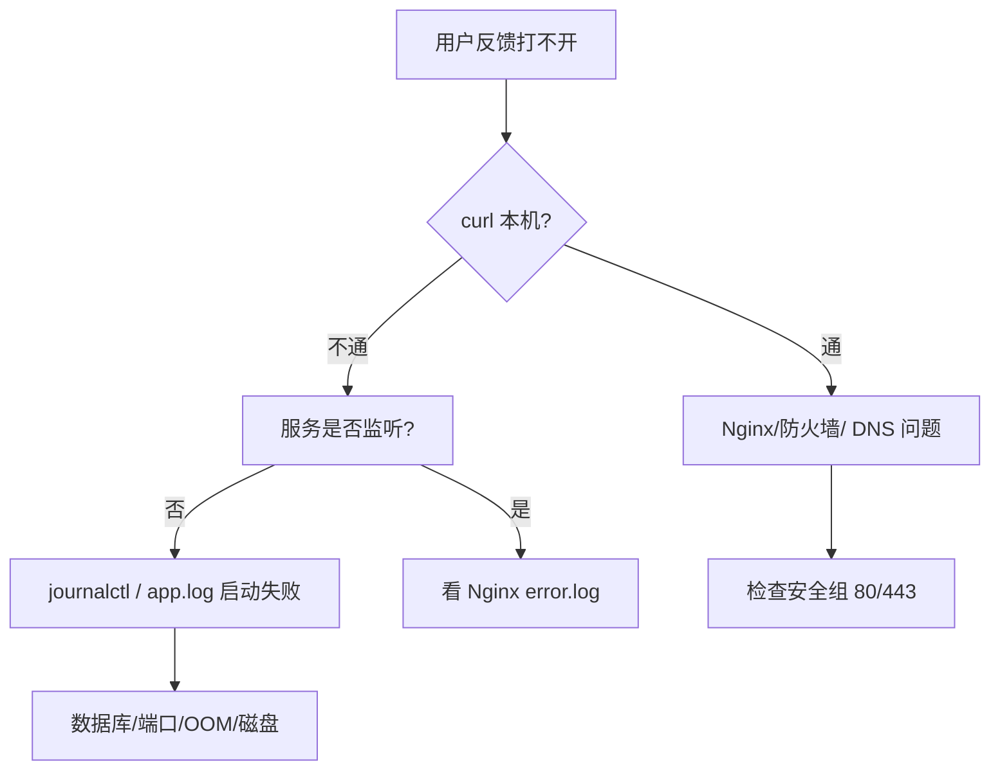
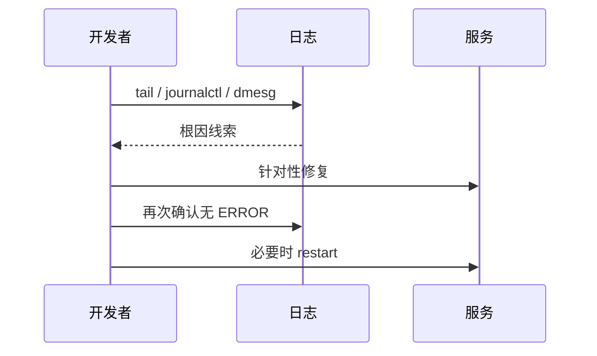

# 日志分析与故障排查

<!-- 修改说明: 2026-06-30 按 EXPANSION-STANDARD 扩充 §0、命令步骤表、FAQ≥10、闭卷自测、费曼检验；环境假设 VMware Ubuntu + ~/study/linux-practice -->

> **文件编码**：UTF-8。本章在 **VMware Ubuntu** 与 **云服务器** 上通用；应用日志示例路径 **`~/study/linux-practice/logs/`**（与 [04 章](./04-文本查看编辑与搜索.md) grep 练习一致）。示例兼顾 **Spring Boot（Java）**、**FastAPI（Python）** 与 **Docker** 部署场景。核心能力：**先看证据再动手**。

---

## 0. 读前导读（零基础也能跟上）

### 0.1 用一句话弄懂本章

**一句话**：服务出问题别先重启——用 **`tail/grep` 看应用说了什么**，**`journalctl` 看 systemd 服务**，**`dmesg` 看内核是否 OOM 杀进程**，**`df` 看磁盘满没满**。

**生活类比**：

| 工具 | 类比 |
|------|------|
| **应用日志 app.log** | 店员值班日记：记录了每笔异常订单 |
| **journalctl** | 物业中控室录像：systemd 管的服务开关记录 |
| **/var/log/syslog** | 小区广播：各类系统消息汇总 |
| **dmesg** | 建筑结构报警：内存不够时「拆东墙补西墙」 |
| **df -h** | 仓库容量表：满了就进不了货（写不了日志） |
| **~/study/linux-practice/logs** | 你的实验日志目录 |

**术语（Log / 日志）**：程序与系统按时间写下的事件记录，排障的第一手证据。  
**为什么重要**：「重启试试」常掩盖根因；面试与线上 on-call 都考「怎么查日志定位问题」。  
**本章用到的地方**：§2～§9 全部排查剧本。

---

### 0.2 你需要提前知道什么

| 水平 | 建议 |
|------|------|
| 04 章 grep/tail | 本章 §4 直接复用 |
| 06 章 journalctl 入门 | 本章 §2 扩展 |
| 10 章 SSH | 远程登录后查 `/var/log` |
| 练习日志 | `mkdir -p ~/study/linux-practice/logs` |

---

### 0.3 本章知识地图（☐→☑）

- [ ] 说出 `/var/log` 下 auth.log、syslog、nginx 用途
- [ ] `journalctl -u 服务 -f` 实时跟踪
- [ ] `dmesg` 识别 OOM killer 一行
- [ ] `tail -f` + `grep ERROR` 查应用栈
- [ ] 磁盘满：`df` → `du` → 安全清理
- [ ] 端口占用：`ss -tlnp` + kill
- [ ] 走完剧本 A「网站打不开」
- [ ] 闭卷自测 ≥ 8/10

---

### 0.4 建议学习时长与节奏

| 阶段 | 时间 | 内容 |
|------|------|------|
| §1～§2 日志体系 + journalctl | 1 h | 含 demo.service |
| §3～§5 OOM/磁盘/权限 | 1 h | 模拟练习 §9 |
| §6～§8 端口与剧本 | 1.5 h | 502 排查链 |
| FAQ + 自测 | 45 min | 口述剧本 A |

---

### 0.5 学完本章你能做什么（可验证）

1. 对 `~/study/linux-practice/logs/app.log` 用 `grep -A 10 ERROR` 拉出异常栈。
2. `journalctl -u mysql -n 20` 判断 MySQL 是否启动失败。
3. 磁盘 100% 时列出清理 journal/docker/log 的 3 种安全操作。
4. 按剧本 A 从 curl 失败走到 Nginx error.log 或 Java 进程。

---

## 本章与上一章的关系

[10 SSH 远程登录与文件传输](10-SSH远程登录与文件传输.md) 你已能登录服务器、上传 jar 和 compose 文件。服务跑起来之后，**第一个问题永远是：出错了看哪里？**

| 上一章（10） | 本章（11） | 下一章（12） |
|--------------|------------|--------------|
| ssh / scp 登上去 | `/var/log` 结构 | Docker 容器日志 |
| 远程执行命令 | `journalctl` / `dmesg` | `docker logs` |
| 传 jar 上去 | `tail -f` + `grep` 查 ERROR | compose 一键起中间件 |

```mermaid
flowchart TB
    subgraph symptom [现象]
        S1[502 / 超时]
        S2[启动失败]
        S3[磁盘告警]
    end
    subgraph evidence [证据层]
        AppLog[应用日志 app.log]
        Journal[journalctl 服务]
        SysLog[/var/log/syslog]
        Dmesg[dmesg 内核]
    end
    subgraph action [动作]
        Fix[改配置 / 扩容 / 重启]
    end
    S1 --> AppLog
    S2 --> Journal
    S3 --> SysLog
    S2 --> Dmesg
    AppLog --> Fix
    Journal --> Fix
```

**学完本章你能**：按固定剧本从「用户说挂了」走到「定位根因」；区分应用日志、systemd 日志、内核日志；处理磁盘满、OOM、Permission denied、端口占用四类高频事故。

---

## 1. Linux 日志体系概览

### 1.1 `/var/log` 常见目录与文件

| 路径 | 内容 | 后端相关场景 |
|------|------|--------------|
| `/var/log/syslog` | 系统综合日志（Ubuntu/Debian） | 包安装、cron、通用事件 |
| `/var/log/auth.log` | 登录、sudo、SSH | 暴力破解、密钥失败 |
| `/var/log/kern.log` | 内核消息副本 | OOM killer 线索 |
| `/var/log/nginx/` | Nginx access / error | 502、upstream 超时 |
| `/var/log/mysql/` | MySQL 错误日志 | 库起不来、磁盘满 |
| `/opt/app/logs/` | **自建应用日志** | Spring Boot / uvicorn 输出 |
| `~/study/linux-practice/logs/` | **练习环境应用日志** | 04 章 grep 实验、本章 tail |
| `/var/lib/docker/containers/` | 容器 JSON 日志 | `docker logs` 的数据源 |

```bash
ls -la /var/log/
# 预期：auth.log  syslog  nginx/  journal/  ...
```

**深入解释**：传统文本日志（syslog）与 **systemd journal**（二进制、结构化）并存。Ubuntu 上 `journalctl` 读 journal；`/var/log/*.log` 常由 rsyslog 从 journal 转发而来。查问题时**两条线都要会**。

### 1.2 应用日志 vs 系统日志

| 类型 | 谁写的 | 典型位置 |
|------|--------|----------|
| 应用 | Logback / Log4j / Python logging | `nohup` 重定向、`logging.file.path` |
| 容器 | 进程 stdout/stderr | `docker logs` |
| 服务单元 | systemd 管理的 daemon | `journalctl -u nginx` |
| 内核 | kernel | `dmesg` |

---

## 2. journalctl：systemd 日志利器

### 2.1 基本用法

| 步骤 | 你的动作 | 预期看到什么 | 若不对 |
|------|----------|--------------|--------|
| 1 | `journalctl -n 20 --no-pager` | 带时间戳的多行日志 | 权限一般不需 sudo |
| 2 | `journalctl -u ssh -n 10 --no-pager` | ssh 服务相关行 | 单元名用 `systemctl list-units` |
| 3 | `journalctl -p err --since today --no-pager` | 仅 error 及以上 | 无输出可能今天无 err |
| 4 | `journalctl -f`（Ctrl+C 退出） | 实时滚动 | 同 tail -f |
| 5 | 对 demo 服务 `journalctl -u demo -n 30` | Spring 启动或 FAILURE | 见 §2.2 unit 文件 |

```bash
# 最近 50 条，倒序
journalctl -n 50 --no-pager
# 预期：-- Logs begin at ... --  多行带 月-日 时:分:秒 主机名 单元[PID]: 消息

# 实时跟踪（类似 tail -f）
journalctl -f

# 只看某个服务（Nginx 示例）
journalctl -u nginx -n 100 --no-pager

# 今天以来的错误优先级
journalctl -p err --since today
```

### 2.2 Spring Boot 用 systemd 管理时

单元文件 `/etc/systemd/system/demo.service`：

```ini
[Unit]
Description=Demo Spring Boot
After=network.target

[Service]
User=ubuntu
WorkingDirectory=/opt/demo
ExecStart=/usr/bin/java -jar /opt/demo/app.jar
Restart=on-failure
StandardOutput=journal
StandardError=journal

[Install]
WantedBy=multi-user.target
```

```bash
sudo systemctl daemon-reload
sudo systemctl start demo
journalctl -u demo -f
# 预期：Spring Boot banner、Started DemoApplication、Tomcat started on port 8080
```

**命令预期输出（启动失败示例）**：

```
demo.service: Main process exited, code=exited, status=1/FAILURE
demo.service: Failed with result 'exit-code'.
```

接着 `journalctl -u demo -n 30` 找 `Caused by:` 或 `Communications link failure`。

### 2.3 常用 journalctl 参数

| 参数 | 含义 |
|------|------|
| `-u UNIT` | 指定 systemd 单元 |
| `-f` | follow |
| `--since "1 hour ago"` | 时间范围 |
| `-p err` | 优先级 err 及以上 |
| `-b` | 本次启动以来 |
| `-b -1` | 上次启动（查重启前崩溃） |

### 2.4 demo.service 安装步骤表（VMware 练习）

| 步骤 | 你的动作 | 预期看到什么 | 若不对 |
|------|----------|--------------|--------|
| 1 | 写 `/etc/systemd/system/demo.service` | 文件存在 | sudo nano |
| 2 | `sudo systemctl daemon-reload` | 无输出 | unit 语法错会提示 |
| 3 | `sudo systemctl enable demo` | Created symlink | — |
| 4 | `sudo systemctl start demo` | 无 failed | journalctl -u demo |
| 5 | `journalctl -u demo -n 20 --no-pager` | Spring banner 或错误栈 | jar 路径/User |

---

## 3. dmesg：内核与 OOM

### 3.1 查看内核环形缓冲区

```bash
dmesg | tail -30
# 或（需 sudo 读全量）
sudo dmesg -T | tail -30
```

**OOM（Out Of Memory）典型输出**：

```
[123456.789012] Out of memory: Killed process 4567 (java) total-vm:4123456kB, anon-rss:3800000kB
[123456.789013] oom-kill:constraint=CONSTRAINT_NONE,... task=java,pid=4567,uid=1000
[123456.789014] Out of memory: Kill process 4567 (java) score 900 or sacrifice child
```

**深入解释**：Linux 在物理内存+swap 不足时，**OOM Killer** 按 `oom_score` 选进程杀掉——Java 堆设太大、多个 Docker 容器抢内存时常见。证据在 `dmesg` 和 `/var/log/syslog`，**不在**应用 ERROR 日志里（进程已被 SIGKILL）。

### 3.2 排查 OOM 后续动作

```bash
free -h
# 预期：
#               total        used        free      shared  buff/cache   available
# Mem:           3.8Gi       3.5Gi       100Mi       ...

grep -i oom /var/log/syslog | tail -5
```

缓解：减小 JVM `-Xmx`、加 swap（练习环境）、升级内存、限制容器 `--memory`。

---

## 4. 应用日志：tail、grep、less

### 4.1 实时跟踪

| 步骤 | 你的动作 | 预期看到什么 | 若不对 |
|------|----------|--------------|--------|
| 1 | `mkdir -p ~/study/linux-practice/logs` | 目录存在 | 权限 |
| 2 | `echo "INFO start" >> ~/study/linux-practice/logs/app.log` | 文件增大 | 路径 |
| 3 | 终端 A：`tail -f ~/study/linux-practice/logs/app.log` | 等待新行 | 文件不存在 |
| 4 | 终端 B：再 echo 一行 ERROR | A 终端即时显示 | 缓冲：stdbuf 或 fflush |
| 5 | `grep -n ERROR ~/study/linux-practice/logs/app.log` | 行号+内容 | 无 ERROR 则空 |

```bash
tail -f ~/study/linux-practice/logs/app.log
# 或生产路径
tail -f /opt/demo/logs/app.log
```

**预期**：新请求进来时滚动出现 access 或 SQL 日志。

### 4.2 搜索 ERROR 与异常栈

```bash
grep -n "ERROR" /opt/demo/logs/app.log | tail -20
# 预期：行号:时间 ERROR ... --- 异常消息

grep -A 15 "Communications link failure" /opt/demo/logs/app.log
# -A 15：匹配行后 15 行（常含 Caused by）
```

```bash
# 统计 ERROR 出现次数（按小时粗分）
grep ERROR app.log | cut -c1-13 | sort | uniq -c | sort -nr | head
```

### 4.3 Spring Boot logging 配置

```yaml
# application-prod.yml
logging:
  level:
    root: info
    com.example.demo: debug
  file:
    name: /opt/demo/logs/spring.log
  logback:
    rollingpolicy:
      max-file-size: 50MB
      max-history: 7
```

### 4.4 Python FastAPI / uvicorn

```bash
uvicorn main:app --host 0.0.0.0 --port 8000 >> /opt/demo/logs/uvicorn.log 2>&1
grep -i "traceback" /opt/demo/logs/uvicorn.log
```

---

## 5. 磁盘满（No space left on device）

### 5.1 发现

| 步骤 | 你的动作 | 预期看到什么 | 若不对 |
|------|----------|--------------|--------|
| 1 | `df -h` | Use% 列 | 重点看 `/` |
| 2 | Use% ≥ 95% | Avail 接近 0 | 进入 §5.2 |
| 3 | `df -i`（可选） | inode 是否 100% | 小文件过多 |
| 4 | 应用写日志失败 | No space left on device | 先腾空间再重启 |
| 5 | 清理后 `df -h` | Avail 恢复 | journal vacuum 等 §5.3 |

```bash
df -h
# 预期（问题示例）：
# Filesystem      Size  Used Avail Use% Mounted on
# /dev/sda1        20G   19G     0 100% /
```

应用日志可能出现：

```
java.io.IOException: No space left on device
```

MySQL 可能无法写入 binlog。

### 5.2 定位大目录

```bash
sudo du -xh / --max-depth=1 2>/dev/null | sort -h
# 预期最后一行最大可能是 /var 或 /home

sudo du -xh /var --max-depth=1 | sort -h
# 常见：/var/log、/var/lib/docker
```

```bash
# 找超大单个日志
sudo find /var/log -type f -size +100M -exec ls -lh {} \;
```

### 5.3 安全清理

```bash
# journal 限制体积
sudo journalctl --vacuum-size=500M

# 清空已轮转的旧 gz（确认不需要再删）
sudo find /var/log -name "*.gz" -mtime +30 -delete

# Docker 未用镜像/容器（12 章详讲）
docker system df
```

**深入解释**：`Avail 0` 时 ext4 可能保留 5% 给 root——普通用户仍报 No space，root 还能写一点。100% 时**先腾空间再重启服务**，否则重启也可能失败。

---

## 6. Permission denied

### 6.1 典型场景

| 场景 | 日志/现象 | 处理 |
|------|-----------|------|
| 写应用日志 | `Permission denied` 打开 `/var/log/demo/app.log` | `sudo chown ubuntu:ubuntu` 或改路径到 `/opt/demo/logs` |
| 读 Nginx 配置 | `nginx -t` 失败 | `sudo nginx -t` |
| 绑定 80 端口 | `Permission denied` bind | 用 8080 或 `setcap`/root（Nginx 标准做法） |
| MySQL 数据目录 | 容器反复重启 | 检查 volume 挂载 UID |

```bash
ls -la /opt/demo/logs/
# 预期问题：目录 owner 是 root，应用用户 ubuntu 无法写
# drwxr-xr-x  root root  ... logs

sudo chown -R ubuntu:ubuntu /opt/demo/logs
```

### 6.2 SELinux / AppArmor（了解）

Ubuntu 默认 AppArmor 对 MySQL、Docker 有 profile。少见但遇 `Permission denied` 且权限位正确时：

```bash
sudo dmesg | grep -i denied | tail -5
sudo aa-status
```

---

## 7. 端口被占用（Address already in use）

### 7.1 查找占用进程

```bash
ss -tlnp | grep 8080
# 预期：
# LISTEN 0 100 *:8080 *:* users:(("java",pid=12345,fd=50))

# 或
sudo lsof -i :8080
# 预期：java  12345  ubuntu  ... TCP *:8080 (LISTEN)
```

### 7.2 处理

```bash
# 优雅停止
kill -15 12345
sleep 2
ss -tlnp | grep 8080   # 应无输出

# 仍占用再强制
kill -9 12345
```

Docker 场景：

```bash
docker ps | grep 8080
# 停掉占端口的容器
docker stop study-app
```

---

## 8. 逐步排查剧本（Troubleshooting Playbook）

### 8.1 剧本 A：用户说「网站打不开」



**手把手步骤**：

| 步骤 | 你的动作 | 预期看到什么 | 若不对 |
|------|----------|--------------|--------|
| 1 | `curl -v http://127.0.0.1:8080/actuator/health` | HTTP 200 + UP | 不通→步骤 2 |
| 2 | `ss -tlnp \| grep 8080` | java LISTEN | 无→journalctl/app.log |
| 3 | `tail -50 ~/study/linux-practice/logs/app.log \| grep -i error` | 错误或空 | 路径改 /opt/demo |
| 4 | `journalctl -u demo -n 50 --no-pager` | 启动失败栈 | 无 unit 则 skip |
| 5 | `sudo tail -20 /var/log/nginx/error.log` | upstream refused | 502 场景 |

```bash
# 1. 本机探活
curl -v http://127.0.0.1:8080/actuator/health
# 预期 OK：HTTP/1.1 200 ... {"status":"UP"}

# 2. 进程与端口
ps -ef | grep java
ss -tlnp | grep 8080

# 3. 最近错误
tail -100 /opt/demo/logs/app.log | grep -i error
journalctl -u demo -n 50 --no-pager

# 4. 若前面有 Nginx
sudo tail -50 /var/log/nginx/error.log
curl -v http://127.0.0.1/api/health
```

### 8.2 剧本 B：服务「昨天还好今天挂了」

```bash
# 1. 是否重启过
uptime
last reboot | head -3

# 2. 磁盘
df -h

# 3. 内存与 OOM
free -h
sudo dmesg -T | grep -i "out of memory" | tail -3

# 4. 是否被人为 kill
grep -i demo /var/log/auth.log | tail -10
```

### 8.3 剧本 C：Docker 容器 Exited

```bash
docker ps -a | grep study
docker logs study-mysql --tail 80
# 预期：若密码错、磁盘满，这里有明确 ERROR
```

（完整 Docker 流程见 [12 章](12-Docker容器基础.md)）

### 8.4 剧本 D：接口慢 / 超时

```bash
# 应用慢 SQL 日志
grep -i "slow" app.log | tail -10

# 系统负载
uptime
# 预期：load average: 0.5, 0.3, 0.2（单核 >1 持续需警惕）

top -bn1 | head -20
```

---

## 9. 手把手实操：模拟故障并排查

在 VMware Ubuntu 上按顺序练习（**仅练习环境**）。

### 练习 0：准备 ~/study/linux-practice/logs

| 步骤 | 你的动作 | 预期看到什么 | 若不对 |
|------|----------|--------------|--------|
| 1 | `mkdir -p ~/study/linux-practice/logs` | 目录存在 | 04 章应已有 |
| 2 | 写入多级别样例日志 | INFO/WARN/ERROR 各行 | 见下方 cat |
| 3 | `grep -c ERROR ~/study/linux-practice/logs/app.log` | 计数 ≥ 1 | 路径 |
| 4 | `tail -f` 另终端 append | 实时可见 | 缓冲 |
| 5 | 与 /var/log 对比 | 应用 log 在用户目录 | 权限更简单 |

```bash
cat >> ~/study/linux-practice/logs/app.log << 'EOF'
2026-06-30 10:00:01 INFO  Server started on port 8080
2026-06-30 10:00:05 WARN  Slow query 1200ms SELECT * FROM user
2026-06-30 10:00:10 ERROR Connection refused redis:6379
2026-06-30 10:00:11 ERROR java.net.ConnectException: Connection refused
EOF
grep -A 3 ERROR ~/study/linux-practice/logs/app.log
```

### 练习 1：模拟端口占用

```bash
# 终端 1
java -jar /opt/demo/app.jar --server.port=8080

# 终端 2 再启动一次
java -jar /opt/demo/app.jar --server.port=8080
# 预期：Web server failed to start. Port 8080 was already in use.

ss -tlnp | grep 8080
kill -15 <pid>
```

### 练习 2：模拟磁盘满（小磁盘 VM 或 loop 文件）

```bash
dd if=/dev/zero of=/tmp/fill bs=1M count=500 2>/dev/null
df -h /
# 尝试 echo test >> /opt/demo/logs/app.log
# 若满则见 No space left on device
rm /tmp/fill
```

### 练习 3：journalctl 查 SSH 失败

```bash
# 故意用错密钥或密码试一次 ssh
sudo journalctl -u ssh -n 20 --no-pager
# 或
sudo grep "Failed password" /var/log/auth.log | tail -5
```

---

## 10. Nginx 与全栈联调日志

```bash
# access：谁请求了什么、状态码
sudo tail -f /var/log/nginx/access.log
# 预期：127.0.0.1 - - [日期] "GET /api/users HTTP/1.1" 502  ...

# error：upstream 连不上
sudo tail -f /var/log/nginx/error.log
# 预期：connect() failed (111: Connection refused) while connecting to upstream
```

**502 含义**：Nginx 活着，**后端 upstream 不通**——回到剧本 A 查 8080 进程。

### 10.1 access.log 常见字段速读

| 字段位置（默认 combined） | 含义 | 后端关注 |
|---------------------------|------|----------|
| `$1` 客户端 IP | 谁访问 | 安全/限流 |
| `$9` 状态码 | 200/404/502 | 502→upstream |
| `$7` 请求路径 | `/api/users` | 统计 Top API |
| `$10` bytes | 响应大小 | 异常大响应 |
| 末尾 User-Agent | 浏览器/curl | 区分爬虫 |

```bash
# 统计 5xx（Nginx 层）
sudo awk '$9 ~ /^5/' /var/log/nginx/access.log | tail -5
```

---

## 11. 常见报错与排查

| 报错信息（关键词） | 可能原因 | 解决方案 |
|-------------------|---------|---------|
| `No space left on device` | 磁盘满 | `df -h`、`du` 清理 log/journal/docker |
| `Out of memory: Killed process (java)` | OOM killer | 减堆内存、加 RAM/swap、`dmesg` 确认 |
| `Permission denied` 写日志 | 目录 owner 错 | `chown` 到运行用户 |
| `Address already in use` | 端口冲突 | `ss -tlnp`、kill 或改端口 |
| `Communications link failure` | MySQL 未起/网络 | `docker ps`、查 3306、密码 |
| `502 Bad Gateway` | 后端未监听 | `curl localhost:8080`、Nginx error.log |
| `Connection refused` | 服务未启动或防火墙 | `systemctl status`、安全组 |
| `Too many open files` | ulimit 过小 | `ulimit -n`、`/etc/security/limits.conf` |
| `bind() to 0.0.0.0:80 failed` | 非 root 绑 80 | Nginx 用 sudo；app 改 8080 |
| `Failed to start demo.service` | jar 路径错/Java 未装 | `journalctl -u demo -n 30` |
| `denied` in dmesg | AppArmor/权限 | `aa-status`、调整 profile 或路径 |
| `rotate failed` logback | 磁盘满或权限 | 同磁盘满处理 |

---

## 12. 深入解释：为什么「先日志后重启」

重启有时**掩盖间歇性问题**（内存泄漏、连接池耗尽）。正确顺序：

1. **保留现场**：`cp app.log app.log.incident-$(date +%F-%H%M)`  
2. **收集证据**：journal + app + dmesg + df  
3. **最小变更修复**：改配置、腾磁盘、杀冲突进程  
4. **验证**：curl + 看 5 分钟日志无 ERROR  
5. **再考虑重启**：且用 `systemctl restart` 而非 `kill -9`



---

## 13. 日志工具速查表

| 命令 | 用途 |
|------|------|
| `tail -f file` | 实时应用日志 |
| `grep -A 10 PAT file` | 异常栈上下文 |
| `journalctl -u svc -f` | systemd 服务 |
| `journalctl -p err -b` | 本次启动错误 |
| `dmesg -T \| grep -i oom` | 内存被杀 |
| `df -h` / `du -sh *` | 磁盘 |
| `free -h` | 内存 |
| `ss -tlnp` | 端口 |
| `docker logs -f ctn` | 容器 stdout |

---

## 14. 练习建议

### 基础

1. 列出 `/var/log` 下 5 个文件并说明用途。
2. 对正在运行的 Java 或 Python 进程 `tail -f` 日志，故意请求错误 URL，观察日志行。
3. 用 `journalctl -u ssh -n 10` 看 SSH 相关条目。

### 进阶

4. 写一个简单的 `demo.service`，用 `journalctl -u demo` 看启动日志。
5. 用 `grep ERROR` + `wc -l` 统计今日错误条数。
6. 模拟 8080 占用并按剧本 A 完整走一遍。

### 挑战

7. 配置 logrotate 或 Spring Boot rolling policy，制造大日志后安全清理。
8. 磁盘使用超过 90% 时写一条「告警检查清单」（df、du、journal vacuum、docker system df）。
9. 从 Nginx access.log 统计 Top 10 访问路径：`awk '{print $7}' access.log | sort | uniq -c | sort -nr | head`.

---

## 15. 练习参考答案

### 基础 1

示例答：`auth.log`（登录认证）、`syslog`（系统综合）、`nginx/access.log`（HTTP 访问）、`kern.log`（内核）、`journal/`（systemd 二进制存储）。

### 进阶 9（Nginx Top 路径）

```bash
sudo awk '{print $7}' /var/log/nginx/access.log | sort | uniq -c | sort -nr | head -10
# 预期：
#    152 /api/users
#     89 /
#     ...
```

### 挑战 7：logrotate 片段（/etc/logrotate.d/demo）

```
/opt/demo/logs/*.log {
    daily
    rotate 7
    compress
    missingok
    notifempty
    copytruncate
}
```

---

## 16. 学完标准

- [ ] 能画出应用日志、journal、dmesg 三者的关系
- [ ] 熟练使用 `journalctl -u`、`-f`、`-p err`
- [ ] 会用 `tail -f` + `grep` 定位 Java/Python 异常栈
- [ ] 磁盘满时能 `df` + `du` 找到大目录并安全清理
- [ ] 能识别 OOM 日志并给出缓解思路
- [ ] 能按剧本 A 排查「502 / 打不开」
- [ ] 会用 `ss -tlnp` 解决端口占用
- [ ] 理解 Permission denied 在日志路径上的常见原因

---

## 17. 常见问题 FAQ

**Q1：应用日志和 journalctl 先看哪个？**  
有 systemd 单元先 **`journalctl -u 服务`**；nohup 重定向的文件看 **`tail app.log`**；两者可能同时需要。

**Q2：`grep ERROR` 为空但服务明显有问题？**  
日志级别可能是 WARN；查 `Exception`、`Caused by`；或日志写别的路径/没权限写文件。

**Q3：OOM 为什么应用日志里常常没有 stack trace？**  
OOM Killer 发 **SIGKILL**，进程来不及写日志；看 **dmesg** 和 syslog。

**Q4：磁盘 100% 先删什么最安全？**  
已轮转 `.gz`、journal vacuum、Docker 未用镜像；**勿删**正在写的 `.log`（用 logrotate）。

**Q5：502 和 Connection refused 区别？**  
502=Nginx 活着但 **upstream 8080 不通**；refused=直连时目标端口无监听。

**Q6：`journalctl -f` 和 `tail -f` 何时等价？**  
systemd 托管且 `StandardOutput=journal` 时用 journalctl；文件重定向用 tail。

**Q7：Permission denied 写 `/var/log/myapp`？**  
普通用户勿写系统目录；改 **`~/study/linux-practice/logs`** 或 `/opt/demo/logs` 并 chown。

**Q8：`Too many open files` 日志在哪？**  
应用日志 + journal；`ulimit -n` 查看；高并发 Spring 常见。

**Q9：为什么「先备份日志再重启」？**  
重启可能滚动/覆盖；`cp app.log app.log.incident-$(date +%F)` 保留现场。

**Q10：Docker 容器 Exited 第一步？**  
`docker logs 容器名 --tail 100`；再看 `docker inspect` 的 ExitCode。

**Q11：auth.log 里 Failed password 要慌吗？**  
公网服务器常见扫描；确认 **密钥登录** + 关密码；非 22 端口仅 obscurity。

**Q12：`~/study/linux-practice/logs` 如何造 ERROR 练手？**  
`echo "$(date) ERROR fake timeout" >> app.log` 再 grep；或请求不存在的 API。

---

## 18. 闭卷自测

### 概念题（6 道）

1. `/var/log/auth.log` 与 `syslog` 各记什么？
2. journal 与传统文本日志并存时，Ubuntu 上关系一句？
3. OOM Killer 触发条件与证据命令？
4. 「先日志后重启」的五步顺序（§12）？
5. 502 Bad Gateway 在 Nginx 场景含义？
6. `grep -A 15 Exception` 里 `-A` 作用？

### 动手题（2 道）

7. 写三条命令：查 demo 服务最近 30 条日志、实时跟踪、仅 error。
8. 磁盘满：写 `df` + `du` 一级定位 + journal 清理各一条。

### 综合题（2 道）

9. 口述剧本 A 从 curl 失败到定位 Nginx vs Java 的分支。
10. 端口 8080 占用完整排查 4 步（含 ss 与 kill -15）。

### 自测参考答案

1. auth=登录/sudo/SSH；syslog=系统综合事件。
2. journal 二进制源；rsyslog 常转发到 /var/log/*.log。
3. 内存+swap 不足；`dmesg | grep -i oom`。
4. 备份日志→收集 journal/app/dmesg/df→最小修复→验证→再 restart。
5. Nginx 正常但 upstream（如 8080）不可达。
6. 匹配行**之后** 15 行，常含 Caused by 栈。
7. `journalctl -u demo -n 30 --no-pager`；`journalctl -u demo -f`；`journalctl -u demo -p err -n 20`
8. `df -h`；`sudo du -xh /var --max-depth=1 | sort -h`；`sudo journalctl --vacuum-size=500M`
9. curl 本机→ss 8080→app.log/journal→nginx error→安全组/ufw。
10. `ss -tlnp | grep 8080` 得 PID→`kill -15 PID`→再 ss→必要时 kill -9。

---

## 19. 费曼检验

**任务**：3 分钟向新人解释「用户说网站打不开，你为什么不能第一反应 reboot，而应该按什么顺序查」。

**对照提纲**：

1. **保留证据**：重启可能冲掉内存里未落盘的线索；先 tail/journal 截图或 cp 日志。
2. **分层排查**：本机 curl → 端口 ss → 应用 ERROR → Nginx → 磁盘/OOM（df/dmesg）。
3. **最小修复**：腾磁盘、改配置、杀冲突进程验证后再 systemctl restart，而非盲目 reboot 整机。

### 每日 5 分钟（VMware）

```bash
journalctl -p err --since today --no-pager | tail -5
df -h / | awk 'NR==2 {print "disk use:", $5}'
grep -c ERROR ~/study/linux-practice/logs/app.log 2>/dev/null || echo "0 errors in practice log"
```

---

## 20. 下一章预告

11 章你学会了**读日志、找根因**——但每次都手工装 MySQL、Redis，环境仍容易「我机器上能跑」。下一章（[12 Docker 容器基础](12-Docker容器基础.md)）用 **镜像与容器** 统一环境：`docker run -d -p`、Dockerfile、`docker compose` 一键起 MySQL + Redis，并与 [Java 09 Linux/Docker/Nginx 部署基础](../Java/09-LinuxDockerNginx部署基础.md) 对照，为 Nginx 反向代理与完整全栈部署铺路。

---

*上一章：[10-SSH远程登录与文件传输](10-SSH远程登录与文件传输.md) · 下一章：[12-Docker容器基础](12-Docker容器基础.md)*

*本章已按 EXPANSION-STANDARD 扩充（§0+journalctl/磁盘/剧本A 步骤表+FAQ+自测+费曼）。*

**EXPANSION-STANDARD 自检**：☑ §0 ☑ 步骤表 §2.1/§2.4/§4.1/§5.1/§8.1/§9 ☑ FAQ≥10 ☑ 闭卷 10 题 ☑ 费曼 ☑ VMware Ubuntu + ~/study/linux-practice
