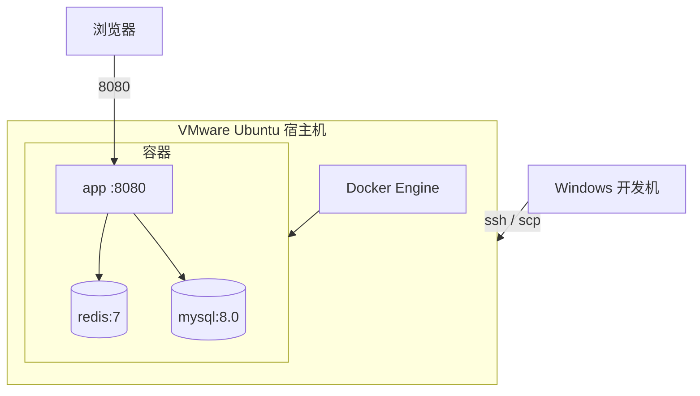
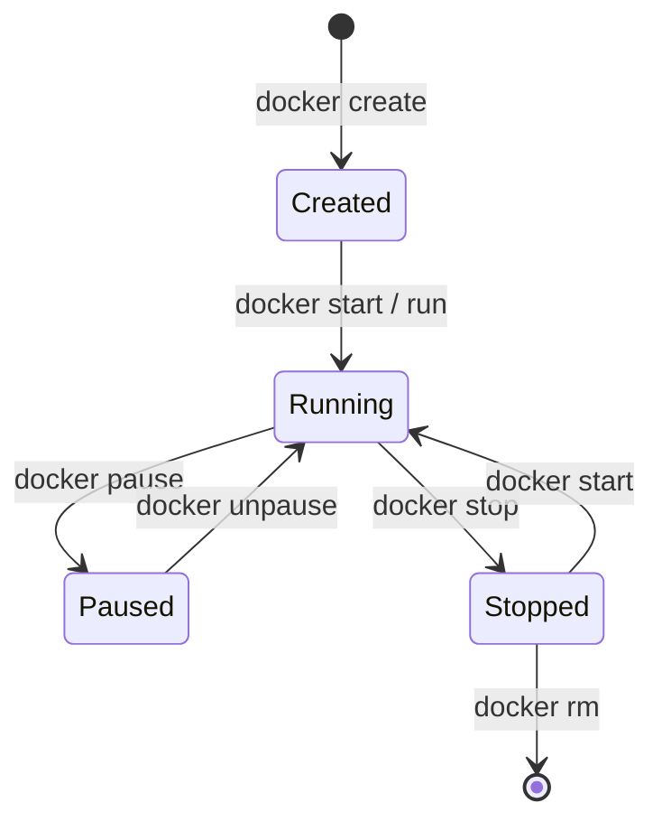
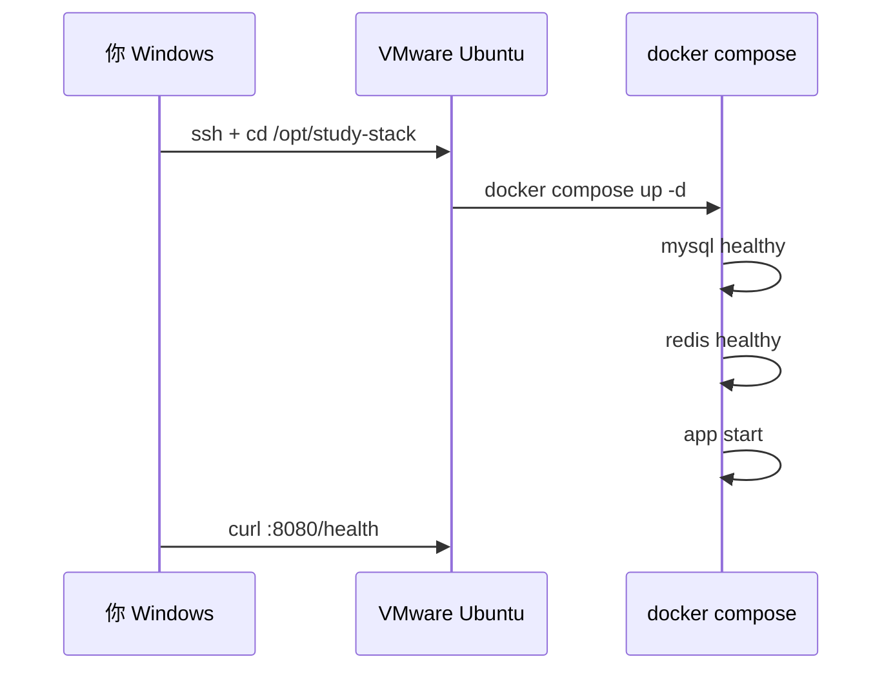
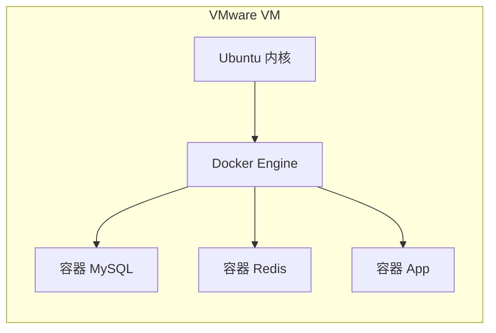

# Docker 容器基础

<!-- 修改说明: 2026-06-30 按 EXPANSION-STANDARD 扩充 §0、安装步骤表、compose 逐行读、FAQ≥10、闭卷自测、费曼检验；环境假设 VMware Ubuntu（见 todo.md） -->

> **文件编码**：UTF-8。本章在 **VMware Ubuntu 22.04/24.04** 上演示 Docker Engine；Windows 宿主机可同时安装 **Docker Desktop** 做对照。系统梳理容器化，比 [Java 09](../Java/09-LinuxDockerNginx部署基础.md) 更完整，并与全栈部署（MySQL + Redis + 后端）直接衔接。

---

## 0. 读前导读（零基础也能跟上）

### 0.1 用一句话弄懂本章

**一句话**：**Docker** 把 MySQL、Redis、你的 jar 放进 **标准化「盒子」**（镜像→容器），在 VMware Ubuntu 里 **一条 `docker compose up` 起全栈**，环境不再「我电脑能跑你服务器报错」。

**生活类比**：

| 概念 | 类比 |
|------|------|
| **镜像 Image** | 料包配方（只读模板） |
| **容器 Container** | 按配方现做的一锅汤（运行实例） |
| **docker run** | 开一锅新汤 |
| **volume 数据卷** | 汤锅下面的 **保温底座**——删容器不丢数据 |
| **docker compose** | 一张 **套餐菜单**：MySQL+Redis+App 一起上 |
| **Docker vs VMware** | VMware 是 **整间厨房**；Docker 是 **厨房里多个标准化灶台** |

**术语（Container）**：与宿主机 **共享 Linux 内核** 的隔离进程，有独立文件系统与网络，比 VM **更轻**。

**为什么重要**：[Java 09](../Java/09-LinuxDockerNginx部署基础.md) 用 Docker 起中间件；[14 章](14-全栈项目Linux部署实战.md) compose 备选方案；面试常问 **容器和虚拟机区别**。

---

### 0.2 你需要提前知道什么

| 水平 | 建议 |
|------|------|
| 11 章磁盘满、`/var/lib/docker` | 本章 §10.3 清理与 11 章呼应 |
| 07 章端口 `ss -tlnp` | 映射 `-p 3306:3306` 冲突时查 |
| 08 章 apt | Docker **另加官方源**，不用 apt 装旧版 docker.io 凑合 |
| Spring Boot 连 JDBC | compose 里主机名用 **服务名** `mysql` 不是 `127.0.0.1` |

---

### 0.3 本章知识地图（☐→☑）

- [ ] 安装 Docker Engine + compose 插件，`hello-world` 成功
- [ ] 说清 **镜像 / 容器 / volume / registry**
- [ ] `docker run -d -p -e -v` 起 Redis 与 MySQL
- [ ] `docker ps` / `logs` / `exec` 熟练
- [ ] 会写 Spring Boot 或 FastAPI **基础 Dockerfile**
- [ ] 会写含 **healthcheck + depends_on** 的 compose 三件套
- [ ] 知道 `docker system df` 与 prune 清磁盘
- [ ] 闭卷自测 ≥ 8/10

---

### 0.4 建议学习时长

| 阶段 | 时间 |
|------|------|
| §1～§5 概念与 run | 1.5 h |
| §6 Dockerfile | 1 h |
| §7～§8 compose 实操 | 2 h |
| FAQ + 自测 | 45 min |

---

### 0.5 学完你能做什么

1. 在 VMware 用 compose 启动 **MySQL + Redis + Spring Boot**，`curl` 健康检查通过。
2. 解释 **为什么 app 要用 `jdbc:mysql://mysql:3306`** 而不是 localhost。
3. 容器 Restarting 时 **10 分钟内** 用 `docker logs` 定位原因。
4. 与同学对比 **Java 09 §42** 与本章 §7 yaml 差异（healthcheck）。

---

## 本章与上一章的关系

[11 日志分析与故障排查](11-日志分析与故障排查.md) 你已会在宿主机上读 `app.log`、`journalctl`，并处理磁盘满、OOM、端口占用。引入 Docker 后，**日志与资源又多了一层：容器**——进程在 cgroup 里跑，stdout 进 `docker logs`，磁盘占在 `/var/lib/docker`。

| 上一章（11） | 本章（12） | 后续 |
|--------------|------------|------|
| 宿主机 `/var/log` | 容器 `docker logs` | Nginx 反代多容器 |
| `ss -tlnp` 查端口 | `-p 8080:8080` 映射 | docker compose 全栈 |
| 磁盘满含 `/var/lib/docker` | 镜像/容器清理 | 与 Java/Python 09 联调 |



**与 Java 09 的关系**：[Java 09](../Java/09-LinuxDockerNginx部署基础.md) 在业务路线里快速带过 Docker；本章在 **Linux 专项** 里从安装、镜像原理、Dockerfile 到 **compose 编排** 系统讲一遍，便于 VMware 练习机与云服务器统一环境。

---

## 1. Docker 解决什么问题

| 痛点 | 无 Docker | 有 Docker |
|------|-----------|-----------|
| MySQL 版本 | 本机 5.7、服务器 8.0 语法差 | 镜像 tag 锁定 `mysql:8.0` |
| Redis 安装 | 编译/ apt 各一套 | `docker run redis:7` |
| 同事环境 | 「我这边能跑」 | compose 文件即环境契约 |
| 上线 | 手工装依赖 | 镜像推仓库，服务器 pull |

**深入解释**：容器共享**宿主机内核**，不是完整虚拟机。每个容器有独立文件系统（镜像层叠加）、网络命名空间、cgroup 资源限制。比 VMware **更轻**；与 VMware 关系是：你在 VM 里装 Docker，一层 VM 里再跑多个容器。

---

## 2. 安装 Docker Engine（Ubuntu / VMware）

### 2.1 卸载旧版本（如有）

```bash
sudo apt remove docker docker-engine docker.io containerd runc 2>/dev/null
```

### 2.2 官方仓库安装（推荐）

| 步骤 | 你的动作 | 预期看到什么 | 若不对 |
|------|----------|--------------|--------|
| 1 | 卸载旧 docker 包（§2.1） | 无报错或「未安装」 | 忽略即可 |
| 2 | `sudo apt update` + 装 curl/gnupg | `Reading package lists... Done` | 换清华源见 08 章 |
| 3 | 添加 Docker GPG 与 apt 源 | `docker.list` 写入成功 | 网络失败重试或代理 |
| 4 | `sudo apt install docker-ce ... compose-plugin` | 安装完成无 `E:` | 看报错表 §11 |
| 5 | `docker --version` + `docker compose version` | 26.x / v2.x | 未找到命令→重装 |
| 6 | `usermod -aG docker` + 重新登录 | — | 仍要 sudo→newgrp docker |
| 7 | `docker run hello-world` | `Hello from Docker!` | Cannot connect→§11 |

```bash
sudo apt update
sudo apt install -y ca-certificates curl gnupg

sudo install -m 0755 -d /etc/apt/keyrings
curl -fsSL https://download.docker.com/linux/ubuntu/gpg | sudo gpg --dearmor -o /etc/apt/keyrings/docker.gpg
sudo chmod a+r /etc/apt/keyrings/docker.gpg

echo \
  "deb [arch=$(dpkg --print-architecture) signed-by=/etc/apt/keyrings/docker.gpg] https://download.docker.com/linux/ubuntu \
  $(. /etc/os-release && echo "$VERSION_CODENAME") stable" | \
  sudo tee /etc/apt/sources.list.d/docker.list > /dev/null

sudo apt update
sudo apt install -y docker-ce docker-ce-cli containerd.io docker-buildx-plugin docker-compose-plugin
```

**命令预期输出**：

```bash
docker --version
# Docker version 26.x.x, build xxxxx

docker compose version
# Docker Compose version v2.x.x
```

### 2.3 当前用户免 sudo（练习环境）

```bash
sudo usermod -aG docker $USER
newgrp docker
docker run hello-world
```

**预期**：

```
Hello from Docker!
This message shows that your installation appears to be working correctly.
```

### 2.4 VMware 注意事项

- 虚拟机 BIOS 开启 **虚拟化**（VT-x/AMD-V）。
- 磁盘建议 ≥ 40GB（镜像与 volume 占空间，与 [11 章磁盘满](11-日志分析与故障排查.md) 呼应）。
- 内存 ≥ 4GB，跑 MySQL + Redis + Java 同时时建议 8GB。

---

## 3. 核心概念：镜像、容器、仓库

| 概念 | 类比 | 说明 |
|------|------|------|
| **镜像 Image** | 类 / 模板 | 只读层，如 `mysql:8.0` |
| **容器 Container** | 对象 / 实例 | 镜像的运行实例，可写层 |
| **仓库 Registry** | Maven Central | Docker Hub、阿里云镜像加速 |

```bash
docker pull redis:7
# 预期：7: Pulling from library/redis ... Status: Downloaded newer image for redis:7

docker images
# REPOSITORY   TAG   IMAGE ID       CREATED        SIZE
# redis        7     xxxxxxxxxxxx   ...            117MB
```

**深入解释**：镜像由**只读层**叠加；容器启动时在顶部加**可写层**。删除容器可丢可写层；数据应放 **volume** 或 bind mount，否则 `docker rm` 丢数据。

---

## 4. docker run：后台、端口、环境变量

### 4.1 语法骨架

```bash
docker run [选项] 镜像[:tag] [命令]
```

常用选项：

| 选项 | 含义 |
|------|------|
| `-d` | detached 后台 |
| `--name` | 容器名 |
| `-p 宿主机:容器` | 端口映射 |
| `-e KEY=VAL` | 环境变量 |
| `-v 宿主机路径:容器路径` | 数据卷 |
| `--rm` | 退出后自动删除容器 |

### 4.2 启动 Redis

```bash
docker run -d --name study-redis -p 6379:6379 redis:7
docker ps
# 预期：
# CONTAINER ID   IMAGE     COMMAND                  STATUS         PORTS                    NAMES
# abc123def456   redis:7   "docker-entrypoint.s…"   Up 5 seconds   0.0.0.0:6379->6379/tcp   study-redis
```

```bash
docker exec -it study-redis redis-cli ping
# 预期：PONG
```

### 4.3 启动 MySQL 8

```bash
docker run -d \
  --name study-mysql \
  -e MYSQL_ROOT_PASSWORD=123456 \
  -e MYSQL_DATABASE=study_db \
  -p 3306:3306 \
  -v mysql-data:/var/lib/mysql \
  mysql:8.0
```

**命令预期输出（首次较慢）**：

```bash
docker logs study-mysql 2>&1 | tail -5
# 预期含：ready for connections. Version: '8.0.xx'
```

Windows / 宿主机连接（VM IP 为 192.168.1.105 示例）：

```bash
mysql -h 192.168.1.105 -P 3306 -u root -p123456 -e "SHOW DATABASES;"
# 预期含 study_db
```

---

## 5. 容器生命周期管理

```bash
docker ps          # 运行中
docker ps -a       # 含已停止
docker stop study-redis
docker start study-redis
docker restart study-redis
docker rm study-redis        # 需先 stop 或 -f 强制
docker rm -f study-mysql     # 停止并删除（volume 不删）
```

```bash
docker logs study-mysql --tail 50
docker logs -f study-mysql   # 实时，同 tail -f
```

```bash
docker exec -it study-mysql bash
# 容器内
mysql -uroot -p123456 -e "SELECT 1;"
exit
```



---

## 6. Dockerfile 基础

把 Spring Boot / FastAPI 应用打成可重复部署的镜像。

### 6.1 Java Spring Boot 示例

项目根目录 `Dockerfile`：

```dockerfile
# 构建阶段（可选 multi-stage，此处单阶段简化）
FROM eclipse-temurin:17-jre-jammy

WORKDIR /app

COPY target/demo-0.0.1-SNAPSHOT.jar app.jar

EXPOSE 8080

ENV JAVA_OPTS="-Xms256m -Xmx512m"

ENTRYPOINT ["sh", "-c", "java $JAVA_OPTS -jar app.jar"]
```

构建与运行：

```bash
mvn -q clean package -DskipTests
docker build -t study-demo:1.0 .
# 预期最后一行： naming to docker.io/library/study-demo:1.0

docker run -d --name study-app -p 8080:8080 \
  -e SPRING_DATASOURCE_URL=jdbc:mysql://host.docker.internal:3306/study_db \
  study-demo:1.0
```

**Linux VM 连接同机 MySQL 容器**：用 Docker 网络 + 服务名（compose 里 `mysql`），单 `docker run` 时用 `--link`（已过时）或 **自定义 network**：

```bash
docker network create study-net
docker network connect study-net study-mysql
docker network connect study-net study-app
# JDBC URL: jdbc:mysql://study-mysql:3306/study_db
```

### 6.2 Python FastAPI 精简 Dockerfile

```dockerfile
FROM python:3.12-slim
WORKDIR /app
COPY requirements.txt .
RUN pip install --no-cache-dir -r requirements.txt
COPY . .
EXPOSE 8000
CMD ["uvicorn", "main:app", "--host", "0.0.0.0", "--port", "8000"]
```

### 6.3 .dockerignore

```
target/
.git/
__pycache__/
*.md
.env
```

减小构建上下文、避免把密钥打进镜像。

**深入解释**：`COPY` 与 `ADD` 优先用 `COPY`；`ENTRYPOINT` 固定入口，`CMD` 提供默认参数。生产用 **multi-stage build** 把 Maven/Node 构建与运行 JRE 分离，镜像可从 500MB 降到 200MB 级。

---

## 7. Docker Compose：MySQL + Redis + App

### 7.1 项目结构

```
/opt/study-stack/
├── docker-compose.yml
├── sql/
│   └── init.sql
└── app/
    └── Dockerfile
```

### 7.2 docker-compose.yml

```yaml
services:
  mysql:
    image: mysql:8.0
    container_name: study-mysql
    environment:
      MYSQL_ROOT_PASSWORD: "123456"
      MYSQL_DATABASE: study_db
    ports:
      - "3306:3306"
    volumes:
      - mysql-data:/var/lib/mysql
      - ./sql/init.sql:/docker-entrypoint-initdb.d/init.sql:ro
    healthcheck:
      test: ["CMD", "mysqladmin", "ping", "-h", "localhost", "-uroot", "-p123456"]
      interval: 10s
      timeout: 5s
      retries: 5

  redis:
    image: redis:7
    container_name: study-redis
    ports:
      - "6379:6379"
    volumes:
      - redis-data:/data
    healthcheck:
      test: ["CMD", "redis-cli", "ping"]
      interval: 10s
      timeout: 3s
      retries: 5

  app:
    build: ./app
    container_name: study-app
    ports:
      - "8080:8080"
    depends_on:
      mysql:
        condition: service_healthy
      redis:
        condition: service_healthy
    environment:
      SPRING_DATASOURCE_URL: jdbc:mysql://mysql:3306/study_db
      SPRING_DATASOURCE_USERNAME: root
      SPRING_DATASOURCE_PASSWORD: "123456"
      SPRING_REDIS_HOST: redis
      SPRING_REDIS_PORT: "6379"

volumes:
  mysql-data:
  redis-data:
```

**服务名即 DNS 主机名**：`mysql`、`redis` 在 compose 网络内互通——与 Java 09 §42 一致，本章强调 **healthcheck + depends_on condition** 避免 app 先于数据库启动。

### 7.2.1 docker-compose.yml 逐行读（>10 行必配）

| 行/块 | 含义 | 改错会怎样 |
|-------|------|------------|
| `services:` | 定义一组容器 | 缩进错 yaml 解析失败 |
| `mysql:` / `redis:` / `app:` | **服务名=网络 DNS 名** | 改名后 JDBC 主机名要同步 |
| `image: mysql:8.0` | 用现成镜像，不 build | tag 错→版本不一致 |
| `environment:` | 容器内环境变量 | 密码与 JDBC 不一致→1045 |
| `ports: "3306:3306"` | 宿主机:容器 | 左端口占用→port allocated |
| `volumes: mysql-data:` | 命名卷持久化 | 不写→删容器丢数据 |
| `init.sql` 挂载到 `docker-entrypoint-initdb.d` | **首次** 初始化 SQL | 卷已存在则不再执行 |
| `healthcheck:` | 探活 mysqladmin/redis-cli | 命令错→一直 unhealthy |
| `depends_on: condition: service_healthy` | 等 DB 就绪再起 app | 省略→Connection refused |
| `SPRING_DATASOURCE_URL: jdbc:mysql://mysql:3306/...` | 用服务名 **mysql** | 写 127.0.0.1→连到 app 容器自己 |
| `volumes:` 顶层 | 声明命名卷 | 与 service 内 `- mysql-data:` 对应 |

### 7.3 启动与验证

```bash
cd /opt/study-stack
docker compose up -d
# 预期： Network ... Created  Container study-mysql Started ...

docker compose ps
# 预期 STATUS 均为 running (healthy)

curl -s http://127.0.0.1:8080/actuator/health
# {"status":"UP"}

docker compose logs -f app
```

```bash
docker compose down      # 停并删容器，保留 volume
docker compose down -v   # 连 volume 一起删（慎用）
```

---

## 8. 手把手实操：VMware 上从零到全栈容器

### 步骤 1：安装 Docker（§2）

### 步骤 2：仅中间件 smoke test

```bash
docker run -d --name redis -p 6379:6379 redis:7
docker exec redis redis-cli ping   # PONG
docker stop redis && docker rm redis
```

### 步骤 3：编写 compose（§7），`sql/init.sql`：

```sql
CREATE TABLE IF NOT EXISTS demo_user (
  id BIGINT PRIMARY KEY AUTO_INCREMENT,
  name VARCHAR(64) NOT NULL
);
INSERT INTO demo_user (name) VALUES ('alice');
```

### 步骤 4：构建 app 镜像并 up

```bash
docker compose up -d --build
docker compose logs mysql | tail -10
docker compose exec mysql mysql -uroot -p123456 study_db -e "SELECT * FROM demo_user;"
# 预期：alice 一行
```

### 步骤 5：从 Windows 浏览器访问

```
http://192.168.1.105:8080/api/...
```

若不通：检查 VMware 桥接、Ubuntu `ufw`、Spring `server.address` 是否 `0.0.0.0`。



---

## 9. 与 Java 09 / Python 09 对照

| 主题 | Java 09 | Python 09 | 本章 Linux 12 |
|------|---------|-----------|---------------|
| 跑 jar | `java -jar` | — | Dockerfile + 容器 |
| 跑 API | — | uvicorn/gunicorn | 同上 |
| MySQL/Redis | docker run 片段 | 同左 | compose + healthcheck |
| 全栈 | §42 compose 示例 | 对照 Java | §7 完整 yaml |
| Nginx | 有 | 有 | 下一专题（可接 13） |
| 日志 | tail app.log | 同 | `docker compose logs` |

建议：**业务配置**看 Java/Python 09，**命令与编排细节**以本章为准在 VMware 练熟。

---

## 10. 网络与数据卷补充

### 10.1 查看网络

```bash
docker network ls
docker inspect study-stack_default | grep -A3 Containers
```

### 10.2 数据卷

```bash
docker volume ls
docker volume inspect study-stack_mysql-data
# 预期 Mountpoint: /var/lib/docker/volumes/.../_data
```

备份思路（练习）：`docker compose exec mysql mysqldump ...` 优于直接拷 volume 文件。

### 10.3 清理磁盘（衔接 11 章）

```bash
docker system df
# TYPE            TOTAL     ACTIVE    SIZE      RECLAIMABLE
# Images          5         3         2.1GB     800MB (38%)

docker image prune -f
docker container prune -f
# 谨慎：docker system prune -a --volumes
```

---

## 11. 常见报错与排查

| 报错信息（关键词） | 可能原因 | 解决方案 |
|-------------------|---------|---------|
| `Cannot connect to the Docker daemon` | 服务未启 / 无权限 | `sudo systemctl start docker`；用户加 `docker` 组 |
| `port is already allocated` | 宿主机端口被占 | `ss -tlnp \| grep 3306`；改 `-p` 或停旧容器 |
| `pull access denied` | 镜像名错或未登录 | 检查 tag；`docker login` |
| `no space left on device` | 磁盘满 | `docker system df`；prune；扩 VM 磁盘 |
| `exec user process caused: exec format error` | 架构不匹配 | ARM 镜像跑 x86 VM；换 `amd64` 镜像 |
| MySQL 容器反复 Restarting | 密码/权限/volume | `docker logs study-mysql` |
| `Connection refused` 连 mysql:3306 | app 先于 mysql 起 | compose healthcheck + depends_on |
| `ERROR 1045 Access denied` | 密码与 JDBC 不一致 | 对齐 compose env 与 application.yml |
| `build failed` Dockerfile | jar 路径不存在 | 先 `mvn package`；检查 COPY 路径 |
| `version is obsolete` compose | 旧版 `version:` 键 | Compose V2 可删 `version:` 行 |
| `permission denied` docker.sock | 未加 docker 组 | `usermod -aG docker` 后重新登录 |
| `iptables failed` | 与 ufw 冲突 | 调整 ufw 或 Docker 文档推荐规则 |
| 健康检查一直 unhealthy | ping 命令/密码错 | `docker inspect` 看 Health.Log |

---

## 12. 深入解释：容器 vs 虚拟机 vs 物理机部署



- **物理机直装 MySQL**：运维成本高，与系统库冲突。
- **VMware 多开 VM**：每个中间件一个 VM，太重。
- **Docker**：一个 Ubuntu VM 内多容器，隔离够用、密度高——**学习与小规模生产**的常见折中。

生产还会用 Kubernetes 编排大量容器；掌握 compose 是 K8s 的前置。

---

## 13. 练习建议

### 基础

1. 安装 Docker，跑通 `hello-world`。
2. `docker run` 启动 Redis，本机 `redis-cli -h 127.0.0.1 ping`。
3. 用 `docker ps` / `logs` / `exec` 各完成一次操作并截图记录。

### 进阶

4. 为 Spring Boot 或 FastAPI 写 Dockerfile，`docker build` 并成功 `curl` 健康检查。
5. 写 compose 只含 MySQL + Redis，用宿主机客户端连接验证。
6. 给 compose 加 healthcheck，故意让 app `depends_on` 等 mysql healthy 后再起。

### 挑战

7. 多阶段 Dockerfile：Maven build 阶段 + JRE 运行阶段，对比镜像 `docker images` 大小。
8. 把 compose 项目 `scp` 到云服务器（[10 章 SSH](10-SSH远程登录与文件传输.md)），公网 IP 访问 8080（记得安全组）。
9. 模拟故障：`docker kill study-mysql`，观察 app 日志与 `docker compose ps`，再 `docker compose up -d` 恢复。

---

## 14. 练习参考答案

### 基础 2

```bash
docker run -d --name r1 -p 6379:6379 redis:7
redis-cli -h 127.0.0.1 ping
# PONG
```

### 进阶 6： unhealthy 调试

```bash
docker inspect study-mysql --format='{{json .State.Health}}' | jq
# 看 Log 里 mysqladmin 是否密码错误
```

### 挑战 7：multi-stage 骨架

```dockerfile
FROM maven:3.9-eclipse-temurin-17 AS build
WORKDIR /src
COPY pom.xml .
COPY src ./src
RUN mvn -q package -DskipTests

FROM eclipse-temurin:17-jre-jammy
WORKDIR /app
COPY --from=build /src/target/*.jar app.jar
ENTRYPOINT ["java", "-jar", "app.jar"]
```

---

## 15. 命令速查

| 命令 | 用途 |
|------|------|
| `docker pull` | 拉镜像 |
| `docker run -d -p` | 后台+端口 |
| `docker ps -a` | 列表 |
| `docker logs -f` | 容器日志 |
| `docker exec -it` | 进容器 |
| `docker build -t` | 构建镜像 |
| `docker compose up -d` | 编排启动 |
| `docker compose ps` | 编排状态 |
| `docker compose logs -f svc` | 单服务日志 |
| `docker system df` | 占用空间 |

---

## 16. 学完标准

- [ ] 在 VMware Ubuntu 独立安装 Docker Engine 与 Compose 插件
- [ ] 说清镜像、容器、volume、compose 网络 DNS 的区别
- [ ] 会用 `docker run -d -p -e -v` 起 MySQL 和 Redis
- [ ] 熟练 `docker ps` / `logs` / `exec`
- [ ] 能写 Spring Boot 或 FastAPI 的基础 Dockerfile
- [ ] 能写含 healthcheck 的 `docker-compose.yml` 启动 MySQL + Redis + App
- [ ] 知道与 [Java 09](../Java/09-LinuxDockerNginx部署基础.md) 的对应章节如何对照学习
- [ ] 遇到 `port already allocated`、容器 Restarting 能查 logs 解决

---

## 17. 常见问题 FAQ

**Q1：Docker 和 VMware 都要学吗？**  
**是**。VMware 是整台 Ubuntu；Docker 在 VM **里面** 跑多个服务。关系：房间（VM）里的多个灶台（容器）。

**Q2：必须用 Docker 装 MySQL 吗？**  
**不必须**。[08 章](08-软件包管理与开发环境安装.md) apt 装 MySQL 也行；Docker 优势是 **版本锁定、一键重建**。

**Q3：`docker` 和 `docker compose` 区别？**  
`docker` 管单容器；`docker compose` 读 `docker-compose.yml` **编排多容器**（V2 插件：`docker compose`，不是旧版 `docker-compose` 独立二进制）。

**Q4：数据存在哪？**  
命名卷在 `/var/lib/docker/volumes/`；`docker volume inspect` 看 Mountpoint。删容器不删卷；`docker compose down -v` **会删卷**。

**Q5：Windows Docker Desktop 和 VM 里 Docker 一样吗？**  
命令几乎一样；本章以 **VMware Ubuntu** 为准（更接近云服务器）。Desktop 适合 Windows 侧快速试镜像。

**Q6：容器内 ping mysql 不通？**  
应在 **同一 compose 网络**；用服务名 `mysql`；不要用容器 IP（重启会变）。

**Q7：`host.docker.internal` 是什么？**  
Docker Desktop 解析到宿主机；**Linux VM** 上常不可用——同机 MySQL 容器应走 **自定义 network + 服务名**。

**Q8：镜像太大怎么办？**  
multi-stage Dockerfile、`.dockerignore`、JRE 而非 JDK 运行镜像；`docker images` 对比大小。

**Q9：生产都用 K8s 还要学 compose 吗？**  
**要**。compose 是 **K8s 前置**；校招/实习问 Docker 概率高于 K8s；compose 懂 healthcheck/网络即够用。

**Q10：`docker exec -it` 和 `ssh` 区别？**  
exec 进 **已有容器** 的 shell；ssh 进 **虚拟机/物理机**。排障 MySQL 容器常用 `docker exec -it study-mysql bash`。

**Q11：为什么 app 容器还要 `-p 8080:8080`？**  
映射后 **宿主机** Nginx/curl 能访问 `127.0.0.1:8080`；仅 compose 内部通信可不映射公网端口。

**Q12：磁盘满先删什么？**  
`docker system df` → `docker image prune` → `docker container prune`；**慎用** `prune -a --volumes`（会删未用镜像与卷）。

---

## 18. 闭卷自测

### 概念题（6 道）

1. 镜像与容器的区别？删除容器会删镜像吗？
2. 为什么 compose 里 JDBC 主机写 `mysql` 而不是 `127.0.0.1`？
3. volume 与 bind mount（`-v /host:/container`）各适合什么场景？
4. `depends_on` 与 `depends_on + condition: service_healthy` 差别？
5. Docker 容器与 VMware 虚拟机的核心区别（一句话）？
6. `ENTRYPOINT` 与 `CMD` 在 Dockerfile 里分工？

### 动手题（2 道）

7. 写一条 `docker run` 启动 Redis：名 `r1`、后台、映射 6379、镜像 `redis:7`。
8. 容器 unhealthy 时写两条排查命令。

### 综合题（2 道）

9. 口述从 `docker compose up` 到浏览器访问 8080 的链路（含 healthcheck 作用）。
10. 对比 [14 章](14-全栈项目Linux部署实战.md) systemd 方案与 compose 方案各一句优缺点。

### 自测参考答案

1. 镜像只读模板，容器是实例；`docker rm` **不删** 镜像。
2. 在 app 容器内 127.0.0.1 指向 **自己**；`mysql` 是 compose 内置 DNS。
3. 命名卷：数据库持久化；bind mount：挂配置文件、init.sql。
4. 仅保证启动顺序，不保证 DB **就绪**；healthy 避免 JDBC 连上未初始化 MySQL。
5. 容器共享宿主机内核，VM 有独立 Guest OS。
6. ENTRYPOINT 固定入口；CMD 默认参数可被 `docker run` 覆盖。
7. `docker run -d --name r1 -p 6379:6379 redis:7`
8. `docker compose ps`；`docker inspect <svc> --format='{{json .State.Health}}'`
9. 拉镜像→建网络→mysql healthy→redis healthy→app start→端口映射→curl。
10. systemd：排障 journalctl 直接、贴近传统面试；compose：环境一致、一键重建、镜像占磁盘。

---

## 19. 费曼检验

**任务**：3 分钟向队友说明「为什么 notehub 练习用 Docker 起 MySQL/Redis，以及 compose 里为什么要 healthcheck」。

**对照提纲**：

1. **痛点**：本机 MySQL 5.7、同学 8.0 不一致 → 镜像 tag 锁定版本。
2. **compose**：一份 yaml = 环境契约；服务名当主机名。
3. **healthcheck**：app 不要抢在 MySQL **还没 ready** 时启动，避免 Connection refused。

---

## 下一章预告

12 章容器把 **MySQL、Redis、后端** 收进同一套 compose——但用户仍访问 `:8080`，中间件端口也暴露在外。典型生产是 **Nginx 监听 80/443**，反代 `/api` 到 app，静态资源走前端 dist；并配合 [07 防火墙](07-网络命令与防火墙基础.md) 只暴露 80/443。后续 Linux 路线可接 **Nginx 反向代理与 HTTPS 入门**，与 Java/Python 09 的 Nginx 章节合并实战；同时 [11 日志](11-日志分析与故障排查.md) 的 `docker compose logs` 将成为日常排障入口。

---

*上一章：[11-日志分析与故障排查](11-日志分析与故障排查.md) · 相关：[Java 09-LinuxDockerNginx部署基础](../Java/09-LinuxDockerNginx部署基础.md)*

*本章已按 EXPANSION-STANDARD 扩充（§0+安装步骤表+compose 逐行读+FAQ+自测+费曼）。*

**EXPANSION-STANDARD 自检**：☑ §0 ☑ 步骤表 §2.2 ☑ 逐行读 §7.2.1 ☑ FAQ≥10 ☑ 闭卷 10 题 ☑ 费曼 ☑ VMware Ubuntu
