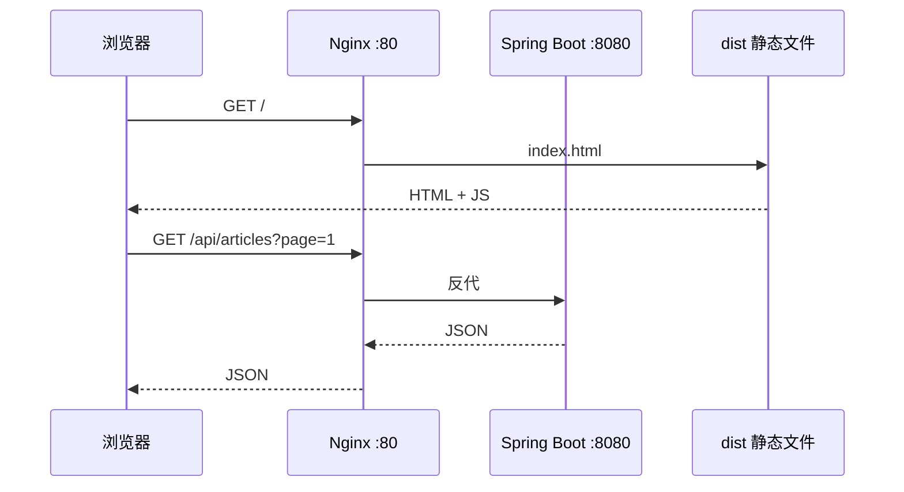
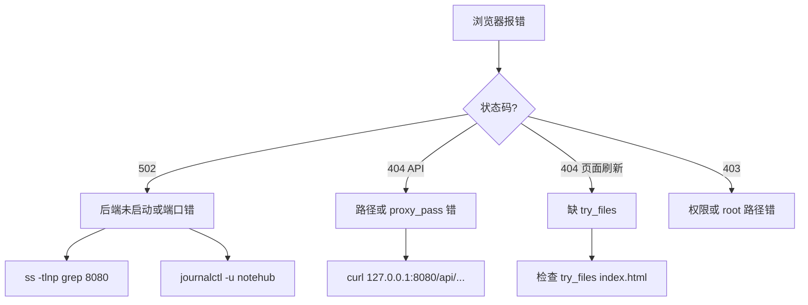

# Nginx 与 Web 服务部署

<!-- 修改说明: 2026-06-30 按 EXPANSION-STANDARD 扩充 §0、Nginx 配置步骤表、server 块逐行读、FAQ≥10、闭卷自测、费曼检验；环境假设 VMware Ubuntu + 云 ECS（见 todo.md） -->

> **文件编码**：UTF-8。本章在 **VMware Ubuntu 22.04/24.04** 与 **云服务器 ECS** 上演示 Nginx 安装、反向代理、静态资源托管与 HTTPS 预览。面向全栈：**Spring Boot jar :8080** + **Vue 3 dist**，与 [Java 09](../Java/09-LinuxDockerNginx部署基础.md)、[Vue 10](../../前端学习/Vue/10-Vite构建与项目部署.md) 直接衔接。

---

## 0. 读前导读（零基础也能跟上）

### 0.1 用一句话弄懂本章

**一句话**：**Nginx** 是网站的 **大门（80/443 端口）**——对外只开这一扇门：访问 `/` 给 Vue 的静态页，访问 `/api` 转发到本机 Spring Boot **8080**，用户 **同域访问、不用 CORS**。

**生活类比**：

| 概念 | 类比 |
|------|------|
| **Web 服务器** | 前台直接递菜单（静态 HTML/JS） |
| **反向代理** | 前台帮顾客 **转达** 后厨订单（/api→8080） |
| **try_files** | 找不到具体菜名就 **默认给总菜单**（index.html） |
| **gzip** | 把菜单 **压缩成小包** 再递给顾客 |
| **502** | 前台喊后厨 **没人应答**（后端挂了） |

**术语（Reverse Proxy）**：客户端只连 Nginx，Nginx 再连后端——与「正向代理」（翻墙客户端）方向相反。

**为什么重要**：[todo.md 第 5 周](../../todo.md) 部署核心；[Vue 10](../../前端学习/Vue/10-Vite构建与项目部署.md) 的 `dist` 必须有人托管；生产 **不应** 把 8080 暴露公网。

---

### 0.2 你需要提前知道什么

| 水平 | 建议 |
|------|------|
| 12 章 Docker | app 可在容器 `-p 8080:8080`，Nginx 仍反代 **127.0.0.1:8080** |
| 07 章 ufw | 放行 **80/443**，不要对公网开 8080 |
| Vue Router history | 必须 **try_files**，否则刷新 404 |
| 计网 04 HTTP | 理解 Host 头、状态码 502/404 |

---

### 0.3 本章知识地图（☐→☑）

- [ ] apt 安装 Nginx，`curl -I` 见 200
- [ ] 读懂 `sites-available` / `sites-enabled`
- [ ] 配置 `/` 托管 dist + `/api/` 反代 8080
- [ ] 理解 **proxy_pass 末尾有无 `/`** 的路径差异
- [ ] 配置 **try_files** 支持 Vue history
- [ ] 开启 gzip 并用 curl 验证 `Content-Encoding: gzip`
- [ ] 知道 Certbot HTTPS 基本流程
- [ ] 独立排查 502 与 SPA 404
- [ ] 闭卷自测 ≥ 8/10

---

### 0.4 建议学习时长

| 阶段 | 时间 |
|------|------|
| §1～§3 安装与 server | 1 h |
| §4～§5 反代 + 静态 | 1.5 h |
| §6～§8 gzip/HTTPS/排障 | 1 h |
| §9 手把手实操 | 1.5 h |
| 自测 | 30 min |

---

### 0.5 学完你能做什么

1. 在 VMware 用浏览器 **同域** 完成 notehub 登录（API 走 `/api`）。
2. 故意停 jar，在 **error.log** 里看到 `connection refused` 并解释 502。
3. 向面试官画：**Browser → Nginx:80 → Spring Boot:8080 → MySQL**。
4. 写 `.env.production` 里 `VITE_API_BASE=/api` 的原因（相对路径同域）。

---

## 本章与上一章的关系

[12 Docker 容器基础](12-Docker容器基础.md) 你已用 compose 把 MySQL、Redis、后端收进容器——但浏览器仍可能直接访问 `:8080`，中间件端口也暴露在外。**生产标准形态**是：**Nginx 监听 80/443**，对外只暴露 Web 端口；`/api` 反代到 Spring Boot，其余路径托管 Vue 打包后的 `dist`。

| 上一章（12） | 本章（13） | 下一章（14） |
|--------------|------------|--------------|
| 容器内 app :8080 | Nginx 反代 `/api` → localhost:8080 | 全栈端到端部署 |
| `docker compose logs` | `nginx -t` / `error.log` | systemd + scp 上线 |
| 多服务编排 | 统一入口 80 端口 | notehub-fullstack 实战 |

```mermaid
flowchart TB
    subgraph client [用户浏览器]
        U[访问 http://域名/]
    end
    subgraph server [Ubuntu 云服务器 / VMware]
        NG[Nginx :80 / :443]
        Static[/var/www/notehub/dist]
        App[Spring Boot :8080]
        NG -->|"/ 静态"| Static
        NG -->|"/api/* 反代"| App
    end
    U --> NG
    App --> MySQL[(MySQL)]
    App --> Redis[(Redis 可选)]
```

**与 Java 09 / Vue 10 的关系**：[Java 09](../Java/09-LinuxDockerNginx部署基础.md) 在业务路线里快速带过 Nginx 配置片段；[Vue 10](../../前端学习/Vue/10-Vite构建与项目部署.md) 讲 `npm run build` 产出 `dist`——**本章在 Linux 专项**里从安装、server block、try_files、gzip 到 502/404 排障系统练一遍，是 [todo.md 第 5 周部署](../../todo.md) 的核心环节。

---

## 1. Nginx 是什么、解决什么问题

**Nginx** 是高性能 **Web 服务器** + **反向代理** + **负载均衡器**。

| 角色 | 作用 | 全栈场景 |
|------|------|----------|
| Web 服务器 | 直接返回 HTML/CSS/JS | 托管 Vue `dist` |
| 反向代理 | 代表后端接收请求并转发 | `/api` → Spring Boot |
| 负载均衡 | 多实例分流 | 进阶：2 个 jar 实例 |

**深入解释**：用户只连 Nginx（80/443），**不知道**后端真实 IP 和端口——这叫「反向」代理（相对「正向代理」如科学上网客户端）。Nginx 用 **事件驱动 + 异步非阻塞**，单机可扛大量并发连接，适合放在 Spring Boot 前面做「门面」。

与开发环境对比：

| 环境 | 前端 | 后端 | 跨域 |
|------|------|------|------|
| Vite dev | `:5173` + proxy | `:8080` | proxy 解决 |
| 生产 Nginx | 同域 `/` | 同域 `/api` | **无需 CORS** |

---

## 2. 安装 Nginx（Ubuntu）

### 2.1 apt 安装

```bash
sudo apt update
sudo apt install -y nginx
sudo systemctl enable --now nginx
sudo systemctl status nginx
```

**命令预期输出**：

```
● nginx.service - A high performance web server and a reverse proxy server
     Loaded: loaded (/lib/systemd/system/nginx.service; enabled; ...)
     Active: active (running) since ...
```

```bash
curl -I http://127.0.0.1
# HTTP/1.1 200 OK
# Server: nginx/1.24.0 (Ubuntu)
# Content-Type: text/html
```

浏览器访问 VMware 桥接 IP 或云服务器公网 IP，应看到 **「Welcome to nginx!」** 默认页。

### 2.2 目录与配置文件结构

| 路径 | 说明 |
|------|------|
| `/etc/nginx/nginx.conf` | 主配置（一般少改） |
| `/etc/nginx/sites-available/` | 站点配置（可启用/禁用） |
| `/etc/nginx/sites-enabled/` | 已启用站点（软链） |
| `/etc/nginx/conf.d/*.conf` | 额外片段配置 |
| `/var/www/html/` | 默认静态根目录 |
| `/var/log/nginx/access.log` | 访问日志 |
| `/var/log/nginx/error.log` | 错误日志 |

**深入解释**：Ubuntu 习惯用 `sites-available` + `sites-enabled`；CentOS 习惯全放 `conf.d/`。本章以 Ubuntu 为准，与 [08 软件包管理](08-软件包管理与开发环境安装.md) 一致。

### 2.3 VMware 与云服务器差异

| 项 | VMware Ubuntu | 云 ECS |
|----|---------------|--------|
| 访问方式 | 桥接 IP / 端口转发 | 公网 IP + **安全组**放行 80/443 |
| 防火墙 | `ufw`（见 [07 章](07-网络命令与防火墙基础.md)） | 安全组 + ufw 双重检查 |
| 域名 | 可只用 IP | 建议绑定域名 + HTTPS |

---

## 3. server block 基础

### 3.1 最小 server 块

```nginx
server {
    listen 80;
    server_name _;   # 匹配任意 Host；有域名时写 notehub.example.com

    location / {
        root /var/www/html;
        index index.html;
    }
}
```

### 3.2 启用自定义站点

| 步骤 | 你的动作 | 预期看到什么 | 若不对 |
|------|----------|--------------|--------|
| 1 | `sudo nano /etc/nginx/sites-available/notehub` | 写入 server 块 | 语法见 §5.3 |
| 2 | `ln -sf` 到 sites-enabled | 软链创建 | 路径拼写错误 |
| 3 | （可选）删 default | 避免抢 80 默认站 | 仍见 Welcome→查 server_name |
| 4 | `sudo nginx -t` | syntax is ok / test is successful | 按行号改配置 |
| 5 | `sudo systemctl reload nginx` | 无 failed | 用 restart 仍失败→查 error.log |
| 6 | `curl -I http://127.0.0.1/` | 200 或 304 | 502→后端；403→权限 |

```bash
sudo nano /etc/nginx/sites-available/notehub
# 粘贴配置后：

sudo ln -sf /etc/nginx/sites-available/notehub /etc/nginx/sites-enabled/
sudo rm -f /etc/nginx/sites-enabled/default   # 可选：去掉默认站
sudo nginx -t
sudo systemctl reload nginx
```

**命令预期输出**：

```bash
sudo nginx -t
# nginx: the configuration file /etc/nginx/nginx.conf syntax is ok
# nginx: configuration file /etc/nginx/nginx.conf test is successful
```

**常见误区**：改配置后只 `reload` 不 `nginx -t`——语法错误会导致 reload 失败，旧配置仍生效或 Nginx 起不来。

---

## 4. 反向代理：/api → localhost:8080

### 4.1 与 Spring Boot 路径对齐

[todo.md](../../todo.md) 中 notehub-fullstack 接口前缀为 `/api`（如 `POST /api/auth/login`）。Nginx 应把 **以 `/api` 开头的请求** 转发到后端，且 **保留路径**：

```nginx
location /api/ {
    proxy_pass http://127.0.0.1:8080;
    proxy_set_header Host $host;
    proxy_set_header X-Real-IP $remote_addr;
    proxy_set_header X-Forwarded-For $proxy_add_x_forwarded_for;
    proxy_set_header X-Forwarded-Proto $scheme;
}
```

**深入解释：`proxy_pass` 末尾斜杠**

| 写法 | 请求 `/api/articles` 转发到 |
|------|------------------------------|
| `http://127.0.0.1:8080` | `http://127.0.0.1:8080/api/articles` ✅ |
| `http://127.0.0.1:8080/` | `http://127.0.0.1:8080/articles` ❌ 丢 `/api` |

Spring Boot 的 `server.servlet.context-path` 若设为 `/api`，则 jar 内路径可能是 `/articles`——此时 Nginx 要用带尾斜杠的 `proxy_pass` 并 `rewrite`，**默认全栈教程不设 context-path**，Controller 直接 `@RequestMapping("/api/...")`，用第一种写法即可。

### 4.2 验证后端已监听

```bash
ss -tlnp | grep 8080
# LISTEN 0 128 *:8080 *:* users:(("java",pid=xxxx,fd=xx))

curl -s http://127.0.0.1:8080/api/articles | head -c 200
# 预期：JSON 分页数据或 401/404 等业务响应，而非 Connection refused
```

---

## 5. 静态资源：托管 Vue dist + try_files

### 5.1 上传 dist

本地 Windows 构建后上传（见 [10 章 scp](10-SSH远程登录与文件传输.md)）：

```powershell
scp -r dist/* ubuntu@47.96.xxx.xxx:/var/www/notehub/dist/
```

服务器上：

```bash
sudo mkdir -p /var/www/notehub/dist
sudo chown -R www-data:www-data /var/www/notehub
```

### 5.2 SPA 路由：try_files

Vue Router **history 模式**下，用户刷新 `/articles/1` 时，Nginx 若只找物理文件会 **404**。需 fallback 到 `index.html`：

```nginx
location / {
    root /var/www/notehub/dist;
    index index.html;
    try_files $uri $uri/ /index.html;
}
```

**深入解释**：`try_files` 依次尝试 `$uri`（文件）、`$uri/`（目录）、最后内部重定向到 `/index.html`，由前端路由接管。

### 5.3 完整 server 块（全栈入门版）

```nginx
server {
    listen 80;
    server_name _;

    # 前端静态
    location / {
        root /var/www/notehub/dist;
        index index.html;
        try_files $uri $uri/ /index.html;
    }

    # 后端 API
    location /api/ {
        proxy_pass http://127.0.0.1:8080;
        proxy_set_header Host $host;
        proxy_set_header X-Real-IP $remote_addr;
        proxy_set_header X-Forwarded-For $proxy_add_x_forwarded_for;
        proxy_set_header X-Forwarded-Proto $scheme;
    }

    # 可选：禁止访问隐藏文件
    location ~ /\. {
        deny all;
    }
}
```

### 5.3.1 server 块逐行读

| 行/指令 | 含义 | 改错会怎样 |
|---------|------|------------|
| `listen 80;` | 监听 HTTP 80 | 改 8080 则浏览器要加端口 |
| `server_name _;` | 匹配任意 Host | 多域名时写具体域名 |
| `root .../dist;` | 静态文件根目录 | 路径错→403/404 |
| `try_files $uri $uri/ /index.html;` | SPA fallback | 省略→刷新子路由 404 |
| `location /api/` | 前缀匹配 API | 写成 `/api` 可能匹配差异 |
| `proxy_pass http://127.0.0.1:8080;` | **无尾斜杠**，保留 `/api` 前缀 | 加尾斜杠→丢 `/api` |
| `proxy_set_header Host $host;` | 后端知道原始 Host | 省略可能影响部分框架 |
| `X-Real-IP` / `X-Forwarded-For` | 传递客户端 IP | 日志与限流需要 |
| `X-Forwarded-Proto $scheme` | 告知 http/https | HTTPS 终止在 Nginx 时后端需知 |
| `location ~ /\.` | 禁止访问 `.git` 等 | 安全加固 |



---

## 6. gzip 压缩

启用 gzip 可显著减小 JS/CSS 传输体积：

```nginx
# 可放在 http {} 块（nginx.conf）或 server {} 内
gzip on;
gzip_vary on;
gzip_min_length 1024;
gzip_types text/plain text/css application/json application/javascript text/xml application/xml;
gzip_comp_level 5;
```

验证：

```bash
curl -H "Accept-Encoding: gzip" -I http://127.0.0.1/assets/index-xxxxx.js
# 预期含：Content-Encoding: gzip
```

**注意**：图片（jpg/png/webp）一般不再 gzip；已压缩格式重复压收益低。

---

## 7. SSL / HTTPS 预览（Certbot）

生产环境应使用 **HTTPS**。入门流程（需已解析到服务器的域名）：

```bash
sudo apt install -y certbot python3-certbot-nginx
sudo certbot --nginx -d notehub.example.com
```

Certbot 会：

1. 向 Let's Encrypt 申请证书
2. 自动修改 Nginx 配置增加 `listen 443 ssl`
3. 配置 HTTP → HTTPS 跳转（可选）

**命令预期输出（节选）**：

```
Successfully received certificate.
Deploying certificate...
Congratulations! You have successfully enabled HTTPS on https://notehub.example.com
```

证书续期：

```bash
sudo certbot renew --dry-run
# 预期：Congratulations, all simulated renewals succeeded
```

**VMware 练习**：无公网域名时可跳过 Certbot，仅理解流程；云服务器 + 免费域名（或学生机子域名）再实操。

**深入解释**：HTTPS 在传输层加密，防窃听与中间人攻击；JWT 等敏感头在 HTTP 明文下可被嗅探——简历项目上线务必 HTTPS 或至少内网演示说明「生产会配 SSL」。

---

## 8. 502 / 404 排查思路



| 现象 | 优先检查 |
|------|----------|
| 502 Bad Gateway | jar 是否运行；`proxy_pass` 地址；SELinux（CentOS） |
| 404 仅 API | Spring 路径是否 `/api` 前缀；Nginx location 是否匹配 |
| 404 刷新子路由 | `try_files` 是否配置 |
| 空白页 | dist 是否上传完整；浏览器 Console 404 静态资源 |
| CORS 仍报错 | 生产应同域；若仍跨域检查是否误访问 :8080 |

配合 [11 日志分析](11-日志分析与故障排查.md)：

```bash
sudo tail -f /var/log/nginx/error.log
# 502 常见：connect() failed (111: Connection refused) while connecting to upstream
```

---

## 9. 手把手实操：VMware 从零配通 Nginx 全栈

### 步骤 1：环境准备

- VMware Ubuntu 桥接模式，IP 如 `192.168.1.105`
- Spring Boot 本地已 `mvn package`，jar 在服务器 `/opt/notehub/app.jar` 运行（可先 `java -jar` 前台测）
- Vue 项目 `npm run build` 得到 `dist/`

### 步骤 2：安装并停默认站

```bash
sudo apt update && sudo apt install -y nginx
sudo systemctl enable --now nginx
curl -I http://127.0.0.1
```

### 步骤 3：部署 dist

```bash
sudo mkdir -p /var/www/notehub/dist
# 本机 scp 上传后：
sudo chown -R www-data:www-data /var/www/notehub
ls /var/www/notehub/dist/index.html
# 预期：文件存在
```

### 步骤 4：启动后端

```bash
java -jar /opt/notehub/app.jar &
curl -s http://127.0.0.1:8080/api/articles | head
```

### 步骤 5：写入 Nginx 配置

```bash
sudo nano /etc/nginx/sites-available/notehub
# 粘贴 §5.3 完整 server 块

sudo ln -sf /etc/nginx/sites-available/notehub /etc/nginx/sites-enabled/
sudo rm -f /etc/nginx/sites-enabled/default
sudo nginx -t && sudo systemctl reload nginx
```

### 步骤 6：防火墙（若启用 ufw）

```bash
sudo ufw allow 80/tcp
sudo ufw status
```

### 步骤 7：验收

Windows 浏览器访问 `http://192.168.1.105/` → 看到登录页；F12 Network 里 API 为 `http://192.168.1.105/api/...` 且 200。

---

## 10. 常见报错与排查

| 报错信息（关键词） | 可能原因 | 解决方案 |
|-------------------|---------|---------|
| `502 Bad Gateway` | 后端未启动 / 端口错误 | `ss -tlnp \| grep 8080`；启动 jar；查 `error.log` |
| `connect() failed (111: Connection refused)` | 同上 | 确认 `proxy_pass` 与 Spring 端口一致 |
| `404 Not Found`（API） | location 不匹配或路径被 rewrite 掉 | `curl` 直连 8080；检查 `proxy_pass` 有无多余 `/` |
| `404`（刷新 Vue 子路由） | 缺少 `try_files` | 加 `try_files $uri $uri/ /index.html` |
| `403 Forbidden` | root 目录权限 | `chown www-data`；目录需 `x` 权限 |
| `nginx: [emerg] bind() to 0.0.0.0:80 failed` | 80 被占用 | `ss -tlnp \| grep :80`；停冲突服务 |
| `nginx: configuration file test failed` | 配置语法错误 | 按提示行号改；常见少分号、括号不配对 |
| 静态资源 404（/assets/xxx.js） | dist 未传全或 base 路径错 | 检查 Vite `base: '/'`；重新 scp |
| 页面能开 API 跨域失败 | 浏览器直连 :8080 | 统一走 Nginx 同域 `/api` |
| Certbot 验证失败 | 域名未解析 / 80 未放行 | 检查 DNS A 记录；安全组 + ufw |
| `413 Request Entity Too Large` | 上传文件超限 | `client_max_body_size 20m;` |
| 修改配置不生效 | 未 reload | `sudo nginx -t && sudo systemctl reload nginx` |

---

## 11. 深入解释：Nginx 与 Spring Boot 职责边界

| 层 | 负责 | 不负责 |
|----|------|--------|
| Nginx | TLS 终结、静态文件、gzip、限流、反代 | 业务逻辑、JWT 校验 |
| Spring Boot | REST、鉴权、事务、数据库 | 直接暴露给公网（应避免） |
| Vue dist | 页面交互 | 生产环境 dev server |

**为何生产不用 Vite preview？** `vite preview` 适合本地验证 build，无完整反向代理、无 systemd、无日志轮转——仅作 smoke test。

与 [12 章 Docker](12-Docker容器基础.md) 结合：可将 Nginx 也容器化，或 Nginx 在宿主机、app 在容器 `-p 8080:8080`——**VMware 入门建议 Nginx 直装宿主机**，排障路径更短。

---

## 12. 练习建议

### 基础

1. 安装 Nginx，访问默认欢迎页并 `curl -I` 看响应头。
2. 写一个仅返回静态 HTML 的 server block，替换默认页。
3. 后端只跑 `/hello`，配置 `/api/` 反代并用 curl 验证。

### 进阶

4. 部署真实 Vue `dist` + Spring Boot，浏览器完成登录流程。
5. 开启 gzip，对比 Network 里 JS 资源大小（Disable cache 下看 transferred）。
6. 故意停 jar，观察 502 与 `error.log` 对应关系。

### 挑战

7. 配置两个 `location`：`/api/` 与 `/uploads/`（本地文件存储静态映射）。
8. 在云服务器配 Certbot HTTPS，HTTP 自动跳转 HTTPS。
9. 阅读 [Java 09 §负载均衡](../Java/09-LinuxDockerNginx部署基础.md)，写 `upstream` 双实例（需两个 jar 不同端口）。

---

## 13. 练习参考答案

### 基础 3

```nginx
location /api/ {
    proxy_pass http://127.0.0.1:8080;
}
```

```bash
curl http://127.0.0.1/api/hello
# 经 Nginx 反代到 Spring Boot
```

### 进阶 4：Vite 生产环境变量

构建前 `.env.production`：

```env
VITE_API_BASE=/api
```

Axios `baseURL` 使用相对路径 `/api`，避免写死 `http://ip:8080`。

### 挑战 7：uploads 映射

```nginx
location /uploads/ {
    alias /opt/notehub/uploads/;
}
```

Spring Boot 保存文件到 `/opt/notehub/uploads/`，返回 URL `/uploads/xxx.jpg`。

---

## 14. 命令速查

| 命令 | 用途 |
|------|------|
| `sudo nginx -t` | 检查配置语法 |
| `sudo systemctl reload nginx` | 热加载配置 |
| `sudo systemctl restart nginx` | 完全重启 |
| `tail -f /var/log/nginx/error.log` | 实时错误日志 |
| `tail -f /var/log/nginx/access.log` | 访问日志 |
| `ss -tlnp \| grep :80` | 谁占用 80 |
| `curl -I http://127.0.0.1/api/...` | 测反代 |

---

## 15. 学完标准

- [ ] 在 Ubuntu 安装 Nginx 并用 `nginx -t` 验证配置
- [ ] 能写 server block：`/` 托管 dist + `/api/` 反代 8080
- [ ] 理解 `try_files` 对 Vue history 路由的作用
- [ ] 能独立排查 502（后端挂）与 SPA 404（缺 try_files）
- [ ] 知道 gzip 基本配置与 Certbot 申请 HTTPS 的流程
- [ ] 与 [Vue 10](../../前端学习/Vue/10-Vite构建与项目部署.md) 联调：同域访问、无 CORS
- [ ] 对照 [Java 09](../Java/09-LinuxDockerNginx部署基础.md) 说清 Nginx 在架构中的位置

---

## 16. 常见问题 FAQ

**Q1：Nginx 和 Spring Boot 都能「提供 HTTP」，区别？**  
Nginx 擅 **静态文件 + 高并发连接 + 反代**；Spring Boot 擅 **业务 API**。生产分工：Nginx 门面，Boot 内网。

**Q2：开发用 Vite proxy，生产用什么？**  
生产用 **Nginx 同域反代** 替代 proxy；Axios `baseURL='/api'`。

**Q3：`proxy_pass` 末尾 `/` 到底加不加？**  
notehub 接口是 `/api/...` 且 Spring **无 context-path 剥离** → 用 `http://127.0.0.1:8080` **不加** 尾斜杠（见 §4.1 表）。

**Q4：502 和 504？**  
502：连不上 upstream（后端挂、端口错）；504：upstream **超时**（调 `proxy_read_timeout` 或查慢 SQL）。

**Q5：dist 更新了浏览器还是旧页？**  
强刷 Ctrl+F5；查 Nginx 是否缓存；Vite 构建带 hash 的 assets 一般无此问题。

**Q6：为什么要 `chown www-data`？**  
Nginx worker 常以 `www-data` 运行；目录无读权限 → 403。

**Q7：能否 Nginx 也放 Docker？**  
可以（14 章 compose）；**入门建议宿主机 Nginx**，`nginx -t` 与 error.log 路径更直观。

**Q8：Certbot 必须有域名吗？**  
Let's Encrypt 要 **公网域名解析**；VMware 纯 IP 练习可跳过，理解流程即可。

**Q9：HTTP 和 HTTPS 要两套 server 吗？**  
Certbot 常自动加 `listen 443 ssl` 和 80→443 跳转；手配时写两个 server 或 `if` 跳转（推荐 Certbot）。

**Q10：上传文件 413？**  
加 `client_max_body_size 20m;`（14 章 notehub 配置已有）。

**Q11：只访问 IP 没有域名怎么配 `server_name`？**  
用 `_` 或 `default_server`；简历 demo 用公网 IP 即可。

**Q12：Nginx 和 [07 ufw](07-网络命令与防火墙基础.md) 关系？**  
Nginx 监听 80；ufw 需 `allow 80/tcp`；云服务器还要 **安全组** 放行。

---

## 17. 闭卷自测

### 概念题（6 道）

1. 正向代理与反向代理各举一例。
2. 生产为何不把 Spring Boot 8080 直接暴露公网？
3. `try_files` 三个参数分别尝试什么？
4. Vite dev 的 proxy 与 Nginx 反代各解决什么问题？
5. 502 在 error.log 里常见英文关键词？
6. gzip 对图片 jpg 一般为何不开？

### 动手题（2 道）

7. 写 `nginx -t` 与 reload 的两条命令（一条组合）。
8. 写 `location /api/` + `proxy_pass` 正确一行（保留 /api 前缀）。

### 综合题（2 道）

9. 用户刷新 `/articles/1` 返回 Nginx 404，列出 2 个配置检查点。
10. 口述 Browser 访问 `POST /api/auth/login` 经过 Nginx 到 Spring Boot 的路径。

### 自测参考答案

1. 正向：VPN/科学上网客户端；反向：Nginx→8080。
2. 隐藏内网结构、统一 TLS、静态分离、限流；减少攻击面。
3. `$uri` 文件→`$uri/` 目录→fallback `/index.html`。
4. proxy 解决 **开发跨域**；Nginx 解决 **生产同域**。
5. `connect() failed (111: Connection refused) while connecting to upstream`。
6. 已压缩格式再压收益低、浪费 CPU。
7. `sudo nginx -t && sudo systemctl reload nginx`
8. `proxy_pass http://127.0.0.1:8080;`（location 已是 `/api/`）
9. 是否 `try_files ... /index.html`；root 是否指向 dist；是否误配成静态找 `/articles/1` 文件。
10. Browser→Nginx:80 `/api/auth/login`→反代→127.0.0.1:8080 同路径→Spring Controller。

---

## 18. 费曼检验

**任务**：3 分钟说明「为什么 notehub 生产要把 Vue dist 和 Spring Boot 都挂在 Nginx 后面，而不是浏览器直连 8080」。

**对照提纲**：

1. **同域**：`/api` 与 `/` 同主机，**无 CORS**。
2. **安全**：公网只开 80/443，8080 不暴露。
3. **职责**：Nginx 管静态+gzip+HTTPS；Spring Boot 专注业务。

---

## 下一章预告

13 章 Nginx 把 **入口** 配好了——下一章 [14-全栈项目 Linux 部署实战](14-全栈项目Linux部署实战.md) 从 **零到上线** 串一遍：[todo.md](../../todo.md) 里的 **notehub-fullstack**（JWT + 文章 CRUD + Vue3），包括 JDK/MySQL/Redis 安装、`scp` 上传 jar 与 dist、**systemd** 守护后端、完整 Nginx 配置、**docker-compose 备选方案**、防火墙放行 80 与验收清单。届时 [Java 10](../Java/10-后端项目实战与面试准备.md) 的项目讲解与公网演示 URL 将真正闭环。

---

*上一章：[12-Docker容器基础](12-Docker容器基础.md) · 相关：[Java 09](../Java/09-LinuxDockerNginx部署基础.md) · [Vue 10](../../前端学习/Vue/10-Vite构建与项目部署.md)*

*本章已按 EXPANSION-STANDARD 扩充（§0+配置步骤表+server 逐行读+FAQ+自测+费曼）。*

**EXPANSION-STANDARD 自检**：☑ §0 ☑ 步骤表 §3.2 ☑ 逐行读 §5.3.1 ☑ FAQ≥10 ☑ 闭卷 10 题 ☑ 费曼 ☑ VMware/ECS
