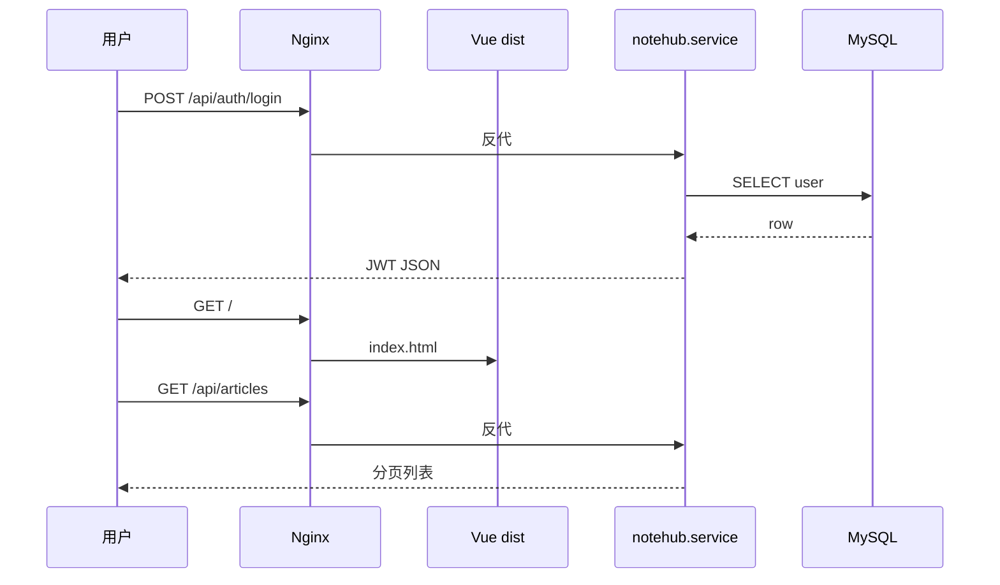
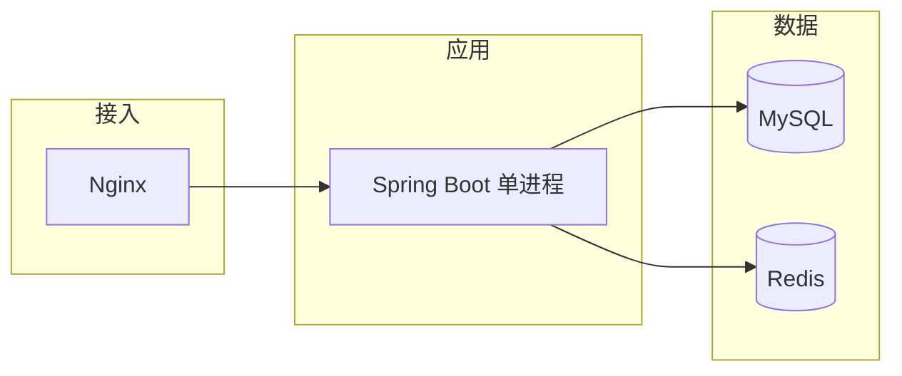

# 全栈项目 Linux 部署实战

<!-- 修改说明: 2026-06-30 按 EXPANSION-STANDARD 扩充 §0、部署步骤表、systemd 逐行读、FAQ≥10、闭卷自测、费曼检验；主线 notehub-fullstack（见 todo.md） -->

> **文件编码**：UTF-8。本章以 [todo.md](../../todo.md) 推荐的 **notehub-fullstack**（个人笔记/博客全栈）为主线，在 **Ubuntu 22.04/24.04**（VMware 练手 → 云 ECS 上线）完成 **Spring Boot 3 + MyBatis-Plus + MySQL 8 + Redis（可选）+ Vue 3 dist + Nginx** 端到端部署。

---

## 0. 读前导读（零基础也能跟上）

### 0.1 用一句话弄懂本章

**一句话**：把你在 Windows 写好的 **notehub 后端 jar + 前端 dist**，通过 **scp 上传到 Ubuntu**，用 **MySQL 存数据、systemd 守护 jar、Nginx 统一 80 入口**，让浏览器 **一个 URL** 完成注册登录发文——这是 **可写进简历的完整上线**。

**生活类比**：

| 步骤 | 类比 |
|------|------|
| `mvn package` / `npm run build` | 中央厨房做好菜和菜单 |
| `scp` 上传 | 冷链物流送到分店 |
| MySQL + schema.sql | 分店仓库按清单进货 |
| `notehub.service` | 定时器 **自动开火**，断电重启仍营业 |
| Nginx | 分店 **唯一大门** |
| ufw + 安全组 | 保安只放行顾客通道，库房后门不对街 |

**为什么重要**：[todo.md 第 5 周](../../todo.md) 核心交付；[Java 10](../Java/10-后端项目实战与面试准备.md) 项目讲解要有 **真实 URL**；面试必问「你怎么部署的」。

---

### 0.2 你需要提前知道什么

| 章节 | 本章会用到 |
|------|------------|
| 08 | apt 装 JDK/MySQL/Redis/Nginx |
| 09 | deploy.sh 发布脚本 |
| 10 | ssh/scp 上传 |
| 11 | journalctl、502、磁盘满排障 |
| 12 | §9 compose 备选（可选） |
| 13 | Nginx 完整 server 块 |
| Java 10 / Vue 10 | 项目能本地跑通 |

**真不会请先**：13 章 Nginx 配通 → 再回本章全流程。

---

### 0.3 本章知识地图（☐→☑）

- [ ] 目录规划 `/opt/notehub` + `/var/www/notehub/dist`
- [ ] MySQL 建库导入 schema，`notehub` 用户权限正确
- [ ] `application-prod.yml` 敏感项 **不入 Git**
- [ ] systemd `notehub.service` enable 开机自启
- [ ] Nginx `/` + `/api/` 同域验收
- [ ] ufw + 安全组 **不对公网开 8080/3306**
- [ ] 验收清单 **≥ 12/15**
- [ ] （可选）compose 方案对比 systemd
- [ ] 闭卷自测 ≥ 8/10

---

### 0.4 建议学习时长

| 阶段 | 时间 |
|------|------|
| VMware 第一遍 §3～§7 | 4～6 h（可拆 2 天） |
| 云 ECS 第二遍 §14 | 3～4 h |
| deploy.sh + 验收 | 2 h |
| 自测 + 录屏 | 1 h |

---

### 0.5 学完你能做什么

1. 简历写：**notehub | Vue3 + Spring Boot | Nginx 反代 + JWT + MySQL**，并给出 demo URL。
2. 15 分钟内 **口述** §7 部署全链路（对照 [15 章 §7](15-面试专题与知识点总表.md)）。
3. 模拟发布：替换 jar → smoke test → 失败 **回滚** `app.jar.bak`。
4. 向面试官讲一个 **STAR 踩坑**（502/JDBC/MySQL 未自启）。

---

## 本章与上一章的关系

[13 Nginx 与 Web 服务部署](13-Nginx与Web服务部署.md) 你已会安装 Nginx、写 server block、反代 `/api`、托管 `dist`、处理 502/404。本章把这些**散点**与 [10 SSH](10-SSH远程登录与文件传输.md)、[08 软件包管理](08-软件包管理与开发环境安装.md)、[06 systemd](06-进程与服务管理.md) **串成一条可写进简历的上线流水线**。

| 章节 | 你已有的能力 | 本章新增 |
|------|--------------|----------|
| 10 SSH | scp 传 jar | 目录规范、权限、发布脚本 |
| 08 apt | 装 JDK/MySQL | 生产向配置与初始化 SQL |
| 13 Nginx | 反代 + 静态 | 与 notehub 路径完全对齐的配置 |
| 12 Docker | compose 备选 | 与 systemd 方案二选一 |
| Java 10 | 项目架构 | **真实公网/demo URL** |

```mermaid
flowchart TB
    subgraph dev [Windows 开发机]
        IDEA[IDEA Spring Boot]
        Vite[Vue npm run build]
        Git[git push]
    end
    subgraph ops [发布]
        MVN[mvn package]
        SCP[scp jar + dist]
    end
    subgraph cloud [Ubuntu 云服务器 / VMware]
        SYS[systemd notehub.service]
        JAR[app.jar :8080]
        NG[Nginx :80]
        DB[(MySQL notehub_db)]
        RD[(Redis 可选)]
        WEB[/var/www/notehub/dist]
    end
    IDEA --> MVN
    Vite --> SCP
    MVN --> SCP
    SCP --> JAR
    SCP --> WEB
    SYS --> JAR
    NG --> WEB
    NG -->|/api| JAR
    JAR --> DB
    JAR --> RD
    Git -.-> dev
```

**交叉引用**：

- 业务与接口设计：[todo.md §6～8](../../todo.md)、[Java 10](../Java/10-后端项目实战与面试准备.md)
- 前端构建：[Vue 10](../../前端学习/Vue/10-Vite构建与项目部署.md)
- 部署概念速览：[Java 09](../Java/09-LinuxDockerNginx部署基础.md)

---

## 1. 项目与部署目标

### 1.1 notehub-fullstack 功能清单（最小可演示）

| 模块 | 技术 | 部署相关要点 |
|------|------|--------------|
| 用户注册登录 | JWT + BCrypt | 生产 `application-prod.yml` 密钥不入 Git |
| 文章 CRUD + 分页 | MyBatis-Plus | MySQL 建表脚本随仓库 |
| 前端页面 | Vue3 + Element Plus | `dist` 由 Nginx 托管 |
| 可选 Redis | 列表缓存 | 本机 Redis 或 docker |

### 1.2 部署完成标准（对齐 todo 第 5 周）

- [ ] 浏览器通过 **单一入口**（`http://IP/` 或域名）完成注册→登录→发文
- [ ] 后端由 **systemd** 守护，重启服务器后自动恢复
- [ ] MySQL 数据持久化，非临时容器无 volume
- [ ] README 含架构图、环境版本、启动与回滚步骤
- [ ] 云服务器 **安全组 + ufw** 仅暴露必要端口（80/443/22）

---

## 2. 服务器选型与环境规划

### 2.1 VMware 练手 vs 云 ECS 上线

| 阶段 | 环境 | 目的 |
|------|------|------|
| 第 1 遍 | VMware Ubuntu 桥接 | 不怕搞坏，反复练 systemd/nginx |
| 第 2 遍 | 阿里云/腾讯云学生机 | 简历 URL、HTTPS、安全组 |

**推荐规格**：1 核 2G 起步（仅 demo）；MySQL + Java + Nginx 同时跑建议 **2 核 4G**。

### 2.2 目录规划（统一约定）

```text
/opt/notehub/
├── app.jar                 # 后端 fat jar
├── application-prod.yml    # 生产配置（敏感项仅服务器）
├── logs/                   # 应用日志（可选）
└── uploads/                # 上传文件（若做了图片功能）

/var/www/notehub/dist/      # Vue 构建产物

/etc/systemd/system/notehub.service
/etc/nginx/sites-available/notehub
```

**深入解释**：应用与静态资源分离——升级前端只替换 `dist`，升级后端只替换 jar 并 `systemctl restart`，降低发布风险。

---

## 3. 手把手实操 A：全新 Ubuntu 基础环境

以下在 **root 或 sudo 用户** 下执行；云服务器首次登录见 [10 章](10-SSH远程登录与文件传输.md)。

| 步骤 | 你的动作 | 预期看到什么 | 若不对 |
|------|----------|--------------|--------|
| 1 | apt update/upgrade + 常用工具 | 无 `E:` 错误 | 换源见 08 章 |
| 2 | 装 OpenJDK 17 | `openjdk version "17.x"` | `java not found`→PATH |
| 3 | 装 mysql-server + secure | active (running) | 密码忘→recovery |
| 4 | 建库 `notehub_db` + 用户 GRANT | `SHOW TABLES` 有 user/article | 1045→密码/权限 |
| 5 | （可选）Redis ping PONG | PONG | 未装则 yml 关 redis |
| 6 | 装 Nginx curl -I | HTTP/1.1 200 OK | 80 占用→ss 查 |

### 步骤 1：系统更新与常用工具

```bash
sudo apt update && sudo apt upgrade -y
sudo apt install -y curl wget vim git unzip
```

### 步骤 2：安装 JDK 17

```bash
sudo apt install -y openjdk-17-jdk
java -version
```

**命令预期输出**：

```
openjdk version "17.0.x" ...
OpenJDK Runtime Environment ...
```

与 [Java 04](../Java/04-SpringBoot核心开发.md) Spring Boot 3 要求一致。

### 步骤 3：安装 MySQL 8

```bash
sudo apt install -y mysql-server
sudo systemctl enable --now mysql
sudo mysql_secure_installation
# 按提示设 root 密码、禁用远程 root 等
```

创建业务库与用户：

```sql
sudo mysql -u root -p
```

```sql
CREATE DATABASE notehub_db CHARACTER SET utf8mb4 COLLATE utf8mb4_unicode_ci;
CREATE USER 'notehub'@'localhost' IDENTIFIED BY '你的强密码';
GRANT ALL PRIVileges ON notehub_db.* TO 'notehub'@'localhost';
FLUSH PRIVILEGES;
```

导入建表脚本（仓库 `schema.sql`）：

```bash
mysql -u notehub -p notehub_db < schema.sql
mysql -u notehub -p notehub_db -e "SHOW TABLES;"
# 预期：user, article 等表
```

### 步骤 4：安装 Redis（可选）

```bash
sudo apt install -y redis-server
sudo systemctl enable --now redis-server
redis-cli ping
# PONG
```

### 步骤 5：安装 Nginx

```bash
sudo apt install -y nginx
sudo systemctl enable --now nginx
curl -I http://127.0.0.1
# HTTP/1.1 200 OK
```

---

## 4. 后端配置与 jar 部署

### 4.1 application-prod.yml 示例

```yaml
server:
  port: 8080
  address: 0.0.0.0

spring:
  datasource:
    url: jdbc:mysql://127.0.0.1:3306/notehub_db?useUnicode=true&characterEncoding=utf8&serverTimezone=Asia/Shanghai
    username: notehub
    password: ${DB_PASSWORD}
  data:
    redis:
      host: 127.0.0.1
      port: 6379

jwt:
  secret: ${JWT_SECRET}
  expiration-ms: 86400000

logging:
  file:
    name: /opt/notehub/logs/app.log
```

服务器上：

```bash
sudo mkdir -p /opt/notehub/logs
sudo nano /opt/notehub/application-prod.yml
# 勿将含真实密码的文件 commit 到 Git
```

### 4.2 本地打包与上传

Windows 开发机：

```powershell
cd notehub-api
mvn -q clean package -DskipTests
scp target/notehub-0.0.1-SNAPSHOT.jar ubuntu@47.96.xxx.xxx:/opt/notehub/app.jar
scp src/main/resources/schema.sql ubuntu@47.96.xxx.xxx:~/
```

### 4.3 前台 smoke test

```bash
cd /opt/notehub
export DB_PASSWORD='你的密码'
export JWT_SECRET='至少32字符的随机串'
java -jar app.jar --spring.profiles.active=prod --spring.config.additional-location=file:./application-prod.yml
```

另开 SSH 会话：

```bash
curl -s http://127.0.0.1:8080/api/articles
# 预期 JSON；或空列表 {"data":{"records":[]},...}
```

Ctrl+C 停前台进程，进入 systemd。

---

## 5. systemd 守护 Spring Boot

### 5.1 编写 unit 文件

```bash
sudo nano /etc/systemd/system/notehub.service
```

```ini
[Unit]
Description=NoteHub Spring Boot API
After=network.target mysql.service redis.service
Wants=mysql.service

[Service]
Type=simple
User=ubuntu
WorkingDirectory=/opt/notehub
Environment="DB_PASSWORD=你的密码"
Environment="JWT_SECRET=你的JWT密钥"
ExecStart=/usr/bin/java -jar /opt/notehub/app.jar --spring.profiles.active=prod --spring.config.additional-location=file:/opt/notehub/application-prod.yml
Restart=on-failure
RestartSec=5
StandardOutput=journal
StandardError=journal

[Install]
WantedBy=multi-user.target
```

### 5.1.1 systemd unit 逐行读

| 行 | 含义 | 改错会怎样 |
|----|------|------------|
| `After=network.target mysql.service` | 网络与 MySQL 后再启 | MySQL 慢→JDBC 失败，可加重试 |
| `User=ubuntu` | 非 root 跑 jar | root 跑有安全风险 |
| `WorkingDirectory=/opt/notehub` | 相对路径基准 | 日志相对路径错 |
| `Environment=DB_PASSWORD=...` | 注入密钥 | 更推荐 EnvironmentFile 600 权限 |
| `ExecStart=... java -jar ...` | 启动命令 | jar 路径错→FAILURE |
| `Restart=on-failure` | 异常退出重启 | 配置错会 **反复重启** |
| `StandardOutput=journal` | 日志进 journalctl | 与 logging.file 并存 |
| `WantedBy=multi-user.target` | 多用户模式自启 | enable 后 reboot 验证 |

**深入解释**：

- `After=mysql.service` 减少 MySQL 未就绪时 JDBC 失败（仍建议应用内重试或 healthcheck）。
- 密码也可放 `/opt/notehub/env` + `EnvironmentFile=`，权限 `chmod 600`。
- `Restart=on-failure`：异常退出自动拉起，适合 demo 与小规模生产。

### 5.2 启用与验证

```bash
sudo systemctl daemon-reload
sudo systemctl enable --now notehub
sudo systemctl status notehub
```

**命令预期输出**：

```
● notehub.service - NoteHub Spring Boot API
     Active: active (running) ...
```

```bash
journalctl -u notehub -n 50 --no-pager
# 预期：Started NoteHubApplication, Tomcat started on port 8080
```

---

## 6. 前端 dist 部署

### 6.1 本地构建

```powershell
cd notehub-web
# .env.production
# VITE_API_BASE=/api
npm run build
scp -r dist/* ubuntu@47.96.xxx.xxx:/tmp/dist-upload/
```

服务器：

```bash
sudo mkdir -p /var/www/notehub/dist
sudo cp -r /tmp/dist-upload/* /var/www/notehub/dist/
sudo chown -R www-data:www-data /var/www/notehub
ls /var/www/notehub/dist/index.html
```

详见 [Vue 10 §Nginx 托管](../../前端学习/Vue/10-Vite构建与项目部署.md)。

---

## 7. Nginx 完整配置（notehub 版）

```bash
sudo nano /etc/nginx/sites-available/notehub
```

```nginx
server {
    listen 80;
    server_name _;   # 有域名则写 notehub.example.com

    client_max_body_size 20m;

    access_log /var/log/nginx/notehub.access.log;
    error_log  /var/log/nginx/notehub.error.log;

    location / {
        root /var/www/notehub/dist;
        index index.html;
        try_files $uri $uri/ /index.html;
    }

    location /api/ {
        proxy_pass http://127.0.0.1:8080;
        proxy_http_version 1.1;
        proxy_set_header Host $host;
        proxy_set_header X-Real-IP $remote_addr;
        proxy_set_header X-Forwarded-For $proxy_add_x_forwarded_for;
        proxy_set_header X-Forwarded-Proto $scheme;
        proxy_connect_timeout 60s;
        proxy_read_timeout 60s;
    }

    location /uploads/ {
        alias /opt/notehub/uploads/;
    }
}
```

```bash
sudo ln -sf /etc/nginx/sites-available/notehub /etc/nginx/sites-enabled/
sudo rm -f /etc/nginx/sites-enabled/default
sudo nginx -t && sudo systemctl reload nginx
```



---

## 8. 防火墙与安全组

### 8.1 ufw（Ubuntu）

```bash
sudo ufw allow OpenSSH
sudo ufw allow 80/tcp
sudo ufw allow 443/tcp
sudo ufw enable
sudo ufw status numbered
```

**原则**：**不要**对公网开放 3306、6379、8080；MySQL/Redis 仅 localhost。

### 8.2 云厂商安全组

| 端口 | 来源 | 用途 |
|------|------|------|
| 22 | 你的 IP / 0.0.0.0（练习机可放宽） | SSH |
| 80 | 0.0.0.0/0 | HTTP |
| 443 | 0.0.0.0/0 | HTTPS |
| 8080 | **不开放** | 仅本机 Nginx 反代 |

与 [07 网络与防火墙](07-网络命令与防火墙基础.md) 一致：多层防护，安全组与 ufw 都要查。

---

## 9. 方案 B：docker-compose 备选

适合「环境一致性」或快速重建；与 systemd 方案 **二选一** 即可写简历。

### 9.1 目录结构

```text
/opt/notehub-compose/
├── docker-compose.yml
├── nginx/
│   └── notehub.conf
├── mysql/init/schema.sql
└── app.jar 或 Dockerfile
```

### 9.2 compose 示例（精简）

```yaml
services:
  mysql:
    image: mysql:8.0
    environment:
      MYSQL_ROOT_PASSWORD: rootpass
      MYSQL_DATABASE: notehub_db
      MYSQL_USER: notehub
      MYSQL_PASSWORD: notepass
    volumes:
      - mysql_data:/var/lib/mysql
      - ./mysql/init:/docker-entrypoint-initdb.d
    healthcheck:
      test: ["CMD", "mysqladmin", "ping", "-h", "localhost"]
      interval: 5s
      timeout: 5s
      retries: 10

  redis:
    image: redis:7
    ports: []   # 不映射到宿主机公网

  app:
    image: eclipse-temurin:17-jre-jammy
    working_dir: /app
    volumes:
      - ./app.jar:/app/app.jar:ro
    command: ["java", "-jar", "app.jar", "--spring.profiles.active=prod"]
    environment:
      SPRING_DATASOURCE_URL: jdbc:mysql://mysql:3306/notehub_db?...
      SPRING_DATASOURCE_USERNAME: notehub
      SPRING_DATASOURCE_PASSWORD: notepass
      SPRING_DATA_REDIS_HOST: redis
    depends_on:
      mysql:
        condition: service_healthy
    ports:
      - "127.0.0.1:8080:8080"

  nginx:
    image: nginx:1.25
    ports:
      - "80:80"
    volumes:
      - ./nginx/notehub.conf:/etc/nginx/conf.d/default.conf:ro
      - /var/www/notehub/dist:/usr/share/nginx/html:ro
    depends_on:
      - app

volumes:
  mysql_data:
```

```bash
cd /opt/notehub-compose
docker compose up -d
docker compose ps
```

**对比 systemd 方案**：

| 维度 | systemd + apt | docker compose |
|------|---------------|----------------|
| 学习曲线 | 贴近传统运维面试题 | 贴近云原生/DevOps |
| 排障 | journalctl、直接改文件 | docker logs、进容器 |
| 资源 | 略省 | 镜像占磁盘 |
| 简历表述 | 「Linux 部署、Nginx 反代」 | 「Docker Compose 编排」 |

详见 [12 章](12-Docker容器基础.md)。

---

## 10. 发布脚本与回滚（衔接 09 Shell）

`deploy.sh` 骨架（在开发机或 CI 执行）：

```bash
#!/usr/bin/env bash
set -euo pipefail
HOST=ubuntu@47.96.xxx.xxx
mvn -q clean package -DskipTests
scp target/*.jar "$HOST:/opt/notehub/app.jar.new"
ssh "$HOST" 'sudo systemctl stop notehub
  mv /opt/notehub/app.jar /opt/notehub/app.jar.bak
  mv /opt/notehub/app.jar.new /opt/notehub/app.jar
  sudo systemctl start notehub
  sleep 3
  curl -sf http://127.0.0.1:8080/api/articles >/dev/null && echo OK || (echo FAIL; exit 1)'
```

回滚：`mv app.jar.bak app.jar && systemctl restart notehub`。

---

## 11. 验收清单（逐项勾选）

| # | 检查项 | 命令/操作 | 通过标准 |
|---|--------|-----------|----------|
| 1 | SSH 可达 | `ssh ubuntu@IP` | 登录成功 |
| 2 | JDK | `java -version` | 17.x |
| 3 | MySQL | `mysql -u notehub -p -e "SELECT 1"` | 1 |
| 4 | 表结构 | `SHOW TABLES` | user, article |
| 5 | 后端服务 | `systemctl is-active notehub` | active |
| 6 | 本机 API | `curl localhost:8080/api/articles` | HTTP 200 + JSON |
| 7 | Nginx 配置 | `sudo nginx -t` | successful |
| 8 | 静态页 | 浏览器 `http://IP/` | 登录页渲染 |
| 9 | 反代 API | F12 看 `/api/auth/login` | 200，非 502 |
| 10 | 全流程 | 注册→登录→新建文章 | 列表可见 |
| 11 | 重启持久 | `sudo reboot` 后重测 | 服务自启 |
| 12 | 端口暴露 | 外网扫 8080/3306 | 不可达 |
| 13 | 日志 | `journalctl -u notehub -n 20` | 无持续 ERROR |
| 14 | 磁盘 | `df -h` | 根分区 > 20% 空闲 |
| 15 | HTTPS（可选） | Certbot | 锁图标正常 |

---

## 12. 常见报错与排查

| 报错信息（关键词） | 可能原因 | 解决方案 |
|-------------------|---------|---------|
| `Access denied for user 'notehub'@'localhost'` | DB 密码与 yml 不一致 | 对齐 `GRANT` 与 `DB_PASSWORD` |
| `Communications link failure` JDBC | MySQL 未启动 | `sudo systemctl start mysql` |
| `Table 'notehub_db.user' doesn't exist` | 未导入 schema | 执行 `schema.sql` |
| `Failed to bind to 0.0.0.0:8080` | 端口占用 | `ss -tlnp \| grep 8080`；停旧 java |
| systemd `status=1/FAILURE` | jar 路径错 / 内存 OOM | `journalctl -u notehub -n 100` |
| Nginx 502 | notehub 未运行 | `systemctl start notehub` |
| 前端白屏 + Console 404 assets | dist 不完整或 base 错 | 重跑 build；查 Vite `base` |
| 登录 401 但 Postman 正常 | 前端未带 Bearer | 查 Axios 拦截器 [Vue 08] |
| CORS 错误 | 绕过了 Nginx 直连 8080 | API 统一 `/api` 同域 |
| `Connection timed out` 外网 | 安全组未放行 80 | 云控制台 + ufw |
| Redis `Connection refused` | 未装或未启 | 安装 redis 或 yml 关掉 redis |
| 上传图片 413 | Nginx  body 限制 | `client_max_body_size 20m` |
| 重启后 MySQL 空库 | 用了无 volume 临时容器 | compose 加 volume 或 apt 持久化 |
| `java: not found` systemd | 路径非 `/usr/bin/java` | `which java` 写入 ExecStart |

---

## 13. 深入解释：为什么这样设计部署架构

### 13.1 三层与进程边界



- **Nginx** 处理静态与 TLS，Spring Boot **专注业务**，符合 [Java 10](../Java/10-后端项目实战与面试准备.md) 架构图。
- 初学者 **不必** 上 K8s；单台 ECS + systemd 足够支撑简历 demo 与中小流量。

### 13.2 配置与密钥管理

- 开发：`application.yml` + `.gitignore`
- 生产：环境变量 / 服务器独立 yml / 云密钥管理（进阶）
- **JWT secret** 泄露等于全员可伪造 token——生产必须随机长串并轮换策略（面试常问）。

### 13.3 与 todo 暑假第 5 周对齐

[todo.md §9.1](../../todo.md) 方案 A（推荐入门）即本章 systemd 路线；方案 B 即 §9 compose。完成后可在简历写：

> 个人全栈笔记系统 | Vue3 + Spring Boot | Linux 部署 Nginx 反代，JWT 鉴权，MySQL 持久化

---

## 14. 手把手实操 B：云服务器首次上线（Checklist 驱动）

1. 购买 ECS，Ubuntu 22.04，记下公网 IP。
2. 本地 `ssh-copy-id`（[10 章](10-SSH远程登录与文件传输.md)）配置密钥登录。
3. 按 **§3** 装 JDK、MySQL、Redis、Nginx。
4. 导入 SQL，上传 jar，`systemctl` 启后端。
5. 上传 dist，写 Nginx 配置，`nginx -t && reload`。
6. 安全组放行 80，ufw 同步。
7. 浏览器全流程测试；截图放 README。
8. （可选）绑定域名 + Certbot（[13 章](13-Nginx与Web服务部署.md)）。
9. 写 **回滚步骤** 一段（替换 jar 失败怎么办）。

---

## 15. 练习建议

### 基础

1. 在 VMware 仅部署后端：MySQL + jar + curl 测 `/api/articles`。
2. 再加 Nginx 反代，禁止外网访问 8080（ufw deny 8080）。
3. 补前端 dist，完成登录页展示。

### 进阶

4. 完整 notehub 全流程 + systemd 开机自启。
5. 写 `deploy.sh`，实现一键上传 jar 并重启。
6. 模拟故障：停 MySQL，观察 notehub 日志与恢复步骤。

### 挑战

7. 用 docker-compose 复现同等功能，对比两种方案运维差异。
8. 加 Redis 缓存文章列表，部署后压测 `ab -n 1000 -c 10` 看 QPS 变化（[Java 07](../Java/07-Redis核心原理与缓存实战.md)）。
9. 配置 HTTPS + 强制 HTTP 跳转，更新前端无 mixed content 问题。

---

## 16. 练习参考答案

### 基础 2：禁止公网 8080

```bash
sudo ufw deny 8080/tcp
sudo ufw reload
# 外网 curl http://IP:8080 应超时；本机 curl 127.0.0.1:8080 仍通
```

### 进阶 5：deploy.sh 健康检查

```bash
curl -sf http://127.0.0.1:8080/actuator/health 2>/dev/null || curl -sf http://127.0.0.1:8080/api/articles
```

若未引入 Actuator，用业务只读接口代替。

### 挑战 7：compose 与 systemd 共存注意

同一台机器 **不要** 同时占用 80 与 8080 的两套 stack；切换前先 `docker compose down` 或 `systemctl stop notehub`。

---

## 17. 命令速查（部署日）

| 命令 | 用途 |
|------|------|
| `sudo systemctl status notehub` | 后端状态 |
| `journalctl -u notehub -f` | 实时日志 |
| `sudo nginx -t && sudo systemctl reload nginx` | 重载 Web |
| `mysql -u notehub -p notehub_db` | 进库排查 |
| `ss -tlnp` | 端口一览 |
| `df -h` / `free -h` | 磁盘内存 |
| `sudo ufw status` | 防火墙 |
| `docker compose ps` | compose 方案 |

---

## 18. 学完标准

- [ ] 能在全新 Ubuntu 安装 JDK 17、MySQL 8、Nginx（Redis 可选）
- [ ] 会用 scp 上传 jar 与 dist，目录规划清晰
- [ ] 会编写 **notehub.service** 并 `enable` 开机自启
- [ ] 会配置完整 Nginx：`/` + `/api/` + 可选 `/uploads/`
- [ ] 安全组/ufw 只暴露 22/80/443，不对公网开 8080/3306
- [ ] 完成 **验收清单 §11** 至少 12/15 项
- [ ] 能口述与 [Java 10](../Java/10-后端项目实战与面试准备.md) 一致的架构，并演示 URL
- [ ] 知道 docker-compose 备选方案及与 systemd 的取舍
- [ ] README 已更新部署章节，对齐 [todo.md 第 5 周](../../todo.md)

---

## 19. 常见问题 FAQ

**Q1：必须先 VMware 再上云吗？**  
**建议**。VM 上踩坑成本低；云 ECS 第二遍拿 **公网 URL** 写简历。

**Q2：jar 和 dist 放同一目录行吗？**  
**不建议**。`/opt/notehub` 跑后端，`/var/www/.../dist` 给 Nginx——职责分离，升级互不影响。

**Q3：密码写 systemd 还是 yml？**  
**都不要 commit**；生产用 `EnvironmentFile=/opt/notehub/env`（chmod 600）或云密钥服务。

**Q4：MySQL 用 Docker 还是 apt？**  
本章 **§3 默认 apt**（贴近传统面试）；**§9 compose** 为备选；勿同一机器 **双占 3306**。

**Q5：发布时要不要停 Nginx？**  
**不用**。只 `systemctl restart notehub`；换 dist 后浏览器强刷即可。

**Q6：8080 要对 Windows 开发机开放吗？**  
VM **桥接** 调试可临时开；**云 ECS 不对公网开 8080**，只走 Nginx 80。

**Q7：Redis 可选怎么关？**  
yml 去掉 redis 配置或 `@ConditionalOnProperty`；不装则 systemd `After` 可去掉 redis。

**Q8：deploy.sh 在 Windows 跑还是 Linux？**  
可在 **Git Bash/WSL** 跑 scp+ssh；或在 Ubuntu 上拉 Git 后 `mvn package` 本地构建。

**Q9：验收 12/15 不够怎么办？**  
优先补 **#5 后端 active、#8 静态页、#9 反代 API、#10 全流程**；HTTPS 作加分项。

**Q10：与 Java 09 重复部署要再做吗？**  
Java 09 验证 **能跑**；本章验证 **能运维**（systemd、回滚、安全组、README）。

**Q11：重启服务器后 502？**  
查 `systemctl is-enabled notehub mysql nginx`；journalctl 看 JDBC 是否早于 MySQL ready。

**Q12：前端 API 仍请求 `http://ip:8080`？**  
检查 `.env.production` 与 Axios baseURL 应为 **`/api`** 相对路径。

---

## 20. 闭卷自测

### 概念题（6 道）

1. 为何生产不对公网暴露 8080 和 3306？
2. systemd 与 `nohup java -jar &` 相比两大优势？
3. `application-prod.yml` 哪些字段必须用环境变量注入？
4. compose 与 systemd 方案各适合什么简历表述？
5. deploy.sh 回滚思路一句话？
6. Nginx 与 Spring Boot 在 notehub 各负责什么？

### 动手题（2 道）

7. 写三条命令：查 notehub 状态、看最近 50 行日志、重载 Nginx。
8. 写 scp 把 `dist/*` 传到服务器 `/tmp/dist-upload/` 的示例（占位 IP）。

### 综合题（2 道）

9. 按 §11 验收表，说出 **#6 #8 #9** 三条各自验证什么、失败时先查谁。
10. STAR 口述：上线后登录 502，你如何排查到 MySQL 未自启并修复？

### 自测参考答案

1. 攻击面小；MySQL 暴露公网易被扫；8080 绕过 Nginx 无 TLS/静态分离。
2. 开机自启、崩溃自动 Restart；统一 journalctl 管理日志。
3. DB 密码、JWT secret；勿明文进 Git。
4. systemd：「Linux 传统部署、Nginx 反代」；compose：「Docker Compose 编排中间件」。
5. 保留 `app.jar.bak`，失败 mv 回去 restart。
6. Nginx：80 入口、静态、反代；Boot：REST/JWT/DB。
7. `sudo systemctl status notehub`；`journalctl -u notehub -n 50`；`sudo nginx -t && sudo systemctl reload nginx`
8. `scp -r dist/* ubuntu@47.96.xxx.xxx:/tmp/dist-upload/`
9. #6 本机 API JSON；#8 浏览器登录页；#9 F12 里 `/api` 200 非 502→失败查 notehub/nginx/error.log。
10. S：上线 502；T：恢复登录；A：error.log refused→status notehub→journal JDBC fail→mysql inactive→enable mysql+After=；R：文档补充依赖。

---

## 21. 费曼检验

**任务**：3 分钟向面试官（或同学）讲清 **notehub 从 Windows 构建到浏览器访问** 的完整路径。

**对照提纲**：

1. **构建**：mvn package → jar；npm run build → dist。
2. **上传**：scp 到 `/opt/notehub` 与 `/var/www/.../dist`。
3. **运行**：MySQL 导入 schema；systemd 启 jar；Nginx 反代 `/api`。
4. **安全**：只开 22/80/443；演示注册登录发文。

---

## 下一章预告

14 章你把 **notehub-fullstack** 送上了 Linux——命令、服务、网络、Web 入口已全部实战过。下一章 [15-面试专题与知识点总表](15-面试专题与知识点总表.md) 把 **01～14 章 Linux 知识** 收成面试问答、命令速查、权限八进制表、信号表、systemd vs Docker 选型，以及「磁盘满、进程卡死、部署失败」等场景题，方便实习面试前 30 分钟速览，并与 [Java 14](../Java/14-高频场景设计与面试专题.md) 后端面试题对照复习。

---

*上一章：[13-Nginx与Web服务部署](13-Nginx与Web服务部署.md) · 项目：[todo.md](../../todo.md) · 后端：[Java 10](../Java/10-后端项目实战与面试准备.md) · 前端：[Vue 10](../../前端学习/Vue/10-Vite构建与项目部署.md)*

*本章已按 EXPANSION-STANDARD 扩充（§0+环境步骤表+systemd 逐行读+FAQ+自测+费曼）。*

**EXPANSION-STANDARD 自检**：☑ §0 ☑ 步骤表 §3 ☑ 逐行读 §5.1.1 ☑ FAQ≥10 ☑ 闭卷 10 题 ☑ 费曼 ☑ notehub/todo
