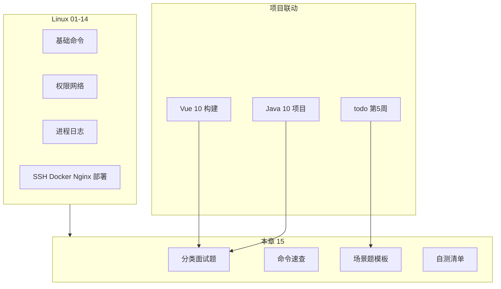
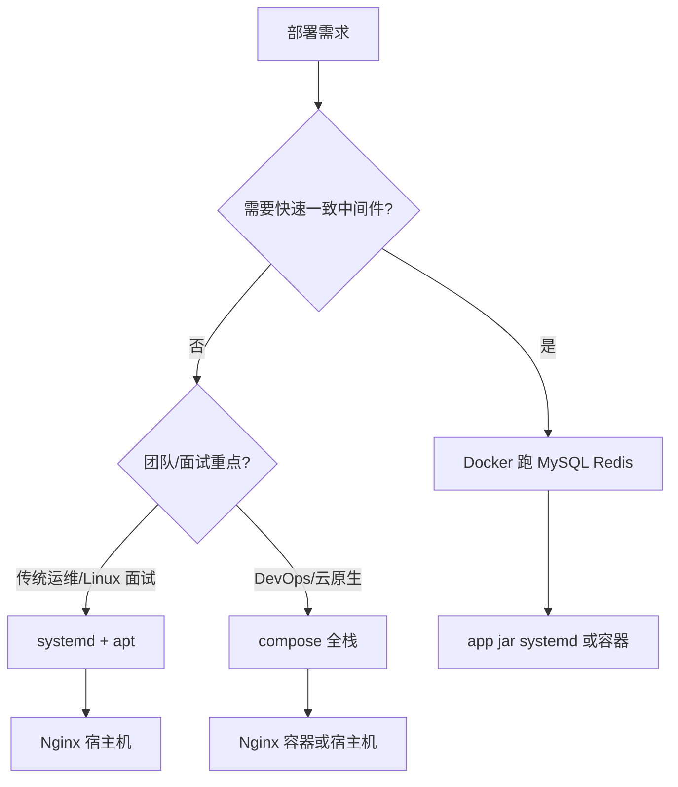
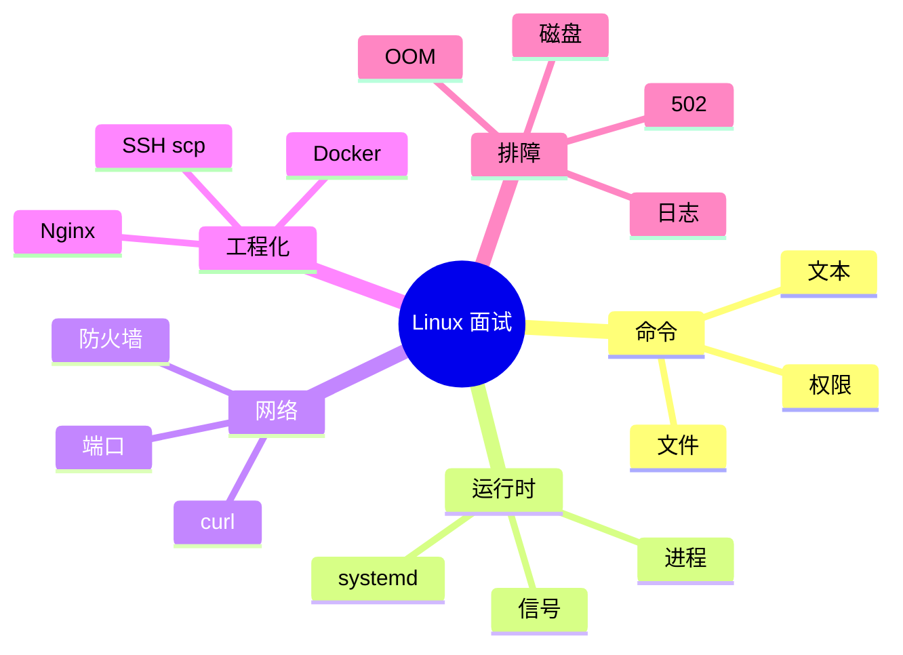

# 面试专题与知识点总表

<!-- 修改说明: 2026-06-30 按 EXPANSION-STANDARD 扩充 §0 读前导读、FAQ≥10、闭卷自测、费曼检验、二轮复习计划；汇总 Linux 01～14 -->

> **文件编码**：UTF-8。本章汇总 **Linux 01～14** 面试高频题、命令速查、权限八进制表、信号表、systemd vs Docker 选型，以及部署排障场景题。面向 **Spring Boot + Vue 全栈** 实习面试，与 [Java 10](../Java/10-后端项目实战与面试准备.md)、[Java 14](../Java/14-高频场景设计与面试专题.md)、[todo.md](../../todo.md) 第 5～6 周复盘对齐。

---

## 0. 读前导读（零基础也能跟上）

### 0.1 用一句话弄懂本章

**一句话**：**01～14 的「总复习 + 面试剧本」**——把命令、权限、部署链路、502/磁盘满等场景收成 **能口述的答法**，面试前 30 分钟刷 **§3 速查 + §8 场景题 + §11 自测**。

**生活类比——驾考科目四**：

| 本篇块 | 类比 |
|--------|------|
| §2 分类面试题 | 科目四题库 |
| §3 命令速查 | 灯光/手势口诀表 |
| §4 八进制权限 | 必背数字题 |
| §7 部署 2 分钟模板 | 路考「起步停车」标准话术 |
| §8 场景题 | 模拟应急（爆胎/灭火） |
| §11 自测清单 | 模考 90 分线 |

**为什么重要**：Linux 在 backend 面试 **几乎必问**；[14 章](14-全栈项目Linux部署实战.md) 实战后若不复习，易「会做不会讲」。

---

### 0.2 你需要提前知道什么

| 条件 | 说明 |
|------|------|
| **最低** | 过完 Linux **01～05** 可先看 §2 基础题 + §4 权限 |
| **推荐** | **01～14 实操完成** 再本章闭卷，否则自测失真 |
| **最佳** | notehub **已部署** + 能演示 URL，STAR 故事才真实 |

---

### 0.3 本章知识地图（☐→☑）

- [ ] §2 **20 道精选题** 能口述 **15+**
- [ ] §3 闭卷写出 **30+** 常用命令
- [ ] §4 八进制心算 **3 道**
- [ ] §5 SIGTERM vs SIGKILL 顺序
- [ ] §6 systemd vs Docker **30 秒对比**
- [ ] §7 **2 分钟** 部署链路不间断
- [ ] §8 每类场景 **≥1 套口诀**
- [ ] §11 自测 **12/15**
- [ ] 闭卷自测 §17 **≥ 8/10**

---

### 0.4 建议使用方式（时间盒）

| 场景 | 时间 | 动作 |
|------|------|------|
| 章刚学完 | 30 min | 只过对应章考点 + 回练 VMware |
| 14 章后 | 2 h | §11 自测全勾 + 弱项回章 |
| 面试前 3 天 | 每天 40 min | §3+§8+§2 随机抽 |
| 面试前 30 min | 速览 | §7 模板 + §4 755/644 + §8.1 磁盘满 |

---

### 0.5 读完本章你能做什么

1. 模拟面试：**「你怎么部署 notehub？」** 2 分钟答完 §7。
2. 白板画：**Browser → Nginx → Spring Boot → MySQL/Redis** 并标端口。
3. 随机场景：**502 / 磁盘满 / 端口占用** 各 3 步内说排查命令。
4. 与 [Java 14](../Java/14-高频场景设计与面试专题.md) 合练 **项目+排障** 连环问。

---

## 本章与上一章的关系

[14 全栈项目 Linux 部署实战](14-全栈项目Linux部署实战.md) 你已把 **notehub-fullstack** 跑在 Ubuntu 上：systemd、Nginx、MySQL、scp 发布。面试官接下来会问：**「你部署时遇到过什么问题？」「磁盘满了怎么办？」「chmod 755 是什么意思？」**——本章把 14 章实战升华成 **可口述的知识体系** 与 **自测清单**。

| 上一章（14） | 本章（15） | 与 Java 路线 |
|--------------|------------|--------------|
| 端到端部署 | 面试问答 + 速查 | Java 09/10 部署追问 |
| 验收 checklist | 自评 checklist | Java 14 场景设计 |
| 502/磁盘/权限 | 场景题模板 | 项目讲解 20 分钟 |



**使用方式**（同 [Java 15](../Java/15-补充知识点总表.md)）：

- 学完 Linux 01～14 后，逐项自评：⬜ 知道 / 🔶 会用 / ✅ 会讲
- 面试前 30 分钟：过一遍 **§3 命令速查** + **§8 场景题**
- 薄弱项回到对应章节重练（文末 **§12 章节索引**）

---

## 1. Linux 在 backend 面试中的位置

### 1.1 实习/Junior 后端常考深度

| 主题 | 考察深度 | 对应章节 |
|------|----------|----------|
| 基础命令 cd/ls/grep/tail | 会用即可 | 01～04 |
| 权限 chmod/chown | 理解 rwx 与八进制 | 05 |
| 进程 ps/kill/systemd | 查 Java 进程、重启服务 | 06 |
| 网络 curl/ss/ufw | 端口占用、防火墙 | 07 |
| 装 JDK/MySQL | 部署题 | 08 |
| Shell 脚本 | 发布自动化入门 | 09 |
| SSH/scp | 怎么上线 | 10 |
| 日志 journalctl/grep | 排障 | 11 |
| Docker | 中间件容器化 | 12 |
| Nginx | 反代、502 | 13 |
| 全栈部署 | 项目追问 | 14 |

### 1.2 与全栈项目的标准答法（notehub-fullstack）

> 我在 Ubuntu 上用 systemd 跑 Spring Boot jar，MySQL 存用户和文章，Nginx 托管 Vue 的 dist，并把 `/api` 反代到本机 8080。开发机 Windows 打包后 scp 上传，数据库脚本随仓库。外网只开 80/443，8080 不对公网暴露。

可展开：[todo.md](../../todo.md) 接口表、JWT 流程、[Vue 10](../../前端学习/Vue/10-Vite构建与项目部署.md) 同域免 CORS。

---

## 2. 分类面试题（精选）

### 2.1 基础概念

**Q1：Linux 内核与用户空间是什么关系？**

**参考答**：内核管理 CPU、内存、设备驱动、网络栈；用户程序（bash、java、nginx）运行在用户空间，通过系统调用访问内核。Docker 容器共享宿主机内核，VMware 虚拟机有独立内核。

**Q2：绝对路径与相对路径？`~` 和 `.` 呢？**

**参考答**：绝对路径从 `/` 开始；相对路径从当前目录开始。`~` 是当前用户家目录；`.` 当前目录；`..` 上级。见 [03 章](03-文件与目录操作命令.md)。

**Q3：硬链接与软链接区别？**

**参考答**：硬链接同一 inode 多个目录项，不能跨分区、一般不能链目录；软链接（符号链接）类似快捷方式，可跨分区。部署中更常见软链，如 `sites-enabled` → `sites-available`。

### 2.2 文件与权限

**Q4：rwx 对文件和目录分别意味着什么？**

**参考答**：

| 权限 | 文件 | 目录 |
|------|------|------|
| r | 读内容 | 列目录（ls） |
| w | 改内容 | 增删改名 |
| x | 执行 | 进入（cd） |

**Q5：`chmod 755` 和 `chmod 644` 一般用在哪？**

**参考答**：755 常用于目录或可执行脚本（rwxr-xr-x）；644 常用于普通文件如配置文件（rw-r--r--）。Nginx 静态目录常 `www-data` 所有，见 [05 章](05-用户组与文件权限.md)、[13 章](13-Nginx与Web服务部署.md)。

**Q6：sudo 是什么？为什么不能都用 root？**

**参考答**：sudo 以 root 权限执行单条命令；日常用普通用户减少误删系统文件风险，审计也更清晰。

### 2.3 进程与服务

**Q7：前台进程与后台进程？如何后台跑 jar？**

**参考答**：前台占用终端；`java -jar app.jar &` 或 `nohup ... &` 可后台。生产用 **systemd** 管理，见 [06 章](06-进程与服务管理.md)、[14 章](14-全栈项目Linux部署实战.md)。

**Q8：如何查 8080 被谁占用？**

**参考答**：

```bash
ss -tlnp | grep 8080
# 或 lsof -i :8080
```

**Q9：SIGKILL 和 SIGTERM 区别？**

**参考答**：SIGTERM(15) 可捕获，进程可优雅退出；SIGKILL(9) 强制杀死不可捕获。应先 TERM，不行再 KILL。见 **§5 信号表**。

### 2.4 网络与防火墙

**Q10：TCP 连接 ESTABLISHED 和 LISTEN 含义？**

**参考答**：LISTEN 表示服务在监听端口；ESTABLISHED 表示已建立连接。`ss -tlnp` 看监听，`ss -tan` 看连接状态。见 [07 章](07-网络命令与防火墙基础.md)。

**Q11：ufw 与安全组区别？**

**参考答**：ufw 是 OS 本机防火墙；云安全组是 hypervisor/网络层规则。公网访问失败需 **两层都查**。

**Q12：curl 和浏览器访问区别？**

**参考答**：curl 命令行发 HTTP，便于脚本与排障；浏览器还会解析 HTML、执行 JS。API 排障优先 curl/Postman。

### 2.5 部署与 Nginx

**Q13：什么是反向代理？为什么生产要把 Spring Boot 放在 Nginx 后面？**

**参考答**：Nginx 接收客户端请求再转发后端；统一 80/443 入口、静态资源分离、gzip、限流、隐藏内网结构。见 [13 章](13-Nginx与Web服务部署.md)、[Java 09](../Java/09-LinuxDockerNginx部署基础.md)。

**Q14：502 Bad Gateway 常见原因？**

**参考答**：后端未启动、端口错误、防火墙阻断 upstream、后端崩溃。查 `error.log` 与 `systemctl status`。

**Q15：Vue history 模式刷新 404 怎么解决？**

**参考答**：Nginx 配置 `try_files $uri $uri/ /index.html;`。见 [Vue 10](../../前端学习/Vue/10-Vite构建与项目部署.md)。

### 2.6 Docker vs systemd

**Q16：什么时候用 Docker，什么时候直接 systemd？**

**参考答**：

| 选 systemd + apt | 选 Docker / compose |
|------------------|------------------------|
| 学习 Linux 传统运维、面试基础 | 环境一致、快速拉起 MySQL/Redis |
| 单机 demo、学校项目 | 团队已有容器规范 |
| 资源极紧、不想背镜像 | 多版本依赖隔离 |

详见 **§6**。两者可在同一项目对比学习，但 **同一端口不要双栈同时占**。

**Q17：容器和虚拟机的区别？**

**参考答**：VM 虚拟化硬件、带完整 Guest OS；容器共享宿主机内核、更轻。VMware 里跑 Docker 是「VM 里再跑容器」。见 [12 章](12-Docker容器基础.md)。

### 2.7 日志与排障

**Q18：应用日志可能在哪？**

**参考答**：

| 来源 | 位置 |
|------|------|
| Spring Boot 文件 | `/opt/notehub/logs/app.log` |
| systemd | `journalctl -u notehub` |
| Nginx | `/var/log/nginx/access.log` `error.log` |
| MySQL | `/var/log/mysql/error.log` |
| 系统 | `/var/log/syslog` |

见 [11 章](11-日志分析与故障排查.md)。

**Q19：磁盘 100% 满了怎么办？**

**参考答**：`df -h` 定位分区 → `du -sh /*` 找大目录 → 清日志、docker prune、删旧 jar 备份。见 **§8.1 场景题**。

**Q20：如何描述一次真实部署踩坑？（STAR）**

**参考答模板**：

- **S**：notehub 上线后登录 502
- **T**：恢复 API 可用
- **A**：`tail error.log` 见 connection refused → `systemctl status notehub` 发现 JDBC 失败 → MySQL 未自启，加 `After=mysql.service` 并 `enable mysql`
- **R**：重启验证，文档补充依赖顺序

---

## 3. 命令速查表（面试手写/口述）

### 3.1 文件与目录

| 命令 | 作用 | 示例 |
|------|------|------|
| `pwd` | 当前路径 | `pwd` |
| `ls -lah` | 详细列表含隐藏 | `ls -lah /opt` |
| `cd` | 切换目录 | `cd /var/log/nginx` |
| `mkdir -p` | 递归建目录 | `mkdir -p /opt/notehub/logs` |
| `cp -r` | 复制 | `cp app.jar app.jar.bak` |
| `mv` | 移动/重命名 | `mv app.jar.new app.jar` |
| `rm -rf` | 递归删除（慎用） | — |
| `find` | 查找 | `find /opt -name "*.log"` |
| `du -sh` | 目录大小 | `du -sh /var/lib/docker` |
| `df -h` | 磁盘使用 | `df -h` |

### 3.2 文本与搜索

| 命令 | 作用 | 示例 |
|------|------|------|
| `cat` | 输出文件 | `cat /etc/os-release` |
| `less` | 分页阅读 | `less app.log` |
| `tail -f` | 跟踪日志 | `tail -f app.log` |
| `head -n` | 前 N 行 | `head -n 50 app.log` |
| `grep` | 搜索 | `grep -i error app.log` |
| `wc -l` | 行数 | `grep ERROR app.log \| wc -l` |

见 [04 章](04-文本查看编辑与搜索.md)。

### 3.3 权限与用户

| 命令 | 作用 | 示例 |
|------|------|------|
| `chmod` | 改权限 | `chmod 755 deploy.sh` |
| `chown` | 改属主 | `chown www-data:www-data -R dist` |
| `whoami` | 当前用户 | `whoami` |
| `id` | 用户与组 | `id ubuntu` |

### 3.4 进程与服务

| 命令 | 作用 | 示例 |
|------|------|------|
| `ps aux \| grep java` | 查 Java 进程 | — |
| `top` / `htop` | 交互监控 | — |
| `kill` | 发信号 | `kill -15 PID` |
| `systemctl start\|stop\|restart\|status` | 服务管理 | `systemctl restart notehub` |
| `systemctl enable` | 开机自启 | `systemctl enable notehub` |
| `journalctl -u` | 单元日志 | `journalctl -u notehub -f` |

见 [06 章](06-进程与服务管理.md)。

### 3.5 网络

| 命令 | 作用 | 示例 |
|------|------|------|
| `ip a` | IP 地址 | `ip a show eth0` |
| `ping` | 连通性 | `ping -c 3 127.0.0.1` |
| `curl` | HTTP 请求 | `curl -I http://127.0.0.1/api/articles` |
| `ss -tlnp` | 监听端口 | `ss -tlnp \| grep 80` |
| `wget` | 下载 | `wget https://...` |
| `ufw status` | 防火墙 | `ufw status numbered` |

### 3.6 包管理与环境

| 命令 | 作用 | 示例 |
|------|------|------|
| `apt update` | 更新索引 | — |
| `apt install -y` | 安装 | `apt install -y nginx` |
| `java -version` | JDK 版本 | — |
| `mysql -u -p` | MySQL 客户端 | — |

见 [08 章](08-软件包管理与开发环境安装.md)。

### 3.7 SSH / 部署 / Docker / Nginx

| 命令 | 作用 | 示例 |
|------|------|------|
| `ssh user@host` | 远程登录 | `ssh ubuntu@IP` |
| `scp` | 传文件 | `scp app.jar ubuntu@IP:/opt/notehub/` |
| `docker ps` | 容器列表 | — |
| `docker compose up -d` | 编排启动 | — |
| `nginx -t` | 检查配置 | — |
| `systemctl reload nginx` | 重载 Nginx | — |

见 [10](10-SSH远程登录与文件传输.md)、[12](12-Docker容器基础.md)、[13](13-Nginx与Web服务部署.md) 章。

---

## 4. 权限八进制对照表

### 4.1 位值

| 权限 | 二进制 | 八进制 |
|------|--------|--------|
| --- | 000 | 0 |
| --x | 001 | 1 |
| -w- | 010 | 2 |
| -wx | 011 | 3 |
| r-- | 100 | 4 |
| r-x | 101 | 5 |
| rw- | 110 | 6 |
| rwx | 111 | 7 |

### 4.2 常见组合（必背）

| 八进制 | 符号 | 典型用途 |
|--------|------|----------|
| 755 | rwxr-xr-x | 目录、可执行脚本 |
| 644 | rw-r--r-- | 普通文件、配置 |
| 600 | rw------- | 私钥、含密码 env 文件 |
| 700 | rwx------ | 用户私有目录 |
| 750 | rwxr-x--- | 组内可读目录 |
| 777 | rwxrwxrwx | **避免**（安全风险） |

### 4.3 面试小算题

**Q：`chmod 764 file` 各角色权限？**

**A**：owner 7=rwx，group 6=rw-，others 4=r-- → `-rw-rw-r--`。

**Q：Nginx 403 读 dist，先查什么？**

**A**：目录 execute 位（能否 cd 进入）、属主是否 www-data、`selinux`（CentOS）。

见 [05 章](05-用户组与文件权限.md)。

---

## 5. 常见信号表

| 信号 | 编号 | 默认行为 | 场景 |
|------|------|----------|------|
| SIGHUP | 1 | 终止 | 重载配置（部分 daemon） |
| SIGINT | 2 | 终止 | Ctrl+C |
| SIGQUIT | 3 | 核心转储退出 | Ctrl+\\ |
| SIGKILL | 9 | 强制终止 | 进程僵死最后手段 |
| SIGTERM | 15 | 优雅终止 | `kill PID`、`systemctl stop` 默认 |
| SIGSTOP | 19 | 暂停 | 调试（不可捕获） |
| SIGCONT | 18 | 继续 | 恢复 STOP 进程 |

**最佳实践**：

```bash
kill -15 <pid>    # 先优雅
sleep 2
kill -9 <pid>     # 仍存活再强杀
```

**深入解释**：Java 收到 SIGTERM 时，若注册了 shutdown hook，可完成线程池关闭；SIGKILL 无法做清理，可能导致数据库连接未释放（短暂）。

---

## 6. systemd vs Docker：何时用哪个



| 维度 | systemd | Docker |
|------|---------|--------|
| 启动单元 | `.service` unit | 镜像 + 容器 |
| 日志 | journalctl | docker logs |
| 开机自启 | `systemctl enable` | `--restart unless-stopped` |
| 依赖 | `After=` `Requires=` | `depends_on` healthcheck |
| 资源隔离 | 进程级 | cgroup + namespace |
| 适用 | notehub jar、Nginx | MySQL、Redis、可复现实验 |

**面试一句话**：我项目里 **Java 进程用 systemd**，因为排障直接、贴近大多数中小厂；**MySQL/Redis 练习时用 Docker**，避免污染本机；若上云 compose 一键起，见 [14 章 §9](14-全栈项目Linux部署实战.md)。

---

## 7. 全栈部署链路口述模板（2 分钟版）

1. **构建**：后端 `mvn package`，前端 `npm run build` → `dist`（[Vue 10](../../前端学习/Vue/10-Vite构建与项目部署.md)）
2. **传输**：`scp` jar 与 dist 到 `/opt/notehub`、`/var/www/notehub/dist`（[10 章](10-SSH远程登录与文件传输.md)）
3. **依赖**：MySQL 建库导入 schema，Redis 可选（[08 章](08-软件包管理与开发环境安装.md)）
4. **运行**：`notehub.service` 启 jar，监听 8080（[14 章](14-全栈项目Linux部署实战.md)）
5. **入口**：Nginx 80，`/` 静态 + `/api` 反代（[13 章](13-Nginx与Web服务部署.md)）
6. **安全**：ufw + 安全组，仅 22/80/443
7. **验证**：注册登录发文 + `journalctl` 无 ERROR

与 [Java 10](../Java/10-后端项目实战与面试准备.md) 架构图一致，可画白板。

---

## 8. 高频场景题（排查思路）

### 8.1 磁盘满（disk full）

**现象**：写日志失败、MySQL 崩溃、SSH 卡顿。

**步骤**：

```bash
df -h
du -sh /* 2>/dev/null | sort -hr | head
du -sh /var/log/* | sort -hr | head
journalctl --disk-usage
docker system df   # 若用 Docker
```

**处理**：清 rotated 日志、`journalctl --vacuum-size=200M`、删旧 `*.jar.bak`、docker prune。**预防**：logrotate、[11 章](11-日志分析与故障排查.md)。

### 8.2 进程 stuck / CPU 100%

**现象**：接口超时、机器卡。

**步骤**：

```bash
top -c          # 看哪个进程
ps -p <pid> -o pid,cmd,%cpu,%mem,etime
jstack <pid>    # Java 线程栈（需 JDK 工具）
kill -15 <pid>
```

**口述**：先定位是 Java GC 死循环还是 MySQL 慢查询，再分别用 jstack 或 `SHOW PROCESSLIST`。

### 8.3 部署失败（release failed）

**现象**：新版本上线后 502 或启动即 exit。

**步骤**：

```bash
sudo systemctl status notehub
journalctl -u notehub -n 100 --no-pager
# 常见：YAML 语法、DB 密码、端口占用、JDK 版本不对
```

**回滚**：恢复 `app.jar.bak` → `systemctl restart`（[14 章 deploy.sh](14-全栈项目Linux部署实战.md)）。

### 8.4 端口冲突

```bash
ss -tlnp | grep -E ':80|:8080|:3306'
```

改 Nginx 或停冲突服务；**不要**随意 kill 系统 sshd。

### 8.5 内存 OOM（Out of Memory）

**现象**：进程 mysteriously 消失，`dmesg | grep -i kill`。

**处理**：加 swap（练习机）、降 JVM `-Xmx`、升配 ECS；见 [11 章 OOM](11-日志分析与故障排查.md)。

### 8.6 Nginx 502 / 504

| 码 | 含义 | 查 |
|----|------|-----|
| 502 | upstream 无效响应/连接失败 | 后端活否、proxy_pass |
| 504 | upstream 超时 | 后端慢、调 `proxy_read_timeout` |

### 8.7 SSH 连不上

查：IP、22 安全组、sshd 状态、密钥权限 `chmod 600`、是否改端口。见 [10 章](10-SSH远程登录与文件传输.md)。

### 8.8 MySQL 连接数过多

```sql
SHOW VARIABLES LIKE 'max_connections';
SHOW STATUS LIKE 'Threads_connected';
```

应用连接池过大、连接泄漏；调 pool 大小或杀 idle 连接。

---

## 9. Linux × Java × Vue 联合追问

| 面试官问 | 建议答点 | 资料 |
|----------|----------|------|
| 为什么生产不用 dev CORS | Nginx 同域 `/api` | Vue 10, 13 章 |
| JWT 放哪 | Header Bearer；HTTPS 防窃听 | Java 04, todo |
| 如何看后端 log | journalctl + app.log | 11, 14 章 |
| BCrypt 在哪做 | Spring Security 注册 | Java 04, todo |
| 分页怎么做 | MyBatis-Plus Page | Java 05 |
| Redis 缓存哪些 | 文章列表热点 | Java 07 |
| 怎么保证 MySQL 数据不丢 | 持久化 volume、定期 mysqldump | 12, 14 章 |

---

## 10. 常见报错与排查（面试口述版）

| 报错/现象 | 可能原因 | 解决方案 |
|-----------|---------|---------|
| `Permission denied` | 权限不足 | sudo / chmod / chown |
| `No such file or directory` | 路径错 | tab 补全；`ls` 确认 |
| `Address already in use` | 端口占用 | `ss -tlnp` 杀或改端口 |
| `Connection refused` | 服务未监听 | 启动服务；查防火墙 |
| `502 Bad Gateway` | Nginx 连不上后端 | systemctl status notehub |
| SPA 刷新 404 | 无 try_files | Nginx 配 index.html fallback |
| `Access denied for user` MySQL | 账号密码错 | GRANT 与 yml 对齐 |
| `java: command not found` | 未装 JDK 或 PATH | apt install openjdk-17-jdk |
| `disk quota exceeded` / 满 | 磁盘满 | df/du 清理 |
| `Too many open files` | ulimit 过小 | `ulimit -n`；调 limits.conf |
| Docker `Cannot connect to daemon` | 未启 Docker | systemctl start docker |
| scp 慢或断 | 网络/文件大 | 压缩后传；rsync |
| `Host key verification failed` | IP 变更 | 改 known_hosts |
| SSH `Permissions too open` | 私钥权限过宽 | chmod 600 id_rsa |

---

## 11. 自测清单（Linux 暑假毕业考 · 对齐 todo §10.1）

| # | 测试项 | 通过标准 | 章节 |
|---|--------|----------|------|
| 1 | 目录导航与文件操作 | 盲打 10 条命令 | 01～03 |
| 2 | grep/tail 查 ERROR | 1 min 定位日志 | 04, 11 |
| 3 | chmod 解释 755 | 口述 rwx | 05 |
| 4 | 查 8080 占用并释放 | ss + kill/systemctl | 06, 07 |
| 5 | apt 装 JDK + MySQL | 版本正确 | 08 |
| 6 | 写 5 行 deploy.sh | scp + restart | 09, 10 |
| 7 | journalctl 查服务 | 找到启动失败原因 | 11 |
| 8 | docker run Redis | ping PONG | 12 |
| 9 | Nginx 反代 curl 通 | /api 200 | 13 |
| 10 | notehub 全流程部署 | 验收 12/15 | 14 |
| 11 | 口述 502 排查 | 3 步以内 | 13, 15 §8 |
| 12 | 磁盘满模拟处理 | 说出 du/df 命令 | 11, 15 §8.1 |
| 13 | systemd vs Docker | 30 秒对比 | 15 §6 |
| 14 | 项目架构 15 min | 对齐 Java 10 | 14, Java 10 |
| 15 | 随机 10 道 Linux 口试 | 对 7 题 | 15 §2 |

[todo.md 第 6 周自测](../../todo.md) 第 3 项「Ubuntu 里部署并 curl 通接口」— 本章 **#9/#10** 即该项细化。

---

## 12. 章节索引（01～14 一键跳转）

| 章 | 标题 | 核心考点 |
|----|------|----------|
| [01](01-Linux入门与环境搭建.md) | Linux 入门与环境搭建 | VMware、终端、共享文件夹 |
| [02](02-文件系统与目录结构.md) | 文件系统与目录结构 | FHS、/etc /var /opt |
| [03](03-文件与目录操作命令.md) | 文件与目录操作 | ls/cd/cp/mv/rm |
| [04](04-文本查看编辑与搜索.md) | 文本查看编辑与搜索 | grep/tail/vim 入门 |
| [05](05-用户组与文件权限.md) | 用户组与文件权限 | chmod/chown/sudo |
| [06](06-进程与服务管理.md) | 进程与服务管理 | ps/kill/systemctl |
| [07](07-网络命令与防火墙基础.md) | 网络命令与防火墙 | curl/ss/ufw |
| [08](08-软件包管理与开发环境安装.md) | 软件包管理与开发环境 | apt、JDK、MySQL |
| [09](09-Shell脚本入门.md) | Shell 脚本入门 | deploy.sh、变量、if |
| [10](10-SSH远程登录与文件传输.md) | SSH 远程登录与文件传输 | ssh/scp、密钥 |
| [11](11-日志分析与故障排查.md) | 日志分析与故障排查 | journalctl、磁盘、OOM |
| [12](12-Docker容器基础.md) | Docker 容器基础 | 镜像、compose |
| [13](13-Nginx与Web服务部署.md) | Nginx 与 Web 服务部署 | 反代、try_files、gzip |
| [14](14-全栈项目Linux部署实战.md) | 全栈项目 Linux 部署实战 | notehub 端到端 |

**Java / Vue 关联**：

- [Java 09 Linux/Docker/Nginx 部署基础](../Java/09-LinuxDockerNginx部署基础.md)
- [Java 10 后端项目实战与面试准备](../Java/10-后端项目实战与面试准备.md)
- [Java 14 高频场景设计与面试专题](../Java/14-高频场景设计与面试专题.md)
- [Java 15 补充知识点总表](../Java/15-补充知识点总表.md)
- [Vue 10 Vite 构建与项目部署](../../前端学习/Vue/10-Vite构建与项目部署.md)
- [暑假计划 todo.md](../../todo.md)

---

## 13. 练习建议

### 基础

1. 闭卷写出 **§3** 中 20 个常用命令及用途。
2. 口述 **§4** 中 755、644、600 各代表什么。
3. 回答 **§2** 中 Q7、Q13、Q14 各 1 分钟。

### 进阶

4. 模拟面试：同学随机抽 **§8** 场景题，限时 5 min 说排查步骤。
5. 对照 **§11 自测** 勾选，薄弱章重练 VMware 实操。
6. 把 **§7 口述模板** 录音，控制在 2 分钟内。

### 挑战

7. 结合 notehub 准备 3 个 STAR 踩坑故事（部署、502、磁盘）。
8. 与 [Java 14](../Java/14-高频场景设计与面试专题.md) 合练：后端设计 + Linux 部署一问一答。
9. 白板上画：Browser → Nginx → Spring Boot → MySQL/Redis，标注端口与路径。

---

## 14. 练习参考答案

### 基础 1（示例节选）

| 命令 | 用途 |
|------|------|
| `tail -f` | 实时跟踪日志 |
| `systemctl restart` | 重启服务 |
| `nginx -t` | 检查 Nginx 配置 |
| `scp` | 加密传文件 |
| `df -h` | 人类可读磁盘空间 |

### 进阶 4：磁盘满 SAMPLE 答法

「先用 `df -h` 看哪个分区 100%；若是根分区，用 `du -sh /*` 找大户，常见是 `/var/log` 或 Docker。日志用 logrotate 或 vacuum journal；Docker 用 `docker system prune`。清完后验证 `df`，并配置监控避免复发。」

### 挑战 7：STAR 502 示例

见 **§2 Q20**；可补充：在 README **故障附录** 写同一故事，面试时与简历一致。

---

## 15. 深入解释：为什么大厂仍问 Linux

后端写 Java 不等于不用 OS：**部署、排障、性能** 都落在 Linux 上。实习生的期望是：

- 能独立把 [todo.md](../../todo.md) 项目部署到 ECS
- 出问题时 **先看日志、再看端口、再查资源**，而不是重启玄学
- 能把 Linux 与 **Spring Boot、MySQL、Nginx** 串成一条故事



掌握 **01～14 实操** + 本章 **自测 15 项过 12 项**，即可应对大多数 Java 后端实习的 Linux 基础追问。

---

## 16. 学完标准

- [ ] **§2** 分类面试题能口述至少 **15/20** 题
- [ ] **§3** 命令速查闭卷写出 **30+** 条常用命令
- [ ] **§4** 权限八进制能心算 **3 道** 小算题
- [ ] **§5** 说清 SIGTERM vs SIGKILL 及生产顺序
- [ ] **§6** 30 秒对比 systemd 与 Docker 选型
- [ ] **§7** 2 分钟内讲完 notehub 部署全链路
- [ ] **§8** 场景题每类至少 **1 套** 排查口诀
- [ ] **§11** 自测清单 **12/15** 通过
- [ ] 与 [Java 10](../Java/10-后端项目实战与面试准备.md) 项目讲解合并演练 **15 min**
- [ ] 已对照 [todo.md 第 6 周自测](../../todo.md) 勾选 Linux 相关项

---

## 17. 常见问题 FAQ（复习与面试）

**Q1：15 章要背完吗？**  
**背 §3 高频 30 条 + §4 常见八进制 + §7 模板**；§2 理解为主，能用自己的话讲。

**Q2：命令记不住怎么办？**  
面试重 **思路**（日志→端口→资源）；命令可说「我会 ss/journalctl，现场查 --help」。

**Q3：没云服务器简历怎么写部署？**  
写 **VMware Ubuntu 完整部署** + 内网 IP demo；有 ECS 后补公网 URL。

**Q4：Linux 和 Java 面试占比？**  
实习 Java 为主；Linux 常作为 **项目追问**（部署、502、日志），约 10～20 分钟。

**Q5：chmod 777 为什么危险？**  
所有人可写，易被篡改或误删；目录最多 755，密钥文件 600。

**Q6：journalctl 和 tail app.log 区别？**  
journalctl 管 **systemd 服务** stdout/stderr；app.log 是应用自己写的文件；两者都要会查。

**Q7：Docker 题会不会很深？**  
校招多数到 **镜像/容器/compose/与 VM 区别**；K8s 了解即可 unless 岗位写明。

**Q8：如何证明不是背八股？**  
结合 **14 章真实踩坑** STAR；说具体命令输出（如 error.log 的 connection refused）。

**Q9：15 章和 Java 15 关系？**  
[Java 15](../Java/15-补充知识点总表.md) 补 Java 生态；本章 **只 Linux**；面试前 **双表对照**。

**Q10：二轮复习间隔？**  
见 **§18 二轮计划**；建议 14 章完成后 **第 7 天、第 30 天** 各刷一遍 §11。

**Q11：前端岗要学到哪？**  
至少 **01～07 + 10 + 13**（SSH/Nginx/部署）；全栈则 **14+15**。

**Q12：自测 12/15 但面试仍慌？**  
录音 **§7 模板**；找同学抽 **§8 场景** 限时 5 min；补 VMware 实敲 weak 章。

---

## 18. 二轮复习计划（模板）

| 轮次 | 时间点 | 动作 | 通过标准 |
|------|--------|------|----------|
| R1 | 14 章完成后 3 天内 | §11 全勾 + §2 抽 10 题 | 对 8 题 |
| R2 | 1 周后 | 无文档重部署 notehub 核心步骤 | 90 min 内通 |
| R3 | 面试前 1 周 | §3+§8 每日 30 min | 场景 5/5 |
| R4 | 面试前夜 | §7+§4+踩坑 STAR 各 1 遍 | 能睡着（别通宵） |

在 `linux-practice/NOTES.md` 记录每轮日期与弱项章号。

---

## 19. 闭卷自测（15 章总测）

### 概念题（6 道）

1. 用三句话对比 Docker 容器与 VMware 虚拟机。
2. `chmod 755` 与 `chmod 644` 各适用于什么类型文件？
3. 502 与 504 在 Nginx 场景各表示什么？
4. systemd 的 `After=` 与 Docker compose 的 `depends_on` 各解决什么？
5. 为何生产 JWT 必须配合 HTTPS？
6. ufw 与云安全组都要检查的原因？

### 动手/口述题（2 道）

7. 口述磁盘满排查 **4 条命令**（按顺序）。
8. 写出 notehub 从 `mvn package` 到浏览器登录的 **5 个关键步骤**（关键词即可）。

### 综合题（2 道）

9. 面试官：「你的项目怎么部署的？」用 **2 分钟** 答（对照 §7，计时）。
10. 连环问：外网能打开首页但登录 502 → 你按什么顺序查 **4 处**？

### 自测参考答案

1. 容器共享宿主机内核、轻量；VM 独立 Guest OS、重；常见 VM 里再跑 Docker。
2. 755 目录/可执行脚本；644 普通只读配置/文本。
3. 502 upstream 连接/响应失败；504 upstream 超时。
4. After 启动顺序；depends_on（+healthy）等待依赖 **就绪**。
5. HTTP 明文 JWT 可被嗅探；HTTPS 加密传输层。
6. OS 本机防火墙 + 云网络层 **任一层拦都会 timeout/refused**。
7. `df -h` → `du -sh /*` → 查 `/var/log` 或 docker df → vacuum/prune/删备份。
8. package/build → scp jar+dist → MySQL schema → systemd start → nginx reload → 浏览器 `/api`。
9. （略，见 §7 七步，控制在 120 s 内）
10. F12 是否请求 `/api`→`curl 127.0.0.1:8080`→`systemctl status notehub`→`tail nginx error.log`→`journalctl -u notehub`。

---

## 20. 费曼检验

**任务**：3 分钟向 **非技术亲友** 解释「你暑假在 Linux 上练了什么、面试能讲什么」。

**对照提纲**：

1. **练了什么**：在 Ubuntu 里装数据库、把网站程序跑起来、用 Nginx 当大门。
2. **会什么命令**：查日志、查端口、改权限（不必背全，强调 **会排查**）。
3. **项目故事**：notehub 从打包到上线 + 一次 502 怎么修好的（STAR 一句）。

---

## 下一章预告

**15 章是 Linux 路线的收官索引**——后续复习建议：

1. **横向**：对照 [Java 15](../Java/15-补充知识点总表.md) 做 Java + Linux 双表自测
2. **实战**：按 [todo.md 第 5～6 周](../../todo.md) 重新部署 notehub-fullstack 并录屏
3. **面试**：配合 [Java 14](../Java/14-高频场景设计与面试专题.md) 模拟「项目 + 排障」连环问

若大二进阶云原生，可在本路线之上延伸 K8s、CI/CD（GitHub Actions + [10 章 SSH](10-SSH远程登录与文件传输.md) 发布），但 **01～15 已覆盖校招实习 Linux 基础盘的 80%**。

---

*上一章：[14-全栈项目Linux部署实战](14-全栈项目Linux部署实战.md) · 总表：[Java 15](../Java/15-补充知识点总表.md) · 计划：[todo.md](../../todo.md)*

*本章已按 EXPANSION-STANDARD 扩充（§0 导读+FAQ+二轮计划+闭卷自测+费曼）。*

**EXPANSION-STANDARD 自检**：☑ §0 ☑ FAQ≥10 §17 ☑ 二轮 §18 ☑ 闭卷 10 题 §19 ☑ 费曼 §20 ☑ 索引章 800+ 行
