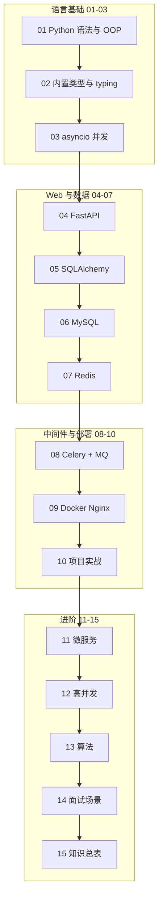

# Python 后端学习路线图与说明

> **⚠️ 2026 路线分工**  
> - **默认主线**：[C++ 01～36](../C++/00-学习路线图与说明.md) + 数据结构 + Linux  
> - **大模型 PyTorch（选读）**：[LLMPython 00](../LLMPython/00-学习路线图与说明.md)  
> - **本文件夹 Python 01～15**：**FastAPI Web 后端备选**

<!-- 修改说明: 2026-06-30 按 EXPANSION-STANDARD 扩充 §0、FAQ≥12、闭卷自测、费曼检验 -->

> **文件编码**：本文件夹内所有 `.md` 均为 **UTF-8**。Python 源文件建议 UTF-8，编辑器右下角确认编码为 UTF-8。

---

## 0. 读前导读（零基础也能跟上）

> **读者假设**：你会复制粘贴、会用电脑；**不一定**写过代码。00 章不教语法，只回答「学什么、按什么顺序、用什么工具」。

### 0.1 用一句话弄懂本章

**一句话**：Python 后端路线 = **语言（01～03）→ Web 框架 FastAPI（04）→ 数据库与缓存（05～07）→ 中间件与部署（08～09）→ 项目与面试（10～15）**，目标是能独立做一个带 MySQL + Redis 的 JSON API 项目。

**三条核心类比（贯穿全路线）**：

| 类比 | Python 路线 | Java 路线（对照） | 生活类比 |
|------|-------------|-------------------|----------|
| Web 框架 | **FastAPI** | Spring Boot | **餐厅前台**：接单、上菜、统一规范 |
| 并发模型 | **asyncio**（单线程多任务） | 线程池 + JVM | **一个服务员同时盯多桌**：等菜时去别的桌，不傻站 |
| 缓存 | **Redis**（07 章） | Redis（Java 07 章） | **前台小抄**：热点菜单不用每次跑后厨 |

**为什么重要**：没有路线图容易「学 Flask 又学 Django 又学 FastAPI」或跳过 asyncio 直接写接口——后面性能、缓存、面试都会卡。00 章帮你**只走一条主线**。

---

### 0.2 你需要提前知道什么（真不会就先跳到哪一章）

| 你现在的水平 | 建议动作 |
|--------------|----------|
| 完全零基础 | 从 [01 Python 基础](./01-Python基础语法与面向对象.md) 开始；00 只看 §4 环境安装 |
| 学过 Java 后端 | 01～03 可速读，重点看 Python 差异；04 FastAPI 对照 [Java 04 Spring Boot](../Java/04-SpringBoot核心开发.md) |
| 前端已学完 HTTP/JSON | 01～03 与前端 01～09 可并行；04 章起做前后端联调 |
| 只想查 Redis 命令 | 直接 [07 Redis](./07-Redis核心原理与缓存实战.md)，概念不懂时对照 [Java 07](../Java/07-Redis核心原理与缓存实战.md) |
| 已会 Django | 04 章重点学 FastAPI 的 Pydantic + async；ORM 差异在 05 章 |

**最低门槛**：能安装 Python 3.11+、会用终端、知道「变量 = 装数据的盒子」。

---

### 0.3 本章知识地图（学完后应能勾选全部 ☐→☑）

- [ ] 说出 Python 后端主线：01→03 语言 → 04 FastAPI → 05～07 数据 → 08～09 中间件/部署
- [ ] 能对照 Java 路线说出 FastAPI≈Spring Boot、asyncio≈单线程多任务、Redis 两路线相同
- [ ] 按 §4 完成 `python --version` 与环境验证
- [ ] 创建 `.venv` 并 `pip install fastapi uvicorn` 无报错
- [ ] 理解 demo-api 从 04 章内存 CRUD 演进到 09 章 Docker 全栈
- [ ] 选定练手项目（电商 / 博客 / 待办三选一）
- [ ] 知道每章至少完成「基础档」分级练习
- [ ] 闭卷自测 10 题正确 ≥ 8 题

---

### 0.4 建议学习时长与节奏

| 阶段 | 建议时间 | 做什么 |
|------|----------|--------|
| 00 + 环境 | 0.5～1 天 | 读路线图、装 Python、建第一个 venv |
| 01～03 语言 | 2～3 周 | 语法、dict/list、asyncio（每天写代码） |
| 04～07 Web+数据 | 3～4 周 | FastAPI、SQLAlchemy、MySQL、Redis |
| 08～10 中间件+项目 | 3～4 周 | Celery、Docker、完整 demo-api |
| 11～15 进阶冲刺 | 持续 | 微服务概念、算法、面试场景 |

**节奏建议**：不要跳 03 直接写 FastAPI——不懂 `async def` 会在 04～07 章反复踩坑。

---

### 0.5 学完本章你能做什么（可验证的具体动作）

1. **运行** `python --version` 显示 3.11 或 3.12。
2. **创建** 虚拟环境，命令行前出现 `(.venv)`。
3. **画出** 从 01 到 07 的学习顺序（能口述每章解决什么问题）。
4. **对照** Java 路线表格，说出 3 个对应关系（FastAPI/Spring Boot 等）。
5. **规划** 自己的 demo-api 演进：04 内存 → 05 MySQL → 07 Redis。
6. **列出** 本周要完成的章节编号与「基础档」练习。

---

### 0.6 Python 与 Java 平行章节对照（双路线学习者专用）

若你同时学或已学 Java，用下表**概念互参、实操各做一遍**：

| 编号 | Python 章 | Java 章 | 相同点 | 不同点 |
|------|-----------|---------|--------|--------|
| 01 | Python 语法与 OOP | Java 语法与 OOP | 类、继承、多态 | Python 缩进、动态类型、无 interface 关键字 |
| 02 | 内置类型与 typing | 集合与泛型 | list/dict ≈ List/Map | 推导式、duck typing |
| 03 | asyncio 并发 | JVM 并发 | IO 密集要并发 | **asyncio=单线程多任务** vs Java 多线程+线程池 |
| 04 | **FastAPI** | **Spring Boot** | Router/Controller、DI、Swagger | Pydantic vs Bean Validation |
| 05 | SQLAlchemy | MyBatis | CRUD、事务 | ORM 风格 vs XML/SQL 映射 |
| 06 | MySQL | MySQL | **概念几乎相同** | Python 用 SQLAlchemy 连库 |
| 07 | Redis | Redis | **概念几乎相同** | Python 用 redis-py async |

> **06、07 章**：MySQL 与 Redis 是**通用后端知识**，两路线文档可交叉阅读；Python 版偏 FastAPI + redis-py 实操，Java 版偏 Spring + Jedis/Lettuce。

---

## 1. 这套资料适合谁

- 想走 **Python 后端** 路线的大学生或转行初学者
- 已学完或并行学习 [前端 HTML/CSS/JS](../../前端学习/HTML%20CSS%20JS/00-学习路线图与说明.md) 的同学（前后端联调会更顺）
- 目标：能写 FastAPI 接口、操作 MySQL/Redis、理解面试高频考点

**不适合**：已多年微服务架构经验、仅想查某一中间件 API 的资深开发者。

### 与 Java 路线的关系

本仓库同时提供 [Java 后端](../Java/00-学习路线图与说明.md) 与 **Python 后端** 两条路线，**技术栈不同、能力目标一致**：

| 维度 | Java 路线 | Python 路线（本文件夹） |
|------|-----------|-------------------------|
| Web 框架 | Spring Boot | FastAPI |
| ORM | MyBatis | SQLAlchemy |
| 包管理 | Maven | pip / uv + venv |
| 并发模型 | 线程池 + JVM | asyncio + GIL 入门 |
| 消息队列 | RabbitMQ | Celery + RabbitMQ |
| 数据库/缓存/部署 | MySQL、Redis、Docker | 相同 |

**Web 后端选 Java 或 Python FastAPI 一条即可**（均为备选）。**默认主线**见 [C++ 00](../C++/00-学习路线图与说明.md) + [todo.md](../../todo.md)。

---

## 2. 技术栈主线（本资料默认路线）

```text
Python 语言基础
  → 内置类型 / 模块 / 类型注解
  → asyncio 与并发入门
  → FastAPI Web 开发
  → SQLAlchemy + MySQL
  → Redis 缓存
  → Celery + RabbitMQ 消息队列
  → Linux / Docker / Nginx 部署
  → 微服务与多服务协作入门
  → 高并发与分布式概念
  → 项目实战 + 算法 + 面试
```

与前端的关系：

| 前端 | 后端（对应） |
|------|--------------|
| HTTP、状态码、JSON | 04 FastAPI 接口、10 联调 |
| fetch、Token | 登录鉴权、JWT |
| 表单提交 | 路由接参、Pydantic 校验 |
| 本地存储 | Redis、Session |
| Vue 3 / React | 04 FastAPI 返回 JSON（见 [Vue 08](../../前端学习/Vue/08-Axios网络请求与前后端联调.md)、[React 08](../../前端学习/React/08-Axios网络请求与前后端联调.md)） |

---

## 3. 学习顺序（按编号）

```text
00 学习路线图（你现在在这里）
 ↓
01 Python 基础语法与面向对象
 ↓
02 Python 内置类型、模块与类型注解
 ↓
03 Python 并发编程与 asyncio
 ↓
04 FastAPI 核心开发
 ↓
05 SQLAlchemy 事务与接口工程化
 ↓
06 MySQL 基础、索引与事务
 ↓
07 Redis 核心原理与缓存实战
 ↓
08 Celery 与消息队列实战
 ↓
09 Linux、Docker、Nginx 部署基础
 ↓
10 后端项目实战与面试准备
 ↓
11 微服务与多服务协作基础
 ↓
12 高并发与分布式系统基础
 ↓
13 算法与数据结构基础
 ↓
14 高频场景设计与面试专题
 ↓
15 补充知识点总表（复习索引）
```

### 阶段目标

| 阶段 | 文档 | 目标 |
|------|------|------|
| 语言 | 01~03 | 能写 Python，懂 OOP、dict/list、async 基础 |
| 框架 | 04~05 | 能搭 FastAPI 项目，写 CRUD 接口 |
| 数据 | 06~07 | 会建表、写 SQL、用 Redis 做缓存 |
| 中间件 | 08~09 | 会用 Celery/MQ、能 Docker 部署 |
| 进阶 | 10~12 | 能做完整项目，懂微服务与高并发概念 |
| 冲刺 | 13~15 | 刷算法、场景题、查漏 |

---

## 3.1 各章衔接索引（上一章产出 → 本章解决什么）

| 编号 | 上一章学了什么 | 本章要解决什么 |
|------|----------------|----------------|
| 01 | 00 路线图：知道学什么、用什么工具 | 写第一个 Python 程序，掌握 OOP 基础 |
| 02 | 01 语法与 OOP：能写类和方法 | 日常开发必用的 list/dict、模块、类型注解 |
| 03 | 02 数据结构：同步代码跑通 | asyncio、GIL、多线程/多进程入门 |
| 04 | 03 并发：在解释器里跑 Python | 对外提供 HTTP 接口，进入 Web 后端 |
| 05 | 04 FastAPI：接口在内存里 | SQLAlchemy 连 MySQL，数据持久化 + 事务 |
| 06 | 05 会写 ORM/SQL | 表设计、索引、B+ 树、事务隔离 |
| 07 | 06 MySQL 持久化但磁盘慢 | Redis 缓存扛热点读 |
| 08 | 07 Redis 解决读快 | Celery 异步解耦写后附属操作 |
| 09 | 08 本地跑通全栈 | Linux/Docker/Nginx 部署上线 |
| 10 | 01～09 技术栈齐备 | 串成完整项目 + 联调 + 面试准备 |
| 11 | 10 单体项目能讲清楚 | 何时拆分微服务、网关与 RPC 概念 |
| 12 | 11 微服务概念 | 高并发、分布式一致性、限流熔断 |
| 13 | 12 架构概念 | 算法刷题，支撑 14 面试 |
| 14 | 13 算法 + 04～12 技术 | 登录/下单/缓存等场景设计题 |
| 15 | 01～14 全部过完 | 复习索引，查漏补缺 |

---

## 3.2 demo 项目演进路线（04～09 共用同一个项目）

跟着文档做的话，建议始终维护一个叫 `demo-api` 的 FastAPI 项目，逐章叠加能力：

```text
04 章  demo-api 启动 + Router/Service 分层 + 内存 list CRUD
  ↓
05 章  + SQLAlchemy + MySQL，内存 list 换成 ORM
  ↓
06 章  完善表设计、索引、用 Docker 起 study-mysql
  ↓
07 章  + Redis 缓存（商品/用户详情 Cache Aside）
  ↓
08 章  + Celery + RabbitMQ（下单后发异步消息）
  ↓
09 章  uvicorn 部署 + docker-compose 一键起 MySQL/Redis/MQ + Nginx 反代
  ↓
10 章  扩展为完整练手项目（登录、商品、下单）
```

各章「手把手」小节入口：04-2.1、05-7.1、06-4.1、07-2.1、08-4.1、09-§37。

---

## 3.3 资料建设进度

| 编号 | 文件名 | 建设状态 | 扩充说明 |
|------|--------|----------|----------|
| 00 | 学习路线图与说明 | ✅ 已扩充 | §0、FAQ 14、闭卷+费曼 |
| 01 | Python 基础与 OOP | ✅ 已扩充 | §0、Java 01 对照、FAQ 12、闭卷+费曼 |
| 02 | 内置类型模块与类型注解 | ✅ 已扩充 | §0、Java 02 对照、FAQ 12、闭卷+费曼 |
| 03 | 并发与 asyncio | ✅ 已扩充 | §0、单线程多任务类比、Java 03 对照 |
| 04 | FastAPI 核心 | ✅ 已扩充 | §0、FastAPI≈Spring Boot、FAQ 12 |
| 05 | SQLAlchemy 与工程化 | ✅ 已扩充 | §0、Java 05 MyBatis 对照 |
| 06 | MySQL 索引与事务 | ✅ 已扩充 | §0、与 Java 06 概念同步 |
| 07 | Redis 缓存实战 | ✅ 已扩充 | §0、与 Java 07 概念同步 |
| 08 | Celery 与 MQ 实战 | ✅ 已建立 |
| 09 | Linux Docker Nginx | ✅ 已建立 |
| 10 | 项目实战与面试 | ✅ 已建立 |
| 11 | 微服务协作基础 | ✅ 已建立 |
| 12 | 高并发与分布式 | ✅ 已建立 |
| 13 | 算法与数据结构 | ✅ 已建立 |
| 14 | 场景设计与面试 | ✅ 已建立 |
| 15 | 补充知识点总表 | ✅ 已建立 |

---

## 3.4 三条主线类比速记卡（建议打印贴显示器旁）

```text
┌─────────────────────────────────────────────────────────────┐
│  FastAPI  =  Python 的 Spring Boot  →  04 章对外 HTTP 接口   │
│  asyncio  =  单线程多任务            →  03 章再写 async 路由  │
│  Redis    =  与 Java 07 相同考点     →  07 章 Cache Aside     │
└─────────────────────────────────────────────────────────────┘
```

**双路线学习顺序建议**（每天 2～3 小时）：

| 周次 | Python 主线 | Java 对照（可选） | 验证动作 |
|------|-------------|-------------------|----------|
| 1 | 01～02 语言 | Java 01～02 | 各写 Student 类 |
| 2 | 03 asyncio | Java 03 线程池 | 口述两种并发模型 |
| 3 | 04 FastAPI | Java 04 Spring Boot | 各做 User CRUD |
| 4 | 05 SQLAlchemy | Java 05 MyBatis | demo-api 接 MySQL |
| 5 | 06 MySQL | Java 06（概念相同） | EXPLAIN 一条 SQL |
| 6 | 07 Redis | Java 07（概念相同） | 商品详情缓存 HIT |

---

## 3.5 环境验证手把手总表

| 步骤 | 你的动作 | 预期看到什么 | 若不对 |
|------|----------|--------------|--------|
| 1 | `python --version` | Python 3.11.x 或 3.12.x | 重装 Python 并勾选 PATH |
| 2 | `python -m venv .venv` | 生成 `.venv` 文件夹 | 确认在项目目录执行 |
| 3 | `.\.venv\Scripts\Activate.ps1` | 提示符前出现 `(.venv)` | 执行 RemoteSigned 策略 |
| 4 | `pip install fastapi uvicorn` | Successfully installed ... | 检查网络与 pip 源 |
| 5 | `docker run ... study-mysql` | `docker ps` 显示 Up | 见 §4.6 完整命令 |
| 6 | `docker exec study-redis redis-cli PING` | `PONG` | `docker start study-redis` |

> 06～09 章与 [Java 06～09](../Java/06-MySQL基础索引与事务.md) 在 MySQL/Redis/Docker 概念上高度重合，可先读 Python 版实操，概念不懂时对照 Java 版加深理解。
| 08 | Celery 与 MQ 实战 | ✅ 已建立 |
| 09 | Linux Docker Nginx | ✅ 已建立 |
| 10 | 项目实战与面试 | ✅ 已建立 |
| 11 | 微服务协作基础 | ✅ 已建立 |
| 12 | 高并发与分布式 | ✅ 已建立 |
| 13 | 算法与数据结构 | ✅ 已建立 |
| 14 | 场景设计与面试 | ✅ 已建立 |
| 15 | 补充知识点总表 | ✅ 已建立 |

> 06～09 章与 [Java 06～09](../Java/06-MySQL基础索引与事务.md) 在 MySQL/Redis/Docker 概念上高度重合，可先读 Python 版实操，概念不懂时对照 Java 版加深理解。

---

## 4. 必备环境与工具

### 4.1 Python

- 推荐 **Python 3.11** 或 **Python 3.12**
- 验证：

```powershell
python --version
# 预期输出（示例）：
# Python 3.12.x

python -m pip --version
# 预期输出（示例）：
# pip 24.x.x from ... (python 3.12)
```

若提示 `'python' 不是内部或外部命令`：安装时勾选 **Add Python to PATH**，或手动把 Python 安装目录加入系统 `Path`。

### 4.2 编辑器 / IDE

- 推荐 **VS Code / Cursor** + Python 扩展，或 **PyCharm Community**
- 必会：运行 `.py` 文件、断点调试、终端里 `pip install`、REST Client 或 Swagger 测接口

### 4.3 包管理与虚拟环境

- **venv**（标准库）+ **pip**；进阶可用 **uv**（更快）
- 每个项目独立虚拟环境，不要把依赖装到全局 Python

```powershell
# 创建并激活虚拟环境（Windows PowerShell）
python -m venv .venv
.\.venv\Scripts\Activate.ps1
# 预期：命令行前出现 (.venv)

pip install fastapi uvicorn
# 预期：Successfully installed fastapi-x.x.x uvicorn-x.x.x ...
```

### 4.4 数据库与中间件（学到对应章节再装）

| 组件 | 用途 | 建议 |
|------|------|------|
| MySQL 8 | 关系型数据库 | 本地或 Docker |
| Redis | 缓存 | Docker 一条命令即可 |
| RabbitMQ | 消息队列 | Docker 或本地安装 |
| Docker | 容器化部署 | 09 篇详讲 |
| Postman / Apifox | 测接口 | 与前端 fetch 对照 |

### 4.5 Git

与前端相同：练习项目从第一天就 `git init`，每天至少一次有意义的 commit。

---

### 4.6 环境一键验证清单（学到对应章节前完成）

**01 章前（Python 基础）**：

```powershell
python --version
python -c "print('Hello Python')"
# 预期输出：
# Python 3.11.x 或 3.12.x
# Hello Python
```

**04 章前（FastAPI）**：

```powershell
python -m venv .venv
.\.venv\Scripts\Activate.ps1
pip install "fastapi[standard]" uvicorn
python -c "import fastapi; print(fastapi.__version__)"
# 预期：打印版本号，如 0.115.x，无 ImportError
```

**06 章前（MySQL）**：

```powershell
docker run -d --name study-mysql -p 3306:3306 -e MYSQL_ROOT_PASSWORD=123456 -e MYSQL_DATABASE=study_db mysql:8.0
docker ps
# 预期：study-mysql 状态 Up，端口 0.0.0.0:3306->3306/tcp
```

**07 章前（Redis）**：

```powershell
docker run -d --name study-redis -p 6379:6379 redis:7
docker exec study-redis redis-cli PING
# 预期输出：PONG
```

**08 章前（RabbitMQ）**：

```powershell
docker run -d --name study-rabbitmq -p 5672:5672 -p 15672:15672 rabbitmq:3-management
# 浏览器打开 http://localhost:15672  账号 guest / guest
```

**09 章前（Docker Compose）**：

```powershell
docker compose version
# 预期输出：Docker Compose version v2.x.x
```

---

## 5. 推荐学习四步法（每章都做）

1. **通读**：这章解决什么问题？和上一章什么关系？
2. **敲 demo**：文档里的代码完整敲一遍，不要只复制
3. **做小练习**：章节末尾「分级练习」至少完成基础档
4. **复述**：合上书，用自己的话讲给空气听，或写 5 条笔记

### 5.0 每章必做检查清单（01～07）

| 章节 | 必读 §0 | 必做 demo | 必做闭卷 | Java 对照章 |
|------|---------|-----------|----------|-------------|
| 01 | ✅ | hello-python + Student | ≥8/10 | Java 01 |
| 02 | ✅ | word-count 词频 | ≥8/10 | Java 02 |
| 03 | ✅ | httpx gather 并发 | ≥8/10 | Java 03 |
| 04 | ✅ | demo-api CRUD | ≥8/10 | Java 04 Spring Boot |
| 05 | ✅ | demo-api + MySQL | ≥8/10 | Java 05 MyBatis |
| 06 | ✅ | EXPLAIN 对比 | ≥8/10 | Java 06（概念同） |
| 07 | ✅ | 商品 Cache Aside | ≥8/10 | Java 07（概念同） |

**费曼检验**：每章合上书 3 分钟讲给空气听；讲不顺就回看 §0.1「一句话」。

**三条类比每章复习**：

- **FastAPI = Spring Boot**（04 起）
- **asyncio = 单线程多任务**（03 起，04 的 async 路由）
- **Redis 考点与 Java 07 相同**（07）

---

## 5.1 全路线分级练习总表

| 章节 | 基础 | 进阶 | 挑战 | 答案位置 |
|------|------|------|------|----------|
| 01 | 计算器函数 | Student + Course | 银行账户转账 | 01 篇 §17 参考答案 |
| 02 | dict 统计词频 | 模块拆分项目 | LRU 缓存 | 02 篇 §17 参考答案 |
| 03 | asyncio 并发打印 | Semaphore 限流 | async HTTP 请求 | 03 篇 §15 参考答案 |
| 04 | 内存 CRUD 用户 | 接 MySQL + SQLAlchemy | JWT + 依赖注入 | 04 篇 §15 参考答案 |
| 05 | 用户 CRUD + 分页 | 订单 + 扣库存事务 | Alembic 迁移 | 05 篇 §15 参考答案 |
| 06 | 三表 + 测试数据 | 订单列表 EXPLAIN | 索引前后对比 | 06 篇练习参考答案 |
| 07 | redis-cli ZSet | 商品详情缓存 | SETNX 锁 | 07 篇练习参考答案 |
| 08 | Celery 收发 demo | 下单异步消息 | 可靠消费 | 08 篇练习参考答案 |
| 09 | uvicorn 运行 | docker-compose 全栈 | Nginx 反代 | 09 篇练习参考答案 |
| 12 | 限流思路 | CAP 案例 | 秒杀方案 | 12 篇练习参考答案 |
| 13 | 数组/哈希 Easy | 链表/栈 Easy | 树 Easy | 13 篇题单 |

建议：**每章至少完成「基础」档**，04～07 四章的「进阶」档串起来就是 mini 全栈项目。

---

## 6. 学习时间参考（每天 2~3 小时）

| 文档 | 建议天数 | 说明 |
|------|----------|------|
| 01 | 5~7 天 | 多写 OOP 小练习 |
| 02 | 4~6 天 | dict/list 方法要手写 |
| 03 | 4~6 天 | asyncio 先懂概念再写 demo |
| 04 | 6~9 天 | 每天写一个接口 |
| 05 | 5~7 天 | 接 SQLAlchemy 做 CRUD |
| 06 | 7~10 天 | SQL 在客户端多敲 |
| 07 | 5~7 天 | 缓存场景要练 |
| 08 | 4~6 天 | Celery 发收消息 demo |
| 09 | 4~6 天 | 部署自己的 API |
| 10 | 10~14 天 | 综合项目 |
| 11~12 | 各 4~6 天 | 概念为主 |
| 13~14 | 持续 | 面试前反复看 |

**全程约 3~5 个月**（含一个完整练手项目）。Python 语法上手通常比 Java 快，但框架与工程化仍需同样时间投入。

---

## 7. 练手项目建议（10 篇前后启动）

选一个主线做完，比泛泛看十遍文档有用：

### 方案 A：电商简化版（推荐）

- 用户注册登录（JWT）
- 商品列表、详情（MySQL + Redis 缓存）
- 下单、库存扣减（事务）
- 订单超时关闭（Celery 或定时任务）

### 方案 B：博客 / 论坛 API

- 文章 CRUD、分页
- 评论、点赞
- 文件上传（可选）

### 方案 C：待办 / 笔记 API

- 与前端 08、12 篇待办列表联调
- 练 RESTful 设计

项目目录建议：

```text
demo-api/
├── app/
│   ├── main.py              ← FastAPI 入口
│   ├── routers/             ← 路由（类似 Controller）
│   ├── services/            ← 业务逻辑
│   ├── models/              ← SQLAlchemy 模型
│   ├── schemas/             ← Pydantic 入参/出参
│   └── core/                ← 配置、依赖、异常
├── sql/schema.sql
├── requirements.txt
├── .env
└── README.md
```

---

## 8. 学完后你应该能做哪些事

- [ ] 独立创建 FastAPI 项目，分层写 CRUD 接口
- [ ] 设计 MySQL 表，写索引，用 EXPLAIN 看执行计划
- [ ] 用 Redis 做缓存，能说清穿透/击穿/雪崩及对策
- [ ] 用 Celery + RabbitMQ 做简单异步解耦
- [ ] 用 Docker 跑 MySQL/Redis，Nginx 反代 uvicorn
- [ ] 用 Postman / Swagger UI 测接口，能和前端 JSON 联调
- [ ] 回答登录、下单、缓存一致性等场景设计题

---

## 9. 常见问题 FAQ

### Q1：要先学完前端再学后端吗？

不强制，但 **HTTP、JSON、接口概念** 先懂会更顺。可前端 01~09 + 后端 01~04 并行。

### Q2：Python 后端和 Java 后端选哪个？

- **Python**：语法简洁、AI/数据方向多、FastAPI 开发效率高、中小团队常见
- **Java**：企业存量项目多、大型系统岗位多、Spring 生态最成熟

本仓库两条路线都提供，**选一条学透**；通用知识（MySQL、Redis、HTTP）可互参。

### Q3：Django 还是 FastAPI？

本路线默认 **FastAPI**（≈ Java 路线的 Spring Boot 定位）：异步友好、自动生成 OpenAPI 文档、与前后端 JSON 联调体验好。Django 适合需要内置 Admin、模板渲染的全栈场景，可在 15 篇索引中延伸。

### Q4：必须学微服务吗？

初学先把 **单体 FastAPI + MySQL + Redis** 做透。11、12 篇先建立概念，工作中再深入。

### Q5：和前端联调跨域？

FastAPI 内置 CORS 中间件，或开发环境用前端代理。见 04 篇与 [计算机网络 06](../../前端学习/计算机网络/06-缓存Cookie与会话机制.md)。

### Q6：asyncio 和 Java 多线程是一回事吗？

**不是。** asyncio 是**单线程内多任务切换**——等 IO 时让出 CPU 去处理别的协程，像一个人同时盯多桌客人。**Java 03** 讲线程池、锁；**Python 03** 讲 `async/await`。IO 密集两者都能提速，但模型不同，不要混用阻塞库进 async 路由。

### Q7：07 章 Redis 和 Java 07 重复吗？

**概念高度重合**（五大数据结构、Cache Aside、穿透击穿雪崩、分布式锁）。学过 Java 07 可速读 Python 07，重点看 **redis-py async** 在 FastAPI 里的写法；没学过 Java 07 就按 Python 07 完整学，面试考点一样。

### Q8：为什么推荐 Python 3.11 或 3.12？

3.11+ 性能更好、错误提示更清晰；3.10 以下部分 typing 语法不支持。本资料示例均按 3.11+ 编写。

### Q9：uv 和 pip 用哪个？

初学 **pip + venv** 即可；项目多了可试 **uv**（安装依赖更快）。不要混装到系统 Python。

### Q10：每天学多久合适？

**每天 2～3 小时、连续敲代码** 比周末突击 10 小时有效。04～07 章必须动手跑 demo-api。

### Q11：可以跳过 06 MySQL 只学 Redis 吗？

不建议。缓存是**加速读**，数据仍以 MySQL 为准；不懂表设计和事务，07 章 Cache Aside 写不对。06 与 [Java 06](../Java/06-MySQL基础索引与事务.md) 概念一致。

### Q12：学完 07 章能找后端工作吗？

07 章只是**数据层一半**；完整能力还需 04 FastAPI、08～09 部署、10 章项目能讲清楚。面试还要 13～14 算法与场景题。

### Q13：Windows 和 Mac/Linux 环境有区别吗？

命令略有不同：Windows 用 `.\.venv\Scripts\Activate.ps1`，Mac/Linux 用 `source .venv/bin/activate`。Docker 命令基本一致。

### Q14：资料里的 demo-api 必须跟做吗？

**强烈建议跟做**。04～09 共用同一项目演进，跳章会导致后面接不上 MySQL/Redis/Celery。

---

## 9.1 闭卷自测

1. **概念**：Python 后端主线 01～07 各解决什么问题？（各用一句话）
2. **概念**：FastAPI 在整条路线里相当于 Java 生态的什么？
3. **概念**：asyncio 的「单线程多任务」和 Java 多线程的主要区别是什么？
4. **概念**：Redis 在 Python 07 与 Java 07 里，哪些是相同的、哪些是实现差异？
5. **概念**：Cache Aside 模式下，更新商品信息时应该先改库还是先删缓存？
6. **概念**：demo-api 从 04 到 07 章分别增加了什么能力？
7. **动手**：写出创建并激活 Windows 虚拟环境的两条命令。
8. **动手**：写出 Docker 启动 study-redis 并 PING 成功的完整验证流程。
9. **综合**：若你已学 Java 04 Spring Boot，学 Python 04 FastAPI 时应重点对照哪 4 个概念？
10. **综合**：为什么 03 asyncio 不建议跳过直接学 04 FastAPI？

### 自测参考答案

1. 01 语法 OOP；02 内置类型与模块；03 并发 asyncio；04 HTTP 接口 FastAPI；05 ORM 持久化；06 MySQL 索引事务；07 Redis 缓存。
2. **Spring Boot**——Web 框架、路由、依赖注入、自动 API 文档。
3. asyncio 在**一个线程**里通过事件循环切换协程；Java 多线程由 OS 调度多个线程，Python 还有 GIL 限制 CPU 并行。
4. **相同**：数据结构、缓存模式、穿透击穿雪崩、锁思路。**差异**：客户端库（redis-py vs Lettuce/Jedis）、在 FastAPI/Spring 中的集成方式。
5. **先更新 MySQL，再删除 Redis 缓存**（或延迟双删）；不要先删缓存再慢慢写库。
6. 04 内存 CRUD；05 +MySQL/SQLAlchemy；06 表设计/索引/SQL；07 +Redis 商品详情缓存。
7. `python -m venv .venv` 然后 `.\.venv\Scripts\Activate.ps1`（PowerShell）。
8. `docker run -d --name study-redis -p 6379:6379 redis:7`，再 `docker exec study-redis redis-cli PING` 得 `PONG`。
9. 路由（`@GetMapping` vs `@app.get`）、入参校验（Bean Validation vs Pydantic）、依赖注入（`@Autowired` vs `Depends`）、统一返回与 Swagger。
10. FastAPI 推荐 `async def` 路由；不懂 await/阻塞 IO，会在接 DB/Redis/HTTP 时出现性能问题或 `coroutine was never awaited`。

---

## 9.2 费曼检验

请合上书，用 **3 分钟**向没学过编程的朋友解释：**「学 Python 后端这条路线，从 00 到 07 章分别在干什么？」**

**对照提纲（能说到就算过关）**：

1. **前 3 章学语言**：像学写字——01 基本语法和类，02 日常用的 list/dict，03 学「一个人同时处理多件事」的 asyncio。
2. **04 章进 Web**：FastAPI 像餐厅前台，对外提供 JSON 接口——相当于 Java 的 Spring Boot。
3. **05～07 章管数据**：05 把数据存进 MySQL；06 学怎么建表、加索引查得快；07 用 Redis 缓存热点，和 Java 07 考的一样。
4. **一条 demo-api 项目**：从 04 章的简单接口一直加到 07 章带缓存，比只看文档有用。

---

## 10. 文档索引速查

| 编号 | 文件名 | 一句话 | 篇幅 |
|------|--------|--------|------|
| 00 | 学习路线图与说明 | 怎么学、顺序、环境 | 入门 |
| 01 | Python 基础与 OOP | 语言入门 | 详 |
| 02 | 内置类型模块与类型注解 | 数据结构 + typing | 详 |
| 03 | 并发与 asyncio | 异步与 GIL | 详 |
| 04 | FastAPI 核心 | Web 接口开发 | 详 |
| 05 | SQLAlchemy 与工程化 | 持久层 | 详 |
| 06 | MySQL 索引与事务 | 数据库核心 | 详 |
| 07 | Redis 缓存实战 | 缓存 | 详 |
| 08 | Celery 与 MQ 实战 | 消息队列 | 详 |
| 09 | Linux Docker Nginx | 部署 | 详 |
| 10 | 项目实战与面试准备 | 串联落地 | 详 |
| 11 | 微服务协作基础 | 架构入门 | 详 |
| 12 | 高并发与分布式 | 扩展概念 | 详 |
| 13 | 算法与数据结构 | 面试刷题 | 详 |
| 14 | 场景设计与面试 | 场景题 | 详 |
| 15 | 补充知识点总表 | 复习索引 | 索引 |

---

## 11. 我的笔记区

```text
学习开始日期：
当前进度（编号）：
薄弱点：
练手项目选题：
下周计划：
```

---

## 12. 学习路径总览



---

祝你学习顺利。**后端能力 = 语言基础 + 框架熟练 + 数据库与缓存 + 一个能讲清楚的项目。**
