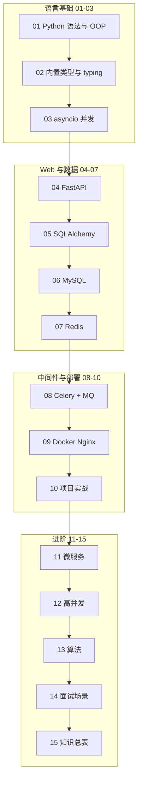

# Python 后端学习路线图与说明

> **文件编码**：本文件夹内所有 `.md` 均为 **UTF-8**。Python 源文件建议 UTF-8，编辑器右下角确认编码为 UTF-8。

---

## 1. 这套资料适合谁

- 想走 **Python 后端** 路线的大学生或转行初学者
- 已学完或并行学习 [前端 HTML/CSS/JS](../../前端学习/HTML%20CSS%20JS/00-学习路线图与说明.md) 的同学（前后端联调会更顺）
- 目标：能写 FastAPI 接口、操作 MySQL/Redis、理解面试高频考点

**不适合**：已多年微服务架构经验、仅想查某一中间件 API 的资深开发者。

### 与 Java 路线的关系

本仓库同时提供 [Java 后端](../Java/00-学习路线图与说明.md) 与 **Python 后端** 两条路线，**技术栈不同、能力目标一致**：

| 维度 | Java 路线 | Python 路线（本文件夹） |
|------|-----------|-------------------------|
| Web 框架 | Spring Boot | FastAPI |
| ORM | MyBatis | SQLAlchemy |
| 包管理 | Maven | pip / uv + venv |
| 并发模型 | 线程池 + JVM | asyncio + GIL 入门 |
| 消息队列 | RabbitMQ | Celery + RabbitMQ |
| 数据库/缓存/部署 | MySQL、Redis、Docker | 相同 |

**Web 后端选 Java 或 Python 一条主线学透即可**；MySQL、Redis、HTTP、Docker 等通用知识两路线可互相参照。系统/算法/性能见 [C++ 00](../C++/00-学习路线图与说明.md)；**数据结构原理与刷题**见 [数据结构 00](../数据结构/00-学习路线图与说明.md)（与各语言 13 章配合）。

---

## 2. 技术栈主线（本资料默认路线）

```text
Python 语言基础
  → 内置类型 / 模块 / 类型注解
  → asyncio 与并发入门
  → FastAPI Web 开发
  → SQLAlchemy + MySQL
  → Redis 缓存
  → Celery + RabbitMQ 消息队列
  → Linux / Docker / Nginx 部署
  → 微服务与多服务协作入门
  → 高并发与分布式概念
  → 项目实战 + 算法 + 面试
```

与前端的关系：

| 前端 | 后端（对应） |
|------|--------------|
| HTTP、状态码、JSON | 04 FastAPI 接口、10 联调 |
| fetch、Token | 登录鉴权、JWT |
| 表单提交 | 路由接参、Pydantic 校验 |
| 本地存储 | Redis、Session |
| Vue 3 / React | 04 FastAPI 返回 JSON（见 [Vue 08](../../前端学习/Vue/08-Axios网络请求与前后端联调.md)、[React 08](../../前端学习/React/08-Axios网络请求与前后端联调.md)） |

---

## 3. 学习顺序（按编号）

```text
00 学习路线图（你现在在这里）
 ↓
01 Python 基础语法与面向对象
 ↓
02 Python 内置类型、模块与类型注解
 ↓
03 Python 并发编程与 asyncio
 ↓
04 FastAPI 核心开发
 ↓
05 SQLAlchemy 事务与接口工程化
 ↓
06 MySQL 基础、索引与事务
 ↓
07 Redis 核心原理与缓存实战
 ↓
08 Celery 与消息队列实战
 ↓
09 Linux、Docker、Nginx 部署基础
 ↓
10 后端项目实战与面试准备
 ↓
11 微服务与多服务协作基础
 ↓
12 高并发与分布式系统基础
 ↓
13 算法与数据结构基础
 ↓
14 高频场景设计与面试专题
 ↓
15 补充知识点总表（复习索引）
```

### 阶段目标

| 阶段 | 文档 | 目标 |
|------|------|------|
| 语言 | 01~03 | 能写 Python，懂 OOP、dict/list、async 基础 |
| 框架 | 04~05 | 能搭 FastAPI 项目，写 CRUD 接口 |
| 数据 | 06~07 | 会建表、写 SQL、用 Redis 做缓存 |
| 中间件 | 08~09 | 会用 Celery/MQ、能 Docker 部署 |
| 进阶 | 10~12 | 能做完整项目，懂微服务与高并发概念 |
| 冲刺 | 13~15 | 刷算法、场景题、查漏 |

---

## 3.1 各章衔接索引（上一章产出 → 本章解决什么）

| 编号 | 上一章学了什么 | 本章要解决什么 |
|------|----------------|----------------|
| 01 | 00 路线图：知道学什么、用什么工具 | 写第一个 Python 程序，掌握 OOP 基础 |
| 02 | 01 语法与 OOP：能写类和方法 | 日常开发必用的 list/dict、模块、类型注解 |
| 03 | 02 数据结构：同步代码跑通 | asyncio、GIL、多线程/多进程入门 |
| 04 | 03 并发：在解释器里跑 Python | 对外提供 HTTP 接口，进入 Web 后端 |
| 05 | 04 FastAPI：接口在内存里 | SQLAlchemy 连 MySQL，数据持久化 + 事务 |
| 06 | 05 会写 ORM/SQL | 表设计、索引、B+ 树、事务隔离 |
| 07 | 06 MySQL 持久化但磁盘慢 | Redis 缓存扛热点读 |
| 08 | 07 Redis 解决读快 | Celery 异步解耦写后附属操作 |
| 09 | 08 本地跑通全栈 | Linux/Docker/Nginx 部署上线 |
| 10 | 01～09 技术栈齐备 | 串成完整项目 + 联调 + 面试准备 |
| 11 | 10 单体项目能讲清楚 | 何时拆分微服务、网关与 RPC 概念 |
| 12 | 11 微服务概念 | 高并发、分布式一致性、限流熔断 |
| 13 | 12 架构概念 | 算法刷题，支撑 14 面试 |
| 14 | 13 算法 + 04～12 技术 | 登录/下单/缓存等场景设计题 |
| 15 | 01～14 全部过完 | 复习索引，查漏补缺 |

---

## 3.2 demo 项目演进路线（04～09 共用同一个项目）

跟着文档做的话，建议始终维护一个叫 `demo-api` 的 FastAPI 项目，逐章叠加能力：

```text
04 章  demo-api 启动 + Router/Service 分层 + 内存 list CRUD
  ↓
05 章  + SQLAlchemy + MySQL，内存 list 换成 ORM
  ↓
06 章  完善表设计、索引、用 Docker 起 study-mysql
  ↓
07 章  + Redis 缓存（商品/用户详情 Cache Aside）
  ↓
08 章  + Celery + RabbitMQ（下单后发异步消息）
  ↓
09 章  uvicorn 部署 + docker-compose 一键起 MySQL/Redis/MQ + Nginx 反代
  ↓
10 章  扩展为完整练手项目（登录、商品、下单）
```

各章「手把手」小节入口：04-2.1、05-7.1、06-4.1、07-2.1、08-4.1、09-§37。

---

## 3.3 资料建设进度

| 编号 | 文件名 | 建设状态 |
|------|--------|----------|
| 00 | 学习路线图与说明 | ✅ 已建立 |
| 01 | Python 基础与 OOP | ✅ 已建立 |
| 02 | 内置类型模块与类型注解 | ✅ 已建立 |
| 03 | 并发与 asyncio | ✅ 已建立 |
| 04 | FastAPI 核心 | ✅ 已建立 |
| 05 | SQLAlchemy 与工程化 | ✅ 已建立 |
| 06 | MySQL 索引与事务 | ✅ 已建立 |
| 07 | Redis 缓存实战 | ✅ 已建立 |
| 08 | Celery 与 MQ 实战 | ✅ 已建立 |
| 09 | Linux Docker Nginx | ✅ 已建立 |
| 10 | 项目实战与面试 | ✅ 已建立 |
| 11 | 微服务协作基础 | ✅ 已建立 |
| 12 | 高并发与分布式 | ✅ 已建立 |
| 13 | 算法与数据结构 | ✅ 已建立 |
| 14 | 场景设计与面试 | ✅ 已建立 |
| 15 | 补充知识点总表 | ✅ 已建立 |

> 06～09 章与 [Java 06～09](../Java/06-MySQL基础索引与事务.md) 在 MySQL/Redis/Docker 概念上高度重合，可先读 Python 版实操，概念不懂时对照 Java 版加深理解。

---

## 4. 必备环境与工具

### 4.1 Python

- 推荐 **Python 3.11** 或 **Python 3.12**
- 验证：

```powershell
python --version
# 预期输出（示例）：
# Python 3.12.x

python -m pip --version
# 预期输出（示例）：
# pip 24.x.x from ... (python 3.12)
```

若提示 `'python' 不是内部或外部命令`：安装时勾选 **Add Python to PATH**，或手动把 Python 安装目录加入系统 `Path`。

### 4.2 编辑器 / IDE

- 推荐 **VS Code / Cursor** + Python 扩展，或 **PyCharm Community**
- 必会：运行 `.py` 文件、断点调试、终端里 `pip install`、REST Client 或 Swagger 测接口

### 4.3 包管理与虚拟环境

- **venv**（标准库）+ **pip**；进阶可用 **uv**（更快）
- 每个项目独立虚拟环境，不要把依赖装到全局 Python

```powershell
# 创建并激活虚拟环境（Windows PowerShell）
python -m venv .venv
.\.venv\Scripts\Activate.ps1
# 预期：命令行前出现 (.venv)

pip install fastapi uvicorn
# 预期：Successfully installed fastapi-x.x.x uvicorn-x.x.x ...
```

### 4.4 数据库与中间件（学到对应章节再装）

| 组件 | 用途 | 建议 |
|------|------|------|
| MySQL 8 | 关系型数据库 | 本地或 Docker |
| Redis | 缓存 | Docker 一条命令即可 |
| RabbitMQ | 消息队列 | Docker 或本地安装 |
| Docker | 容器化部署 | 09 篇详讲 |
| Postman / Apifox | 测接口 | 与前端 fetch 对照 |

### 4.5 Git

与前端相同：练习项目从第一天就 `git init`，每天至少一次有意义的 commit。

---

### 4.6 环境一键验证清单（学到对应章节前完成）

**01 章前（Python 基础）**：

```powershell
python --version
python -c "print('Hello Python')"
# 预期输出：
# Python 3.11.x 或 3.12.x
# Hello Python
```

**04 章前（FastAPI）**：

```powershell
python -m venv .venv
.\.venv\Scripts\Activate.ps1
pip install "fastapi[standard]" uvicorn
python -c "import fastapi; print(fastapi.__version__)"
# 预期：打印版本号，如 0.115.x，无 ImportError
```

**06 章前（MySQL）**：

```powershell
docker run -d --name study-mysql -p 3306:3306 -e MYSQL_ROOT_PASSWORD=123456 -e MYSQL_DATABASE=study_db mysql:8.0
docker ps
# 预期：study-mysql 状态 Up，端口 0.0.0.0:3306->3306/tcp
```

**07 章前（Redis）**：

```powershell
docker run -d --name study-redis -p 6379:6379 redis:7
docker exec study-redis redis-cli PING
# 预期输出：PONG
```

**08 章前（RabbitMQ）**：

```powershell
docker run -d --name study-rabbitmq -p 5672:5672 -p 15672:15672 rabbitmq:3-management
# 浏览器打开 http://localhost:15672  账号 guest / guest
```

**09 章前（Docker Compose）**：

```powershell
docker compose version
# 预期输出：Docker Compose version v2.x.x
```

---

## 5. 推荐学习四步法（每章都做）

1. **通读**：这章解决什么问题？和上一章什么关系？
2. **敲 demo**：文档里的代码完整敲一遍，不要只复制
3. **做小练习**：章节末尾「分级练习」至少完成基础档
4. **复述**：合上书，用自己的话讲给空气听，或写 5 条笔记

---

## 5.1 全路线分级练习总表

| 章节 | 基础 | 进阶 | 挑战 | 答案位置 |
|------|------|------|------|----------|
| 01 | 计算器函数 | Student + Course | 银行账户转账 | 01 篇 §17 参考答案 |
| 02 | dict 统计词频 | 模块拆分项目 | LRU 缓存 | 02 篇 §17 参考答案 |
| 03 | asyncio 并发打印 | Semaphore 限流 | async HTTP 请求 | 03 篇 §15 参考答案 |
| 04 | 内存 CRUD 用户 | 接 MySQL + SQLAlchemy | JWT + 依赖注入 | 04 篇 §15 参考答案 |
| 05 | 用户 CRUD + 分页 | 订单 + 扣库存事务 | Alembic 迁移 | 05 篇 §15 参考答案 |
| 06 | 三表 + 测试数据 | 订单列表 EXPLAIN | 索引前后对比 | 06 篇练习参考答案 |
| 07 | redis-cli ZSet | 商品详情缓存 | SETNX 锁 | 07 篇练习参考答案 |
| 08 | Celery 收发 demo | 下单异步消息 | 可靠消费 | 08 篇练习参考答案 |
| 09 | uvicorn 运行 | docker-compose 全栈 | Nginx 反代 | 09 篇练习参考答案 |
| 12 | 限流思路 | CAP 案例 | 秒杀方案 | 12 篇练习参考答案 |
| 13 | 数组/哈希 Easy | 链表/栈 Easy | 树 Easy | 13 篇题单 |

建议：**每章至少完成「基础」档**，04～07 四章的「进阶」档串起来就是 mini 全栈项目。

---

## 6. 学习时间参考（每天 2~3 小时）

| 文档 | 建议天数 | 说明 |
|------|----------|------|
| 01 | 5~7 天 | 多写 OOP 小练习 |
| 02 | 4~6 天 | dict/list 方法要手写 |
| 03 | 4~6 天 | asyncio 先懂概念再写 demo |
| 04 | 6~9 天 | 每天写一个接口 |
| 05 | 5~7 天 | 接 SQLAlchemy 做 CRUD |
| 06 | 7~10 天 | SQL 在客户端多敲 |
| 07 | 5~7 天 | 缓存场景要练 |
| 08 | 4~6 天 | Celery 发收消息 demo |
| 09 | 4~6 天 | 部署自己的 API |
| 10 | 10~14 天 | 综合项目 |
| 11~12 | 各 4~6 天 | 概念为主 |
| 13~14 | 持续 | 面试前反复看 |

**全程约 3~5 个月**（含一个完整练手项目）。Python 语法上手通常比 Java 快，但框架与工程化仍需同样时间投入。

---

## 7. 练手项目建议（10 篇前后启动）

选一个主线做完，比泛泛看十遍文档有用：

### 方案 A：电商简化版（推荐）

- 用户注册登录（JWT）
- 商品列表、详情（MySQL + Redis 缓存）
- 下单、库存扣减（事务）
- 订单超时关闭（Celery 或定时任务）

### 方案 B：博客 / 论坛 API

- 文章 CRUD、分页
- 评论、点赞
- 文件上传（可选）

### 方案 C：待办 / 笔记 API

- 与前端 08、12 篇待办列表联调
- 练 RESTful 设计

项目目录建议：

```text
demo-api/
├── app/
│   ├── main.py              ← FastAPI 入口
│   ├── routers/             ← 路由（类似 Controller）
│   ├── services/            ← 业务逻辑
│   ├── models/              ← SQLAlchemy 模型
│   ├── schemas/             ← Pydantic 入参/出参
│   └── core/                ← 配置、依赖、异常
├── sql/schema.sql
├── requirements.txt
├── .env
└── README.md
```

---

## 8. 学完后你应该能做哪些事

- [ ] 独立创建 FastAPI 项目，分层写 CRUD 接口
- [ ] 设计 MySQL 表，写索引，用 EXPLAIN 看执行计划
- [ ] 用 Redis 做缓存，能说清穿透/击穿/雪崩及对策
- [ ] 用 Celery + RabbitMQ 做简单异步解耦
- [ ] 用 Docker 跑 MySQL/Redis，Nginx 反代 uvicorn
- [ ] 用 Postman / Swagger UI 测接口，能和前端 JSON 联调
- [ ] 回答登录、下单、缓存一致性等场景设计题

---

## 9. 常见问题 FAQ

### Q1：要先学完前端再学后端吗？

不强制，但 **HTTP、JSON、接口概念** 先懂会更顺。可前端 01~09 + 后端 01~04 并行。

### Q2：Python 后端和 Java 后端选哪个？

- **Python**：语法简洁、AI/数据方向多、FastAPI 开发效率高、中小团队常见
- **Java**：企业存量项目多、大型系统岗位多、Spring 生态最成熟

本仓库两条路线都提供，**选一条学透**；通用知识（MySQL、Redis、HTTP）可互参。

### Q3：Django 还是 FastAPI？

本路线默认 **FastAPI**：异步友好、自动生成 OpenAPI 文档、与前后端 JSON 联调体验好。Django 适合需要内置 Admin、模板渲染的全栈场景，可在 15 篇索引中延伸。

### Q4：必须学微服务吗？

初学先把 **单体 FastAPI + MySQL + Redis** 做透。11、12 篇先建立概念，工作中再深入。

### Q5：和前端联调跨域？

FastAPI 内置 CORS 中间件，或开发环境用前端代理。见 04 篇与 [计算机网络 06](../../前端学习/计算机网络/06-缓存Cookie与会话机制.md)。

---

## 10. 文档索引速查

| 编号 | 文件名 | 一句话 | 篇幅 |
|------|--------|--------|------|
| 00 | 学习路线图与说明 | 怎么学、顺序、环境 | 入门 |
| 01 | Python 基础与 OOP | 语言入门 | 详 |
| 02 | 内置类型模块与类型注解 | 数据结构 + typing | 详 |
| 03 | 并发与 asyncio | 异步与 GIL | 详 |
| 04 | FastAPI 核心 | Web 接口开发 | 详 |
| 05 | SQLAlchemy 与工程化 | 持久层 | 详 |
| 06 | MySQL 索引与事务 | 数据库核心 | 详 |
| 07 | Redis 缓存实战 | 缓存 | 详 |
| 08 | Celery 与 MQ 实战 | 消息队列 | 详 |
| 09 | Linux Docker Nginx | 部署 | 详 |
| 10 | 项目实战与面试准备 | 串联落地 | 详 |
| 11 | 微服务协作基础 | 架构入门 | 详 |
| 12 | 高并发与分布式 | 扩展概念 | 详 |
| 13 | 算法与数据结构 | 面试刷题 | 详 |
| 14 | 场景设计与面试 | 场景题 | 详 |
| 15 | 补充知识点总表 | 复习索引 | 索引 |

---

## 11. 我的笔记区

```text
学习开始日期：
当前进度（编号）：
薄弱点：
练手项目选题：
下周计划：
```

---

## 12. 学习路径总览



---

祝你学习顺利。**后端能力 = 语言基础 + 框架熟练 + 数据库与缓存 + 一个能讲清楚的项目。**
