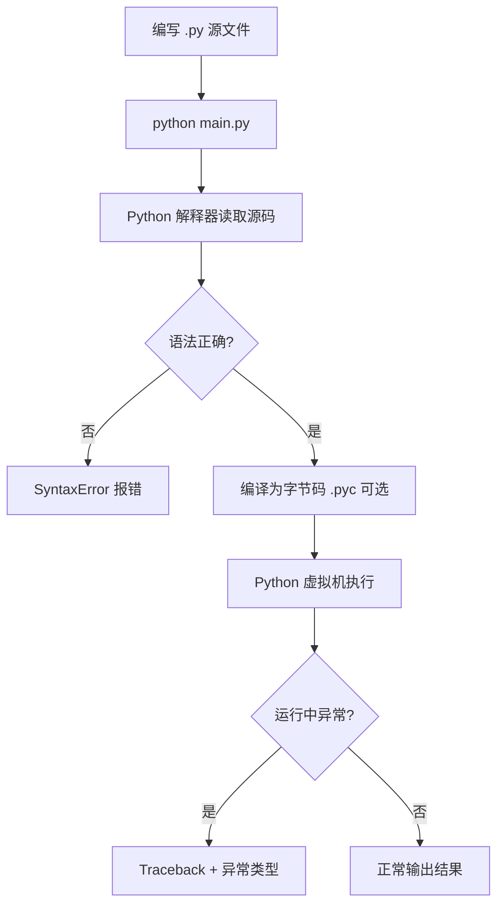

# Python 基础语法与面向对象

## 本章与上一章的关系

00 路线图告诉你「学什么、按什么顺序、用什么工具」——这一章就是正式出发的第一步。

后端开发最终都要写 Python 代码，FastAPI、SQLAlchemy 本质上都是 Python 库。把这一章打牢，后面写 Router、Service 才不会被语法绊住。本章目标很具体：能在编辑器里创建项目、写函数和类、理解封装/继承/多态，并完成几个小练习。

---

## 1. 这份文档学什么

这一份不是路线图，而是你可以直接拿来学的内容。

学完这一份，你应该能做到：

- 看懂并写出基础 Python 代码
- 理解函数、类、封装、继承、多态
- 具备继续学习 FastAPI 的语言基础

---

## 2. Python 是什么

Python 是一门**解释型、面向对象**的编程语言，特点是：

- 语法简洁，可读性高
- 生态丰富（Web、AI、自动化、数据分析）
- 后端岗位需求稳定（FastAPI、Django、Flask）

Python 后端开发里最常见的场景是：

- 写 HTTP 接口
- 处理业务逻辑
- 操作数据库
- 调用缓存和中间件

所以你先不要把 Python 理解成「为了学语法而学语法」，而要理解成「后端项目开发的主语言之一」。

### Python 与 Java 的快速对照（帮你建立迁移感）

| 概念 | Java | Python |
|------|------|--------|
| 入口 | `public static void main` | `if __name__ == "__main__":` |
| 类型声明 | 强类型，必须写 `int x` | 动态类型，运行时推断 |
| 缩进 | 花括号 `{}` | **缩进**（4 空格） |
| 访问控制 | `private/public` | 约定 `_` 前缀表示「内部使用」 |
| 接口 | `interface` | 鸭子类型 + `Protocol`（02 章详讲） |

---

## 3. 第一个 Python 程序

```python
def main():
    print("Hello Python")


if __name__ == "__main__":
    main()
```

### 代码解释

- `def main():` 定义一个函数
- `print()` 输出内容到控制台
- `if __name__ == "__main__":` 表示「直接运行本文件时才执行」，被 import 时不执行

你要先习惯 Python 的几个特点：

- **缩进代表代码块**（通常 4 个空格），不能混用 Tab 和空格
- 语句结尾**一般不需要分号**
- 大小写敏感：`Name` 和 `name` 是不同变量

---

## 3.1 手把手：创建并运行第一个 Python 项目

### 第一步：确认 Python 已安装

在 PowerShell 或终端执行：

```powershell
python --version
# 预期输出：
# Python 3.11.x 或 Python 3.12.x
```

若没有，去 [python.org](https://www.python.org/downloads/) 下载，安装时勾选 **Add Python to PATH**。

### 第二步：创建项目目录

```powershell
mkdir hello-python
cd hello-python
python -m venv .venv
.\.venv\Scripts\Activate.ps1
# 预期：命令行前出现 (.venv)
```

> 若 PowerShell 提示无法运行脚本，先执行：`Set-ExecutionPolicy -Scope CurrentUser RemoteSigned`

### 第三步：项目目录结构

```text
hello-python/
├── .venv/              ← 虚拟环境（不要提交到 Git）
└── main.py             ← 你要创建的源文件
```

### 第四步：创建 main.py

用 VS Code / Cursor 新建 `main.py`，写入：

```python
def main():
    print("Hello Python")


if __name__ == "__main__":
    main()
```

### 第五步：运行

```powershell
python main.py
# 预期输出：
# Hello Python
```

### 第六步：故意制造语法错误（练排查）

删掉冒号再运行：

```python
def main()   # 故意去掉 :
    print("Hello Python")
```

```text
# 预期报错：
SyntaxError: expected ':'
```

把冒号加回去即可。这类语法错误在 01 章非常常见，习惯看编辑器红色波浪线和终端报错行号。

---

## 4. 变量和数据类型

### 4.1 什么是变量

变量就是程序运行时用来存储数据的名称。

```python
age = 18
price = 99.9
name = "Tom"
is_pass = True
```

Python 是**动态类型**：不需要写 `int age = 18`，类型由赋值决定。

### 4.2 基本数据类型

你先重点掌握这几个：

| 类型 | 示例 | 说明 |
|------|------|------|
| `int` | `18`, `-1`, `0` | 整数，无大小上限（大整数自动支持） |
| `float` | `99.9`, `3.14` | 浮点数 |
| `bool` | `True`, `False` | 布尔值，首字母大写 |
| `str` | `"Tom"`, `'你好'` | 字符串 |
| `None` | `None` | 空值，类似 Java 的 `null` |

```python
print(type(age))       # <class 'int'>
print(type(price))     # <class 'float'>
print(type(name))      # <class 'str'>
print(type(is_pass))   # <class 'bool'>
```

### 4.2.1 深入：为什么后端里金额不用 float？

```python
# 浮点数有精度问题
print(0.1 + 0.2)  # 0.30000000000000004
```

金融、订单金额在后端应使用 **`Decimal`**（02 章详讲）或数据库存 `DECIMAL` 类型，避免 `0.1 + 0.2 != 0.3` 的坑。

### 4.3 类型转换

```python
s = "123"
n = int(s)          # 123
f = float("99.9")   # 99.9
text = str(100)     # "100"
```

转换失败会抛 `ValueError`：

```python
int("abc")  # ValueError: invalid literal for int() with base 10: 'abc'
```

---

## 5. 运算符

### 5.1 算术运算符

```python
a, b = 10, 3
print(a + b)   # 13
print(a - b)   # 7
print(a * b)   # 30
print(a / b)   # 3.3333...  除法结果是 float
print(a // b)  # 3          整除
print(a % b)   # 1          取余
print(a ** b)  # 1000       幂运算
```

### 5.2 比较与逻辑

```python
print(5 > 3)              # True
print(5 == 5)             # True
print(5 != 3)             # True
print(True and False)     # False
print(True or False)      # True
print(not True)           # False
```

### 5.3 成员与身份

```python
nums = [1, 2, 3]
print(2 in nums)      # True
print(10 not in nums) # True

a = [1, 2]
b = [1, 2]
c = a
print(a == b)   # True  值相等
print(a is b)   # False 不是同一个对象
print(a is c)   # True  同一引用
```

---

## 6. 流程控制

### 6.1 if / elif / else

```python
score = 85

if score >= 90:
    grade = "优秀"
elif score >= 80:
    grade = "良好"
elif score >= 60:
    grade = "及格"
else:
    grade = "不及格"

print(grade)  # 良好
```

注意：**冒号 + 缩进** 是 Python 的代码块语法，不能省略。

### 6.2 for 循环

```python
# 遍历 range
for i in range(1, 6):   # 1, 2, 3, 4, 5
    print(i)

# 遍历列表
fruits = ["apple", "banana", "cherry"]
for fruit in fruits:
    print(fruit)

# 带索引
for index, fruit in enumerate(fruits):
    print(index, fruit)
```

### 6.3 while 循环

```python
count = 0
while count < 3:
    print(count)
    count += 1
```

### 6.4 break 与 continue

```python
for i in range(10):
    if i == 3:
        continue   # 跳过本次
    if i == 7:
        break      # 跳出循环
    print(i)
# 输出：0 1 2 4 5 6
```

---

## 7. 函数

### 7.1 定义与调用

```python
def greet(name):
    return f"Hello, {name}"


message = greet("Tom")
print(message)  # Hello, Tom
```

- `def` 定义函数
- `return` 返回值；不写 return 则返回 `None`
- `f"..."` 是 f-string，花括号里放变量（Python 3.6+）

### 7.2 默认参数

```python
def power(base, exp=2):
    return base ** exp


print(power(3))      # 9
print(power(3, 3))   # 27
```

**注意**：默认参数不要用可变对象（如 `[]`）做默认值，02 章会解释常见坑。

### 7.3 关键字参数

```python
def create_user(name, age, city="北京"):
    return {"name": name, "age": age, "city": city}


user = create_user(age=20, name="张三")
print(user)  # {'name': '张三', 'age': 20, 'city': '北京'}
```

后端接口里，FastAPI 也会用类似方式接收查询参数和请求体字段。

### 7.4 可变参数

```python
def total(*args):
    return sum(args)


print(total(1, 2, 3, 4))  # 10


def print_info(**kwargs):
    for key, value in kwargs.items():
        print(f"{key} = {value}")


print_info(name="Tom", age=18)
# name = Tom
# age = 18
```

---

## 8. 字符串常用操作

```python
s = "  Hello Python  "

print(s.strip())           # "Hello Python"
print(s.lower())           # "  hello python  "
print(s.replace("Python", "World"))
print("Python" in s)       # True
print(s.split())           # ['Hello', 'Python']  按空白分割

# 切片：[start:end:step]，end 不包含
text = "abcdef"
print(text[0:3])   # abc
print(text[::-1])  # fedcba  反转
```

后端开发中，字符串常用于：路径拼接、日志输出、JSON 序列化前的简单处理。复杂拼接优先用 f-string。

---

## 9. 列表与字典入门

详细 API 在 02 章系统讲，这里先建立直觉。

### 9.1 列表 list

有序、可变、可重复：

```python
nums = [1, 2, 3]
nums.append(4)
nums[0] = 10
print(nums)        # [10, 2, 3, 4]
print(len(nums))   # 4
```

### 9.2 字典 dict

键值对，键通常是不可变类型（str、int、tuple 等）：

```python
user = {"id": 1, "name": "Tom", "age": 18}
user["email"] = "tom@example.com"
print(user["name"])           # Tom
print(user.get("phone"))      # None，键不存在不报错
print(user.get("phone", "无")) # 无，带默认值
```

后端接口返回 JSON，在 Python 里经常就是 dict / list 结构。

---

## 10. 面向对象基础

### 10.1 类与对象

```python
class Dog:
    def __init__(self, name, age):
        self.name = name
        self.age = age

    def bark(self):
        return f"{self.name} says: 汪汪!"


dog = Dog("旺财", 3)
print(dog.bark())   # 旺财 says: 汪汪!
print(dog.name)     # 旺财
```

- `class` 定义类
- `__init__` 是构造方法，创建对象时自动调用
- `self` 代表当前实例，必须作为第一个参数
- 通过 `.` 访问属性和方法

### 10.2 封装

Python 没有 Java 式的 `private`，用**命名约定**：

```python
class BankAccount:
    def __init__(self, owner, balance):
        self.owner = owner
        self._balance = balance   # 单下划线：内部使用，别从外部直接改

    def deposit(self, amount):
        if amount <= 0:
            raise ValueError("存款金额必须大于 0")
        self._balance += amount

    def get_balance(self):
        return self._balance


account = BankAccount("张三", 1000)
account.deposit(500)
print(account.get_balance())  # 1500
```

后端 Service 层也会把「对外接口」和「内部实现细节」分开，思想与封装一致。

### 10.3 继承

```python
class Animal:
    def __init__(self, name):
        self.name = name

    def speak(self):
        return "..."


class Cat(Animal):
    def speak(self):
        return f"{self.name}: 喵喵"


class Dog(Animal):
    def speak(self):
        return f"{self.name}: 汪汪"


animals = [Cat("小花"), Dog("旺财")]
for a in animals:
    print(a.speak())
# 小花: 喵喵
# 旺财: 汪汪
```

子类 `Cat(Animal)` 继承父类，可**重写** `speak` 方法。

### 10.4 多态

上面 `animals` 列表里放不同子类，调用同一方法 `speak()` 表现不同——这就是多态。后端里常见：不同支付方式实现同一 `pay()` 接口。

### 10.5 类属性 vs 实例属性

```python
class User:
    role = "user"   # 类属性，所有实例共享

    def __init__(self, name):
        self.name = name   # 实例属性


u1 = User("Tom")
u2 = User("Jerry")
User.role = "member"
print(u1.role, u2.role)  # member member
```

---

## 11. 模块与 import

把代码拆到不同文件，便于维护：

**utils.py**

```python
def add(a, b):
    return a + b
```

**main.py**

```python
from utils import add

print(add(1, 2))  # 3
```

常用写法：

```python
import math
print(math.sqrt(16))  # 4.0

from datetime import datetime
print(datetime.now())
```

02 章会讲包结构、`__init__.py`、相对导入——FastAPI 项目里 `app/routers/`、`app/services/` 都依赖模块组织。

---

## 12. 异常处理

### 12.1 try / except

```python
def divide(a, b):
    try:
        result = a / b
    except ZeroDivisionError:
        return "除数不能为 0"
    except TypeError:
        return "参数类型错误"
    else:
        return result      # 无异常时执行
    finally:
        pass               # 无论是否异常都会执行（关文件、释放资源）


print(divide(10, 2))   # 5.0
print(divide(10, 0))   # 除数不能为 0
```

### 12.2 主动抛出异常

```python
def withdraw(balance, amount):
    if amount <= 0:
        raise ValueError("取款金额必须大于 0")
    if balance < amount:
        raise ValueError(f"余额不足，当前余额：{balance}")
    return balance - amount


try:
    withdraw(100, 200)
except ValueError as e:
    print(e)  # 余额不足，当前余额：100
```

### 12.3 自定义异常

```python
class InsufficientBalanceError(Exception):
    pass


class BankAccount:
    def __init__(self, owner, balance):
        self.owner = owner
        self._balance = balance

    def withdraw(self, amount):
        if amount <= 0:
            raise ValueError("取款金额必须大于 0")
        if self._balance < amount:
            raise InsufficientBalanceError(
                f"余额不足，当前余额：{self._balance}"
            )
        self._balance -= amount
```

FastAPI 里会用 `HTTPException` 或全局异常处理器，把业务异常转成统一 JSON 错误响应（04 章）。

---

## 13. 文件读写入门

```python
# 写文件
with open("note.txt", "w", encoding="utf-8") as f:
    f.write("第一行\n")
    f.write("第二行\n")

# 读文件
with open("note.txt", "r", encoding="utf-8") as f:
    content = f.read()
    print(content)
```

- `with` 语句自动关闭文件，即使发生异常
- 中文文件务必指定 `encoding="utf-8"`

---

## 14. 后端思维小例子：用户领域模型

把 OOP 和异常串起来，模拟后端里常见的「领域对象」：

```python
class User:
    def __init__(self, user_id, username, password_hash):
        self.user_id = user_id
        self.username = username
        self._password_hash = password_hash
        self.status = "ACTIVE"

    def deactivate(self):
        if self.status == "DISABLED":
            raise ValueError("用户已禁用")
        self.status = "DISABLED"

    def to_dict(self):
        return {
            "userId": self.user_id,
            "username": self.username,
            "status": self.status,
        }


user = User(1, "tom", "hash_xxx")
user.deactivate()
print(user.to_dict())
# {'userId': 1, 'username': 'tom', 'status': 'DISABLED'}
```

`to_dict()` 类似后面返回给前端的 JSON 结构；04 章会用 Pydantic 模型替代手写 dict。

---

## 15. Python 程序执行流程（建立整体感）



与 Java 对比：Java 先 `javac` 编译成 `.class` 再 JVM 运行；Python 通常是**解释执行**（CPython），开发迭代更快，适合 Web 原型和脚本。

---

## 16. 常见报错与排查

| 报错信息（关键词） | 可能原因 | 解决方案 |
|-------------------|---------|---------|
| `'python' 不是内部或外部命令` | Python 未安装或未加入 PATH | 重装并勾选 Add to PATH，或手动配置环境变量 |
| `SyntaxError: expected ':'` | `if`/`def`/`class` 后漏冒号 | 看报错行号，补上 `:` |
| `IndentationError` | 缩进不一致或混用 Tab/空格 | 统一 4 空格；编辑器设「Insert Spaces」 |
| `NameError: name 'x' is not defined` | 变量未定义或拼写错误 | 检查变量名、作用域、是否先赋值 |
| `TypeError: unsupported operand type(s)` | 类型不匹配，如 str + int | 用 `int()`/`str()` 转换，或检查函数参数 |
| `IndexError: list index out of range` | 列表下标越界 | 检查 `len(list)` 和下标范围 |
| `KeyError: 'xxx'` | dict 键不存在 | 用 `.get(key, default)` 或先 `if key in d` |
| `ModuleNotFoundError: No module named 'xxx'` | 未安装包或虚拟环境未激活 | `pip install xxx`；确认 `(.venv)` 已激活 |
| `ValueError: invalid literal for int()` | 字符串无法转成数字 | 先校验输入再转换 |
| `AttributeError: 'NoneType' object has no attribute` | 对 `None` 调用了方法/属性 | 检查函数返回值、可选字段是否为空 |

---

## 17. 练习建议

### 基础

1. 写一个函数 `calc_bmi(weight_kg, height_m)`，返回 BMI 值（体重 ÷ 身高²）
2. 用 `for` 打印 1～100 内所有偶数
3. 定义 `Student` 类，包含姓名、学号、`add_score(course, score)` 方法

### 进阶

4. `Student` + `Course` 类：一个学生可选多门课，能打印选课列表
5. 读一个文本文件，统计每个单词出现次数（先用简单 split，02 章再优化）
6. 实现 `BankAccount`，支持存款、取款、转账，余额不足抛自定义异常

### 挑战

7. 命令行简易计算器：循环读用户输入，支持 `+ - * /`，输入 `q` 退出
8. 用类实现简易购物车：添加商品、删除、计算总价

---

## 18. 分级练习参考答案

### 基础：BMI 计算器

```python
def calc_bmi(weight_kg, height_m):
    if height_m <= 0 or weight_kg <= 0:
        raise ValueError("体重和身高必须大于 0")
    return round(weight_kg / (height_m ** 2), 2)


print(calc_bmi(70, 1.75))  # 22.86
```

### 基础：Student 类

```python
class Student:
    def __init__(self, name, student_id):
        self.name = name
        self.student_id = student_id
        self.scores = {}

    def add_score(self, course, score):
        if not 0 <= score <= 100:
            raise ValueError("分数必须在 0～100 之间")
        self.scores[course] = score

    def average(self):
        if not self.scores:
            return 0
        return sum(self.scores.values()) / len(self.scores)


s = Student("张三", "2024001")
s.add_score("Python", 92)
s.add_score("数学", 88)
print(s.average())  # 90.0
```

### 进阶：Student + Course

```python
class Course:
    def __init__(self, name, credit):
        self.name = name
        self.credit = credit


class Student:
    def __init__(self, name):
        self.name = name
        self.courses = []

    def enroll(self, course):
        self.courses.append(course)

    def show_courses(self):
        print(f"{self.name} 选修的课程：")
        for c in self.courses:
            print(f"  - {c.name}（{c.credit} 学分）")


s = Student("张三")
s.enroll(Course("Python 程序设计", 4))
s.enroll(Course("数据结构", 3))
s.show_courses()
```

### 挑战：银行账户 + 自定义异常

```python
class InsufficientBalanceError(Exception):
    pass


class BankAccount:
    def __init__(self, owner, initial_balance):
        self.owner = owner
        self._balance = initial_balance

    def deposit(self, amount):
        if amount <= 0:
            raise ValueError("存款金额必须大于 0")
        self._balance += amount

    def withdraw(self, amount):
        if amount <= 0:
            raise ValueError("取款金额必须大于 0")
        if self._balance < amount:
            raise InsufficientBalanceError(
                f"余额不足，当前余额：{self._balance}"
            )
        self._balance -= amount

    def transfer(self, target, amount):
        self.withdraw(amount)
        target.deposit(amount)

    @property
    def balance(self):
        return self._balance


a = BankAccount("张三", 1000)
b = BankAccount("李四", 500)
a.transfer(b, 300)
print(a.balance, b.balance)  # 700 800
```

---

## 19. 学完标准

完成以下自检后再进入 02 章：

- [ ] 能在虚拟环境里创建项目并运行 `python main.py`
- [ ] 熟练使用 `if/for/while`、函数定义与 f-string
- [ ] 能写 `class`，理解 `__init__`、`self`、继承与方法重写
- [ ] 会用 `try/except` 和 `raise` 处理异常
- [ ] 能独立完成「Student + Course」或「银行账户」练习
- [ ] 看到 `IndentationError`、`NameError` 知道如何排查

---

## 20. FAQ

**Q：`if __name__ == "__main__"` 必须写吗？**  
小脚本可不写；项目里建议写，避免被 import 时误执行测试代码。

**Q：Python 2 还要学吗？**  
不需要。Python 2 已停止维护，本资料全部基于 **Python 3.11+**。

**Q：先学 Django 还是直接 FastAPI？**  
先完成 01～03 语言基础，04 章从 FastAPI 入手；Django 可在 15 篇索引延伸。

**Q：和 Java 路线可以同时学吗？**  
可以，但建议**一条为主**。MySQL、HTTP 等通用知识可互参。

---

## 下一章预告

这一章你掌握了 Python 语法和 OOP——能写函数、类、继承、异常处理。但真实后端代码里，大量时间花在 **list、dict、模块拆分、类型注解** 上，而不是反复写 `class` 语法。

下一章（02 Python 内置类型、模块与类型注解）就是日常开发用得最多的能力：列表推导式、dict 统计、包结构、`typing` 与 Pydantic 前置知识。把这些练熟，后面 FastAPI 接 JSON、SQLAlchemy 返回查询结果，你才不会陌生。

---

*下一章：02 Python 内置类型、模块与类型注解*
