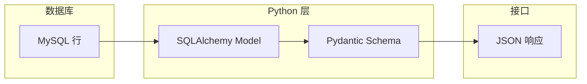

# Python 内置类型、模块与类型注解

<!-- 修改说明: 2026-06-30 按 EXPANSION-STANDARD 扩充 §0、FAQ≥12、闭卷自测、费曼检验 -->

## 0. 读前导读（零基础也能跟上）

### 0.1 用一句话弄懂本章

**一句话**：后端日常 80% 代码在操作 **list、dict、模块拆分和类型注解**——本章把这些练熟，后面 FastAPI 接 JSON、SQLAlchemy 返回行才不会陌生。

**生活类比**：

| 结构 | 生活类比 | 后端场景 |
|------|----------|----------|
| **list** | 购物清单（有序） | 用户列表、批量 ID |
| **dict** | 通讯录（键→值） | JSON 对象、配置项 |
| **模块** | 工具箱分格 | `routers/`、`services/` 分包 |
| **typing** | 快递单上写「易碎」 | 编辑器提示、Pydantic 前置 |

对照 [Java 02 集合与泛型](../Java/02-Java常用类集合与泛型.md)：`list`≈`ArrayList`，`dict`≈`HashMap`，但 Python 有**推导式**和**鸭子类型**。

---

### 0.2 你需要提前知道什么

| 水平 | 建议 |
|------|------|
| 刚学完 01 | 正常顺序学习 |
| 会 Java 集合 | 重点推导式、dict 默认方法、`from __future__ import annotations` |
| 想跳 FastAPI | **不可跳**——04 章 Pydantic 依赖本章 typing |

---

### 0.3 本章知识地图（学完后应能勾选全部 ☐→☑）

- [ ] 熟练使用 list/dict 推导式、Counter、defaultdict
- [ ] 金额用 Decimal，时间用 datetime
- [ ] 能拆分包结构，用 `python -m app.main` 运行
- [ ] 能写 `def f(x: int) -> str` 与 `list[str]`
- [ ] 理解 dataclass 与 04 章 Pydantic 的关系
- [ ] 完成词频统计 mini 项目
- [ ] 闭卷自测 ≥ 8/10

---

### 0.4 建议学习时长与节奏

| 阶段 | 时间 | 内容 |
|------|------|------|
| list/dict 核心 | 1～2 天 | §4～§8，手写 20 个小例子 |
| 模块与包 | 1 天 | §11～§14，词频项目 |
| typing/dataclass | 1～2 天 | §9～§10 |
| 练习+自测 | 1 天 | 分级练习 + 闭卷 |

---

### 0.5 学完本章你能做什么

1. 用 dict **统计词频**，输出 Top 5。
2. 把 01 章练习**拆成两个 .py 文件**并通过 import 调用。
3. 用 **Decimal** 计算订单金额，避免 `0.1+0.2` 浮点坑。
4. 为函数加上 **类型注解**，IDE 能提示参数类型。

---

## 本章与上一章的关系

01 章你学会了 Python 语法和 OOP——能写类和方法。但真实后端代码里，**80% 的时间在处理 list、dict、字符串、模块拆分和类型注解**，而不是反复写 `class` 语法。

这一章就是「Python 日常开发工具箱」：列表推导式、dict 统计、Decimal 金额、`datetime`、包结构、`typing` 与 Pydantic 前置知识。02 章练熟后，03 章学 asyncio 时你会理解「为什么 dict 不是线程安全的」，04 章 FastAPI 接 JSON 返回 `list[UserSchema]` 也不会陌生。

---

## 1. 为什么这部分很重要

后端项目里几乎每条接口路径都会用到：

- `list` / `dict` 组织数据
- 字符串解析与拼接
- `Decimal` 处理金额
- `datetime` 记录时间
- 模块拆分项目结构
- 类型注解让 IDE 和 FastAPI 帮你查错

---

## 2. list 深入

### 2.1 创建与常用方法

```python
nums = [1, 2, 3]
nums.append(4)           # 末尾追加
nums.insert(0, 0)        # 指定位置插入
nums.extend([5, 6])      # 合并另一个 list
nums.remove(3)           # 删除第一个值为 3 的元素
popped = nums.pop()      # 弹出末尾
print(nums.count(2))     # 计数
print(len(nums))
```

### 2.2 切片

```python
data = [0, 1, 2, 3, 4, 5]
print(data[1:4])    # [1, 2, 3]
print(data[:3])     # [0, 1, 2]
print(data[::2])    # [0, 2, 4]  步长 2
print(data[::-1])   # 反转
```

### 2.3 列表推导式

```python
squares = [x * x for x in range(1, 6)]
# [1, 4, 9, 16, 25]

evens = [x for x in range(20) if x % 2 == 0]

users = [{"id": 1, "name": "Tom"}, {"id": 2, "name": "Jerry"}]
names = [u["name"] for u in users]
```

后端常见：从 ORM 查询结果 `[User(...), ...]` 转成 `[UserSchema(...), ...]`。

### 2.3.1 列表推导式逐行读

```python
expensive = [
    o["name"]
    for o in orders
    if o["price"] * o["qty"] > 100
]
```

| 片段 | 含义 | 改错会怎样 |
|------|------|------------|
| `for o in orders` | 遍历订单行 | 漏 for → SyntaxError |
| `o["name"]` | 输出商品名 | key 错 → KeyError |
| `if ... > 100` | 过滤行金额 | 漏 if 则全部输出 |

**术语（list comprehension）**：一行语法从可迭代对象生成新 list。  
**生活类比**：从小票里只抄金额超过 100 的商品名。  
**为什么重要**：04 章 `return [Schema.model_validate(u) for u in users]` 是常态。  
**本章用到的地方**：§2.3、§16 练习。

### 2.3.2 与 Java 02 Stream 对照

| 需求 | Java 02 | Python 02 |
|------|---------|-----------|
| 过滤 | `stream().filter()` | `[x for x in xs if cond]` |
| 映射 | `map()` | `[f(x) for x in xs]` |
| 词频 | `Collectors.groupingBy` | `Counter` / dict |

### 2.4 深入：可变默认参数陷阱

```python
# 错误写法
def add_item(item, bucket=[]):
    bucket.append(item)
    return bucket

print(add_item(1))  # [1]
print(add_item(2))  # [1, 2]  ← 意外！共享同一个 list

# 正确写法
def add_item(item, bucket=None):
    if bucket is None:
        bucket = []
    bucket.append(item)
    return bucket
```

FastAPI 依赖注入里也要注意：不要用可变对象做默认参数。

---

## 3. dict 深入

### 3.1 创建与访问

```python
user = {"id": 1, "username": "tom", "age": 18}
user["email"] = "tom@example.com"
print(user.get("phone"))           # None
print(user.get("phone", "未设置"))  # 未设置

for key, value in user.items():
    print(key, value)
```

### 3.2 dict 推导式

```python
words = ["apple", "banana", "apple", "cherry"]
count = {}
for w in words:
    count[w] = count.get(w, 0) + 1
# {'apple': 2, 'banana': 1, 'cherry': 1}

# 推导式写法
from collections import Counter
count2 = dict(Counter(words))
```

### 3.3 defaultdict 与 Counter

```python
from collections import defaultdict, Counter

# defaultdict：键不存在时自动创建默认值
groups = defaultdict(list)
groups["admin"].append("tom")
groups["admin"].append("jerry")

# Counter：计数神器
text = "hello world"
c = Counter(text)
print(c.most_common(3))  # [('l', 3), ('o', 2), ('h', 1)]
```

### 3.4 合并 dict（3.9+）

```python
defaults = {"role": "user", "status": 1}
override = {"status": 0}
merged = defaults | override   # {'role': 'user', 'status': 0}
```

### 3.5 dict 术语三件套与 JSON 关系

**术语（dict 字典）**：键值对映射，Python 内置哈希表。  
**生活类比**：**通讯录**——姓名→电话，按名字 O(1) 查找。  
**为什么重要**：HTTP JSON 在 Python 里就是 dict/list；04 章请求体解析后首先是 dict。  
**本章用到的地方**：§3、§14 词频项目。

**术语（JSON）**：跨语言文本格式；`json.loads` → dict，`json.dumps` ← dict。  
**生活类比**：国际快递单——前端 JS、后端 Python 都认这张表。  
**为什么重要**：前后端联调、Redis 存缓存字符串，全是 JSON 序列化。  
**本章用到的地方**：§9 typing、07 章 Redis 缓存。

| 操作 | Python | Java 02 |
|------|--------|---------|
| 安全取值 | `d.get(k, default)` | `map.getOrDefault(k, v)` |
| 遍历 | `for k, v in d.items()` | `entrySet()` |
| 合并 | `a \| b` (3.9+) | `putAll` |
| 计数 | `Counter(words)` | `groupingBy` + `counting` |

### 3.6 dict 词频统计手把手

| 步骤 | 你的动作 | 预期看到什么 | 若不对 |
|------|----------|--------------|--------|
| 1 | 创建 `sample.txt` 几行英文 | 文件存在 | 路径错 |
| 2 | `read_text(encoding="utf-8")` | 得到 str | 乱码 → 指定 utf-8 |
| 3 | `text.lower().split()` | 单词 list | 标点未清洗可接受 |
| 4 | `Counter(words)` | 词频 dict | Import collections |
| 5 | `most_common(5)` | Top5 列表 | 空文件 → [] |

---

---

## 4. set 与 tuple

### 4.1 set：去重与集合运算

```python
tags = {"python", "backend", "python"}
print(tags)  # {'python', 'backend'}  自动去重

a = {1, 2, 3}
b = {3, 4, 5}
print(a & b)   # 交集 {3}
print(a | b)   # 并集 {1, 2, 3, 4, 5}
print(a - b)   # 差集 {1, 2}
```

### 4.2 tuple：不可变序列

```python
point = (10, 20)
x, y = point   # 解包

# 单元素 tuple 必须加逗号
t = (42,)
```

适合：函数返回多个值、dict 的 key（list 不能当 key）。

---

## 5. 字符串进阶

```python
s = "  hello@example.com  "
print(s.strip())
print(s.split("@"))           # ['  hello', 'example.com  ']
print(",".join(["a", "b", "c"]))  # a,b,c

# f-string 格式化
price = 99.5
print(f"价格：{price:.2f} 元")   # 价格：99.50 元

# removeprefix / removesuffix (3.9+)
url = "https://api.example.com/users"
print(url.removeprefix("https://"))
```

### 正则入门（后端校验）

```python
import re

phone = "13800138000"
if re.fullmatch(r"1[3-9]\d{9}", phone):
    print("手机号合法")

email = "tom@example.com"
if re.fullmatch(r"[\w.-]+@[\w.-]+\.\w+", email):
    print("邮箱格式 OK")
```

Pydantic 有更优雅的 `EmailStr` 校验（04 章），但理解正则仍有帮助。

---

## 6. Decimal 与金额

```python
from decimal import Decimal, ROUND_HALF_UP

price = Decimal("99.90")
count = Decimal("2")
total = price * count
print(total)  # 99.90 * 2 = 199.80  精确

# 四舍五入到 2 位
amount = Decimal("10.125")
print(amount.quantize(Decimal("0.01"), rounding=ROUND_HALF_UP))  # 10.13
```

**规则**：金额在 Python 用 `Decimal`，在 MySQL 用 `DECIMAL(10,2)`，**永远不要 `float` 做金额运算**。

---

## 7. datetime 与时间处理

```python
from datetime import datetime, date, timedelta, timezone

now = datetime.now()
today = date.today()
print(now.strftime("%Y-%m-%d %H:%M:%S"))

# 解析字符串
dt = datetime.strptime("2026-06-18 10:30:00", "%Y-%m-%d %H:%M:%S")

#  timedelta
tomorrow = today + timedelta(days=1)
week_ago = now - timedelta(days=7)

# UTC（后端存储推荐 UTC，展示再转本地时区）
utc_now = datetime.now(timezone.utc)
```

### 深入：为什么后端时间存 UTC？

服务器可能部署在不同时区，用户也在全球各地。统一存 UTC + 展示层转本地，避免「夏令时」「跨日统计错位」等问题。MySQL 用 `DATETIME` 或 `TIMESTAMP`，Java 用 `Instant`，Python 用带时区的 `datetime`。

---

## 8. 模块、包与项目结构

### 8.1 模块 import

```python
# utils/math_helper.py
def add(a: int, b: int) -> int:
    return a + b

# main.py
from utils.math_helper import add
# 或
import utils.math_helper as mh
```

### 8.2 包结构

```text
demo_pkg/
├── app/
│   ├── __init__.py      ← 标记 app 为包（可为空）
│   ├── main.py
│   ├── routers/
│   │   ├── __init__.py
│   │   └── user.py
│   └── services/
│       ├── __init__.py
│       └── user_service.py
├── tests/
└── requirements.txt
```

### 8.3 `if __name__ == "__main__"`

```python
# user_service.py
def get_user(user_id: int) -> dict:
    return {"id": user_id, "name": "Tom"}


if __name__ == "__main__":
    # 仅直接运行此文件时执行，被 import 时不执行
    print(get_user(1))
```

### 8.4 相对导入（包内）

```python
# app/routers/user.py
from ..services.user_service import get_user   # 上一级包
from . import common                            # 同包
```

---

## 9. 类型注解（typing）

Python 3.9+ 推荐用内置泛型写法；旧项目可能仍见 `typing.List`。

### 9.1 基础注解

```python
def greet(name: str) -> str:
    return f"Hello, {name}"


age: int = 18
scores: list[int] = [90, 85, 88]
user_map: dict[str, int] = {"tom": 1, "jerry": 2}
maybe_name: str | None = None   # 3.10+ 联合类型
```

### 9.2 TypedDict 与 dataclass

```python
from typing import TypedDict

class UserDict(TypedDict):
    id: int
    username: str
    age: int


from dataclasses import dataclass

@dataclass
class User:
    id: int
    username: str
    age: int

    def is_adult(self) -> bool:
        return self.age >= 18
```

`dataclass` 少写样板代码；FastAPI 更常用 **Pydantic BaseModel**（04 章）。

### 9.3 Optional 与 Union

```python
from typing import Optional

def find_user(user_id: int) -> Optional[dict]:
    if user_id <= 0:
        return None
    return {"id": user_id, "name": "Tom"}
```

### 9.4 泛型

```python
from typing import TypeVar, Generic

T = TypeVar("T")

class PageResult(Generic[T]):
    def __init__(self, items: list[T], total: int, page: int, size: int):
        self.items = items
        self.total = total
        self.page = page
        self.size = size
```

对应前端 TypeScript 的 `PageResult<T>` 与 Java 的 `Result<T>`。

### 9.5 Protocol（结构化类型）

```python
from typing import Protocol

class Payable(Protocol):
    def pay(self, amount: Decimal) -> bool: ...


def checkout(obj: Payable, amount: Decimal) -> bool:
    return obj.pay(amount)
```

类似 Java 的 interface，但 Python 是**鸭子类型**：只要对象有 `pay` 方法即可，不必显式继承。

---

## 10. 常用标准库速查

| 模块 | 用途 | 示例 |
|------|------|------|
| `json` | JSON 序列化 | `json.loads(s)` / `json.dumps(obj)` |
| `pathlib` | 路径操作 | `Path("data/a.txt").read_text()` |
| `os` / `sys` | 环境、退出码 | `os.getenv("DB_URL")` |
| `logging` | 日志 | `logging.info("user login")` |
| `enum` | 枚举 | `class Status(str, Enum): ACTIVE = "active"` |
| `functools` | 装饰器工具 | `@lru_cache` |
| `itertools` | 迭代工具 | `chain`, `groupby` |
| `copy` | 深拷贝 | `copy.deepcopy(d)` |

### json 示例

```python
import json

data = {"code": 0, "message": "ok", "data": {"id": 1}}
text = json.dumps(data, ensure_ascii=False)
print(text)
parsed = json.loads(text)
```

FastAPI 自动做 JSON 序列化，但脚本、测试、Celery 任务里常手动用 `json`。

### logging 示例

```python
import logging

logging.basicConfig(
    level=logging.INFO,
    format="%(asctime)s [%(levelname)s] %(message)s",
)
logger = logging.getLogger(__name__)

logger.info("服务启动")
logger.error("数据库连接失败", exc_info=True)
```

---

## 11. 枚举 Enum

```python
from enum import Enum

class OrderStatus(str, Enum):
    CREATED = "CREATED"
    PAID = "PAID"
    SHIPPED = "SHIPPED"
    CANCELLED = "CANCELLED"


def can_cancel(status: OrderStatus) -> bool:
    return status in (OrderStatus.CREATED, OrderStatus.PAID)


print(OrderStatus.PAID.value)  # PAID
```

继承 `str` 后，JSON 序列化直接输出字符串值，与 FastAPI 配合友好。

---

## 12. 装饰器入门

```python
import functools
import time

def timer(func):
    @functools.wraps(func)
    def wrapper(*args, **kwargs):
        start = time.perf_counter()
        result = func(*args, **kwargs)
        elapsed = time.perf_counter() - start
        print(f"{func.__name__} 耗时 {elapsed:.4f}s")
        return result
    return wrapper


@timer
def fetch_users():
    time.sleep(0.1)
    return [{"id": 1}]


fetch_users()
```

FastAPI 的路由 `@app.get("/users")`、依赖 `@Depends()` 底层都是装饰器思想。

---

## 13. 数据流：从数据库行到 API JSON



02 章你要建立中间两层的数据结构直觉：`dict` / `dataclass` / 未来的 `BaseModel`。

---

## 14. 手把手：拆分词频统计 mini 项目

### 第一步：创建目录

```powershell
mkdir word-count
cd word-count
python -m venv .venv
.\.venv\Scripts\Activate.ps1
```

### 第二步：项目结构

```text
word-count/
├── app/
│   ├── __init__.py
│   ├── counter.py
│   └── main.py
└── sample.txt
```

### 第三步：counter.py

```python
from collections import Counter
from pathlib import Path

def count_words(text: str) -> dict[str, int]:
    words = text.lower().split()
    return dict(Counter(words))


def count_file(path: str | Path) -> dict[str, int]:
    content = Path(path).read_text(encoding="utf-8")
    return count_words(content)
```

### 第四步：main.py

```python
from app.counter import count_file

if __name__ == "__main__":
    result = count_file("sample.txt")
    top5 = sorted(result.items(), key=lambda x: x[1], reverse=True)[:5]
    for word, cnt in top5:
        print(f"{word}: {cnt}")
```

### 第五步：sample.txt + 运行

```powershell
echo "python is great python backend python" > sample.txt
python -m app.main
# 预期输出类似：
# python: 3
# is: 1
# great: 1
# ...
```

---

## 15. 常见报错与排查

| 报错信息 | 可能原因 | 解决方案 |
|---------|---------|---------|
| `KeyError: 'xxx'` | dict 键不存在 | 用 `.get()` 或先 `if key in d` |
| `IndexError: list index out of range` | 下标越界 | 检查 `len(list)` |
| `TypeError: unhashable type: 'list'` | list 当 dict key 或 set 元素 | 改用 tuple 或 str |
| `ImportError: attempted relative import with no known parent package` | 直接运行含相对导入的文件 | 用 `python -m app.main` 从包根运行 |
| `ModuleNotFoundError: No module named 'app'` | 工作目录不对 | cd 到项目根；或设置 `PYTHONPATH` |
| `TypeError: 'NoneType' object is not subscriptable` | 函数返回 None 却当 dict 用 | 检查返回值 |
| `JSONDecodeError` | 字符串不是合法 JSON | 打印原始内容；校验接口响应 |
| `decimal.InvalidOperation` | Decimal 构造参数非法 | 用字符串构造 `Decimal("10.5")` |
| `AttributeError: 'datetime.datetime' object has no attribute 'xxx'` | 混淆 date 与 datetime | 查文档确认类型 |
| `Mutable default argument` 类 bug | 默认参数用 `[]` / `{}` | 默认 `None`，函数内创建 |

---

## 16. 练习建议

### 基础

1. 用 dict 统计字符串中每个字符出现次数
2. 用列表推导式生成 1～100 内能被 3 整除的数
3. 写 `format_money(amount: Decimal) -> str` 输出 `¥99.90`

### 进阶

4. 把 01 章 Student 练习拆成 `models/student.py` + `main.py` 两个模块
5. 用 `dataclass` 重写 User，加 `to_dict()` 方法
6. 实现简易 LRU：`get(key)` / `put(key, value)`，容量满时淘汰最久未用

### 挑战

7. 读 CSV 文件（可用标准库 `csv`），按类别聚合统计金额（用 Decimal）
8. 为 `PageResult[T]` 写类型注解 + 单元测试

---

## 17. 分级练习参考答案

### 基础：字符统计

```python
def char_count(text: str) -> dict[str, int]:
    result: dict[str, int] = {}
    for ch in text:
        if ch.isspace():
            continue
        result[ch] = result.get(ch, 0) + 1
    return result
```

### 进阶：LRU 缓存（OrderedDict）

```python
from collections import OrderedDict

class LRUCache:
    def __init__(self, capacity: int):
        self.capacity = capacity
        self.cache: OrderedDict = OrderedDict()

    def get(self, key: str):
        if key not in self.cache:
            return None
        self.cache.move_to_end(key)
        return self.cache[key]

    def put(self, key: str, value):
        if key in self.cache:
            self.cache.move_to_end(key)
        self.cache[key] = value
        if len(self.cache) > self.capacity:
            self.cache.popitem(last=False)
```

---

## 18. 学完标准

- [ ] 熟练使用 list/dict 推导式、Counter、defaultdict
- [ ] 金额用 Decimal，时间用 datetime
- [ ] 能拆分模块与包，理解相对导入
- [ ] 能写函数类型注解 `def f(x: int) -> str`
- [ ] 理解 dataclass、Enum、装饰器基础
- [ ] 独立完成词频统计 mini 项目

---

## 19. 与 Java 02 平行对照

| Java 02 | Python 02（本章） | 备注 |
|---------|-------------------|------|
| `ArrayList<T>` | `list[T]` | Python 可混合类型（不推荐） |
| `HashMap<K,V>` | `dict[K,V]` | dict 是语言内置 |
| `HashSet` | `set` | 去重 |
| 泛型擦除 | typing 运行时可选检查 | 配合 Pydantic 做校验 |
| Stream API | 推导式、`map/filter` | Python 推导式更常见 |
| `Optional<T>` | `T \| None` 或 `Optional[T]` | 3.10+ 用 `|` |

**为什么重要**：04 章 `UserCreate(BaseModel)` 的字段类型，本质就是本章 typing + dataclass 的升级版。

---

## 20. FAQ

**Q1：list 和 tuple 怎么选？**  
需要修改用 list；固定不变用 tuple（如坐标、字典 key）。

**Q2：dict .get 和 dict[key] 区别？**  
`[key]` 不存在抛 KeyError；`.get(key, default)` 安全。

**Q3：为什么金额不用 float？**  
二进制浮点有精度误差；金融用 **Decimal**（Java 用 BigDecimal）。

**Q4：相对导入和绝对导入？**  
项目内推荐 `from app.services import user_service`；包内可用 `.counter`。

**Q5：dataclass 和 Pydantic 区别？**  
dataclass 轻量；Pydantic 带**校验、JSON 序列化**，FastAPI 请求体用 Pydantic。

**Q6：typing 注解不写会怎样？**  
程序照样跑；写了 IDE 提示更好，04 章后几乎必写。

**Q7：Counter 和手动 dict 统计？**  
Counter 更短：`Counter(words)`；面试写 dict 也要会。

**Q8：模块 `if __name__` 和包 `__init__.py`？**  
前者控制脚本入口；后者标记目录为包（3.3+ 命名空间包可省略，初学仍建议保留）。

**Q9：JSON 和 dict 转换？**  
`json.loads(s)` → dict；`json.dumps(d)` → 字符串。04 章 FastAPI 自动做。

**Q10：LRU 练习和 Redis 关系？**  
本章 OrderedDict 练**数据结构思路**；07 章 Redis 是**分布式缓存**，层次不同。

**Q11：和 Java 02 可同时对照吗？**  
建议同一练习（词频、LRU）各写一版，体会 API 差异。

**Q12：学完能直接写 SQLAlchemy 吗？**  
还差 04～05 章；但 05 章 ORM 返回的 Row 常转 dict，本章是基础。

---

## 21. 闭卷自测

1. **概念**：list 推导式 `[x*2 for x in range(5)]` 结果是什么？
2. **概念**：为什么 `0.1 + 0.2 == 0.3` 在 Python 里可能是 False？
3. **概念**：`defaultdict(list)` 解决什么问题？
4. **概念**：`Optional[str]` 和 `str | None` 有什么关系？
5. **概念**：绝对导入 `from app.models import User` 应从哪个目录运行？
6. **概念**：dataclass 的 `@dataclass` 自动生成哪些方法？
7. **动手**：用 dict 统计 `"hello world"` 各字符出现次数（忽略空格）。
8. **动手**：写 `def clamp(n: int, lo: int, hi: int) -> int` 把 n 限制在 [lo,hi]。
9. **综合**：FastAPI 请求体校验依赖本章哪两个知识点？
10. **综合**：对照 Java HashMap，说明 Python dict 的两个常用安全访问方式。

### 自测参考答案

1. `[0, 2, 4, 6, 8]`。
2. float 二进制表示误差；应用 Decimal。
3. key 不存在时自动 `list()` 作默认值，避免 KeyError。
4. 3.10+ 中 `str | None` 等价于 `Optional[str]`。
5. 项目根目录，用 `python -m app.main`。
6. 常见 `__init__`、`__repr__`、`__eq__` 等。
7. `{'h':1,'e':1,'l':3,'o':2,'w':1,'r':1,'d':1}`（l 出现 3 次）。
8. `return max(lo, min(hi, n))`
9. **typing 类型注解** + **类似 dataclass 的结构化数据**（Pydantic BaseModel）。
10. `d.get(k)`、`d[k]`（需确保 key 存在）；Java 用 `getOrDefault`。

---

## 22. 费曼检验

用 3 分钟解释：**「list、dict、模块拆分在后端项目里各干什么？」**

**对照提纲**：

1. **list**：一批同类数据，如多个用户 ID、订单行。
2. **dict**：键值查找，像 JSON——接口入参、配置、统计结果。
3. **模块**：把代码分到不同文件，像 Java 分包；demo-api 的 routers/services 就靠这个。
4. **typing**：给数据「贴标签」，FastAPI 才知道怎么校验 JSON。

---

## 下一章预告

02 章掌握了数据结构和模块组织——代码还是**同步顺序执行**的。真实 Web 服务要同时处理成千上万个请求，FastAPI 的异步路由依赖 **asyncio**。

下一章（03 Python 并发编程与 asyncio）讲 GIL、线程 vs 协程、`async/await`、`asyncio.gather`，以及「什么时候该用 async、什么时候该用 Celery」——这是进入 FastAPI 前的最后一关语言课。

---

*下一章：03 Python 并发编程与 asyncio*
