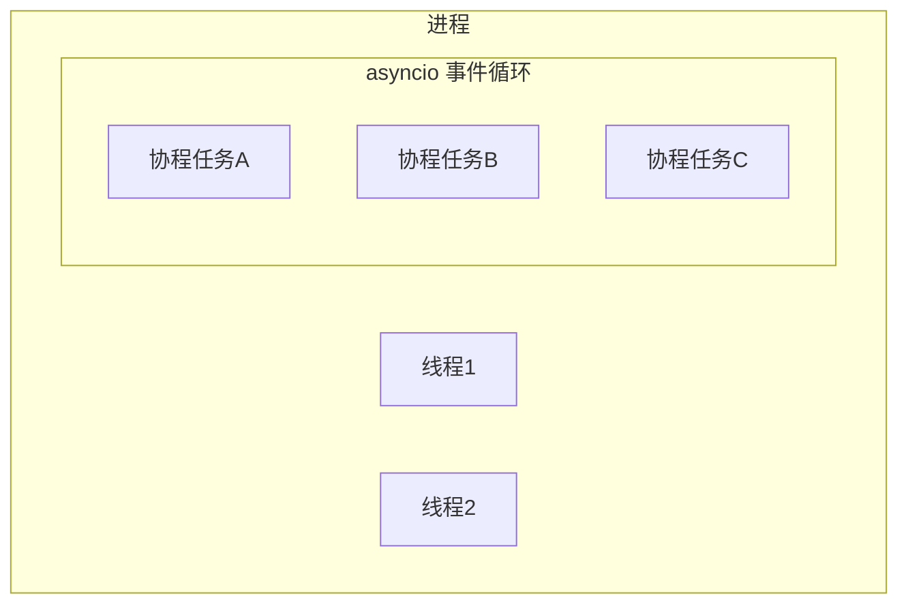
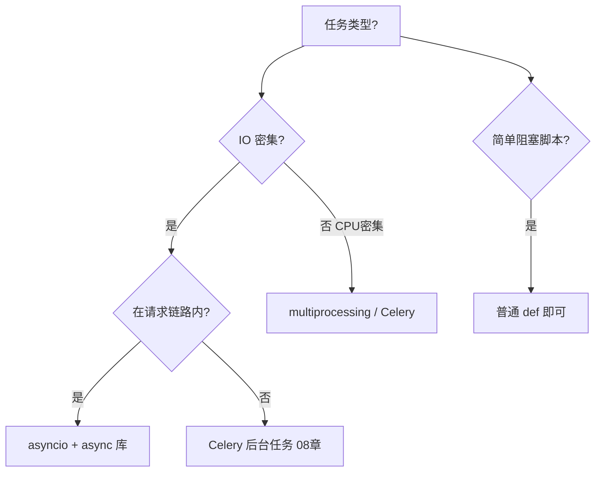

# Python 并发编程与 asyncio

## 本章与上一章的关系

02 章你学了 list、dict——它们在多线程下修改可能出问题。真实后端里，FastAPI 要同时处理大量 HTTP 请求，还要异步调数据库、调 Redis、发 HTTP 请求。**并发是默认场景**。

这一章帮你搞懂：GIL 是什么、线程和协程怎么选、`async/await` 怎么用、为什么 FastAPI 推荐 async 路由。03 章和 04 章 FastAPI 直接衔接——你会理解 `@app.get` 写 `async def` 的含义，以及什么时候该用 Celery 丢后台任务（08 章）。

---

## 1. 为什么一定要学这一章

| 场景 | 不用并发的问题 | 并发方案 |
|------|----------------|----------|
| 接口里调 3 个外部 HTTP | 串行等待，RT 三倍 | `asyncio.gather` 并行 |
| 1000 QPS 读 Redis | 单线程阻塞 | async redis 客户端 |
| CPU 密集图像处理 | 阻塞事件循环 | 多进程 / Celery |
| 发邮件、写日志 | 拖慢主请求 | 后台任务 / MQ |

面试常问：**Python 多线程为什么慢？GIL 是什么？asyncio 和 threading 区别？**

---

## 2. 进程、线程与协程



| 概念 | 说明 | Python 典型用法 |
|------|------|-----------------|
| 进程 | 独立内存空间 | `multiprocessing` |
| 线程 | 共享进程内存 | `threading` |
| 协程 | 用户态轻量任务，由事件循环调度 | `asyncio` |

**后端默认模型**：一个 uvicorn 进程 + asyncio 事件循环 + 多个协程处理请求。

---

## 3. GIL（全局解释器锁）

### 3.1 是什么

CPython 解释器同一时刻只允许**一个线程**执行 Python 字节码。多线程无法利用多核 CPU 跑 Python 计算代码。

### 3.2 深入：为什么还有多线程？

- **IO 等待**（读网络、读磁盘）时 GIL 会释放，其他线程可以运行
- 适合 IO 密集：多个线程交替等待
- **CPU 密集**（加密、图像）：多线程几乎无加速，应用 **多进程** 或把计算丢给 Celery

```python
# CPU 密集：多线程几乎无效
# IO 密集：多线程 / asyncio 有效
```

### 3.3 真实案例（模拟）

爬虫要抓 100 个 URL，每个等待 200ms。串行需 20s；`asyncio.gather` 并发可压到约 2～3s（取决于并发数限制）。

---

## 4. threading 入门

```python
import threading
import time

counter = 0
lock = threading.Lock()

def worker():
    global counter
    for _ in range(100000):
        with lock:          # 加锁，避免竞态
            counter += 1

threads = [threading.Thread(target=worker) for _ in range(5)]
for t in threads:
    t.start()
for t in threads:
    t.join()

print(counter)  # 500000
```

**不加锁**时 `counter` 可能小于 500000——与 Java `synchronized` 同理。

### 4.1 ThreadPoolExecutor

```python
from concurrent.futures import ThreadPoolExecutor, as_completed

def fetch(url: str) -> str:
    time.sleep(0.1)  # 模拟 IO
    return f"data from {url}"

urls = [f"http://example.com/{i}" for i in range(10)]

with ThreadPoolExecutor(max_workers=5) as pool:
    futures = [pool.submit(fetch, u) for u in urls]
    for f in as_completed(futures):
        print(f.result())
```

阻塞 IO 场景可用线程池；FastAPI 里更推荐 asyncio 原生 async。

---

## 5. asyncio 核心

### 5.1 第一个协程

```python
import asyncio

async def hello():
    print("Hello")
    await asyncio.sleep(1)   # 非阻塞等待 1 秒
    print("World")

asyncio.run(hello())
# 预期输出（间隔约 1 秒）：
# Hello
# World
```

- `async def` 定义协程函数
- `await` 挂起当前协程，让事件循环去跑别的任务
- `asyncio.run()` 启动事件循环（脚本入口）

### 5.2 并发执行 gather

```python
import asyncio

async def fetch_user(user_id: int) -> dict:
    await asyncio.sleep(0.2)
    return {"id": user_id, "name": f"user{user_id}"}

async def main():
    results = await asyncio.gather(
        fetch_user(1),
        fetch_user(2),
        fetch_user(3),
    )
    print(results)

asyncio.run(main())
# 预期：总耗时约 0.2s（并行），不是 0.6s
```

### 5.3 创建任务 Task

```python
async def main():
    task1 = asyncio.create_task(fetch_user(1))
    task2 = asyncio.create_task(fetch_user(2))
    r1 = await task1
    r2 = await task2
    print(r1, r2)
```

### 5.4 超时 wait_for

```python
async def slow():
    await asyncio.sleep(10)

async def main():
    try:
        await asyncio.wait_for(slow(), timeout=2.0)
    except asyncio.TimeoutError:
        print("超时")

asyncio.run(main())
# 预期输出：超时
```

---

## 6. async 与 sync 的边界

### 6.1 不要在 async 里写阻塞代码

```python
# 错误：阻塞整个事件循环
async def bad():
    time.sleep(5)        # 不要用 time.sleep
    requests.get(url)    # 同步 requests 会阻塞

# 正确
async def good():
    await asyncio.sleep(5)
    # 用 httpx.AsyncClient 或 aiohttp
```

### 6.2 在线程池里跑阻塞函数

```python
import asyncio

def blocking_io():
    import time
    time.sleep(2)
    return "done"

async def main():
    result = await asyncio.to_thread(blocking_io)  # 3.9+
    print(result)

asyncio.run(main())
```

旧代码、第三方同步库可用 `asyncio.to_thread` 包一层，避免阻塞事件循环。

---

## 7. 异步 HTTP 客户端 httpx

```powershell
pip install httpx
```

```python
import asyncio
import httpx

async def fetch(url: str) -> dict:
    async with httpx.AsyncClient(timeout=10.0) as client:
        resp = await client.get(url)
        resp.raise_for_status()
        return resp.json()

async def main():
    data = await fetch("https://httpbin.org/get")
    print(data["url"])

asyncio.run(main())
```

FastAPI 路由里调外部 API，优先 `httpx.AsyncClient`。

---

## 8. 生产者-消费者（asyncio.Queue）

```python
import asyncio

async def producer(queue: asyncio.Queue, n: int):
    for i in range(n):
        await queue.put(i)
        await asyncio.sleep(0.01)
    await queue.put(None)  # 结束信号

async def consumer(queue: asyncio.Queue, name: str):
    while True:
        item = await queue.get()
        if item is None:
            break
        print(f"{name} got {item}")
        queue.task_done()

async def main():
    q = asyncio.Queue(maxsize=10)
    await asyncio.gather(
        producer(q, 5),
        consumer(q, "C1"),
    )

asyncio.run(main())
```

理解队列有助于后续理解 Celery、RabbitMQ（08 章）。

---

## 9. FastAPI 与 asyncio 的关系

```python
from fastapi import FastAPI
import asyncio

app = FastAPI()

@app.get("/users/{user_id}")
async def get_user(user_id: int):
    await asyncio.sleep(0.01)   # 模拟 async DB
    return {"id": user_id, "name": "Tom"}


def sync_helper(x: int) -> int:
    return x * 2

@app.get("/double/{x}")
async def double(x: int):
    result = await asyncio.to_thread(sync_helper, x)
    return {"result": result}
```

- `async def` 路由：直接在事件循环里 await
- `def` 路由：FastAPI 会放到线程池执行，避免阻塞——但高并发下仍优先 async

---

## 10. 多进程 multiprocessing

CPU 密集任务示例：

```python
from multiprocessing import Pool

def square(n: int) -> int:
    return n * n

if __name__ == "__main__":
    with Pool(4) as pool:
        results = pool.map(square, range(10))
    print(results)
```

**Windows 必须** `if __name__ == "__main__"` 保护入口，否则 spawn 子进程会递归创建。

---

## 11. 选型决策树



---

## 12. 手把手：asyncio 并发下载模拟

### 项目结构

```text
async-demo/
├── main.py
└── requirements.txt   # httpx
```

### main.py

```python
import asyncio
import time
import httpx

URLS = [
    "https://httpbin.org/delay/1",
    "https://httpbin.org/delay/1",
    "https://httpbin.org/delay/1",
]

async def fetch(client: httpx.AsyncClient, url: str) -> int:
    resp = await client.get(url)
    return resp.status_code

async def run_serial():
    start = time.perf_counter()
    async with httpx.AsyncClient() as client:
        for url in URLS:
            await fetch(client, url)
    print(f"串行: {time.perf_counter() - start:.2f}s")

async def run_parallel():
    start = time.perf_counter()
    async with httpx.AsyncClient() as client:
        await asyncio.gather(*(fetch(client, u) for u in URLS))
    print(f"并行: {time.perf_counter() - start:.2f}s")

async def main():
    await run_serial()    # 预期约 3s+
    await run_parallel()  # 预期约 1s+

if __name__ == "__main__":
    asyncio.run(main())
```

---

## 13. 常见报错与排查

| 报错 | 原因 | 解决 |
|------|------|------|
| `RuntimeError: asyncio.run() cannot be called from a running event loop` | 在已有 loop 里再 run | Jupyter 用 `await`；或 `nest_asyncio` |
| `coroutine was never awaited` | 忘了 await | 协程必须 await 或 create_task |
| `Task attached to a different loop` | 跨 loop 使用 Task | 同一 loop 内创建与 await |
| 接口 RT 突然变长 | async 里用了阻塞 IO | 改 async 库或 to_thread |
| 多线程 counter 不对 | 竞态未加锁 | threading.Lock |
| `BrokenProcessPool` | 子进程崩溃 | 检查 multiprocessing 代码 |
| `httpx.ConnectTimeout` | 网络/超时 | 调 timeout、重试 |
| `Event loop is closed` | loop 已关仍 await | 检查生命周期 |

---

## 14. 练习建议

### 基础

1. 用 `asyncio.gather` 并发打印 1～10，每个间隔 0.1s
2. 写线程安全计数器（5 线程各加 10000 次）

### 进阶

3. 用 httpx 并发请求 5 个 URL，统计总耗时
4. 实现 async 限流：最多同时 3 个 in-flight 请求（用 Semaphore）

### 挑战

5. 用 `asyncio.Queue` 实现 2 消费者处理 20 个任务

---

## 15. 参考答案

### Semaphore 限流

```python
import asyncio
import httpx

sem = asyncio.Semaphore(3)

async def fetch(client, url):
    async with sem:
        resp = await client.get(url)
        return resp.status_code

async def main():
    urls = [f"https://httpbin.org/get?i={i}" for i in range(10)]
    async with httpx.AsyncClient() as client:
        await asyncio.gather(*(fetch(client, u) for u in urls))
```

---

## 16. 学完标准

- [ ] 能解释 GIL 对多线程的影响
- [ ] 会写 `async def` / `await` / `gather`
- [ ] 知道 async 里不能 blocking sleep / 同步 requests
- [ ] 会用 httpx 异步请求
- [ ] 能选择 asyncio vs 线程池 vs Celery

---

## 下一章预告

语言基础和并发模型就绪——下一章（04 FastAPI 核心开发）正式**对外提供 HTTP 接口**：Router 分层、Pydantic 校验、统一返回、CORS、JWT 入门，并完成 demo-api 内存版 CRUD。

---

*下一章：04 FastAPI 核心开发*
