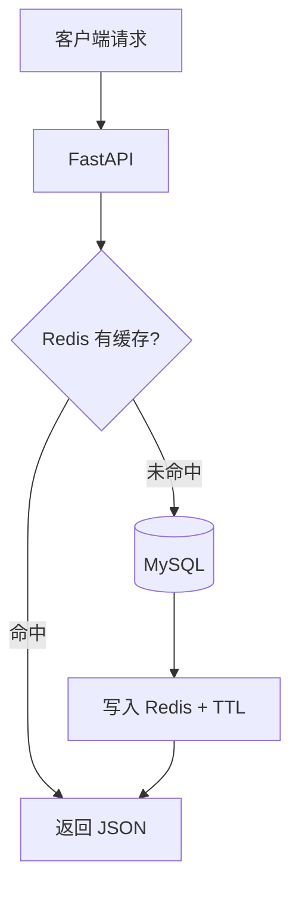
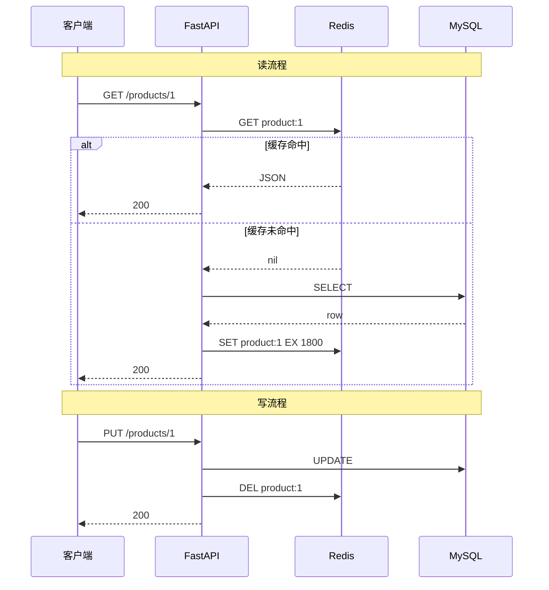

# Redis 核心原理与缓存实战

> **文件编码**：UTF-8。Redis 键名、JSON 缓存内容建议 UTF-8。

---

## 本章与上一章的关系

06 章你把 MySQL 表设计、索引、事务都搞明白了——数据能可靠存储、查询也能优化。但有个现实问题：商品详情页每秒被访问 1 万次，每次都查 MySQL，数据库很快扛不住。

Redis 就是来解决这个的：**把热点数据放内存里，读速度从毫秒级降到微秒级**。这一章你会学五种数据结构、Cache Aside 缓存模式、穿透/击穿/雪崩对策，以及用 SETNX 做分布式锁。06 章是「数据怎么存」，07 章是「热点数据怎么扛并发」。

**与 Java 路线对照**：核心概念与 [Java 07 Redis 核心原理与缓存实战](../Java/07-Redis核心原理与缓存实战.md) 一致；本章用 **redis-py + FastAPI** 落地。

---

## 本章衔接

| 上一章（06） | 本章（07） | 下一章（08） |
|--------------|------------|--------------|
| MySQL 持久化、索引优化 | Redis 内存缓存、Cache Aside | Celery 异步解耦 |
| demo-api 查商品走 DB | 商品详情走 Redis，更新删缓存 | 下单后发 MQ 通知 |
| 防超卖 SQL 事务 | SETNX 分布式锁防重复提交 | RabbitMQ 可靠投递 |



---

## 1. Redis 在后端项目里是干什么的

Redis 最常见的作用不是「代替数据库」，而是：

- 做缓存
- 做计数器
- 做验证码
- 做排行榜
- 做分布式锁基础能力
- 做限流

它最大的特点是快，因为主要基于内存。

---

## 2. 为什么 Redis 这么快？

**结论**：Redis 把数据放内存、单线程避免锁竞争、IO 多路复用让单线程也能处理大量并发连接——三者叠加，单机 QPS 可达十万级。

1. **纯内存操作**：MySQL 查数据要走磁盘 IO；Redis 数据全在内存，一次 `GET` 只需微秒级。
2. **单线程模型**：Redis 6.0 前核心命令处理是单线程，避免多线程上下文切换和锁竞争。
3. **高效数据结构**：String 用 SDS、ZSet 用跳表，都是为速度优化的专用结构。

**真实案例（模拟）**：某电商大促，商品详情直接查 MySQL，QPS 到 3000 时数据库 CPU 飙到 90%。接入 Redis 缓存后，95% 请求命中缓存（RT < 5ms），MySQL QPS 降到 200，页面不再卡顿。

---

## 2.1 手把手：Docker 启动 Redis + redis-cli 练习

### Docker 启动 Redis

```powershell
docker run -d --name study-redis -p 6379:6379 redis:7
```

```powershell
# 预期输出：一行容器 ID
docker ps --filter name=study-redis
# 预期：STATUS Up，PORTS 0.0.0.0:6379->6379/tcp
```

### redis-cli 基础操作

```powershell
docker exec -it study-redis redis-cli
```

**String 操作**：

```bash
127.0.0.1:6379> SET name zhangsan
OK
127.0.0.1:6379> GET name
"zhangsan"
127.0.0.1:6379> INCR page_view
(integer) 1
127.0.0.1:6379> EXPIRE name 60
(integer) 1
127.0.0.1:6379> TTL name
(integer) 58
```

**ZSet 排行榜**：

```bash
127.0.0.1:6379> ZADD rank 100 user1
(integer) 1
127.0.0.1:6379> ZADD rank 90 user2
(integer) 1
127.0.0.1:6379> ZREVRANGE rank 0 9 WITHSCORES
1) "user1"
2) "100"
3) "user2"
4) "90"
```

**SETNX 分布式锁**：

```bash
127.0.0.1:6379> SET lock:order:1 uuid-abc NX EX 30
OK
127.0.0.1:6379> SET lock:order:1 uuid-xyz NX EX 30
(nil)
127.0.0.1:6379> DEL lock:order:1
(integer) 1
```

---

## 3. Redis 五种最核心数据结构

| 类型 | 典型命令 | 场景 |
|------|----------|------|
| String | SET / GET / INCR | 缓存 JSON、验证码、计数 |
| Hash | HSET / HGETALL | 对象字段缓存 |
| List | LPUSH / RPOP | 简单队列、最新消息 |
| Set | SADD / SISMEMBER | 去重、标签 |
| ZSet | ZADD / ZREVRANGE | 排行榜、延时任务 |

---

## 4. Python 接入 Redis（redis-py）

### 4.1 安装依赖

```powershell
cd demo-api
.\.venv\Scripts\Activate.ps1
pip install redis
```

`requirements.txt` 追加：

```text
redis>=5.0.0
```

### 4.2 连接配置

`app/core/redis_client.py`：

```python
import redis.asyncio as aioredis
from app.core.config import settings

redis_client: aioredis.Redis | None = None

async def init_redis() -> None:
    global redis_client
    redis_client = aioredis.from_url(
        settings.REDIS_URL,  # redis://127.0.0.1:6379/0
        encoding="utf-8",
        decode_responses=True,
    )

async def close_redis() -> None:
    if redis_client:
        await redis_client.close()

def get_redis() -> aioredis.Redis:
    if redis_client is None:
        raise RuntimeError("Redis not initialized")
    return redis_client
```

`app/main.py` 生命周期：

```python
from contextlib import asynccontextmanager
from fastapi import FastAPI
from app.core.redis_client import init_redis, close_redis

@asynccontextmanager
async def lifespan(app: FastAPI):
    await init_redis()
    yield
    await close_redis()

app = FastAPI(lifespan=lifespan)
```

`.env`：

```text
REDIS_URL=redis://127.0.0.1:6379/0
```

---

## 5. FastAPI 商品缓存 Service（Cache Aside）

```python
import json
from decimal import Decimal
from redis.asyncio import Redis
from sqlalchemy.ext.asyncio import AsyncSession
from sqlalchemy import select
from app.models.product import Product

KEY_PREFIX = "product:"
TTL_SECONDS = 1800  # 30 分钟

class DecimalEncoder(json.JSONEncoder):
    def default(self, o):
        if isinstance(o, Decimal):
            return str(o)
        return super().default(o)

class ProductCacheService:
    def __init__(self, redis: Redis, session: AsyncSession):
        self.redis = redis
        self.session = session

    async def get_by_id(self, product_id: int) -> dict | None:
        key = f"{KEY_PREFIX}{product_id}"
        cached = await self.redis.get(key)
        if cached:
            return json.loads(cached)

        result = await self.session.execute(
            select(Product).where(Product.id == product_id)
        )
        product = result.scalar_one_or_none()
        if product is None:
            return None

        data = {
            "id": product.id,
            "name": product.name,
            "price": product.price,
            "stock": product.stock,
        }
        await self.redis.set(
            key,
            json.dumps(data, cls=DecimalEncoder),
            ex=TTL_SECONDS,
        )
        return data

    async def evict(self, product_id: int) -> None:
        await self.redis.delete(f"{KEY_PREFIX}{product_id}")
```

FastAPI 路由：

```python
from fastapi import APIRouter, Depends
from app.core.redis_client import get_redis
from app.deps import get_db

router = APIRouter(prefix="/products", tags=["products"])

@router.get("/{product_id}")
async def get_product(
    product_id: int,
    db=Depends(get_db),
    redis=Depends(get_redis),
):
    svc = ProductCacheService(redis, db)
    data = await svc.get_by_id(product_id)
    if not data:
        raise HTTPException(status_code=404, detail="商品不存在")
    return {"code": 0, "data": data}
```

**更新商品时**（先更 DB，再删缓存）：

```python
async def update_product(self, product_id: int, payload: ProductUpdate):
    async with self.session.begin():
        # ... ORM update ...
        pass
    await self.cache.evict(product_id)
```

---

## 6. Cache Aside 读写流程



**为什么写时删缓存而不是更新缓存？**

- 并发下「先更库再更缓存」可能写入旧值
- 删缓存更简单，下次读时重建

---

## 7. 三大缓存问题与对策

| 问题 | 现象 | 方案 |
|------|------|------|
| **穿透** | 查不存在的数据，缓存和 DB 都被打穿 | 布隆过滤器；缓存空值短 TTL（如 60s） |
| **击穿** | 热点 key 过期瞬间大量请求打 DB | 互斥锁重建；逻辑过期（值带过期时间，异步刷新） |
| **雪崩** | 大量 key 同时过期 | TTL 加随机抖动；Redis 集群；降级返回默认值 |

### 7.1 缓存穿透：空值缓存

```python
async def get_by_id(self, product_id: int) -> dict | None:
    key = f"{KEY_PREFIX}{product_id}"
    cached = await self.redis.get(key)
    if cached == "NULL":
        return None
    if cached:
        return json.loads(cached)

    product = await self._load_from_db(product_id)
    if product is None:
        await self.redis.set(key, "NULL", ex=60)
        return None
    await self.redis.set(key, json.dumps(product, cls=DecimalEncoder), ex=TTL_SECONDS)
    return product
```

### 7.2 缓存击穿：互斥锁重建

```python
import asyncio

async def get_with_mutex(self, product_id: int) -> dict | None:
    data = await self._get_cache(product_id)
    if data is not None:
        return data if data != "NULL" else None

    lock_key = f"lock:rebuild:{product_id}"
    token = "1"
    if await self.redis.set(lock_key, token, nx=True, ex=10):
        try:
            return await self._load_and_set(product_id)
        finally:
            await self.redis.delete(lock_key)
    else:
        await asyncio.sleep(0.05)
        return await self.get_with_mutex(product_id)
```

### 7.3 缓存雪崩：TTL 随机

```python
import random

ttl = TTL_SECONDS + random.randint(0, 300)
await self.redis.set(key, value, ex=ttl)
```

---

## 8. 分布式锁（SETNX + Lua 释放）

```python
import uuid
from redis.asyncio import Redis

class RedisLock:
    UNLOCK_SCRIPT = """
    if redis.call('get', KEYS[1]) == ARGV[1] then
        return redis.call('del', KEYS[1])
    else
        return 0
    end
    """

    def __init__(self, redis: Redis, key: str, ttl: int = 30):
        self.redis = redis
        self.key = key
        self.ttl = ttl
        self.token = str(uuid.uuid4())

    async def acquire(self) -> bool:
        return await self.redis.set(self.key, self.token, nx=True, ex=self.ttl)

    async def release(self) -> None:
        await self.redis.eval(self.UNLOCK_SCRIPT, 1, self.key, self.token)
```

下单防重复提交：

```python
@router.post("/orders")
async def create_order(..., redis=Depends(get_redis)):
    lock = RedisLock(redis, f"lock:order:{user_id}", ttl=30)
    if not await lock.acquire():
        raise HTTPException(status_code=429, detail="请勿重复提交")
    try:
        # 创建订单逻辑
        ...
    finally:
        await lock.release()
```

**要点**：

- 锁必须带 TTL，防止死锁
- 释放时用 Lua 校验 token，防止误删他人锁
- 业务执行时间应小于 TTL

---

## 9. 验证码与计数器示例

```python
async def save_sms_code(redis: Redis, phone: str, code: str) -> None:
    await redis.set(f"code:{phone}", code, ex=300)

async def verify_code(redis: Redis, phone: str, code: str) -> bool:
    stored = await redis.get(f"code:{phone}")
    return stored == code

async def incr_page_view(redis: Redis, page: str) -> int:
    return await redis.incr(f"pv:{page}")
```

---

## 10. ZSet 排行榜（Python）

```python
async def update_rank(redis: Redis, user_id: str, score: float) -> None:
    await redis.zadd("game:rank", {user_id: score})

async def top_players(redis: Redis, n: int = 10) -> list[tuple[str, float]]:
    raw = await redis.zrevrange("game:rank", 0, n - 1, withscores=True)
    return [(member, score) for member, score in raw]
```

---

## 11. Redis 持久化与内存淘汰（认知）

| 机制 | 说明 |
|------|------|
| RDB | 定时快照，恢复快，可能丢最近数据 |
| AOF | 记录写命令，更安全，文件更大 |
| 淘汰策略 | `allkeys-lru`、`volatile-ttl` 等，内存满时删 key |

初学：Docker 默认配置即可；生产需根据 RPO/RTO 选型。

---

## 12. Key 命名规范

```text
{业务}:{实体}:{id}
product:1
user:session:abc123
lock:order:10001
code:13800138000
```

避免：`keys *` 在生产环境扫描全库。

---

## 13. 与前端联调

前端通过 [Vue 08 Axios](../../前端学习/Vue/08-Axios网络请求与前后端联调.md) 调商品详情接口时：

- 第一次请求较慢（cache miss），后续应明显变快
- 更新商品后再次 GET 应拿到新数据（缓存已删）
- 可在响应头加 `X-Cache: HIT/MISS` 便于调试（可选）

---

## 14. 常见报错与排查

| 报错信息（关键词） | 可能原因 | 解决方案 |
|-------------------|---------|---------|
| `Connection refused :6379` | Redis 未启动 | `docker start study-redis` |
| `redis.exceptions.TimeoutError` | 网络/Redis 负载高 | 检查 Docker；增大 timeout |
| `WRONGTYPE Operation against a key` | 对 String key 用了 ZADD 等 | 删 key 或换 key 名 |
| `OOM command not allowed` | 内存满 | 设 maxmemory + 淘汰策略；清理大 key |
| 缓存与 DB 数据不一致 | 更新顺序错或未删缓存 | 先更 DB 再 DEL 缓存 |
| `JSONDecodeError` | 缓存存了非 JSON | 删坏 key；统一序列化格式 |
| `Cannot connect to host`（async） | REDIS_URL 错 | 检查 `.env` 与 Docker 端口 |
| 锁释放后仍「重复提交」 | TTL 太短或 finally 未执行 | 加大 TTL；用 try/finally |
| `MOVED` / `ASK` | 集群模式路由 | 使用 Redis Cluster 客户端 |
| 热 key 单节点 CPU 100% | 流量集中一个 key | 本地缓存 + Redis；拆分 key |

---

## 15. 分级练习

### 基础

redis-cli 练 ZSet 排行榜（§2.1）。

### 进阶

在 demo-api 实现 `ProductCacheService`，验证第二次 GET 走缓存。

### 挑战

用 SETNX 锁包裹下单接口，压测重复点击只产生一笔订单。

---

## 16. 参考答案

### 基础

```bash
docker exec -it study-redis redis-cli
ZADD game:rank 1500 player1
ZADD game:rank 2300 player2
ZADD game:rank 1800 player3
ZREVRANGE game:rank 0 2 WITHSCORES
# 预期：player2(2300) > player3(1800) > player1(1500)
```

### 进阶：验证 Cache Aside

1. 启动 demo-api + study-redis + study-mysql
2. `GET /products/1` 第一次：查 DB，Redis 写入
3. `docker exec -it study-redis redis-cli GET product:1` 应有 JSON
4. 第二次 GET：响应更快
5. `PUT /products/1` 更新价格 → `GET product:1` 应为 nil → 再 GET 接口返回新价

### 挑战：锁验证

连续快速 POST 同一用户下单 5 次，预期：1 次成功，其余 429 或业务「请勿重复提交」。

---

## 17. 高频知识点清单

- 五大数据结构及场景
- Cache Aside 读写流程
- 穿透 / 击穿 / 雪崩
- SETNX + EX 分布式锁
- Lua 脚本安全释放锁
- TTL 与 key 命名
- redis-py async 用法
- 先更 DB 再删缓存

---

## 18. 学完标准

- [ ] 能在 Docker 启动 Redis 并用 redis-cli 练 String/ZSet/SETNX
- [ ] 会用 redis-py 在 FastAPI 中读写缓存
- [ ] 能口述并实现 Cache Aside（读穿透 DB、写删缓存）
- [ ] 能解释穿透/击穿/雪崩及对应方案
- [ ] 会用 SETNX + Lua 实现简单分布式锁
- [ ] 知道 RDB/AOF、内存淘汰的基本概念
- [ ] 更新商品后缓存与 DB 保持一致

---

## 下一章预告

Redis 解决了「读快」，但还有一类操作不适合在 HTTP 请求里同步做完：发短信、发邮件、写日志、同步 ES。下一章（[08 Celery 与消息队列实战](./08-Celery与消息队列实战.md)）引入 **Celery + RabbitMQ**：

- 下单成功后异步发通知，接口立刻返回
- Worker 独立进程消费任务，解耦与削峰
- 幂等消费、手动 ACK、死信队列入门

07 章优化读路径，08 章优化写后的附属流程。对照 [Java 08 RabbitMQ](../Java/08-RabbitMQ与消息队列实战.md) 可对比 Spring AMQP 与 Celery 的差异。

---

*下一章：08 Celery 与消息队列实战*
