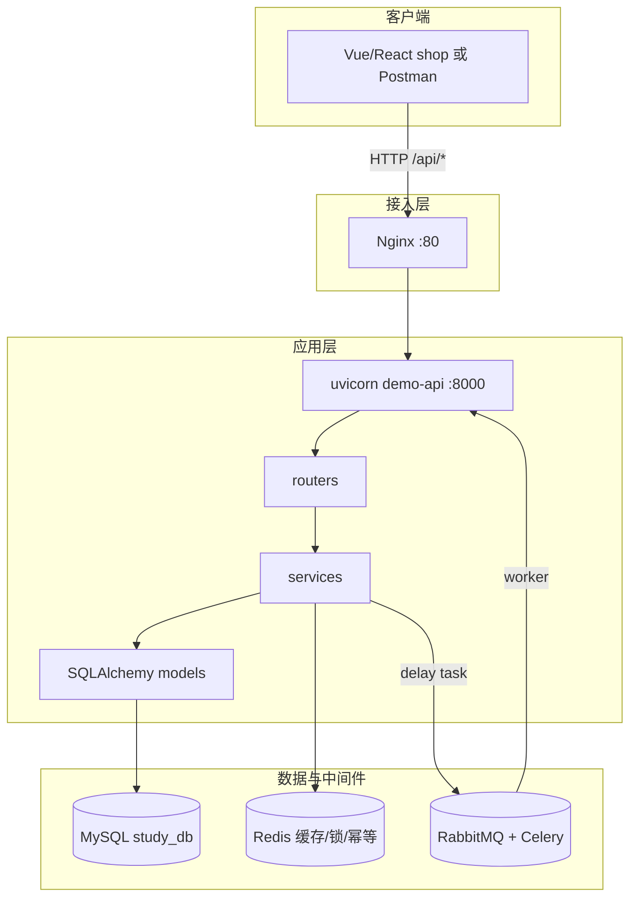
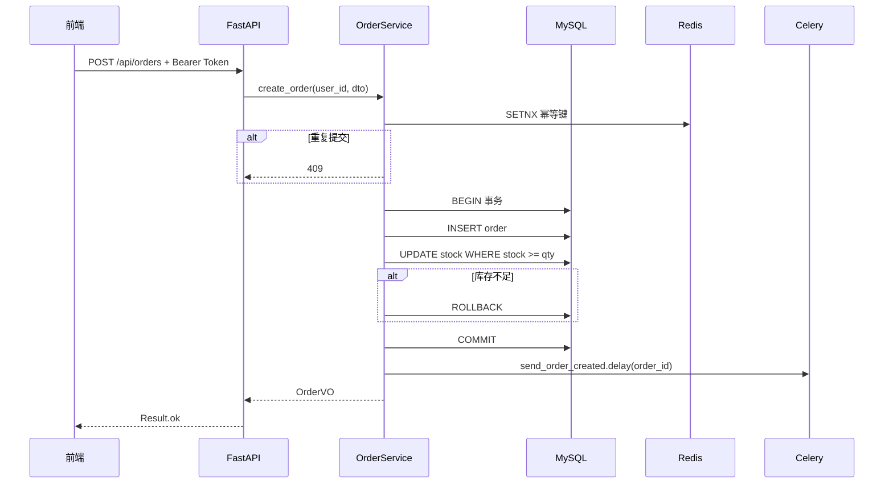

# 后端项目实战与面试准备

> **文件编码**：UTF-8。本章在 04～09 章 `demo-api` 基础上扩展为可写进简历的电商 MVP。

## 本章与上一章的关系

01～09 章你把 Python 语言、FastAPI、SQLAlchemy、MySQL、Redis、Celery、Docker 都学了一遍——但知识还是「点状」的。04 写 Router、05 接 ORM、07 加缓存、08 发 Celery 任务、09 用 docker-compose 部署，每一章各自为战。

这一章就是**总装车间**：把 `demo-api` 扩展成能写进简历的商城 MVP，并与 [Vue 08](../../前端学习/Vue/08-Axios网络请求与前后端联调.md)、[React 08](../../前端学习/React/08-Axios网络请求与前后端联调.md) 及 09～11 章前端商城联调对齐。10 章不要求新学很多新技术，而是要求你**串起来、做出来、讲清楚**。

### 项目整体架构图



---

## 1. 为什么最后一定要落到项目

你学 Python、FastAPI、MySQL、Redis，不是为了把概念背下来，而是为了能做项目。

没有项目，你会出现这些问题：

- 知识点是散的
- 面试时讲不起来
- 不知道为什么要学这些技术

所以最后一定要把前面的知识串成一个完整项目。

---

## 2. demo-api 电商 MVP 目标

基于 00 章 §3.2 的演进路线，10 章最终形态：

| 模块 | 能力 | 对应章节 |
|------|------|----------|
| 用户 | 注册、登录、JWT、个人信息 | 04 依赖注入 + 05 持久化 |
| 商品 | 分页列表、详情、搜索 | 05 CRUD + 06 索引 |
| 订单 | 创建、列表、详情、取消 | 05 事务 + 08 异步 |
| 缓存 | 商品详情 Cache Aside | 07 Redis |
| 异步 | 下单后发 Celery 通知 / 延迟关单 | 08 Celery |
| 部署 | docker-compose 一键起全栈 | 09 Docker |

---

## 3. 推荐项目目录结构

```text
demo-api/
├── app/
│   ├── main.py                 # FastAPI 入口 + CORS + 路由注册
│   ├── core/
│   │   ├── config.py           # pydantic-settings 读 .env
│   │   ├── deps.py             # get_db、get_current_user
│   │   ├── security.py         # JWT 签发/校验、密码 hash
│   │   └── exceptions.py       # 业务异常 + handler
│   ├── routers/
│   │   ├── auth.py             # /api/register、/api/login
│   │   ├── products.py
│   │   └── orders.py
│   ├── services/
│   │   ├── user_service.py
│   │   ├── product_service.py
│   │   └── order_service.py
│   ├── models/                 # SQLAlchemy ORM
│   ├── schemas/                # Pydantic 入参/出参
│   └── tasks/                  # Celery 任务
├── sql/schema.sql
├── tests/
├── requirements.txt
├── .env
├── docker-compose.yml
└── README.md
```

---

## 4. 统一 API 契约（与前端 08～11 对齐）

前端 Vue/React 08 章约定 **`code === 0` 表示成功**。Python 版保持一致，便于联调：

### 4.1 统一响应结构

```python
# app/schemas/common.py
from typing import Generic, TypeVar, Optional
from pydantic import BaseModel

T = TypeVar("T")

class Result(BaseModel, Generic[T]):
    code: int = 0
    message: str = "success"
    data: Optional[T] = None

    @classmethod
    def ok(cls, data: T = None, message: str = "success"):
        return cls(code=0, message=message, data=data)

    @classmethod
    def fail(cls, message: str, code: int = 1):
        return cls(code=code, message=message, data=None)
```

### 4.2 错误码约定

| code | HTTP Status | 含义 | 前端处理 |
|------|-------------|------|----------|
| 0 | 200 | 成功 | 正常渲染 data |
| 1 | 200/400 | 业务失败 | ElMessage / toast 显示 message |
| 401 | 401 | 未登录/Token 失效 | 跳转登录页 |
| 403 | 403 | 无权限 | 提示无权限 |
| 409 | 409 | 重复提交 | 禁用按钮 + 提示 |

### 4.3 核心接口清单

与 [Vue 08](../../前端学习/Vue/08-Axios网络请求与前后端联调.md)、[React 08](../../前端学习/React/08-Axios网络请求与前后端联调.md) 及前端 10～11 商城路由对齐：

| 方法 | 路径 | 说明 | 鉴权 |
|------|------|------|------|
| POST | `/api/register` | 注册 | 否 |
| POST | `/api/login` | 登录，返回 JWT | 否 |
| GET | `/api/users/me` | 当前用户信息 | Bearer Token |
| GET | `/api/products` | 商品分页 `?page=1&pageSize=10&keyword=` | 否 |
| GET | `/api/products/{id}` | 商品详情（Redis 缓存） | 否 |
| POST | `/api/orders` | 创建订单 | Bearer Token |
| GET | `/api/orders` | 我的订单列表 | Bearer Token |
| GET | `/api/orders/{id}` | 订单详情 | Bearer Token |
| POST | `/api/orders/{id}/cancel` | 取消未支付订单 | Bearer Token |

### 4.4 登录响应示例

```json
{
  "code": 0,
  "message": "success",
  "data": {
    "token": "eyJhbGciOiJIUzI1NiIs...",
    "tokenType": "Bearer",
    "expiresIn": 86400,
    "user": { "id": 1, "username": "zhangsan", "nickname": "张三" }
  }
}
```

前端 Axios 拦截器：`Authorization: Bearer ${token}`，与 Vue Pinia / React Context 存 token 方式一致。

### 4.5 商品列表示例

```json
{
  "code": 0,
  "message": "success",
  "data": {
    "list": [
      { "id": 1, "name": "机械键盘", "price": 299.00, "stock": 50, "coverUrl": "/static/kb.jpg" }
    ],
    "total": 100,
    "page": 1,
    "pageSize": 10
  }
}
```

### 4.6 创建订单请求/响应

**请求**：

```json
{
  "productId": 1,
  "quantity": 2,
  "idempotencyKey": "uuid-from-frontend"
}
```

**响应**：

```json
{
  "code": 0,
  "message": "success",
  "data": {
    "orderId": "202406180001",
    "status": "PENDING_PAY",
    "totalAmount": 598.00
  }
}
```

---

## 5. 手把手：JWT 登录模块

### 5.1 依赖

```powershell
pip install "python-jose[cryptography]" passlib[bcrypt]
```

### 5.2 密码与 Token

```python
# app/core/security.py
from datetime import datetime, timedelta, timezone
from jose import jwt
from passlib.context import CryptContext

pwd_context = CryptContext(schemes=["bcrypt"], deprecated="auto")
SECRET_KEY = "change-me-in-production"
ALGORITHM = "HS256"
ACCESS_TOKEN_EXPIRE_MINUTES = 60 * 24

def hash_password(password: str) -> str:
    return pwd_context.hash(password)

def verify_password(plain: str, hashed: str) -> bool:
    return pwd_context.verify(plain, hashed)

def create_access_token(subject: str) -> str:
    expire = datetime.now(timezone.utc) + timedelta(minutes=ACCESS_TOKEN_EXPIRE_MINUTES)
    return jwt.encode({"sub": subject, "exp": expire}, SECRET_KEY, algorithm=ALGORITHM)
```

### 5.3 登录路由

```python
# app/routers/auth.py
from fastapi import APIRouter, Depends, HTTPException
from sqlalchemy.orm import Session
from app.core.deps import get_db
from app.core.security import verify_password, create_access_token, hash_password
from app.schemas.common import Result
from app.schemas.auth import LoginRequest, RegisterRequest, TokenData

router = APIRouter(prefix="/api", tags=["auth"])

@router.post("/login")
def login(body: LoginRequest, db: Session = Depends(get_db)):
    user = user_service.get_by_username(db, body.username)
    if not user or not verify_password(body.password, user.password_hash):
        raise HTTPException(status_code=401, detail="用户名或密码错误")
    token = create_access_token(str(user.id))
    return Result.ok(TokenData(token=token, user=user_to_vo(user)))

@router.post("/register")
def register(body: RegisterRequest, db: Session = Depends(get_db)):
    if user_service.get_by_username(db, body.username):
        return Result.fail("用户名已存在")
    user_service.create(db, body.username, hash_password(body.password))
    return Result.ok(message="注册成功")
```

### 5.4 鉴权依赖

```python
# app/core/deps.py
from fastapi import Depends, HTTPException
from fastapi.security import HTTPBearer, HTTPAuthorizationCredentials
from jose import jwt, JWTError
from app.core.security import SECRET_KEY, ALGORITHM

security = HTTPBearer()

def get_current_user_id(
    cred: HTTPAuthorizationCredentials = Depends(security),
) -> int:
    try:
        payload = jwt.decode(cred.credentials, SECRET_KEY, algorithms=[ALGORITHM])
        return int(payload["sub"])
    except (JWTError, ValueError):
        raise HTTPException(status_code=401, detail="Token 无效或已过期")
```

---

## 6. 订单模块核心逻辑

### 6.1 创建订单流程



### 6.2 扣库存 SQL（防超卖）

```sql
UPDATE product
SET stock = stock - :qty
WHERE id = :product_id AND stock >= :qty;
-- affected_rows == 0 表示库存不足，业务层抛异常并回滚
```

### 6.3 Service 伪代码

```python
def create_order(db: Session, user_id: int, dto: CreateOrderDTO) -> OrderVO:
    if not redis.set(f"idempotent:{dto.idempotency_key}", "1", nx=True, ex=300):
        raise BusinessException("请勿重复提交", code=409)

    with db.begin():
        product = product_repo.get_for_update(db, dto.product_id)
        if product.stock < dto.quantity:
            raise BusinessException("库存不足")
        order = order_repo.insert(db, user_id, dto, product)
        rows = product_repo.deduct_stock(db, dto.product_id, dto.quantity)
        if rows == 0:
            raise BusinessException("库存不足")
    send_order_created.delay(order.id)
    return order_to_vo(order)
```

---

## 7. CORS 与前端联调

```python
# app/main.py
from fastapi import FastAPI
from fastapi.middleware.cors import CORSMiddleware

app = FastAPI(title="demo-api", docs_url="/docs")

app.add_middleware(
    CORSMiddleware,
    allow_origins=["http://localhost:5173", "http://127.0.0.1:5173"],
    allow_credentials=True,
    allow_methods=["*"],
    allow_headers=["*"],
)
```

### Vite 代理（前端 vite.config.js）

```js
export default {
  server: {
    proxy: {
      '/api': {
        target: 'http://localhost:8000',
        changeOrigin: true,
      }
    }
  }
}
```

| 阶段 | 前端 | 后端 | 联调方式 |
|------|------|------|----------|
| 本地开发 | localhost:5173 | localhost:8000 | Vite proxy `/api` |
| Swagger 调试 | — | localhost:8000/docs | 无需前端 |
| 部署 | Nginx 静态 | docker-compose | 同域反代 |

---

## 8. MVP 四周里程碑

| 周次 | 目标 | 交付物 | 验收方式 |
|------|------|--------|----------|
| **Week 1** | 用户 + 商品 CRUD | 注册/登录/JWT；商品分页/详情；3 张表 + 索引 | Swagger 跑通；README 接口列表 |
| **Week 2** | 订单 + 事务 | 创建订单、扣库存、SQLAlchemy 事务 | 库存不足回滚；并发不超卖 |
| **Week 3** | 缓存 + Celery | 商品详情 Redis；下单后发异步任务 | 第二次查详情命中缓存；worker 日志 |
| **Week 4** | 部署 + 联调 | docker-compose；与 Vue/React 08 联调 | curl 通；前端列表/登录/下单走通 |

**Week 1 最小接口**：

```text
POST   /api/register
POST   /api/login
GET    /api/products?page=1&pageSize=10
GET    /api/products/{id}
```

**Week 3 章节对应**：

- 缓存 → [07 Redis 缓存实战](07-Redis核心原理与缓存实战.md)
- Celery → [08 Celery 与消息队列实战](08-Celery与消息队列实战.md)

**Week 4 章节对应**：

- docker-compose → [09 Linux Docker Nginx](09-Linux-Docker-Nginx部署基础.md)

---

## 9. 数据库表设计清单

| 表名 | 核心字段 | 索引建议 |
|------|----------|----------|
| user | id, username, password_hash, nickname, created_at | UNIQUE(username) |
| product | id, name, price, stock, category_id, cover_url | idx_category; 全文/前缀索引 name |
| order | id, order_no, user_id, status, total_amount, created_at | idx_user_status; UNIQUE(order_no) |
| order_item | id, order_id, product_id, quantity, price | idx_order_id |

可选扩展：address、cart、payment_log（面试加分，非 MVP 必须）。

---

## 10. 项目亮点提炼

| 角度 | 亮点示例 |
|------|----------|
| 性能 | 商品详情 Redis Cache Aside，QPS 提升、DB 压力下降 |
| 一致性 | 下单事务 + 条件 UPDATE 防超卖 |
| 工程化 | Pydantic 校验、统一 Result、全局异常 handler |
| 异步 | Celery 下单后通知 / 延迟关单，主链路 RT 降低 |
| 部署 | docker-compose 一键起 MySQL/Redis/RabbitMQ/uvicorn |

---

## 11. 面试怎么讲项目（3 分钟结构）

1. **背景**：简易电商 API，供 Vue/React 商城前端联调
2. **技术栈**：FastAPI + SQLAlchemy + MySQL + Redis + Celery + Docker
3. **职责**：独立完成用户/商品/订单模块与部署
4. **核心流程**：登录 JWT → 商品缓存 → 下单事务扣库存 → Celery 异步
5. **难点 1**：缓存与 DB 一致性（先更 DB 再删缓存）
6. **难点 2**：幂等防重复下单（Redis SETNX + 唯一订单号）
7. **不足与迭代**：未做分库分表；高并发可引入 Redis 预扣库存（见 12 章）

---

## 12. 简历怎么写

### 不要这样写

- 熟悉 Kubernetes 微服务治理
- 精通分布式事务
- 海量高并发架构经验

### 推荐写法

```text
【项目名称】简易电商后端 API | FastAPI + SQLAlchemy + MySQL + Redis
【时间】2024.xx - 2024.xx
【描述】
- 实现 JWT 登录注册、商品分页/详情、订单创建与查询等 10+ REST 接口
- 商品详情 Redis 缓存（Cache Aside），降低 MySQL 读压力
- 下单 SQLAlchemy 事务 + 条件 UPDATE 扣库存，Redis 幂等防重复提交
- Celery + RabbitMQ 实现下单异步通知；docker-compose 部署全栈
【技术栈】Python 3.12, FastAPI, SQLAlchemy, MySQL 8, Redis, Celery, Docker
```

---

## 13. 常见报错与排查

| 报错/现象 | 原因 | 解决 |
|-----------|------|------|
| 前端 CORS 错误 | 未配 CORSMiddleware 或 origin 不对 | 加 5173 到 allow_origins |
| 401 但 token 刚登录 | 拦截器未带 Bearer 前缀 | `Authorization: Bearer ${token}` |
| `code` 解析失败 | 后端未统一 Result 结构 | 对齐 §4.1 格式 |
| 下单成功但库存未减 | 未 commit / 事务边界错误 | `with db.begin()` 或显式 commit |
| Celery 任务不执行 | worker 未启动 / broker 地址错 | `celery -A app.tasks worker -l info` |
| Redis 缓存不生效 | key 不一致或 TTL 为 0 | 打日志对比 key |
| 并发测试超卖 | 无行锁/条件 UPDATE | `SELECT FOR UPDATE` 或 §6.2 SQL |
| JWT 过期太快 | exp 配置过短 | 调整 ACCESS_TOKEN_EXPIRE_MINUTES |
| Swagger 401 | 未点 Authorize | docs 页填入 Bearer token |

---

## 14. 练习建议

### 基础

1. 按 §8 Week 1 完成注册/登录/商品列表，Swagger 自测
2. 写 README 列出所有接口与示例 curl

### 进阶

3. 完成 Week 2 订单 + 事务，用脚本并发 10 次下单验证库存
4. 对接 Vue 或 React 08 章 Axios，跑通登录 + 商品列表

### 挑战

5. 完成 Week 3～4：Redis 缓存 + Celery + docker-compose + 前端下单
6. 录制 3 分钟项目讲解视频（自用复习）

---

## 15. 学完标准

- [ ] 1 个可演示的 Git 仓库（含 README、Swagger 或接口文档）
- [ ] 10+ REST 接口：JWT 登录、商品 CRUD、订单创建/查询
- [ ] 至少 3 张有索引设计的 MySQL 表
- [ ] 1 个 Redis 缓存场景 + 1 个 Celery 异步场景
- [ ] 能与 [Vue 08](../../前端学习/Vue/08-Axios网络请求与前后端联调.md) 或 [React 08](../../前端学习/React/08-Axios网络请求与前后端联调.md) 联调通过
- [ ] 能在 15 分钟内讲清项目架构、技术选型与个人职责
- [ ] 准备好 2～3 个「项目难点」故事（缓存、事务、幂等）

---

## 下一章预告

10 章你把单体 `demo-api` 做透、能讲 15 分钟了——面试可能还会问：「用户量大了怎么拆服务？」

下一章（[11 微服务与多服务协作基础](11-微服务与多服务协作基础.md)）先建立概念：何时拆分、API 网关、服务间通信，并与单体 FastAPI 对比。

---

*下一章：11 微服务与多服务协作基础 · 配合 [14 场景题](14-高频场景设计与面试专题.md)、[15 总表](15-补充知识点总表.md) 冲刺面试*
