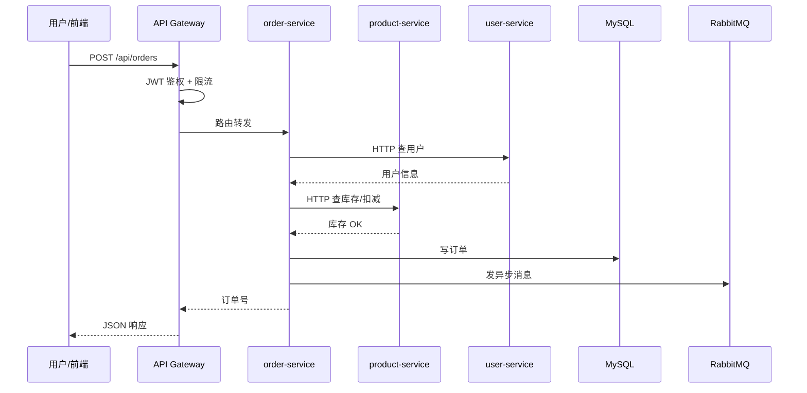
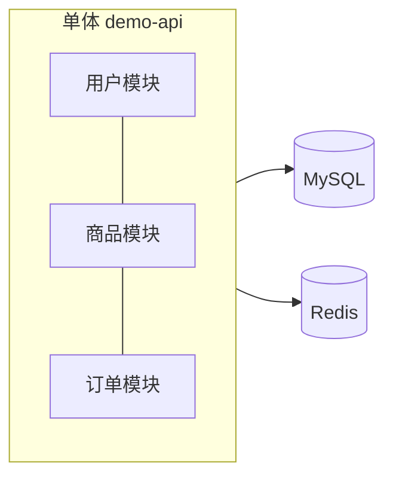
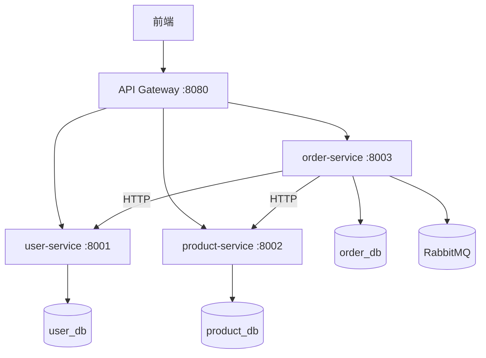
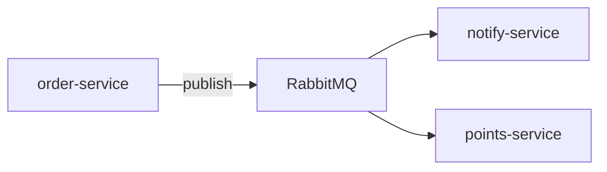

# 微服务与多服务协作基础

> **文件编码**：UTF-8。本章偏概念与架构视野，不要求立刻动手拆 `demo-api`。

<!-- 修改说明: 2026-06-30 按 EXPANSION-STANDARD 扩充 §0、FAQ≥12、闭卷自测、费曼检验 -->

## 0. 读前导读（零基础也能跟上）

### 0.1 用一句话弄懂本章

10 章的 `demo-api` 是**一栋楼里所有部门在一层办公**（单体）；用户量和团队变大后，可能把订单、商品、用户**拆成独立服务各自部署**——本章讲**什么时候拆、怎么通信、网关干什么**，不要求你现在就拆项目。

### 0.2 你需要提前知道什么（真不会就先跳到哪一章）

| 你已会 | 可以直接学本章 |
|--------|----------------|
| 10 章 demo-api 能讲 10 分钟 | ✅ 本章 |
| 只会背「微服务好」、没做过单体 | 先 **[10 项目实战](./10-后端项目实战与面试准备.md)** |
| HTTP、JWT、Docker compose 服务名 | 04、09 章基础要有 |
| 想立刻上 K8s | 本章只建立概念，K8s 见 15 延伸 |

### 0.3 本章知识地图（学完后应能勾选全部 ☐→☑）

- [ ] 能对比单体与微服务优缺点，不说「微服务一定更好」
- [ ] 能说出 3 条「何时考虑拆分」的合理理由
- [ ] 能解释 API 网关的 4 个作用（路由、鉴权、限流、统一入口）
- [ ] 能区分同步 HTTP（httpx）与异步 MQ 的选型
- [ ] 知道服务注册发现解决什么问题
- [ ] 知道分布式事务难在哪，能提最终一致 + 补偿
- [ ] 能画本章 Gateway → Order → Product 序列图并讲解
- [ ] 对照 Java 11 Spring Cloud 说出 Python 侧对应物

### 0.4 建议学习时长与节奏

| 阶段 | 内容 | 建议时长 |
|------|------|----------|
| 第 1 天 | §1～§4 单体 vs 微服务 + 网关 | 2 小时 |
| 第 2 天 | §5～§8 通信、注册发现、事务 | 2 小时 |
| 第 3 天 | §9～§11 追踪 + 对照表 + 练习 | 1.5 小时 |
| 复盘 | FAQ + 闭卷 + 费曼 | 30 分钟 |

### 0.5 学完本章你能做什么（可验证的具体动作）

1. 手绘 10 章单体架构 vs 拆成 user/product/order 三服务架构
2. 口述：「我们 MVP 为什么保持单体」——有依据不空洞
3. 用两个 FastAPI 进程 + httpx 模拟 order 调 product（进阶练习）
4. 面试答分布式事务：「单体用 SQLAlchemy 事务；拆分后用 MQ + 幂等 + 补偿」
5. 对照 [Java 11](../Java/11-微服务与SpringCloud基础.md) 填一张组件对照表

---

## 本章与上一章的关系

[10 章](10-后端项目实战与面试准备.md) 你把单体 `demo-api` 做透了——用户、商品、订单、Redis、Celery 都在一个 uvicorn 进程里。当用户量上来、团队变大，一个应用会越来越难维护：改订单逻辑要重新部署整个 API，商品模块想扩容得把整个 FastAPI 都扩。

这一章不急着动手拆，先建立**微服务概念**：何时拆分、API 网关、服务间通信、与单体 FastAPI 的对比。11 章是「架构视野」，[12 章](12-高并发与分布式系统基础.md) 是「高并发 deeper」——单体扎实后再看这些，才不会只会背组件名。

### 微服务调用链路图



---

## 1. 为什么要学这一章

单体项目做得越来越大时，会逐渐遇到：

- 一个代码库太庞大，新人上手慢
- 模块耦合重，改 A 影响 B
- 发布一次影响全部功能
- 商品读多、订单写多，扩容粒度不同

这时就会引出微服务架构——**不是更高级就一定更好**，而是解决特定阶段的问题。

---

## 2. 单体架构（你现在的 demo-api）

### 2.1 特征

- 所有模块在一个 FastAPI 项目里
- 一次 `uvicorn app.main:app` 部署全部
- 模块间直接 `import` + 函数调用

### 2.2 优点

| 优点 | 说明 |
|------|------|
| 开发简单 | 一个 venv、一个仓库 |
| 调试方便 | 断点贯穿全链路 |
| 事务简单 | 一个 MySQL，SQLAlchemy 本地事务 |
| 部署直接 | 一个 Docker 镜像 |

### 2.3 缺点（规模变大后）

- 代码膨胀，边界模糊
- 无法按模块独立扩容
- 技术栈绑定（全 Python / 全 FastAPI）
- 一次发布风险覆盖全站



---

## 3. 微服务架构

### 3.1 定义

把大系统拆成多个**独立部署、独立扩缩**的小服务，每个服务：

- 有自己的代码库（或 monorepo 子目录）
- 有自己的数据库（理想情况：一服务一库）
- 通过 HTTP/gRPC/MQ 协作

### 3.2 商城拆分示例

| 服务 | 职责 | 端口示例 |
|------|------|----------|
| user-service | 注册、登录、JWT 签发 | 8001 |
| product-service | 商品 CRUD、搜索、库存 | 8002 |
| order-service | 下单、订单查询、取消 | 8003 |
| payment-service | 支付回调（可选） | 8004 |



### 3.3 优点与代价

| 优点 | 代价 |
|------|------|
| 边界清晰、团队可并行 | 分布式调试难 |
| 按服务扩容 | 网络调用延迟 |
| 故障隔离（部分） | 数据一致性变复杂 |
| 技术异构（Python + Go） | 运维、监控、部署成本上升 |

**初学结论**：先把单体 FastAPI 做透；微服务是「问题驱动」的拆分，不是简历装饰。

---

## 4. 何时该拆分服务

### 4.1 适合拆分的信号

- 某模块 QPS 远高于其他（如商品读 >> 订单写）
- 多团队频繁冲突同一仓库
- 某模块需要不同发布节奏（支付合规变更频繁）
- 单体部署时间 > 10 分钟且每天多次发布

### 4.2 不适合拆分的信号

- 团队 < 5 人，业务 MVP 阶段
- 模块间强事务（频繁跨模块同一事务）
- 没有 CI/CD、监控、日志聚合基础

### 4.3 拆分顺序建议

1. **先拆读多写少、边界清晰**：商品服务
2. **再拆核心交易**：订单服务
3. **用户/鉴权**可独立或放网关
4. **支付**最后（外部依赖多）

---

## 5. API 网关（Gateway）

### 5.1 角色

微系统的「统一门口」，常见能力：

- **路由**：`/api/products/*` → product-service
- **鉴权**：JWT 校验一次，下游信任网关或透传 userId
- **限流**：保护后端
- **CORS / HTTPS 终结**
- **日志与 traceId 注入**

### 5.2 与单体 FastAPI 对比

| 能力 | 单体 FastAPI | + API Gateway |
|------|--------------|---------------|
| 路由 | `APIRouter` prefix | 网关按 path 转发 |
| 鉴权 | `Depends(get_current_user)` | 网关或各服务 |
| 文档 | 一个 `/docs` | 各服务独立 OpenAPI，或聚合 |
| 部署 | 一个 uvicorn | 网关 + N 个 uvicorn |

### 5.3 Python 生态选型（了解即可）

| 组件 | 说明 |
|------|------|
| Kong / APISIX | 独立网关，生产常见 |
| Traefik | Docker/K8s 友好 |
| FastAPI 自建 BFF | 小团队用 FastAPI 做聚合层转发 httpx |

### 5.4 简易网关伪代码（FastAPI BFF）

```python
import httpx
from fastapi import FastAPI, Request, HTTPException

app = FastAPI()
SERVICES = {
    "products": "http://product-service:8002",
    "orders": "http://order-service:8003",
}

@app.api_route("/api/{service}/{path:path}", methods=["GET", "POST", "PUT", "DELETE"])
async def proxy(service: str, path: str, request: Request):
    if service not in SERVICES:
        raise HTTPException(404)
    url = f"{SERVICES[service]}/api/{path}"
    async with httpx.AsyncClient() as client:
        resp = await client.request(
            request.method, url,
            headers=dict(request.headers),
            content=await request.body(),
        )
    return resp.json()
```

生产环境更推荐专业网关 + 服务发现，上面仅帮助理解「转发」本质。

---

## 6. 服务间通信

### 6.1 同步：HTTP / REST

- **最常用**：order-service 调 product-service `POST /internal/stock/deduct`
- Python：`httpx`（async）或 `requests`（sync）
- 需要：超时、重试、熔断（见 12 章）

```python
async def deduct_stock(product_id: int, qty: int) -> bool:
    async with httpx.AsyncClient(timeout=3.0) as client:
        resp = await client.post(
            f"{PRODUCT_URL}/internal/stock/deduct",
            json={"productId": product_id, "quantity": qty},
        )
        resp.raise_for_status()
        return resp.json()["success"]
```

### 6.2 同步：gRPC（了解）

- 二进制、高性能，适合内部高频调用
- Python：`grpcio` + protobuf
- 初学阶段 HTTP 足够

### 6.3 异步：消息队列

- 下单后发 MQ，通知、积分、关单解耦
- 与 [08 Celery](08-Celery与消息队列实战.md) 相同思想，跨服务时用 RabbitMQ/Kafka



### 6.4 通信方式选型

| 场景 | 推荐 |
|------|------|
| 下单扣库存（需立即知道结果） | 同步 HTTP |
| 发送短信/邮件 | 异步 MQ |
| 数据最终一致（积分） | 异步 MQ + 补偿 |
| 高频内部调用 | gRPC（进阶） |

---

## 7. 服务注册与发现

### 7.1 问题

`product-service` 部署 3 个实例，IP:端口动态变化，order-service 怎么知道调谁？

### 7.2 方案

| 方案 | 说明 |
|------|------|
| 硬编码 + Nginx | 小规模、Docker Compose 服务名 |
| Consul / etcd / Nacos | 注册中心，健康检查 |
| Kubernetes Service | K8s 内置 DNS + Service |

初学：`docker-compose` 里服务名即 hostname（`http://product-service:8002`）即可。

---

## 8. 配置中心

多服务时数据库 URL、Redis、JWT 密钥分散在多个 `.env` 里难管理。

- **配置中心**：Consul KV、Nacos、Apollo 集中管理，支持动态刷新
- **单体阶段**：一个 `.env` + `pydantic-settings` 足够（见 04/10 章）

---

## 9. 分布式事务（概念）

单体：`db.begin()` 包住订单 + 扣库存。

微服务：订单在 order_db，库存在 product_db——**无法一个本地事务搞定**。

常见思路（先知道名词）：

| 方案 | 说明 |
|------|------|
| 最终一致性 + MQ | 下单成功发消息，库存服务消费扣减，失败补偿 |
| Saga | 每步有补偿操作（取消订单 ↔ 回滚库存） |
| TCC | Try-Confirm-Cancel，实现复杂 |
| Seata 等框架 | Java 生态多；Python 常用 Saga/MQ 方案 |

**面试答法**：「我们 MVP 是单体事务；若拆微服务，会用可靠消息 + 幂等消费实现最终一致，并设计补偿任务。」

---

## 10. 链路追踪

一个请求经过 Gateway → Order → Product → MySQL，慢在哪？

- **traceId**：网关生成，各服务日志透传
- 工具：OpenTelemetry、Jaeger、Zipkin
- Python：`opentelemetry-instrumentation-fastapi`

---

## 11. 单体 vs 微服务对照表

| 维度 | 单体 FastAPI | 微服务 |
|------|--------------|--------|
| 部署单元 | 1 个镜像 | N 个镜像 + 网关 |
| 模块调用 | import / 函数 | HTTP / MQ |
| 事务 | SQLAlchemy 本地 | 分布式 / 最终一致 |
| 测试 | pytest 一个进程 | 契约测试 + 集成环境 |
| 适用阶段 | 0→1、小团队 | 业务复杂、多团队 |
| 本仓库 demo | **10 章主线** | **11 章概念** |

与 [Java 11 微服务](../Java/11-微服务与SpringCloud基础.md) 概念对齐，栈替换为 FastAPI + httpx + Celery。

### 11.1 术语三件套：API Gateway

**API Gateway（API 网关）**：所有外部流量的**统一入口**，负责路由、鉴权、限流等横切能力。
**生活类比**：**商场总服务台**——顾客只找服务台，服务台再指引到各专柜（微服务）。
**为什么重要**：避免前端直连 N 个服务端口；TLS、JWT 可集中处理。
**本章用到的地方**：§3～§4、序列图 Gateway

### 11.2 拆分决策清单（不是微服务万能）

| 信号 | 说明 | demo-api 现状 |
|------|------|---------------|
| 团队 > 1 个 squad 抢同一仓库 | 发布互相阻塞 | MVP 通常否 |
| 某模块 QPS 10× 其他 | 需独立扩容 product-service | 学习项目否 |
| 技术栈必须不同 | 如搜索用 Elasticsearch 独立 | 可选 |
| 法规隔离 | 支付 PCI 独立域 | 了解即可 |

**结论**：10 章单体 + 清晰分层，面试先讲这个，再谈 11 章扩展。

---

## 12. 常见报错与排查（拆分后）

| 现象 | 原因 | 排查 |
|------|------|------|
| 502 Bad Gateway | 下游服务未启动 | docker ps / 健康检查 |
| 连接超时 | 服务名错、网络不通 | compose 同 network |
| 偶发 500 | 下游无熔断，拖垮调用方 | 加超时、熔断（12 章） |
| 数据不一致 | 跨服务无补偿 | 查 MQ 消费日志、对账任务 |
| 重复扣库存 | 接口非幂等 | 幂等键 + 唯一约束 |
| CORS 双重配置 | 网关和服务都配 | 统一在网关处理 |

---

## 13. 练习建议

### 基础

1. 画出 10 章单体 demo-api 架构图，再画拆成 3 服务后的图（纸笔即可）
2. 口述：什么情况下你会拆 product-service？

### 进阶

3. 用两个 FastAPI 项目 + httpx 实现「order 调 product 查库存」（本地两个端口）
4. docker-compose 起 3 个 service + 1 个 nginx 反代

### 挑战

5. 为跨服务调用加 3s 超时 + 失败返回「商品服务暂不可用」
6. 阅读 OpenTelemetry FastAPI 文档，在日志里打印 traceId

---

## 14. 学完标准

- [ ] 能对比单体与微服务优缺点，不说「微服务一定更好」
- [ ] 能解释 API 网关的 4 个作用（路由、鉴权、限流、统一入口）
- [ ] 能说出同步 HTTP 与异步 MQ 的选型场景
- [ ] 知道服务注册发现解决什么问题
- [ ] 知道分布式事务为何难，能提最终一致性 + 补偿
- [ ] 能画本章两张 Mermaid 图并讲解

---

## 15. FAQ

**Q1：初学就要微服务吗？**  
**不要**。10 章单体做透再谈拆分；面试先说「MVP 单体，知道扩展方向」。

**Q2：API Gateway 和 Nginx 一样吗？**  
Nginx 可做网关；Kong/Traefik 等带鉴权、限流插件。概念上都是**统一入口**。

**Q3：服务间为什么常用 HTTP 而不是直接 import？**  
独立部署、独立扩容、独立失败隔离；import 是单体思维。

**Q4：httpx 调用下游要注意什么？**  
**超时**（如 3s）、错误处理、熔断（12 章）；不要无限等待拖死线程池。

**Q5：注册发现解决什么问题？**  
服务 IP/端口动态变化时，调用方不用写死地址；compose 里用**服务名**是入门版。

**Q6：分布式事务为什么难？**  
跨库无法单一 ACID；常用**最终一致** + 可靠消息 + 补偿/Saga。

**Q7：Python 有 Spring Cloud 吗？**  
无等价大一统；常用 FastAPI + httpx + Celery + 独立网关，按场景选组件。

**Q8：拆服务后 JWT 在哪验？**  
通常在**网关统一验**，下游信任网关传入的用户 ID（内网）或再验 token。

**Q9：和 12 章限流熔断什么关系？**  
11 章建立拆分视野；12 章讲拆分后**流量与故障**怎么扛。

**Q10：OpenTelemetry 必须学吗？**  
概念知道即可：traceId 贯穿 Gateway → Order → Product 便于排慢请求。

**Q11：两个 FastAPI 本地怎么联调？**  
不同端口（8001/8002），order 里 `httpx.get("http://127.0.0.1:8002/stock/1")`。

**Q12：面试「你会微服务吗」怎么答？**  
「学习项目单体；理解拆分条件、网关、最终一致；能画架构并对比 httpx 与 MQ。」

---

## 16. 闭卷自测

1. **概念**：单体 FastAPI 的三个优点与三个缺点？
2. **概念**：列出 3 个「可以考虑拆微服务」的信号（非绝对）。
3. **概念**：API Gateway 四项职责？
4. **概念**：同步 HTTP 与 MQ 异步各适合什么场景？
5. **概念**：为什么拆分后本地 SQLAlchemy 事务不够用了？
6. **概念**：compose 服务名与 K8s Service 的相似点？
7. **动手**：order-service 调 product-service 时 httpx 必须设什么参数防雪崩？
8. **动手**：画 Gateway → Order → Product → MySQL 的调用顺序（文字即可）。
9. **综合**：面试官问「你们为什么没拆微服务」，STAR 式回答要点？
10. **综合**：对照 Java 11：Feign ≈ ？Gateway ≈ ？注册中心 ≈ compose 服务名？

### 自测参考答案

1. 优：开发简单、事务本地、部署单一；缺：全量发布、单点扩容、代码耦合风险。
2. 团队独立发布、模块资源需求差异大、某模块 QPS 远高于其他（需独立扩）。
3. 路由、鉴权、限流、统一入口/协议转换。
4. HTTP：实时查库存需立即结果；MQ：通知、异步扣减、削峰。
5. 跨服务多库，无法一个 `begin/commit` 覆盖。
6. 都提供**稳定服务名**解析到实际实例。
7. **timeout**（+ 可选重试/熔断）。
8. 用户 → GW 鉴权 → Order → HTTP 调 Product 查库存 → Order 写 DB → 可选发 MQ。
9. S：MVP 规模；T：快速交付；A：单体 + 清晰分层；R：交付快，知 11 章扩展路径。
10. Feign≈httpx 客户端；Gateway≈Nginx/Kong；注册≈Consul/Eureka，入门≈compose DNS。

---

## 17. 费曼检验

请用 **3 分钟**解释：**「微服务是不是比单体更高级？我们项目为什么先不拆？」**

**对照提纲**：

1. **不是越拆越好**：微服务换来得独立部署，付出分布式复杂度。
2. **单体适合 0→1**：小团队、业务简单、快速迭代——10 章 demo-api。
3. **拆分信号**：团队大、发布冲突、模块资源差异、明确边界。
4. **拆完新问题**：HTTP 调用、分布式事务、链路追踪、运维成本。
5. **面试态度**：单体扎实 + 架构视野，比只会背组件名强。

---

## 下一章预告

11 章建立了「拆服务」的视野——拆完之后，流量上来会遇到限流、超卖、熔断。下一章（[12 高并发与分布式系统基础](12-高并发与分布式系统基础.md)）讲 CAP、幂等、秒杀入门与 Python 限流示例。

---

*下一章：12 高并发与分布式系统基础*

*本章已按 EXPANSION-STANDARD 扩充（§0 导读 + FAQ 12 + 闭卷 + 费曼）。*

**EXPANSION-STANDARD 自检**：☑ §0.1～0.5 ☑ FAQ≥12 §15 ☑ 闭卷 10 题 §16 ☑ 费曼 §17
