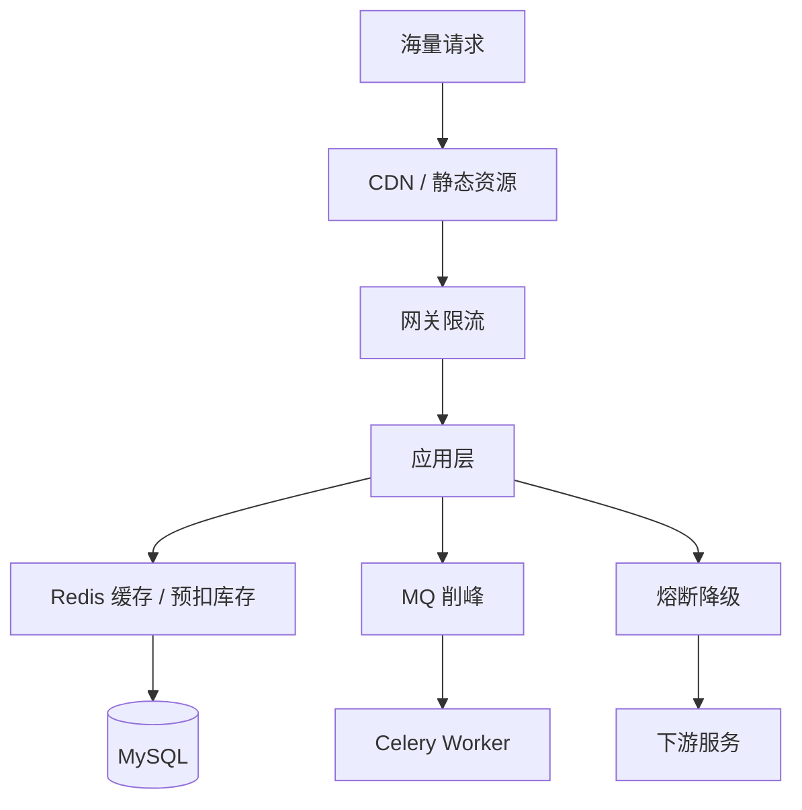
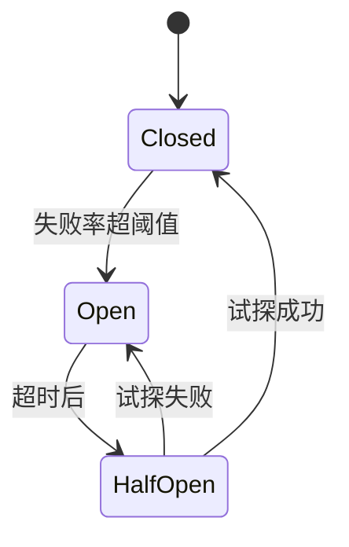
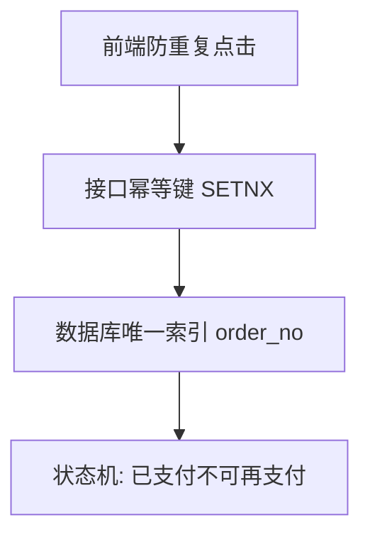
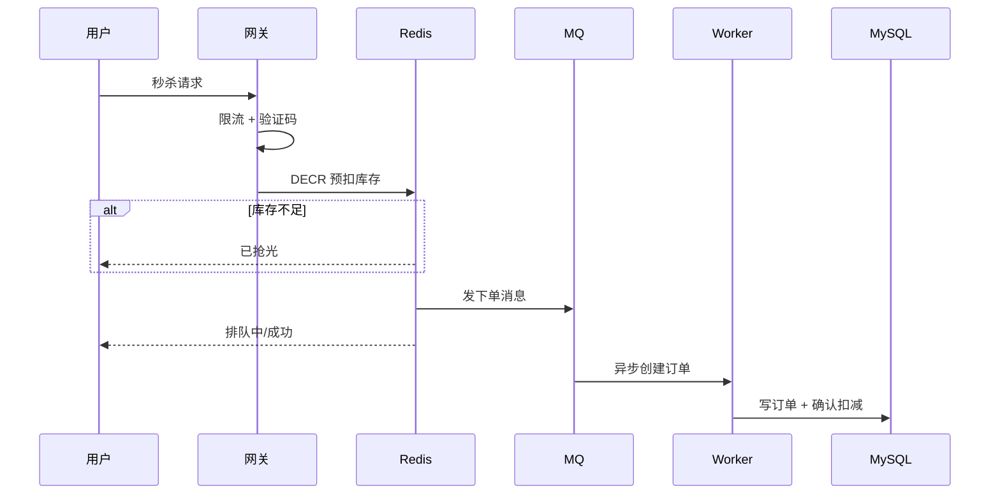

# 高并发与分布式系统基础

> **文件编码**：UTF-8。本章偏概念 + 可运行的 Python 小示例，不要求搭建完整秒杀系统。

<!-- 修改说明: 2026-06-30 按 EXPANSION-STANDARD 扩充 §0、FAQ≥12、闭卷自测、费曼检验 -->

## 0. 读前导读（零基础也能跟上）

### 0.1 用一句话弄懂本章

11 章讲「系统拆开后怎么协作」；12 章讲「**请求太多时怎么不被打垮**」——限流挡在门口、Redis 预扣扛库存、MQ 削峰、熔断保护下游，以及 CAP/幂等这些面试高频词。

### 0.2 你需要提前知道什么（真不会就先跳到哪一章）

| 你已会 | 可以直接学本章 |
|--------|----------------|
| 07 Redis、08 Celery、10 下单事务 | ✅ 本章 |
| 只会 CRUD、没做过缓存/ MQ | 先 **07～10** |
| 想写完整秒杀系统 | 本章是**概念 + 小 demo**，完整方案见 [系统设计 07](../系统设计/07-秒杀系统简化设计.md) |

### 0.3 本章知识地图（学完后应能勾选全部 ☐→☑）

- [ ] 能解释 CAP，并联系 Cache Aside 与下单事务
- [ ] 能说出 4 种限流算法及适用场景
- [ ] 能手写或讲清 Redis SETNX 幂等流程
- [ ] 能画熔断 Closed/Open/HalfOpen 状态机
- [ ] 能讲秒杀分层：限流 → Redis 预扣 → MQ → DB
- [ ] 能对比条件 UPDATE 与 Redis 预扣防超卖
- [ ] 知道降级与熔断的区别
- [ ] 完成 §12 至少一个基础练习（TokenBucket 或口述 CAP）

### 0.4 建议学习时长与节奏

| 阶段 | 内容 | 建议时长 |
|------|------|----------|
| 第 1 天 | §1～§4 高并发 + 限流 + Python 示例 | 2.5 小时 |
| 第 2 天 | §5～§8 熔断、CAP、幂等、秒杀 | 2.5 小时 |
| 第 3 天 | §9～§12 超卖、分库分表概念 + 练习 | 2 小时 |
| 复盘 | FAQ + 闭卷 + 费曼 | 30 分钟 |

### 0.5 学完本章你能做什么（可验证的具体动作）

1. 运行 §4.3 TokenBucket，打印 1000 次请求中被拒绝次数
2. 口述 CAP：Redis 缓存与 MySQL 主从各牺牲/保证什么
3. 白板画秒杀架构四层，说明每层防什么
4. 面试答超卖：MVP 用条件 UPDATE，高并发用 Redis 预扣 + MQ
5. 区分「限流 429」与「熔断返回降级文案」

---

## 本章与上一章的关系

[11 章](11-微服务与多服务协作基础.md) 你理解了微服务拆分和 API 网关——系统变复杂后，瓶颈从「一个进程太慢」变成「数据库被打垮、库存超卖、下游拖死上游」。这一章讲**高并发下的应对思路**：限流、熔断、幂等、CAP、秒杀入门。

不需要你现在就搭秒杀集群，但要能**画架构、讲方案**——[07 Redis](07-Redis核心原理与缓存实战.md)、[08 Celery](08-Celery与消息队列实战.md) 在这章会找到「为什么用在这里」的更大图景。

### 0.6 术语三件套：限流（Rate Limiting）

**限流**：限制单位时间内通过的请求数，保护系统不被流量打垮。
**生活类比**：**景区限流**——每秒只放 100 人进门，其余排队或改日再来。
**为什么重要**：再强的 DB 也有连接上限；限流是 cheapest 的第一道防线。
**本章用到的地方**：§4 令牌桶、§4.4 Redis 滑动窗口

---



---

## 1. 什么是高并发

同一时刻大量请求打到系统，带来的真实问题：

- 数据库连接耗尽、慢查询堆积
- 接口 P99 延迟飙升
- 库存超卖、重复下单
- 进程 OOM、级联故障

高并发优化是**分层防护**，不能只盯一个点。

---

## 2. 常见优化思路

| 手段 | 作用 | 本仓库对应 |
|------|------|------------|
| 缓存 | 减 DB 读压力 | 07 Redis |
| 异步 | 非核心路径削峰 | 08 Celery |
| 限流 | 保护服务不被打垮 | 本章 §4 |
| 降级 | 保核心、关次要 | 本章 §5 |
| 拆分 | 服务/数据分片 | 11 章 |
| 幂等 | 防重复执行 | 本章 §7 |

---

## 3. CAP 定理

分布式系统最多同时满足 **C**（一致性）、**A**（可用性）、**P**（分区容错）中的两个。

- **P** 在分布式网络中几乎必须接受（网络分区会发生）
- 因此实际在 **CP** 与 **AP** 之间权衡

| 系统 | 倾向 | 例子 |
|------|------|------|
| CP | 强一致，分区时可能不可用 | 分布式锁、ZooKeeper |
| AP | 高可用，允许短暂不一致 | Redis 主从、DNS |

**Cache Aside**（07 章）：先更 DB 再删缓存 → 短暂不一致，属 **AP + 最终一致**。

**面试答法**：「我们商品缓存接受秒级不一致，下单扣库存走 DB 事务保证强一致。」

### BASE 理论（了解）

- **BA**（Basically Available）基本可用
- **S**（Soft state）软状态
- **E**（Eventually consistent）最终一致

---

## 4. 限流（Rate Limiting）

### 4.1 目标

控制单位时间请求数，保护 CPU、DB、下游。

### 4.2 常见算法

| 算法 | 思路 | 特点 |
|------|------|------|
| 固定窗口 | 每分钟最多 N 次 | 实现简单，边界突刺 |
| 滑动窗口 | 滚动统计 | 更平滑 |
| 令牌桶 | 匀速放令牌，有令牌才通过 | 允许一定突发 |
| 漏桶 | 恒定速率流出 | 输出平滑 |

### 4.3 Python：内存令牌桶（单进程）

```python
import time
from threading import Lock

class TokenBucket:
    def __init__(self, rate: float, capacity: int):
        self.rate = rate          # 每秒补充令牌数
        self.capacity = capacity
        self.tokens = capacity
        self.last = time.monotonic()
        self.lock = Lock()

    def allow(self) -> bool:
        with self.lock:
            now = time.monotonic()
            self.tokens = min(
                self.capacity,
                self.tokens + (now - self.last) * self.rate,
            )
            self.last = now
            if self.tokens >= 1:
                self.tokens -= 1
                return True
            return False

bucket = TokenBucket(rate=10, capacity=20)  # 每秒 10，突发 20

def rate_limited_handler():
    if not bucket.allow():
        return {"code": 429, "message": "请求过于频繁"}
    return {"code": 0, "message": "ok"}
```

### 4.4 Python：Redis 滑动窗口（多实例）

```python
import redis

r = redis.Redis(host="localhost", port=6379, decode_responses=True)

def is_allowed(key: str, limit: int, window_sec: int) -> bool:
    now = r.time()[0]
    pipe = r.pipeline()
    pipe.zremrangebyscore(key, 0, now - window_sec)
    pipe.zadd(key, {str(now): now})
    pipe.zcard(key)
    pipe.expire(key, window_sec)
    _, _, count, _ = pipe.execute()
    return count <= limit

# 用法：is_allowed(f"rl:user:{user_id}", limit=100, window_sec=60)
```

### 4.5 FastAPI 中间件限流（示例）

```python
from fastapi import Request, HTTPException
from starlette.middleware.base import BaseHTTPMiddleware

class RateLimitMiddleware(BaseHTTPMiddleware):
    def __init__(self, app, bucket: TokenBucket):
        super().__init__(app)
        self.bucket = bucket

    async def dispatch(self, request: Request, call_next):
        if request.url.path.startswith("/api/"):
            if not self.bucket.allow():
                raise HTTPException(status_code=429, detail="Too Many Requests")
        return await call_next(request)
```

生产可用 `slowapi`（基于 limits 库）或网关层限流。

---

## 5. 熔断与降级（Circuit Breaker）

### 5.1 熔断

下游持续失败时，**暂时停止调用**，快速失败，避免线程/连接被拖死。

状态机：**Closed**（正常）→ **Open**（熔断）→ **Half-Open**（试探恢复）



### 5.2 Python：简易熔断器

```python
import time
from enum import Enum

class State(Enum):
    CLOSED = "closed"
    OPEN = "open"
    HALF_OPEN = "half_open"

class CircuitBreaker:
    def __init__(self, fail_threshold: int = 5, reset_timeout: float = 30):
        self.fail_threshold = fail_threshold
        self.reset_timeout = reset_timeout
        self.fail_count = 0
        self.state = State.CLOSED
        self.opened_at = 0.0

    def call(self, func, *args, **kwargs):
        if self.state == State.OPEN:
            if time.monotonic() - self.opened_at >= self.reset_timeout:
                self.state = State.HALF_OPEN
            else:
                raise RuntimeError("Circuit open")

        try:
            result = func(*args, **kwargs)
            self.fail_count = 0
            if self.state == State.HALF_OPEN:
                self.state = State.CLOSED
            return result
        except Exception:
            self.fail_count += 1
            if self.fail_count >= self.fail_threshold:
                self.state = State.OPEN
                self.opened_at = time.monotonic()
            raise
```

库推荐：`pybreaker`、`circuitbreaker`。

### 5.3 降级

| 场景 | 降级策略 |
|------|----------|
| 推荐服务挂了 | 返回默认热门列表 |
| Redis 挂了 | 回源 DB + 限流 |
| 非核心评论 | 返回空列表 |

---

## 6. 幂等（Idempotency）

同一操作执行多次，结果与执行一次相同。

### 6.1 典型场景

- 用户重复点击「提交订单」
- 支付渠道重复回调
- MQ 重复消费
- 前端重试导致重复 POST

### 6.2 三层防护



### 6.3 Python：Redis 幂等

```python
def check_idempotent(redis_client, key: str, ttl: int = 300) -> bool:
    """返回 True 表示首次请求，False 表示重复"""
    return redis_client.set(f"idempotent:{key}", "1", nx=True, ex=ttl) is True
```

### 6.4 数据库层

```sql
CREATE UNIQUE INDEX uk_order_no ON `order`(order_no);
-- 或 (user_id, idempotency_key) 联合唯一
```

---

## 7. 分布式锁（复习 + 扩展）

多 uvicorn worker / 多容器同时扣库存需要互斥。

```python
# Redis 简易锁（生产用 Lua 释放）
import uuid

def acquire_lock(r, name: str, expire: int = 10) -> str | None:
    token = str(uuid.uuid4())
    if r.set(name, token, nx=True, ex=expire):
        return token
    return None
```

详见 [07 章](07-Redis核心原理与缓存实战.md) SETNX + Lua。

---

## 8. 秒杀 / 闪购基础

### 8.1 挑战

- 瞬时流量极大（10w+ QPS）
- 库存极少（100 件）
- 不能超卖、不能拖垮 DB

### 8.2 分层思路



### 8.3 关键手段

| 手段 | 说明 |
|------|------|
| 静态化 | 活动页 CDN，减少动态请求 |
| 读写分离 | 读走从库/缓存 |
| Redis 预扣 | `DECR` / Lua 原子扣减 |
| MQ 削峰 | 订单异步落库 |
| 限流 | 网关 + 用户维度 |

### 8.4 Redis Lua 预扣库存（示例）

```python
DEDUCT_SCRIPT = """
local stock = tonumber(redis.call('GET', KEYS[1]) or '0')
local qty = tonumber(ARGV[1])
if stock >= qty then
    redis.call('DECRBY', KEYS[1], qty)
    return 1
else
    return 0
end
"""
# r.eval(DEDUCT_SCRIPT, 1, "seckill:stock:1001", 1)
```

**MVP 不必实现完整秒杀**；面试能讲清「限流 → Redis 预扣 → MQ 异步 → DB 最终落库」即可。

### 8.1 秒杀流程步骤表

| 步骤 | 层 | 动作 | 预期 | 失败时 |
|------|-----|------|------|--------|
| 1 | 网关 | 全局限流 | 大部分请求 429 | 调阈值 |
| 2 | 应用 | 用户级限流 | 防脚本刷 | Redis 计数 |
| 3 | Redis | DECR/预扣库存 | 仅 100 人拿到资格 | 返回「已抢光」 |
| 4 | MQ | 投递创建订单任务 | 削峰 | 积压加 Worker |
| 5 | Worker | 写 MySQL 订单 | 最终一致 | 对账补偿 |

---

## 9. 超卖问题（与 10 章衔接）

| 方案 | 实现 | 适用 |
|------|------|------|
| 悲观锁 | `SELECT FOR UPDATE` | 并发中等 |
| 乐观锁 | `UPDATE ... WHERE version = ?` | 冲突少 |
| 条件 UPDATE | `WHERE stock >= qty` | **10 章 MVP 推荐** |
| Redis 预扣 | 秒杀高并发 | 08/12 章 |

---

## 10. 分库分表（概念）

单表千万行、单库连接瓶颈时考虑：

- **垂直拆分**：用户表字段拆 profile / auth
- **水平拆分**：order 按 user_id 哈希到 order_0 ~ order_15

Python 常用中间件：ShardingSphere（Java 多）、应用层路由。初学知道「为什么」即可。

---

## 11. 常见报错与排查

| 现象 | 可能原因 | 方向 |
|------|----------|------|
| 429 暴增 | 限流过严 | 调阈值、分用户/接口 |
| 库存负数 | 无原子扣减 | 条件 UPDATE 或 Lua |
| 熔断一直 Open | 下游真挂或阈值太低 | 查日志、调参 |
| 幂等失效 | key 每次不同 | 前端固定 idempotencyKey |
| Redis 与 DB 不一致 | 预扣后 MQ 丢失 | 可靠 MQ + 对账 |
| 慢接口雪崩 | 无超时无熔断 | httpx timeout + 熔断器 |

---

## 12. 练习建议

### 基础

1. 实现 §4.3 TokenBucket，压测 1000 次打印拒绝次数
2. 口述 CAP，举 demo-api 缓存与下单各属哪种权衡

### 进阶

3. Redis 实现 §4.4 滑动窗口限流，写单元测试
4. 用 §5.2 熔断器包装一个「随机失败」的 httpx 调用

### 挑战

5. 模拟秒杀：Redis 库存 100，1000 并发 asyncio 请求，统计成功数
6. 设计「对账任务」：比对 Redis 预扣与 DB 订单数

---

## 13. 学完标准

- [ ] 能解释 CAP，并联系 Cache Aside 与下单事务
- [ ] 能说出 4 种限流算法及适用场景
- [ ] 能手写或讲清 Redis 幂等 SETNX 流程
- [ ] 能画熔断状态机与秒杀分层架构
- [ ] 能对比条件 UPDATE 与 Redis 预扣库存
- [ ] 知道降级与熔断的区别

---

## 14. FAQ

**Q1：高并发和多线程是一回事吗？**  
不是。高并发是**同时很多请求**；应对包括缓存、限流、异步、扩容，不只加线程。

**Q2：令牌桶和漏桶区别？**  
令牌桶允许**一定突发**（桶内有 token）；漏桶输出速率恒定。网关常用令牌桶。

**Q3：Redis 限流和网关限流区别？**  
网关挡在最外；Redis 限流可做**细粒度**（按 user_id、按接口）在应用内实现。

**Q4：熔断和降级区别？**  
**熔断**：下游故障时快速失败，停止调用；**降级**：返回兜底数据（如默认推荐列表）。

**Q5：CAP 必须三选二吗？**  
分布式系统在网络分区时只能在 C 与 A 间权衡；实际用 **BASE**（基本可用 + 最终一致）。

**Q6：Cache Aside 违反 CAP 吗？**  
缓存与 DB 短暂不一致是**最终一致**设计，用先更 DB 再删缓存缓解。

**Q7：幂等 key 放哪一层？**  
**前端**防连点 + **Redis SETNX** + **DB 唯一索引** 三层（14 章场景）。

**Q8：Redis 预扣库存会丢吗？**  
Redis 与 DB 可能不一致；需 **MQ 可靠落库 + 对账任务** 修正。

**Q9：条件 UPDATE 为什么 MVP 够用？**  
`WHERE stock >= qty` 原子扣减，并发中等时简单有效；秒杀量级才要预扣。

**Q10：Python GIL 影响高并发吗？**  
CPU 密集多进程；IO 密集 asyncio + 多 worker；限流逻辑本身轻量。

**Q11：和 11 章微服务关系？**  
拆分后更需要网关限流、熔断、链路追踪——12 章是拆分后的**防护网**。

**Q12：面试秒杀怎么答不夸大？**  
「学习项目未上生产秒杀；理解分层架构，MVP 用条件 UPDATE，扩展方向 Redis+MQ。」

---

## 15. 闭卷自测

1. **概念**：高并发带来的 4 类典型问题？
2. **概念**：令牌桶限流两个核心参数？
3. **概念**：熔断器三种状态及转换条件？
4. **概念**：CAP 各字母含义？Cache Aside 属于哪种权衡？
5. **概念**：幂等三层防御分别是什么？
6. **概念**：秒杀架构四层各做什么？
7. **动手**：Redis SETNX 幂等 key 命名示例？
8. **动手**：条件 UPDATE 扣库存 SQL 关键 WHERE 子句？
9. **综合**：下游支付服务超时导致订单接口慢，你会加什么？
10. **综合**：1000 人抢 100 件商品，简述请求路径（限流到 DB）。

### 自测参考答案

1. DB 连接打满、CPU/IO 瓶颈、超卖、慢调用雪崩。
2. 桶容量（burst）、令牌生成速率（rate）。
3. Closed 正常；失败达阈值 → Open 快速失败；超时 → HalfOpen 试探。
4. C 一致、A 可用、P 分区；缓存最终一致，牺牲强一致换性能。
5. 前端 disable、Redis dedup key、DB unique(order_no)。
6. 网关限流 → Redis 预扣 → MQ 异步下单 → DB 落库。
7. `mq:consumed:{order_no}` 或 `idempotent:{user_id}:{biz}`。
8. `UPDATE product SET stock=stock-? WHERE id=? AND stock>=?`
9. httpx **timeout**、熔断、异步化、缓存、限流（答出 2 个即可）。
10. 限流挡 900 → Redis DECR 100 成功 → MQ → Worker 写 DB（开放题）。

---

## 16. 费曼检验

请用 **3 分钟**解释：**「为什么有了 MySQL 事务，秒杀还要 Redis 和消息队列？」**

**对照提纲**：

1. **MySQL 扛不住瞬时 10 万写**：连接数、行锁竞争。
2. **Redis 内存预扣**：O(1) 判断有没有货，挡掉绝大部分无效请求。
3. **MQ 削峰**：成功预扣的订单排队慢慢写 DB。
4. **事务仍在**：最终落库仍要 ACID，只是**不在峰值瞬间全打 DB**。
5. **MVP**：学习项目用条件 UPDATE 即可，能说扩展路径。

---

## 下一章预告

工程与架构概念齐备——面试还会考算法。下一章（[13 算法与数据结构基础](13-算法与数据结构基础.md)）用 Python 实现核心结构，并提供 50～80 题刷题清单。

---

*下一章：13 算法与数据结构基础*

*本章已按 EXPANSION-STANDARD 扩充（§0 导读 + FAQ 12 + 闭卷 + 费曼）。*

**EXPANSION-STANDARD 自检**：☑ §0.1～0.5 ☑ FAQ≥12 §14 ☑ 闭卷 10 题 §15 ☑ 费曼 §16
