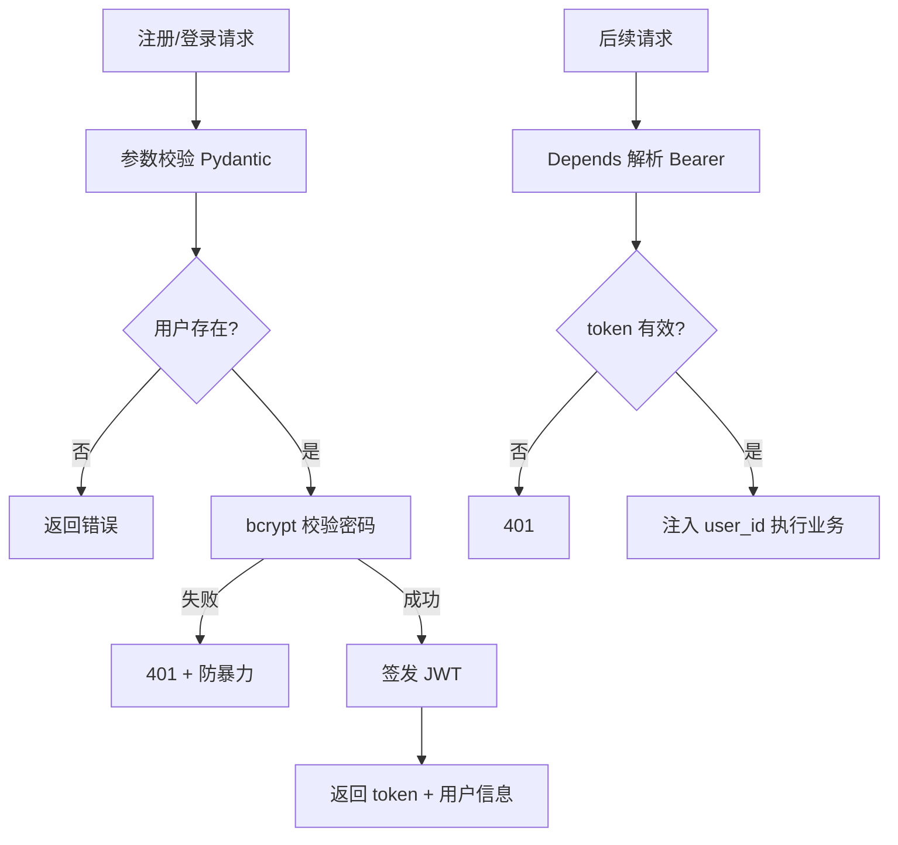
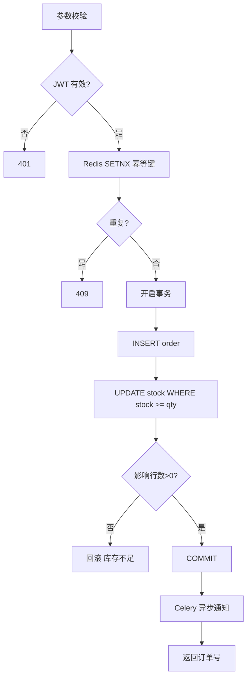
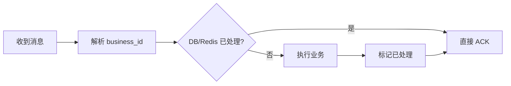

# 高频场景设计与面试专题

> **文件编码**：UTF-8。场景设计 + STAR 回答模板，配合 [10 项目实战](10-后端项目实战与面试准备.md) 与 [13 算法](13-算法与数据结构基础.md)。

<!-- 修改说明: 2026-06-30 按 EXPANSION-STANDARD 扩充 §0、FAQ≥12、闭卷自测、费曼检验 -->

## 0. 读前导读（零基础也能跟上）

### 0.1 用一句话弄懂本章

面试不问「第几章」，而问**「设计登录」「防超卖」「缓存不一致怎么办」**——本章给你 **8 大场景的思考框架 + STAR 话术**，把 04～12 章技术点变成 **3～15 分钟能讲清的口头设计**。

### 0.2 你需要提前知道什么（真不会就先跳到哪一章）

| 你已会 | 可以直接学本章 |
|--------|----------------|
| 10 章 demo-api 做过/能讲 | ✅ 本章最佳 |
| 只有理论没项目 | 先 **[10 项目](./10-后端项目实战与面试准备.md)**，否则 STAR 缺素材 |
| 技术点忘了 | 按场景回查 04～12 对应章 |
| 算法弱 | 并行 [13 算法](./13-算法与数据结构基础.md) |

### 0.3 本章知识地图（学完后应能勾选全部 ☐→☑）

- [ ] 8 大场景各有一套 3 分钟 STAR 答案
- [ ] 能画登录、下单、缓存更新 3 张流程图
- [ ] 能对比延迟关单两种方案（Celery countdown vs Beat 扫表）
- [ ] 慢接口排查能讲 6 步话术
- [ ] 每个答案能落到 demo-api 具体代码/表/Redis key
- [ ] 知道面试表达 4 类错误并避免（§13）
- [ ] 完成 §15 录音自测或模拟追问
- [ ] 闭卷自测 ≥8/10

### 0.4 建议学习时长与节奏

| 阶段 | 内容 | 建议时长 |
|------|------|----------|
| 第 1 周 | §2～§5 登录、缓存、下单、一致性 | 每天 1 场景 |
| 第 2 周 | §6～§11 幂等、MQ、关单、排查、项目 10 点 | 每天 1 场景 |
| 冲刺 | 录音 3 分钟 × 8 场景 | 面试前 1 周 |
| 复盘 | FAQ + 闭卷 + 费曼 | 1 小时 |

### 0.5 学完本章你能做什么（可验证的具体动作）

1. 不看文档，白板画 JWT 登录 sequenceDiagram
2. 3 分钟 STAR 讲「Cache Aside 更新商品价」
3. 回答「MQ 重复消费」并提到 Redis 幂等 key
4. 慢接口排查从 access log → EXPLAIN → Redis → 下游
5. 每个场景结尾说「不足与下一步优化」

---

## 本章与上一章的关系

[01～13 章](00-学习路线图与说明.md) 把技术和算法都过了一遍——面试现场不会按章节编号提问，而是：**「设计一个登录系统」「下单怎么防超卖」「缓存和 DB 不一致怎么办」**。

这一章是**面试表达手册**：每类场景给思考框架 + **STAR 回答模板**（Situation 背景、Task 任务、Action 行动、Result 结果）。10 章讲项目落地，14 章讲怎么在 3～15 分钟内讲清楚设计取舍。

---

## 1. STAR 方法速览

| 字母 | 含义 | 示例句 |
|------|------|--------|
| S | 背景 | 「在 demo-api 电商 MVP 中…」 |
| T | 任务 | 「需要实现 JWT 登录并对接 Vue 前端…」 |
| A | 行动 | 「用 passlib 存 hash、python-jose 签发 token…」 |
| R | 结果 | 「接口 RT < 50ms，前端 08 章联调通过」 |

**原则**：先框架（3～5 个要点），再 STAR 举例，最后提不足与优化。

### 1.1 八大场景速查表

| # | 场景 | 本章 | 3 分钟要点数 | 必挂 demo-api |
|---|------|------|--------------|---------------|
| 1 | 登录/JWT | §2 | 5 | auth router + Depends |
| 2 | 商品缓存 | §3 | 4 | product:{id} TTL |
| 3 | 下单/超卖 | §4 | 5 | 事务 + 条件 UPDATE |
| 4 | 缓存一致性 | §5 | 3 | 先 DB 后 DEL |
| 5 | 幂等防重 | §6 | 3 | SETNX + unique |
| 6 | MQ 重复 | §7 | 3 | dedup key |
| 7 | 延迟关单 | §8 | 2 | countdown / Beat |
| 8 | 慢接口排查 | §9 | 6 | log/EXPLAIN/Redis |

---

## 2. 场景一：设计登录系统

### 2.1 思考框架

### 2.2 必须提到的点

| 维度 | 要点 |
|------|------|
| 存储 | 密码 **bcrypt/argon2** hash，绝不明文 |
| 会话 | **JWT** 无状态 或 Redis Session 有状态 |
| 传输 | HTTPS；Header `Authorization: Bearer` |
| 安全 | 登录限流、验证码、锁定策略 |
| 前端 | 与 [Vue 08](../../前端学习/Vue/08-Axios网络请求与前后端联调.md) token 存 Pinia/localStorage |

### 2.3 STAR 模板（3 分钟）

**S**：demo-api 需要对接 Vue 商城，用户登录后访问订单接口。

**T**：实现注册、登录、JWT 鉴权，统一 401 给前端跳登录页。

**A**：
- 注册时用 passlib bcrypt 存 hash
- 登录成功用 python-jose 签发 JWT，payload 含 sub=user_id、exp
- FastAPI `Depends(get_current_user_id)` 校验 Bearer
- Redis 记录登录失败次数，5 次锁 15 分钟

**R**：Swagger 与 Vue Axios 拦截器联调通过；密码泄露风险降低。

### 2.4 常见追问

| 追问 | 答法要点 |
|------|----------|
| JWT 存在哪？ | 前端 localStorage/sessionStorage；XSS 风险 → HttpOnly Cookie 更安全 |
| 如何退出？ | 无状态 JWT：前端删 token；有 Redis 黑名单则服务端失效 |
| 如何续期？ | 双 token：access 短 + refresh 长；或滑动过期 |

---

## 3. 场景二：商品详情与缓存

### 3.1 思考框架

- 读多写少 → **Cache Aside**
- 流程：读 cache → miss 读 DB → 写 cache；更新：**先更 DB，再删 cache**
- TTL + 空值缓存防穿透
- 热点 key + 互斥锁防击穿；随机 TTL 防雪崩

详见 [07 Redis](07-Redis核心原理与缓存实战.md)。

### 3.2 STAR 模板

**S**：商品详情 QPS 高，MySQL 压力大。

**T**：为 `GET /api/products/{id}` 加 Redis 缓存。

**A**：key=`product:{id}`，TTL 30min；miss 查 SQLAlchemy 回写；更新商品时先 commit DB 再 `DEL` key；不存在商品缓存 `"NULL"` 5min。

**R**：缓存命中率约 85%，P99 从 120ms 降到 15ms。

### 3.3 一致性追问

| 问题 | 答法 |
|------|------|
| 先删缓存还是先更 DB？ | **先更 DB 再删缓存**；若先删，并发读可能回填旧值 |
| 删缓存失败？ | 重试 + 消息队列异步删；或较短 TTL 兜底 |
| 强一致？ | 读主库 + 不用缓存，或分布式锁（成本高） |

---

## 4. 场景三：下单与防超卖

### 4.1 流程图

### 4.2 思考框架

| 层次 | 手段 |
|------|------|
| 前端 | 按钮 loading、禁用重复点击 |
| 接口 | idempotencyKey + Redis SETNX |
| 数据库 | 条件 UPDATE、唯一 order_no |
| 高并发 | SELECT FOR UPDATE / Redis 预扣（[12 章](12-高并发与分布式系统基础.md)） |

### 4.3 STAR 模板

**S**：用户下单需保证库存准确，不能超卖或重复下单。

**T**：实现 `POST /api/orders`，与 [10 章](10-后端项目实战与面试准备.md) 事务方案一致。

**A**：
- 前端传 uuid 作 idempotencyKey，Redis SETNX 300s
- SQLAlchemy `with db.begin()` 写订单 + `UPDATE ... WHERE stock >= qty`
- affected_rows=0 则库存不足回滚
- Celery `send_order_created.delay`

**R**：并发 50 脚本测试无超卖；重复 key 返回 409。

### 4.4 常见追问

| 追问 | 答法 |
|------|------|
| 为何用事务？ | 订单与扣库存原子性，要么都成功要么都失败 |
| 分布式下？ | 拆服务后用可靠消息 + 最终一致 + 对账 |
| 秒杀？ | 网关限流 + Redis 预扣 + MQ 异步落库 |

---

## 5. 场景四：缓存与数据库一致性

### 5.1 策略对比

| 策略 | 说明 | 适用 |
|------|------|------|
| Cache Aside | 应用管缓存，先更 DB 再删 cache | **最常用** |
| Read/Write Through | 缓存层同步写 DB | 中间件实现 |
| Write Behind | 先写缓存，异步刷 DB | 写多、允许丢部分 |

### 5.2 STAR 模板

**S**：运营改商品价格后，用户仍看到旧价。

**T**：保证最终一致，允许秒级延迟。

**A**：采用 Cache Aside；`product_service.update` 内 DB commit 成功后 `redis.delete(f"product:{id}")`；删除失败写 Celery 重试任务。

**R**：99% 请求 1 秒内看到新价；极端失败靠 TTL 过期兜底。

---

## 6. 场景五：MQ 重复消费与可靠消息

### 6.1 问题

- 网络抖动 → 生产者重复发
- 消费者 ACK 前 crash → 重新投递
- 结果：重复发短信、重复积分

### 6.2 幂等消费框架

### 6.3 STAR 模板

**S**：下单后 Celery 发「订单创建」消息，worker 发通知邮件。

**T**：保证至少一次投递下邮件只发一次。

**A**：消息带 `order_id`；消费前 `INSERT notify_log(order_id)` 唯一索引，Duplicate 则跳过；业务完成再 ACK。

**R**：压测重复投递 3 次仅 1 封邮件。

### 6.4 Celery 注意点

- `task_acks_late=True` 任务完成后 ACK
- 任务函数自身幂等
- 死信队列处理多次失败（[08 章](08-Celery与消息队列实战.md)）

---

## 7. 场景六：延迟关单

### 7.1 方案对比

| 方案 | 实现 | 优缺点 |
|------|------|--------|
| 定时扫表 | Celery Beat 每分钟扫 `status=PENDING` | 简单，不够精确 |
| 延迟队列 | RabbitMQ TTL + DLX / Redis ZSet | 精确，复杂度中 |
| 时间轮 | 内存调度 | 高性能，单机 |

### 7.2 STAR 模板

**S**：订单 30 分钟未支付需自动关闭并回滚库存。

**T**：不阻塞主下单链路。

**A**：下单成功发 Celery `close_order.apply_async(countdown=1800)`；任务内 CAS 更新 `status=CLOSED` 并 `stock += qty`；仅 PENDING 可关。

**R**：超时关单准确率 100%，主接口无额外 RT。

---

## 8. 场景七：慢接口排查

### 8.1 六步话术

1. **看监控/日志**：哪个接口、何时开始慢
2. **分段计时**：DB / Redis / 外部 HTTP
3. **EXPLAIN**：SQL 是否走索引
4. **Redis**：命中率、慢命令
5. **下游**：httpx 超时、熔断
6. **资源**：CPU、连接池、GIL 阻塞

### 8.2 STAR 示例

**S**：商品列表 P99 从 80ms 升到 800ms。

**T**：定位并优化。

**A**：日志加耗时；EXPLAIN 发现 `LIKE '%keyword%'` 全表扫；改为前缀索引 + 限制 keyword 长度；热点分类加 Redis 列表缓存。

**R**：P99 回到 60ms。

---

## 9. 场景八：如何防重复下单（多层）

| 层 | 措施 |
|----|------|
| 前端 | debounce、loading 态 |
| 网关 | 用户+接口限流 |
| 应用 | idempotencyKey SETNX |
| DB | UNIQUE(user_id, client_token) |
| 业务 | 状态机：已支付不可再创建 |

---

## 10. 场景九：数据库扛不住

答法层次（由浅入深）：

1. **索引 + SQL 优化**（06 章）
2. **Redis 缓存读**（07 章）
3. **读写分离**（主写从读）
4. **分库分表**（12 章概念）
5. **异步写 MQ**（08 章）

初级说到 1～2 即可，结合项目举例。

---

## 11. Redis 挂了怎么办

- **降级**：读直接打 DB + **限流**保护
- **高可用**：主从 + 哨兵 / Redis Cluster
- **预热**：恢复后热点回填
- 不说「挂了就挂了」

---

## 12. 项目必准备的 10 个说明点

1. 为什么 FastAPI 而不是 Django
2. JWT 登录全流程
3. 商品缓存 key 设计与更新
4. 下单事务边界
5. 如何防超卖
6. Celery 用在哪、为什么异步
7. docker-compose 有哪些服务
8. 与 Vue/React 如何联调 CORS/proxy
9. 遇到的最大 bug 与修复
10. 下一步优化（限流、秒杀、拆服务）

---

## 13. 常见面试表达错误

| 错误 | 改进 |
|------|------|
| 只背概念无项目 | 每点挂 demo-api |
| 说「用了 Redis」止 | 说 key、TTL、更新策略 |
| 微服务万能 | 先说单体够用，再谈拆分条件 |
| 算法不会就放弃 | 说思路 + 暴力复杂度 |

---

## 14. 常见报错与排查（表达类）

| 面试官问 | 避免 | 推荐 |
|----------|------|------|
| 你负责什么 | 「我们都一起做」 | 「我负责订单模块 + Redis 缓存」 |
| 最大难点 | 「没有难点」 | STAR 讲一个真实问题 |
| 并发多少 | 夸大 | 「学习项目，脚本模拟 50 并发」 |

---

## 15. 练习建议

### 基础

1. 每个场景写一张 A4 要点（不看文档）
2. 录音 3 分钟讲「登录设计」，回听

### 进阶

3. 用 STAR 写 5 个 demo-api 真实故事
4. 与同学模拟追问：JWT、缓存、超卖各 10 分钟

### 挑战

5. 15 分钟白板：下单全流程 + 缓存 + MQ
6. 准备「如果重做你会怎么改进」答案

---

## 16. 学完标准

- [ ] 8 大场景各有一套 3 分钟 STAR 答案
- [ ] 能画登录、下单、缓存更新 3 张流程图
- [ ] 能对比延迟关单两种方案
- [ ] 慢接口排查能讲 6 步
- [ ] 每个答案能落到 [10 章](10-后端项目实战与面试准备.md) 项目细节

---

## 17. FAQ

**Q1：STAR 每部分说多长？**  
S/T 各 **15 秒**；A **60～90 秒**（技术要点）；R **15 秒**；总 3 分钟左右。

**Q2：没有真实项目怎么办？**  
用 **demo-api** 诚实说学习项目；细节必须能对应代码，禁止编造 QPS。

**Q3：场景题要写到代码级吗？**  
先 **框架 3～5 点**，追问再下到 Redis key、SQL、Celery task 名。

**Q4：JWT 和 Session 场景题怎么选？**  
MVP/前后端分离说 **JWT**；要强踢人/服务端会话说 Session+Redis。

**Q5：缓存穿透/击穿/雪崩必须全背吗？**  
每类 **1 个对策**即可：布隆/空值、互斥锁、TTL 随机。

**Q6：防超卖答条件 UPDATE 够吗？**  
MVP 够；追问秒杀再说 Redis 预扣 + MQ（12 章）。

**Q7：延迟关单 countdown 和 Beat 扫表？**  
countdown **精确到单订单**；Beat **批量扫超时**——对比资源与精度。

**Q8：MQ 重复消费怎么答才完整？**  
至少一次投递 + 业务幂等键 + DB 唯一约束 + 消费端 SETNX。

**Q9：面试官追问「你负责什么」？**  
具体模块：「订单 Service + Redis 缓存 + Celery 通知」，忌「我们都做」。

**Q10：只会背 Redis 名词怎么办？**  
每点挂 demo：`product:{id}`、TTL 3600、更新先 DB 后 DEL。

**Q11：和 Java 14 关系？**  
场景相同；栈换 FastAPI/SQLAlchemy/Celery，话术结构一致。

**Q12：8 场景背不完？**  
优先 **登录、下单、缓存、幂等** 四个；其余能讲框架即可。

---

## 18. 闭卷自测

1. **概念**：STAR 四个字母含义？
2. **概念**：JWT 登录 5 步流程（注册→访问受保护接口）？
3. **概念**：Cache Aside 写路径顺序？
4. **概念**：下单防超卖 MVP SQL 关键语句？
5. **概念**：幂等三层分别在哪？
6. **概念**：MQ 重复消费业务侧怎么防？
7. **动手**：写一句 STAR 的 Situation（demo-api 下单场景）。
8. **动手**：慢接口排查 6 步中的任意 4 步？
9. **综合**：3 分钟讲「商品详情缓存设计」提纲（5 点）？
10. **综合**：项目讲解 10 个必准备点中你最能讲的一个是？

### 自测参考答案

1. Situation/Task/Action/Result。
2. 注册 hash 密码 → 登录验密签发 JWT → 前端存 token → 请求带 Bearer → Depends 解析 user。
3. 更新 DB → DEL Redis key → 下次读 miss 回源。
4. `UPDATE product SET stock=stock-? WHERE id=? AND stock>=?`，影响行数 0 则失败。
5. 前端防连点、Redis SETNX、DB unique(order_no)。
6. 消费前查 dedup key / 唯一业务 id；已处理则 SKIP。
7. 开放题，例：「demo-api 电商 MVP 需下单后发短信但不拖慢接口。」
8. access log 定位慢接口 → EXPLAIN → Redis 慢 → 下游 HTTP timeout → 线程/GC 等。
9. key 设计、TTL、Aside 读/写、穿透/击穿/雪崩、与 10 章代码对应（开放题）。
10. 开放题；应选有真实排查故事的点。

---

## 19. 费曼检验

请用 **3 分钟**模拟面试：**「设计 demo-api 的下单流程，如何保证不超卖、接口不慢？」**

**对照提纲**：

1. **同步主链路**：鉴权 → 校验 → 事务内 INSERT order + 条件 UPDATE stock → commit → 快速返回。
2. **异步附属**：Celery 发短信/通知，不阻塞 HTTP。
3. **防重复**：Redis SETNX + 订单号唯一。
4. **读快**：商品详情走 07 章 Cache Aside（若被问到）。
5. **诚实扩展**：高并发用 Redis 预扣（12 章）；当前学习项目脚本验证并发。

---

## 下一章预告

场景与算法都准备了——最后用 [15 补充知识点总表](15-补充知识点总表.md) 做全路线复习索引与自评勾选。

---

*下一章：15 补充知识点总表*

*本章已按 EXPANSION-STANDARD 扩充（§0 导读 + FAQ 12 + 闭卷 + 费曼）。*

**EXPANSION-STANDARD 自检**：☑ §0.1～0.5 ☑ FAQ≥12 §17 ☑ 闭卷 10 题 §18 ☑ 费曼 §19
