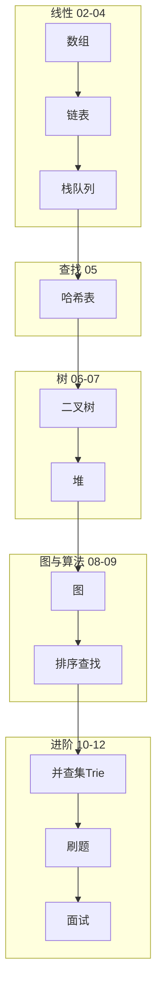

# 数据结构学习路线图与说明

> **文件编码**：本文件夹内所有 `.md` 均为 **UTF-8**。代码示例默认 **Python 3**（最易读），关键处附 Java / **C++ 对照**与各语言 13 章链接。  
> **2026 默认主线**：与 **[C++ 01～36](../C++/00-学习路线图与说明.md)** 并行——C++ 岗用 **C++ 13 + 34 + 本系列 11** 刷题。

---

## 0. 读前导读（零基础也能跟上）

### 0.1 用一句话弄懂本章

**数据结构** = 把数据「怎么摆、怎么连、怎么找」讲清楚；**算法** = 在这些摆法上怎么高效操作。本 00 章不教具体代码，而是告诉你**按什么顺序学、每章解决什么问题、刷多少题够用**。

### 0.2 你需要提前知道什么

| 你现在的水平 | 建议 |
|--------------|------|
| 完全零基础 | 先学任意一门语言 [Python 01](../Python/01-Python基础语法与面向对象.md) 或 [Java 01](../Java/01-Java基础语法与面向对象.md) 的变量、循环、函数 |
| 会写代码但没刷题 | 直接从 **01 复杂度** 开始，01 章有「零基础版大 O 解释」 |
| **ACM / 竞赛背景**（你的情况） | 可快速过 01～06 原理章，重点看每章 **§ 面试口述版** 与 **LeetCode 思维六步**；代码实现你多半会，缺的是「向 HR/面试官讲人话」 |
| 后端工程师补面试 | 本系列 + 任选语言 **13 章** 手撕，11 章 70 题清单 |

### 0.3 本章知识地图（学完后应能勾选全部 ☐→☑）

- [ ] 说出 01～12 各章一句话职责
- [ ] 解释「本文件夹 vs 语言 13 章」分工
- [ ] 按编号列出学习顺序，并知道 02～06 对应哪些 LeetCode 标签
- [ ] 用生活类比向非程序员解释「数组、链表、栈、队列、哈希、树」各是什么
- [ ] 制定个人 4～6 周刷题计划（精刷 50～80 题）
- [ ] 完成本章闭卷自测 §0.6

### 0.4 建议学习时长与节奏

| 周次 | 章节 | 时长 | 刷题量 |
|------|------|------|--------|
| 第 1 周 | 01 + 02 | 8～10 h | Easy 8 题（数组/字符串） |
| 第 2 周 | 03 + 04 | 8～10 h | Easy/Medium 8 题（链表/栈队列） |
| 第 3 周 | 05 + 06 | 10～12 h | Medium 10 题（哈希/树） |
| 第 4～6 周 | 07～12 + 11 题单 | 持续 | 精刷至 50～80 题 |

**每日节奏**：原理 40 min → 手写模板 30 min → 1～2 题 40 min → 复盘 10 min。

### 0.5 学完本章你能做什么（可验证）

1. 打开 [11 章题单](11-LeetCode刷题路线与题型汇总.md)，按标签勾选「已掌握 / 待练」
2. 在笔记区（§11）填好开始日期与薄弱结构
3. 向同学 **3 分钟** 讲完「为什么先学数组再学树」（见 §0.7 费曼提纲）
4. 闭卷画出 §0.8 知识地图里的 02→06 箭头关系

### 0.6 闭卷自测（路线图专版）

1. 本系列与 Java/Python/C++ **13 章** 的分工各是什么？
2. 为什么推荐「先 01～10 原理，再 11 刷题，最后 12 面试」？
3. 哈希表在后端哪三个场景出现？（提示：Redis、路由、缓存）
4. 精刷 50～80 题和泛刷 500 题，本资料推荐哪种？为什么？
5. 学习四步法（§5）的四步分别是什么？
6. 02～06 章各对应哪一类 LeetCode 高频标签？
7. 画图：数组 vs 链表在「随机访问」上的复杂度差异。
8. 若只有 2 周突击面试，你会跳过哪几章、保哪几章？
9. 「懂原理 + 能手写核心操作 + 按标签刷够题量」—— 缺一项会怎样？
10. 你的笔记区（§11）里，「薄弱结构」应如何填写才有用？

<details>
<summary>自测参考答案（先自己做再点开）</summary>

1. 本系列讲**结构原理与何时用**；13 章讲**该语言手撕模板与题单**。
2. 原理建立「为什么用堆/哈希」的语言；没原理只会背题，换形不会；11/12 负责题量与口述。
3. Redis 键值存储、一致性哈希分片、本地 LRU 缓存的 O(1) 索引等。
4. 精刷 50～80；每题归纳模板比题量重要，与 Java 13 一致。
5. 懂结构 → 手写实现 → 每章 3 题 → 1 分钟口述。
6. 02 双指针/窗口/前缀和；03 反转/环/合并；04 单调栈/BFS；05 两数之和/频次；06 遍历/BST。
7. 数组 O(1) 下标访问；链表需从头走 O(n)。
8. 开放题：通常保 01、02、03、05、06 + 11 题单高频；08 图、10 高级可后补。
9. 只会原理不会写 → 手撕挂；只会刷题不会讲 → 面试挂；题量不够 → 见题陌生。
10. 写具体标签如「链表环入口总忘指针复位」，而非「链表弱」。

</details>

### 0.7 费曼检验：3 分钟讲给没学过编程的朋友

**对照提纲**（讲完自检是否覆盖）：

1. **数据结构像收纳方式**：数组是连续格子柜；链表是扣环火车；哈希是带标签的抽屉；树像公司组织架构。
2. **算法是在这种收纳上办事**：找东西多快、插入要不要挪动一堆物品。
3. **学顺序**：先会量快慢（复杂度）→ 最简单的格子（数组）→ 再学更灵活的连法（链表、树）→ 最后集中刷题应付面试。

### 0.8 各结构生活类比速查（02～06 预习）

| 结构 | 生活类比 | 一句话 | 对应章 |
|------|----------|--------|--------|
| **数组** | 电影院的连号座位 | 按号直接入座 O(1)；中间加座要挪人 O(n) | 02 |
| **链表** | 寻宝游戏线索卡 | 每张卡只写下一张在哪；找第 k 张要一张张翻 | 03 |
| **栈** | 洗盘子摞起来 | 最后放的最先拿走（LIFO） | 04 |
| **队列** | 超市排队 | 先来先服务（FIFO） | 04 |
| **哈希表** | 带姓名标签的储物柜 | 看名字标签开柜，理想 O(1) | 05 |
| **树** | 公司汇报关系 | 一个老板多个下属，层层分级 | 06 |

### 0.9 ACM 背景学本路线的特别说明

你有竞赛基础，**实现与复杂度多半不是问题**。面试与后端岗还考：

| 竞赛习惯 | 面试要补 |
|----------|----------|
| 代码越短越好 | **先说思路再写**，边界、复杂度口头报 |
| 卡常数、换语言 | **Python/Java 一种写熟**，API 复杂度要背（`list.insert(0)` 是 O(n)） |
| 独立 AC 即可 | **费曼口述**：「为什么用单调栈而不是暴力？」 |
| 很少问工程 | 每章 **后端映射表** 要能举 Redis/MySQL/缓存例子 |

每章末尾的 **「面试口述版（零基础能听懂）」** 专为你准备：把竞赛术语翻译成业务语言。

### 0.10 LeetCode 思维六步（全系列通用）

做任意题时按此 checklist（02～11 章例题均对照）：

| 步骤 | 问自己 | 常见结论 |
|------|--------|----------|
| 1 读题 | 输入输出？数据范围 n？有序吗？ | n≤10⁵ 禁 O(n²) |
| 2 暴力 | 最简单怎么做？复杂度？ | 双循环 O(n²) 作对照 |
| 3 瓶颈 | 暴力慢在哪？重复计算什么？ | 重复查找 → 哈希；重复区间 → 窗口 |
| 4 选型 | 哪类结构/技巧？ | 见 §0.8 类比表 |
| 5 实现 | 边界：空、单元素、重复 | 先写伪代码 |
| 6 复盘 | 标签、模板、能否变体？ | 记入错题本 |

---

## 1. 这套资料适合谁

- 准备 **后端 / 算法 / 游戏 / 基础架构** 面试，需要系统补数据结构的同学
- 已学或正在学 [Java](../Java/00-学习路线图与说明.md) / [Python](../Python/00-学习路线图与说明.md) / [C++](../C++/00-学习路线图与说明.md)，但「只会刷题、不懂原理」的同学
- 想搞懂 **MySQL 索引、Redis LRU、Hash 分片** 背后结构的同学

**不适合**：仅查某一 LeetCode 题解、不需要理解实现原理的速成需求。

### 与各语言「13 算法章」的分工

| 模块 | 定位 | 代码语言 |
|------|------|----------|
| **本文件夹（数据结构）** | **结构是什么、怎么实现、复杂度、何时用** | Python 为主 + 三语言对照 |
| [Java 13](../Java/13-算法与数据结构基础.md) | Java 手撕模板 + 题单 | Java |
| [Python 13](../Python/13-算法与数据结构基础.md) | Python 手撕模板 + 题单 | Python |
| [C++ 13](../C++/13-算法与数据结构C++实现.md) | C++ STL 模板 + 题单 | C++ |
| [Go 13（本章）](13-Go手撕模板与LeetCode刷题.md) | Go 手撕模板 + Hot 100 + 暑假 80 题 | Go |

**推荐顺序**：本系列 **01～10 打原理** → 任选语言 **13 章刷题** → 本系列 **11～12 巩固面试** → C++ 轨再读 **[C++ 16 分轨](../C++/16-必学技术栈分轨与扩展专题.md)** 定岗位。

---

## 2. 知识主线

```text
复杂度分析（怎么衡量快慢）
  → 线性结构：数组、链表、栈、队列
  → 哈希表（dict / HashMap 原理）
  → 树：二叉树、BST、遍历
  → 堆与优先队列
  → 图：表示、BFS、DFS、最短路入门
  → 排序与查找
  → 高级：并查集、Trie、单调栈/队列
  → 刷题路线 + 面试总表
```

与后端工程的映射：

| 数据结构 | 后端场景 |
|----------|----------|
| 哈希表 | dict/HashMap、Redis 键值、分片路由 |
| 树 / B+ 树 | MySQL 索引（见 Java/Python 06 章） |
| 堆 | TopK、定时任务、任务调度 |
| LRU 链表+哈希 | Redis 缓存淘汰、本地缓存 |
| 并查集 | 连通性、集群合并 |
| 图 | 服务依赖、路由、推荐关系 |

---

## 3. 学习顺序（按编号）

```text
00 学习路线图（你现在在这里）
 ↓
01 复杂度分析与学习方法
 ↓
02 数组与字符串
 ↓
03 链表
 ↓
04 栈与队列
 ↓
05 哈希表
 ↓
06 树与二叉树
 ↓
07 堆与优先队列
 ↓
08 图论基础
 ↓
09 排序与查找算法
 ↓
10 并查集 Trie 与高级结构
 ↓
11 LeetCode 刷题路线与题型汇总
 ↓
12 面试专题与知识点总表
```

### 阶段目标

| 阶段 | 文档 | 目标 |
|------|------|------|
| 基础 | 01 | 会算 O(n)、会画图分析 |
| 线性 | 02～04 | 能手写链表反转、栈应用 |
| 查找 | 05 | 懂哈希冲突、负载因子 |
| 树 | 06～07 | 三种遍历、BST、堆 |
| 图与排序 | 08～09 | BFS/DFS、常见排序 |
| 进阶 | 10 | 并查集、Trie |
| 冲刺 | 11～12 | 题单 + 面试口述 |

---

## 3.1 各章衔接索引

| 编号 | 上一章产出 | 本章解决什么 |
|------|------------|--------------|
| 01 | 00 知道学什么 | 大 O、刷题方法、如何复盘 |
| 02 | 01 会算复杂度 | 数组、双指针、滑动窗口 |
| 03 | 02 连续存储 | 指针/引用思维、链表操作 |
| 04 | 03 链式结构 | LIFO/FIFO、括号匹配 |
| 05 | 04 线性结构 | O(1) 查找、冲突处理 |
| 06 | 05 键值查找 | 层次结构、递归 |
| 07 | 06 树遍历 | 动态最值、TopK |
| 08 | 07 完全二叉堆 | 多节点关系、最短路径入门 |
| 09 | 08 图遍历 | 排序族、二分查找 |
| 10 | 09 基础算法 | 并查集、前缀树 |
| 11 | 01～10 原理齐 | 按标签刷题、70 题路线 |
| 12 | 全部过完 | 查漏、自评 |

---

## 3.2 与三语言路线并行建议

```text
Python/Java/C++ 语言 01～02（基本语法）
  ↓（可并行）
数据结构 01～06
  ↓
语言路线继续 + 数据结构 07～10
  ↓
数据结构 11 + 语言 13 章 同步刷题
  ↓
语言 14 场景题 + 数据结构 12 面试
  ↓（C++ 主线）
[C++ 16 分轨](../C++/16-必学技术栈分轨与扩展专题.md) → 算法轨加刷题 / 桌面轨 [Qt 17](../C++/17-Qt入门与信号槽.md)
```

**2026 默认主线**：[C++ 01～23](../C++/00-学习路线图与说明.md) + [LLMInfra 01～20](../LLMInfra/00-学习路线图与说明.md)（大模型底层）。Web 业务见 Java/Python；Agent 应用见 AIAgent。

### 3.2.1 Go 主攻路线（CCPC/ICPC 背景 · 暑假 8 周）

与 [go-backend-learning-plan.md](../../go-backend-learning-plan.md) 对齐，**Go 后端** 建议：

- **原理**：本系列 **01～10** 速读（竞赛底重点看 §0 口述 + 后端映射），**11 章 70 题** 作 GPS
- **手撕语言**：用 [13-Go 手撕模板](13-Go手撕模板与LeetCode刷题.md) 替代 Java/Python/C++ 13，**LeetCode 一律 Go 提交**，暑假累计 **80 题**
- **语言并行**：`../Go/` **01～04**（语法 + [并发](../Go/04-Go并发编程goroutine与channel.md)）与刷题 **分时段**；**06～11** Gin/GORM/短链项目与 W3 起并行
- **工程验收**：短链 MVP + [Go 13 Docker](../Go/13-Docker与Linux部署Go服务.md) 可部署；算法块写入 `code/leetcode-go/`
- **面试收口**：[数据结构 12](12-面试专题与知识点总表.md) 口述 + [Go 15 总表](../Go/15-Go面试专题与知识点总表.md)；竞赛成绩保留在简历，手撕统一 Go

**C++ 章节对照**：

```text
C++ 01 ↔ 数据结构 01 | C++ 02 ↔ 03 链表 | C++ 04 ↔ 02/05
C++ 13 ↔ 11 题单     | C++ 18～23 ↔ LLMInfra 06/11/13/16
LLMInfra 03～05 需要 GPU + CUDA
```

---

## 3.3 资料建设进度

| 编号 | 文件名 | 建设状态 | 扩充状态 |
|------|--------|----------|----------|
| 00 | 学习路线图与说明 | ✅ 已建立 | ✅ EXPANSION-STANDARD |
| 01 | 复杂度分析与学习方法 | ✅ 已建立 | ✅ EXPANSION-STANDARD |
| 02 | 数组与字符串 | ✅ 已建立 | ✅ EXPANSION-STANDARD |
| 03 | 链表 | ✅ 已建立 | ✅ EXPANSION-STANDARD |
| 04 | 栈与队列 | ✅ 已建立 | ✅ EXPANSION-STANDARD |
| 05 | 哈希表 | ✅ 已建立 | ✅ EXPANSION-STANDARD |
| 06 | 树与二叉树 | ✅ 已建立 | ✅ EXPANSION-STANDARD |
| 07 | 堆与优先队列 | ✅ 已建立 | ⬜ 待扩充 |
| 08 | 图论基础 | ✅ 已建立 | ⬜ 待扩充 |
| 09 | 排序与查找算法 | ✅ 已建立 | ⬜ 待扩充 |
| 10 | 并查集 Trie 与高级结构 | ✅ 已建立 | ⬜ 待扩充 |
| 11 | LeetCode 刷题路线 | ✅ 已建立 | ⬜ 待扩充 |
| 12 | 面试专题与知识点总表 | ✅ 已建立 | ⬜ 待扩充 |
| 13 | Go 手撕模板与 LeetCode | ✅ 已建立 | ✅ EXPANSION-STANDARD |

---

## 4. 必备工具

| 工具 | 用途 |
|------|------|
| **LeetCode 中文站** | 在线刷题、看题解 |
| **Python 3.10+** | 运行本章示例（已学 [Python 01](../Python/01-Python基础语法与面向对象.md) 更佳） |
| 纸笔 / Excalidraw | 画链表指针、树结构 |
| 可选：VisuAlgo | 可视化排序、树遍历 |

验证 Python：

```powershell
python --version
python -c "print('DS module ready')"
```

---

## 5. 学习四步法（每章）

1. **懂结构**：这结构解决什么问题？内存长什么样？
2. **手写实现**：不看答案实现核心操作（如 `push/pop`、插入节点）
3. **做 3 道题**：章节末尾 LeetCode 编号
4. **讲出来**：合上书，用 1 分钟口述「哈希表怎么 O(1) 查找」

### 5.1 手把手：第一次打开 LeetCode 刷题

| 步骤 | 你的动作 | 预期看到什么 | 若不对 |
|------|----------|--------------|--------|
| 1 | 注册 [leetcode.cn](https://leetcode.cn/) | 能进题库 | 换网络/邮箱验证 |
| 2 | 搜「1. 两数之和」 | 题目页、示例 | 05 章未学可先标记 |
| 3 | 读题 5 min：输入、输出、约束 | 笔记：n≤10⁴ | 漏看「下标从 0 开始」 |
| 4 | 按 §0.10 六步想暴力 O(n²) | 能口述优化到 O(n) 用哈希 | 回 05 章 |
| 5 | 选 Python3 提交 | Accept 或 Wrong Answer | WA 看用例；TLE 估复杂度 |
| 6 | 复盘：标签 `数组` `哈希` | 错题本一行 | 只抄题解不重写 |

---

## 6. 刷题时间参考

| 阶段 | 时长 | 目标 |
|------|------|------|
| 01～06 | 3～4 周 | 线性与树，Easy 30 题 |
| 07～10 | 2～3 周 | 堆、图、并查集，Medium 15 题 |
| 11～12 | 持续 | 按题单精刷 50～80 题 |

**精刷 50～80 题** 比泛刷 500 题更有效（与 Java 13 一致）。

---

## 7. 学完后你应该能

- [ ] 口述常见结构的时间/空间复杂度
- [ ] 手写单链表反转、环检测、合并有序链表
- [ ] 解释哈希冲突解决方法
- [ ] 写出二叉树前/中/后序（递归+迭代）
- [ ] 用堆解决 TopK，用 BFS 做层序遍历
- [ ] 知道快排、归并思路与 O(n log n) 原因
- [ ] 并查集、Trie 能解决什么问题

---

## 8. FAQ

### Q1：要先学完 Python 再学数据结构吗？

不强制。本章 Python 示例极简，有任意语言基础即可；不会 Python 可看 Java/C++ 13 章对照实现。

### Q2：和计算机专业《数据结构》课一样吗？

目标一致，本资料**面向面试 + 后端映射**，少证明、多实现与刷题衔接。

### Q3：需要数学很好吗？

高中数学 + 逻辑即可；复杂度用直觉+多练。

### Q4：我有 ACM 背景，01～06 还要逐字读吗？

**建议速读 + 重点看**：§0 面试口述、LeetCode 六步、FAQ、闭卷自测。实现可跳过，但 **Python API 陷阱**（如 `list.pop(0)`、`dict` 均摊 O(1)）和 **后端映射** 必须过一遍。

### Q5：02～06 每章大概多少题才算「过关」？

每章 **5～8 道精刷**（推荐题表里的 ★★★），能闭卷写模板 + 1 分钟讲思路。全系列累计 **50～80 题** 覆盖 80% 面试。

### Q6：单调栈、并查集要不要提前学？

跟编号走：单调栈在 **04**，并查集在 **10**。提前偷看可以，但别跳过 03 链表的指针手感。

### Q7：MySQL B+ 树和 06 二叉树什么关系？

06 教**树思维与遍历**；B+ 树是多叉、叶子链表，面试说「层次索引、范围查询、减少磁盘 IO」即可，细节见 Java/Python 06 数据库章。

### Q8：刷题用 Python 还是 Java？

**选一种写熟**。后端 Java 岗建议 Java 13 手撕；算法岗 Python 更快。本系列示例 Python，对照表在三语言 13 章。

### Q9：每天学多久合适？

在职 **1～1.5 h/天** 可持续；全职 **3～4 h/天** 约 4 周过完 01～06 + 题量。

### Q10：怎么知道该复习哪一章？

用各章 **闭卷自测** 与 12 章自评表；错题按 **标签** 回到对应章（如 142 环入口 → 03）。

### Q11：VisuAlgo 等可视化要花时间吗？

可选。链表/树 **手画指针** 比只看动画更重要。

### Q12：11 章 70 题和 13 章题单重复吗？

**故意重叠**：11 章按数据结构组织；13 章按语言模板。做一遍即可，复盘写在一处。

---

## 8.1 02～06 章 LeetCode 标签与必背模板（速查）

| 章 | 必背模板 | 代表题 | 面试一句话 |
|----|----------|--------|------------|
| 02 | 对撞/快慢/滑动窗口/前缀和 | 3, 167, 560 | 「连续区间用窗口；区间和用前缀+哈希」 |
| 03 | dummy、三指针反转、Floyd | 206, 142, 21 | 「改链画指针；环用快慢再复位」 |
| 04 | 栈匹配、单调栈、双栈队列、BFS | 20, 739, 232 | 「LIFO 匹配；单调栈 O(n) 找下一个更大」 |
| 05 | 补数 map、set 起点、LRU | 1, 128, 146 | 「空间换 O(1) 查找；LRU=哈希+链」 |
| 06 | 四种遍历、BST 区间、LCA 分治 | 102, 98, 236 | 「中序 BST 有序；BFS 固定层宽」 |

### 8.2 后端场景 × 数据结构（面试口述素材）

| 业务问题 | 结构 | 你怎么答 |
|----------|------|----------|
| 缓存满淘汰谁 | LRU = 哈希 + 双向链 | 「O(1) 定位 key，O(1) 移到最新/删最旧」 |
| 接口限流滑动窗口 | 04 deque / 02 窗口 | 「维护时间戳队列，窗口外弹出」 |
| 用户 session 快速查 | 05 哈希 | 「sessionId hash 到内存 dict」 |
| 评论树展示 | 06 树 DFS/BFS | 「多叉变二叉或直接用多叉层序」 |
| 排行榜 TopK | 07 堆（预习） | 「维护 size=k 小根堆」 |

### 8.3 两周突击路线（在职）

```text
Day 1-2:  01 + 02（数组 5 题）
Day 3-4:  03（206/21/141 闭卷）
Day 5-6:  04（20/739/232）
Day 7-8:  05（1/128/560）
Day 9-10: 06（102/98/104/226）
Day 11-14: 11 章题单查漏 + 12 章自评
```

每天 **1.5 h**：40 min 读 §0+模板，50 min 1～2 题，10 min 费曼录音自讲。

---

## 9. 文档索引

| 编号 | 文件名 | 一句话 |
|------|--------|--------|
| 00 | 学习路线图 | 顺序、分工 |
| 01 | 复杂度分析 | 大 O、刷题法 |
| 02 | 数组与字符串 | 双指针、窗口 |
| 03 | 链表 | 反转、环、合并 |
| 04 | 栈与队列 | 单调栈、BFS 基础 |
| 05 | 哈希表 | 两数之和、设计 |
| 06 | 树与二叉树 | 遍历、BST |
| 07 | 堆与优先队列 | TopK、合并 K 路 |
| 08 | 图论基础 | BFS、DFS、拓扑 |
| 09 | 排序与查找 | 快排、二分 |
| 10 | 高级结构 | 并查集、Trie |
| 11 | 刷题路线 | 70 题清单 |
| 12 | 面试总表 | 自评索引 |
| 13 | Go 手撕模板 | Go 模板 + 80 题 |

---

## 10. 知识地图



---

## 11. 我的笔记区

```text
学习开始日期：
当前进度（编号）：
薄弱结构（如链表/图）：
LeetCode 已刷题数：
下周计划：
```

---

祝你学习顺利。**数据结构 = 懂原理 + 能手写核心操作 + 按标签刷够题量。**
