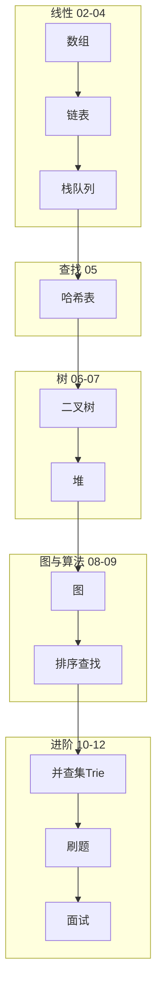

# 数据结构学习路线图与说明

> **文件编码**：本文件夹内所有 `.md` 均为 **UTF-8**。代码示例默认 **Python 3**（最易读），关键处附 Java / C++ 对照与各语言 13 章链接。

---

## 1. 这套资料适合谁

- 准备 **后端 / 算法 / 游戏 / 基础架构** 面试，需要系统补数据结构的同学
- 已学或正在学 [Java](../Java/00-学习路线图与说明.md) / [Python](../Python/00-学习路线图与说明.md) / [C++](../C++/00-学习路线图与说明.md)，但「只会刷题、不懂原理」的同学
- 想搞懂 **MySQL 索引、Redis LRU、Hash 分片** 背后结构的同学

**不适合**：仅查某一 LeetCode 题解、不需要理解实现原理的速成需求。

### 与各语言「13 算法章」的分工

| 模块 | 定位 | 代码语言 |
|------|------|----------|
| **本文件夹（数据结构）** | **结构是什么、怎么实现、复杂度、何时用** | Python 为主 + 三语言对照 |
| [Java 13](../Java/13-算法与数据结构基础.md) | Java 手撕模板 + 题单 | Java |
| [Python 13](../Python/13-算法与数据结构基础.md) | Python 手撕模板 + 题单 | Python |
| [C++ 13](../C++/13-算法与数据结构C++实现.md) | C++ STL 模板 + 题单 | C++ |

**推荐顺序**：本系列 **01～10 打原理** → 任选语言 **13 章刷题** → 本系列 **11～12 巩固面试**。

---

## 2. 知识主线

```text
复杂度分析（怎么衡量快慢）
  → 线性结构：数组、链表、栈、队列
  → 哈希表（dict / HashMap 原理）
  → 树：二叉树、BST、遍历
  → 堆与优先队列
  → 图：表示、BFS、DFS、最短路入门
  → 排序与查找
  → 高级：并查集、Trie、单调栈/队列
  → 刷题路线 + 面试总表
```

与后端工程的映射：

| 数据结构 | 后端场景 |
|----------|----------|
| 哈希表 | dict/HashMap、Redis 键值、分片路由 |
| 树 / B+ 树 | MySQL 索引（见 Java/Python 06 章） |
| 堆 | TopK、定时任务、任务调度 |
| LRU 链表+哈希 | Redis 缓存淘汰、本地缓存 |
| 并查集 | 连通性、集群合并 |
| 图 | 服务依赖、路由、推荐关系 |

---

## 3. 学习顺序（按编号）

```text
00 学习路线图（你现在在这里）
 ↓
01 复杂度分析与学习方法
 ↓
02 数组与字符串
 ↓
03 链表
 ↓
04 栈与队列
 ↓
05 哈希表
 ↓
06 树与二叉树
 ↓
07 堆与优先队列
 ↓
08 图论基础
 ↓
09 排序与查找算法
 ↓
10 并查集 Trie 与高级结构
 ↓
11 LeetCode 刷题路线与题型汇总
 ↓
12 面试专题与知识点总表
```

### 阶段目标

| 阶段 | 文档 | 目标 |
|------|------|------|
| 基础 | 01 | 会算 O(n)、会画图分析 |
| 线性 | 02～04 | 能手写链表反转、栈应用 |
| 查找 | 05 | 懂哈希冲突、负载因子 |
| 树 | 06～07 | 三种遍历、BST、堆 |
| 图与排序 | 08～09 | BFS/DFS、常见排序 |
| 进阶 | 10 | 并查集、Trie |
| 冲刺 | 11～12 | 题单 + 面试口述 |

---

## 3.1 各章衔接索引

| 编号 | 上一章产出 | 本章解决什么 |
|------|------------|--------------|
| 01 | 00 知道学什么 | 大 O、刷题方法、如何复盘 |
| 02 | 01 会算复杂度 | 数组、双指针、滑动窗口 |
| 03 | 02 连续存储 | 指针/引用思维、链表操作 |
| 04 | 03 链式结构 | LIFO/FIFO、括号匹配 |
| 05 | 04 线性结构 | O(1) 查找、冲突处理 |
| 06 | 05 键值查找 | 层次结构、递归 |
| 07 | 06 树遍历 | 动态最值、TopK |
| 08 | 07 完全二叉堆 | 多节点关系、最短路径入门 |
| 09 | 08 图遍历 | 排序族、二分查找 |
| 10 | 09 基础算法 | 并查集、前缀树 |
| 11 | 01～10 原理齐 | 按标签刷题、70 题路线 |
| 12 | 全部过完 | 查漏、自评 |

---

## 3.2 与三语言路线并行建议

```text
Python/Java/C++ 语言 01～02（基本语法）
  ↓（可并行）
数据结构 01～06
  ↓
语言路线继续 + 数据结构 07～10
  ↓
数据结构 11 + 语言 13 章 同步刷题
  ↓
语言 14 场景题 + 数据结构 12 面试
```

---

## 3.3 资料建设进度

| 编号 | 文件名 | 建设状态 |
|------|--------|----------|
| 00 | 学习路线图与说明 | ✅ 已建立 |
| 01 | 复杂度分析与学习方法 | ✅ 已建立 |
| 02 | 数组与字符串 | ✅ 已建立 |
| 03 | 链表 | ✅ 已建立 |
| 04 | 栈与队列 | ✅ 已建立 |
| 05 | 哈希表 | ✅ 已建立 |
| 06 | 树与二叉树 | ✅ 已建立 |
| 07 | 堆与优先队列 | ✅ 已建立 |
| 08 | 图论基础 | ✅ 已建立 |
| 09 | 排序与查找算法 | ✅ 已建立 |
| 10 | 并查集 Trie 与高级结构 | ✅ 已建立 |
| 11 | LeetCode 刷题路线 | ✅ 已建立 |
| 12 | 面试专题与知识点总表 | ✅ 已建立 |

---

## 4. 必备工具

| 工具 | 用途 |
|------|------|
| **LeetCode 中文站** | 在线刷题、看题解 |
| **Python 3.10+** | 运行本章示例（已学 [Python 01](../Python/01-Python基础语法与面向对象.md) 更佳） |
| 纸笔 / Excalidraw | 画链表指针、树结构 |
| 可选：VisuAlgo | 可视化排序、树遍历 |

验证 Python：

```powershell
python --version
python -c "print('DS module ready')"
```

---

## 5. 学习四步法（每章）

1. **懂结构**：这结构解决什么问题？内存长什么样？
2. **手写实现**：不看答案实现核心操作（如 `push/pop`、插入节点）
3. **做 3 道题**：章节末尾 LeetCode 编号
4. **讲出来**：合上书，用 1 分钟口述「哈希表怎么 O(1) 查找」

---

## 6. 刷题时间参考

| 阶段 | 时长 | 目标 |
|------|------|------|
| 01～06 | 3～4 周 | 线性与树，Easy 30 题 |
| 07～10 | 2～3 周 | 堆、图、并查集，Medium 15 题 |
| 11～12 | 持续 | 按题单精刷 50～80 题 |

**精刷 50～80 题** 比泛刷 500 题更有效（与 Java 13 一致）。

---

## 7. 学完后你应该能

- [ ] 口述常见结构的时间/空间复杂度
- [ ] 手写单链表反转、环检测、合并有序链表
- [ ] 解释哈希冲突解决方法
- [ ] 写出二叉树前/中/后序（递归+迭代）
- [ ] 用堆解决 TopK，用 BFS 做层序遍历
- [ ] 知道快排、归并思路与 O(n log n) 原因
- [ ] 并查集、Trie 能解决什么问题

---

## 8. FAQ

### Q1：要先学完 Python 再学数据结构吗？

不强制。本章 Python 示例极简，有任意语言基础即可；不会 Python 可看 Java/C++ 13 章对照实现。

### Q2：和计算机专业《数据结构》课一样吗？

目标一致，本资料**面向面试 + 后端映射**，少证明、多实现与刷题衔接。

### Q3：需要数学很好吗？

高中数学 + 逻辑即可；复杂度用直觉+多练。

---

## 9. 文档索引

| 编号 | 文件名 | 一句话 |
|------|--------|--------|
| 00 | 学习路线图 | 顺序、分工 |
| 01 | 复杂度分析 | 大 O、刷题法 |
| 02 | 数组与字符串 | 双指针、窗口 |
| 03 | 链表 | 反转、环、合并 |
| 04 | 栈与队列 | 单调栈、BFS 基础 |
| 05 | 哈希表 | 两数之和、设计 |
| 06 | 树与二叉树 | 遍历、BST |
| 07 | 堆与优先队列 | TopK、合并 K 路 |
| 08 | 图论基础 | BFS、DFS、拓扑 |
| 09 | 排序与查找 | 快排、二分 |
| 10 | 高级结构 | 并查集、Trie |
| 11 | 刷题路线 | 70 题清单 |
| 12 | 面试总表 | 自评索引 |

---

## 10. 知识地图



---

## 11. 我的笔记区

```text
学习开始日期：
当前进度（编号）：
薄弱结构（如链表/图）：
LeetCode 已刷题数：
下周计划：
```

---

祝你学习顺利。**数据结构 = 懂原理 + 能手写核心操作 + 按标签刷够题量。**
