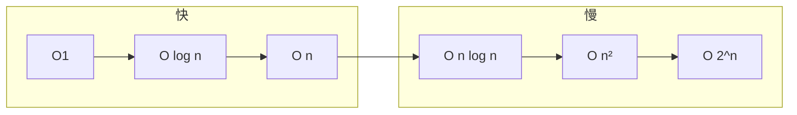

# 复杂度分析与学习方法

> **文件编码**：UTF-8。代码示例默认 **Python 3**。

---

## 0. 读前导读（零基础也能跟上）

### 0.1 用一句话弄懂本章

**复杂度** = 数据量变大时，程序「时间/空间」增长有多快；**学习方法** = 怎么刷题、怎么复盘，后面 02～12 章都共用这套语言。

### 0.2 你需要提前知道什么

| 背景 | 建议 |
|------|------|
| 零基础 | 会写 `for` 循环即可；不懂循环先看 Python/Java 01 |
| ACM 背景 | 本章可 30 min 速通，重点看 **§0.9 面试口述版** 与 **§15 FAQ** |
| 只刷题不讲原理 | 必读本章，否则面试「为什么 O(n)」答不上 |

**真不会循环**：先跳 [Python 01](../Python/01-Python基础语法与面向对象.md) §3～§4，再回来。

### 0.3 本章知识地图（学完后应能勾选 ☐→☑）

- [ ] 解释 O(1)、O(log n)、O(n)、O(n log n)、O(n²) 各举一例
- [ ] 分析含 1～2 层循环代码的时间复杂度
- [ ] 说出递归除深度外还要算**栈空间**
- [ ] 用「数循环 + 看 API」排查 hidden O(n)
- [ ] 按四步刷题法完成 1 道题并复盘
- [ ] 完成 §17 闭卷自测

### 0.4 建议学习时长与节奏

- **零基础**：2～3 天，每天 1.5 h（概念 1 h + 练 5 道分析题）
- **ACM 背景**：0.5 天，做 §17 自测 + 读 §0.9 口述模板

### 0.5 学完本章你能做什么

1. 看到 `for i: for j:` 脱口而出 O(n²)
2. 读 LeetCode 题面 n≤10⁵，判断能否用 O(n²)
3. 向面试官说明：「我用哈希表把查找从 O(n) 降到均摊 O(1)」

### 0.6 生活类比：复杂度像「快递规模」

| 复杂度 | 类比 | 数据量 ×10 时 |
|--------|------|----------------|
| O(1) | 按门牌号直接取件 | 工作量不变 |
| O(log n) | 每次猜范围减半 | 略增 |
| O(n) | 逐户送一遍 | ×10 |
| O(n²) | 每两户配对检查 | ×100 |
| O(2ⁿ) | 每种组合试一遍 | 爆炸 |

**术语（Time Complexity）**：输入规模 n 增长时，运行时间增长的上界趋势。  
**生活类比**：上表快递比喻。  
**为什么重要**：LeetCode 1s 内约 10⁸ 步，n=10⁵ 时 O(n²) 常 TLE。  
**本章用到的地方**：§3～§6。

---

## 本章与上一章的关系

00 路线图划定了 **01～12 章** 的学习顺序。本章不教具体结构，而是教**怎么衡量算法快慢、怎么刷题、怎么复盘**——后面每一章的「O(n)」「O(log n)」都建立在本章之上。

---

## 1. 这份文档学什么

- 时间复杂度、空间复杂度（大 O 表示法）
- 最好 / 平均 / 最坏情况
- 刷题平台、复盘方法、手写练习习惯
- 为 02～11 章提供共同语言

---

## 2. 为什么复杂度很重要

后端面试写算法，考官常问：

1. 你的解法复杂度是多少？
2. 能不能优化到 O(n)？
3. 为什么用哈希表而不是暴力？

不懂大 O，刷再多题也讲不清「为什么这题用堆」。

### 与后端工程的联系

| 工程现象 | 复杂度直觉 |
|----------|------------|
| 全表扫描慢 | O(n) |
| 索引查找快 | O(log n) |
| Redis 单 key | O(1) 均摊 |
| 嵌套循环接口 | O(n²) 危险 |

详见 [Java 06 MySQL 索引](../Java/06-MySQL基础索引与事务.md)、[Python 07 Redis](../Python/07-Redis核心原理与缓存实战.md)。

---

## 3. 大 O 表示法

**大 O** 描述当输入规模 `n` 增大时，运行时间或额外空间的**增长趋势**（忽略常数和低阶项）。

| 复杂度 | 名称 | n=1000 量级直觉 | 典型例子 |
|--------|------|-----------------|----------|
| O(1) | 常数 | 瞬间 | 哈希查找、数组下标 |
| O(log n) | 对数 | 很快 | 二分、平衡树查找 |
| O(n) | 线性 | 可接受 | 单次遍历 |
| O(n log n) | 线性对数 | 排序下限 | 快排、归并 |
| O(n²) | 平方 | n 大则慢 | 双重循环 |
| O(2ⁿ) | 指数 | 仅小 n | 暴力子集 |
| O(n!) | 阶乘 | 几乎不可用 | 全排列暴力 |

```python
# O(1)
def get_first(arr: list) -> int:
    return arr[0]

# O(n)
def sum_arr(arr: list) -> int:
    total = 0
    for x in arr:
        total += x
    return total

# O(n²)
def count_pairs(arr: list) -> int:
    cnt = 0
    for i in range(len(arr)):
        for j in range(i + 1, len(arr)):
            if arr[i] == arr[j]:
                cnt += 1
    return cnt
```

---

## 4. 如何分析一段代码

### 4.1 数循环层数

- 一层循环 → 通常 O(n)
- 两层嵌套 → 通常 O(n²)
- 循环折半（`n //= 2`）→ O(log n)

### 4.2 递归

递归深度 × 每层工作量：

```python
def binary_search(nums: list[int], target: int) -> int:
    lo, hi = 0, len(nums) - 1
    while lo <= hi:
        mid = (lo + hi) // 2
        if nums[mid] == target:
            return mid
        if nums[mid] < target:
            lo = mid + 1
        else:
            hi = mid - 1
    return -1
# O(log n) 时间，O(1) 额外空间
```

```python
def dfs(node):
    if not node:
        return
    dfs(node.left)
    dfs(node.right)
# 树有 n 个节点，每个访问一次 → O(n)
```

### 4.3 隐藏复杂度

```python
# 看起来一层循环，但 list.insert(0, x) 是 O(n)
for x in data:
    result.insert(0, x)  # 整体 O(n²)！
```

**Python 注意**：`list.append` O(1) 均摊，`insert(0)` O(n)；`dict` 查找均摊 O(1)。

---

## 5. 空间复杂度

除输入外，额外使用的内存：

| 代码 | 空间 |
|------|------|
| 几个变量 | O(1) |
| 长度 n 的辅助数组 | O(n) |
| 递归深度 h | O(h) 栈空间 |
| 哈希表存 n 元素 | O(n) |

面试常说：**时间换空间**（哈希表）或 **空间换时间**（缓存）。

---

## 6. 最好、平均、最坏

以快速排序为例：

| 情况 | 时间 | 何时发生 |
|------|------|----------|
| 最好 | O(n log n) | 每次 pivot 平分 |
| 平均 | O(n log n) | 随机 pivot |
| 最坏 | O(n²) | 已有序 + 选最左 pivot |

工程与面试：**说明你的解法在什么前提下成立**。

---

## 7. 复杂度对比直觉图



**n = 10⁶ 时**：O(n²) ≈ 10¹² 步，通常超时（LeetCode 约 10⁸ 步/秒量级）。

---

## 8. 刷题方法论

### 8.1 平台

- [LeetCode 中文站](https://leetcode.cn/)
- 牛客网（国内笔试）

### 8.2 四步刷题法

1. **读题** 5 分钟：输入输出、边界、数据范围
2. **想解法** 10～15 分钟：暴力 → 优化，说复杂度
3. **写代码** 15～20 分钟：先通过，再整理
4. **复盘** 10 分钟：标签、模板、易错点写笔记

### 8.3 不要只抄题解

看题解后**关掉**，用自己的话重写一遍；标记「独立做出 / 看了提示 / 纯背」。

### 8.4 按标签刷，不随机

顺序建议（与 02～10 章对应）：

```text
数组/字符串 → 链表 → 栈队列 → 哈希 → 树 → 堆 → 图 → 排序二分 → 并查集/Trie
```

完整 70 题见 [11 章](11-LeetCode刷题路线与题型汇总.md)。

---

## 9. 手写与白板技巧

- 先写**函数签名**和**边界**
- 画图：链表指针、树递归、窗口左右边界
- 变量名简短：`l`, `r`, `cur`, `prev`
- 写完用 **1 个小例子** 走一遍

---

## 10. Python 刷题环境

```python
# 本地模板 main.py
from typing import List, Optional

class ListNode:
    def __init__(self, val=0, next=None):
        self.val = val
        self.next = next

class TreeNode:
    def __init__(self, val=0, left=None, right=None):
        self.val = val
        self.left = left
        self.right = right

# 复制 LeetCode 给的 class Solution 即可
```

LeetCode 在线 IDE 自带 `ListNode` / `TreeNode` 定义。

---

## 11. 常见误区与排查

| 误区 | 后果 | 纠正 |
|------|------|------|
| 把 O(2n) 说成 O(n²) | 分析错 | 2n 仍是 O(n) |
| 忽略 hidden O(n) | insert(0) 超时 | 查 API 复杂度 |
| 递归无终止 | 栈溢出 | 写 base case |
| 不估数据范围 | n=10⁵ 用 O(n²) | 看题目 n 上限 |
| 只背代码不理解 | 换题不会 | 归纳模板 |
| 不测边界 | 空数组 WA | 手测 `[]`, `[1]` |
| 混淆均摊与最坏 | 哈希表说 O(n) | 说「均摊 O(1)」 |
| 空间只算数组不算递归栈 | 分析不全 | DFS 加 O(h) |

---

## 12. 练习建议

### 基础

1. 判断下列复杂度：单层 for、双层 for、while n//=2、递归斐波那契（无记忆化）
2. 写 O(n) 求数组最大值的函数

### 进阶

3. 为什么 `sum + arr.sort()` 可能是 O(n log n)？
4. 估算：n=10⁵，O(n log n) 能否 1 秒内？

### 挑战

5. 读 LeetCode 1 题，写出暴力与优化两种复杂度对比（不写代码也可）

---

## 13. 参考答案

### 基础 1

| 代码 | 时间 | 空间 |
|------|------|------|
| 单层 for | O(n) | O(1) |
| 双层 for | O(n²) | O(1) |
| while n//=2 | O(log n) | O(1) |
| 递归斐波那契 | O(2ⁿ) | O(n) 栈 |

### 基础 2

```python
def max_value(arr: list[int]) -> int:
    if not arr:
        raise ValueError("empty")
    m = arr[0]
    for x in arr[1:]:
        if x > m:
            m = x
    return m
```

### 进阶 3

`sort()` 为 O(n log n)，`sum()` 为 O(n)， dominated by O(n log n)。

---

## 14. 学完标准

- [ ] 能解释 O(1)、O(log n)、O(n)、O(n log n)、O(n²)
- [ ] 能分析含 1～2 层循环代码的时间复杂度
- [ ] 知道递归要算栈空间
- [ ] 建立按标签刷题的习惯
- [ ] 知道 11 章 70 题清单位置

---

## 15. FAQ（零基础 + 面试）

### Q1：O(2n) 是 O(n) 还是 O(n²)？

**O(n)**。大 O 忽略常数系数，2n 与 n 同阶。

### Q2：「均摊 O(1)」什么意思？

例如动态数组 `append`：多数 O(1)，偶尔扩容 O(n)，**n 次操作平均** O(1)。Python `dict` 查找也常说均摊 O(1)。

### Q3：n=10⁵ 能用 O(n²) 吗？

一般 **不能**（约 10¹⁰ 步）。优先 O(n log n) 或 O(n)。

### Q4：递归复杂度怎么算？

**递归次数 × 每层工作量**；空间加 **递归深度** 的栈。例：二分深度 log n，每层 O(1) → 时间 O(log n)，空间 O(1)（迭代）或 O(log n)（递归）。

### Q5：ACM 选手还要练复杂度口述吗？

要。笔试能过，面试常问「能否 O(n)」「空间多少」——用 §0.9 模板练 1 分钟版。

### Q6：刷题要全 AC 吗？

**精刷**：独立做出或「看提示后重写」；纯背标记为「背」，二刷优先。

### Q7：Python 哪些 API 容易 hidden 超时？

`list.insert(0,x)`、`list.pop(0)` 为 O(n)；`x in list` 为 O(n)；`x in set/dict` 均摊 O(1)。

### Q8：最好/平均/最坏面试怎么说？

例：快排平均 O(n log n)，最坏 O(n²)；说清你的 pivot 策略或「随机化避免最坏」。

### Q9：空间复杂度包括输入数组吗？

通常 **不算**输入本身，只算**额外**辅助空间；递归栈算额外。

### Q10：如何估 1 秒能跑多少步？

经验 **10⁸～10⁹** 量级（语言/机器不同）；n=10⁶ 时 O(n) 通常安全，O(n²) 危险。

### Q11：斐波那契递归为什么是 O(2ⁿ)？

重复子问题爆炸；加记忆化变 O(n)——属于动态规划，见 11 章标签。

### Q12：不会数学证明大 O 怎么办？

面试 **不要求证明**；会数循环、会举反例、会对比两种解法足够。

---

## 0.9 面试口述版：向零基础解释「大 O」（ACM 背景专用）

> 背诵框架，把竞赛术语换成口语。

**30 秒版**：

「大 O 描述的是：数据从一千条涨到一百万条时，程序慢多少倍。O(n) 就是慢大约一千倍；O(n²) 可能要慢一百万倍，所以 LeetCode 里 n 很大时我们要避免双重循环。哈希表可以把『找一个人』从挨个问变成看名册，所以是均摊 O(1)。」

**2 分钟版（含后端）**：

1. 全表扫描 = O(n)，加索引像二分 = O(log n)。  
2. Redis 按 key 取 value ≈ O(1)。  
3. 接口里嵌套查库两层 = O(n²) 风险，要 batch 或缓存。

---

## 16. LeetCode 思维示范：LeetCode 1（两数之和）

| 步骤 | 思考 |
|------|------|
| 1 读题 | 数组无序，返回两**下标**，保证有解 |
| 2 暴力 | 双重循环 O(n²)，n=10⁴ 约 10⁸ 可能过 |
| 3 瓶颈 | 内层「找 target-x」重复 O(n) |
| 4 选型 | **哈希表**存「值→下标」，查补数 O(1) |
| 5 实现 | 先查 `need in map` 再 `map[x]=i`，避免同下标 |
| 6 复盘 | 标签：数组+哈希；模板见 [05 章](05-哈希表.md) |

---

## 17. 闭卷自测

1. O(1)、O(log n)、O(n)、O(n²) 各举一个代码例子。
2. `for i in range(n): arr.insert(0, i)` 的时间复杂度？
3. 二分查找迭代版：时间、额外空间？
4. n=10⁶，O(n log n) 一般能否 1 秒内？
5. 均摊 O(1) 与最坏 O(1) 区别？
6. 四步刷题法是哪四步？
7. Python 中 `if x in nums`（list）复杂度？若 nums 改为 set？
8. 递归 DFS 遍历 n 个节点的树：时间、空间（最坏链）？
9. 为什么面试要说「额外空间」而不只说「空间」？
10. 读一题后，如何根据 n 上限排除 O(n²)？

<details>
<summary>自测参考答案</summary>

1. 例：O(1) `arr[0]`；O(log n) 二分；O(n) 单层 for；O(n²) 双层 for。
2. 每次 insert(0) O(n)，共 n 次 → **O(n²)**。
3. 时间 O(log n)，额外空间 O(1)。
4. 一般 **可以**（n log n ≈ 2×10⁷ 量级）。
5. 均摊是长期平均；最坏是单次最差。dict 查找均摊 O(1)，最坏 O(n)（全冲突）。
6. 读题 → 想解法 → 写代码 → 复盘。
7. list O(n)；set 均摊 O(1)。
8. 时间 O(n)；最坏链高度 n，递归栈 **O(n)**。
9. 输入数组通常不计入，面试官关心辅助开销。
10. n≥10⁵ 时 n²≥10¹⁰，超 1s 预算 → 需 O(n) 或 O(n log n)。

</details>

---

## 18. 费曼检验

用 3 分钟向朋友解释「为什么刷 LeetCode 要先学复杂度」。

**对照提纲**：

1. 题目隐藏 n 的上限，像快递量；复杂度决定送法要不要换。  
2. 先暴力再优化，要说清「慢在哪、怎么换结构」。  
3. 后端同理：全表扫描 vs 索引 vs 缓存。

---

## 19. 复杂度分析手把手练习表

| 题号 | 代码片段 | 你的答案 | 正确答案 |
|------|----------|----------|----------|
| A | `for i in range(n): print(i)` | | O(n) 时间 O(1) 空间 |
| B | `for i in range(n): for j in range(n): pass` | | O(n²) |
| C | `while n>1: n//=2` | | O(log n) |
| D | `def f(n): return f(n-1)+f(n-2) if n>1 else n` 无记忆 | | O(2ⁿ) 时间 O(n) 栈 |
| E | `d={}; [d.__setitem__(i,i) for i in range(n)]` | | n 次均摊 O(1) put |
| F | `arr.sort(); return arr[0]` | | O(n log n) |
| G | 二分递归 n 减半 | | O(log n) 时间 O(log n) 栈 |
| H | BFS 图 V 点 E 边 | | O(V+E) |

做完后对答案；错项回到 §4 重读。

---

## 20. 刷题复盘卡片模板（每题一张）

```markdown
## LC 题号 · 题名
- 标签：
- 暴力复杂度：
- 优化思路（一句话）：
- 数据结构选型：
- 边界：空 / 单元素 / 重复
- 能否 5 分钟内重写：☐
- 面试口述 30 秒：☐
```

与 [11 章](11-LeetCode刷题路线与题型汇总.md) 题单配合，精刷 50～80 张卡片即可。

---

## 21. 数据范围与复杂度速查（LeetCode 常考）

| n 上限 | 可接受上限 | 典型技巧 |
|--------|------------|----------|
| n ≤ 20 | O(2ⁿ) 回溯 | 排列组合 |
| n ≤ 500 | O(n³) | Floyd |
| n ≤ 5000 | O(n²) | DP 二维 |
| n ≤ 10⁵ | O(n log n) | 排序、堆 |
| n ≤ 10⁶ | O(n) | 哈希、双指针、单调栈 |

**ACM 背景提醒**：竞赛常卡 10⁷；LeetCode 中文站 Python 约 **10⁸** 简单操作/秒。面试报复杂度时顺带说「n=10⁵ 所以用 O(n) 哈希」加分。

---

## 22. 常见面试追问与答法

| 追问 | 参考答法 |
|------|----------|
| 「还能优化吗？」 | 对比暴力瓶颈，说目标复杂度 |
| 「空间能 O(1) 吗？」 | 双指针、原地交换、迭代替代递归 |
| 「最坏情况呢？」 | 哈希全冲突 O(n)；快排 O(n²) |
| 「为什么不用排序？」 | n log n vs 已有 O(n) 解法 |
| 「数据范围多大？」 | 反推复杂度上限（见 §21 表） |

---

## 下一章预告

复杂度工具就绪——下一章（02 数组与字符串）从**最基础的连续存储**开始：双指针、滑动窗口、前缀和，以及 LeetCode 最高频的题型之一。

---

*下一章：02 数组与字符串*
