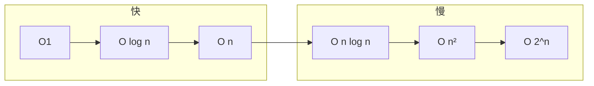

# 复杂度分析与学习方法

## 本章与上一章的关系

00 路线图划定了 **01～12 章** 的学习顺序。本章不教具体结构，而是教**怎么衡量算法快慢、怎么刷题、怎么复盘**——后面每一章的「O(n)」「O(log n)」都建立在本章之上。

---

## 1. 这份文档学什么

- 时间复杂度、空间复杂度（大 O 表示法）
- 最好 / 平均 / 最坏情况
- 刷题平台、复盘方法、手写练习习惯
- 为 02～11 章提供共同语言

---

## 2. 为什么复杂度很重要

后端面试写算法，考官常问：

1. 你的解法复杂度是多少？
2. 能不能优化到 O(n)？
3. 为什么用哈希表而不是暴力？

不懂大 O，刷再多题也讲不清「为什么这题用堆」。

### 与后端工程的联系

| 工程现象 | 复杂度直觉 |
|----------|------------|
| 全表扫描慢 | O(n) |
| 索引查找快 | O(log n) |
| Redis 单 key | O(1) 均摊 |
| 嵌套循环接口 | O(n²) 危险 |

详见 [Java 06 MySQL 索引](../Java/06-MySQL基础索引与事务.md)、[Python 07 Redis](../Python/07-Redis核心原理与缓存实战.md)。

---

## 3. 大 O 表示法

**大 O** 描述当输入规模 `n` 增大时，运行时间或额外空间的**增长趋势**（忽略常数和低阶项）。

| 复杂度 | 名称 | n=1000 量级直觉 | 典型例子 |
|--------|------|-----------------|----------|
| O(1) | 常数 | 瞬间 | 哈希查找、数组下标 |
| O(log n) | 对数 | 很快 | 二分、平衡树查找 |
| O(n) | 线性 | 可接受 | 单次遍历 |
| O(n log n) | 线性对数 | 排序下限 | 快排、归并 |
| O(n²) | 平方 | n 大则慢 | 双重循环 |
| O(2ⁿ) | 指数 | 仅小 n | 暴力子集 |
| O(n!) | 阶乘 | 几乎不可用 | 全排列暴力 |

```python
# O(1)
def get_first(arr: list) -> int:
    return arr[0]

# O(n)
def sum_arr(arr: list) -> int:
    total = 0
    for x in arr:
        total += x
    return total

# O(n²)
def count_pairs(arr: list) -> int:
    cnt = 0
    for i in range(len(arr)):
        for j in range(i + 1, len(arr)):
            if arr[i] == arr[j]:
                cnt += 1
    return cnt
```

---

## 4. 如何分析一段代码

### 4.1 数循环层数

- 一层循环 → 通常 O(n)
- 两层嵌套 → 通常 O(n²)
- 循环折半（`n //= 2`）→ O(log n)

### 4.2 递归

递归深度 × 每层工作量：

```python
def binary_search(nums: list[int], target: int) -> int:
    lo, hi = 0, len(nums) - 1
    while lo <= hi:
        mid = (lo + hi) // 2
        if nums[mid] == target:
            return mid
        if nums[mid] < target:
            lo = mid + 1
        else:
            hi = mid - 1
    return -1
# O(log n) 时间，O(1) 额外空间
```

```python
def dfs(node):
    if not node:
        return
    dfs(node.left)
    dfs(node.right)
# 树有 n 个节点，每个访问一次 → O(n)
```

### 4.3 隐藏复杂度

```python
# 看起来一层循环，但 list.insert(0, x) 是 O(n)
for x in data:
    result.insert(0, x)  # 整体 O(n²)！
```

**Python 注意**：`list.append` O(1) 均摊，`insert(0)` O(n)；`dict` 查找均摊 O(1)。

---

## 5. 空间复杂度

除输入外，额外使用的内存：

| 代码 | 空间 |
|------|------|
| 几个变量 | O(1) |
| 长度 n 的辅助数组 | O(n) |
| 递归深度 h | O(h) 栈空间 |
| 哈希表存 n 元素 | O(n) |

面试常说：**时间换空间**（哈希表）或 **空间换时间**（缓存）。

---

## 6. 最好、平均、最坏

以快速排序为例：

| 情况 | 时间 | 何时发生 |
|------|------|----------|
| 最好 | O(n log n) | 每次 pivot 平分 |
| 平均 | O(n log n) | 随机 pivot |
| 最坏 | O(n²) | 已有序 + 选最左 pivot |

工程与面试：**说明你的解法在什么前提下成立**。

---

## 7. 复杂度对比直觉图



**n = 10⁶ 时**：O(n²) ≈ 10¹² 步，通常超时（LeetCode 约 10⁸ 步/秒量级）。

---

## 8. 刷题方法论

### 8.1 平台

- [LeetCode 中文站](https://leetcode.cn/)
- 牛客网（国内笔试）

### 8.2 四步刷题法

1. **读题** 5 分钟：输入输出、边界、数据范围
2. **想解法** 10～15 分钟：暴力 → 优化，说复杂度
3. **写代码** 15～20 分钟：先通过，再整理
4. **复盘** 10 分钟：标签、模板、易错点写笔记

### 8.3 不要只抄题解

看题解后**关掉**，用自己的话重写一遍；标记「独立做出 / 看了提示 / 纯背」。

### 8.4 按标签刷，不随机

顺序建议（与 02～10 章对应）：

```text
数组/字符串 → 链表 → 栈队列 → 哈希 → 树 → 堆 → 图 → 排序二分 → 并查集/Trie
```

完整 70 题见 [11 章](11-LeetCode刷题路线与题型汇总.md)。

---

## 9. 手写与白板技巧

- 先写**函数签名**和**边界**
- 画图：链表指针、树递归、窗口左右边界
- 变量名简短：`l`, `r`, `cur`, `prev`
- 写完用 **1 个小例子** 走一遍

---

## 10. Python 刷题环境

```python
# 本地模板 main.py
from typing import List, Optional

class ListNode:
    def __init__(self, val=0, next=None):
        self.val = val
        self.next = next

class TreeNode:
    def __init__(self, val=0, left=None, right=None):
        self.val = val
        self.left = left
        self.right = right

# 复制 LeetCode 给的 class Solution 即可
```

LeetCode 在线 IDE 自带 `ListNode` / `TreeNode` 定义。

---

## 11. 常见误区与排查

| 误区 | 后果 | 纠正 |
|------|------|------|
| 把 O(2n) 说成 O(n²) | 分析错 | 2n 仍是 O(n) |
| 忽略 hidden O(n) | insert(0) 超时 | 查 API 复杂度 |
| 递归无终止 | 栈溢出 | 写 base case |
| 不估数据范围 | n=10⁵ 用 O(n²) | 看题目 n 上限 |
| 只背代码不理解 | 换题不会 | 归纳模板 |
| 不测边界 | 空数组 WA | 手测 `[]`, `[1]` |
| 混淆均摊与最坏 | 哈希表说 O(n) | 说「均摊 O(1)」 |
| 空间只算数组不算递归栈 | 分析不全 | DFS 加 O(h) |

---

## 12. 练习建议

### 基础

1. 判断下列复杂度：单层 for、双层 for、while n//=2、递归斐波那契（无记忆化）
2. 写 O(n) 求数组最大值的函数

### 进阶

3. 为什么 `sum + arr.sort()` 可能是 O(n log n)？
4. 估算：n=10⁵，O(n log n) 能否 1 秒内？

### 挑战

5. 读 LeetCode 1 题，写出暴力与优化两种复杂度对比（不写代码也可）

---

## 13. 参考答案

### 基础 1

| 代码 | 时间 | 空间 |
|------|------|------|
| 单层 for | O(n) | O(1) |
| 双层 for | O(n²) | O(1) |
| while n//=2 | O(log n) | O(1) |
| 递归斐波那契 | O(2ⁿ) | O(n) 栈 |

### 基础 2

```python
def max_value(arr: list[int]) -> int:
    if not arr:
        raise ValueError("empty")
    m = arr[0]
    for x in arr[1:]:
        if x > m:
            m = x
    return m
```

### 进阶 3

`sort()` 为 O(n log n)，`sum()` 为 O(n)， dominated by O(n log n)。

---

## 14. 学完标准

- [ ] 能解释 O(1)、O(log n)、O(n)、O(n log n)、O(n²)
- [ ] 能分析含 1～2 层循环代码的时间复杂度
- [ ] 知道递归要算栈空间
- [ ] 建立按标签刷题的习惯
- [ ] 知道 11 章 70 题清单位置

---

## 下一章预告

复杂度工具就绪——下一章（02 数组与字符串）从**最基础的连续存储**开始：双指针、滑动窗口、前缀和，以及 LeetCode 最高频的题型之一。

---

*下一章：02 数组与字符串*
