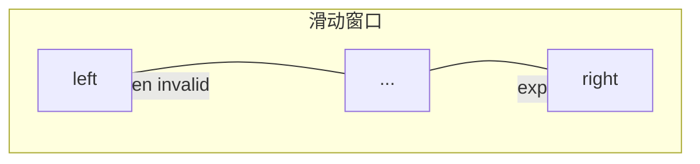

# 数组与字符串

## 本章与上一章的关系

01 章你学会了用 **大 O** 衡量算法。数组是最常见的 **O(1) 随机访问** 结构——Python 的 `list`、Java 的数组/ArrayList、C++ 的 `vector` 本质都是**动态数组**。

本章掌握：数组特性、双指针、滑动窗口、前缀和。这些是 LeetCode **Easy/Medium 最高频**技巧，也是后面链表（03）、哈希（05）的基础。

| 语言 | 动态数组 | 13 章模板 |
|------|----------|-----------|
| Python | `list` | [Python 13](../Python/13-算法与数据结构基础.md) |
| Java | `ArrayList` | [Java 13](../Java/13-算法与数据结构基础.md) |
| C++ | `vector` | [C++ 13](../C++/13-算法与数据结构C++实现.md) |

---

## 1. 数组的特性

| 操作 | 时间复杂度 | 说明 |
|------|------------|------|
| 按下标访问 | O(1) | `arr[i]` |
| 末尾 append | O(1) 均摊 | Python `append` |
| 头部 insert | O(n) | 需移动元素 |
| 查找元素 | O(n) | 无序需遍历 |
| 删除中间 | O(n) | 需移动 |

**内存**：连续存储，缓存友好，适合顺序扫描。

```python
arr = [1, 2, 3, 4, 5]
print(arr[0], arr[-1])   # 1 5
arr.append(6)
arr[1:4]                  # [2, 3, 4] 切片 O(k)
```

---

## 2. 字符串

Python `str` **不可变**；频繁拼接用 `list` + `join` 或 `io.StringIO`。

```python
s = "hello"
# s[0] = 'H'  # TypeError
chars = list(s)
chars[0] = 'H'
t = ''.join(chars)  # "Hello"
```

常见操作复杂度：

| 操作 | 复杂度 |
|------|--------|
| `s[i]` | O(1) |
| `s + t` | O(len(s)+len(t)) |
| `''.join(list)` | O(n) |
| `x in s` | O(n) |

---

## 3. 双指针

### 3.1 对撞指针（有序数组）

**LeetCode 167. 两数之和 II**（有序）

```python
def two_sum_sorted(numbers: list[int], target: int) -> list[int]:
    left, right = 0, len(numbers) - 1
    while left < right:
        s = numbers[left] + numbers[right]
        if s == target:
            return [left + 1, right + 1]  # 1-indexed
        if s < target:
            left += 1
        else:
            right -= 1
    return []
```

复杂度：O(n) 时间，O(1) 空间。

### 3.2 快慢指针（数组去重）

**LeetCode 26. 删除有序数组中的重复项**

```python
def remove_duplicates(nums: list[int]) -> int:
    if not nums:
        return 0
    slow = 0
    for fast in range(1, len(nums)):
        if nums[fast] != nums[slow]:
            slow += 1
            nums[slow] = nums[fast]
    return slow + 1
```

`slow` 指向已处理区末尾，`fast` 扫描——**原地** O(n)。

### 3.3 分离双指针（归并思想）

两个有序数组合并（见 09 章归并排序）。

---

## 4. 滑动窗口

维护区间 `[left, right]`，求**最长/最短**满足条件的子串/子数组。

**LeetCode 3. 无重复字符的最长子串**

```python
def length_of_longest_substring(s: str) -> int:
    last: dict[str, int] = {}
    left = ans = 0
    for right, ch in enumerate(s):
        if ch in last and last[ch] >= left:
            left = last[ch] + 1
        last[ch] = right
        ans = max(ans, right - left + 1)
    return ans
```

模板：

```python
def sliding_window_template(s: str) -> int:
    left = 0
    state = {}  # 或 counter
    ans = 0
    for right in range(len(s)):
        # 1. 扩大窗口：更新 state
        # 2. while 窗口不合法：收缩 left
        # 3. 更新 ans
    return ans
```

**LeetCode 209. 长度最小的子数组**（和 ≥ target）——窗口**收缩**型。

---

## 5. 前缀和

**LeetCode 303. 区域和检索 - 数组不可变**

```python
class NumArray:
    def __init__(self, nums: list[int]):
        self.prefix = [0]
        for x in nums:
            self.prefix.append(self.prefix[-1] + x)

    def sum_range(self, left: int, right: int) -> int:
        return self.prefix[right + 1] - self.prefix[left]
```

**LeetCode 560. 和为 K 的子数组**：前缀和 + 哈希表统计出现次数——O(n)。

```python
def subarray_sum(nums: list[int], k: int) -> int:
    cnt = {0: 1}
    prefix = ans = 0
    for x in nums:
        prefix += x
        ans += cnt.get(prefix - k, 0)
        cnt[prefix] = cnt.get(prefix, 0) + 1
    return ans
```

---

## 6. 二维数组 / 矩阵

**LeetCode 48. 旋转图像**、**54. 螺旋矩阵**——边界与层序模拟。

```python
def spiral_order(matrix: list[list[int]]) -> list[int]:
    if not matrix:
        return []
    top, bottom = 0, len(matrix) - 1
    left, right = 0, len(matrix[0]) - 1
    ans = []
    while top <= bottom and left <= right:
        for c in range(left, right + 1):
            ans.append(matrix[top][c])
        top += 1
        for r in range(top, bottom + 1):
            ans.append(matrix[r][right])
        right -= 1
        if top <= bottom:
            for c in range(right, left - 1, -1):
                ans.append(matrix[bottom][c])
            bottom -= 1
        if left <= right:
            for r in range(bottom, top - 1, -1):
                ans.append(matrix[r][left])
            left += 1
    return ans
```

---

## 7. 数组内存示意

```text
index:  0   1   2   3   4
       +---+---+---+---+---+
       | 1 | 2 | 3 | 4 | 5 |
       +---+---+---+---+---+
         ↑               ↑
       left            right   对撞指针
```



---

## 8. 常见易错点

| 易错 | 后果 | 避免 |
|------|------|------|
| 空数组未判断 | IndexError | 先 `if not nums` |
| 双指针 while 条件错 | 漏解/死循环 | 画例子 |
| 滑动窗口 left 不更新 | 超时 O(n²) | while 内收缩 |
| 前缀和下标 off-by-one | WA | 用 prefix[i+1]-prefix[j] |
| 字符串拼接用 += 循环 | O(n²) | join |
| 修改列表遍历时删元素 | 跳过元素 | 倒序删或新列表 |
| 整数溢出 | Java/C++ | Python 自动大整数 |
| 切片复制大数组 | 空间 O(n) | 注意是否需要拷贝 |

---

## 9. 本章 LeetCode 推荐

| 题号 | 题名 | 技巧 |
|------|------|------|
| 26 | 删除有序重复 | 快慢指针 |
| 27 | 移除元素 | 快慢指针 |
| 167 | 两数之和 II | 对撞 |
| 3 | 最长无重复子串 | 滑动窗口 |
| 209 | 最小子数组和 | 窗口收缩 |
| 560 | 和为 K 子数组 | 前缀和+哈希 |
| 53 | 最大子数组和 | Kadane（DP） |

---

## 10. 练习建议

### 基础

1. 实现 `reverse_string(s: list[str])` 原地反转
2. 有序数组合并（LeetCode 88 简化）

### 进阶

3. 三数之和（LeetCode 15）
4. 接雨水（LeetCode 42，双指针）

### 挑战

5. 最短无序连续子数组（LeetCode 581）

---

## 11. 参考答案

### 基础 1：原地反转字符串

```python
def reverse_string(s: list[str]) -> None:
    left, right = 0, len(s) - 1
    while left < right:
        s[left], s[right] = s[right], s[left]
        left += 1
        right -= 1
```

### 进阶 3：三数之和（框架）

```python
def three_sum(nums: list[int]) -> list[list[int]]:
    nums.sort()
    ans = []
    for i in range(len(nums) - 2):
        if i > 0 and nums[i] == nums[i - 1]:
            continue
        left, right = i + 1, len(nums) - 1
        while left < right:
            s = nums[i] + nums[left] + nums[right]
            if s == 0:
                ans.append([nums[i], nums[left], nums[right]])
                left += 1
                right -= 1
                while left < right and nums[left] == nums[left - 1]:
                    left += 1
                while left < right and nums[right] == nums[right + 1]:
                    right -= 1
            elif s < 0:
                left += 1
            else:
                right -= 1
    return ans
```

---

## 12. 学完标准

- [ ] 能手写对撞指针、快慢指针模板
- [ ] 能写滑动窗口最长/最短框架
- [ ] 理解前缀和 + 哈希的应用
- [ ] 完成至少 5 道本章推荐题

---

## 下一章预告

数组元素在内存中**紧挨着**；链表则通过**指针**把分散的节点串起来。下一章（03 链表）是面试手撕重灾区：反转、环、合并、快慢指针。

---

*下一章：03 链表*
