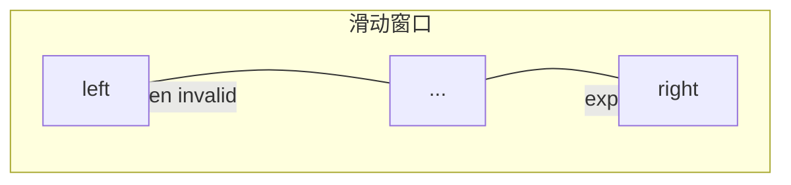

# 数组与字符串

> **文件编码**：UTF-8。代码示例默认 **Python 3**。

---

## 0. 读前导读（零基础也能跟上）

### 0.1 用一句话弄懂本章

**数组（Array）** = 一排带编号的格子，按编号取东西最快；**字符串** = 不可改的一排字符。本章学在这排格子上 **双指针、滑动窗口、前缀和** 三套高频技巧。

### 0.2 你需要提前知道什么

- [01 章](01-复杂度分析与学习方法.md) 的大 O
- 会写 `for`、`while`、列表下标 `arr[i]`
- **ACM 背景**：重点 §0.8 口述 + §16 LeetCode 六步例题

### 0.3 本章知识地图（☐→☑）

- [ ] 说出数组 5 种操作的复杂度
- [ ] 手写对撞指针、快慢指针、滑动窗口模板
- [ ] 用前缀和 + 哈希解决「和为 K 子数组」
- [ ] 完成 LeetCode 26/167/3/560 中至少 3 道
- [ ] §18 闭卷自测 ≥8/10

### 0.4 建议学习时长

- 零基础：3～4 天（原理 1 天 + 刷题 2～3 天）
- ACM：1～2 天精刷推荐题

### 0.5 学完你能做什么

闭卷写「无重复字符最长子串」滑动窗口；口述「为何有序数组两数之和用双指针 O(n)」。

### 0.6 生活类比

**术语（Array）**：连续内存中同类型元素的线性集合，下标 O(1) 访问。  
**生活类比**：**电影院连号座位**——知道 7 号座位直接走过去；要在 3 号前加一排人，后面都要挪（O(n)）。  
**为什么重要**：CPU 缓存友好，顺序扫描极快；LeetCode 最高频标签之一。  
**本章用到的地方**：§1～§6。

**字符串类比**：**珍珠项链串死**——不能改单颗珍珠，只能整串换新（不可变）；拼接用 `join` 像用线一次穿多颗。

---

## 本章与上一章的关系

01 章你学会了用 **大 O** 衡量算法。数组是最常见的 **O(1) 随机访问** 结构——Python 的 `list`、Java 的数组/ArrayList、C++ 的 `vector` 本质都是**动态数组**。

本章掌握：数组特性、双指针、滑动窗口、前缀和。这些是 LeetCode **Easy/Medium 最高频**技巧，也是后面链表（03）、哈希（05）的基础。

| 语言 | 动态数组 | 13 章模板 |
|------|----------|-----------|
| Python | `list` | [Python 13](../Python/13-算法与数据结构基础.md) |
| Java | `ArrayList` | [Java 13](../Java/13-算法与数据结构基础.md) |
| C++ | `vector` | [C++ 13](../C++/13-算法与数据结构C++实现.md) |

---

## 1. 数组的特性

| 操作 | 时间复杂度 | 说明 |
|------|------------|------|
| 按下标访问 | O(1) | `arr[i]` |
| 末尾 append | O(1) 均摊 | Python `append` |
| 头部 insert | O(n) | 需移动元素 |
| 查找元素 | O(n) | 无序需遍历 |
| 删除中间 | O(n) | 需移动 |

**内存**：连续存储，缓存友好，适合顺序扫描。

```python
arr = [1, 2, 3, 4, 5]
print(arr[0], arr[-1])   # 1 5
arr.append(6)
arr[1:4]                  # [2, 3, 4] 切片 O(k)
```

---

## 2. 字符串

Python `str` **不可变**；频繁拼接用 `list` + `join` 或 `io.StringIO`。

```python
s = "hello"
# s[0] = 'H'  # TypeError
chars = list(s)
chars[0] = 'H'
t = ''.join(chars)  # "Hello"
```

常见操作复杂度：

| 操作 | 复杂度 |
|------|--------|
| `s[i]` | O(1) |
| `s + t` | O(len(s)+len(t)) |
| `''.join(list)` | O(n) |
| `x in s` | O(n) |

---

## 3. 双指针

### 3.1 对撞指针（有序数组）

**LeetCode 167. 两数之和 II**（有序）

```python
def two_sum_sorted(numbers: list[int], target: int) -> list[int]:
    left, right = 0, len(numbers) - 1
    while left < right:
        s = numbers[left] + numbers[right]
        if s == target:
            return [left + 1, right + 1]  # 1-indexed
        if s < target:
            left += 1
        else:
            right -= 1
    return []
```

复杂度：O(n) 时间，O(1) 空间。

### 3.2 快慢指针（数组去重）

**LeetCode 26. 删除有序数组中的重复项**

```python
def remove_duplicates(nums: list[int]) -> int:
    if not nums:
        return 0
    slow = 0
    for fast in range(1, len(nums)):
        if nums[fast] != nums[slow]:
            slow += 1
            nums[slow] = nums[fast]
    return slow + 1
```

`slow` 指向已处理区末尾，`fast` 扫描——**原地** O(n)。

### 3.3 分离双指针（归并思想）

两个有序数组合并（见 09 章归并排序）。

---

## 4. 滑动窗口

维护区间 `[left, right]`，求**最长/最短**满足条件的子串/子数组。

**LeetCode 3. 无重复字符的最长子串**

```python
def length_of_longest_substring(s: str) -> int:
    last: dict[str, int] = {}
    left = ans = 0
    for right, ch in enumerate(s):
        if ch in last and last[ch] >= left:
            left = last[ch] + 1
        last[ch] = right
        ans = max(ans, right - left + 1)
    return ans
```

模板：

```python
def sliding_window_template(s: str) -> int:
    left = 0
    state = {}  # 或 counter
    ans = 0
    for right in range(len(s)):
        # 1. 扩大窗口：更新 state
        # 2. while 窗口不合法：收缩 left
        # 3. 更新 ans
    return ans
```

**LeetCode 209. 长度最小的子数组**（和 ≥ target）——窗口**收缩**型。

---

## 5. 前缀和

**LeetCode 303. 区域和检索 - 数组不可变**

```python
class NumArray:
    def __init__(self, nums: list[int]):
        self.prefix = [0]
        for x in nums:
            self.prefix.append(self.prefix[-1] + x)

    def sum_range(self, left: int, right: int) -> int:
        return self.prefix[right + 1] - self.prefix[left]
```

**LeetCode 560. 和为 K 的子数组**：前缀和 + 哈希表统计出现次数——O(n)。

```python
def subarray_sum(nums: list[int], k: int) -> int:
    cnt = {0: 1}
    prefix = ans = 0
    for x in nums:
        prefix += x
        ans += cnt.get(prefix - k, 0)
        cnt[prefix] = cnt.get(prefix, 0) + 1
    return ans
```

---

## 6. 二维数组 / 矩阵

**LeetCode 48. 旋转图像**、**54. 螺旋矩阵**——边界与层序模拟。

```python
def spiral_order(matrix: list[list[int]]) -> list[int]:
    if not matrix:
        return []
    top, bottom = 0, len(matrix) - 1
    left, right = 0, len(matrix[0]) - 1
    ans = []
    while top <= bottom and left <= right:
        for c in range(left, right + 1):
            ans.append(matrix[top][c])
        top += 1
        for r in range(top, bottom + 1):
            ans.append(matrix[r][right])
        right -= 1
        if top <= bottom:
            for c in range(right, left - 1, -1):
                ans.append(matrix[bottom][c])
            bottom -= 1
        if left <= right:
            for r in range(bottom, top - 1, -1):
                ans.append(matrix[r][left])
            left += 1
    return ans
```

---

## 7. 数组内存示意

```text
index:  0   1   2   3   4
       +---+---+---+---+---+
       | 1 | 2 | 3 | 4 | 5 |
       +---+---+---+---+---+
         ↑               ↑
       left            right   对撞指针
```



---

## 8. 常见易错点

| 易错 | 后果 | 避免 |
|------|------|------|
| 空数组未判断 | IndexError | 先 `if not nums` |
| 双指针 while 条件错 | 漏解/死循环 | 画例子 |
| 滑动窗口 left 不更新 | 超时 O(n²) | while 内收缩 |
| 前缀和下标 off-by-one | WA | 用 prefix[i+1]-prefix[j] |
| 字符串拼接用 += 循环 | O(n²) | join |
| 修改列表遍历时删元素 | 跳过元素 | 倒序删或新列表 |
| 整数溢出 | Java/C++ | Python 自动大整数 |
| 切片复制大数组 | 空间 O(n) | 注意是否需要拷贝 |

---

## 9. 本章 LeetCode 推荐

| 题号 | 题名 | 技巧 |
|------|------|------|
| 26 | 删除有序重复 | 快慢指针 |
| 27 | 移除元素 | 快慢指针 |
| 167 | 两数之和 II | 对撞 |
| 3 | 最长无重复子串 | 滑动窗口 |
| 209 | 最小子数组和 | 窗口收缩 |
| 560 | 和为 K 子数组 | 前缀和+哈希 |
| 53 | 最大子数组和 | Kadane（DP） |

---

## 10. 练习建议

### 基础

1. 实现 `reverse_string(s: list[str])` 原地反转
2. 有序数组合并（LeetCode 88 简化）

### 进阶

3. 三数之和（LeetCode 15）
4. 接雨水（LeetCode 42，双指针）

### 挑战

5. 最短无序连续子数组（LeetCode 581）

---

## 11. 参考答案

### 基础 1：原地反转字符串

```python
def reverse_string(s: list[str]) -> None:
    left, right = 0, len(s) - 1
    while left < right:
        s[left], s[right] = s[right], s[left]
        left += 1
        right -= 1
```

### 进阶 3：三数之和（框架）

```python
def three_sum(nums: list[int]) -> list[list[int]]:
    nums.sort()
    ans = []
    for i in range(len(nums) - 2):
        if i > 0 and nums[i] == nums[i - 1]:
            continue
        left, right = i + 1, len(nums) - 1
        while left < right:
            s = nums[i] + nums[left] + nums[right]
            if s == 0:
                ans.append([nums[i], nums[left], nums[right]])
                left += 1
                right -= 1
                while left < right and nums[left] == nums[left - 1]:
                    left += 1
                while left < right and nums[right] == nums[right + 1]:
                    right -= 1
            elif s < 0:
                left += 1
            else:
                right -= 1
    return ans
```

---

## 12. 学完标准

- [ ] 能手写对撞指针、快慢指针模板
- [ ] 能写滑动窗口最长/最短框架
- [ ] 理解前缀和 + 哈希的应用
- [ ] 完成至少 5 道本章推荐题

---

## 13. FAQ

### Q1：双指针和二分有什么区别？

双指针常配合**有序数组**或**原地修改**；二分是**折半查找** O(log n)。167 题有序用对撞，无序用哈希。

### Q2：滑动窗口何时收缩 `left`？

**最长型**：通常只扩 `right`，`left` 在重复/超限时跳；**最短型**（209）：`while sum>=target` 内收缩 left。

### Q3：前缀和为什么要 `cnt[0]=1`？

空前缀和为 0；若某前缀和等于 k，对应子数组从 0 开始，需计一次。

### Q4：Python 字符串拼接为什么别用 `+=` 循环？

每次 `+=` 生成新串，总 O(n²)；用 `list` + `join` O(n)。

### Q5：ACM 背景面试怎么说数组？

「连续存储、缓存友好、随机访问 O(1)；中间插删 O(n)；无序查找 O(n)，有序可二分 O(log n)。」

### Q6：三数之和为什么先排序？

排序后双指针去重 O(n²)；不排序难去重且慢。

### Q7：Kadane（53 最大子数组和）算 DP 吗？

一维 DP 的简化；面试可说「DP 思想 / 贪心当前和」。

### Q8：二维矩阵螺旋/旋转要记模板吗？

记**边界四向**框架；面试 Medium 常考，手画 3×3 验证。

### Q9：双指针 `left<right` 和 `left<=right`？

对撞求**两数**用 `<`；二分用 `<=` 看模板。167 用 `<`。

### Q10：和为 K 子数组为何用哈希而非前缀数组查？

需要**计数**多少前缀满足 `prefix-k`，哈希 O(1) 查增。

---

## 14. 面试口述版（零基础能听懂）

「数组像一排编号储物柜，拿第 i 个 O(1)。两指针像两个人从排两头往中间对答案。滑动窗口像扫描仪上一条带子，右边伸长、左边缩短，找最长无重复段。前缀和像累计步数表，任意区间步数 = 终点累计 − 起点累计。」

---

## 15. LeetCode 思维六步示范

### 15.1 LeetCode 3（无重复最长子串）

| 步 | 内容 |
|----|------|
| 1 | 子串连续；字符集 ASCII/Unicode 看题 |
| 2 | 暴力 O(n³) 或 O(n²) 枚举区间 |
| 3 | 重复判断慢 → 窗口内维护「字符最后出现位置」 |
| 4 | **滑动窗口** + 哈希 `last[ch]` |
| 5 | `left = max(left, last[ch]+1)`；更新 ans |
| 6 | 模板见 §4；变体：至多 K 个不同字符 |

### 15.2 LeetCode 560（和为 K 的子数组）

| 步 | 内容 |
|----|------|
| 1 | 子数组**连续**；可负数；计数个数 |
| 2 | 暴力 O(n²) 枚举区间和 |
| 3 | 区间和重复算 → **前缀和** |
| 4 | `count += cnt[prefix-k]`；`cnt[prefix]++` |
| 5 | 初始化 `cnt[0]=1` |
| 6 | 与 [05 哈希](05-哈希表.md) 联动 |

### 15.3 LeetCode 167（两数之和 II）

| 步 | 内容 |
|----|------|
| 1 | **有序**；1-indexed 返回 |
| 2 | 暴力 O(n²) |
| 3 | 和小了该增大 → 左指针右移 |
| 4 | **对撞双指针** O(n) O(1) |
| 5 | `while left<right` |
| 6 | 无序版 LeetCode 1 用哈希 |

---

## 16. 手把手：第一次写滑动窗口

| 步骤 | 动作 | 预期 | 若不对 |
|------|------|------|--------|
| 1 | 定 `left=0, ans=0` | 变量就绪 | — |
| 2 | `for right, ch in enumerate(s)` | 右边界扩 | 漏 enumerate |
| 3 | 若重复且在窗口内，移 `left` | 窗口合法 | left 未更新致 WA |
| 4 | `ans = max(ans, right-left+1)` | 更新最长 | 长度公式错 |
| 5 | 小例 `"abcabcbb"` 手走 | ans=3 | 对照 §4 代码 |

---

## 17. 逐行读：560 前缀和 + 哈希（核心 8 行）

| 行 | 含义 | 改错会怎样 |
|----|------|------------|
| `cnt[0]=1` | 空前缀 | 漏则少计从 0 开始的子数组 |
| `prefix += x` | 当前前缀和 | — |
| `ans += cnt.get(prefix-k,0)` | 以当前结尾、和为 k 的子数组数 | 先加后存顺序对 |
| `cnt[prefix]+=1` | 记录前缀出现次数 | 先存后加会多计自身 |

---

## 18. 闭卷自测

1. 数组头插、尾插、按下标访问的复杂度？
2. 快慢指针在 26 题中的作用？
3. 滑动窗口最长 vs 最短，收缩时机？
4. 前缀和求 `[l,r]` 区间和的公式？
5. 167 为何能从两端移动？无序为何不行？
6. Python `s[i]` 与 `s+a` 复杂度？
7. 接雨水 42 双指针核心观察？（口述级）
8. 三数之和去重为什么要 skip 相同 `nums[i]`？
9. 螺旋矩阵 while 条件 `top<=bottom and left<=right` 作用？
10. 写伪代码：和≥target 的最短子数组。

<details>
<summary>自测参考答案</summary>

1. 头插 O(n)，尾 append 均摊 O(1)，下标 O(1)。
2. slow 写非重复区，fast 扫描。
3. 最长：重复时缩 left；最短：满足条件时尽量缩 left 求最小长。
4. `prefix[r+1]-prefix[l]` 或 `prefix[r]-prefix[l-1]`（定义一致即可）。
5. 有序时和小→需更大左值→left++；无序无单调性。
6. `s[i]` O(1)；`s+a` O(len)。
7. 左右最大高度较小侧移动（可积水量由矮侧决定）。
8. 避免重复三元组。
9. 防止单行/单列重复转圈。
10. `while sum>=target: ans=min(...); sum-=nums[left]; left++` 外层 for right。

</details>

---

## 19. 费曼检验

3 分钟解释「双指针为什么比暴力快」——用**有序两数之和**或**去重**举例。

**提纲**：暴力两两配对 n²；双指针每步只移一端，每元素最多进出一次 → O(n)。

---

## 20. 术语三件套（首次出现格式示范）

**双指针（Two Pointers）**：两个下标在数组/字符串上协同移动。  
**生活类比**：两人从走廊两头往中间找能配对的礼物。  
**为什么重要**：将 O(n²) 降为 O(n)。  
**本章**：§3。

**滑动窗口（Sliding Window）**：维护连续子区间 [left,right] 随扫描扩张/收缩。  
**生活类比**：扫描仪上的取景框，右边拉长、左边裁剪直到合法。  
**为什么重要**：子串/子数组最值问题主流解法。  
**本章**：§4。

**前缀和（Prefix Sum）**：`prefix[i]` = 前 i 个元素之和，O(1) 求任意区间和。  
**生活类比**：里程表累计读数，任意两段路程 = 两个累计值相减。  
**本章**：§5。

---

## 21. LeetCode 思维：LeetCode 209（最小子数组和）

| 步 | 内容 |
|----|------|
| 1 | 和 ≥ target 的最短**连续**子数组 |
| 2 | 暴力 O(n²) 枚举区间 |
| 3 | 区间和单调 → **窗口收缩** |
| 4 | 扩 right 累加 sum；`while sum>=target` 更新 ans 并缩 left |
| 5 | 注意全正整数；有负数需前缀和 |
| 6 | 与 3 题对比：最长 vs 最短窗口 |

---

## 22. 数组 vs 字符串 API 复杂度（Python 面试常问）

| 操作 | list | str | 备注 |
|------|------|-----|------|
| `[i]` | O(1) | O(1) | |
| `append` / 拼接 | O(1) 均摊 | O(n) 新建 | str 不可变 |
| `insert(0,x)` | O(n) | — | 隐藏超时 |
| `x in` | O(n) | O(n) | set/dict O(1) |
| 切片 `[l:r]` | O(r-l) | O(r-l) | 拷贝 |

**后端映射**：日志按行 `split` 得 O(n)；大文件处理用流式而非一次性读入，避免 O(n) 内存爆。

---

## 下一章预告

数组元素在内存中**紧挨着**；链表则通过**指针**把分散的节点串起来。下一章（03 链表）是面试手撕重灾区：反转、环、合并、快慢指针。

---

*下一章：03 链表*
