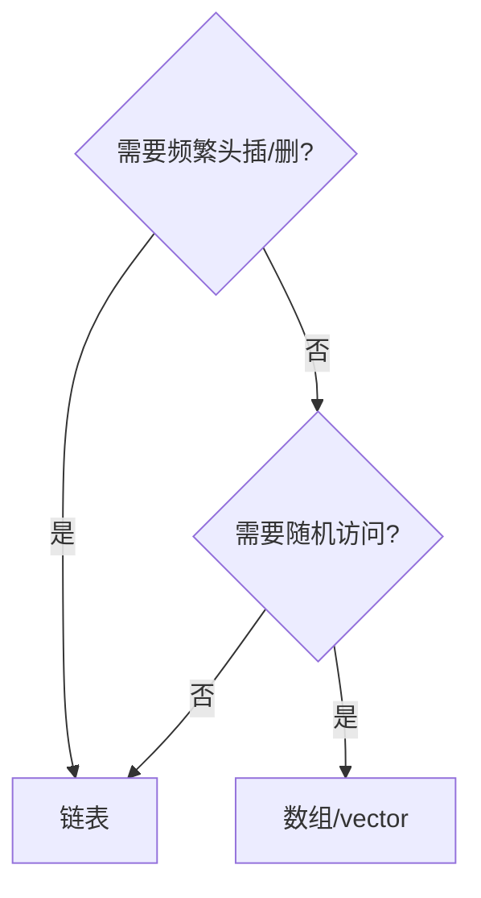

# 链表

> **文件编码**：UTF-8。代码示例默认 **Python 3**。

---

## 0. 读前导读（零基础也能跟上）

### 0.1 用一句话弄懂本章

**链表（Linked List）** = 每个节点存「值 + 下一项在哪」，像寻宝线索卡，**插入删除**灵活，但**找第 k 个**要从头走。

### 0.2 你需要提前知道什么

- [02 数组](02-数组与字符串.md)：对比连续 vs 链式
- 理解 **引用/指针**：`next` 指向另一个节点
- ACM：重点 dummy、反转、快慢指针；§15 口述

### 0.3 知识地图（☐→☑）

- [ ] 画单链表内存图
- [ ] 闭卷迭代反转
- [ ] dummy 节点用途
- [ ] 141/142 环检测与入口
- [ ] 合并两个有序链表
- [ ] §19 自测 ≥8/10

### 0.4 学习时长

3～4 天；链表是**手撕重灾区**，每天至少 1 道 Medium。

### 0.5 生活类比

**术语（Linked List）**：节点通过指针链接的线性序列，无随机访问。  
**生活类比**：**寻宝线索卡**——每张只写「下一个地点」；改链中间只需改一张卡的箭头，不用整体搬家。  
**为什么重要**：LRU、多项式加法、面试反转/环/合并。  
**本章**：§1～§7。

**dummy 头节点类比**：**哨兵保安**——统一从「假头」后面操作，删真头时不特殊处理。

### 0.6 ACM vs 面试

| 竞赛 | 面试 |
|------|------|
| 指针操作熟练 | 边写边**画图**讲 dummy |
| 少考 LRU 设计 | 146 LRU 常考，衔接 05 章 |
| 递归反转简洁 | 问迭代 O(1) 空间 |

---

## 本章与上一章的关系

02 章数组 **连续存储**，插入删除中间要 O(n) 移动。链表用 **节点 + 指针** 连接，插入删除已知节点 O(1)（找节点仍可能要 O(n)）。

本章是面试**手撕最高频**结构之一。Python 刷题用 `ListNode`；Java 用 `ListNode`；C++ 用裸指针——原理相同，见各语言 [13 章](../Python/13-算法与数据结构基础.md)。

---

## 1. 链表结构

```python
class ListNode:
    def __init__(self, val=0, next=None):
        self.val = val
        self.next = next
```

```text
head → [1|·] → [2|·] → [3|None]
        val next
```

| 对比 | 数组 | 单向链表 |
|------|------|----------|
| 随机访问 | O(1) | O(n) |
| 头插 | O(n) | O(1) |
| 删中间 | O(n) | O(1) 已知前驱 |
| 缓存 | 友好 | 不友好 |

---

## 2. 基本操作实现

### 2.1 遍历

```python
def print_list(head: ListNode | None) -> None:
    cur = head
    while cur:
        print(cur.val, end=" -> ")
        cur = cur.next
    print("None")
```

### 2.2 头插法建表

```python
def build_from_list(values: list[int]) -> ListNode | None:
    dummy = ListNode(0)
    cur = dummy
    for v in values:
        cur.next = ListNode(v)
        cur = cur.next
    return dummy.next
```

### 2.3 求长度

```python
def length(head: ListNode | None) -> int:
    n = 0
    while head:
        n += 1
        head = head.next
    return n
```

---

## 3. 虚拟头节点 dummy

避免处理 `head == None` 或删头节点的边界：

```python
dummy = ListNode(0, head)
# 操作 dummy.next ...
return dummy.next
```

**几乎所有链表题**建议先想 dummy。

---

## 4. 反转链表

**LeetCode 206. 反转链表** — 必须闭卷会。

### 4.1 迭代

```python
def reverse_list(head: ListNode | None) -> ListNode | None:
    prev = None
    cur = head
    while cur:
        nxt = cur.next
        cur.next = prev
        prev = cur
        cur = nxt
    return prev
```

```text
prev  cur  nxt
 None  1 -> 2 -> 3
```

### 4.2 递归

```python
def reverse_list_recursive(head: ListNode | None) -> ListNode | None:
    if not head or not head.next:
        return head
    new_head = reverse_list_recursive(head.next)
    head.next.next = head
    head.next = None
    return new_head
```

复杂度：迭代 O(n) 时间 O(1) 空间；递归 O(n) 栈空间。

---

## 5. 快慢指针

### 5.1 找中点

**LeetCode 876. 链表的中间结点**

```python
def middle_node(head: ListNode | None) -> ListNode | None:
    slow = fast = head
    while fast and fast.next:
        slow = slow.next
        fast = fast.next.next
    return slow
```

快指针走 2 步，慢指针走 1 步；快到底时慢在中点。

### 5.2 环检测

**LeetCode 141. 环形链表**

```python
def has_cycle(head: ListNode | None) -> bool:
    slow = fast = head
    while fast and fast.next:
        slow = slow.next
        fast = fast.next.next
        if slow is fast:
            return True
    return False
```

**LeetCode 142. 环形链表 II**（找环入口）：相遇后，一指针回 head，同速走，再遇即入口。

```python
def detect_cycle(head: ListNode | None) -> ListNode | None:
    slow = fast = head
    while fast and fast.next:
        slow = slow.next
        fast = fast.next.next
        if slow is fast:
            break
    else:
        return None
    slow = head
    while slow is not fast:
        slow = slow.next
        fast = fast.next
    return slow
```

---

## 6. 合并链表

**LeetCode 21. 合并两个有序链表**

```python
def merge_two_lists(l1: ListNode | None, l2: ListNode | None) -> ListNode | None:
    dummy = ListNode(0)
    cur = dummy
    while l1 and l2:
        if l1.val <= l2.val:
            cur.next = l1
            l1 = l1.next
        else:
            cur.next = l2
            l2 = l2.next
        cur = cur.next
    cur.next = l1 if l1 else l2
    return dummy.next
```

**LeetCode 23. 合并 K 个升序链表** — 用堆（07 章）或分治归并。

---

## 7. 删除节点

**LeetCode 19. 删除链表的倒数第 N 个结点**

双指针：fast 先走 n 步，再一起走，slow 在待删前一位。

```python
def remove_nth_from_end(head: ListNode | None, n: int) -> ListNode | None:
    dummy = ListNode(0, head)
    fast = slow = dummy
    for _ in range(n + 1):
        fast = fast.next
    while fast:
        fast = fast.next
        slow = slow.next
    slow.next = slow.next.next
    return dummy.next
```

---

## 8. 双向链表（了解）

```python
class DNode:
    def __init__(self, val=0, prev=None, next=None):
        self.val = val
        self.prev = prev
        self.next = next
```

**LeetCode 146. LRU 缓存**：哈希 + 双向链表（详见 [05 章](05-哈希表.md)）。

---

## 9. 链表 vs 数组 选型



---

## 10. 常见易错点

| 易错 | 后果 | 避免 |
|------|------|------|
| 丢引用 `head = head.next` 丢表 | 无法返回 | 用 dummy |
| 反转断链 | WA | 先存 nxt |
| 快慢指针初值不一致 | 中点偏 | 统一 `slow=fast=head` |
| 删节点未改 prev.next | 环/断链 | 画图 |
| 空链表 / 单节点 | 边界 | 单独测 |
| 递归反转栈溢出 | 超长链 | 用迭代 |
| 合并后未接剩余 | 丢节点 | `cur.next = l1 or l2` |
| Python 修改 node 未改链接 | 无效 | 改 `.next` |

---

## 11. 本章 LeetCode 推荐

| 题号 | 题名 | 必会 |
|------|------|------|
| 206 | 反转链表 | ★★★ |
| 21 | 合并有序链表 | ★★★ |
| 141/142 | 环 | ★★★ |
| 876 | 中间节点 | ★★ |
| 19 | 删倒数第 N | ★★★ |
| 160 | 相交链表 | ★★ |
| 234 | 回文链表 | ★★ |
| 2 | 两数相加 | ★★ |

---

## 12. 练习建议

### 基础

1. 手写反转（迭代）
2. 判断回文链表（找中点+反转后半）

### 进阶

3. 相交链表（LeetCode 160）
4. 重排链表（L0→Ln→L1→…）

### 挑战

5. K 个一组翻转链表（LeetCode 25）

---

## 13. 参考答案

### 基础 2：回文链表

```python
def is_palindrome(head: ListNode | None) -> bool:
    if not head:
        return True
    slow = fast = head
    while fast.next and fast.next.next:
        slow = slow.next
        fast = fast.next.next
    second = reverse_list(slow.next)
    slow.next = None
    p1, p2 = head, second
    while p2:
        if p1.val != p2.val:
            return False
        p1, p2 = p1.next, p2.next
    return True
```

### 进阶 3：相交链表

```python
def get_intersection_node(headA, headB):
    pa, pb = headA, headB
    while pa is not pb:
        pa = pa.next if pa else headB
        pb = pb.next if pb else headA
    return pa
```

---

## 14. 学完标准

- [ ] 闭卷写出迭代反转
- [ ] 会用 dummy 节点
- [ ] 快慢指针找中点、判环
- [ ] 合并两个有序链表
- [ ] 完成 206、21、141 至少各 1 遍

---

## 15. 面试口述版（零基础）

「链表像每人只记下一个是谁的传话游戏。数组找第 5 个直接数格子 O(1)；链表要从头数 5 次 O(n)。反转就是让每个说『上一个是谁』。快慢指针像乌龟兔子，兔子进环后总会追上乌龟，用来判环。」

---

## 16. LeetCode 思维六步

### 16.1 LeetCode 206 反转链表

| 步 | 内容 |
|----|------|
| 1 | 单链表原地反转 |
| 2 | 暴力：存数组反转重建 O(n) 空间 |
| 3 | 要 O(1) 空间 → 改指针 |
| 4 | **三指针** prev/cur/nxt |
| 5 | 循环：`nxt=cur.next; cur.next=prev; 前移` |
| 6 | 模板 §4.1；递归版备问栈深 |

### 16.2 LeetCode 142 环入口

| 步 | 内容 |
|----|------|
| 1 | 有环则返回入口节点 |
| 2 | 暴力：set 记录访问 O(n) 空间 |
| 3 | Floyd 判环 O(1) 空间 |
| 4 | 相遇后 **slow 回 head**，同速走 |
| 5 | 数学：入口距 head = 相遇点距入口 |
| 6 | 与 141 组合考 |

### 16.3 LeetCode 21 合并有序链表

| 步 | 内容 |
|----|------|
| 1 | 两升序链合成一条 |
| 2 | 暴力：转数组排序 O(n log n) |
| 3 | 两链均有序 → 归并 O(n) |
| 4 | **dummy + cur** 尾插较小 |
| 5 | 剩 Link 直接 `cur.next` |
| 6 | K 路合并见 07 堆 |

---

## 17. FAQ

### Q1：dummy 一定要吗？

删头、头插、合并等**改 head** 的题强烈建议；减少边界 if。

### Q2：快慢指针 fast 初值？

判环/中点常用 `slow=fast=head`；删倒数第 N 用 dummy+fast 先走 n+1。

### Q3：142 相遇后为何 slow 回 head？

环长 L、入口距 head a，可推 2a = a+L → a = 距离关系；面试记结论+画图。

### Q4：递归反转空间？

O(n) 栈；迭代 O(1) 空间是面试默认。

### Q5：160 相交链表不用长度差？

双链切换 headA/headB，走 m+n 步必交或 None—— elegant O(1)。

### Q6：234 回文链表思路？

找中点、反转后半、比对；或栈存前半。

### Q7：链表 vs 数组 面试一句话？

查用数组，频繁头插删用链表；工程里数组/vector 更常见，链表在 LRU、内核等。

### Q8：K 个一组翻转 25 难在哪？

分组 dummy、记录 prev 组尾、边界不足 K 不 flip。

### Q9：Python ListNode 会丢链？

`cur=cur.next` 只移指针；改结构要 `cur.next=...`。

### Q10：2 两数相加进位？

dummy 尾插；sum>=10 进位；最后一 carry 别漏。

---

## 18. 手把手：迭代反转

| 步骤 | 动作 | 预期 |
|------|------|------|
| 1 | `prev=None, cur=head` | 两指针 |
| 2 | `nxt=cur.next` | 先存后继防断 |
| 3 | `cur.next=prev` | 反转一条边 |
| 4 | `prev,cur=cur,nxt` | 前移 |
| 5 | 返回 `prev` | 新 head |

---

## 19. 闭卷自测

1. 单链表随机访问复杂度？
2. dummy 解决什么问题？
3. 迭代反转三指针名字与顺序？
4. 141 快慢为何能相遇？
5. 142 第二步指针怎么动？
6. 19 题删倒数第 N，fast 为何走 n+1 步？
7. 合并有序链表循环条件？
8. 160 相交 O(m+n) 思路？
9. 双向链表比单向多什么操作 O(1)？
10. LRU 为何哈希+双向链表？

<details>
<summary>自测参考答案</summary>

1. O(n)。
2. 统一头结点操作，删/改头无需特判。
3. prev/cur/nxt；先存 nxt 再改 cur.next 再前移。
4. 环内快 eventually 追上慢。
5. slow 回 head，slow/fast 同速一步直到相遇。
6. dummy 下 slow 在待删**前驱**；走 n+1 使 slow 停在倒数第 n+1。
7. `while l1 and l2` 比大小接链。
8. pa/pb 走完换对方 head，长度差抵消在交点。
9. 删给定节点（已知 node）可 O(1) 用前驱；LRU 移尾 O(1)。
10. 哈希 O(1) 定位节点，链表 O(1) 移出/插入维护顺序。

</details>

---

## 20. 费曼检验

3 分钟讲「反转链表在干什么」——禁止说代码行号，用「箭头转向」描述。

**提纲**：每步把当前节点指向前驱；最后 prev 是新头；dummy 像假人站在队首前方便统一操作。

---

## 21. 逐行读：迭代反转（>10 行核心）

| 行 | 含义 | 改错会怎样 |
|----|------|------------|
| `prev = None` | 反转后第一个的前驱 | 漏则新头无终止 |
| `nxt = cur.next` | 暂存后继 | 直接改 next 丢链 |
| `cur.next = prev` | 反转一条边 | 顺序反则断链 |
| `prev, cur = cur, nxt` | 同步前移 | 只移 cur 丢 prev |
| `return prev` | 新头 | return cur 错 |

---

## 22. LeetCode 思维：LeetCode 19（删倒数第 N）

| 步 | 内容 |
|----|------|
| 1 | 一次遍历删倒数第 n |
| 2 | 先求长度再删 → 两次遍历 |
| 3 | **双指针间隔 n+1** |
| 4 | dummy；fast 先走 n+1；同步走至 fast 到尾 |
| 5 | slow 在待删前驱 `slow.next=slow.next.next` |
| 6 | 与 876 中点快慢对比 |

---

## 23. 链表工程场景（面试加分）

| 场景 | 结构 | 说明 |
|------|------|------|
| LRU Cache | 哈希 + 双向链 | [05 章](05-哈希表.md) 146 |
| 内核 ready 队列 | 双向循环链 | 了解即可 |
| 多项式加法 | 单链按位 | 竞赛经典 |
| Java LinkedHashMap | 哈希 + 双向链 | 访问顺序 / LRU |

**零基础解释**：「链表适合频繁改邻居关系、不需要随机跳号的场景；数组适合按下标查。」

---

## 24. 链表题识别信号

| 题面关键词 | 想到 |
|------------|------|
| 反转、重排 | 206 / dummy / 分组翻转 |
| 环、重复访问 | 141 / 142 Floyd |
| 倒数第 k、中点 | 快慢指针 |
| 合并有序 | 21 / 23 堆 |
| 相交 | 160 双指针切换 |
| 回文 | 中点 + 反转后半 |

---

## 下一章预告

链表只能**一端进一端出**时不够用——**栈（LIFO）** 和 **队列（FIFO）** 用数组或链表实现，支撑括号匹配、BFS、单调栈等经典题型。见 04 章。

---

*下一章：04 栈与队列*
