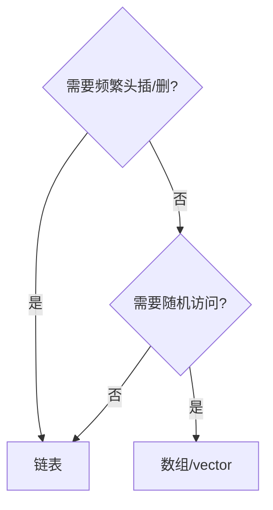

# 链表

## 本章与上一章的关系

02 章数组 **连续存储**，插入删除中间要 O(n) 移动。链表用 **节点 + 指针** 连接，插入删除已知节点 O(1)（找节点仍可能要 O(n)）。

本章是面试**手撕最高频**结构之一。Python 刷题用 `ListNode`；Java 用 `ListNode`；C++ 用裸指针——原理相同，见各语言 [13 章](../Python/13-算法与数据结构基础.md)。

---

## 1. 链表结构

```python
class ListNode:
    def __init__(self, val=0, next=None):
        self.val = val
        self.next = next
```

```text
head → [1|·] → [2|·] → [3|None]
        val next
```

| 对比 | 数组 | 单向链表 |
|------|------|----------|
| 随机访问 | O(1) | O(n) |
| 头插 | O(n) | O(1) |
| 删中间 | O(n) | O(1) 已知前驱 |
| 缓存 | 友好 | 不友好 |

---

## 2. 基本操作实现

### 2.1 遍历

```python
def print_list(head: ListNode | None) -> None:
    cur = head
    while cur:
        print(cur.val, end=" -> ")
        cur = cur.next
    print("None")
```

### 2.2 头插法建表

```python
def build_from_list(values: list[int]) -> ListNode | None:
    dummy = ListNode(0)
    cur = dummy
    for v in values:
        cur.next = ListNode(v)
        cur = cur.next
    return dummy.next
```

### 2.3 求长度

```python
def length(head: ListNode | None) -> int:
    n = 0
    while head:
        n += 1
        head = head.next
    return n
```

---

## 3. 虚拟头节点 dummy

避免处理 `head == None` 或删头节点的边界：

```python
dummy = ListNode(0, head)
# 操作 dummy.next ...
return dummy.next
```

**几乎所有链表题**建议先想 dummy。

---

## 4. 反转链表

**LeetCode 206. 反转链表** — 必须闭卷会。

### 4.1 迭代

```python
def reverse_list(head: ListNode | None) -> ListNode | None:
    prev = None
    cur = head
    while cur:
        nxt = cur.next
        cur.next = prev
        prev = cur
        cur = nxt
    return prev
```

```text
prev  cur  nxt
 None  1 -> 2 -> 3
```

### 4.2 递归

```python
def reverse_list_recursive(head: ListNode | None) -> ListNode | None:
    if not head or not head.next:
        return head
    new_head = reverse_list_recursive(head.next)
    head.next.next = head
    head.next = None
    return new_head
```

复杂度：迭代 O(n) 时间 O(1) 空间；递归 O(n) 栈空间。

---

## 5. 快慢指针

### 5.1 找中点

**LeetCode 876. 链表的中间结点**

```python
def middle_node(head: ListNode | None) -> ListNode | None:
    slow = fast = head
    while fast and fast.next:
        slow = slow.next
        fast = fast.next.next
    return slow
```

快指针走 2 步，慢指针走 1 步；快到底时慢在中点。

### 5.2 环检测

**LeetCode 141. 环形链表**

```python
def has_cycle(head: ListNode | None) -> bool:
    slow = fast = head
    while fast and fast.next:
        slow = slow.next
        fast = fast.next.next
        if slow is fast:
            return True
    return False
```

**LeetCode 142. 环形链表 II**（找环入口）：相遇后，一指针回 head，同速走，再遇即入口。

```python
def detect_cycle(head: ListNode | None) -> ListNode | None:
    slow = fast = head
    while fast and fast.next:
        slow = slow.next
        fast = fast.next.next
        if slow is fast:
            break
    else:
        return None
    slow = head
    while slow is not fast:
        slow = slow.next
        fast = fast.next
    return slow
```

---

## 6. 合并链表

**LeetCode 21. 合并两个有序链表**

```python
def merge_two_lists(l1: ListNode | None, l2: ListNode | None) -> ListNode | None:
    dummy = ListNode(0)
    cur = dummy
    while l1 and l2:
        if l1.val <= l2.val:
            cur.next = l1
            l1 = l1.next
        else:
            cur.next = l2
            l2 = l2.next
        cur = cur.next
    cur.next = l1 if l1 else l2
    return dummy.next
```

**LeetCode 23. 合并 K 个升序链表** — 用堆（07 章）或分治归并。

---

## 7. 删除节点

**LeetCode 19. 删除链表的倒数第 N 个结点**

双指针：fast 先走 n 步，再一起走，slow 在待删前一位。

```python
def remove_nth_from_end(head: ListNode | None, n: int) -> ListNode | None:
    dummy = ListNode(0, head)
    fast = slow = dummy
    for _ in range(n + 1):
        fast = fast.next
    while fast:
        fast = fast.next
        slow = slow.next
    slow.next = slow.next.next
    return dummy.next
```

---

## 8. 双向链表（了解）

```python
class DNode:
    def __init__(self, val=0, prev=None, next=None):
        self.val = val
        self.prev = prev
        self.next = next
```

**LeetCode 146. LRU 缓存**：哈希 + 双向链表（详见 [05 章](05-哈希表.md)）。

---

## 9. 链表 vs 数组 选型



---

## 10. 常见易错点

| 易错 | 后果 | 避免 |
|------|------|------|
| 丢引用 `head = head.next` 丢表 | 无法返回 | 用 dummy |
| 反转断链 | WA | 先存 nxt |
| 快慢指针初值不一致 | 中点偏 | 统一 `slow=fast=head` |
| 删节点未改 prev.next | 环/断链 | 画图 |
| 空链表 / 单节点 | 边界 | 单独测 |
| 递归反转栈溢出 | 超长链 | 用迭代 |
| 合并后未接剩余 | 丢节点 | `cur.next = l1 or l2` |
| Python 修改 node 未改链接 | 无效 | 改 `.next` |

---

## 11. 本章 LeetCode 推荐

| 题号 | 题名 | 必会 |
|------|------|------|
| 206 | 反转链表 | ★★★ |
| 21 | 合并有序链表 | ★★★ |
| 141/142 | 环 | ★★★ |
| 876 | 中间节点 | ★★ |
| 19 | 删倒数第 N | ★★★ |
| 160 | 相交链表 | ★★ |
| 234 | 回文链表 | ★★ |
| 2 | 两数相加 | ★★ |

---

## 12. 练习建议

### 基础

1. 手写反转（迭代）
2. 判断回文链表（找中点+反转后半）

### 进阶

3. 相交链表（LeetCode 160）
4. 重排链表（L0→Ln→L1→…）

### 挑战

5. K 个一组翻转链表（LeetCode 25）

---

## 13. 参考答案

### 基础 2：回文链表

```python
def is_palindrome(head: ListNode | None) -> bool:
    if not head:
        return True
    slow = fast = head
    while fast.next and fast.next.next:
        slow = slow.next
        fast = fast.next.next
    second = reverse_list(slow.next)
    slow.next = None
    p1, p2 = head, second
    while p2:
        if p1.val != p2.val:
            return False
        p1, p2 = p1.next, p2.next
    return True
```

### 进阶 3：相交链表

```python
def get_intersection_node(headA, headB):
    pa, pb = headA, headB
    while pa is not pb:
        pa = pa.next if pa else headB
        pb = pb.next if pb else headA
    return pa
```

---

## 14. 学完标准

- [ ] 闭卷写出迭代反转
- [ ] 会用 dummy 节点
- [ ] 快慢指针找中点、判环
- [ ] 合并两个有序链表
- [ ] 完成 206、21、141 至少各 1 遍

---

## 下一章预告

链表只能**一端进一端出**时不够用——**栈（LIFO）** 和 **队列（FIFO）** 用数组或链表实现，支撑括号匹配、BFS、单调栈等经典题型。见 04 章。

---

*下一章：04 栈与队列*
