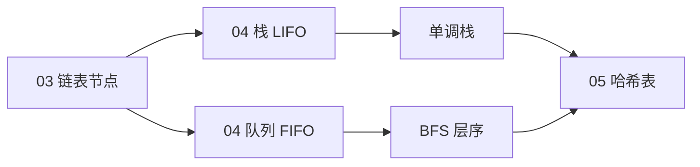

# 栈与队列

> **文件编码**：UTF-8。代码示例默认 **Python 3**；手撕实现为主，关键处附三语言 [13 算法章](../Python/13-算法与数据结构基础.md) 对照链接。

---

## 0. 读前导读（零基础也能跟上）

### 0.1 用一句话弄懂本章

**栈（Stack）** = 只能从一端进出，**后进先出**；**队列（Queue）** = 一端进一端出，**先进先出**。在 [03 链表](03-链表.md) 之上加**访问规则**，支撑括号匹配、单调栈、BFS。

### 0.2 你需要提前知道什么

- 03 章链表、头插
- 04 与 03：**同样节点，不同规则**
- ACM：手写实现可略读，重点 **单调栈 O(n) 证明** + §22 口述

### 0.3 知识地图（☐→☑）

- [ ] 画数组栈 / 链表队列图
- [ ] 闭卷 `ArrayStack`、`LinkedQueue`
- [ ] 有效括号、每日温度、232 双栈队列
- [ ] 解释单调栈为何 O(n)
- [ ] BFS 层序模板（衔接 06）
- [ ] §24 自测 ≥8/10

### 0.4 建议时长

3 天原理+实现；4～5 天刷 20/739/394/232。

### 0.5 生活类比

| 结构 | 类比 | 英文 |
|------|------|------|
| **栈** | 洗盘子摞起来，最后放的最先拿 | LIFO |
| **队列** | 超市排队，先排队先结账 | FIFO |
| **单调栈** | 从栈底到栈顶温度/高度严格递减的「等待更暖日子的日历」 | — |
| **deque** | 两端都能插队的高速公路 | 双端队列 |

**术语（Stack）**：仅栈顶可 insert/delete 的线性表。  
**为什么重要**：DFS 迭代、表达式、Next Greater Element。  
**本章**：§1～§8。

---

## 本章与上一章的关系

| 上一章（[03 链表](03-链表.md)） | 本章（04） | 下一章（[05 哈希表](05-哈希表.md)） |
|--------------------------------|------------|-------------------------------------|
| 掌握指针/引用、节点插入删除 | 在链表/数组上**限制访问端点** | 用哈希实现 O(1) 查找 |
| 反转、环检测、快慢指针 | LIFO 栈、FIFO 队列 | 频次统计、两数之和 |
| 链式思维 | **单调栈/队列**、BFS 基础 | dict/set 原理 |

[03 链表](03-链表.md) 教你「节点怎么连」；本章在同样存储之上加**访问规则**——栈只允许一端进出（后进先出），队列一端进一端出（先进先出）。很多算法题本质是：**用栈模拟递归/括号**，**用队列做层序/BFS**。

与三语言刷题章分工：

| 模块 | 链接 |
|------|------|
| 原理 + 手写实现 | **本章** |
| Python 模板 | [Python 13 §7](../Python/13-算法与数据结构基础.md) |
| Java 模板 | [Java 13](../Java/13-算法与数据结构基础.md) |
| C++ STL | [C++ 13 §栈队列](../C++/13-算法与数据结构C++实现.md) |



---

## 1. 栈（Stack）

### 1.1 定义与直觉

**栈** = 只能从**同一端**（栈顶 top）插入和删除的线性表。

- **LIFO**（Last In, First Out）：最后压入的最先弹出
- 生活类比：一摞盘子，只能从最上面取放

```text
        push →  [ d ]  ← top（栈顶，唯一可操作端）
                [ c ]
                [ b ]
                [ a ]  ← bottom（栈底）
        pop  ←  弹出 d
```

### 1.2 内存模型

| 实现方式 | 底层结构 | push/pop | 说明 |
|----------|----------|----------|------|
| **数组栈** | 动态数组 `list` | 均摊 O(1) | Python `list.append` / `pop()` |
| **链表栈** | 单链表，头=栈顶 | O(1) | 与 03 章头插法一致 |

```text
数组栈（连续内存）:
index:  0    1    2    3
       [a] [b] [c] [d]   ← size=4, top 在 index 3

链表栈（头=top）:
  head → [d] → [c] → [b] → [a] → None
```

### 1.3 核心操作与复杂度

| 操作 | 含义 | 时间 | 空间 |
|------|------|------|------|
| `push(x)` | 压栈 | O(1) | O(1) |
| `pop()` | 弹栈 | O(1) | O(1) |
| `peek()` / `top()` | 看栈顶不弹 | O(1) | O(1) |
| `is_empty()` | 是否空 | O(1) | O(1) |
| `size()` | 元素个数 | O(1) | O(1) |

---

## 2. 手写栈（数组实现）

```python
class ArrayStack:
    """基于动态数组的栈，教育用完整实现。"""

    def __init__(self) -> None:
        self._data: list[int] = []

    def push(self, x: int) -> None:
        self._data.append(x)

    def pop(self) -> int:
        if self.is_empty():
            raise IndexError("pop from empty stack")
        return self._data.pop()

    def peek(self) -> int:
        if self.is_empty():
            raise IndexError("peek from empty stack")
        return self._data[-1]

    def is_empty(self) -> bool:
        return len(self._data) == 0

    def size(self) -> int:
        return len(self._data)

    def __repr__(self) -> str:
        return f"ArrayStack({self._data})"
```

### 2.1 链表栈实现

```python
class ListNode:
    def __init__(self, val: int = 0, next: "ListNode | None" = None):
        self.val = val
        self.next = next


class LinkedStack:
    """头结点即栈顶，与 03 章头插链表同构。"""

    def __init__(self) -> None:
        self._head: ListNode | None = None
        self._size = 0

    def push(self, x: int) -> None:
        self._head = ListNode(x, self._head)
        self._size += 1

    def pop(self) -> int:
        if self._head is None:
            raise IndexError("pop from empty stack")
        val = self._head.val
        self._head = self._head.next
        self._size -= 1
        return val

    def peek(self) -> int:
        if self._head is None:
            raise IndexError("peek from empty stack")
        return self._head.val

    def is_empty(self) -> bool:
        return self._head is None

    def size(self) -> int:
        return self._size
```

---

## 3. 最小栈（LeetCode 155）

维护**辅助栈**同步记录当前最小值。

```python
class MinStack:
    def __init__(self) -> None:
        self._stack: list[int] = []
        self._min_stack: list[int] = []  # 与主栈同步压弹，存当前最小值

    def push(self, x: int) -> None:
        self._stack.append(x)
        if not self._min_stack or x <= self._min_stack[-1]:
            self._min_stack.append(x)

    def pop(self) -> None:
        top = self._stack.pop()
        if top == self._min_stack[-1]:
            self._min_stack.pop()

    def top(self) -> int:
        return self._stack[-1]

    def get_min(self) -> int:
        return self._min_stack[-1]
```

---

## 4. 栈的经典应用

### 4.1 有效括号（LeetCode 20）

```python
def is_valid(s: str) -> bool:
    stack: list[str] = []
    pairs = {")": "(", "]": "[", "}": "{"}
    for ch in s:
        if ch in pairs:
            if not stack or stack[-1] != pairs[ch]:
                return False
            stack.pop()
        else:
            stack.append(ch)
    return not stack
```

### 4.2 字符串解码（LeetCode 394）

```python
def decode_string(s: str) -> str:
    count_stack: list[int] = []
    str_stack: list[str] = []
    num = 0
    cur = ""
    for ch in s:
        if ch.isdigit():
            num = num * 10 + int(ch)
        elif ch == "[":
            count_stack.append(num)
            str_stack.append(cur)
            num, cur = 0, ""
        elif ch == "]":
            repeat = count_stack.pop()
            prev = str_stack.pop()
            cur = prev + cur * repeat
        else:
            cur += ch
    return cur
```

### 4.3 单调栈：每日温度（LeetCode 739）

**单调递减栈**：存下标，遇更高温度时弹栈并算天数差。

```python
def daily_temperatures(temperatures: list[int]) -> list[int]:
    n = len(temperatures)
    ans = [0] * n
    stack: list[int] = []  # 存下标，对应温度单调递减
    for i, t in enumerate(temperatures):
        while stack and temperatures[stack[-1]] < t:
            j = stack.pop()
            ans[j] = i - j
        stack.append(i)
    return ans
```

### 4.4 逆波兰表达式（LeetCode 150）

```python
def eval_rpn(tokens: list[str]) -> int:
    stack: list[int] = []
    ops = {"+", "-", "*", "/"}
    for tok in tokens:
        if tok in ops:
            b, a = stack.pop(), stack.pop()
            if tok == "+":
                stack.append(a + b)
            elif tok == "-":
                stack.append(a - b)
            elif tok == "*":
                stack.append(a * b)
            else:
                stack.append(int(a / b))  # 向零取整
        else:
            stack.append(int(tok))
    return stack[0]
```

---

## 5. 队列（Queue）

### 5.1 定义与直觉

**队列** = 一端进（rear 队尾）、一端出（front 队头）。

- **FIFO**（First In, First Out）
- 生活类比：排队买票，先来的先服务

```text
  enqueue →  rear [ a | b | c | d ] front → dequeue
                    先进 a，先出 a
```

### 5.2 实现对比

| 实现 | enqueue | dequeue | 备注 |
|------|---------|---------|------|
| `list` 头部 `pop(0)` | O(1) append | **O(n)** | 勿用于队列 |
| **循环数组** | O(1) | O(1) | 定长或扩容 |
| **链表队列** | O(1) tail 入 | O(1) head 出 | 需维护 tail 指针 |
| **`collections.deque`** | O(1) | O(1) | **Python 首选** |

```text
循环队列（概念图，cap=4）:
  front=1, rear=3, size=2
  [x][b][c][x]
      ↑front  ↑rear（下一插入位置）
```

---

## 6. 手写队列

### 6.1 链表队列

```python
class LinkedQueue:
    def __init__(self) -> None:
        self._head: ListNode | None = None
        self._tail: ListNode | None = None
        self._size = 0

    def enqueue(self, x: int) -> None:
        node = ListNode(x)
        if self._tail is None:
            self._head = self._tail = node
        else:
            self._tail.next = node
            self._tail = node
        self._size += 1

    def dequeue(self) -> int:
        if self._head is None:
            raise IndexError("dequeue from empty queue")
        val = self._head.val
        self._head = self._head.next
        if self._head is None:
            self._tail = None
        self._size -= 1
        return val

    def peek(self) -> int:
        if self._head is None:
            raise IndexError("peek from empty queue")
        return self._head.val

    def is_empty(self) -> bool:
        return self._head is None

    def size(self) -> int:
        return self._size
```

### 6.2 循环数组队列

```python
class CircularQueue:
    def __init__(self, capacity: int) -> None:
        self._cap = capacity
        self._data: list[int | None] = [None] * capacity
        self._front = 0
        self._size = 0

    def _rear_index(self) -> int:
        return (self._front + self._size) % self._cap

    def enqueue(self, x: int) -> bool:
        if self._size == self._cap:
            return False
        self._data[self._rear_index()] = x
        self._size += 1
        return True

    def dequeue(self) -> int:
        if self._size == 0:
            raise IndexError("dequeue from empty queue")
        val = self._data[self._front]
        self._data[self._front] = None
        self._front = (self._front + 1) % self._cap
        self._size -= 1
        return val  # type: ignore[return-value]

    def is_empty(self) -> bool:
        return self._size == 0

    def is_full(self) -> bool:
        return self._size == self._cap
```

### 6.3 用栈实现队列（LeetCode 232）

```python
class MyQueue:
    def __init__(self) -> None:
        self._in_stack: list[int] = []
        self._out_stack: list[int] = []

    def _pour(self) -> None:
        if not self._out_stack:
            while self._in_stack:
                self._out_stack.append(self._in_stack.pop())

    def push(self, x: int) -> None:
        self._in_stack.append(x)

    def pop(self) -> int:
        self._pour()
        return self._out_stack.pop()

    def peek(self) -> int:
        self._pour()
        return self._out_stack[-1]

    def empty(self) -> bool:
        return not self._in_stack and not self._out_stack
```

### 6.4 用队列实现栈（LeetCode 225）

```python
from collections import deque

class MyStack:
    def __init__(self) -> None:
        self._q: deque[int] = deque()

    def push(self, x: int) -> None:
        self._q.append(x)
        # 把新元素旋到队头，使队头=栈顶
        for _ in range(len(self._q) - 1):
            self._q.append(self._q.popleft())

    def pop(self) -> int:
        return self._q.popleft()

    def top(self) -> int:
        return self._q[0]

    def empty(self) -> bool:
        return len(self._q) == 0
```

---

## 7. 双端队列 deque

`collections.deque` 两端 O(1) 插入删除，是 **BFS、滑动窗口最大值** 的标配。

```python
from collections import deque

def sliding_window_max(nums: list[int], k: int) -> list[int]:
    """单调递减双端队列存下标 — LeetCode 239 核心思路。"""
    dq: deque[int] = deque()
    ans: list[int] = []
    for i, x in enumerate(nums):
        while dq and nums[dq[-1]] <= x:
            dq.pop()
        dq.append(i)
        if dq[0] <= i - k:
            dq.popleft()
        if i >= k - 1:
            ans.append(nums[dq[0]])
    return ans
```

---

## 8. 队列与 BFS 预览

层序遍历依赖队列（完整树结构见 [06 树与二叉树](06-树与二叉树.md)）。

```python
from collections import deque

class TreeNode:
    def __init__(self, val: int = 0, left: "TreeNode | None" = None, right: "TreeNode | None" = None):
        self.val = val
        self.left = left
        self.right = right


def level_order(root: TreeNode | None) -> list[list[int]]:
    if not root:
        return []
    q: deque[TreeNode] = deque([root])
    ans: list[list[int]] = []
    while q:
        level: list[int] = []
        for _ in range(len(q)):
            node = q.popleft()
            level.append(node.val)
            if node.left:
                q.append(node.left)
            if node.right:
                q.append(node.right)
        ans.append(level)
    return ans
```

---

## 9. 复杂度总表

| 结构 | 操作 | 数组实现 | 链表实现 | deque |
|------|------|----------|----------|-------|
| 栈 | push/pop/peek | 均摊 O(1) | O(1) | O(1) 一端 |
| 队列 | enq/deq | 循环数组 O(1) | O(1) | **O(1)** |
| 单调栈 | 每个元素入出各一次 | — | — | **O(n)** 总 |
| BFS | 访问所有点边 | — | — | O(V+E) |

| 算法题 | 时间 | 空间 |
|--------|------|------|
| 有效括号 20 | O(n) | O(n) |
| 每日温度 739 | O(n) | O(n) |
| 滑动窗口最大值 239 | O(n) | O(k) |
| 字符串解码 394 | O(n×重复次数) | O(n) |

---

## 10. LeetCode 精选（带题号链接）

| 题号 | 题目 | 难度 | 考点 | 链接 |
|------|------|------|------|------|
| 20 | 有效的括号 | E | 栈匹配 | https://leetcode.cn/problems/valid-parentheses/ |
| 155 | 最小栈 | M | 辅助栈 | https://leetcode.cn/problems/min-stack/ |
| 225 | 用队列实现栈 | E | 双栈/旋转 | https://leetcode.cn/problems/implement-stack-using-queues/ |
| 232 | 用栈实现队列 | E | 双栈倾倒 | https://leetcode.cn/problems/implement-queue-using-stacks/ |
| 739 | 每日温度 | M | 单调栈 | https://leetcode.cn/problems/daily-temperatures/ |
| 496 | 下一个更大元素 I | E | 单调栈 | https://leetcode.cn/problems/next-greater-element-i/ |
| 394 | 字符串解码 | M | 栈存状态 | https://leetcode.cn/problems/decode-string/ |
| 150 | 逆波兰表达式求值 | M | 栈计算 | https://leetcode.cn/problems/evaluate-reverse-polish-notation/ |
| 239 | 滑动窗口最大值 | H | 单调双端队列 | https://leetcode.cn/problems/sliding-window-maximum/ |
| 84 | 柱状图中最大矩形 | H | 单调栈 | https://leetcode.cn/problems/largest-rectangle-in-histogram/ |
| 946 | 验证栈序列 | M | 模拟栈 | https://leetcode.cn/problems/validate-stack-sequences/ |
| 71 | 简化路径 | M | 栈路径 | https://leetcode.cn/problems/simplify-path/ |

与 [Python 13 §12.5](../Python/13-算法与数据结构基础.md)、[C++ 13](../C++/13-算法与数据结构C++实现.md) 题单 **39～46** 对齐。

---

## 11. 常见报错 / 易错点（逻辑向）

| # | 易错场景 | 错误写法 / 思路 | 正确做法 |
|---|----------|-----------------|----------|
| 1 | 括号匹配 | 遇左括号不压栈 | 左括号也要 `append` |
| 2 | 括号匹配 | 只判断 `stack` 非空，不比对类型 | 弹栈前比对 `stack[-1] == pairs[ch]` |
| 3 | 最小栈 | 辅助栈只在更小才压入 | 相等也要压：`x <= min_stack[-1]` |
| 4 | 单调栈 | 存值而非下标 | 存**下标**才能算距离 |
| 5 | 队列用 list | `list.pop(0)` 当 dequeue | 用 `deque` 或循环数组 |
| 6 | 循环队列 | `rear == front` 判满/判空混淆 | 用 `size` 字段或浪费一格 |
| 7 | 双栈实现队列 | 每次 pop 都倾倒 | 仅 `_out` 空时才从 `_in` 倒入 |
| 8 | BFS 层序 | 不固定层大小，混层 | `for _ in range(len(q))` 一层一层处理 |
| 9 | 逆波兰 | 先 pop `a` 再 `b`，运算 `a-b` | 先 pop 的是右操作数：`b,a = pop(),pop()` |
| 10 | 字符串解码 | `]` 时重复当前串忘了拼前缀 | `cur = prev + cur * repeat` |

---

## 12. 练习建议

### 12.1 基础（1 周）

1. 手写 `ArrayStack`、`LinkedQueue`，闭卷通过自测
2. 完成 **20、232、225、496**（Easy/Medium 入门）
3. 画图：单调栈处理 `[73,74,75,71,69,72,76,73]` 的弹栈过程

### 12.2 进阶（1 周）

4. **739、394、71、946**
5. 口述：「为什么单调栈求 Next Greater 是 O(n)？」
6. 对比 [03 链表](03-链表.md) 头插与栈 push 的异同

### 12.3 挑战

7. **239、84**（Hard，可先看题解再独立写）
8. 实现 LeetCode 155 `MinStack` 的单栈 O(1) 空间变体（存差值）

---

## 13. 分级参考答案

### 练习 A（Easy）：下一个更大元素 I（496）

```python
def next_greater_element(nums1: list[int], nums2: list[int]) -> list[int]:
    greater: dict[int, int] = {}
    stack: list[int] = []
    for x in nums2:
        while stack and stack[-1] < x:
            greater[stack.pop()] = x
        stack.append(x)
    return [greater.get(x, -1) for x in nums1]
```

### 练习 B（Medium）：简化路径（71）

```python
def simplify_path(path: str) -> str:
    stack: list[str] = []
    for part in path.split("/"):
        if part in ("", "."):
            continue
        if part == "..":
            if stack:
                stack.pop()
        else:
            stack.append(part)
    return "/" + "/".join(stack)
```

### 练习 C（Medium）：验证栈序列（946）

```python
def validate_stack_sequences(pushed: list[int], popped: list[int]) -> bool:
    stack: list[int] = []
    j = 0
    for x in pushed:
        stack.append(x)
        while stack and stack[-1] == popped[j]:
            stack.pop()
            j += 1
    return j == len(popped)
```

### 练习 D（Hard）：柱状图最大矩形（84）— 骨架

```python
def largest_rectangle_area(heights: list[int]) -> int:
    stack: list[int] = []
    ans = 0
    heights.append(0)  # 哨兵，清空栈
    for i, h in enumerate(heights):
        while stack and heights[stack[-1]] > h:
            idx = stack.pop()
            width = i if not stack else i - stack[-1] - 1
            ans = max(ans, heights[idx] * width)
        stack.append(i)
    heights.pop()
    return ans
```

---

## 14. 学完标准

- [ ] 能口述栈 LIFO、队列 FIFO，并画出数组栈/链表队列内存图
- [ ] 闭卷手写 `ArrayStack`、`LinkedQueue`、`MinStack`
- [ ] 独立完成 **20、155、232、739** 四题
- [ ] 理解单调栈「每个元素最多入出栈一次 → O(n)」
- [ ] 会用 `deque` 写 BFS 层序模板（衔接 06 章）
- [ ] 知道 `list.pop(0)` 为何不能当队列
- [ ] 能在 25 分钟内手撕有效括号 + 每日温度

---

## 17. FAQ（扩充）

### Q1：栈和递归什么关系？

函数调用本身用**系统栈**；DFS 可递归可显式栈，等价。

### Q2：单调栈存值还是下标？

求**距离/宽度**存**下标**；仅 Next Greater 值可存值但距离题不行。

### Q3：为何 739 是 O(n)？

每个下标最多入栈一次、出栈一次，总 2n 操作。

### Q4：232 双栈队列 pop 时何时 pour？

`_out` **空**时才把 `_in` 全部倒入；均摊 O(1)。

### Q5：list 当队列为何 TLE？

`pop(0)` O(n)，n 次 dequeue → O(n²)。

### Q6：BFS 为何要 `for _ in range(len(q))`？

固定一层处理完再进下一层，否则混层。

### Q7：84 柱状图矩形单调栈方向？

递增栈存下标；当前 h 更小则弹栈算以弹出高度为高的宽度。

### Q8：239 滑动窗口最大值为何用 deque？

队头存窗口内最大下标；尾维护递减，O(n)。

### Q9：394 解码栈存什么？

`count_stack` + `str_stack` 分层状态。

### Q10：ACM 面试 30 秒讲栈？

「后进先出；括号匹配；单调栈求右边第一个更大元素，均摊线性。」

### Q11：225 用队列实现栈思路？

push 后把前面元素旋转到队尾，使队头=栈顶。

### Q12：155 MinStack 单栈 O(1) 空间变体？

存差值 relative min（了解即可，面试双栈足够）。

---

## 18. 面试口述版（零基础）

「栈像一摞盘子只动最上面；队列像排队。括号题：左括号入栈，右括号看栈顶是否配对。单调栈：维持一个『从底到顶递减』的下标栈，来更高温度就把栈里更冷的弹出并算天数差。」

---

## 19. LeetCode 思维六步

### 19.1 LeetCode 20 有效括号

| 步 | 思考 |
|----|------|
| 1 | 仅 `()[]{}` 且合法嵌套 |
| 2 | 暴力：递归检查 O(n) |
| 3 | 最近未闭合的左括号 → **栈** |
| 4 | 左括号 push；右括号 pop 比对 |
| 5 | 结束栈空为真 |
| 6 | 变体：带 `*` 通配（Hard） |

### 19.2 LeetCode 739 每日温度

| 步 | 思考 |
|----|------|
| 1 | 等几天更高温；无则 0 |
| 2 | 暴力 O(n²) 向后找 |
| 3 | 对每个 i 重复扫 → **单调栈** |
| 4 | 递减栈存下标；更暖则 pop 填 ans |
| 5 | 每 index 入出各一次 |
| 6 | 496 Next Greater 同源 |

### 19.3 LeetCode 232 用栈实现队列

| 步 | 思考 |
|----|------|
| 1 | 实现 push/pop/peek/empty |
| 2 | 单栈 LIFO 不像队列 |
| 3 | **in 栈 + out 栈**；out 空时倒入 |
| 4 | pour 摊还 O(1) |
| 5 | pop/peek 先 pour |
| 6 | 225 反向题：队列旋转让队头=栈顶 |

---

## 20. 手把手：单调栈手走示例

温度 `[73,74,75,71,69,72,76,73]`：

| i | 栈(下标) | 动作 |
|---|----------|------|
| 0 | [0] | push |
| 1 | [1] | 74>73 pop0 ans[0]=1 |
| 2 | [2] | push |
| … | … | 遇更高则弹栈填天数 |

---

## 21. 逐行读：有效括号（核心循环）

| 行 | 含义 | 改错 |
|----|------|------|
| `if ch in pairs` | 右括号 | 左括号也要 else append |
| `not stack` | 无匹配左 | 直接 False |
| `stack[-1]!=pairs[ch]` | 类型不匹配 | 漏比对 WA |
| `return not stack` | 无遗留左括号 | 忘写则 `((` 误判 |

---

## 22. 闭卷自测

1. LIFO/FIFO 各举一生活例。
2. 数组栈 push/pop 复杂度？
3. 为何队列别用 list.pop(0)？
4. MinStack 相等时辅助栈要压吗？
5. 739 栈单调性（递增/递减）？
6. 232 pour 触发条件？
7. BFS 层序如何防混层？
8. 逆波兰 pop 顺序？
9. 84 弹栈时宽度公式？
10. deque 在 239 维护什么不变式？

<details>
<summary>自测参考答案</summary>

1. 栈：洗盘子；队列：排队。
2. 均摊 O(1)。
3. pop(0) O(n) 总 O(n²)。
4. 要：`x<=min_stack[-1]`。
5. **递减**（栈底温度更高/更大）。
6. `_out` 空时从 `_in` 倒入。
7. `for _ in range(len(q))` 一层。
8. 先 pop 右操作数 b 再 a，算 `a op b`。
9. `i - stack[-1] - 1`（栈空则宽 i）。
10. 队头到队尾对应值递减；队头为窗口最大。

</details>

---

## 23. 费曼检验

3 分钟解释「单调栈为什么比暴力 O(n²) 快」。

**提纲**：每个元素只被 push/pop 各一次；找「下一个更大」时不用反复回头扫。

---

## 24. 术语三件套

**单调栈（Monotonic Stack）**：栈内元素保持单调增或减，常用于 Next Greater/Smaller。  
**生活类比**：一排按身高从矮到高站队，新人来了把更矮的 pop 掉再入队。  
**为什么重要**：739/496/84 一类题 O(n) 模板。  
**本章**：§4.3。

**双端队列 deque**：两端 O(1) 入出，BFS 与 239 窗口最值。  
**生活类比**：双向传送带，队头队尾都能装卸。  
**本章**：§7。

---

## 25. LeetCode 思维：LeetCode 496（下一个更大元素 I）

| 步 | 内容 |
|----|------|
| 1 | nums1 是 nums2 子集，找 nums2 中下一个更大 |
| 2 | 对 nums1 每个在 nums2 里 O(n) 扫 → O(n²) |
| 3 | 先对 **nums2 单调栈** 预处理 greater |
| 4 | 递减栈；弹栈时 `greater[pop]=x` |
| 5 | 查表回答 nums1 |
| 6 | 与 739 同模板 |

---

## 26. 栈/队列工程场景

| 场景 | 结构 |
|------|------|
| 函数调用栈 | 系统栈 |
| 浏览器前进后退 | 双栈 |
| 任务队列 / 消息 MQ | 队列（04 章 FIFO 思维） |
| BFS 最短步数（无权图） | 队列，见 [08 图](08-图论基础.md) |
| 表达式求值 | 栈 |

**面试串讲**：「括号用栈；最近更大元素用单调栈；层序用队列——06 树章会再用一次 BFS。」

---

## 15. 下一章预告

[05 哈希表](05-哈希表.md) 进入 **O(1) 均摊查找**：哈希函数、冲突处理、负载因子；你会理解 Python `dict` / Java `HashMap` 为何能快速做「两数之和」「频次统计」，以及 Redis 分片背后的键路由思想。

---

## 16. 交叉引用

| 类型 | 链接 |
|------|------|
| 上一章 | [03-链表](03-链表.md) |
| 下一章 | [05-哈希表](05-哈希表.md) |
| 路线图 | [00-学习路线图与说明](00-学习路线图与说明.md) |
| Python 刷题 | [Python 13-算法与数据结构基础](../Python/13-算法与数据结构基础.md) |
| Java 刷题 | [Java 13-算法与数据结构基础](../Java/13-算法与数据结构基础.md) |
| C++ 刷题 | [C++ 13-算法与数据结构C++实现](../C++/13-算法与数据结构C++实现.md) |
| 后续 | [06-树与二叉树](06-树与二叉树.md)（BFS）、[11-LeetCode 刷题路线](11-LeetCode刷题路线与题型汇总.md) |

---

*上一章：[03-链表](03-链表.md) · 下一章：[05-哈希表](05-哈希表.md)*
