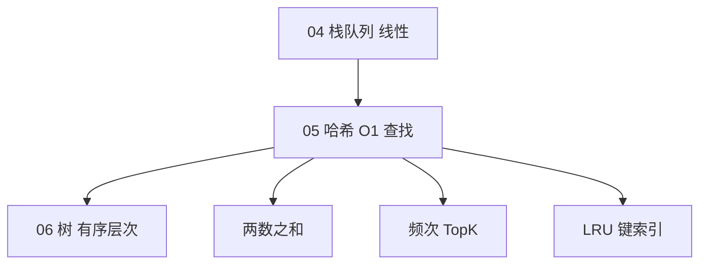

# 哈希表

> **文件编码**：UTF-8。代码示例默认 **Python 3**；原理为主，对照 [Python dict](https://docs.python.org/3/library/stdtypes.html#mapping-types-dict) 与三语言 [13 算法章](../Python/13-算法与数据结构基础.md)。

---

## 0. 读前导读（零基础也能跟上）

### 0.1 用一句话弄懂本章

**哈希表（Hash Table）** = 给每个 key 算一个「柜号」，理想情况下 **O(1)** 打开柜子存取值——用**空间换时间**。

### 0.2 你需要提前知道什么

- [01 复杂度](01-复杂度分析与学习方法.md)：均摊 O(1)
- [03 链表](03-链表.md)：链地址法冲突链
- ACM：手写 ChainedHashMap 可 skim，重点 **LRU 设计** + **128 起点 trick**

### 0.3 知识地图（☐→☑）

- [ ] 画 hash → index → bucket
- [ ] 链地址 vs 开放寻址
- [ ] 负载因子 0.75 与 rehash
- [ ] 1/128/49/560 四题
- [ ] 口述 LRU 为何要哈希+链表
- [ ] §22 自测 ≥8/10

### 0.4 时长

4 天（含手写哈希 1 天 + 刷题 3 天）。

### 0.5 生活类比

**术语（Hash Table）**：键经哈希函数映射到桶，支持近似 O(1) 增删查的映射结构。  
**生活类比**：**带姓名标签的储物柜**——不用遍历所有柜，看标签 hash 到几号柜；两人标签撞号就挂同一柜里的链表。  
**为什么重要**：两数之和、频次、LRU、Redis、分片。  
**本章**：§1～§8。

**负载因子类比**：柜子太满（α>0.75）就要换更大房间并**重新分柜**（rehash）。

---

## 本章与上一章的关系

| 上一章（[04 栈与队列](04-栈与队列.md)） | 本章（05） | 下一章（[06 树与二叉树](06-树与二叉树.md)） |
|----------------------------------------|------------|-------------------------------------------|
| 线性结构、受限访问端 | **键 → 值** 的 O(1) 均摊查找 | 层次结构、有序性（BST） |
| 单调栈、BFS 队列 | 频次统计、去重、索引映射 | 递归遍历、层序 BFS |
| 模拟与匹配 | **空间换时间** 核心武器 | 查找 O(log n) 与 O(1) 权衡 |

[04 栈与队列](04-栈与队列.md) 解决「顺序与匹配」；哈希表解决「**快速定位**」——给定 key，理想情况下 O(1) 找到 value。后端中 Redis 键值、路由分片、JWT 黑名单、缓存索引都依赖哈希思想。



| 模块 | 链接 |
|------|------|
| 原理 + 手写哈希 | **本章** |
| Python `dict` 刷题 | [Python 13 §5](../Python/13-算法与数据结构基础.md) |
| Java `HashMap` | [Java 13](../Java/13-算法与数据结构基础.md) |
| C++ `unordered_map` | [C++ 13](../C++/13-算法与数据结构C++实现.md) |

---

## 1. 哈希表是什么

### 1.1 抽象数据类型

**哈希表（Hash Table）** = 支持以下操作的键值映射：

| 操作 | 理想时间 | 说明 |
|------|----------|------|
| `put(key, val)` | O(1) 均摊 | 插入或更新 |
| `get(key)` | O(1) 均摊 | 查询 |
| `remove(key)` | O(1) 均摊 | 删除 |
| `contains(key)` | O(1) 均摊 | 是否存在 |

Python 对应：`dict`（映射）、`set`（仅键，可视为 value 为空的哈希集合）。

### 1.2 核心思路

```text
key  --哈希函数 h()-->  整数下标 index  --映射-->  桶 bucket 存 (key, value)
```

1. **哈希函数** `h(key)`：把任意 key 映射为 `0 .. capacity-1` 的整数
2. **桶数组**：`table[index]` 存放数据
3. **冲突处理**：不同 key 可能映射到同一 index

```text
        hash("alice") = 3
        hash("bob")   = 7
        hash("carol") = 3  ← 与 alice 冲突！

table:  [ ][ ][ ][alice|carol][ ][ ][bob][ ]
index:   0  1  2      3        4  5  6  7
```

---

## 2. 哈希函数

### 2.1 好的哈希函数性质

- **确定性**：同一 key 永远同一哈希值
- **均匀分布**：减少冲突
- **高效**：O(len(key)) 可接受

### 2.2 常见方法

| 类型 | 做法 | 场景 |
|------|------|------|
| 整数 | `key % capacity` | 整数键 |
| 字符串 | 多项式滚动哈希 | `"abc"` → 31 进制累加 |
| Python 内置 | `hash(obj)` | 可哈希对象；str/int/tuple |

```python
def poly_hash(s: str, cap: int, base: int = 31) -> int:
    """教学用字符串哈希，非密码学安全。"""
    h = 0
    for ch in s:
        h = (h * base + ord(ch)) % cap
    return h
```

**注意**：密码学哈希（SHA-256）用于安全；**表内定位**用快速非加密哈希即可。

### 2.3 可哈希与不可哈希（Python）

| 可哈希（能做 dict key） | 不可哈希 |
|-------------------------|----------|
| `int`, `str`, `tuple`（元素皆哈希） | `list`, `dict`, `set` |
| `frozenset` | 自定义可变对象默认不可哈希 |

---

## 3. 冲突处理

### 3.1 链地址法（Separate Chaining）— 最常用

每个桶存**链表**（或动态数组）存所有冲突项。

```text
index 3:  (alice,1) → (carol,3) → None
index 7:  (bob,2) → None
```

- 查找：算 index → 遍历桶内链表比对 `key`
- 负载因子 α = n / capacity（n 为元素数）
- 均摊 O(1) 当 α 有界且链表不长

### 3.2 开放寻址法（Open Addressing）

冲突时在表中**探测**下一个空位：线性探测、二次探测、双重哈希。

```text
插入 carol，h=3 被占 → 探测 4 → 4 空 → 放入 4
table: [ ][ ][ ][alice][carol][ ][ ][bob]
```

- 删除需**墓碑标记**，不能真删空位
- 聚集（clustering）问题：线性探测易扎堆
- Python dict 历史版本用过开放寻址；当前 CPython 3.7+ 实现细节见官方文档（组合探测 + 紧凑数组）

### 3.3 扩容（Rehash）

当 α 超过阈值（常见 **0.75**）：

1. 新建更大 capacity（通常 **2 倍**）
2. 所有元素**重新哈希**到新表

均摊分析：单次 put 可能 O(n)，但 n 次 put 均摊 O(1)。

---

## 4. 手写哈希表（链地址法）

```python
from typing import Generic, Iterator, TypeVar

K = TypeVar("K")
V = TypeVar("V")


class _Entry(Generic[K, V]):
    __slots__ = ("key", "value", "next")

    def __init__(self, key: K, value: V) -> None:
        self.key = key
        self.value = value
        self.next: "_Entry[K, V] | None" = None


class ChainedHashMap(Generic[K, V]):
    """教育用链地址哈希表，key 需可哈希且支持 == 。"""

    def __init__(self, capacity: int = 8, load_factor: float = 0.75) -> None:
        self._cap = max(4, capacity)
        self._lf = load_factor
        self._size = 0
        self._buckets: list[_Entry[K, V] | None] = [None] * self._cap

    def _index(self, key: K) -> int:
        return hash(key) % self._cap

    def __len__(self) -> int:
        return self._size

    def _find_entry(self, key: K) -> _Entry[K, V] | None:
        idx = self._index(key)
        cur = self._buckets[idx]
        while cur:
            if cur.key == key:
                return cur
            cur = cur.next
        return None

    def get(self, key: K, default: V | None = None) -> V | None:
        ent = self._find_entry(key)
        return ent.value if ent else default

    def put(self, key: K, value: V) -> None:
        idx = self._index(key)
        cur = self._buckets[idx]
        while cur:
            if cur.key == key:
                cur.value = value
                return
            cur = cur.next
        new_ent = _Entry(key, value)
        new_ent.next = self._buckets[idx]
        self._buckets[idx] = new_ent
        self._size += 1
        if self._size > self._cap * self._lf:
            self._resize()

    def remove(self, key: K) -> bool:
        idx = self._index(key)
        prev: _Entry[K, V] | None = None
        cur = self._buckets[idx]
        while cur:
            if cur.key == key:
                if prev:
                    prev.next = cur.next
                else:
                    self._buckets[idx] = cur.next
                self._size -= 1
                return True
            prev, cur = cur, cur.next
        return False

    def _resize(self) -> None:
        old_buckets = self._buckets
        self._cap *= 2
        self._size = 0
        self._buckets = [None] * self._cap
        for head in old_buckets:
            cur = head
            while cur:
                self.put(cur.key, cur.value)
                cur = cur.next

    def __contains__(self, key: K) -> bool:
        return self._find_entry(key) is not None

    def items(self) -> Iterator[tuple[K, V]]:
        for head in self._buckets:
            cur = head
            while cur:
                yield cur.key, cur.value
                cur = cur.next
```

---

## 5. Python 内置哈希工具

### 5.1 dict 与 set

```python
# 频次统计
from collections import Counter

def top_k_frequent(nums: list[int], k: int) -> list[int]:
    return [x for x, _ in Counter(nums).most_common(k)]

#  defaultdict 避免 KeyError
from collections import defaultdict

graph: dict[str, list[str]] = defaultdict(list)
graph["a"].append("b")
```

### 5.2 两数之和（LeetCode 1）

```python
def two_sum(nums: list[int], target: int) -> list[int]:
    idx_map: dict[int, int] = {}
    for i, x in enumerate(nums):
        need = target - x
        if need in idx_map:
            return [idx_map[need], i]
        idx_map[x] = i
    return []
```

### 5.3 最长连续序列（LeetCode 128）

```python
def longest_consecutive(nums: list[int]) -> int:
    num_set = set(nums)
    ans = 0
    for x in num_set:
        if x - 1 in num_set:  # 只从序列起点扩展
            continue
        cur = x
        length = 1
        while cur + 1 in num_set:
            cur += 1
            length += 1
        ans = max(ans, length)
    return ans
```

### 5.4 字母异位词分组（LeetCode 49）

```python
from collections import defaultdict

def group_anagrams(strs: list[str]) -> list[list[str]]:
    groups: dict[tuple[int, ...], list[str]] = defaultdict(list)
    for s in strs:
        key = tuple(sorted(s))  # 或 26 维计数元组
        groups[key].append(s)
    return list(groups.values())
```

### 5.5 设计 LRU 缓存（LeetCode 146）— 哈希 + 双向链表

```python
from collections import OrderedDict

class LRUCache:
    def __init__(self, capacity: int) -> None:
        self.cap = capacity
        self.cache: OrderedDict[int, int] = OrderedDict()

    def get(self, key: int) -> int:
        if key not in self.cache:
            return -1
        self.cache.move_to_end(key)
        return self.cache[key]

    def put(self, key: int, value: int) -> None:
        if key in self.cache:
            self.cache.move_to_end(key)
        self.cache[key] = value
        if len(self.cache) > self.cap:
            self.cache.popitem(last=False)
```

完整双向链表版见 [03 链表](03-链表.md) 与 [Python 07 缓存章](../Python/07-Redis核心原理与缓存实战.md)。

---

## 6. 开放寻址手写（线性探测）

```python
class LinearProbingHashMap:
    _TOMBSTONE = object()

    def __init__(self, capacity: int = 8) -> None:
        self._cap = max(4, capacity)
        self._keys: list[object | None] = [None] * self._cap
        self._vals: list[object | None] = [None] * self._cap
        self._size = 0

    def _probe(self, key: object) -> int:
        idx = hash(key) % self._cap
        while self._keys[idx] is not None and self._keys[idx] is not self._TOMBSTONE:
            if self._keys[idx] == key:
                return idx
            idx = (idx + 1) % self._cap
        return idx

    def put(self, key: object, value: object) -> None:
        if self._size >= self._cap * 0.7:
            self._rehash()
        idx = self._probe(key)
        if self._keys[idx] is None or self._keys[idx] is self._TOMBSTONE:
            self._size += 1
        self._keys[idx] = key
        self._vals[idx] = value

    def get(self, key: object) -> object | None:
        idx = hash(key) % self._cap
        while self._keys[idx] is not None:
            if self._keys[idx] == key:
                return self._vals[idx]
            idx = (idx + 1) % self._cap
        return None

    def _rehash(self) -> None:
        old_keys, old_vals = self._keys, self._vals
        self._cap *= 2
        self._keys = [None] * self._cap
        self._vals = [None] * self._cap
        self._size = 0
        for k, v in zip(old_keys, old_vals):
            if k is not None and k is not self._TOMBSTONE:
                self.put(k, v)
```

---

## 7. 复杂度总表

| 操作 | 平均 | 最坏 | 说明 |
|------|------|------|------|
| 查找 | O(1) | O(n) | 最坏全冲突一条链 |
| 插入 | O(1) 均摊 | O(n) | 扩容时 rehash |
| 删除 | O(1) | O(n) | 开放寻址需墓碑 |
| 遍历 | O(n) | O(n) | 所有桶 |

| 负载因子 α | 链地址期望查找 | 建议 |
|------------|----------------|------|
| α < 0.75 | 接近 O(1) | Java HashMap 默认阈值 |
| α 过大 | 链表变长 | 触发扩容 |

| 题号 | 时间 | 空间 |
|------|------|------|
| 1 两数之和 | O(n) | O(n) |
| 128 最长连续序列 | O(n) | O(n) |
| 49 异位词分组 | O(n·k log k) | O(n) |
| 146 LRU | O(1) 均摊 | O(capacity) |

---

## 8. 后端映射

| 场景 | 哈希作用 |
|------|----------|
| Redis | 键 → 值，全局 dict 语义 |
| 一致性哈希 | 节点环上定位 key 所属分片 |
| JWT 黑名单 | token id → 过期时间 |
| 布隆过滤器 | 多个哈希函数判「可能存在」 |
| Python `dict` | 函数命名空间、对象 `__dict__` |

---

## 9. LeetCode 精选（带题号链接）

| 题号 | 题目 | 难度 | 考点 | 链接 |
|------|------|------|------|------|
| 1 | 两数之和 | E | 补数映射 | https://leetcode.cn/problems/two-sum/ |
| 217 | 存在重复元素 | E | set 判重 | https://leetcode.cn/problems/contains-duplicate/ |
| 242 | 有效的字母异位词 | E | 频次 | https://leetcode.cn/problems/valid-anagram/ |
| 349 | 两个数组的交集 | E | set 交 | https://leetcode.cn/problems/intersection-of-two-arrays/ |
| 202 | 快乐数 | E | 环检测 set | https://leetcode.cn/problems/happy-number/ |
| 128 | 最长连续序列 | M | set 起点 | https://leetcode.cn/problems/longest-consecutive-sequence/ |
| 49 | 字母异位词分组 | M | 哈希 key 设计 | https://leetcode.cn/problems/group-anagrams/ |
| 347 | 前 K 个高频元素 | M | Counter + 堆 | https://leetcode.cn/problems/top-k-frequent-elements/ |
| 36 | 有效的数独 | M | 行列宫 set | https://leetcode.cn/problems/valid-sudoku/ |
| 380 | O(1) 随机/Get/删 | M | 哈希+数组 | https://leetcode.cn/problems/insert-delete-getrandom-o1/ |
| 146 | LRU 缓存 | M | 哈希+链表 | https://leetcode.cn/problems/lru-cache/ |
| 560 | 和为 K 的子数组 | M | 前缀和+哈希 | https://leetcode.cn/problems/subarray-sum-equals-k/ |

与 [Python 13 §12.3](../Python/13-算法与数据结构基础.md) 题 **21～28** 对齐。

---

## 10. 常见报错 / 易错点（逻辑向）

| # | 易错场景 | 错误写法 / 思路 | 正确做法 |
|---|----------|-----------------|----------|
| 1 | 两数之和 | 先 `put` 再查 need，同下标复用 | 先查 `need in map` 再存当前 |
| 2 | 最长连续序列 | 对每个 x 都 while 扩展，O(n²) | 仅当 `x-1 not in set` 时作起点 |
| 3 | 异位词 key | 用排序字符串做 key 可过 | 大数据用 26 计数 `tuple(count)` 更稳 |
| 4 | 可变 key | `dict` 用 list 当 key | key 必须不可变：`tuple` |
| 5 | 频次统计 | `d[ch]+=1` 未初始化 | `Counter` 或 `defaultdict(int)` |
| 6 | 比较浮点 key | 浮点误差导致查不到 | 避免浮点作 key；或量化 |
| 7 | 自定义类作 key | 未实现 `__eq__`/`__hash__` | 不可变字段生成 `__hash__` |
| 8 | LRU | 更新值忘 `move_to_end` | get/put 都要移到最新 |
| 9 | 前缀和+哈希 | 漏掉前缀和为 k 的初始 0 | `prefix[0]=1` 或 `cnt[0]=1` |
| 10 | 开放寻址删 | 真删变 `None` 断探测链 | 用墓碑标记 |

---

## 11. 练习建议

### 11.1 基础（1 周）

1. 手写 `ChainedHashMap`，测试 put/get/remove/扩容
2. 完成 **1、217、242、349**
3. 口述：链地址 vs 开放寻址各一个优缺点

### 11.2 进阶（1 周）

4. **128、49、36、560**
5. 实现 `InsertDeleteGetRandom`（380）— 数组+索引哈希
6. 阅读 CPython `dict` 文档：插入顺序保持（3.7+）

### 11.3 挑战

7. **146 LRU** 双向链表版（不用 OrderedDict）
8. **347** 用桶排序 O(n) 变体

---

## 12. 分级参考答案

### 练习 A（Easy）：有效的字母异位词（242）

```python
def is_anagram(s: str, t: str) -> bool:
    if len(s) != len(t):
        return False
    cnt = [0] * 26
    for a, b in zip(s, t):
        cnt[ord(a) - 97] += 1
        cnt[ord(b) - 97] -= 1
    return all(c == 0 for c in cnt)
```

### 练习 B（Medium）：和为 K 的子数组（560）

```python
from collections import defaultdict

def subarray_sum(nums: list[int], k: int) -> int:
    cnt: defaultdict[int, int] = defaultdict(int)
    cnt[0] = 1
    prefix = ans = 0
    for x in nums:
        prefix += x
        ans += cnt[prefix - k]
        cnt[prefix] += 1
    return ans
```

### 练习 C（Medium）：O(1) 随机/Get/删（380）

```python
from random import choice

class RandomizedSet:
    def __init__(self) -> None:
        self._arr: list[int] = []
        self._idx: dict[int, int] = {}

    def insert(self, val: int) -> bool:
        if val in self._idx:
            return False
        self._idx[val] = len(self._arr)
        self._arr.append(val)
        return True

    def remove(self, val: int) -> bool:
        if val not in self._idx:
            return False
        i = self._idx[val]
        last = self._arr[-1]
        self._arr[i] = last
        self._idx[last] = i
        self._arr.pop()
        del self._idx[val]
        return True

    def get_random(self) -> int:
        return choice(self._arr)
```

### 练习 D（Medium）：有效的数独（36）— 核心

```python
def is_valid_sudoku(board: list[list[str]]) -> bool:
    rows = [set() for _ in range(9)]
    cols = [set() for _ in range(9)]
    boxes = [set() for _ in range(9)]
    for r in range(9):
        for c in range(9):
            ch = board[r][c]
            if ch == ".":
                continue
            b = (r // 3) * 3 + c // 3
            if ch in rows[r] or ch in cols[c] or ch in boxes[b]:
                return False
            rows[r].add(ch)
            cols[c].add(ch)
            boxes[b].add(ch)
    return True
```

---

## 13. 学完标准

- [ ] 能画链地址哈希表 + 冲突链表示意图
- [ ] 解释负载因子、扩容 rehash、均摊 O(1)
- [ ] 闭卷手写 `ChainedHashMap` 或讲清 put/get 流程
- [ ] 独立完成 **1、128、49、560** 四题
- [ ] 知道 dict key 必须可哈希的原因
- [ ] 能口述 LRU 为何需要「哈希 + 链表」
- [ ] 理解最长连续序列「只从起点扩展」避免重复计算

---

## 16. FAQ（扩充）

### Q1：哈希冲突一定发生吗？

容量有限、key 无限，**鸽巢原理**必冲突；实现靠链或探测。

### Q2：Python dict 为何 key 不可变？

key 哈希值需生命周期内不变；list 可变会导致找不到。

### Q3：两数之和为何先查再存？

防同一元素用两次；先存可能 need 与 i 同下标。

### Q4：128 为何 `x-1 in set` 就 continue？

只从**序列最小元**扩展，每序列只扫一次，总 O(n)。

### Q5：49 异位词 key 用排序还是计数？

排序 O(k log k)；26 计数 tuple O(k)，大数据更稳。

### Q6：rehash 为何均摊 O(1)？

扩容频率指数下降，摊到每次 put 常数。

### Q7：开放寻址为何有墓碑？

删除不能变真正空位，否则探测链断。

### Q8：380 RandomizedSet 为何数组+哈希？

数组 O(1) 随机下标；哈希 O(1) 定位；删用 swap 尾 O(1)。

### Q9：一致性哈希与本章哈希表？

本章是**单机桶**；一致性哈希是**分布式节点环**，减少扩缩容迁移。

### Q10：ACM 面试 30 秒哈希？

「hash 到桶 O(1)；冲突链地址；负载高 rehash；两数之和用补数 map。」

### Q11：560 与 02 章重复？

故意：02 讲前缀和思想，05 讲哈希作为计数载体。

### Q12：OrderedDict LRU 与手写双向链表？

面试能讲 OrderedDict；Medium 146 常要求手写链表版。

---

## 17. 面试口述版（零基础）

「哈希像根据姓名算储物柜号。冲突就像两人分到同一柜，用链表挂一起。查的时候先算号再扫小链。太满就换大仓库并把东西重新算号。两数之和：走过数字时问『缺的那个在不在名册里』。」

---

## 18. LeetCode 思维六步

### 18.1 LeetCode 1 两数之和

| 步 | 内容 |
|----|------|
| 1 | 无序；两**下标**；保证有解 |
| 2 | O(n²) 双重循环 |
| 3 | 内层查找重复 → **哈希** |
| 4 | `need=target-x`；先查 `need in map` |
| 5 | 再 `map[x]=i` |
| 6 | 01 章已示范 |

### 18.2 LeetCode 128 最长连续序列

| 步 | 内容 |
|----|------|
| 1 | 无序；O(n) 要求 |
| 2 | 排序 O(n log n) 不满足 |
| 3 | 暴力 extension O(n²) |
| 4 | **set**；仅 `x-1 not in set` 作起点 |
| 5 | while `x+1 in set` 计数 |
| 6 | 每元素入出常数次 |

### 18.3 LeetCode 146 LRU 缓存

| 步 | 内容 |
|----|------|
| 1 | get/put O(1)；超 cap 删最久未用 |
| 2 | 纯 map 无顺序 |
| 3 | 纯链表查找 O(n) |
| 4 | **哈希定位节点 + 双向链表维护顺序** |
| 5 | get/put 移到 tail；满则删 head |
| 6 | OrderedDict 或手写 DLinkedList |

---

## 19. 手把手：put 进 ChainedHashMap

| 步骤 | 动作 | 预期 |
|------|------|------|
| 1 | `idx = hash(key) % cap` | 桶号 |
| 2 | 遍历桶链找 key | 存在则 update |
| 3 | 否则头插新 Entry | size++ |
| 4 | `size > cap*0.75` | 触发 _resize |
| 5 | 新 cap×2，所有 rehash | 均摊 O(1) |

---

## 20. 逐行读：two_sum 核心

| 行 | 含义 | 改错 |
|----|------|------|
| `need = target - x` | 补数 | — |
| `if need in idx_map` | 先查 | 与 put 顺序反则同下标 |
| `return [idx_map[need], i]` | 两索引 | — |
| `idx_map[x] = i` | 记录当前 | 漏则后续找不到 |

---

## 21. 闭卷自测

1. 哈希表理想查找复杂度？最坏？
2. 链地址 vs 线性探测各一优缺点。
3. 负载因子 α 定义？Java 默认阈值？
4. 可哈希 key 条件（Python）？
5. 128 为何 O(n)？
6. 49 异位词 key 两种设计？
7. 146 为何要双向链表？
8. 560 中 `cnt[0]=1` 作用？
9. rehash 时为何要重新 hash 不能搬原 index？
10. Redis 与内存 dict 语义相似点？

<details>
<summary>自测参考答案</summary>

1. 均摊 O(1)；最坏 O(n) 全冲突一条链。
2. 链：简单删；开放：缓存友好但聚集。链需指针；开放需墓碑。
3. α=n/capacity；0.75。
4. 不可变、实现 __hash__ 与 __eq__。
5. 每个数最多作为起点扩展一次。
6. sorted(s) 或 26 计数 tuple。
7. 删中间节点 O(1) 需前驱；单向删需 O(n) 找前驱。
8. 空前缀和 0 的子数组计数。
9. cap 变了，`hash % cap` 结果变。
10. 都是 key→value O(1) 语义；Redis 还持久化/过期等。

</details>

---

## 22. 费曼检验

3 分钟讲「哈希冲突怎么办」+「LRU 为什么要两个结构配合」。

**提纲**：冲突挂链或探测；LRU 要 O(1) 找 + O(1) 移序 → map+双向链。

---

## 23. 术语三件套

**哈希函数（Hash Function）**：key → 整数桶下标。  
**生活类比**：把姓名拼音算成储物柜编号。  
**本章**：§2。

**负载因子（Load Factor）**：α = 元素数/桶数，过大则 rehash。  
**生活类比**：柜子塞太满就该换大仓库。  
**本章**：§3.3。

**链地址法（Separate Chaining）**：同桶冲突用链表串起来。  
**生活类比**：一个柜号挂多个姓名标签。  
**本章**：§3.1。

---

## 24. LeetCode 思维：LeetCode 49（异位词分组）

| 步 | 内容 |
|----|------|
| 1 | 字母相同顺序不同的串分一组 |
| 2 | 暴力两两比对 O(n²·k) |
| 3 | 需要**相同 key** 的 hash 分组 |
| 4 | key = sorted(s) 或 26 维 count tuple |
| 5 | `defaultdict(list)` 聚合 |
| 6 | 242 有效异位词是单组判定 |

---

## 25. 哈希表工程场景扩展

| 场景 | 说明 |
|------|------|
| Redis 单 key 读写 | 全局哈希 dict |
| 分库分表路由 | hash(userId) % shard |
| 布隆过滤器 | 多哈希降内存判存在 |
| Python `@lru_cache` | 函数结果 memo 哈希 |
| JWT 黑名单 | jti → 过期时间 |

**一致性哈希（了解）**：节点扩缩容时只迁移部分 key，用于分布式缓存/分片——与单机链地址不同层，面试别混。

---

## 14. 下一章预告

[06 树与二叉树](06-树与二叉树.md) 从「扁平键值」进入**层次结构**：前中后序遍历、BST 有序性、递归与 BFS 层序；你会理解 MySQL B+ 树索引为何是「多叉树」，以及文件系统目录的树形抽象。

---

## 15. 交叉引用

| 类型 | 链接 |
|------|------|
| 上一章 | [04-栈与队列](04-栈与队列.md) |
| 下一章 | [06-树与二叉树](06-树与二叉树.md) |
| 路线图 | [00-学习路线图与说明](00-学习路线图与说明.md) |
| Python 刷题 | [Python 13](../Python/13-算法与数据结构基础.md) |
| Java 刷题 | [Java 13](../Java/13-算法与数据结构基础.md) |
| C++ 刷题 | [C++ 13](../C++/13-算法与数据结构C++实现.md) |
| 相关 | [07-堆与优先队列](07-堆与优先队列.md)（347 TopK）、[10-并查集 Trie](10-并查集Trie与高级结构.md) |

---

*上一章：[04-栈与队列](04-栈与队列.md) · 下一章：[06-树与二叉树](06-树与二叉树.md)*
