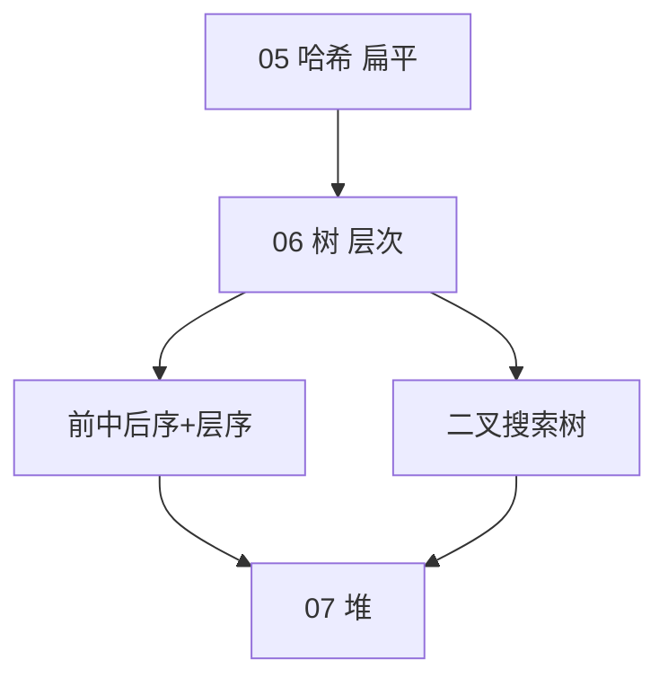
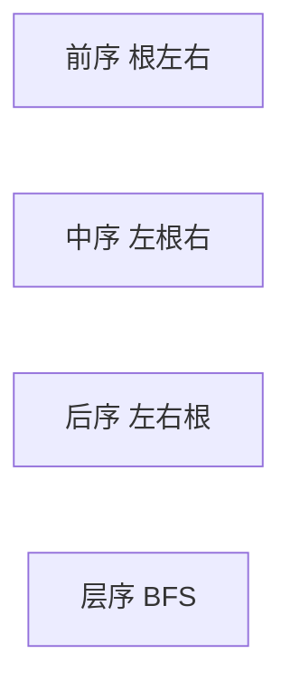

# 树与二叉树

> **文件编码**：UTF-8。代码示例默认 **Python 3**；递归与迭代遍历并重，对照三语言 [13 算法章](../Python/13-算法与数据结构基础.md)。

---

## 本章与上一章的关系

| 上一章（[05 哈希表](05-哈希表.md)） | 本章（06） | 下一章（[07 堆与优先队列](07-堆与优先队列.md)） |
|-----------------------------------|------------|-----------------------------------------------|
| 扁平 key→value，O(1) 查找 | **层次**父子关系 | 完全二叉树上的堆 |
| 无序（dict）或弱有序 | BST 中序有序 | 动态最值、TopK |
| 空间换时间 | 递归分解子问题 | 数组存完全二叉树 |

[05 哈希表](05-哈希表.md) 擅长「有没有、频次多少」；树擅长「**层级、前缀、有序范围**」——菜单、评论楼、组织架构、数据库索引（B/B+ 树）都是树思想。



| 模块 | 链接 |
|------|------|
| 原理 + 遍历实现 | **本章** |
| Python 模板 | [Python 13 §8](../Python/13-算法与数据结构基础.md) |
| Java 模板 | [Java 13](../Java/13-算法与数据结构基础.md) |
| C++ 模板 | [C++ 13](../C++/13-算法与数据结构C++实现.md) |
| BFS 队列 | [04-栈与队列](04-栈与队列.md) |

---

## 1. 树的基本概念

### 1.1 定义

**树（Tree）** =  n (n≥0) 个结点组成的有限集合，有且仅有一个**根**，其余结点分成互不相交的**子树**。

| 术语 | 含义 |
|------|------|
| 根 root | 无父结点 |
| 父/子 parent/child | 直接相连 |
| 叶子 leaf | 度为 0 的结点 |
| 深度 depth | 根到该结点边数（或层数，约定见题） |
| 高度 height | 结点到最远叶子 |
| 度 degree | 子结点个数 |

```text
        A  ← 根，深度 0
       / \
      B   C  ← 深度 1
     /   / \
    D   E   F  ← 叶子 D,E,F
```

### 1.2 二叉树

每个结点**最多**两个子结点：左孩子、右孩子。

```text
        3
       / \
      9   20
         /  \
        15   7
```

**特殊二叉树**：

| 类型 | 性质 |
|------|------|
| 满二叉树 | 每层都满 |
| 完全二叉树 | 除最后一层外满，最后一层从左连续 |
| 平衡二叉树 | 左右子树高度差 ≤ 1（AVL 定义） |
| **BST** | 左 < 根 < 右（中序递增） |

---

## 2. 存储结构

### 2.1 链式（面试默认）

```python
class TreeNode:
    def __init__(
        self,
        val: int = 0,
        left: "TreeNode | None" = None,
        right: "TreeNode | None" = None,
    ) -> None:
        self.val = val
        self.left = left
        self.right = right
```

### 2.2 顺序（堆用，见 07 章）

完全二叉树用数组：`parent(i)=(i-1)//2`，`left(i)=2*i+1`，`right(i)=2*i+2`。

```text
数组: [3, 9, 20, null, null, 15, 7]
索引:  0  1  2    -    -   3   4
        3
       / \
      9  20
        /  \
      15   7
```

---

## 3. 遍历（DFS）

### 3.1 四种顺序

| 遍历 | 顺序 | 记忆 |
|------|------|------|
| 前序 | 根 → 左 → 右 | 复制树常用 |
| **中序** | 左 → 根 → 右 | **BST 得有序序列** |
| 后序 | 左 → 右 → 根 | 删树、算高度 |
| 层序 | 逐层从左到右 | BFS，用队列 |



### 3.2 递归模板

```python
def preorder(root: TreeNode | None) -> list[int]:
    if not root:
        return []
    return [root.val] + preorder(root.left) + preorder(root.right)


def inorder(root: TreeNode | None) -> list[int]:
    if not root:
        return []
    return inorder(root.left) + [root.val] + inorder(root.right)


def postorder(root: TreeNode | None) -> list[int]:
    if not root:
        return []
    return postorder(root.left) + postorder(root.right) + [root.val]
```

### 3.3 迭代：前序（栈）

```python
def preorder_iter(root: TreeNode | None) -> list[int]:
    if not root:
        return []
    stack: list[TreeNode] = [root]
    ans: list[int] = []
    while stack:
        node = stack.pop()
        ans.append(node.val)
        if node.right:
            stack.append(node.right)
        if node.left:
            stack.append(node.left)
    return ans
```

### 3.4 迭代：中序（栈）

```python
def inorder_iter(root: TreeNode | None) -> list[int]:
    stack: list[TreeNode] = []
    cur = root
    ans: list[int] = []
    while cur or stack:
        while cur:
            stack.append(cur)
            cur = cur.left
        cur = stack.pop()
        ans.append(cur.val)
        cur = cur.right
    return ans
```

### 3.5 层序遍历（LeetCode 102）

```python
from collections import deque

def level_order(root: TreeNode | None) -> list[list[int]]:
    if not root:
        return []
    q: deque[TreeNode] = deque([root])
    ans: list[list[int]] = []
    while q:
        level: list[int] = []
        for _ in range(len(q)):
            node = q.popleft()
            level.append(node.val)
            if node.left:
                q.append(node.left)
            if node.right:
                q.append(node.right)
        ans.append(level)
    return ans
```

---

## 4. 二叉搜索树（BST）

### 4.1 性质

- 左子树所有值 < 根 < 右子树所有值
- 中序遍历**严格递增**（若无重复；重复处理见题意）
- 查找、插入平均 O(log n)，最坏 O(n)（退化成链）

### 4.2 BST 查找

```python
def search_bst(root: TreeNode | None, val: int) -> TreeNode | None:
    cur = root
    while cur:
        if val == cur.val:
            return cur
        if val < cur.val:
            cur = cur.left
        else:
            cur = cur.right
    return None
```

### 4.3 BST 插入

```python
def insert_bst(root: TreeNode | None, val: int) -> TreeNode:
    if not root:
        return TreeNode(val)
    cur = root
    while True:
        if val < cur.val:
            if not cur.left:
                cur.left = TreeNode(val)
                break
            cur = cur.left
        else:
            if not cur.right:
                cur.right = TreeNode(val)
                break
            cur = cur.right
    return root
```

### 4.4 有序数组转 BST（LeetCode 108）

```python
def sorted_array_to_bst(nums: list[int]) -> TreeNode | None:
    def build(lo: int, hi: int) -> TreeNode | None:
        if lo > hi:
            return None
        mid = (lo + hi) // 2
        node = TreeNode(nums[mid])
        node.left = build(lo, mid - 1)
        node.right = build(mid + 1, hi)
        return node

    return build(0, len(nums) - 1)
```

### 4.5 验证 BST（LeetCode 98）

```python
def is_valid_bst(root: TreeNode | None) -> bool:
    def dfs(node: TreeNode | None, lo: float, hi: float) -> bool:
        if not node:
            return True
        if not (lo < node.val < hi):
            return False
        return dfs(node.left, lo, node.val) and dfs(node.right, node.val, hi)

    return dfs(root, float("-inf"), float("inf"))
```

---

## 5. 经典题型

### 5.1 最大深度（LeetCode 104）

```python
def max_depth(root: TreeNode | None) -> int:
    if not root:
        return 0
    return 1 + max(max_depth(root.left), max_depth(root.right))
```

### 5.2 翻转二叉树（LeetCode 226）

```python
def invert_tree(root: TreeNode | None) -> TreeNode | None:
    if not root:
        return None
    root.left, root.right = invert_tree(root.right), invert_tree(root.left)
    return root
```

### 5.3 对称二叉树（LeetCode 101）

```python
def is_symmetric(root: TreeNode | None) -> bool:
    def mirror(a: TreeNode | None, b: TreeNode | None) -> bool:
        if not a and not b:
            return True
        if not a or not b or a.val != b.val:
            return False
        return mirror(a.left, b.right) and mirror(a.right, b.left)

    return mirror(root, root)
```

### 5.4 最近公共祖先（LeetCode 236）

```python
def lowest_common_ancestor(
    root: TreeNode | None, p: TreeNode, q: TreeNode
) -> TreeNode | None:
    if not root or root is p or root is q:
        return root
    left = lowest_common_ancestor(root.left, p, q)
    right = lowest_common_ancestor(root.right, p, q)
    if left and right:
        return root
    return left or right
```

### 5.5 二叉树右视图（LeetCode 199）

```python
def right_side_view(root: TreeNode | None) -> list[int]:
    if not root:
        return []
    q: deque[TreeNode] = deque([root])
    ans: list[int] = []
    while q:
        size = len(q)
        for i in range(size):
            node = q.popleft()
            if i == size - 1:
                ans.append(node.val)
            if node.left:
                q.append(node.left)
            if node.right:
                q.append(node.right)
    return ans
```

### 5.6 路径总和（LeetCode 112）

```python
def has_path_sum(root: TreeNode | None, target: int) -> bool:
    if not root:
        return False
    if not root.left and not root.right:
        return root.val == target
    remain = target - root.val
    return has_path_sum(root.left, remain) or has_path_sum(root.right, remain)
```

---

## 6. 复杂度总表

| 操作 | 普通二叉树 | BST 平均 | BST 最坏 |
|------|------------|----------|----------|
| 查找 | O(n) | O(log n) | O(n) |
| 插入 | — | O(log n) | O(n) |
| 遍历 | O(n) | O(n) | O(n) |
| 空间（递归） | O(h) 栈深 | O(log n) | O(n) |

| 遍历方式 | 时间 | 辅助空间 |
|----------|------|----------|
| 递归 DFS | O(n) | O(h) |
| 迭代+栈 | O(n) | O(h) |
| BFS 层序 | O(n) | O(w) 最大宽度 |

---

## 7. 后端映射

| 场景 | 树结构 |
|------|--------|
| MySQL InnoDB | **B+ 树**索引（多叉，叶子链表） |
| 文件系统 | 目录树 |
| DOM / JSON | 嵌套树遍历 |
| 权限菜单 | 多叉树，DFS/BFS 渲染 |
| 表达式 | 语法树（前序/后序） |

B+ 树细节见 [Java 06](../Java/06-MySQL与数据库基础.md) / [Python 06](../Python/06-MySQL与数据库基础.md)。

---

## 8. LeetCode 精选（带题号链接）

| 题号 | 题目 | 难度 | 考点 | 链接 |
|------|------|------|------|------|
| 94 | 二叉树中序遍历 | E | 迭代栈 | https://leetcode.cn/problems/binary-tree-inorder-traversal/ |
| 104 | 最大深度 | E | 递归 | https://leetcode.cn/problems/maximum-depth-of-binary-tree/ |
| 100 | 相同的树 | E | DFS | https://leetcode.cn/problems/same-tree/ |
| 101 | 对称二叉树 | E | 镜像 DFS | https://leetcode.cn/problems/symmetric-tree/ |
| 226 | 翻转二叉树 | E | 递归交换 | https://leetcode.cn/problems/invert-binary-tree/ |
| 108 | 有序数组转 BST | E | 分治 | https://leetcode.cn/problems/convert-sorted-array-to-binary-search-tree/ |
| 110 | 平衡二叉树 | E | 后序高度 | https://leetcode.cn/problems/balanced-binary-tree/ |
| 102 | 层序遍历 | M | BFS | https://leetcode.cn/problems/binary-tree-level-order-traversal/ |
| 98 | 验证 BST | M | 范围约束 | https://leetcode.cn/problems/validate-binary-search-tree/ |
| 199 | 右视图 | M | 层序 | https://leetcode.cn/problems/binary-tree-right-side-view/ |
| 236 | 最近公共祖先 | M | 分治 | https://leetcode.cn/problems/lowest-common-ancestor-of-a-binary-tree/ |
| 124 | 最大路径和 | H | 后序+全局 max | https://leetcode.cn/problems/binary-tree-maximum-path-sum/ |

与 [Python 13 §12.6](../Python/13-算法与数据结构基础.md) 题 **47～58** 对齐。

---

## 9. 常见报错 / 易错点（逻辑向）

| # | 易错场景 | 错误写法 / 思路 | 正确做法 |
|---|----------|-----------------|----------|
| 1 | 空树 | 未判 `if not root` | 递归/迭代入口先判空 |
| 2 | 单子结点 | 把单子当叶子处理路径题 | 无左右才是叶子 |
| 3 | 验证 BST | 只比直接子结点大小 | 传递 `(lo, hi)` 区间 |
| 4 | 验证 BST | 用中序后只比相邻 | 需严格递增，相等看题意 |
| 5 | LCA | 未理解「分治返回值」 | 左右各找到则当前为 LCA |
| 6 | 层序遍历 | 不固定层界 | `for _ in range(len(q))` |
| 7 | 迭代前序 | 先压左再压右 | 栈先右后左，弹出先左 |
| 8 | 最大路径和 | 把拐弯路径当单边返回 | 返回单边 max；全局另算 |
| 9 | BST 删除 | 只删叶子 | 两子情况用后继替换（进阶） |
| 10 | 深度定义 | 边数 vs 结数混用 | 看题目定义，统一 +1 规则 |

---

## 10. 练习建议

### 10.1 基础（1～2 周）

1. 默写四种遍历（递归版）
2. 完成 **94、104、226、102**
3. 纸笔画遍历顺序：对示例树写前中后序结果

### 10.2 进阶（1 周）

4. **98、101、236、199**
5. 迭代实现中序、后序（102 层序已会）
6. 口述：BST 与哈希查找的场景取舍

### 10.3 挑战

7. **124** 最大路径和
8. 实现 BST 删除结点（LeetCode 450）

---

## 11. 分级参考答案

### 练习 A（Easy）：平衡二叉树（110）

```python
def is_balanced(root: TreeNode | None) -> bool:
    def height(node: TreeNode | None) -> int:
        if not node:
            return 0
        lh = height(node.left)
        if lh == -1:
            return -1
        rh = height(node.right)
        if rh == -1:
            return -1
        if abs(lh - rh) > 1:
            return -1
        return 1 + max(lh, rh)

    return height(root) != -1
```

### 练习 B（Medium）：从前序与中序构造（105）

```python
def build_tree(preorder: list[int], inorder: list[int]) -> TreeNode | None:
    index = {v: i for i, v in enumerate(inorder)}

    def dfs(pl: int, pr: int, il: int, ir: int) -> TreeNode | None:
        if pl > pr:
            return None
        root_val = preorder[pl]
        k = index[root_val]
        left_size = k - il
        root = TreeNode(root_val)
        root.left = dfs(pl + 1, pl + left_size, il, k - 1)
        root.right = dfs(pl + left_size + 1, pr, k + 1, ir)
        return root

    return dfs(0, len(preorder) - 1, 0, len(inorder) - 1)
```

### 练习 C（Medium）：展开为链表（114）

```python
def flatten(root: TreeNode | None) -> None:
    cur = root
    while cur:
        if cur.left:
            pre = cur.left
            while pre.right:
                pre = pre.right
            pre.right = cur.right
            cur.right = cur.left
            cur.left = None
        cur = cur.right
```

### 练习 D（Hard）：最大路径和（124）

```python
def max_path_sum(root: TreeNode | None) -> int:
    best = float("-inf")

    def gain(node: TreeNode | None) -> int:
        nonlocal best
        if not node:
            return 0
        left = max(gain(node.left), 0)
        right = max(gain(node.right), 0)
        best = max(best, node.val + left + right)
        return node.val + max(left, right)

    gain(root)
    return int(best)
```

---

## 12. 学完标准

- [ ] 能画二叉树并手写前中后序、层序结果
- [ ] 闭卷写递归 + 迭代中序、层序 BFS
- [ ] 理解 BST 性质，会验证 BST（98）
- [ ] 独立完成 **102、98、236、226** 四题
- [ ] 知道树高 O(h) 对递归栈空间的影响
- [ ] 能口述 B+ 树与二叉 BST 的面试区别（概念级）
- [ ] 25 分钟内手撕最大深度 + 层序遍历

---

## 13. 下一章预告

[07 堆与优先队列](07-堆与优先队列.md) 在**完全二叉树**上维护「父不大于子」（小根堆）或反之，实现 O(log n) 插入删除、O(1) 取最值；用于 TopK、合并 K 路有序流、Dijkstra 优化。

---

## 14. 交叉引用

| 类型 | 链接 |
|------|------|
| 上一章 | [05-哈希表](05-哈希表.md) |
| 下一章 | [07-堆与优先队列](07-堆与优先队列.md) |
| 路线图 | [00-学习路线图与说明](00-学习路线图与说明.md) |
| Python 刷题 | [Python 13](../Python/13-算法与数据结构基础.md) |
| Java 刷题 | [Java 13](../Java/13-算法与数据结构基础.md) |
| C++ 刷题 | [C++ 13](../C++/13-算法与数据结构C++实现.md) |
| 相关 | [04-栈与队列](04-栈与队列.md)、[08-图论基础](08-图论基础.md) |

---

*上一章：[05-哈希表](05-哈希表.md) · 下一章：[07-堆与优先队列](07-堆与优先队列.md)*
