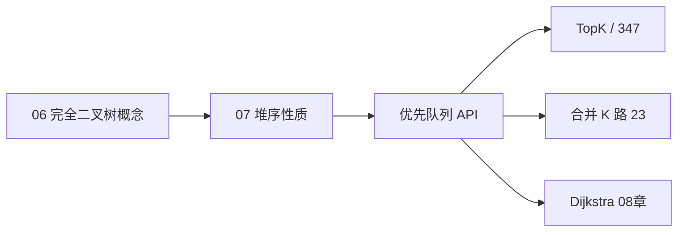

# 堆与优先队列

> **文件编码**：UTF-8。代码示例默认 **Python 3**；手写堆 + `heapq` 标准库，对照三语言 [13 算法章](../Python/13-算法与数据结构基础.md)。

---

## 本章与上一章的关系

| 上一章（[06 树与二叉树](06-树与二叉树.md)） | 本章（07） | 下一章（[08 图论基础](08-图论基础.md)） |
|-------------------------------------------|------------|---------------------------------------|
| 一般二叉树、BST、遍历 | **完全二叉树**上的堆 | 多结点关系、带权边 |
| 查找最值需 O(n) 或 BST O(log n) | **O(1) 取极值、O(log n) 增删** | 优先队列优化 Dijkstra |
| 链式存储为主 | **数组**存完全二叉树 | BFS 队列 + 堆 |

[06 树与二叉树](06-树与二叉树.md) 讲通用树；堆是满足**堆序性质**的完全二叉树，用数组下标联系父子——工程里任务调度、TopK、定时器、事件循环都靠它。



| 模块 | 链接 |
|------|------|
| 原理 + 手写堆 | **本章** |
| Python `heapq` | [Python 13 §11](../Python/13-算法与数据结构基础.md) |
| Java `PriorityQueue` | [Java 13](../Java/13-算法与数据结构基础.md) |
| C++ `priority_queue` | [C++ 13](../C++/13-算法与数据结构C++实现.md) |
| 树基础 | [06-树与二叉树](06-树与二叉树.md) |

---

## 1. 堆的定义

### 1.1 堆序性质

- **小根堆（min-heap）**：任意结点 ≤ 其子结点 → 根最小
- **大根堆（max-heap）**：任意结点 ≥ 其子结点 → 根最大

### 1.2 完全二叉树

除最后一层外填满，最后一层从左到右连续——可用**数组**无空位存储。

```text
小根堆示例（数组下标）:
        1(0)
       /    \
     3(1)    2(2)
    /  \    /
  7(3) 5(4) 4(5)

数组: [1, 3, 2, 7, 5, 4]

下标关系（0-based）:
  parent(i)   = (i - 1) // 2
  left(i)     = 2 * i + 1
  right(i)    = 2 * i + 2
```

### 1.3 堆 vs BST

| 对比 | BST | 堆 |
|------|-----|-----|
| 有序性 | 中序全序 | 只保证父子大小 |
| 找最值 | O(log n) 走边 | **O(1)** 看根 |
| 任意查找 | O(log n) | 不支持高效任意查 |
| 典型用途 | 有序集合 | TopK、调度 |

---

## 2. 核心操作

| 操作 | 时间 | 说明 |
|------|------|------|
| `peek` / `top` | O(1) | 看堆顶 |
| `push` | O(log n) | 末尾插入 + **上浮 sift-up** |
| `pop` | O(log n) | 根与末尾交换 + **下沉 sift-down** |
| `heapify` 建堆 | O(n) | 从最后一个非叶结点向下沉 |

### 2.1 上浮（sift-up）

```text
push 8 到末尾 → 与父比，若更小则交换，直到根或满足堆序
```

### 2.2 下沉（sift-down）

```text
pop：把末尾放到根 → 与较小子交换（小根堆），直到叶子或满足堆序
```

---

## 3. 手写小根堆

```python
class MinHeap:
    """教育用数组小根堆。"""

    def __init__(self) -> None:
        self._data: list[int] = []

    def __len__(self) -> int:
        return len(self._data)

    def peek(self) -> int:
        if not self._data:
            raise IndexError("peek empty heap")
        return self._data[0]

    def push(self, x: int) -> None:
        self._data.append(x)
        self._sift_up(len(self._data) - 1)

    def pop(self) -> int:
        if not self._data:
            raise IndexError("pop empty heap")
        self._data[0], self._data[-1] = self._data[-1], self._data[0]
        val = self._data.pop()
        if self._data:
            self._sift_down(0)
        return val

    def _parent(self, i: int) -> int:
        return (i - 1) // 2

    def _left(self, i: int) -> int:
        return 2 * i + 1

    def _right(self, i: int) -> int:
        return 2 * i + 2

    def _sift_up(self, i: int) -> None:
        while i > 0:
            p = self._parent(i)
            if self._data[i] >= self._data[p]:
                break
            self._data[i], self._data[p] = self._data[p], self._data[i]
            i = p

    def _sift_down(self, i: int) -> None:
        n = len(self._data)
        while True:
            l, r = self._left(i), self._right(i)
            smallest = i
            if l < n and self._data[l] < self._data[smallest]:
                smallest = l
            if r < n and self._data[r] < self._data[smallest]:
                smallest = r
            if smallest == i:
                break
            self._data[i], self._data[smallest] = self._data[smallest], self._data[i]
            i = smallest

    @classmethod
    def heapify(cls, arr: list[int]) -> "MinHeap":
        h = cls()
        h._data = arr[:]
        for i in range(len(h._data) // 2 - 1, -1, -1):
            h._sift_down(i)
        return h
```

---

## 4. Python heapq 模块

**默认小根堆**。大根堆技巧：存 `-x`。

```python
import heapq

heap: list[int] = []
heapq.heappush(heap, 3)
heapq.heappush(heap, 1)
top = heap[0]       # 1，不弹出
x = heapq.heappop(heap)  # 1

# 原地建堆 O(n)
nums = [3, 1, 4, 1, 5]
heapq.heapify(nums)

# 大根堆
heapq.heappush(heap, -10)
largest = -heapq.heappop(heap)
```

### 4.1 合并 K 个升序链表（LeetCode 23）

```python
import heapq
from typing import Optional

class ListNode:
    def __init__(self, val: int = 0, next: "ListNode | None" = None):
        self.val = val
        self.next = next


def merge_k_lists(lists: list[Optional[ListNode]]) -> Optional[ListNode]:
    heap: list[tuple[int, int, ListNode]] = []
    for i, node in enumerate(lists):
        if node:
            heapq.heappush(heap, (node.val, i, node))
    dummy = ListNode(0)
    cur = dummy
    while heap:
        _, i, node = heapq.heappop(heap)
        cur.next = node
        cur = cur.next
        if node.next:
            heapq.heappush(heap, (node.next.val, i, node.next))
    return dummy.next
```

**注意**：`node` 不可比较时，用 `(val, index, node)` 打破平局。

---

## 5. TopK 问题

### 5.1 前 K 个高频元素（LeetCode 347）

**小根堆维护 K 个**，频次更大则替换堆顶。

```python
import heapq
from collections import Counter

def top_k_frequent(nums: list[int], k: int) -> list[int]:
    cnt = Counter(nums)
    heap: list[tuple[int, int]] = []
    for num, freq in cnt.items():
        heapq.heappush(heap, (freq, num))
        if len(heap) > k:
            heapq.heappop(heap)
    return [num for _, num in heap]
```

### 5.2 数组中第 K 个最大元素（LeetCode 215）

```python
import heapq

def find_kth_largest(nums: list[int], k: int) -> int:
    # 维护大小为 k 的小根堆 → 堆顶是第 k 大
    heap = nums[:k]
    heapq.heapify(heap)
    for x in nums[k:]:
        if x > heap[0]:
            heapq.heapreplace(heap, x)
    return heap[0]
```

### 5.3 桶排序 O(n) 变体（347）

```python
from collections import Counter

def top_k_frequent_bucket(nums: list[int], k: int) -> list[int]:
    cnt = Counter(nums)
    buckets: list[list[int]] = [[] for _ in range(len(nums) + 1)]
    for num, f in cnt.items():
        buckets[f].append(num)
    ans: list[int] = []
    for f in range(len(buckets) - 1, 0, -1):
        for num in buckets[f]:
            ans.append(num)
            if len(ans) == k:
                return ans
    return ans
```

---

## 6. 优先队列抽象

**优先队列** = 按优先级出队的 ADT；**二叉堆**是最常见实现。

```python
import heapq
from dataclasses import dataclass, field
from typing import Any


@dataclass(order=True)
class PrioritizedItem:
    priority: int
    item: Any = field(compare=False)


class PriorityQueue:
    def __init__(self) -> None:
        self._heap: list[PrioritizedItem] = []

    def push(self, priority: int, item: Any) -> None:
        heapq.heappush(self._heap, PrioritizedItem(priority, item))

    def pop(self) -> Any:
        return heapq.heappop(self._heap).item

    def empty(self) -> bool:
        return not self._heap
```

后端场景：定时任务（最近 deadline 先执行）、限流窗口、Dijkstra 中「当前距离最小」结点。

---

## 7. 更多经典题

### 7.1 数据流的中位数（LeetCode 295）

对顶堆：大根堆存较小一半，小根堆存较大一半。

```python
import heapq

class MedianFinder:
    def __init__(self) -> None:
        self.small: list[int] = []  # 大根堆，存负数
        self.large: list[int] = []  # 小根堆

    def add_num(self, num: int) -> None:
        heapq.heappush(self.small, -num)
        heapq.heappush(self.large, -heapq.heappop(self.small))
        if len(self.large) > len(self.small):
            heapq.heappush(self.small, -heapq.heappop(self.large))

    def find_median(self) -> float:
        if len(self.small) > len(self.large):
            return float(-self.small[0])
        return (-self.small[0] + self.large[0]) / 2.0
```

### 7.2 滑动窗口中位数（LeetCode 480）— 思路

在 295 基础上支持删除：惰性删除 + 哈希记待删计数（进阶）。

### 7.3 重构字符串（LeetCode 767）

每次取剩余频次最大的两个字符，用大根堆。

```python
import heapq
from collections import Counter

def reorganize_string(s: str) -> str:
    cnt = Counter(s)
    heap = [(-freq, ch) for ch, freq in cnt.items()]
    heapq.heapify(heap)
    ans: list[str] = []
    prev_freq, prev_ch = 0, ""
    while heap:
        freq, ch = heapq.heappop(heap)
        ans.append(ch)
        if prev_freq < 0:
            heapq.heappush(heap, (prev_freq, prev_ch))
        prev_freq, prev_ch = freq + 1, ch
    return "".join(ans) if len(ans) == len(s) else ""
```

---

## 8. heapify 为何是 O(n)

直觉：大多数结点靠近底部，下沉路径短；数学上 Σ 高度层结点数 = O(n)。

| 方法 | 复杂度 |
|------|--------|
| 逐个 push n 次 | O(n log n) |
| 从 `n//2-1`  downto 0 下沉 | **O(n)** |

---

## 9. 复杂度总表

| 操作 | 二叉堆 | 二叉搜索树 |
|------|--------|------------|
| 插入 | O(log n) | O(log n) 均摊 |
| 删除极值 | O(log n) | O(log n) |
| 查极值 | O(1) | O(log n) |
| 建堆 | O(n) | — |
| TopK（n 个取 k） | O(n log k) | — |

| 题号 | 时间 | 空间 |
|------|------|------|
| 215 第 K 大 | O(n log k) | O(k) |
| 347 TopK 频 | O(n log k) | O(n) |
| 23 合并 K 链表 | O(N log k) | O(k) |
| 295 中位数 | add O(log n) | O(n) |

---

## 10. 后端映射

| 场景 | 堆的作用 |
|------|----------|
| 任务调度 | 最近 deadline 先执行 |
| TopK 监控 | 最大延迟、最大 QPS |
| 限流 | 时间窗口内事件排序 |
| Dijkstra | 选当前距离最小结点（见 08 章） |
| Python `asyncio` | 定时器用堆管理 |

---

## 11. LeetCode 精选（带题号链接）

| 题号 | 题目 | 难度 | 考点 | 链接 |
|------|------|------|------|------|
| 215 | 数组第 K 个最大 | M | 大小 k 小根堆 | https://leetcode.cn/problems/kth-largest-element-in-an-array/ |
| 347 | 前 K 高频元素 | M | 频次 + 堆 | https://leetcode.cn/problems/top-k-frequent-elements/ |
| 23 | 合并 K 升序链表 | H | 多路归并堆 | https://leetcode.cn/problems/merge-k-sorted-lists/ |
| 703 | 数据流第 K 大 | E | 固定大小堆 | https://leetcode.cn/problems/kth-largest-element-in-a-stream/ |
| 295 | 数据流中位数 | H | 对顶堆 | https://leetcode.cn/problems/find-median-from-data-stream/ |
| 767 | 重构字符串 | M | 贪心 + 大根堆 | https://leetcode.cn/problems/reorganize-string/ |
| 378 | 有序矩阵第 K 小 | M | 多路归并 | https://leetcode.cn/problems/kth-smallest-element-in-a-sorted-matrix/ |
| 973 | 最接近原点的 K 点 | M | 堆或快选 | https://leetcode.cn/problems/k-closest-points-to-origin/ |
| 502 | IPO | H | 双堆贪心 | https://leetcode.cn/problems/ipo/ |
| 632 | 最小区间 | H | 多指针 + 堆 | https://leetcode.cn/problems/smallest-range-covering-elements-from-k-lists/ |

与 [Python 13](../Python/13-算法与数据结构基础.md) 题 **25、37、64** 及堆相关题对齐。

---

## 12. 常见报错 / 易错点（逻辑向）

| # | 易错场景 | 错误写法 / 思路 | 正确做法 |
|---|----------|-----------------|----------|
| 1 | 大根堆 | 直接 `heappush` 原值 | Python 存 `-x` 或自定义比较 |
| 2 | TopK | 用大根堆存 K 个求第 K 大 | 第 K **大**用**小**根堆 size=k |
| 3 | 合并 K 路 | `(val, node)` 平局比较 node | 加 `index` 打破平局 |
| 4 | heapify | 从 0 向上浮 | 从 `n//2-1` **向下沉** |
| 5 | pop 空堆 | 不判空 | 先 `if not heap` |
| 6 | 下标父子 | 1-based 与 0-based 混用 | 统一 0-based 公式 |
| 7 | 第 K 大 vs 第 K 小 | k 与 n-k+1 混淆 | 明确排序方向 |
| 8 | 中位数对顶堆 | 两堆大小差不维护 | push 后均衡，large 可多 1 |
| 9 | 频次 TopK | 堆存 num 而非 freq | 以 freq 为优先级 |
| 10 | O(n) 建堆 | 误以为必须 n 次 push | `heapify` 是 O(n) |

---

## 13. 练习建议

### 13.1 基础（1 周）

1. 手写 `MinHeap`：`push/pop/heapify`，对 `[4,1,7,3,8,2]` 逐步画图
2. 完成 **703、215、347**
3. 熟记 `heapq` API 与大根堆取反技巧

### 13.2 进阶（1 周）

4. **23、973、767**
5. 实现 `MedianFinder`（295）
6. 对比快选（QuickSelect）与堆解 215 的复杂度

### 13.3 挑战

7. **295、632、502**
8. 分析 `heapify` O(n) 证明（口述即可）

---

## 14. 分级参考答案

### 练习 A（Easy）：数据流第 K 大（703）

```python
import heapq

class KthLargest:
    def __init__(self, k: int, nums: list[int]) -> None:
        self.k = k
        self.heap = nums
        heapq.heapify(self.heap)
        while len(self.heap) > k:
            heapq.heappop(self.heap)

    def add(self, val: int) -> int:
        heapq.heappush(self.heap, val)
        if len(self.heap) > self.k:
            heapq.heappop(self.heap)
        return self.heap[0]
```

### 练习 B（Medium）：最接近原点的 K 点（973）

```python
import heapq

def k_closest(points: list[list[int]], k: int) -> list[list[int]]:
    heap: list[tuple[int, int, int]] = []
    for x, y in points:
        d = x * x + y * y
        heapq.heappush(heap, (-d, x, y))
        if len(heap) > k:
            heapq.heappop(heap)
    return [[x, y] for _, x, y in heap]
```

### 练习 C（Medium）：有序矩阵第 K 小（378）

```python
import heapq

def kth_smallest(matrix: list[list[int]], k: int) -> int:
    n = len(matrix)
    heap = [(matrix[i][0], i, 0) for i in range(n)]
    heapq.heapify(heap)
    for _ in range(k - 1):
        val, r, c = heapq.heappop(heap)
        if c + 1 < n:
            heapq.heappush(heap, (matrix[r][c + 1], r, c + 1))
    return heapq.heappop(heap)[0]
```

### 练习 D（Hard）：合并 K 链表 — 分治备选 O(N log k)

```python
def merge_k_lists_divide(lists: list[Optional[ListNode]]) -> Optional[ListNode]:
    if not lists:
        return None
    if len(lists) == 1:
        return lists[0]

    def merge_two(a: Optional[ListNode], b: Optional[ListNode]) -> Optional[ListNode]:
        dummy = ListNode(0)
        cur = dummy
        while a and b:
            if a.val <= b.val:
                cur.next, a = a, a.next
            else:
                cur.next, b = b, b.next
            cur = cur.next
        cur.next = a or b
        return dummy.next

    mid = len(lists) // 2
    left = merge_k_lists_divide(lists[:mid])
    right = merge_k_lists_divide(lists[mid:])
    return merge_two(left, right)
```

---

## 15. 学完标准

- [ ] 能画小根堆数组存储与父子下标关系
- [ ] 闭卷手写 `push/pop/sift_up/sift_down/heapify`
- [ ] 熟练使用 `heapq`，掌握大根堆取反
- [ ] 独立完成 **215、347、23** 三题
- [ ] 理解 TopK 用「大小为 k 的小根堆」的原因
- [ ] 知道 heapify O(n) 与 n 次 push 的区别
- [ ] 能口述堆在 Dijkstra / 任务调度中的应用（衔接 08 章）

---

## 16. 下一章预告

[08 图论基础](08-图论基础.md) 把「结点 + 边」组成网：邻接表/矩阵、BFS 最短步数、DFS 连通分量、拓扑排序与 Dijkstra 入门——服务依赖图、路由、课程表都从这里开始。

---

## 17. 交叉引用

| 类型 | 链接 |
|------|------|
| 上一章 | [06-树与二叉树](06-树与二叉树.md) |
| 下一章 | [08-图论基础](08-图论基础.md) |
| 路线图 | [00-学习路线图与说明](00-学习路线图与说明.md) |
| Python 刷题 | [Python 13](../Python/13-算法与数据结构基础.md) |
| Java 刷题 | [Java 13](../Java/13-算法与数据结构基础.md) |
| C++ 刷题 | [C++ 13](../C++/13-算法与数据结构C++实现.md) |
| 相关 | [05-哈希表](05-哈希表.md)（347 桶排序）、[09-排序与查找](09-排序与查找算法.md) |

---

*上一章：[06-树与二叉树](06-树与二叉树.md) · 下一章：[08-图论基础](08-图论基础.md)*
