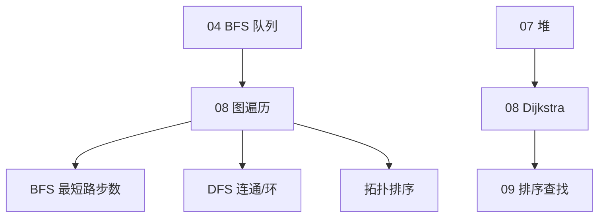

# 图论基础

> **文件编码**：UTF-8。代码示例默认 **Python 3**；BFS/DFS/拓扑/Dijkstra 入门，对照三语言 [13 算法章](../Python/13-算法与数据结构基础.md)。

---

## 本章与上一章的关系

| 上一章（[07 堆与优先队列](07-堆与优先队列.md)） | 本章（08） | 下一章（[09 排序与查找算法](09-排序与查找算法.md)） |
|-----------------------------------------------|------------|---------------------------------------------------|
| 完全二叉树、单源「当前最小」 | **多结点 + 边** 的网状关系 | 线性序列上的排序与二分 |
| 优先队列优化最短路 | BFS 无权最短路、Dijkstra 带权 | 有序数组上的查找 |
| 数组存树 | 邻接表/矩阵存图 | 分治与有序性 |

[07 堆与优先队列](07-堆与优先队列.md) 的优先队列将在 **Dijkstra** 中登场；[04 栈与队列](04-栈与队列.md) 的 **BFS 队列** 是图遍历基本功。图论把「树」推广为可有环、可有多个连通分量的结构。



| 模块 | 链接 |
|------|------|
| 原理 + 图算法 | **本章** |
| Python 模板 | [Python 13](../Python/13-算法与数据结构基础.md) |
| Java 模板 | [Java 13](../Java/13-算法与数据结构基础.md) |
| C++ 模板 | [C++ 13](../C++/13-算法与数据结构C++实现.md) |
| BFS 基础 | [04-栈与队列](04-栈与队列.md) |

---

## 1. 图的基本概念

### 1.1 定义

**图 G = (V, E)**：顶点集 V + 边集 E。

| 术语 | 含义 |
|------|------|
| 有向图 | 边有方向 u→v |
| 无向图 | 边无方向，常存双向 |
| 带权图 | 边有权值（距离、成本） |
| 度 degree | 与结点相连的边数 |
| 路径 | 顶点序列，相邻有边 |
| 环 cycle | 起点=终点且长≥1 的路径 |
| 连通 | 无向图中任意两点有路径 |
| DAG | 有向无环图 |

```text
无向带权图示例:

    (0)---4---(1)
     |         |
     8         2
     |         |
    (2)---1---(3)
```

### 1.2 稀疏 vs 稠密

| 类型 | 边数规模 | 存储偏好 |
|------|----------|----------|
| 稀疏 | E ≈ O(V) | **邻接表** |
| 稠密 | E ≈ O(V²) | 邻接矩阵 |

---

## 2. 图的存储

### 2.1 邻接矩阵

`graph[i][j] = weight`，无向对称；不存在边用 `inf` 或 0。

```python
INF = 10**9
# 4 个结点
matrix = [
    [0, 4, 8, INF],
    [4, 0, INF, 2],
    [8, INF, 0, 1],
    [INF, 2, 1, 0],
]
```

- 查边 O(1)，遍历邻居 O(V)
- 空间 O(V²)

### 2.2 邻接表（推荐）

```python
from collections import defaultdict
from typing import DefaultDict, List, Tuple

Graph = DefaultDict[int, List[Tuple[int, int]]]  # u -> [(v, weight), ...]


def build_graph(edges: list[list[int]], directed: bool = False) -> Graph:
    g: Graph = defaultdict(list)
    for u, v in edges:
        g[u].append((v, 1))
        if not directed:
            g[v].append((u, 1))
    return g


def build_weighted(edges: list[list[int]], directed: bool = False) -> Graph:
    g: Graph = defaultdict(list)
    for u, v, w in edges:
        g[u].append((v, w))
        if not directed:
            g[v].append((u, w))
    return g
```

- 空间 O(V + E)，遍历邻居 O(deg(u))

```text
邻接表:
0 → [1,4], [2,8]
1 → [0,4], [3,2]
2 → [0,8], [3,1]
3 → [1,2], [2,1]
```

---

## 3. BFS（广度优先搜索）

### 3.1 思想

从源点**一层层**扩展，用**队列**；无权图首次到达 = **最短边数**。

```text
BFS 从 0 出发（无权）:
层 0: [0]
层 1: [1, 2]
层 2: [3]
```

### 3.2 模板

```python
from collections import deque

def bfs(graph: Graph, start: int) -> dict[int, int]:
    dist = {start: 0}
    q: deque[int] = deque([start])
    while q:
        u = q.popleft()
        for v, _ in graph[u]:
            if v not in dist:
                dist[v] = dist[u] + 1
                q.append(v)
    return dist
```

### 3.3 网格 BFS（LeetCode 200 / 994）

```python
from collections import deque

def num_islands(grid: list[list[str]]) -> int:
    if not grid:
        return 0
    rows, cols = len(grid), len(grid[0])
    count = 0

    def bfs_cell(r: int, c: int) -> None:
        q: deque[tuple[int, int]] = deque([(r, c)])
        grid[r][c] = "0"
        while q:
            cr, cc = q.popleft()
            for dr, dc in ((1, 0), (-1, 0), (0, 1), (0, -1)):
                nr, nc = cr + dr, cc + dc
                if 0 <= nr < rows and 0 <= nc < cols and grid[nr][nc] == "1":
                    grid[nr][nc] = "0"
                    q.append((nr, nc))

    for r in range(rows):
        for c in range(cols):
            if grid[r][c] == "1":
                bfs_cell(r, c)
                count += 1
    return count
```

### 3.4 单词接龙（LeetCode 127）— BFS 最短变换

```python
from collections import deque

def ladder_length(begin: str, end: str, word_list: list[str]) -> int:
    word_set = set(word_list)
    if end not in word_set:
        return 0
    q: deque[tuple[str, int]] = deque([(begin, 1)])
    while q:
        word, steps = q.popleft()
        if word == end:
            return steps
        chars = list(word)
        for i in range(len(chars)):
            orig = chars[i]
            for code in range(ord("a"), ord("z") + 1):
                chars[i] = chr(code)
                nxt = "".join(chars)
                if nxt in word_set:
                    word_set.remove(nxt)
                    q.append((nxt, steps + 1))
            chars[i] = orig
    return 0
```

---

## 4. DFS（深度优先搜索）

### 4.1 思想

一路走到底再回溯；用**递归**或**显式栈**；适合连通分量、路径、环检测。

```python
def dfs(graph: Graph, start: int) -> set[int]:
    visited: set[int] = set()

    def go(u: int) -> None:
        visited.add(u)
        for v, _ in graph[u]:
            if v not in visited:
                go(v)

    go(start)
    return visited
```

### 4.2 迭代 DFS

```python
def dfs_iter(graph: Graph, start: int) -> list[int]:
    visited: set[int] = set()
    stack = [start]
    order: list[int] = []
    while stack:
        u = stack.pop()
        if u in visited:
            continue
        visited.add(u)
        order.append(u)
        for v, _ in reversed(graph[u]):
            if v not in visited:
                stack.append(v)
    return order
```

### 4.3 岛屿数量 DFS 版（LeetCode 200）

```python
def num_islands_dfs(grid: list[list[str]]) -> int:
    if not grid:
        return 0
    rows, cols = len(grid), len(grid[0])
    count = 0

    def dfs(r: int, c: int) -> None:
        if r < 0 or r >= rows or c < 0 or c >= cols or grid[r][c] != "1":
            return
        grid[r][c] = "0"
        dfs(r + 1, c)
        dfs(r - 1, c)
        dfs(r, c + 1)
        dfs(r, c - 1)

    for r in range(rows):
        for c in range(cols):
            if grid[r][c] == "1":
                dfs(r, c)
                count += 1
    return count
```

### 4.4 克隆图（LeetCode 133）

```python
class Node:
    def __init__(self, val: int = 0, neighbors: "list[Node] | None" = None):
        self.val = val
        self.neighbors = neighbors if neighbors is not None else []


def clone_graph(node: Node | None) -> Node | None:
    if not node:
        return None
    clones: dict[Node, Node] = {}

    def dfs(n: Node) -> Node:
        if n in clones:
            return clones[n]
        copy = Node(n.val)
        clones[n] = copy
        for nei in n.neighbors:
            copy.neighbors.append(dfs(nei))
        return copy

    return dfs(node)
```

---

## 5. 拓扑排序（DAG）

### 5.1 含义

DAG 的线性排序，使每条边 u→v 中 u 在 v **前面**。应用：课程依赖、编译顺序、任务调度。

### 5.2 Kahn 算法（BFS + 入度）

```python
from collections import deque

def topological_sort_kahn(n: int, edges: list[list[int]]) -> list[int]:
    indeg = [0] * n
    g: list[list[int]] = [[] for _ in range(n)]
    for u, v in edges:
        g[u].append(v)
        indeg[v] += 1
    q: deque[int] = deque(i for i in range(n) if indeg[i] == 0)
    order: list[int] = []
    while q:
        u = q.popleft()
        order.append(u)
        for v in g[u]:
            indeg[v] -= 1
            if indeg[v] == 0:
                q.append(v)
    return order if len(order) == n else []  # 空表示有环
```

### 5.3 课程表（LeetCode 207 / 210）

```python
def can_finish(num_courses: int, prerequisites: list[list[int]]) -> bool:
    edges = [[a, b] for b, a in prerequisites]
    return len(topological_sort_kahn(num_courses, edges)) == num_courses


def find_order(num_courses: int, prerequisites: list[list[int]]) -> list[int]:
    edges = [[a, b] for b, a in prerequisites]
    order = topological_sort_kahn(num_courses, edges)
    return order if len(order) == num_courses else []
```

---

## 6. 并查集预览（详见 10 章）

连通分量、判环也可用 **Union-Find**（[10-并查集 Trie](10-并查集Trie与高级结构.md)）。

```python
class UnionFind:
    def __init__(self, n: int) -> None:
        self.parent = list(range(n))
        self.rank = [0] * n

    def find(self, x: int) -> int:
        while self.parent[x] != x:
            self.parent[x] = self.parent[self.parent[x]]
            x = self.parent[x]
        return x

    def union(self, a: int, b: int) -> bool:
        ra, rb = self.find(a), self.find(b)
        if ra == rb:
            return False
        if self.rank[ra] < self.rank[rb]:
            ra, rb = rb, ra
        self.parent[rb] = ra
        if self.rank[ra] == self.rank[rb]:
            self.rank[ra] += 1
        return True
```

---

## 7. 最短路径

### 7.1 BFS — 无权图

边权均为 1（或未加权），BFS 首次到达距离最短。见 §3。

### 7.2 Dijkstra — 非负权边

贪心 + **小根堆**（见 [07 堆](07-堆与优先队列.md)）。

```python
import heapq

def dijkstra(graph: Graph, start: int) -> dict[int, int]:
    dist: dict[int, int] = {start: 0}
    heap: list[tuple[int, int]] = [(0, start)]
    while heap:
        d, u = heapq.heappop(heap)
        if d > dist.get(u, INF):
            continue
        for v, w in graph[u]:
            nd = d + w
            if nd < dist.get(v, INF):
                dist[v] = nd
                heapq.heappush(heap, (nd, v))
    return dist
```

**注意**：边权为负时用 Bellman-Ford（进阶）；有负环更复杂。

### 7.3 网络延迟时间（LeetCode 743）

```python
def network_delay_time(times: list[list[int]], n: int, k: int) -> int:
    g: Graph = defaultdict(list)
    for u, v, w in times:
        g[u].append((v, w))
    dist = dijkstra(g, k)
    ans = max(dist.get(i, INF) for i in range(1, n + 1))
    return ans if ans < INF else -1
```

### 7.4 Floyd 预览（全源最短路）

三重重循环，O(V³)，稠密图全源；面试较少手撕，知道存在即可。

---

## 8. 环检测

| 图类型 | 方法 |
|--------|------|
| 无向图 | DFS 看是否遇已访问且非父结点；并查集 |
| 有向图 | 三色 DFS / 拓扑是否满 n |

```python
def has_cycle_directed(n: int, edges: list[list[int]]) -> bool:
    g: list[list[int]] = [[] for _ in range(n)]
    for u, v in edges:
        g[u].append(v)
    state = [0] * n  # 0 未访 1 栈中 2 完成

    def dfs(u: int) -> bool:
        state[u] = 1
        for v in g[u]:
            if state[v] == 1:
                return True
            if state[v] == 0 and dfs(v):
                return True
        state[u] = 2
        return False

    return any(state[i] == 0 and dfs(i) for i in range(n))
```

---

## 9. 复杂度总表

| 算法 | 时间 | 空间 | 条件 |
|------|------|------|------|
| BFS | O(V+E) | O(V) | 邻接表 |
| DFS | O(V+E) | O(V) | 递归栈 |
| 拓扑 Kahn | O(V+E) | O(V) | DAG |
| Dijkstra | O((V+E) log V) | O(V) | 非负权 + 堆 |
| 邻接矩阵 BFS | O(V²) | O(V²) | 稠密 |

| 存储 | 空间 | 查边 | 遍历邻居 |
|------|------|------|----------|
| 邻接表 | O(V+E) | O(deg) | O(deg) |
| 邻接矩阵 | O(V²) | O(1) | O(V) |

---

## 10. 后端映射

| 场景 | 图算法 |
|------|--------|
| 微服务依赖 | 拓扑排序部署顺序 |
| 路由 | 最短路（OSPF 等更复杂） |
| 社交推荐 | BFS 好友度、DFS 关系链 |
| 死锁检测 | 有向图环 |
| 分布式 | 连通分量、集群划分 |

---

## 11. LeetCode 精选（带题号链接）

| 题号 | 题目 | 难度 | 考点 | 链接 |
|------|------|------|------|------|
| 200 | 岛屿数量 | M | BFS/DFS 网格 | https://leetcode.cn/problems/number-of-islands/ |
| 695 | 岛屿最大面积 | M | DFS 面积 | https://leetcode.cn/problems/max-area-of-island/ |
| 133 | 克隆图 | M | DFS + 哈希映射 | https://leetcode.cn/problems/clone-graph/ |
| 207 | 课程表 | M | 拓扑判环 | https://leetcode.cn/problems/course-schedule/ |
| 210 | 课程表 II | M | 拓扑序 | https://leetcode.cn/problems/course-schedule-ii/ |
| 994 | 腐烂的橘子 | M | 多源 BFS | https://leetcode.cn/problems/rotting-oranges/ |
| 127 | 单词接龙 | H | BFS 最短 | https://leetcode.cn/problems/word-ladder/ |
| 743 | 网络延迟时间 | M | Dijkstra | https://leetcode.cn/problems/network-delay-time/ |
| 787 | K 站中转内最短路 | M | 最短路变体 | https://leetcode.cn/problems/cheapest-flights-within-k-stops/ |
| 399 | 除法求值 | M | 带权图 DFS | https://leetcode.cn/problems/evaluate-division/ |
| 417 | 太平洋大西洋 | M | 反向 DFS | https://leetcode.cn/problems/pacific-atlantic-water-flow/ |
| 1091 | 二进制矩阵最短路径 | M | BFS 8 方向 | https://leetcode.cn/problems/shortest-path-in-binary-matrix/ |

与 [Python 13](../Python/13-算法与数据结构基础.md) 图相关题、**200、207** 等对齐。

---

## 12. 常见报错 / 易错点（逻辑向）

| # | 易错场景 | 错误写法 / 思路 | 正确做法 |
|---|----------|-----------------|----------|
| 1 | BFS 最短路 | 不判首次到达，重复入队 | `if v not in dist` 再更新 |
| 2 | 网格遍历 | 越界未判 | 先检查 `0<=nr<rows` |
| 3 | 网格修改 | BFS 不 mark 访问 | 入队时改 `grid[r][c]='0'` |
| 4 | 有向边 | 无向题存成单向 | 读清题意，必要时双向加边 |
| 5 | 拓扑 | 入度初始化错 | 每条边 `indeg[v]+=1` |
| 6 | 拓扑判环 | order 长 < n 仍返回 | 有环返回 `[]` 或 False |
| 7 | Dijkstra | 负权边仍用 Dijkstra | 负权用 Bellman-Ford |
| 8 | Dijkstra | 不跳过过时堆项 | `if d > dist[u]: continue` |
| 9 | DFS 栈溢出 | 深图递归 | 改迭代或 `sys.setrecursionlimit` |
| 10 | 克隆图 | 无 clones 映射重复建点 | `dict` 原结点→新结点 |

---

## 13. 练习建议

### 13.1 基础（1～2 周）

1. 手写邻接表 + BFS/DFS 模板
2. 完成 **200、133、207**
3. 画有向无环图，手推 Kahn 拓扑序

### 13.2 进阶（1 周）

4. **994、210、743**
5. 实现 Dijkstra，对照 BFS 区别口述
6. 网格题统一四方向/八方向数组

### 13.3 挑战

7. **127、787、417**
8. 预习 [10 章](10-并查集Trie与高级结构.md) 并查集解冗余连接

---

## 14. 分级参考答案

### 练习 A（Medium）：腐烂的橘子（994）

```python
def oranges_rotting(grid: list[list[int]]) -> int:
    rows, cols = len(grid), len(grid[0])
    q: deque[tuple[int, int, int]] = deque()
    fresh = 0
    for r in range(rows):
        for c in range(cols):
            if grid[r][c] == 2:
                q.append((r, c, 0))
            elif grid[r][c] == 1:
                fresh += 1
    minutes = 0
    while q:
        r, c, t = q.popleft()
        minutes = max(minutes, t)
        for dr, dc in ((1, 0), (-1, 0), (0, 1), (0, -1)):
            nr, nc = r + dr, c + dc
            if 0 <= nr < rows and 0 <= nc < cols and grid[nr][nc] == 1:
                grid[nr][nc] = 2
                fresh -= 1
                q.append((nr, nc, t + 1))
    return minutes if fresh == 0 else -1
```

### 练习 B（Medium）：课程表 II（210）

```python
def find_order(num_courses: int, prerequisites: list[list[int]]) -> list[int]:
    indeg = [0] * num_courses
    g: list[list[int]] = [[] for _ in range(num_courses)]
    for course, pre in prerequisites:
        g[pre].append(course)
        indeg[course] += 1
    q: deque[int] = deque(i for i in range(num_courses) if indeg[i] == 0)
    order: list[int] = []
    while q:
        u = q.popleft()
        order.append(u)
        for v in g[u]:
            indeg[v] -= 1
            if indeg[v] == 0:
                q.append(v)
    return order if len(order) == num_courses else []
```

### 练习 C（Medium）：网络延迟时间（743）

```python
import heapq
from collections import defaultdict

def network_delay_time(times: list[list[int]], n: int, k: int) -> int:
    g: Graph = defaultdict(list)
    for u, v, w in times:
        g[u].append((v, w))
    INF = 10**9
    dist: dict[int, int] = {k: 0}
    heap = [(0, k)]
    while heap:
        d, u = heapq.heappop(heap)
        if d > dist.get(u, INF):
            continue
        for v, w in g[u]:
            nd = d + w
            if nd < dist.get(v, INF):
                dist[v] = nd
                heapq.heappush(heap, (nd, v))
    ans = max((dist.get(i, INF) for i in range(1, n + 1)), default=INF)
    return ans if ans < INF else -1
```

### 练习 D（Hard）：单词接龙（127）— 优化建图版思路

```python
def ladder_length_optimized(begin: str, end: str, word_list: list[str]) -> int:
    word_set = set(word_list)
    if end not in word_set:
        return 0
    from collections import defaultdict

    def neighbors(word: str) -> list[str]:
        res = []
        chars = list(word)
        for i in range(len(chars)):
            orig = chars[i]
            for code in range(26):
                chars[i] = chr(ord("a") + code)
                w = "".join(chars)
                if w in word_set:
                    res.append(w)
            chars[i] = orig
        return res

    q: deque[tuple[str, int]] = deque([(begin, 1)])
    seen = {begin}
    while q:
        word, steps = q.popleft()
        if word == end:
            return steps
        for nxt in neighbors(word):
            if nxt not in seen:
                seen.add(nxt)
                q.append((nxt, steps + 1))
    return 0
```

---

## 15. 学完标准

- [ ] 能画有向/无向图，说出邻接表与矩阵取舍
- [ ] 闭卷写 BFS、DFS、Kahn 拓扑模板
- [ ] 独立完成 **200、207、994** 三题
- [ ] 理解 BFS 解无权最短路、Dijkstra 解非负带权
- [ ] 知道有向图环检测与拓扑失败的关系
- [ ] 网格题能统一处理访问标记与四方向
- [ ] 25 分钟内手撕岛屿数量 + 课程表

---

## 16. 下一章预告

[09 排序与查找算法](09-排序与查找算法.md) 回到**线性序列**：冒泡、插入、选择、归并、快排、堆排的思路与 O(n log n) 下界直觉，以及二分查找及其边界变体——为有序数组上的工程查询打基础。

---

## 17. 交叉引用

| 类型 | 链接 |
|------|------|
| 上一章 | [07-堆与优先队列](07-堆与优先队列.md) |
| 下一章 | [09-排序与查找算法](09-排序与查找算法.md) |
| 路线图 | [00-学习路线图与说明](00-学习路线图与说明.md) |
| Python 刷题 | [Python 13](../Python/13-算法与数据结构基础.md) |
| Java 刷题 | [Java 13](../Java/13-算法与数据结构基础.md) |
| C++ 刷题 | [C++ 13](../C++/13-算法与数据结构C++实现.md) |
| 相关 | [04-栈与队列](04-栈与队列.md)、[10-并查集 Trie](10-并查集Trie与高级结构.md) |

---

*上一章：[07-堆与优先队列](07-堆与优先队列.md) · 下一章：[09-排序与查找算法](09-排序与查找算法.md)*
