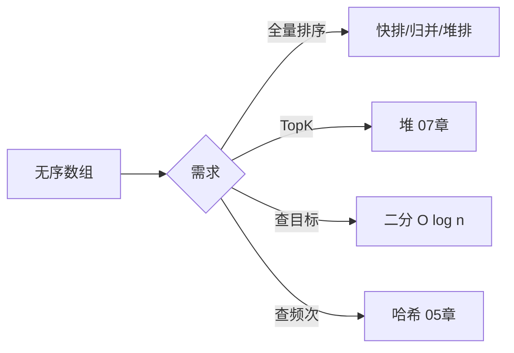
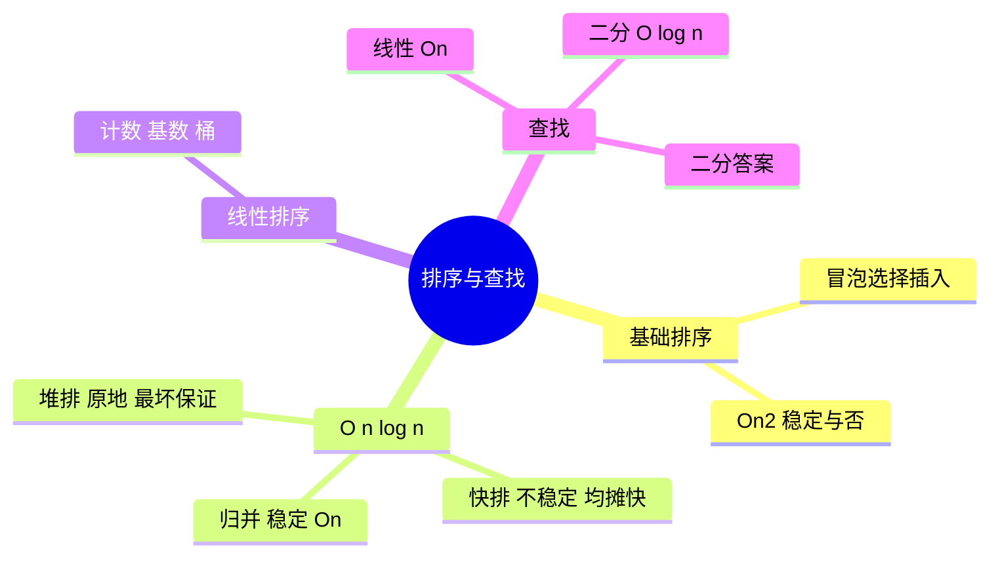

# 排序与查找算法

> **文件编码**：UTF-8。代码示例默认 **Python 3**；关键处附 Java / C++ 对照与 [三语言 13 章](../Java/13-算法与数据结构基础.md) 刷题链接。

---

## 本章与上一章的关系

[08 图论基础](08-图论基础.md) 讲多节点关系与 BFS/DFS；很多图算法（如 Dijkstra 选最小边）依赖 **有序结构** 或 **快速定位**。排序与查找是「把数据组织成可快速访问的形式」——数组有序后可二分，TopK 用堆（07 章），全量排序用 O(n log n) 算法。

| 上一章（08） | 本章（09） | 下一章（10） |
|--------------|------------|--------------|
| BFS/DFS、拓扑 | 排序族、二分查找 | 并查集、Trie、单调栈 |
| 图遍历 O(V+E) | 快排/归并 O(n log n) | 字符串与前缀结构 |



---

## 1. 为什么学排序与查找

### 1.1 面试

- 手写 **快速排序**、**归并排序** 是经典手撕题
- **二分查找**及其变体（找左边界、旋转数组）出现频率极高
- 能说清 **稳定性**、**时间/空间复杂度**、**何时用哪种排序**

### 1.2 工程映射

| 场景 | 排序/查找角色 |
|------|---------------|
| MySQL `ORDER BY` | 内部排序（filesort / 索引有序） |
| 日志按时间查区间 | 有序 + 二分边界 |
| TopK 热榜 | 堆或部分排序（07 章） |
| 数据库索引 | B+ 树 = 有序 + 多路查找（06 章延伸） |
| `sorted()` / `Arrays.sort()` | 语言内置 TimSort / Dual-Pivot QuickSort |

---

## 2. 排序算法总览

### 2.1 稳定性是什么

**稳定排序**：相等元素的 **相对顺序** 在排序后不变。

```text
输入: [(3, "a"), (1, "b"), (3, "c")]  按 key=3 的第一个排前面
稳定输出: (1,"b"), (3,"a"), (3,"c")   ← "a" 仍在 "c" 前
不稳定可能: (1,"b"), (3,"c"), (3,"a") ← 相等 key 顺序被打乱
```

**何时在意稳定性**：多关键字排序（先按部门再按工资）、对象排序需保留输入顺序。

### 2.2 复杂度与稳定性对照表

| 算法 | 最好 | 平均 | 最差 | 空间 | 稳定 | 适用 |
|------|------|------|------|------|:----:|------|
| 冒泡 | O(n) | O(n²) | O(n²) | O(1) | ✅ | 教学、几乎有序小数据 |
| 选择 | O(n²) | O(n²) | O(n²) | O(1) | ❌ | 交换次数少 |
| 插入 | O(n) | O(n²) | O(n²) | O(1) | ✅ | 小规模、近乎有序 |
| 希尔 | O(n log n) | 取决于增量 | O(n²) | O(1) | ❌ | 中等规模（了解） |
| 快速 | O(n log n) | O(n log n) | O(n²) | O(log n) | ❌ | **通用最快均摊** |
| 归并 | O(n log n) | O(n log n) | O(n log n) | O(n) | ✅ | **需要稳定、链表排序** |
| 堆排 | O(n log n) | O(n log n) | O(n log n) | O(1) | ❌ | 原地、不需稳定 |
| 计数 | O(n+k) | O(n+k) | O(n+k) | O(k) | ✅ | 整数范围小 |
| 桶 | O(n) | O(n) | O(n²) | O(n+k) | ✅ | 均匀分布浮点 |
| 基数 | O(d(n+k)) | O(d(n+k)) | O(d(n+k)) | O(n+k) | ✅ | 定长整数/字符串 |

**语言默认**：

- Python `list.sort()` / `sorted()`：**Timsort**（归并+插入混合，稳定）
- Java `Arrays.sort(int[])`：Dual-Pivot **快排**（不稳定）；对象数组 **Timsort**（稳定）
- C++ `std::sort`：Introsort（快排+堆排，**不稳定**）；`stable_sort` 归并

### 2.3 选型决策树

```text
数据规模 n？
├─ n < 50        → 插入排序（简单、近乎有序快）
├─ 需要稳定？     → 归并 / Timsort / stable_sort
├─ 原地 + 最快？  → 快排（注意最坏 O(n²)）
├─ 原地 + 保证 O(n log n) 最坏？ → 堆排
├─ key 范围小整数？ → 计数 / 基数
└─ 链表排序？     → 归并（O(1) 额外空间可改链表指针）
```

---

## 3. 基础 O(n²) 排序（Python 实现）

### 3.1 冒泡排序

**思路**：相邻比较，大者后移；每轮把最大值「冒」到末尾。

```python
def bubble_sort(arr: list[int]) -> None:
    n = len(arr)
    for i in range(n - 1):
        swapped = False
        for j in range(n - 1 - i):
            if arr[j] > arr[j + 1]:
                arr[j], arr[j + 1] = arr[j + 1], arr[j]
                swapped = True
        if not swapped:  # 已有序，提前退出
            break
```

- 时间：最好 O(n)，平均/最差 O(n²)
- 空间：O(1)，**稳定**

### 3.2 选择排序

**思路**：每轮选未排序部分最小值，放到前面。

```python
def selection_sort(arr: list[int]) -> None:
    n = len(arr)
    for i in range(n - 1):
        min_idx = i
        for j in range(i + 1, n):
            if arr[j] < arr[min_idx]:
                min_idx = j
        if min_idx != i:
            arr[i], arr[min_idx] = arr[min_idx], arr[i]
```

- 交换次数 ≤ n-1，但比较仍是 O(n²)
- **不稳定**（如 `5 8 5 2`，第一个 5 可能与 2 交换导致两个 5 顺序颠倒）

### 3.3 插入排序

**思路**：维护已排序前缀，逐个把新元素插入正确位置。

```python
def insertion_sort(arr: list[int]) -> None:
    for i in range(1, len(arr)):
        key = arr[i]
        j = i - 1
        while j >= 0 and arr[j] > key:
            arr[j + 1] = arr[j]
            j -= 1
        arr[j + 1] = key
```

- 近乎有序时接近 O(n)，**稳定**
- 链表上插入 O(1) 时整体可 O(n²) 但常数小

---

## 4. 快速排序（重点）

### 4.1 分治思路

1. **选 pivot**（首/尾/随机/三数取中）
2. **分区 partition**：小于 pivot 放左，大于放右（相等可放任一侧，影响稳定性）
3. **递归**排序左右子数组

```python
import random

def quick_sort(arr: list[int], left: int = 0, right: int | None = None) -> None:
    if right is None:
        right = len(arr) - 1
    if left >= right:
        return
    p = partition(arr, left, right)
    quick_sort(arr, left, p - 1)
    quick_sort(arr, p + 1, right)


def partition(arr: list[int], left: int, right: int) -> int:
    # 随机 pivot 降低最坏概率
    pivot_idx = random.randint(left, right)
    arr[pivot_idx], arr[right] = arr[right], arr[pivot_idx]
    pivot = arr[right]
    i = left
    for j in range(left, right):
        if arr[j] <= pivot:
            arr[i], arr[j] = arr[j], arr[i]
            i += 1
    arr[i], arr[right] = arr[right], arr[i]
    return i
```

### 4.2 复杂度分析

| 情况 | 时间 | 原因 |
|------|------|------|
| 平均 | O(n log n) | 分区较均衡，递归深度 log n |
| 最差 | O(n²) | 每次 pivot 最小/最大，分区 0 和 n-1 |
| 空间 | O(log n) | 递归栈；最坏 O(n) |

**优化**：随机 pivot、三数取中、小数组改插入排序、尾递归优化一侧。

### 4.3 与工程

- C++ `std::sort` 底层 Introsort 在递归过深时转堆排，避免 O(n²)
- 面试话术：「均摊 O(n log n)，不稳定；工程实现会加随机 pivot 和 fallback」

---

## 5. 归并排序（重点）

### 5.1 思路

分治：**拆半 → 递归排序 → 合并两个有序数组**。

```python
def merge_sort(arr: list[int]) -> list[int]:
    if len(arr) <= 1:
        return arr
    mid = len(arr) // 2
    left = merge_sort(arr[:mid])
    right = merge_sort(arr[mid:])
    return merge(left, right)


def merge(left: list[int], right: list[int]) -> list[int]:
    result: list[int] = []
    i = j = 0
    while i < len(left) and j < len(right):
        if left[i] <= right[j]:  # <= 保证稳定
            result.append(left[i])
            i += 1
        else:
            result.append(right[j])
            j += 1
    result.extend(left[i:])
    result.extend(right[j:])
    return result
```

### 5.2 复杂度

- 时间：**始终** O(n log n)
- 空间：O(n) 辅助数组（原地归并可做但复杂）
- **稳定**

### 5.3 应用

- **链表排序**（LeetCode 148）：归并 O(n log n)，空间 O(1) 可只改指针
- **逆序对**计数：归并过程中统计
- 外部排序：大文件分块排序再 k 路归并

---

## 6. 堆排序

**思路**：建最大堆，反复把堆顶（最大值）与末尾交换，缩小堆范围。

```python
def heap_sort(arr: list[int]) -> None:
    n = len(arr)

    def sift_down(start: int, end: int) -> None:
        root = start
        while True:
            child = 2 * root + 1
            if child > end:
                break
            if child + 1 <= end and arr[child + 1] > arr[child]:
                child += 1
            if arr[root] >= arr[child]:
                break
            arr[root], arr[child] = arr[child], arr[root]
            root = child

    for start in range(n // 2 - 1, -1, -1):
        sift_down(start, n - 1)
    for end in range(n - 1, 0, -1):
        arr[0], arr[end] = arr[end], arr[0]
        sift_down(0, end - 1)
```

- 时间：O(n log n) **最坏也是**
- 空间：O(1)，**不稳定**
- 与 07 章堆联系：同一套 sift 逻辑

---

## 7. 线性时间排序（了解）

### 7.1 计数排序

key ∈ [0, k] 时，统计频次再写回。

```python
def counting_sort(arr: list[int], k: int) -> list[int]:
    count = [0] * (k + 1)
    for x in arr:
        count[x] += 1
    result: list[int] = []
    for i, c in enumerate(count):
        result.extend([i] * c)
    return result
```

- O(n + k) 时间，k 很大时不适用

### 7.2 基数排序

按位（个位、十位…）用稳定排序（通常计数）逐轮排。

- 适合定长整数、字符串（从低位到高位 LSD）
- O(d × (n + k))，d 为位数

---

## 8. 查找算法

### 8.1 线性查找

从头到尾比较，O(n)，无序数组唯一选择。

### 8.2 二分查找（必会）

**前提**：有序（或单调性：答案在某分界点一侧全满足、另一侧全不满足）。

#### 标准版：找 target 下标

```python
def binary_search(nums: list[int], target: int) -> int:
    left, right = 0, len(nums) - 1
    while left <= right:
        mid = left + (right - left) // 2
        if nums[mid] == target:
            return mid
        if nums[mid] < target:
            left = mid + 1
        else:
            right = mid - 1
    return -1
```

#### 左边界：第一个 ≥ target 的位置

```python
def lower_bound(nums: list[int], target: int) -> int:
    left, right = 0, len(nums)
    while left < right:
        mid = left + (right - left) // 2
        if nums[mid] < target:
            left = mid + 1
        else:
            right = mid
    return left
```

#### 右边界：最后一个 ≤ target 的下一位

```python
def upper_bound(nums: list[int], target: int) -> int:
    left, right = 0, len(nums)
    while left < right:
        mid = left + (right - left) // 2
        if nums[mid] <= target:
            left = mid + 1
        else:
            right = mid
    return left
```

**Python 内置**：`bisect.bisect_left` / `bisect_right` 等价上述语义。

### 8.3 二分答案（单调性）

不是数组有序，而是 **答案空间单调**：如「最小化最大值」「第 K 小」。

```text
模板：
  lo, hi = 最小可能, 最大可能
  while lo < hi:
      mid = (lo + hi) // 2 或 (lo + hi + 1) // 2  # 看写法
      if check(mid):   # mid 可行
          hi = mid     # 或 lo = mid，取决于求最小还是最大可行
      else:
          lo = mid + 1 # 或 hi = mid - 1
```

典型题：LeetCode 875 爱吃香蕉的珂珂、410 分割数组的最大值。

### 8.4 哈希 vs 二分 vs 排序

| 需求 | 首选 | 复杂度 |
|------|------|--------|
| 无序查是否存在 | 哈希 set | 均摊 O(1) |
| 有序查 / 范围 | 二分 | O(log n) |
| 多次查询静态数组 | 先排序再二分 | 预处理 O(n log n) |
| 动态插入删除 + 查 | 平衡 BST / TreeMap | O(log n) 各操作 |

---

## 9. 排序相关 LeetCode 与 11 章题单

本章原理对应 [11 章](11-LeetCode刷题路线与题型汇总.md) 中 **二分/排序** 标签：

| 题号 | 题目 | 考点 |
|------|------|------|
| 704 | 二分查找 | 标准二分 |
| 35 | 搜索插入位置 | lower_bound |
| 34 | 查找元素第一个和最后一个位置 | 左右边界 |
| 33 | 搜索旋转排序数组 | 二分变体 |
| 153 | 寻找旋转最小值 | 二分变体 |
| 215 | 数组第 K 个最大元素 | 快排 partition / 堆 |
| 148 | 排序链表 | 归并 |
| 912 | 排序数组 | 任选 O(n log n) |

手写排序练习：LeetCode 912；面试常要求 **快排** 或 **归并** 口述 + 代码。

---

## 10. 三语言对照（排序 / 二分）

| 操作 | Python | Java | C++ |
|------|--------|------|-----|
| 排序 | `sorted(arr)` / `arr.sort()` | `Arrays.sort(a)` | `sort(v.begin(), v.end())` |
| 稳定排序 | 默认稳定 | `Arrays.sort` 对象稳定 | `stable_sort` |
| 二分 | `bisect.bisect_left` | `Arrays.binarySearch` | `lower_bound` / `upper_bound` |
| 自定义比较 | `key=lambda x: ...` | `Comparator.comparing` | 第三个参数 lambda |

详细手撕模板见 [Java 13 §35](../Java/13-算法与数据结构基础.md)、[Python 13](../Python/13-算法与数据结构基础.md)、[C++ 13](../C++/13-算法与数据结构C++实现.md)。

---

## 11. 常见面试问答

### Q1：快排最坏 O(n²) 怎么避免？

随机 pivot；小数组改插入；Introsort 递归过深转堆排。

### Q2：归并和快排怎么选？

要稳定 / 链表 / 保证 O(n log n) → 归并；要原地、均摊最快 → 快排。

### Q3：二分循环条件 `left <= right` 和 `left < right` 区别？

`<=` 用于找精确值；`<` 用于找边界（左闭右开区间 `[left, right)`）。

### Q4：什么时候不能二分？

没有单调性；数据无序且不能先排序（或排序代价过高且无单调答案空间）。

### Q5：External Sort 了解吗？

大文件分块读入内存排序，写临时文件，最后 k 路归并——与归并排序思想一致。

---

## 12. 本章练习

### 12.1 手写任务

| # | 任务 | 验收 |
|---|------|------|
| 1 | 实现 `quick_sort` + `partition` | 随机数组排序正确 |
| 2 | 实现 `merge_sort` | 稳定：相等元素顺序不变 |
| 3 | 实现 `lower_bound` | 与 `bisect_left` 结果一致 |
| 4 | 口述稳定性表格 | 6 种基础排序能背 |

### 12.2 LeetCode 建议（配合 11 章 #59～64）

1. 704 二分查找（E）
2. 34 查找元素第一个和最后一个位置（M）
3. 215 数组第 K 个最大元素（M，快排/堆）
4. 148 排序链表（M，归并）

### 12.3 自测清单

- [ ] 能默写排序稳定性对照表
- [ ] 能手写快排 partition 并分析平均复杂度
- [ ] 能写归并 merge 并说明为何稳定
- [ ] 能写 lower_bound / upper_bound 两种写法
- [ ] 知道 Python/Java/C++ 默认排序算法与是否稳定

---

## 13. 知识小结



---

## 下一章预告

[10 并查集 Trie 与高级结构](10-并查集Trie与高级结构.md) 讲 **并查集**（连通分量）、**Trie**（前缀匹配）、**单调栈**（下一更大元素）——与 04 栈、05 哈希、09 排序互补，对应 LeetCode 并查集 / 字典树 / 单调栈标签。

---

*配合 [11 刷题路线](11-LeetCode刷题路线与题型汇总.md)、[12 面试总表](12-面试专题与知识点总表.md) 复习*
