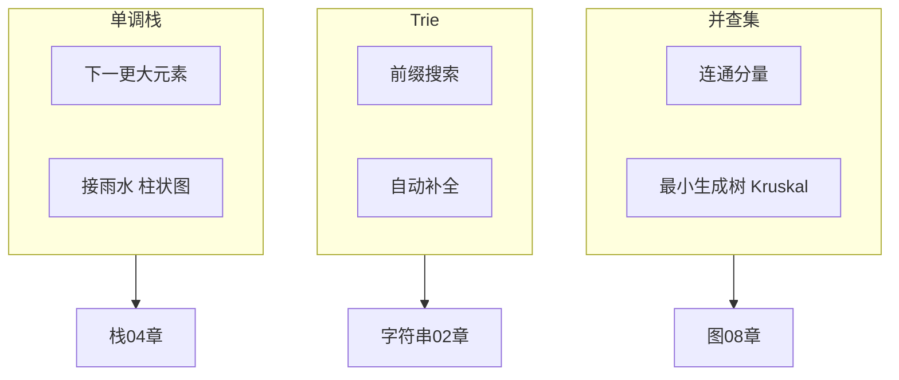
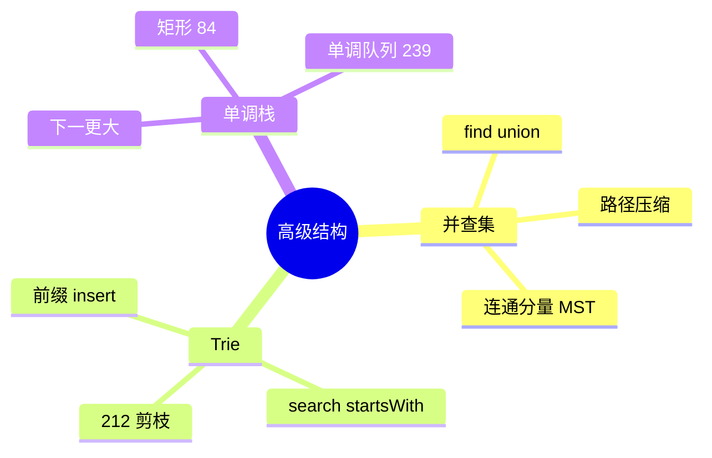

# 并查集、Trie 与高级结构

> **文件编码**：UTF-8。代码示例默认 **Python 3**；并查集 / Trie / 单调栈为面试进阶结构，与 [04 栈与队列](04-栈与队列.md)、[05 哈希表](05-哈希表.md) 紧密相关。

---

## 0. 读前导读（零基础也能跟上）

### 0.1 用一句话弄懂本章

**并查集** = 动态合并集合、问是否同一组；**Trie** = 按字符前缀组织的字典树；**单调栈** = 栈内保持单调，O(n) 求「下一个更大元素」。

### 0.2 你需要提前知道什么

- [08 图论](08-图论基础.md)：DFS 连通 vs 并查集 union
- [04 栈](04-栈与队列.md)：栈 LIFO 基础
- [02 字符串](02-数组与字符串.md)：字符遍历

### 0.3 知识地图（☐→☑）

- [ ] UnionFind 路径压缩 + 按秩合并
- [ ] Trie insert/search/startsWith
- [ ] 单调递减栈模板 739
- [ ] 547、208、739 独立 AC
- [ ] 口述 Kruskal 与并查集
- [ ] §19 自测 ≥8/10

### 0.4 建议学习时长与节奏

4～5 天；三类结构各 1～2 天，84 矩形可第二遍攻。

### 0.5 学完本章你能做什么

1. 用并查集判 **冗余连接**（684）
2. 用 Trie 做 **前缀搜索 / 212 剪枝**
3. 用单调栈解 **每日温度**（739）

**生活类比**：并查集像 **朋友圈合并**；Trie 像 **输入法词库按前缀展开**；单调栈像 **从左到右扫，随时弹走挡视线的矮柱子**。

---

## 本章与上一章的关系

[09 排序与查找](09-排序与查找算法.md) 解决「有序化与定位」；本章解决 **动态连通性**、**字符串前缀集合**、**单调性维护** 三类问题——无法用简单排序或哈希 alone 高效完成。

| 上一章（09） | 本章（10） | 下一章（11） |
|--------------|------------|--------------|
| 快排、二分 | 并查集、Trie、单调栈 | 70 题刷题路线 |
| 静态有序 | 动态合并 / 前缀 | 按标签实战 |



---

## 1. 并查集（Union-Find / Disjoint Set Union）

### 1.1 解决什么问题

- **动态连通性**：不断合并集合，随时问两点是否同一集合
- **连通分量个数**
- **最小生成树** Kruskal：按边权排序，用并查集判环
- **省份数量**、**冗余连接**、**账户合并**

### 1.2 核心操作

| 操作 | 含义 | 目标复杂度 |
|------|------|------------|
| `find(x)` | 查 x 所属集合代表元（根） | 均摊 O(α(n)) ≈ O(1) |
| `union(a, b)` | 合并 a、b 所在集合 | 均摊 O(α(n)) |
| `connected(a, b)` | 是否同一集合 | 两次 find |

α(n) 为反阿克曼函数，增长极慢，可视为常数。

### 1.3 Python 实现（路径压缩 + 按秩合并）

```python
class UnionFind:
    def __init__(self, n: int):
        self.parent = list(range(n))
        self.rank = [0] * n
        self.count = n  # 连通分量数

    def find(self, x: int) -> int:
        if self.parent[x] != x:
            self.parent[x] = self.find(self.parent[x])  # 路径压缩
        return self.parent[x]

    def union(self, a: int, b: int) -> bool:
        ra, rb = self.find(a), self.find(b)
        if ra == rb:
            return False
        if self.rank[ra] < self.rank[rb]:
            ra, rb = rb, ra
        self.parent[rb] = ra
        if self.rank[ra] == self.rank[rb]:
            self.rank[ra] += 1
        self.count -= 1
        return True

    def connected(self, a: int, b: int) -> bool:
        return self.find(a) == self.find(b)
```

### 1.4 优化说明

| 优化 | 作用 |
|------|------|
| **路径压缩** | find 时把路径上节点直接挂到根，树变扁 |
| **按秩 / 按大小合并** | 小树挂大树，控制树高 |
| 二者合用 | 得到近常数均摊 |

### 1.5 典型题型

#### 547. 省份数量（连通分量）

```python
def find_circle_num(is_connected: list[list[int]]) -> int:
    n = len(is_connected)
    uf = UnionFind(n)
    for i in range(n):
        for j in range(i + 1, n):
            if is_connected[i][j]:
                uf.union(i, j)
    return uf.count
```

#### 684. 冗余连接（第一次形成环的边）

```python
def find_redundant_connection(edges: list[list[int]]) -> list[int]:
    n = len(edges)
    uf = UnionFind(n + 1)
    for u, v in edges:
        if not uf.union(u, v):
            return [u, v]
    return []
```

#### 990. 等式方程的可满足性

- 字母映射为 id；`==` union，`!=` 先记录后检查是否 connected

### 1.6 与图的对比

| | BFS/DFS（08 章） | 并查集 |
|--|------------------|--------|
| 图表示 | 邻接表/矩阵 | 隐式，只关心连通 |
| 动态加边 | 需重新遍历 | union O(α(n)) |
| 适用 | 路径、最短路 | 连通性、MST 判环 |

---

## 2. Trie（前缀树 / 字典树）

### 2.1 解决什么问题

- **前缀匹配**：自动补全、输入法候选
- **字符串集合** 插入 / 查询 / 前缀统计
- **异或最大对**（01-Trie，位运算题）
- **单词搜索 II**（矩阵 + Trie 剪枝）

### 2.2 结构

每个节点表示一个字符；从根到某节点路径 = 某前缀。节点常含：

- `children`: 字符 → 子节点（数组 26 或 dict）
- `is_end`: 是否单词结尾
- `pass_count` / `word`: 可选，用于计数或存完整词

```text
插入 "app", "apple", "apt"

        root
       /
      a
     /
    p
   / \
  p   t (end: apt)
 /
l
/
e (end: apple)
(end: app 可在第二个 p 标记)
```

### 2.3 Python 实现

```python
class TrieNode:
    __slots__ = ("children", "is_end")

    def __init__(self):
        self.children: dict[str, TrieNode] = {}
        self.is_end = False


class Trie:
    def __init__(self):
        self.root = TrieNode()

    def insert(self, word: str) -> None:
        node = self.root
        for ch in word:
            if ch not in node.children:
                node.children[ch] = TrieNode()
            node = node.children[ch]
        node.is_end = True

    def search(self, word: str) -> bool:
        node = self._walk(word)
        return node is not None and node.is_end

    def starts_with(self, prefix: str) -> bool:
        return self._walk(prefix) is not None

    def _walk(self, s: str) -> TrieNode | None:
        node = self.root
        for ch in s:
            if ch not in node.children:
                return None
            node = node.children[ch]
        return node
```

**数组版**（仅小写字母，更快）：

```python
class TrieArray:
    def __init__(self):
        self.children: list[dict] = [{}]
        self.is_end: list[bool] = [False]

    def insert(self, word: str) -> None:
        cur = 0
        for ch in word:
            idx = ord(ch) - ord("a")
            if idx not in self.children[cur]:
                self.children[cur][idx] = len(self.children)
                self.children.append({})
                self.is_end.append(False)
            cur = self.children[cur][idx]
        self.is_end[cur] = True
```

### 2.4 复杂度

| 操作 | 时间 | 空间 |
|------|------|------|
| insert / search / startsWith | O(L)，L 为字符串长 | O(总字符数) |
| 对比哈希 set | 精确匹配 O(L) | 无法高效前缀 |
| 对比排序 + 二分 | 前缀需特殊处理 | Trie 天然前缀 |

### 2.5 经典题目

| 题号 | 题目 | 要点 |
|------|------|------|
| 208 | 实现 Trie | 模板 |
| 211 | 添加与搜索单词 | 通配 `.` 用 DFS |
| 212 | 单词搜索 II | 矩阵 DFS + Trie 剪枝 |
| 648 | 单词替换 | 句子拆分为最短词典前缀 |
| 677 | 键值映射 | 前缀和 + map（变体） |
| 421 | 数组最大异或值 | 01-Trie 按位 |

### 2.6 单词搜索 II 思路简述

1. 把所有 words 插入 Trie
2. 对矩阵每个格子 DFS
3. 沿 Trie 走，若节点标记 is_end 则收集单词
4. 剪枝：走完的单词可从 Trie 删标记避免重复

### 2.7 工程映射

| 场景 | Trie 角色 |
|------|-----------|
| 搜索引擎 suggest | 前缀树 + TopK |
| Redis 键前缀扫描 | `KEYS prefix*` 类似前缀匹配（生产用 SCAN） |
| 路由表最长前缀匹配 | 比特 Trie / 压缩 Trie |
| 拼写检查 | 编辑距离 + Trie 候选 |

---

## 3. 单调栈（Monotonic Stack）

### 3.1 解决什么问题

维护一个 **单调递增或递减** 的栈，在 O(n) 内求：

- 每个元素 **左边/右边第一个更大（或更小）** 元素
- **接雨水**、**柱状图最大矩形**
- **每日温度**（下一更高温天数）

与 [04 栈与队列](04-栈与队列.md) 中普通栈不同：栈内元素保持单调性，新元素入栈时弹出破坏单调性的元素。

### 3.2 下一更大元素（模板）

**从左到右**，维护 **递减栈**（栈底到栈顶递减），存 **下标**：

```python
def next_greater_elements(nums: list[int]) -> list[int]:
    n = len(nums)
    ans = [-1] * n
    stack: list[int] = []  # 存下标，对应值递减
    for i in range(n):
        while stack and nums[stack[-1]] < nums[i]:
            idx = stack.pop()
            ans[idx] = nums[i]
        stack.append(i)
    return ans
```

**每日温度**（LeetCode 739）：`ans[idx] = i - idx`（天数差）。

### 3.3 柱状图中最大矩形（84）

对每个柱子，求 **左右第一个更小** 的高度边界，宽度 = 右边界 - 左边界 - 1。

```python
def largest_rectangle_area(heights: list[int]) -> int:
    heights = [0] + heights + [0]  # 哨兵简化边界
    stack: list[int] = [0]
    best = 0
    for i in range(1, len(heights)):
        while heights[stack[-1]] > heights[i]:
            h = heights[stack.pop()]
            w = i - stack[-1] - 1
            best = max(best, h * w)
        stack.append(i)
    return best
```

### 3.4 接雨水（42）与单调栈

- **双指针**（09/02 章）：左右 max，O(n) O(1) 空间
- **单调栈**：横向算每层水，或算每个坑的贡献

单调栈版思路：遇 taller 柱时，栈顶为底、当前为右墙，弹出中间算水量。

### 3.5 单调队列（Monotonic Queue）简介

滑动窗口 **最值**（LeetCode 239 滑动窗口最大值）：

- 双端队列存 **下标**，值单调递减
- 入队踢掉小于新元素的队尾；队头为窗口最大
- 均摊 O(1)，总 O(n)

```python
from collections import deque

def max_sliding_window(nums: list[int], k: int) -> list[int]:
    dq: deque[int] = deque()
    result: list[int] = []
    for i, x in enumerate(nums):
        while dq and nums[dq[-1]] <= x:
            dq.pop()
        dq.append(i)
        if dq[0] <= i - k:
            dq.popleft()
        if i >= k - 1:
            result.append(nums[dq[0]])
    return result
```

与 04 章普通队列、11 章滑动窗口题（#15、#41）联动。

### 3.6 单调栈题型汇总

| 题号 | 题目 | 单调性 |
|------|------|--------|
| 739 | 每日温度 | 递减栈，下一更大 |
| 496 | 下一个更大元素 I | 递减栈 |
| 503 | 下一个更大元素 II | 循环数组翻倍或模 |
| 84 | 柱状图最大矩形 | 递增栈，求边界 |
| 85 | 最大矩形 | 逐行转化为 84 |
| 42 | 接雨水 | 栈或双指针 |
| 316 | 去重字母最小字典序 | 单调栈 + 贪心 |
| 402 | 移掉 K 位数字 | 单调递增栈 |

---

## 4. 其他高级结构（速览）

### 4.1 线段树 / 树状数组

- **区间查询 / 单点修改**：O(log n)
- 题：区域和检索、逆序对（树状数组）
- 后端：区间统计、排行榜区间聚合

### 4.2 LRU Cache（146）

- **哈希 + 双向链表**（05 + 03 章思想）
- get/put O(1)；Redis 淘汰策略同类

### 4.3 跳表（Skip List）

- Redis ZSet 底层之一；有序 + O(log n) 插入查询概率平衡

本章深度以 **并查集、Trie、单调栈** 为主；线段树 / LRU 在 05、07 章及语言 13 章展开。

---

## 5. 三语言对照

| 结构 | Python | Java | C++ |
|------|--------|------|-----|
| 并查集 | 手写 class | 手写 / 无内置 | 手写 |
| Trie | dict 或 class | 嵌套 Map / 数组 | `unordered_map` 或 array[26] |
| 单调栈 | `list` 作栈 | `Deque<Integer>` | `vector` + `push_back/pop_back` |
| 前缀查找 | 无内置 Trie | 无 | 无 |

模板代码见 [C++ 13 §并查集/Trie](../C++/13-算法与数据结构C++实现.md)、[Python 13](../Python/13-算法与数据结构基础.md)。

---

## 6. 常见面试问答

### Q1：并查集为什么快？

路径压缩 + 按秩合并使树高几乎常数；均摊 O(α(n))。

### Q2：Trie 和哈希表查单词谁快？

精确匹配差不多；**前缀查询、自动补全** Trie 更自然；哈希无法枚举 prefix*。

### Q3：单调栈时间复杂度？

每个元素最多入栈出栈各一次，O(n)。

### Q4：Kruskal 最小生成树步骤？

边权排序 → 依次 union，若两端已连通则跳过（成环）。

### Q5：单调栈存值还是下标？

通常存 **下标**，便于算 **距离**（宽度、天数）。

---

## 7. FAQ（扩充）

### Q6：并查集不用 rank 会怎样？

只有路径压缩也能近常数；rank/ size 合并进一步控树高。

### Q7：684 冗余连接为何按顺序检查？

找 **第一条** 使图成环的边；union 返回 False 时即答案。

### Q8：990 等式方程怎么做？

`==` 先 union 记录；`!=` 后查 find 是否同集合。

### Q9：Trie 数组 26 vs dict？

固定小写字母数组快；dict 支持任意字符。

### Q10：211 通配 `.` 怎么搜？

当前节点 DFS 26 分支或 dict keys。

### Q11：212 为何要删 Trie 中已找单词？

避免重复收集；标记 is_end 或删节点。

### Q12：84 柱状图为何加哨兵 0？

统一 pop 边界，不用判栈空。

### Q13：42 接雨水单调栈 vs 双指针？

双指针 O(1) 空间更优；单调栈横向算水直观。

### Q14：239 单调队列 vs 堆？

窗口 max 均摊 O(1)；堆 O(log k) 每步。

### Q15：Kruskal 步骤？

边权升序；两端不连通则 union 加边，已连通跳过（成环）。

### Q16：ACM 面试 30 秒？

「UF 路径压缩 union 近 O(1)；Trie 前缀；单调栈 O(n) 下一更大。」

---

## 8. 面试口述版（零基础）

「**并查集** 像合并朋友圈：问俩人是否同一群，就把各自老大找齐，一样就是一群；合并时让小群挂大群。**Trie** 像 **输入法词库**，从第一个字往下长树枝，查『以某前缀开头』很快。**单调栈** 像排队从左看，矮个被高个挡住就弹出，随时知道右边第一个更高的人在哪。」

---

## 9. LeetCode 思维六步

### 9.1 LeetCode 547 省份数量

| 步 | 内容 |
|----|------|
| 1 | n 城市；`isConnected[i][j]=1` 直接相连 |
| 2 | DFS 数连通块 O(n²) |
| 3 | **并查集** 对 matrix 上 1 union |
| 4 | 初始 count=n；union 成功 count-- |
| 5 | 返回 count |
| 6 | O(n² α(n)) |

### 9.2 LeetCode 208 实现 Trie

| 步 | 内容 |
|----|------|
| 1 | insert / search / startsWith |
| 2 | 哈希存整词无法前缀 |
| 3 | 树形 children 26 或 dict |
| 4 | insert 逐字符走或建子节点 |
| 5 | search 要 is_end；startsWith 走到即可 |
| 6 | O(L) 每操作 |

### 9.3 LeetCode 739 每日温度

| 步 | 内容 |
|----|------|
| 1 | 每天等几天更高温；无则 0 |
| 2 | 暴力 O(n²) |
| 3 | **单调递减栈** 存下标 |
| 4 | 当前比栈顶大则 pop 并填 `ans[idx]=i-idx` |
| 5 | 当前下标入栈 |
| 6 | O(n) 每元素入出栈各一次 |

---

## 10. 手把手：UnionFind union

| 步骤 | 动作 | 预期 |
|------|------|------|
| 1 | `ra, rb = find(a), find(b)` | 路径压缩后根 |
| 2 | `ra==rb` return False | 已在同集 |
| 3 | rank 小挂 rank 大 | 树扁 |
| 4 | 相等 rank 则 root rank++ | — |
| 5 | count-- | 分量减 1 |

---

## 11. 逐行读：Trie insert

| 行 | 含义 | 改错 |
|----|------|------|
| `node = self.root` | 从根走 | 漏 root |
| `if ch not in node.children` 新建 | 前缀路径 | 覆盖旧词 |
| `node = node.children[ch]` | 下一层 | — |
| `node.is_end = True` | 单词结尾 | 漏则 search 失败 |

---

## 12. 闭卷自测

1. 并查集 find/union 均摊复杂度？
2. 路径压缩做什么？
3. 547 为何 union 上三角 i<j？
4. Trie search 与 startsWith 区别？
5. 739 栈存值还是下标？
6. 84 哨兵作用？
7. Kruskal 为何需要并查集？
8. 212 剪枝核心？
9. 421 01-Trie 按什么遍历？
10. LRU 146 两结构各干什么？

<details>
<summary>自测参考答案</summary>

1. O(α(n)) ≈ O(1)。
2. find 时把路径结点直接挂根，降低树高。
3. 无向边只 union 一次，避免重复。
4. search 需 is_end；startsWith 走到前缀末即可。
5. 下标，方便算 i-idx 天数。
6. 高度 0 强制清空栈内剩余矩形。
7. 加边前判两端是否已连通，连通则成环跳过。
8. DFS 沿 Trie 走，无分支剪枝；is_end 收集单词。
9. 按二进制位从高位到低位建 Trie。
10. 哈希 key→节点 O(1) 定位；双向链表 O(1) 移序/删最久。

</details>

---

## 13. 费曼检验

3 分钟讲「并查集路径压缩」+「单调栈为何 O(n)」。

**提纲**：find 时挂到根；每个下标最多入栈出栈一次。

---

## 14. 术语三件套

**并查集（Union-Find）**：维护不相交集合，支持 merge 与 query。  
**生活类比**：动态合并朋友圈。  
**本章**：§1。

**Trie（前缀树）**：边带字符的树，根到节点路径即前缀。  
**生活类比**：输入法候选词树。  
**本章**：§2。

**单调栈（Monotonic Stack）**：栈内元素保持单调性。  
**生活类比**：从左看一排人，只保留可能挡住视线的索引。  
**本章**：§3。

---

## 15. 本章练习

### 15.1 手写任务

| # | 任务 | 验收 |
|---|------|------|
| 1 | `UnionFind` 带路径压缩 | 547 省份数量 AC |
| 2 | `Trie` insert/search/startsWith | 208 AC |
| 3 | 下一更大元素 | 496 / 739 AC |
| 4 | 口述 Kruskal 与并查集关系 | 1 分钟 |

### 15.2 LeetCode 建议

| 优先级 | 题号 | 题目 |
|--------|------|------|
| B | 208 | 实现 Trie |
| B | 547 | 省份数量 |
| B | 739 | 每日温度 |
| R | 684 | 冗余连接 |
| R | 212 | 单词搜索 II |
| R | 84 | 柱状图中最大矩形 |

### 15.3 与 11 章题单关系

11 章 **栈/队列** 标签 #41 每日温度、#44 柱状图最大矩形即本章单调栈；并查集 / Trie 在扩展题单（200 岛屿、207 课程表可 DFS 或并查集）。

### 15.4 自测清单

- [ ] 能手写 UnionFind（find + union）
- [ ] 能实现 Trie 三个 API
- [ ] 能写单调栈求下一更大元素
- [ ] 知道单调栈与双指针解接雨水的区别
- [ ] 能举例 Trie 在工程中的用途

---

## 16. 知识小结



---

**本章**：§3。

---

## 18. Kruskal 最小生成树（并查集应用）

```python
def kruskal_mst(n: int, edges: list[list[int]]) -> int:
    """edges: [u, v, weight]；返回 MST 总权值；不连通返回 -1。"""
    edges.sort(key=lambda e: e[2])
    uf = UnionFind(n)
    total = 0
    used = 0
    for u, v, w in edges:
        if uf.union(u, v):
            total += w
            used += 1
            if used == n - 1:
                return total
    return -1 if used != n - 1 else total
```

**口述**：边权从小到大；两端已连通则跳过（成环）；否则 union 并累加权值；共需 n-1 条边。

---

## 19. 01-Trie 最大异或（421 思路）

按二进制位从高位到低位建 Trie；查询时对每位尽量走相反分支（异或 1），若无则走同分支。

```python
class XorTrie:
    def __init__(self) -> None:
        self.children: list[dict] = [{}]
        self.count = 0

    def insert(self, num: int) -> None:
        cur = 0
        for i in range(31, -1, -1):
            bit = (num >> i) & 1
            if bit not in self.children[cur]:
                self.children[cur][bit] = len(self.children)
                self.children.append({})
            cur = self.children[cur][bit]

    def max_xor(self, num: int) -> int:
        cur = 0
        ans = 0
        for i in range(31, -1, -1):
            bit = (num >> i) & 1
            want = 1 - bit
            if want in self.children[cur]:
                ans |= 1 << i
                cur = self.children[cur][want]
            else:
                cur = self.children[cur][bit]
        return ans
```

---

## 20. 后端映射扩展

| 结构 | 工程 | 面试句 |
|------|------|--------|
| 并查集 | 集群连通、网络合并 | 动态 union 近 O(1) |
| Trie | 路由最长前缀、输入法 | prefix* 天然 |
| 单调栈 | 股价跨度、柱状统计 | O(n) 下一更大 |
| 单调队列 | 滑动窗口限流峰值 | 239 模板 |
| LRU | 本地缓存 146 | 哈希+双向链 |

---

## 21. 下一章预告

[11 LeetCode 刷题路线与题型汇总](11-LeetCode刷题路线与题型汇总.md) 给出与 [Java/Python/C++ 13 章](../Java/13-算法与数据结构基础.md) **完全对齐的 70 题清单**，按标签、难度、必做/推荐标记，并附 8 周刷题计划。

---

*配合 [09 排序查找](09-排序与查找算法.md)、[12 面试总表](12-面试专题与知识点总表.md) 复习*
