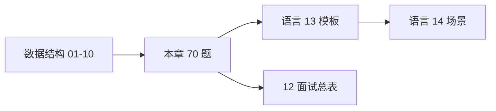

# LeetCode 刷题路线与题型汇总

> **文件编码**：UTF-8。本清单与 [Java 13](../Java/13-算法与数据结构基础.md)、[Python 13](../Python/13-算法与数据结构基础.md)、[C++ 13](../C++/13-算法与数据结构C++实现.md) **70 题完全对齐**；代码模板在语言 13 章，原理在数据结构 01～10 章。

---

## 本章与上一章的关系

[01～10 章](00-学习路线图与说明.md) 讲 **结构与算法原理**；本章是 **实战路线图**——按标签刷够 70 题，把原理变成肌肉记忆。语言 13 章提供 **Java/Python/C++ 手撕模板**，本章提供 **顺序、难度、与章节映射**。

| 数据结构章节 | 对应题单标签 | 题量 |
|--------------|--------------|------|
| 02 数组与字符串 | 数组/双指针、字符串/窗口 | 20 |
| 05 哈希表 | 哈希 | 8 |
| 03 链表 | 链表 | 10 |
| 04 栈与队列 | 栈/队列（含单调栈） | 8 |
| 06 树 | 二叉树 | 12 |
| 09 排序查找 | 二分/排序 | 6 |
| 08/10 图与回溯 | 回溯/DFS | 6 |
| **合计** | | **70** |



---

## 1. 刷题原则

### 1.1 精刷优于泛刷

- **70 题精刷** 胜过 500 题看一眼（与三语言 13 章一致）
- 每题走完：**暴力 → 优化 → 代码 → 复杂度 → 复盘**

### 1.2 标记说明

| 标记 | 含义 |
|------|------|
| **B** | 必做：面试高频，应独立 AC |
| **R** | 推荐：巩固变形，时间允许必做 |
| **E** | Easy |
| **M** | Medium |
| **H** | Hard |

### 1.3 平台与环境

- **LeetCode 中文站**（leetcode.cn）或国际版
- 按 **标签** 筛选，不要随机跳题
- 二刷时 **关题解、限时 25～35 分钟**（Medium）

---

## 2. 八周刷题计划

| 周次 | 标签 | 题号范围 | 章节复习 |
|------|------|----------|----------|
| 第 1 周 | 数组 / 双指针 | #1～#12 | 02 |
| 第 2 周 | 字符串 / 窗口 + 哈希 | #13～#28 | 02、05 |
| 第 3 周 | 链表 | #29～#38 | 03 |
| 第 4 周 | 栈 / 队列 | #39～#46 | 04、10 |
| 第 5 周 | 二叉树 | #47～#58 | 06 |
| 第 6 周 | 二分 / 排序 | #59～#64 | 09 |
| 第 7 周 | 回溯 / DFS | #65～#70 | 08、10 |
| 第 8 周 | 错题 + 模拟面试 | 全部 B 题 | 12 总表 |

**每日建议**：工作日 1～2 题，周末 3～4 题；保持 **连续** 比突击更重要。

---

## 3. 完整 70 题清单（按标签）

### 3.1 数组 / 双指针（12 题）→ [02 章](02-数组与字符串.md)

| # | 题号 | 题目 | 难度 | 标记 | 核心技巧 |
|---|------|------|------|------|----------|
| 1 | 1 | 两数之和 | E | B | 哈希（亦见 05） |
| 2 | 26 | 删除有序数组重复项 | E | B | 快慢指针 |
| 3 | 27 | 移除元素 | E | B | 快慢指针 |
| 4 | 88 | 合并两个有序数组 | E | B | 从尾双指针 |
| 5 | 283 | 移动零 | E | B | 快慢指针 |
| 6 | 15 | 三数之和 | M | R | 排序 + 双指针 |
| 7 | 11 | 盛最多水的容器 | M | R | 左右夹逼 |
| 8 | 42 | 接雨水 | H | R | 双指针 / 单调栈 |
| 9 | 56 | 合并区间 | M | R | 排序 + 合并 |
| 10 | 189 | 轮转数组 | M | R | 三次反转 |
| 11 | 238 | 除自身以外数组的乘积 | M | R | 前缀积 |
| 12 | 41 | 缺失的第一个正数 | H | R | 原地哈希 |

**本周目标**：熟练快慢指针；能口述 #6 去重逻辑（`i>left+1`）。

---

### 3.2 字符串 / 滑动窗口（8 题）→ [02 章](02-数组与字符串.md)

| # | 题号 | 题目 | 难度 | 标记 | 核心技巧 |
|---|------|------|------|------|----------|
| 13 | 125 | 验证回文串 | E | B | 双指针 |
| 14 | 344 | 反转字符串 | E | B | 双指针 |
| 15 | 3 | 无重复字符最长子串 | M | B | 滑动窗口 + 哈希 |
| 16 | 424 | 替换后最长重复字符 | M | R | 窗口 + 频次 |
| 17 | 76 | 最小覆盖子串 | H | R | 窗口 + 匹配计数 |
| 18 | 438 | 找到字符串中所有字母异位词 | M | R | 固定窗口 |
| 19 | 567 | 字符串的排列 | M | R | 同 438 |
| 20 | 5 | 最长回文子串 | M | R | 中心扩展 / DP |

**模板**：见 Python 13 §滑动窗口；固定窗口 vs 可变窗口。

---

### 3.3 哈希（8 题）→ [05 章](05-哈希表.md)

| # | 题号 | 题目 | 难度 | 标记 | 核心技巧 |
|---|------|------|------|------|----------|
| 21 | 217 | 存在重复元素 | E | B | set |
| 22 | 242 | 有效的字母异位词 | E | B | 频次数组 |
| 23 | 349 | 两个数组的交集 | E | B | set |
| 24 | 128 | 最长连续序列 | M | B | set + 只从起点扩展 |
| 25 | 347 | 前 K 个高频元素 | M | B | 堆 / 桶 |
| 26 | 49 | 字母异位词分组 | M | R | 排序串或频次 key |
| 27 | 36 | 有效的数独 | M | R | 行/列/宫 set |
| 28 | 380 | O(1) 时间插入删除获取随机 | M | R | 哈希 + 动态数组 |

**面试话术**：「用 dict 均摊 O(1) 查找，总时间 O(n)。」

---

### 3.4 链表（10 题）→ [03 章](03-链表.md)

| # | 题号 | 题目 | 难度 | 标记 | 核心技巧 |
|---|------|------|------|------|----------|
| 29 | 206 | 反转链表 | E | B | 迭代三指针 |
| 30 | 21 | 合并两个有序链表 | E | B | 哑节点 |
| 31 | 141 | 环形链表 | E | B | 快慢指针 |
| 32 | 876 | 链表的中间结点 | E | B | 快慢指针 |
| 33 | 203 | 移除链表元素 | E | B | 哑节点 |
| 34 | 160 | 相交链表 | E | B | 双指针走 A+B |
| 35 | 19 | 删除倒数第 N 个结点 | M | B | 快慢先行 n 步 |
| 36 | 142 | 环形链表 II | M | R | 相遇 + 找入口 |
| 37 | 148 | 排序链表 | M | R | 归并 O(n log n) |
| 38 | 23 | 合并 K 个升序链表 | H | R | 堆 / 分治归并 |

**必会手写**：#29 反转、#31 判环、#35 删倒数第 N。

---

### 3.5 栈 / 队列（8 题）→ [04 章](04-栈与队列.md)、[10 章](10-并查集Trie与高级结构.md)

| # | 题号 | 题目 | 难度 | 标记 | 核心技巧 |
|---|------|------|------|------|----------|
| 39 | 20 | 有效的括号 | E | B | 栈匹配 |
| 40 | 155 | 最小栈 | M | B | 辅助栈 |
| 41 | 739 | 每日温度 | M | B | 单调栈 |
| 42 | 225 | 用队列实现栈 | E | B | 队列 |
| 43 | 232 | 用栈实现队列 | E | B | 双栈 |
| 44 | 84 | 柱状图中最大矩形 | H | R | 单调栈 |
| 45 | 394 | 字符串解码 | M | R | 栈 |
| 46 | 946 | 验证栈序列 | M | R | 模拟栈 |

---

### 3.6 二叉树（12 题）→ [06 章](06-树与二叉树.md)

| # | 题号 | 题目 | 难度 | 标记 | 核心技巧 |
|---|------|------|------|------|----------|
| 47 | 104 | 二叉树最大深度 | E | B | 递归 |
| 48 | 100 | 相同的树 | E | B | 递归 |
| 49 | 101 | 对称二叉树 | E | B | 递归 |
| 50 | 226 | 翻转二叉树 | E | B | 递归 |
| 51 | 102 | 层序遍历 | M | B | BFS 队列 |
| 52 | 94 | 中序遍历 | E | B | 递归 / 栈 |
| 53 | 108 | 将有序数组转为 BST | E | B | 分治 mid |
| 54 | 110 | 平衡二叉树 | E | B | 递归高度 |
| 55 | 199 | 二叉树右视图 | M | R | BFS / DFS 深度 |
| 56 | 236 | 最近公共祖先 | M | R | 递归 |
| 57 | 98 | 验证 BST | M | R | 中序 / 上下界 |
| 58 | 124 | 二叉树最大路径和 | H | R | 递归 + 全局 max |

**递归三要素**：终止、当前逻辑、子问题返回值（见 01、06 章）。

---

### 3.7 二分 / 排序（6 题）→ [09 章](09-排序与查找算法.md)

| # | 题号 | 题目 | 难度 | 标记 | 核心技巧 |
|---|------|------|------|------|----------|
| 59 | 704 | 二分查找 | E | B | 标准模板 |
| 60 | 35 | 搜索插入位置 | E | B | lower_bound |
| 61 | 34 | 查找元素第一个和最后一个位置 | M | B | 左右边界 |
| 62 | 33 | 搜索旋转排序数组 | M | R | 二分变体 |
| 63 | 153 | 寻找旋转最小值 | M | R | 二分变体 |
| 64 | 215 | 数组第 K 个最大元素 | M | B | 快排 partition / 堆 |

---

### 3.8 回溯 / DFS（6 题）→ [08 章](08-图论基础.md)、[10 章](10-并查集Trie与高级结构.md)

| # | 题号 | 题目 | 难度 | 标记 | 核心技巧 |
|---|------|------|------|------|----------|
| 65 | 78 | 子集 | M | B | 回溯 |
| 66 | 46 | 全排列 | M | B | 回溯 + used |
| 67 | 39 | 组合总和 | M | R | 回溯可重复 |
| 68 | 79 | 单词搜索 | M | R | 网格 DFS |
| 69 | 131 | 分割回文串 | M | R | 回溯 + 判回文 |
| 70 | 22 | 括号生成 | M | R | 回溯剪枝 |

**口诀**：做选择 → 递归 → 撤销选择。

---

**计 70 题**（与三语言 13 章一致）。

---

## 4. 扩展题单（80 题可选）

若时间充裕，在 70 题 AC 后追加：

| 题号 | 题目 | 标签 | 难度 | 对应章 |
|------|------|------|------|--------|
| 53 | 最大子数组和 | DP / 数组 | E | 02 |
| 70 | 爬楼梯 | DP | E | 01 |
| 200 | 岛屿数量 | 图 DFS/BFS | M | 08 |
| 207 | 课程表 | 拓扑 | M | 08 |
| 146 | LRU 缓存 | 设计 | M | 05、10 |
| 208 | 实现 Trie | Trie | M | 10 |
| 547 | 省份数量 | 并查集 | M | 10 |
| 875 | 爱吃香蕉的珂珂 | 二分答案 | M | 09 |

---

## 5. 按难度统计

| 难度 | 数量 | 占比 |
|------|------|------|
| Easy (E) | 28 | 40% |
| Medium (M) | 38 | 54% |
| Hard (H) | 4 | 6% |

**必做 B 题**：约 42 题；**推荐 R 题**：28 题。

---

## 6. 题型 → 章节 → 语言模板 速查

| 标签 | 数据结构章 | 语言 13 模板节 |
|------|------------|----------------|
| 双指针 | 02 | §数组、§双指针 |
| 滑动窗口 | 02 | §滑动窗口 |
| 哈希 | 05 | §哈希 |
| 链表 | 03 | §链表 |
| 栈队列 | 04 | §栈与队列 |
| 二叉树 | 06 | §二叉树递归 |
| 堆 TopK | 07 | §heapq / PriorityQueue |
| 图 BFS/DFS | 08 | §BFS 层序 |
| 二分 | 09 | §二分查找 |
| 回溯 | 08、10 | §回溯全排列 |
| 单调栈 | 10 | C++13 LRU/单调栈 |

---

## 7. 单题标准流程（面试同样适用）

```text
1. 澄清题意：输入输出、规模、能否改原数组、边界
2. 暴力：O(n²) 或暴力 DFS，证明你会做
3. 优化：哈希、双指针、排序、二分、剪枝
4. 写代码：先核心逻辑，变量名清晰
5. 自测：[]、单元素、重复、负数、极值
6. 报复杂度：时间与额外空间
7. 复盘：写 3 句话总结「模式」到错题本
```

### 7.1 错题本模板

```markdown
## LC 15 三数之和
- 模式：排序 + 双指针 + 去重
- 坑：left 去重 while left<i and nums[left]==nums[left+1]
- 复杂度：O(n²)
- 复习日期：
```

---

## 8. 与后端项目结合（口述加分）

| 题 / 模式 | 项目话术 |
|-----------|----------|
| LRU 146 | 「本地缓存用 HashMap + 双向链表，和 Redis LRU 思想类似」 |
| TopK 347 | 「热榜统计用堆或 Redis ZSet」 |
| 两数之和 1 | 「两 id 凑满减，哈希查 complement」 |
| 拓扑 207 | 「任务依赖调度，先拓扑序再执行」 |
| 并查集 547 | 「集群节点连通性检测」 |

详见各语言 [14 场景题](../Java/14-高频场景设计与面试专题.md)。

---

## 9. 模拟面试周

第 8 周建议：

| 天 | 内容 |
|----|------|
| 一～三 | 每天随机抽 2 道 **B** 题，25 分钟限时 |
| 四 | 串讲 06 章树递归 + 手写层序 |
| 五 | 串讲 03 章链表三题（206/141/19） |
| 六 | 模拟 45 分钟：1 Easy + 1 Medium |
| 日 | 对照 [12 面试总表](12-面试专题与知识点总表.md) 自评 |

---

## 10. 刷题进度追踪表

复制到笔记，每 AC 一题打勾：

```text
数组双指针 [#1-12]:  __/12
字符串窗口 [#13-20]: __/8
哈希      [#21-28]: __/8
链表      [#29-38]: __/10
栈队列    [#39-46]: __/8
二叉树    [#47-58]: __/12
二分排序  [#59-64]: __/6
回溯      [#65-70]: __/6
─────────────────────
合计 70:           __/70
```

---

## 11. 常见 FAQ

### Q1：70 题够吗？

后端初/中级算法轮 **足够**；大厂可加 DP、图论扩展题（见 §4）。

### Q2：要用哪门语言刷？

与面试语言一致；原理在本系列 Python，模板在对应 13 章。

### Q3：Hard 要不要做？

本清单仅 4 道 Hard（#8、#17、#38、#44、#58 等），可第二遍再攻；**B 题 Medium 优先**。

### Q4：看题解算刷过吗？

**不算**。合上书能独立写出、能讲思路，才算过。

### Q5：与数据结构系列顺序？

**01～10 原理 → 本章按标签开刷 → 12 总表自评**；可与语言 13 并行。

---

## 12. 学完标准

- [ ] 70 题中 **全部 B 题** 独立 AC
- [ ] 每类标签能说出 **1 个通用模板**
- [ ] 能在 25 分钟内完成 Medium 链表/树/哈希题
- [ ] 错题本至少 20 条模式总结
- [ ] 模拟面试 2 场无重大卡壳

---

## 13. 各标签核心模板速查（Python）

刷题时对照 [01～10 章](00-学习路线图与说明.md) 原理；此处为 **最短可运行骨架**。

### 13.1 双指针（#1～#12）

```python
# 对撞指针（有序数组）
left, right = 0, len(nums) - 1
while left < right:
    s = nums[left] + nums[right]
    if s == target: ...
    elif s < target: left += 1
    else: right -= 1

# 快慢指针（原地修改）
slow = 0
for fast in range(len(nums)):
    if ok(nums[fast]):
        nums[slow] = nums[fast]
        slow += 1
```

### 13.2 滑动窗口（#13～#20）

```python
from collections import Counter
left = 0
cnt = Counter()
for right, ch in enumerate(s):
    cnt[ch] += 1
    while not valid(cnt):
        cnt[s[left]] -= 1
        left += 1
    ans = max(ans, right - left + 1)
```

### 13.3 哈希（#21～#28）

```python
seen = {}
for i, x in enumerate(nums):
    if target - x in seen:
        return [seen[target - x], i]
    seen[x] = i
```

### 13.4 链表（#29～#38）

```python
def reverse(head):
    prev = None
    while head:
        nxt = head.next
        head.next = prev
        prev = head
        head = nxt
    return prev
```

### 13.5 二叉树递归（#47～#58）

```python
def dfs(root):
    if not root:
        return 0  # 或 None / []，视题意
    left = dfs(root.left)
    right = dfs(root.right)
    return 1 + max(left, right)
```

### 13.6 回溯（#65～#70）

```python
def backtrack(path, start):
    res.append(path[:])
    for i in range(start, len(nums)):
        path.append(nums[i])
        backtrack(path, i + 1)
        path.pop()
```

---

## 14. 逐日题号建议（第一遍 49 天）

按 **每天 1～2 题** 推进，周末可加速：

| 天 | 建议题号 | 标签 |
|----|----------|------|
| D1 | #1, #2 | 哈希 / 双指针 |
| D2 | #3, #4, #5 | 双指针 |
| D3 | #21, #22, #23 | 哈希 |
| D4 | #24, #25 | 哈希 / 堆 |
| D5 | #13, #14, #15 | 字符串 |
| D6 | #29, #30 | 链表 |
| D7 | #31, #32, #33 | 链表 |
| D8 | #34, #35 | 链表 |
| D9 | #39, #42, #43 | 栈队列 |
| D10 | #40, #41 | 栈 |
| D11 | #47～#50 | 树 Easy |
| D12 | #51, #52, #54 | 树 |
| D13 | #53 | BST |
| D14 | #59, #60, #61 | 二分 |
| D15 | #64 | TopK / 快排 |
| D16 | #65, #66 | 回溯 |
| D17 | #6, #7 | 双指针 Medium |
| D18 | #16, #18 | 窗口 |
| D19 | #26, #27 | 哈希 |
| D20 | #36, #38 | 链表 / 堆 |
| D21 | #44, #45 | 单调栈 / 栈 |
| D22 | #55～#58 | 树 Medium/Hard |
| D23 | #62, #63 | 二分变体 |
| D24 | #67～#70 | 回溯 |
| D25～49 | R 题 + 二刷 B 题 | 错题本 |

---

## 15. 二刷与三刷策略

| 轮次 | 目标 | 方法 |
|------|------|------|
| 第一遍 | 理解模式 | 允许看提示，必须 AC |
| 第二遍 | 独立 + 限时 | 关题解，Medium 30 分钟内 |
| 第三遍 | 面试模拟 | 白板 / 口述 + 代码 |

**二刷顺序建议**：链表 #29～35 → 树 #47～54 → 哈希 #21～25 → 窗口 #15 → 二分 #59～61 → 回溯 #65～66。

---

## 16. 难度与面试频率矩阵

| 标签 | 面试频率 | 平均难度 | 建议投入 |
|------|----------|----------|----------|
| 哈希 | ⭐⭐⭐⭐⭐ | E～M | 1 周 |
| 链表 | ⭐⭐⭐⭐⭐ | E～M | 1 周 |
| 二叉树 | ⭐⭐⭐⭐⭐ | E～M | 1.5 周 |
| 双指针 | ⭐⭐⭐⭐ | E～M | 1 周 |
| 滑动窗口 | ⭐⭐⭐⭐ | M | 0.5 周 |
| 栈 | ⭐⭐⭐⭐ | E～M | 0.5 周 |
| 二分 | ⭐⭐⭐⭐ | E～M | 0.5 周 |
| 回溯 | ⭐⭐⭐ | M | 0.5 周 |

---

## 17. 常见卡点与对策

| 卡点 | 典型题 | 对策 |
|------|--------|------|
| 指针写乱 | 206 反转 | 画三步图；先写 `nxt` 保存 |
| 忘记 dummy | 21 合并 | 统一头结点处理 |
| 窗口何时收缩 | 3 最长子串 | 明确 `valid` 条件 |
| 二分死循环 | 34 边界 | 固定 `[left,right)` 模板 |
| 回溯重复 | 47 全排列 | `used` 数组 |
| 树递归返回值 | 124 路径和 | 分清「返回给父」vs「全局 max」 |

---

## 18. 三语言 13 章交叉索引

| 本题单 # | LeetCode | Java 13 | Python 13 | C++ 13 |
|----------|----------|---------|-----------|--------|
| 1 | 1 | §23 | §4 | §数组 |
| 29 | 206 | §24 | §链表 | §链表 |
| 39 | 20 | §25 | §栈 | §栈 |
| 47 | 104 | §26 | §树 | §树 |
| 59 | 704 | §28 | §二分 | §二分 |
| 66 | 46 | §29 | §回溯 | §回溯 |

完整模板以各语言 13 章为准；本章只负责 **题号与顺序**。

---

## 下一章预告

[12 面试专题与知识点总表](12-面试专题与知识点总表.md) 汇总 **01～11 全章知识点索引**，支持 ⬜知道 / 🔶会用 / ✅会讲 自评，面试前 30 分钟速览。

---

*题单与 [Python 13 §12](../Python/13-算法与数据结构基础.md)、[C++ 13 §11](../C++/13-算法与数据结构C++实现.md) 同步维护*
