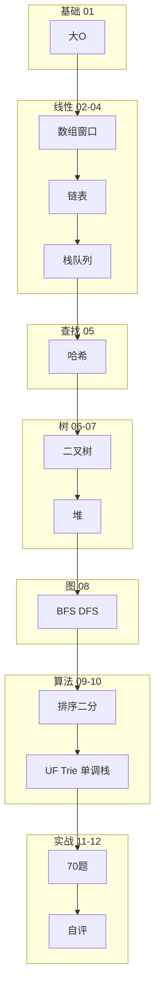

# 面试专题与知识点总表

> **文件编码**：UTF-8。复习索引：详细讲解见对应编号文档。建议学完一轮后逐项自评 **⬜知道 / 🔶会用 / ✅会讲**。  
> 与 [Java 15](../Java/15-补充知识点总表.md)、[Python 15](../Python/15-补充知识点总表.md)、[C++ 15](../C++/15-补充知识点总表.md) 结构对齐，范围为 **数据结构 01～11 全章**。

---

## 0. 读前导读（零基础也能跟上）

### 0.1 用一句话弄懂本章

**面试前 30 分钟速览表**——把 01～11 全部知识点列成可勾选清单，配合 70 题进度，找出「知道但不会讲」的漏洞。

### 0.2 你需要提前知道什么

- 至少 **过一遍** 01～10 各章；11 章 70 题刷过一半以上再用本表自评才有意义
- 不会的点 **回到对应章** 重学，不要只勾表

### 0.3 知识地图（☐→☑）

- [ ] §2～§12 每章 ≥70% 🔶或✅
- [ ] §13.2 八题手写无卡壳
- [ ] 11 章 B 题全部 AC
- [ ] §21 自测 ≥8/10
- [ ] 完成 §19 薄弱项记录

### 0.4 建议学习时长与节奏

**首次**：随 01～11 学习逐项填表；**冲刺**：面试前 7 天按 §17 一日一章 + 本表自评。

### 0.5 学完本章你能做什么

1. 5 分钟定位最弱三章并回章复习
2. 用 §13 结构选型表回答「为什么用堆不用排序」
3. 模拟面试前过 §13.2 必会八题

**生活类比**：**体检报告汇总**——单项化验在 01～11 各章，这里是总表看哪项标红。

---

## 0.1 资料建设进度速查

| 编号 | 文件名 | 建设状态 | 重点内容 |
|------|--------|----------|----------|
| 00 | 学习路线图与说明 | ✅ 已扩充 | 顺序、与语言 13 分工 |
| 01 | 复杂度分析与学习方法 | ✅ 已扩充 | 大 O、刷题四步法 |
| 02 | 数组与字符串 | ✅ 已扩充 | 双指针、滑动窗口 |
| 03 | 链表 | ✅ 已扩充 | 反转、环、合并 |
| 04 | 栈与队列 | ✅ 已扩充 | LIFO/FIFO、括号 |
| 05 | 哈希表 | ✅ 已扩充 | 冲突、两数之和 |
| 06 | 树与二叉树 | ✅ 已扩充 | 遍历、BST |
| 07 | 堆与优先队列 | ✅ 已扩充 | TopK、合并 K 路 |
| 08 | 图论基础 | ✅ 已扩充 | BFS、DFS、拓扑 |
| 09 | 排序与查找算法 | ✅ 已扩充 | 快排归并、二分 |
| 10 | 并查集 Trie 与高级结构 | ✅ 已扩充 | UF、Trie、单调栈 |
| 11 | LeetCode 刷题路线 | ✅ 已扩充 | 70 题清单 |
| 12 | 本总表 | ✅ 已扩充 | 自评索引 |

**图例**：⬜ 知道概念 · 🔶 能写代码 · ✅ 能面试讲清原理与复杂度

---

## 1. 这份文件的作用

- **查漏补缺**：怕漏知识点时逐项勾选
- **面试前 30 分钟**：快速过薄弱结构（链表、树、哈希、二分）
- **定位章节**：不会的点回到 [00～11 章](00-学习路线图与说明.md) 重学
- **与语言路线配合**：算法原理看本系列，手撕模板看 [Java/Python/C++ 13](../Java/13-算法与数据结构基础.md)

---

## 2. 复杂度与学习方法（01）

| 知识点 | 文档 | 掌握标准 | 自评 |
|--------|------|----------|------|
| 大 O 含义 | 01 | 描述增长趋势，非常数精确值 | ⬜ |
| O(1)/O(log n)/O(n)/O(n²) | 01 | 各举一例 | ⬜ |
| 时间 vs 空间权衡 | 01 | 空间换时间举例 | ⬜ |
| 最好/平均/最坏 | 01 | 快排 vs 归并 | ⬜ |
| 递归深度与栈溢出 | 01 | 树深 n 的风险 | ⬜ |
| 刷题四步法 | 01 | 懂→写→题→讲 | ⬜ |
| 画图分析 | 01 | 链表指针、递归树 | ⬜ |
| 主定理（了解） | 01 | 分治 O(n log n) | ⬜ |

---

## 3. 数组与字符串（02）

| 知识点 | 文档 | 掌握标准 | 自评 |
|--------|------|----------|------|
| 连续存储、O(1) 下标 | 02 | 对比链表 | ⬜ |
| 快慢指针 | 02 | 26 去重、27 移除 | ⬜ |
| 对撞指针 | 02 | 两数之和 II、盛水 | ⬜ |
| 滑动窗口 | 02 | 3 最长无重复子串 | ⬜ |
| 固定窗口 | 02 | 438 异位词 | ⬜ |
| 前缀和 | 02 | 238 除自身以外乘积 | ⬜ |
| 原地算法 | 02 | 41 缺失正数 | ⬜ |
| 字符串不可变 | 02 | Python str vs list | ⬜ |
| 字符频次数组 | 02 | 242 异位词 | ⬜ |

**对应刷题**：[11 章](11-LeetCode刷题路线与题型汇总.md) #1～#20

---

## 4. 链表（03）

| 知识点 | 文档 | 掌握标准 | 自评 |
|--------|------|----------|------|
| 节点与 next 指针 | 03 | 画插入删除 | ⬜ |
| 哑节点 dummy | 03 | 21 合并、19 删倒数 | ⬜ |
| 反转链表 | 03 | 迭代三指针 O(n) | ⬜ |
| 快慢指针 | 03 | 876 中点、141 环 | ⬜ |
| 环入口 | 03 | 142 数学推导 | ⬜ |
| 相交链表 | 03 | 160 A+B 走法 | ⬜ |
| 归并排序链表 | 03 | 148 O(n log n) | ⬜ |
| 与数组对比 | 03 | 插入 O(1) vs 查找 O(n) | ⬜ |

**对应刷题**：#29～#38

---

## 5. 栈与队列（04）

| 知识点 | 文档 | 掌握标准 | 自评 |
|--------|------|----------|------|
| 栈 LIFO | 04 | 20 有效括号 | ⬜ |
| 队列 FIFO | 04 | BFS 层序 | ⬜ |
| 用栈实现队列 | 04 | 232 双栈 | ⬜ |
| 用队列实现栈 | 04 | 225 | ⬜ |
| 最小栈 | 04 | 155 辅助栈 | ⬜ |
| 表达式求值 | 04 | 224/227 了解 | ⬜ |
| 单调栈入门 | 04/10 | 739 下一更大 | ⬜ |
| deque 双端队列 | 04 | Python collections | ⬜ |

**对应刷题**：#39～#46

---

## 6. 哈希表（05）

| 知识点 | 文档 | 掌握标准 | 自评 |
|--------|------|----------|------|
| 哈希函数 | 05 | key → 下标 | ⬜ |
| 冲突：链地址/开放寻址 | 05 | 与 dict/HashMap 对应 | ⬜ |
| 负载因子 | 05 | 扩容 rehash | ⬜ |
| O(1) 均摊查找 | 05 | 1 两数之和 | ⬜ |
| set vs map | 05 | 存在性 vs 映射 | ⬜ |
| 频次统计 | 05 | 347 TopK | ⬜ |
| 不可变 key | 05 | tuple 可、list 不可 | ⬜ |
| 与 Redis 键值 | 05 | 工程映射 | ⬜ |

**对应刷题**：#21～#28

---

## 7. 树与二叉树（06）

| 知识点 | 文档 | 掌握标准 | 自评 |
|--------|------|----------|------|
| 二叉树定义 | 06 | 度 ≤ 2 | ⬜ |
| 前/中/后序 | 06 | 递归 + 迭代栈 | ⬜ |
| 层序 BFS | 06 | 102 队列 | ⬜ |
| 最大深度 / 高度 | 06 | 104 递归 | ⬜ |
| 对称 / 相同 | 06 | 101、100 | ⬜ |
| BST 性质 | 06 | 中序有序 | ⬜ |
| 验证 BST | 06 | 98 上下界 | ⬜ |
| 最近公共祖先 | 06 | 236 | ⬜ |
| 路径问题 | 06 | 124 最大路径和 | ⬜ |
| 与 B+ 树索引 | 06 | MySQL 多路平衡 | ⬜ |

**对应刷题**：#47～#58

---

## 8. 堆与优先队列（07）

| 知识点 | 文档 | 掌握标准 | 自评 |
|--------|------|----------|------|
| 完全二叉树 | 07 | 数组存堆 | ⬜ |
| 大顶堆 / 小顶堆 | 07 | parent/child 下标 | ⬜ |
| sift up / down | 07 | 插入删除 O(log n) | ⬜ |
| heapify O(n) | 07 | 建堆 | ⬜ |
| TopK | 07 | 347 维护 size=k | ⬜ |
| 合并 K 路 | 07 | 23 堆 / 分治 | ⬜ |
| 215 第 K 大 | 07/09 | 堆 vs 快排 partition | ⬜ |
| Python heapq | 07 | 小顶堆、neg 大顶 | ⬜ |

---

## 9. 图论基础（08）

| 知识点 | 文档 | 掌握标准 | 自评 |
|--------|------|----------|------|
| 邻接表 / 邻接矩阵 | 08 | 稀疏 vs 稠密 | ⬜ |
| BFS | 08 | 最短步数、层序 | ⬜ |
| DFS | 08 | 连通、路径 | ⬜ |
| visited 防重复 | 08 | 网格与图 | ⬜ |
| 拓扑排序 | 08 | 207 课程表 | ⬜ |
| 环检测 | 08 | DFS 三色 / 拓扑 | ⬜ |
| 岛屿数量 | 08 | 200 网格 DFS | ⬜ |
| Dijkstra 入门 | 08 | 非负权最短路 | ⬜ |
| 与并查集对比 | 08/10 | 仅连通用 UF | ⬜ |

---

## 10. 排序与查找（09）

| 知识点 | 文档 | 掌握标准 | 自评 |
|--------|------|----------|------|
| 稳定性 | 09 | 相等元素相对顺序 | ⬜ |
| 冒泡/选择/插入 | 09 | O(n²)，谁稳定 | ⬜ |
| 快速排序 | 09 | partition + 递归 | ⬜ |
| 归并排序 | 09 | merge，稳定 O(n) 空间 | ⬜ |
| 堆排序 | 09 | 原地 O(n log n) | ⬜ |
| 计数/基数 | 09 | 范围小整数 | ⬜ |
| 二分标准模板 | 09 | 704 | ⬜ |
| lower/upper bound | 09 | 34 左右边界 | ⬜ |
| 二分答案 | 09 | 单调 check | ⬜ |
| 语言默认排序 | 09 | Timsort / sort | ⬜ |

**对应刷题**：#59～#64

---

## 11. 并查集、Trie、单调栈（10）

| 知识点 | 文档 | 掌握标准 | 自评 |
|--------|------|----------|------|
| UnionFind find/union | 10 | 路径压缩 | ⬜ |
| 连通分量 | 10 | 547 省份 | ⬜ |
| Kruskal + UF | 10 | 判环 | ⬜ |
| Trie insert/search | 10 | 208 | ⬜ |
| startsWith 前缀 | 10 | 自动补全场景 | ⬜ |
| 单词搜索 II | 10 | Trie + DFS 剪枝 | ⬜ |
| 单调栈 | 10 | 739 下一更大 | ⬜ |
| 柱状图最大矩形 | 10 | 84 | ⬜ |
| 单调队列 | 10 | 239 窗口最大 | ⬜ |
| LRU 设计 | 10 | 146 哈希+链表 | ⬜ |

---

## 12. 刷题路线（11）

| 知识点 | 文档 | 掌握标准 | 自评 |
|--------|------|----------|------|
| 70 题清单 | 11 | 知道 B/R 标记 | ⬜ |
| 八周计划 | 11 | 按标签推进 | ⬜ |
| 单题六步法 | 11 | 暴力→优化→复杂度 | ⬜ |
| 错题本 | 11 | 模式三句话 | ⬜ |
| 与语言 13 对齐 | 11 | 模板对照 | ⬜ |
| 模拟面试 | 11 | 25 min Medium | ⬜ |

---

## 13. 跨章高频面试题（口述专题）

### 13.1 结构选型

| 场景 | 推荐结构 | 理由 |
|------|----------|------|
| 快速查存在 | 哈希 set | O(1) 均摊 |
| 有序 + 查 | 二分 / BST | O(log n) |
| 前缀字符串 | Trie | 前缀 API |
| 动态连通 | 并查集 | 近 O(1) union |
| TopK | 堆 | O(n log k) |
| 最近更大元素 | 单调栈 | O(n) |
| LRU | 哈希 + 双向链表 | O(1) get/put |

### 13.2 必会手写代码（面试）

| 序号 | 题目 | 章节 |
|------|------|------|
| 1 | 两数之和 | 05 / #1 |
| 2 | 反转链表 | 03 / #29 |
| 3 | 有效括号 | 04 / #39 |
| 4 | 二叉树最大深度 | 06 / #47 |
| 5 | 层序遍历 | 06 / #51 |
| 6 | 二分查找 | 09 / #59 |
| 7 | 快排 partition | 09 |
| 8 | 无重复最长子串 | 02 / #15 |

### 13.3 复杂度口述模板

```text
「我使用 ___ 结构，单次操作 O(___)，总共遍历 ___ 次，
时间 O(___)，额外空间 O(___)。」
```

---

## 14. 与后端工程对照

| 数据结构 | 后端场景 | 章节 |
|----------|----------|------|
| 哈希表 | Redis KV、分片路由 | 05 |
| B+ 树 | MySQL 索引 | 06 |
| 堆 / ZSet | 排行榜、定时任务 | 07 |
| LRU | 缓存淘汰、146 | 10 |
| 图 BFS | 服务依赖层级 | 08 |
| 并查集 | 集群连通 | 10 |
| 排序 | ORDER BY、日志 | 09 |
| 一致性哈希（扩展） | 分布式缓存 | 05/08 |

---

## 15. 学习优先级

### 第一优先级（面试必考）

01 复杂度 → 02 数组窗口 → 03 链表 → 05 哈希 → 06 树 → 09 二分

### 第二优先级

04 栈队列 → 07 堆 → 08 图 → 09 快排归并 → 10 单调栈

### 第三优先级（冲刺）

10 并查集 Trie → 11 70 题精刷 → 语言 14 场景

```text
推荐路径：01→02→03→04→05→06→07→08→09→10→11 + 语言13
面试前：12 总表自评 + 11 错题 + 13.2 八题手写
```

---

## 16. 与三语言 13 / 14 / 15 对照

| 本系列 | Java | Python | C++ |
|--------|------|--------|-----|
| 01～10 原理 | — | — | — |
| 11 70 题 | [Java 13](../Java/13-算法与数据结构基础.md) | [Python 13](../Python/13-算法与数据结构基础.md) | [C++ 13](../C++/13-算法与数据结构C++实现.md) |
| 12 本总表 | [Java 15](../Java/15-补充知识点总表.md) | [Python 15](../Python/15-补充知识点总表.md) | [C++ 15](../C++/15-补充知识点总表.md) |
| 场景设计 | Java 14 | Python 14 | C++ 14 |

---

## 17. 一周复习计划（面试前）

| 天 | 内容 |
|----|------|
| 一 | 01 复杂度 + 02 双指针窗口 + #1～#15 回顾 |
| 二 | 03 链表手写三题 + #29～#35 |
| 三 | 05 哈希 + 06 树遍历 + #47～#51 |
| 四 | 04 栈 + 10 单调栈 + #39～#41 |
| 五 | 09 二分快排 + #59～#64 |
| 六 | 08 图 BFS/DFS + 10 UF/Trie |
| 日 | 12 总表全勾 + 模拟 2 题 + 语言 14 场景 1 题 |

---

## 18. 自评统计表

复制使用，统计 🔶+✅ 数量：

```text
01 复杂度:    ⬜___ 🔶___ ✅___
02 数组字符串: ⬜___ 🔶___ ✅___
03 链表:      ⬜___ 🔶___ ✅___
04 栈队列:    ⬜___ 🔶___ ✅___
05 哈希:      ⬜___ 🔶___ ✅___
06 树:        ⬜___ 🔶___ ✅___
07 堆:        ⬜___ 🔶___ ✅___
08 图:        ⬜___ 🔶___ ✅___
09 排序查找:  ⬜___ 🔶___ ✅___
10 高级结构:  ⬜___ 🔶___ ✅___
11 刷题进度:  __/70 B 题
```

**目标**：每章至少 70% 为 🔶 或 ✅；11 章 B 题全部 AC。

---

## 19. 我的薄弱项记录

```text
日期：
最弱三章：
待重刷 LeetCode 编号：
下次模拟面试：
```

---

## 20. 知识地图



---

**数据结构学习 = 懂原理（01～10）+ 能手写核心操作 + 按 11 章刷够题 + 12 章自评过关。**

---

## 21. FAQ（扩充）

### Q1：12 章和 01～11 章关系？

12 是 **索引与自评**，不是替代原理；不会的点回对应章。

### Q2：每章多少 🔶✅ 算过关？

建议每章 **≥70%** 为 🔶 或 ✅；11 章 B 题全 AC。

### Q3：面试前 30 分钟怎么用本表？

扫 §13.1 选型 + §13.2 八题 + 自评最弱两章。

### Q4：ACM 背景还要过 01 吗？

可速通 01，但必须能 **口述大 O** 与空间栈深。

### Q5：堆和排序都考第 K 大？

都要会讲；215 堆 O(n log k) vs QuickSelect O(n)。

### Q6：图和并查集都连通？

图 BFS/DFS 通用；**仅动态连通** 并查集更简。

### Q7：Trie 面试必考吗？

中频；208 模板 + 工程前缀场景即可。

### Q8：单调栈和 04 栈区别？

04 是 LIFO 基础；10 栈内保持单调求下一更大。

### Q9：70 题不够怎么办？

补 11 章 §4 扩展 + 语言 13 额外题。

### Q10：三语言 15 总表要背吗？

结构对齐；算法原理以 **本系列 12** 为主。

### Q11：B+ 树要手撕吗？

概念级：多叉、叶子链表、范围查询；见 06 章。

### Q12：自评 ⬜ 太多怎么办？

按 §15 优先级回章；先 03 链表 06 树 05 哈希。

---

## 22. 面试口述版（总表）

「我复习数据结构用 **一张总表**：复杂度、数组窗口、链表指针、哈希、树递归、堆 TopK、图 BFS、排序二分、并查集 Trie 单调栈，每块能讲 **何时用、复杂度、一道代表题**。刷题按 70 题清单分标签精刷，不是题海。面试前我会过一遍 **结构选型**：查存在用哈希，有序用二分，TopK 用堆，前缀用 Trie，动态连通用并查集。」

---

## 23. LeetCode 思维六步（跨章速记）

| 标签 | 代表题 | 六步关键词 |
|------|--------|------------|
| 哈希 | 1 | 补数 map、先查后存 |
| 双指针 | 15 | 排序、去重、left/right |
| 窗口 | 3 | 扩 right、收 left、频次 |
| 链表 | 206 | prev/cur/nxt 迭代 |
| 栈 | 20 | 匹配 pop |
| 树 | 102 | BFS `len(q)` 分层 |
| 堆 | 347 | Counter + size=k 小根堆 |
| 图 | 200 | 网格 DFS mark |
| 二分 | 34 | lower + upper |
| 回溯 | 46 | 选递归撤销 |

完整六步见各章 **LeetCode 思维六步** 节与 [11 章 §13](11-LeetCode刷题路线与题型汇总.md)。

---

## 24. 闭卷自测

1. 第一优先级复习哪六章（§15）？
2. 快速查存在用什么？TopK 用什么？
3. 13.2 八题手写哪八道？
4. LRU 146 两结构？
5. BFS 无权最短路为何成立？
6. 快排与归并稳定性？
7. 并查集两优化？
8. Trie 与哈希前缀区别？
9. 70 题 B 题大约几题？
10. 面试前一周 §17 周日做什么？

<details>
<summary>自测参考答案</summary>

1. 01→02→03→05→06→09。
2. 哈希 set/map；堆 size=k 或 ZSet。
3. 1/206/20/104/102/704/快排partition/3 窗口。
4. 哈希定位 + 双向链表顺序。
5. 边权为 1，层序首次到达最少边。
6. 快不稳、归并稳。
7. 路径压缩、按秩合并。
8. Trie 天然 startsWith；哈希需遍历或额外结构。
9. 约 42 题 B。
10. 12 总表全勾 + 模拟 2 题 + 语言 14 场景 1 题。

</details>

---

## 25. 费曼检验

3 分钟讲「如何根据场景选数据结构」（用 §13.1 表）+「你的刷题与自评闭环」。

**提纲**：存在→哈希；有序→二分/BST；TopK→堆；前缀→Trie；连通→UF；原理 01～10 + 70 题 + 12 自评。

---

## 26. 模拟面试 60 秒开场模板

```text
「我系统学过数据结构：线性结构、树、堆、图、排序查找和并查集 Trie。
刷题按 70 题清单分标签，重点链表反转、树层序、哈希、二分边界。
后端上哈希对应 Redis KV，B+ 树对应 MySQL 索引，堆对应 TopK 和定时任务。」
```

---

## 27. 章节 ↔ 文档快速链接

| 自评弱 | 回读文档 |
|--------|----------|
| 复杂度 | [01](01-复杂度分析与学习方法.md) |
| 窗口/双指针 | [02](02-数组与字符串.md) |
| 链表 | [03](03-链表.md) |
| 栈队列 | [04](04-栈与队列.md) |
| 哈希 | [05](05-哈希表.md) |
| 树 | [06](06-树与二叉树.md) |
| 堆 | [07](07-堆与优先队列.md) |
| 图 | [08](08-图论基础.md) |
| 排序二分 | [09](09-排序与查找算法.md) |
| UF/Trie/单调栈 | [10](10-并查集Trie与高级结构.md) |
| 70 题 | [11](11-LeetCode刷题路线与题型汇总.md) |

---

## 28. 各章掌握标准一句话（口述用）

| 章 | 一句话 |
|----|--------|
| 01 | 大 O 描述增长；快排均摊 n log n |
| 02 | 双指针原地；窗口扩收 |
| 03 | dummy 头；反转三指针；快慢环 |
| 04 | 栈匹配；BFS 用 deque |
| 05 | 补数哈希；128 只从起点扩展 |
| 06 | 四种遍历；98 区间 BST |
| 07 | size=k 小根堆 TopK |
| 08 | BFS 无权最短；拓扑入度 |
| 09 | 快排 partition；lower_bound |
| 10 | UF 路径压缩；单调栈下标 |
| 11 | 70 题 B 全 AC |

---

## 29. 手写代码限时标准

| 题 | 目标时间 | 章节 |
|----|----------|------|
| 两数之和 | 8 min | 05 |
| 反转链表 | 10 min | 03 |
| 有效括号 | 8 min | 04 |
| 层序遍历 | 12 min | 06 |
| 二分查找 | 8 min | 09 |
| 快排 partition | 15 min | 09 |
| 无重复最长子串 | 15 min | 02 |
| 最大深度 | 8 min | 06 |

---

## 30. 复杂度口述题库

| 操作 | 标准答 |
|------|--------|
| 哈希查找 | 均摊 O(1) |
| BST 查找 | 平均 O(log n) 最坏 O(n) |
| 堆 push/pop | O(log n) |
| BFS/DFS | O(V+E) |
| 快排 | 均摊 O(n log n) 空间 O(log n) |
| 归并 | O(n log n) 空间 O(n) |
| 二分 | O(log n) |
| 并查集 union | 均摊 O(α(n)) |
| Trie 插入 | O(L) |
| 单调栈 | O(n) |

---

## 31. 第二周复习计划（已学完一轮）

| 天 | 重刷章节 | 题号 |
|----|----------|------|
| 一 | 03 链表 | 29,31,35,36 |
| 二 | 06 树 | 51,57,56 |
| 三 | 05 哈希 | 1,24,25 |
| 四 | 02 窗口 | 3,15 |
| 五 | 09 二分 | 59,61,62 |
| 六 | 10 单调栈 | 739,84 |
| 日 | 12 自评 + 模拟 | 随机 2 B 题 |

---

## 32. 分章自评口述提示（⬜→✅ 对照）

### 01 复杂度
「大 O 忽略常数；快排均摊 n log n 最坏 n²；递归树深 h 空间 O(h)。」

### 02 数组字符串
「快慢指针原地；窗口 valid 再收缩；三数和排序+去重。」

### 03 链表
「dummy 统一头；反转 prev-cur-nxt；环入口相遇后一个走 A+B。」

### 04 栈队列
「括号栈；BFS deque；232 双栈实现队列。」

### 05 哈希
「先查补数再存；128 只从 x-1 不在 set 的 x 扩展。」

### 06 树
「102 层序 for len(q)；98 DFS(lo,val,hi)；236 左右都非空则 root。」

### 07 堆
「第 K 大小根堆 k；heapq 大顶取反；23 三元组破平局。」

### 08 图
「网格入队 mark；207 入度 Kahn；Dijkstra 跳过过时堆项。」

### 09 排序查找
「快排 partition；归并 merge 用 <= 保稳定；lower_bound 左闭右开。」

### 10 高级结构
「UF 路径压缩；Trie is_end；739 单调栈存下标。」

### 11 刷题
「70 B 题 AC；每题七步复盘；八周按标签。」

---

## 33. 模拟面试评分 Rubric（自评）

| 维度 | ✅ 标准 | 自评 |
|------|---------|------|
| 澄清题意 | 30 秒内复述输入输出边界 | ⬜ |
| 暴力 | 能说出暴力及复杂度 | ⬜ |
| 优化 | 点明数据结构 | ⬜ |
| 代码 | 15～25 min Medium 无语法错 | ⬜ |
| 测试 | 主动提边界用例 | ⬜ |
| 复杂度 | 准确 time/space | ⬜ |
| 沟通 | 边写边讲 | ⬜ |

**及格线**：7 项中 ≥5 项 ✅ 可投简历算法轮。

---

## 34. 与 Java/Python/C++ 15 总表对照说明

| 维度 | 数据结构 12 | 语言 15 |
|------|-------------|---------|
| 范围 | 01～11 算法原理+70题 | 语言全家桶 |
| 用途 | 算法面试前速览 | 语言八股查漏 |
| 自评 | ⬜🔶✅ 按结构 | 按语言知识点 |
| 建议 | 先本表再语言 15 | 二面前后 |

---

*配合 [00 学习路线图](00-学习路线图与说明.md) 使用*
