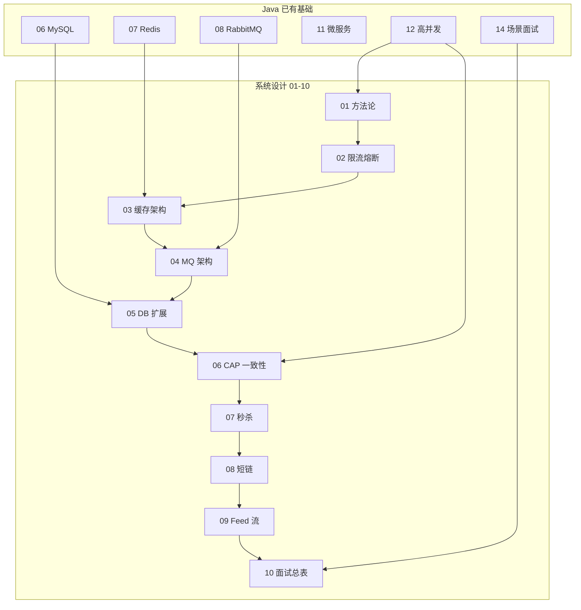

# 系统设计学习路线图与说明

> **文件编码**：本文件夹内所有 `.md` 均为 **UTF-8**。
>
> **定位**：架构设计思维与面试场景题。  
> **2026 LLM Infra 主线**：Serving 限流/缓存/MQ 见 **02～04**；与 [LLMInfra 16 调度](../LLMInfra/16-推理Batch调度与ContinuousBatching.md) 配合。Java 14 为 Web 场景备选。

---

## 0. 读前导读（零基础也能跟上）

### 0.1 用一句话弄懂本章

**系统设计**不是写代码，而是回答「一个 App / 网站在百万用户同时用时，后端怎么拆、怎么扛、怎么不崩」——本章（00）是整个文件夹的**地图**：告诉你学什么、按什么顺序学、和 Java 路线怎么配合。

### 0.2 你需要提前知道什么（真不会就先跳到哪一章）

| 你已会 | 可以直接学本文件夹 |
|--------|-------------------|
| 能写 Spring Boot 接口、用过 MySQL | ✅ 从 [01 方法论](./01-系统设计方法论与面试框架.md) 开始 |
| 完成 Java 04～07（接口 + DB + Redis） | ✅ 01～05 专题可并行 |
| 完成 Java 11～12（微服务、高并发词汇） | ✅ 全系列 |
| 完全没写过后端 | 先学 [Java 04](../Java/04-SpringBoot核心开发.md) |
| 只想考前速记 | 先看 [Java/14](../Java/14-高频场景设计与面试专题.md)，再回来补本系列 |

**不必提前掌握**：分布式中间件源码、LeetCode 系统设计题——本系列会按专题逐步覆盖。

### 0.3 本章知识地图（学完后应能勾选全部 ☐→☑）

- ☐ 能说出本系列 **01～10** 各章一句话职责
- ☐ 能画出「01 方法论 → 02～05 组件 → 06 理论 → 07～09 Case → 10 总表」主线
- ☐ 知道和 **Java 06/07/08/11/12/14** 的对应关系
- ☐ 能判断自己**现在该不该学**（前置清单 §4）
- ☐ 能按 **四步法**（§5）规划一周学习
- ☐ 能完成 **Case Study 学习步骤表**（§5.2）中至少一个 Case 的模拟
- ☐ 闭卷自测（§16）≥ 8/10

### 0.4 建议学习时长与节奏

| 阶段 | 内容 | 建议时长 |
|------|------|----------|
| 第 1 天 | 通读 00 + 对照 Java 进度 | 1～2 小时 |
| 第 2～5 天 | [01 方法论](./01-系统设计方法论与面试框架.md) + 画架构图 | 每天 2～3 小时 |
| 第 2 周 | 02～05 专题（每章 2～3 天） | 配合 Java 07/08/06 复习 |
| 第 3～4 周 | 06 理论 + 07～09 Case | 每 Case 模拟 15 分钟 |
| 持续 | [10 总表](./10-面试专题与知识点总表.md) + Java/14 | 面试前 1 周密集 |

**节奏建议**：不要跳章——02 限流、03 缓存、04 MQ、05 DB 是 07 秒杀 Case 的「零件库」，缺一个讲不完整。

### 0.5 学完本章你能做什么（可验证的具体动作）

1. 打开 [01 章](./01-系统设计方法论与面试框架.md)，用 **4+1 步**为「设计一个微博」写 5 行提纲（每步一行）
2. 对照 §3.1 衔接索引，说出「缓存问题该看哪一章」
3. 在笔记区（§14）填好学习开始日期与 Java 进度
4. 从 §5.2 选一个 Case（建议先 07 秒杀），按步骤表完成第一次 15 分钟口述录音
5. 完成 §16 闭卷自测，错题标记到薄弱专题

---

## 1. 这套资料适合谁

- 已学完或并行学习 **Java 11～12**（微服务 + 高并发概念）的同学
- 目标：能在 **15～45 分钟**内讲清一个后端场景的设计思路（校招/实习/初级后端）
- 想从「会写 CRUD」升级到「能画架构、讲取舍、估容量」

**不适合**：

- 完全零基础、还没写过 Spring Boot 接口（请先学 [Java 04](../Java/04-SpringBoot核心开发.md)）
- 资深架构师查某一中间件源码（本系列偏**方法论 + 经典场景**）
- 只想背标准答案、不愿做需求澄清与估算

### 与 Java 路线的关系

| 维度 | Java 11～14 | 系统设计（本文件夹） |
|------|-------------|----------------------|
| 核心 | 微服务组件、高并发词汇、场景答题模板 | **完整设计流程** + 专题深挖 + 经典 Case Study |
| 深度 | 12 章概念、14 章 3 分钟模板 | 每章 500+ 行：算法、架构图、练习、学完标准 |
| 前置 | Java 01～10 项目实战 | **Java 11～12 必会**，07/08/06 强烈建议 |
| 产出 | 能答场景题 | 能**独立设计**秒杀/短链/Feed 等经典题 |

**建议顺序**：Java 01～10 做项目 → Java 11～12 建立词汇 → **本系列 01～09 专题** → Java 14 + 本系列 10 冲刺面试。

---

## 2. 技术栈与知识主线

```text
需求澄清与容量估算（01）
  → 限流 / 熔断 / 降级（02）
  → 多级缓存与一致性（03，扩展 Java/07）
  → 消息队列架构（04，扩展 Java/08）
  → 数据库扩展 / 读写分离 / 分片入门（05，扩展 Java/06）
  → 分布式一致性与 CAP（06，扩展 Java/12）
  → 经典 Case Study：
      秒杀（07）→ 短链（08）→ Feed 流（09）
  → 面试总表与场景索引（10）
```

与现有资料的映射：



与 [AI Agent](../AIAgent/00-学习路线图与说明.md) 的交叉点：

| 系统设计章节 | AI Agent 关联 |
|--------------|---------------|
| 03 缓存 | RAG 向量缓存、Embedding 结果缓存 |
| 04 MQ | 异步文档索引、批量 Embedding 任务 |
| 06 一致性 | 知识库更新与检索可见性延迟 |
| 07 秒杀 | 高并发限流思路可类比 LLM API 配额 |
| 10 面试 | Agent 项目也需讲架构与降级 |

---

## 3. 学习顺序（按编号）

```text
00 学习路线图（你现在在这里）
 ↓
01 系统设计方法论与面试框架（4+1 步：需求→估算→API→Schema→扩展）
 ↓
02 限流、熔断与降级（令牌桶、滑动窗口、Sentinel/Hystrix）
 ↓
03 缓存架构设计（多级缓存、一致性，扩展 Java/07）
 ↓
04 消息队列架构设计（异步、顺序、幂等，扩展 Java/08）
 ↓
05 数据库扩展与读写分离（分片入门、读副本）
 ↓
06 分布式一致性与 CAP（扩展 Java/12）
 ↓
07 秒杀系统简化设计（完整 Case + Mermaid）
 ↓
08 短链服务设计（Hash、跳转、统计）
 ↓
09 Feed 流与时间线设计（Push vs Pull）
 ↓
10 面试专题与知识点总表（索引 + 场景题）
```

### 阶段目标

| 阶段 | 文档 | 目标 |
|------|------|------|
| 方法 | 01 | 任何题都能按框架拆：需求、估算、API、表、扩展 |
| 防护 | 02 | 讲清限流/熔断/降级区别与算法 |
| 数据层 | 03～05 | 缓存、MQ、DB 扩展的组合拳 |
| 理论 | 06 | CAP、最终一致、分布式事务选型 |
| 实战 | 07～09 | 三个完整 Case，能画架构图 |
| 冲刺 | 10 + Java/14 | 场景题索引、自测清单 |

---

## 3.1 各章衔接索引

| 编号 | 上一章产出 | 本章解决什么 | Java 扩展 |
|------|------------|--------------|-------------|
| 01 | 00 知道学什么 | 面试/design 题标准流程 | 链接 12、14 |
| 02 | 01 会拆题 | 流量过载时如何保护系统 | [12 限流](../Java/12-高并发与分布式系统基础.md) |
| 03 | 02 会保护入口 | 读多写少如何扛 QPS | [07 Redis](../Java/07-Redis核心原理与缓存实战.md) |
| 04 | 03 会缓存读 | 写路径异步、削峰、解耦 | [08 MQ](../Java/08-RabbitMQ与消息队列实战.md) |
| 05 | 04 会异步写 | 单库瓶颈、读写分离、分片 | [06 MySQL](../Java/06-MySQL基础索引与事务.md) |
| 06 | 05 会扩 DB | 一致性、CAP、事务方案 | [12 CAP](../Java/12-高并发与分布式系统基础.md) |
| 07 | 01～06 方法论+组件 | 秒杀综合 Case | 14 秒杀模板 |
| 08 | 07 高并发 Case | 短链 + 统计 + 存储 | 13 哈希表 |
| 09 | 08 读多写多 Case | Feed 推拉模型 | 16 SSE/WS 可选 |
| 10 | 01～09 全部 | 总复习与场景索引 | [14 场景](../Java/14-高频场景设计与面试专题.md) |

---

## 3.2 何时学本系列

### 推荐时机（满足其一即可开始 01）

- [ ] 已完成 Java **04～07**（能写接口 + MySQL + Redis）
- [ ] 已完成 Java **11～12**（微服务、高并发词汇）
- [ ] 即将面试，Java/14 看过但**场景题讲不完整**

### 不建议过早开始

- 还没写过 `UPDATE stock WHERE num >= ?` 事务扣库存 → 先 [05 MyBatis](../Java/05-MyBatis事务与接口工程化.md)
- 不知道 Redis 五种类型 → 先 [07 Redis](../Java/07-Redis核心原理与缓存实战.md)
- 没发过 MQ 消息 → 先 [08 RabbitMQ](../Java/08-RabbitMQ与消息队列实战.md)

### 与 Java/14 的分工

| 文档 | 篇幅 | 侧重 |
|------|------|------|
| [Java/14](../Java/14-高频场景设计与面试专题.md) | 中等 | **怎么答**：3 分钟模板、STAR-F |
| 本系列 01～09 | 长 | **为什么这样设计**：算法、架构、估算、Case |
| 本系列 10 | 索引 | 知识点总表 + 与 Java/14 对照 |

**建议**：Java/14 当「速记手册」；本系列当「系统设计课」。两本配合，14 章考前 2 天刷，01～09 平时系统学。

---

## 4. 必备前置知识清单

### 4.1 语言与框架（Java 01～05）

- Spring Boot 分层：Controller / Service / Mapper
- RESTful、JSON、HTTP 状态码
- `@Transactional` 事务边界

### 4.2 数据与中间件（Java 06～08）

| 知识点 | 最低要求 | 对应 Java 章 |
|--------|----------|--------------|
| 索引、事务 | 能写扣库存 SQL | 06 |
| Redis 缓存 | Cache Aside、TTL、SETNX | 07 |
| RabbitMQ | 发消息、消费者、ACK | 08 |

### 4.3 架构概念（Java 11～12）

- 网关、服务拆分、Feign 调用（概念即可）
- QPS、RT、限流、熔断、幂等、超卖
- CAP、最终一致性（06 章会扩展）

### 4.4 算法（Java 13，可选）

- 哈希表、一致性哈希（短链、分片）
- 链表、堆（Feed 排序）

---

## 5. 推荐学习四步法（每章都做）

1. **通读**：本章解决什么问题？和 Java 哪章对应？
2. **画一张图**：合上书，画出本章核心架构（Mermaid 或纸笔）
3. **做练习**：章节末尾「分级练习」至少完成基础档
4. **模拟面试**：用 01 章框架，**15 分钟**讲一个 Case（07/08/09 轮换）

### 5.0 手把手：第一次打开本文件夹

| 步骤 | 你的动作 | 预期看到什么 | 若不对 |
|------|----------|--------------|--------|
| 1 | 确认 Java 04～07 至少写过 CRUD + Redis | 能解释 Cache Aside | 先补 [Java 07](../Java/07-Redis核心原理与缓存实战.md) |
| 2 | 读 00 全文，填 §14 笔记区 | 有明确「当前章节=01」 | 不要直接跳 07 秒杀 |
| 3 | 打开 01，完成 §0 知识地图勾选 | 能说出 4+1 五步 | 01 §2 再读一遍 |
| 4 | 用 01 框架口述「设计登录」5 分钟 | 能提到限流/缓存 | 02、03 章预告正常 |
| 5 | 按 §6 时间表排进日历 | 4～6 周计划 | 可压缩但勿跳 02～05 |

### 5.2 Case Study 学习步骤总表（07/08/09 通用）

学完 01～06 后，每个 Case 建议按下面 **6 步**走完（每步可对照各章 Case 内「手把手步骤表」）：

| 步骤 | 动作 | 产出 | 对应章节 |
|------|------|------|----------|
| 1 需求澄清 | 向「面试官」问 DAU、读写比、一致性 | 功能列表 + 3 条假设 | [01 §3](./01-系统设计方法论与面试框架.md) |
| 2 容量估算 | 从 DAU 推 QPS、存储、带宽 | 数量级（可差 2 倍） | [01 §4](./01-系统设计方法论与面试框架.md) |
| 3 画 Happy Path | Client → GW → Service → 存储 | 分层 Mermaid | [01 §7](./01-系统设计方法论与面试框架.md) |
| 4 加防护组件 | 标出限流、缓存、MQ、DB 扩展点 | 标注在图上 | [02～05](./02-限流熔断与降级.md) |
| 5 深挖 2 个追问 | 如超卖、热点、幂等 | 2 分钟精答 | Case 章 + 06 |
| 6 录音复盘 | 15 分钟限时讲完 | 卡顿 ≤3 处 | 01 §14 练习 |

**经典三 Case 难度建议**：

| Case | 核心考点 | 建议顺序 |
|------|----------|----------|
| [07 秒杀](./07-秒杀系统简化设计.md) | 限流 + 缓存 + MQ + 防超卖 | 第一个 |
| [08 短链](./08-短链服务设计.md) | 读多写少 + 哈希 + 302 | 第二个 |
| [09 Feed](./09-Feed流与时间线设计.md) | Push/Pull + 粉丝模型 | 第三个 |

---

## 5.1 全路线分级练习总表

| 章节 | 基础 | 进阶 | 挑战 | 参考答案 |
|------|------|------|------|----------|
| 01 | 估算 Twitter 发帖 QPS | 设计 URL Shortener 提纲 | 45min 模拟设计 Feed | 01 篇 §练习 |
| 02 | 对比四种限流算法 | Guava RateLimiter demo | Sentinel 规则配置 | 02 篇 §练习 |
| 03 | 画三级缓存架构 | 写 DB 后删缓存时序图 | 热点 key 互斥方案 | 03 篇 §练习 |
| 04 | 下单发 MQ 时序 | 顺序消息场景列举 | 幂等表设计 | 04 篇 §练习 |
| 05 | 读写分离读路径 | 按 user_id 分表规则 | 跨分片查询问题 | 05 篇 §练习 |
| 06 | CAP 各举一例 | 本地消息表流程 | TCC vs Saga 对比 | 06 篇 §练习 |
| 07 | 秒杀三层防护口述 | 画完整 Mermaid | 压测指标设计 | 07 篇 §练习 |
| 08 | Base62 编码短链 | 302 vs 301 选型 | 亿级 URL 分片 | 08 篇 §练习 |
| 09 | Push/Pull 对比表 | 大 V 发推方案 | 混合推拉架构 | 09 篇 §练习 |

---

## 6. 学习时间参考（每天 2～3 小时）

| 文档 | 建议天数 | 说明 |
|------|----------|------|
| 00 | 0.5 天 | 路线图，规划进度 |
| 01 | 3～4 天 | **核心**，反复练框架 |
| 02 | 2～3 天 | 算法 + Sentinel 概念 |
| 03 | 3～4 天 | 配合 Java/07 复习 |
| 04 | 2～3 天 | 配合 Java/08 |
| 05 | 2～3 天 | 配合 Java/06 |
| 06 | 3～4 天 | 理论多，需举例 |
| 07 | 3～4 天 | 第一个完整 Case |
| 08 | 2～3 天 | 相对独立 |
| 09 | 2～3 天 | 社交类产品 |
| 10 | 持续 | 面试前反复勾选自测 |

**全程约 4～6 周**（在 Java 11～12 已学前提下）。可与 Java/13 算法并行。

---

## 7. 面试/design 题常用量级（建立直觉）

| 指标 | 典型假设（面试可澄清） |
|------|------------------------|
| 日活 DAU | 100 万～1 亿（先问清） |
| 读写比 | 读多写少 100:1 常见 |
| 单条记录 | 短链 ~500B，推文 ~2KB |
| Redis 单节点 | 内存 10～64GB，QPS 10 万级（粗估） |
| MySQL 单表 | 建议单表 **< 500 万～2000 万** 行再考虑分表 |
| 接口 RT | 读 P99 < 200ms，写可异步 |

01 章会教**如何从需求推出 QPS、存储、带宽**——此处仅作预习。

### 7.1 核心术语（首次出现）

**DAU（Daily Active Users，日活）**：一天内至少使用一次产品的用户数。
**生活类比**：**每天进店的顾客数**——设计容量按「最忙那天」估，不是按注册总人数。
**为什么重要**：几乎所有 QPS、存储估算都从 DAU 出发。
**本章用到的地方**：§7 量级表、[01 §4](./01-系统设计方法论与面试框架.md)

**QPS（Queries Per Second，每秒请求数）**：系统每秒处理的请求次数。
**生活类比**：**收银台每秒结几单**——单数越高，要开的窗口越多。
**为什么重要**：限流阈值、服务器台数、Redis 能否扛住，都先看 QPS 数量级。
**本章用到的地方**：§6 时间表、[02 限流](./02-限流熔断与降级.md)

**读写比（Read/Write Ratio）**：读请求与写请求的比例。
**生活类比**：**图书馆**——查书（读）远多于登记新书（写）；社交 Feed 常见 100:1。
**为什么重要**：读多先缓存，写多先 MQ/分库；顺序搞反会过度设计。
**本章用到的地方**：§3 主线、[03 缓存](./03-缓存架构设计.md)

---

## 8. 工具与环境（可选）

| 工具 | 用途 |
|------|------|
| draw.io / Excalidraw | 画架构图 |
| Mermaid（本文档内） | 版本管理友好的图 |
| [Sentinel Dashboard](https://sentinelguard.io/) | 限流熔断 demo |
| Docker | MySQL / Redis / RabbitMQ（见 Java/09） |
| JMeter / ab | 简单压测（07 章） |

---

## 9. 学完后你应该能做哪些事

- [ ] 拿到设计题先**澄清需求**（功能、用户量、一致性、延迟）
- [ ] 完成**容量估算**（QPS、存储、带宽数量级）
- [ ] 画出 **API + 核心表 + 组件** 架构图
- [ ] 讲清限流/缓存/MQ/读写分离/分片的**适用场景与取舍**
- [ ] **15 分钟**讲完秒杀、短链、Feed 中至少两个
- [ ] 知道何时引用 Java/07、08、12 的实战细节

---

## 10. 常见问题 FAQ

### Q1：没做过高并发项目怎么面试？

诚实说明项目量级，强调**设计思路**、**本系列 Case**、以及 Java demo 中的 Redis/MQ 用法。面试官更看重**推理过程**。

### Q2：必须会分布式中间件源码吗？

校招/初级：**会用 + 讲原理 + 知道瓶颈**即可。源码是加分项。

### Q3：和 Java/12 重复吗？

12 章是**入门词汇**；本系列**专题加深**并加完整 Case。建议 12 → 本系列，而非二选一。

### Q4：需要 LeetCode 系统题吗？

本系列覆盖**后端经典场景**（秒杀、短链、Feed）。若目标大厂 SD 轮，可额外看 Grokking the System Design；**本系列 + Java/14 够应对多数国内后端面试**。

### Q5：AI Agent 方向要学吗？

若做 RAG/Agent 项目，**03 缓存、04 异步、06 一致性**直接相关；07 限流思路可用于 LLM API 配额保护。

### Q6：每天只有 1 小时够吗？

够入门但周期拉长：优先 **01 方法论 + 07 秒杀 Case**，02～05 用 Java/12、07、08 补概念；考前再刷 10 总表。

### Q7：需要全部背下来吗？

**不要背段落**。背：4+1 步顺序、四大限流算法名、Cache Aside 顺序、MQ 三大价值、读写分离顺序。其余靠画图画出来。

### Q8：07/08/09 和 01～05 什么关系？

01～05 是**零件**（限流、缓存、MQ、DB）；07～09 是**整车**（秒杀、短链、Feed）。零件不会，整车讲不圆。

### Q9：Mermaid 图必须会写吗？

会读 + 会画方框箭头即可；面试纸笔同结构。本仓库用 Mermaid 是为了版本管理友好。

### Q10：和 DDIA 怎么配合？

00～06 对应 DDIA 前半（存储、复制、分区）；不必读完 DDIA 再学，**遇到 06 理论卡壳再翻 DDIA 对应章**。

### Q11：实习项目很小，面试怎么说？

诚实说明量级，然后：**「若扩展到百万 DAU，我会先……」**——用本系列 Case 展示推理，比虚构大项目可信。

### Q12：Vue / 前端要学吗？

系统设计面试偏**后端**；知道 Client / CDN / 浏览器缓存即可（03 章 CDN 节）。全栈岗可补 [Vue 系列](../../前端学习/Vue/00-学习路线图与说明.md)。

---

## 11. 文档索引速查

| 编号 | 文件名 | 一句话 | 篇幅 |
|------|--------|--------|------|
| 00 | 学习路线图与说明 | 怎么学、前置、与 Java 关系 | 入门 |
| 01 | 系统设计方法论与面试框架 | 4+1 步设计流程 | 详 |
| 02 | 限流熔断与降级 | 流量防护 | 详 |
| 03 | 缓存架构设计 | 多级缓存与一致性 | 详 |
| 04 | 消息队列架构设计 | 异步与可靠 | 详 |
| 05 | 数据库扩展与读写分离 | 分片入门 | 详 |
| 06 | 分布式一致性与 CAP | 理论与方案 | 详 |
| 07 | 秒杀系统简化设计 | Case Study | 详 |
| 08 | 短链服务设计 | Case Study | 详 |
| 09 | Feed 流与时间线设计 | Case Study | 详 |
| 10 | 面试专题与知识点总表 | 复习索引 | 索引 |

---

## 12. 与 Java 14 的章节对照

| Java/14 场景 | 本系列深入章节 |
|--------------|----------------|
| 登录系统 | 01 API 设计 + 02 限流防刷 |
| 商品详情缓存 | 03 全文 |
| 下单 / 超卖 | 04 + 07 |
| 防重复下单 | 04 幂等 + 06 一致性 |
| MQ 重复消费 | 04 全文 |
| 慢接口排查 | 03 + 05 |
| 秒杀 | 07 全文（比 14 更细） |
| 排行榜 | 03 ZSet + 07 热点 |
| 延迟关单 | 04 延迟消息 |

---

## 13. 学习进度自检表

```text
□ 01 方法论：能无提示说出 4+1 步
□ 02：四种限流算法 + 熔断三状态
□ 03：Cache Aside + 穿透/击穿/雪崩
□ 04：至少 3 种幂等手段
□ 05：读写分离延迟 + 分片 key 选择
□ 06：CAP 举例 + 最终一致两种实现
□ 07：秒杀架构图能默画
□ 08：短链生成与跳转流程
□ 09：Push/Pull 适用条件
□ 10：总表自评 ≥ 80% ✅
```

---

## 14. 我的笔记区

```text
学习开始日期：
Java 进度（是否完成 11-12）：
当前章节：
薄弱专题：
计划模拟面试日期：
下周 Case（07/08/09）：
```

---

## 15. 推荐延伸阅读（可选）

- 《Designing Data-Intensive Applications》（DDIA）— 06、05 章理论来源
- 阿里 Sentinel 官方文档 — 02 章实践
- [Java/15 补充知识点总表](../Java/15-补充知识点总表.md) — 八股索引

### 15.1 四周学习计划样例（可打印勾选）

| 周 | 工作日（每天 2h） | 周末（每天 3h） | 产出 |
|----|-------------------|-----------------|------|
| W1 | 00+01 §1～4 | 01 §5～10 + Case 微博 | 4+1 提纲 1 份 |
| W2 | 02 限流 + demo | 03 缓存 + 画三级图 | 限流算法对比表 |
| W3 | 04 MQ + Java08 | 05 DB + 订单 Case | 下单 MQ 时序图 |
| W4 | 06 CAP（若已发布） | 07 秒杀 15min 模拟 | 录音 1 条 |

**每日最小动作**：即使 busy，也完成「画一张图 OR 口述 5 分钟 OR 做 1 道基础练习」三选一。

### 15.2 模拟面试评分 Rubric（自评）

| 维度 | 1 分 | 3 分 | 5 分 |
|------|------|------|------|
| 需求澄清 | 直接开讲 | 问了 DAU | 功能+非功能+假设 |
| 估算 | 无数字 | 有 QPS 数量级 | QPS+存储+带宽 |
| 架构图 | 无图 | 单层 | 五层+读写路径 |
| 深挖 | 无 | 1 个组件 | 2+ 追问有取舍 |
| 表达 | 卡顿 >5 | 基本流畅 | 15min 结构清晰 |

---

---

## 16. 闭卷自测

完成后再看 §16.1 参考答案。

1. **概念** 本系列 01～05 五章分别解决什么问题？各用一句话。
2. **概念** 「4+1 步」中「+1」指什么？为什么放在最后？
3. **概念** 系统设计学习和 Java/14 的分工是什么？
4. **概念** 为什么建议先 02～05 再学 07 秒杀？
5. **概念** 读多写少系统，优化顺序大致是什么？（提示：索引→？→？）
6. **概念** Case Study 六步学习法（§5.2）第 4 步要标出哪些组件？
7. **动手** DAU 100 万，每人每天打开 20 次，估算平均 QPS（写出公式）。
8. **动手** 在笔记区写出你当前 Java 进度，并判断能否开始 01（对照 §3.2）。
9. **综合** 若面试官问「设计商品详情页」，你会指向本系列哪几章？各解决什么？
10. **综合** 你计划用几周学完 01～09？每周 Case 练几个？

### 16.1 自测参考答案

1. **01** 方法论与拆题；**02** 限流熔断降级；**03** 缓存架构；**04** MQ 架构；**05** DB 扩展与读写分离。
2. **+1** 指扩展与深挖（瓶颈、高可用、一致性）；前面四步搭骨架，+1 才谈分库、MQ、限流等，避免一上来堆组件。
3. **Java/14** 偏 3 分钟答题模板与速记；**本系列**偏完整设计流程与 Case 深度。
4. 秒杀综合用到 02 限流、03 缓存、04 MQ、05 库存 DB；缺零件则只能背答案。
5. **索引/SQL 优化 → 缓存 → 读写分离 → 分库分表**（03、05 章详述）。
6. **限流、缓存、MQ、DB 扩展**（对应 02～05）。
7. `100万 × 20 / 86400 ≈ 231 QPS`（峰值再 ×2～5 视业务）。
8. 开放题；若 Java 04～07 未完成，建议先补再开 01。
9. **03** 读路径缓存与三大问题；**02** 热点/爬虫限流；**05** 若数据量大则读写分离；**01** 整体 4+1 框架。
10. 开放题；参考 §6 全程 4～6 周，Case 至少各练 2 遍。

---

## 17. 费曼检验

请在不看资料的情况下，用 **3 分钟**向没学过编程的朋友解释：**「系统设计这门课到底在学什么？」**

**对照提纲（能说到即过关）**：

1. **生活比喻**：像设计一家餐厅——客人太多时要排队（限流）、热门菜先做好放着（缓存）、订单太多让后厨慢慢做（MQ）、一个收银台不够开多个窗口（DB 扩展）。
2. **学习路径**：先学「接到需求怎么拆题」（01），再学各个零件（02～05），最后练完整场景（秒杀、短链、Feed）。
3. **和写代码关系**：不是写更多 if-else，而是画架构图、估流量、说清「为什么用 Redis 不用别的」。

---

## 18. 本章核心速记卡

| 概念 | 一句话 | 类比 |
|------|--------|------|
| 系统设计 | 大流量下后端怎么拆、扛、不崩 | 餐厅扩容 |
| 4+1 步 | 需求→估算→API→表→扩展 | 盖楼五阶段 |
| 02～05 | 限流/缓存/MQ/DB 四大零件 | 餐厅设备 |
| 07～09 | 秒杀/短链/Feed 整车 Case | 完整套餐 |
| Java/14 | 考前速记手册 | 小抄 |

**口诀**：先 01 框架，再 02～05 零件，06 理论，07～09 Case 肌肉记忆，10 + Java/14 考前刷。

---

祝你学习顺利。**系统设计能力 = 需求澄清 + 容量估算 + 组件选型 + 经典 Case 肌肉记忆。**

下一章：[01-系统设计方法论与面试框架](./01-系统设计方法论与面试框架.md)
