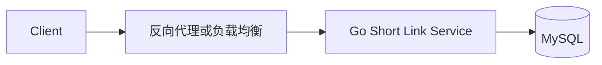
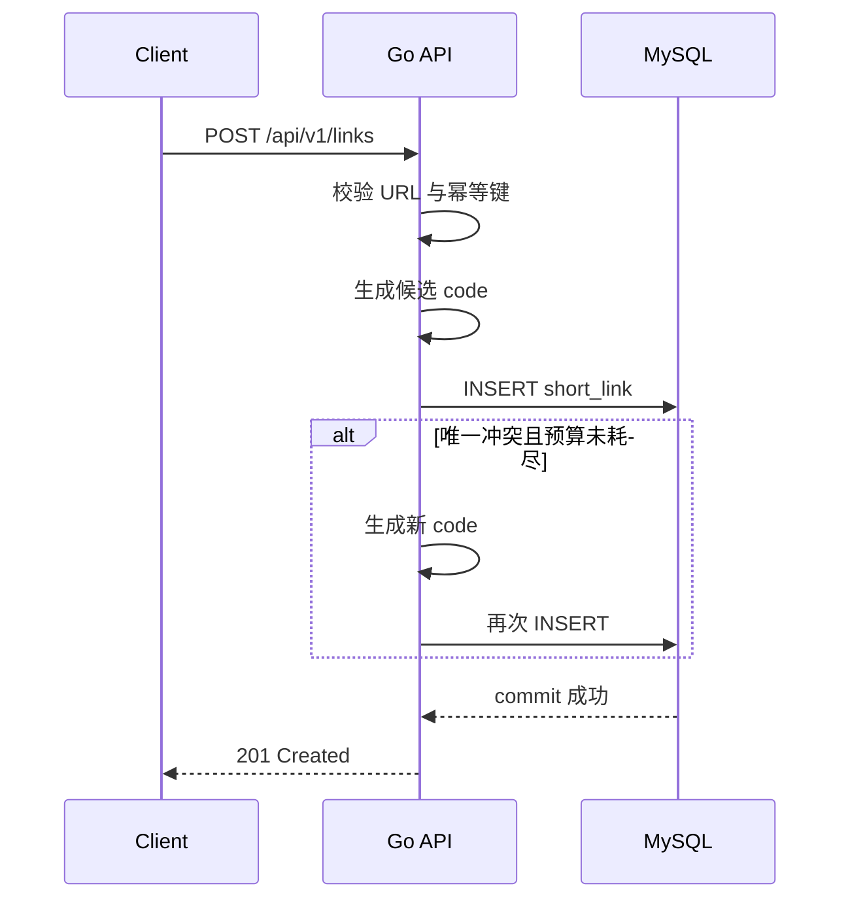
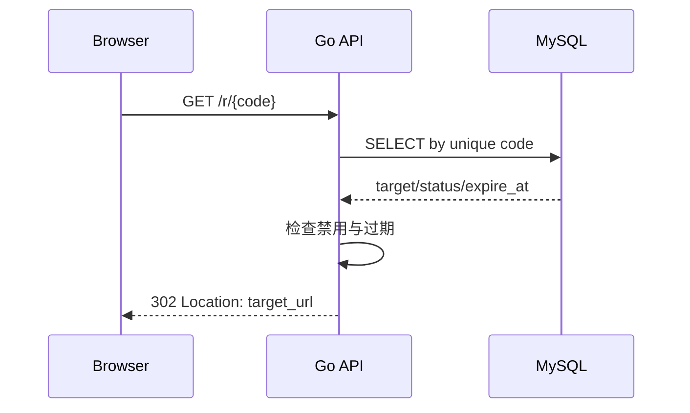
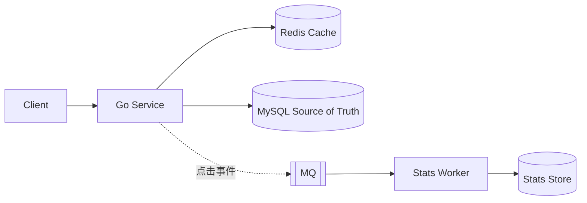

# 系统设计方法论：从需求到可验收方案

> 本章给出一套适合 Go 后端初学者的设计顺序。它是可复用的工作框架，不是唯一的“业界标准答案”。
>
> API、数据模型和高层架构会相互影响，实际设计允许迭代；重点是让每个决定都能追溯到需求、数据或故障边界。

---

## 1. 定位与分层

### 1.1 现在必学

- 区分功能范围与非功能目标
- 用显式假设估算 QPS、并发和存储
- 从访问模式设计 API、数据模型与索引
- 画清高层架构、读路径和写路径
- 先实现最小正确方案，再找瓶颈
- 为外部调用设置超时，为资源设置上限
- 用指标和验收场景验证设计

### 1.2 项目再学

- 缓存、消息队列、读副本和分片
- 多实例部署、故障转移和数据修复
- 更严格的幂等、事件一致性与审计
- 容量压测、故障注入与恢复演练

### 1.3 面试进阶

- 多地域部署与数据主权
- RPO、RTO、SLA/SLO 预算
- 热点、扇出、跨分片查询
- 多方案的成本、复杂度和演进路径

初学阶段不要求一次把所有内容放进图里。能解释“现在为什么不需要 Redis/MQ/分片”同样是设计能力。

---

## 2. 六步设计框架

```text
1. 需求与 SLO
2. 负载与数据估算
3. API 与数据模型
4. 高层架构与读写路径
5. 瓶颈、方案与取舍
6. 可靠性、观测与安全
```


这六步不是瀑布流程：

- 估算结果可能迫使你缩小需求
- API 访问模式可能改变表和索引
- 数据模型可能暴露新的读写路径
- 压测结果可能证明原来的扩展方案没有必要

---

## 3. 第一步：需求与 SLO

### 3.1 先定义范围

功能需求回答“系统做什么”：

- 谁调用？
- 最重要的读写操作是什么？
- 成功结果是什么？
- 哪些功能本期明确不做？

非功能目标回答“做到什么程度”：

- 延迟：关注平均值还是 P95/P99？
- 可用性：允许多长时间不可用？
- 一致性：写后是否必须立即可见？
- 持久性：哪些数据不能丢？
- 安全：谁能读写，如何防滥用？
- 成本：是否有实例、存储或第三方调用预算？

### 3.2 SLI、SLO 与 SLA

SLI 是实际测量值，SLO 是内部目标，SLA 是包含责任的对外承诺。学习项目先写可测量的 SLO，不需要虚构商业 SLA。

### 3.3 短链范围示例

第一版包含：

- 输入长 URL，生成唯一短码
- 访问短码，返回 HTTP 重定向
- 查询自己创建的短链信息
- 支持过期时间和禁用状态

第一版不包含：

- 自定义域名
- 复杂风控和广告归因
- 跨地域多活
- 强实时点击统计

示例 SLO 仅用于练习，不是通用标准：

| 指标 | 练习目标 |
|---|---|
| 跳转成功率 | 30 天 99.9% |
| 跳转延迟 | 服务端 P99 < 100ms |
| 创建延迟 | P99 < 300ms |
| 写后可见 | 创建成功后立即可跳转 |
| 点击统计 | 允许分钟级延迟 |

---

## 4. 第二步：负载与数据估算

估算的目的不是猜中未来，而是确定数量级、找出最可能的瓶颈，并记录假设。

### 4.1 请求量

```text
日请求量 = 活跃用户数 × 人均日操作次数
平均 QPS = 日请求量 / 86400
峰值 QPS = 平均 QPS × 峰值系数
```

峰值系数必须说明来源。没有历史数据时可以暂取 3～5，并标记为待压测、待观测假设。

短链练习假设：

- 每天创建 10 万条短链
- 每天发生 2000 万次跳转
- 普通峰值是平均值的 5 倍

得到：

```text
创建平均 QPS = 100000 / 86400 ≈ 1.2
创建峰值 QPS ≈ 6

跳转平均 QPS = 20000000 / 86400 ≈ 231
跳转峰值 QPS ≈ 1157
```

这个规模完全可以先从单体应用和一个 MySQL 实例开始，不需要因为“读多写少”四个字立刻上 Redis Cluster。

### 4.2 在途请求数不是连接数

Little's Law 的粗略形式：

```text
平均在途请求数 ≈ 吞吐量 × 平均响应时间
```

若 1200 QPS、平均服务时间 50ms：

```text
在途请求约为 1200 × 0.05 = 60
```

这不等于 TCP 连接数，也不等于线程数。HTTP keep-alive、HTTP/2、Go goroutine 和连接池会让这些数字不同。

### 4.3 存储量

```text
原始存储 ≈ 日新增记录 × 保留天数 × 单条大小
实际规划还要加索引、副本、日志和增长余量
```

若每天 10 万条、保留 3 年、单条原始记录约 500B：

```text
记录数 ≈ 1.095 亿
原始数据 ≈ 54.8GB
```

不能只按 55GB 买容量。索引、页利用率、备份、副本和未来增长可能让规划值达到原始数据的数倍。

### 4.4 带宽与估算记录

`出口带宽 ≈ 峰值响应数 × 平均响应字节 × 8`。短链响应很小，带宽通常不是第一瓶颈；图片、视频服务可能相反。每个估算都应同时记录假设、证据和待验证项，数字变化时重新计算，不能把示例背成行业标准。

---

## 5. 第三步：API 与数据模型

API 和模型应从核心访问模式共同推导，可以来回调整。

### 5.1 短链接口

| 方法 | 路径 | 语义 |
|---|---|---|
| `POST` | `/api/v1/links` | 创建短链 |
| `GET` | `/r/{code}` | 302 跳转 |
| `GET` | `/api/v1/links/{id}` | 查询当前用户的链接元数据 |
| `POST` | `/api/v1/links/{id}/disable` | 幂等禁用 |
| `DELETE` | `/api/v1/links/{id}` | 软删除，短码不复用 |

创建请求示例：

```http
POST /api/v1/links HTTP/1.1
Content-Type: application/json
Idempotency-Key: 3ca6f8b8-8b07-4eed-a17b-7c34087a2c86

{"target_url":"https://example.com/docs","expire_at":null}
```

重要语义：

- 参数非法返回 400
- 未认证返回 401
- 管理资源不存在或不属于当前用户统一返回 404，避免泄露资源是否存在
- 短码不存在或已失效返回 404/410，团队需统一
- 触发速率限制返回 429，并可带 `Retry-After`
- 暂时过载或依赖不可用返回 503
- 幂等键必须对应持久化结果，不能只存在进程内

### 5.2 核心表

```sql
CREATE TABLE short_links (
    id           BIGINT       NOT NULL AUTO_INCREMENT,
    short_code   VARCHAR(32) CHARACTER SET ascii COLLATE ascii_bin NOT NULL,
    original_url VARCHAR(2048) NOT NULL,
    user_id      BIGINT       NOT NULL,
    status       TINYINT      NOT NULL DEFAULT 1,
    expires_at   DATETIME(6)  NULL,
    version      BIGINT       NOT NULL DEFAULT 1,
    created_at   DATETIME(6)  NOT NULL DEFAULT CURRENT_TIMESTAMP(6),
    updated_at   DATETIME(6)  NOT NULL DEFAULT CURRENT_TIMESTAMP(6)
                               ON UPDATE CURRENT_TIMESTAMP(6),
    deleted_at   DATETIME(6)  NULL,
    PRIMARY KEY (id),
    UNIQUE KEY uk_short_links_code (short_code),
    KEY idx_user_created (user_id, deleted_at, created_at, id)
);
```

设计依据：

- 跳转按 `short_code` 等值查询，所以它必须有唯一索引
- Base62 区分大小写，因此 `short_code` 使用二进制排序规则
- 用户列表按 `user_id + deleted_at + created_at + id` 做稳定游标分页
- 创建幂等应使用独立的 `idempotency_records`，同时保存请求摘要与最终资源，不能只把 key 放进进程内
- URL 长度、字符集和允许协议应由产品与安全约束决定
- 点击数不直接高频更新到这条热点记录，后续用异步统计处理
- 时间统一存储策略要在团队内明确，例如存 UTC、展示时再转换

完整项目模型见 [Go/10 短链项目上](../Go/10-短链服务项目实战上.md)。本节只展示从访问模式反推主表与索引的方法。

### 5.3 短码方案取舍

| 方案 | 优点 | 风险 |
|---|---|---|
| 随机 Base62 | 无需暴露递增 ID，生成简单 | 必须依靠唯一索引处理碰撞 |
| 自增 ID + Base62 | 唯一且紧凑 | 可枚举，分库后 ID 方案要调整 |
| 内容哈希截断 | 相同 URL 可复用 | 截断碰撞、更新语义和租户隔离复杂 |

第一版可以选择随机 Base62，并把数据库唯一约束作为最终防线：生成、插入、遇到唯一冲突时有限重试。

---

## 6. 第四步：高层架构与读写路径

高层架构不是最后的装饰，而是核心设计产物。

### 6.1 初版架构



这是一个合理起点：应用无状态，MySQL 是真相源。没有测量证据时先不加入 Redis、MQ 和分片。

### 6.2 创建写路径



写路径不变量：数据库提交成功后才能返回 201；重试次数有上限；客户端超时后的重复请求由幂等键处理。

### 6.3 跳转读路径



读路径不变量：无效、禁用、过期短码不能跳转；数据库超时不能被当作 404；目标 URL 只能使用允许的协议。

### 6.4 未来演进图

只有基线证明 MySQL 读成为瓶颈时，才把 Redis 加入读路径；只有点击统计影响跳转延迟时，才把 MQ 加入异步路径。



图中必须区分真相源、缓存和派生数据，不能把所有存储画成等价节点。

---

## 7. 第五步：瓶颈、方案与取舍

### 7.1 按证据定位瓶颈

常见信号与候选方案：

| 证据 | 先检查 | 可能方案 |
|---|---|---|
| 跳转慢且 DB 查询占主导 | 索引、慢 SQL、连接池等待 | 查询优化，之后才考虑缓存 |
| 热门 code 占大部分流量 | 单 key QPS、回源次数 | L1、Redis、副本 key、singleflight |
| 创建接口被滥用 | 用户/IP 分布、拒绝率 | 配额、速率限制、验证码或风控 |
| 点击统计拖慢跳转 | 同步更新耗时、锁等待 | 异步事件、批量聚合 |
| 单表维护困难 | 数据大小、索引、备份时间 | 归档、分区，最后才是分片 |

“行数达到某个数字就分表”不是设计依据。相同的一亿行，在不同记录宽度、索引、查询和硬件下表现完全不同。

### 7.2 决策与复杂度预算

记录“决定、证据、触发重评条件”，包括暂不使用的组件。例如：V1 不使用 Redis，因为压测 P99 达标且 DB 无等待；当延迟或连接池等待超过目标时重评。

每加入一个组件，都要回答谁维护、怎样恢复、如何超时降级、增加哪些指标，以及本地如何测试；否则方案尚未完整。

---

## 8. 第六步：可靠性、观测与安全

### 8.1 故障边界

| 故障 | 不应发生 | 最小处理 |
|---|---|---|
| MySQL 变慢 | goroutine 无限堆积 | deadline、连接池上限、503 |
| 唯一冲突 | 无限生成重试 | 有限重试并记录冲突率 |
| 客户端取消 | 后端继续做无用工作 | 传递 request context |
| Redis 未来不可用 | 全量无上限回源 DB | 熔断、回源并发限制、降级 |
| MQ 未来不可用 | 跳转接口一起失败 | 明确统计可丢、落盘或补偿策略 |

### 8.2 最低指标

- 请求数、状态码、P50/P95/P99
- 当前在途请求和 goroutine 数
- MySQL 查询延迟、错误、连接池等待
- 短码唯一冲突率
- 404、410、429、503 数量
- 创建成功后立即跳转的验收结果

### 8.3 安全边界

- 只允许 `http`、`https`，拒绝 `javascript:` 等危险 scheme
- 限制 URL 长度和请求体大小
- 创建、查询管理接口需要认证和资源所有权校验
- 防止批量扫描和恶意创建
- 记录滥用审计，但日志中避免泄露敏感查询参数
- 若产品公开使用，需要考虑钓鱼、恶意域名举报和封禁流程

短链本质上是开放重定向产品，不能把安全只理解成“有没有 JWT”。

---

## 9. 可运行的 Go 容量估算器

下面程序只使用标准库。保存为 `estimate.go` 后运行：

```bash
go run estimate.go -daily-creates 100000 -daily-reads 20000000 -peak 5 -record-bytes 500 -years 3
```

```go
package main

import (
	"flag"
	"fmt"
)

const secondsPerDay = 86400.0

func main() {
	dailyCreates := flag.Float64("daily-creates", 100_000, "daily create requests")
	dailyReads := flag.Float64("daily-reads", 20_000_000, "daily redirect requests")
	peak := flag.Float64("peak", 5, "peak multiplier")
	recordBytes := flag.Float64("record-bytes", 500, "estimated raw bytes per record")
	years := flag.Float64("years", 3, "retention years")
	flag.Parse()

	if *dailyCreates < 0 || *dailyReads < 0 || *peak < 1 || *recordBytes < 0 || *years < 0 {
		panic("all counts must be non-negative and peak must be >= 1")
	}

	createAvg := *dailyCreates / secondsPerDay
	readAvg := *dailyReads / secondsPerDay
	records := *dailyCreates * 365 * *years
	rawGiB := records * *recordBytes / (1024 * 1024 * 1024)

	fmt.Printf("create avg/peak QPS: %.2f / %.2f\n", createAvg, createAvg * *peak)
	fmt.Printf("read   avg/peak QPS: %.2f / %.2f\n", readAvg, readAvg * *peak)
	fmt.Printf("records: %.0f\n", records)
	fmt.Printf("raw storage: %.2f GiB\n", rawGiB)
	fmt.Println("note: add indexes, replicas, backups and growth headroom separately")
}
```

验收：修改日请求、峰值系数、记录大小和保留时间，确认结论是否改变；不要只运行默认参数。

---

## 10. 设计评审与面试表达

### 10.1 15 分钟分配

| 时间 | 内容 | 产出 |
|---|---|---|
| 0～2 分钟 | 范围与 SLO | 做什么、不做什么、关键目标 |
| 2～4 分钟 | 估算 | 峰值读写 QPS、数据量 |
| 4～7 分钟 | API 与模型 | 核心接口、表、索引 |
| 7～11 分钟 | HLD 与路径 | 架构图、读写时序 |
| 11～14 分钟 | 瓶颈与可靠性 | 两个重点取舍、故障边界 |
| 14～15 分钟 | 总结 | 当前方案和演进触发条件 |

若面试官对某一步追问，应跟随追问深入，不必机械执行时间表。

### 10.2 评审问题

- 范围和假设是否明确？
- SLO 是否可测量？
- 数量级是否能从假设推导？
- API、索引是否支持真实访问模式？
- 真相源、缓存、派生数据是否区分？
- 读写路径和失败路径是否都画清？
- 是否先证明瓶颈再引入复杂组件？
- 超时、重试、队列和连接池是否有上限？
- 是否有指标验证方案有效？
- 安全与滥用是否进入设计，而非事后补丁？

---

## 11. 短链关联与后续章节

- 跳转读压力和缓存一致性：[03-缓存架构设计](./03-缓存架构设计.md)
- 创建防刷、依赖超时和过载保护：[02-限流熔断与降级](./02-限流熔断与降级.md)
- 点击事件异步化：[04-消息队列架构设计](./04-消息队列架构设计.md)
- 数据归档、读副本和分片：[05-数据库扩展与读写分离](./05-数据库扩展与读写分离.md)
- 缓存、事件和副本的一致性：[06-分布式一致性与CAP](./06-分布式一致性与CAP.md)
- 完整题目：[08-短链服务设计](./08-短链服务设计.md)

---

## 12. 复习清单

- [ ] 能说明这套六步框架不是唯一标准，实际会迭代
- [ ] 能把功能需求、SLO 和 SLA 分开
- [ ] 能从显式假设算出平均/峰值 QPS 与原始存储量
- [ ] 知道 `QPS × RT` 是在途请求粗估，不是连接数
- [ ] 能写出短链三个核心 API 和对应索引
- [ ] 能分别画出创建写路径与跳转读路径
- [ ] 能指出 MySQL 是初版真相源，缓存只是未来优化
- [ ] 能用数据说明何时加缓存、MQ 或分片
- [ ] 能列出 MySQL 变慢、客户端取消时的故障边界
- [ ] 能在 15 分钟内讲完短链初版，并说明两个演进触发条件

下一章：[02-限流熔断与降级](./02-限流熔断与降级.md)。先在短链上建立基线，再用它解决真实的过载和依赖故障问题。
