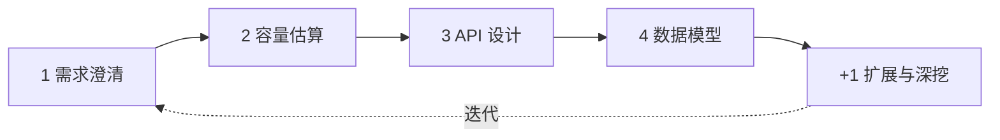
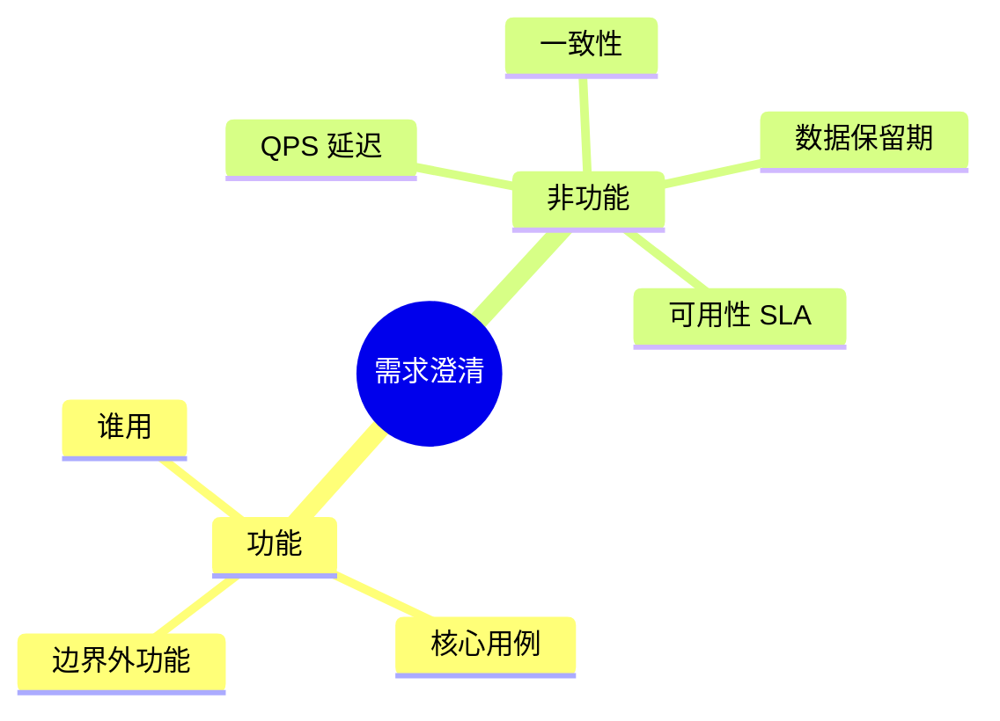
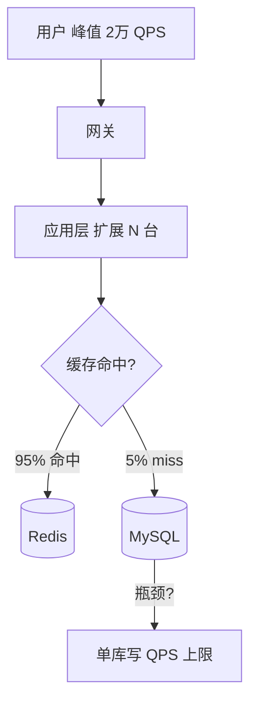
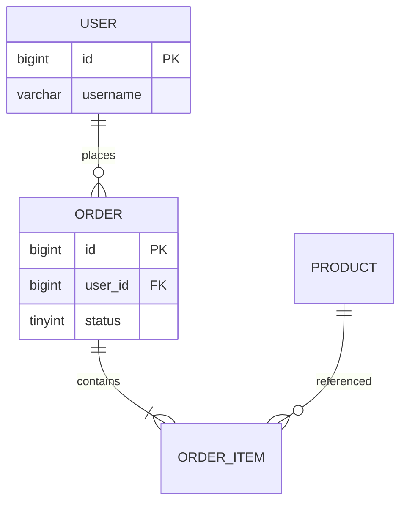
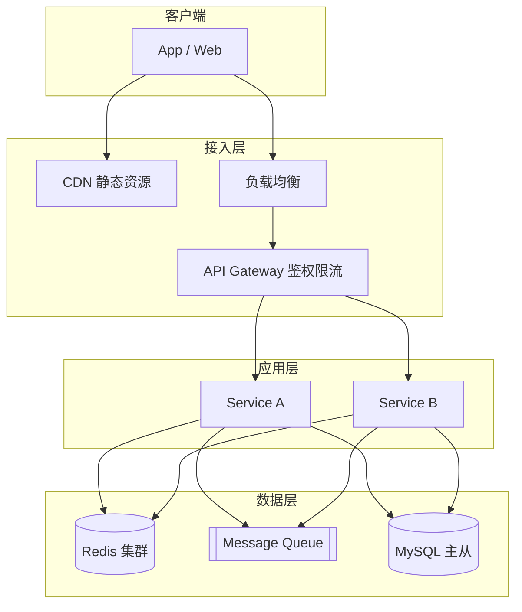
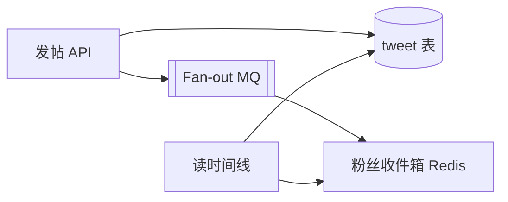

# 系统设计方法论与面试框架

> **文件编码**：UTF-8  
> **前置**：[00 学习路线图](./00-学习路线图与说明.md)、[Java/12 高并发](../Java/12-高并发与分布式系统基础.md)、[Java/14 场景面试](../Java/14-高频场景设计与面试专题.md)  
> **后续**：[02 限流熔断与降级](./02-限流熔断与降级.md)

---

## 0. 读前导读（零基础也能跟上）

### 0.1 用一句话弄懂本章

拿到「设计 Twitter / 秒杀 / 短链」这类题，**不要先想 Redis**——本章教你固定套路 **4+1 步**：先问清需求、估流量、定接口、画表，最后才谈扩展组件。

### 0.2 你需要提前知道什么（真不会就先跳到哪一章）

| 你已会 | 可以直接学本章 |
|--------|----------------|
| [00 路线图](./00-学习路线图与说明.md) 读过 | ✅ 本章 |
| Java 12 高并发词汇（QPS、限流） | ✅ 本章 |
| 能写 REST 接口 + MySQL 表 | ✅ 本章 |
| 完全不知道 HTTP / JSON | 先 [Java 04](../Java/04-SpringBoot核心开发.md) |

### 0.3 本章知识地图（学完后应能勾选全部 ☐→☑）

- ☐ 能默写 **4+1 五步**名称与顺序
- ☐ 能在 5 分钟内从 DAU 推出 **读写 QPS 数量级**
- ☐ 掌握 **需求澄清清单**（§3.2）至少 8 个问题
- ☐ 能设计 **REST API** 表（路径、动词、分页）
- ☐ 能画 **五层架构图**（Client → GW → Service → Redis/MQ → DB）
- ☐ 完成 **微博 Case**（§9）与 **分布式 ID Case**（§10）的步骤表
- ☐ 闭卷自测（§20）≥ 8/10

### 0.4 建议学习时长与节奏

| 阶段 | 内容 | 建议时长 |
|------|------|----------|
| 第 1 天 | §0～§4 需求 + 估算 | 2～3 小时 |
| 第 2 天 | §5～§8 API + Schema + 扩展 | 2～3 小时 |
| 第 3 天 | §9～§10 两个 Case + 画 Mermaid | 3 小时 |
| 第 4 天 | 分级练习 + 15 分钟模拟录音 | 2 小时 |
| 复盘 | 闭卷自测 + 费曼检验 | 30 分钟 |

### 0.5 学完本章你能做什么（可验证的具体动作）

1. 用 4+1 步为「用户登录」写完整提纲（每步 2～3 行）
2. 给定 DAU 200 万、每人每天 10 次请求，手算平均 QPS 与峰值 QPS（×3）
3. 画出「商品详情读路径」Mermaid（含 Cache Aside）
4. 15 分钟口述「简化版微博发帖与阅读」（§9 Case）
5. 说出「单库扛不住」应跳转到 [05 章](./05-数据库扩展与读写分离.md)

---

## 本章与上一章的关系

[00 学习路线图](./00-学习路线图与说明.md) 告诉你**学什么、按什么顺序学**——但拿到一道「设计 Twitter / 设计秒杀」的面试题，很多人仍然不知道从哪开口。

本章是整套系统设计的**总纲**：把 Grokking、大厂 SD 轮、国内后端场景题里反复出现的套路，收敛成你能默写的 **4+1 步框架**（需求 → 估算 → API → Schema → 扩展）。学完本章，后面 02～09 每个专题都知道「插在哪一步」。

---

## 1. 这一章解决什么问题

| 痛点 | 本章产出 |
|------|----------|
| 面试官说「设计一个 XX」，脑子一片空白 | 固定开场：澄清需求 5 分钟 |
| 只会堆 Redis、MQ，没有主线 | 4+1 步按顺序推进，不跳步 |
| 估算 QPS 张口就来错数量级 | 从 DAU 推到读写 QPS 的公式 |
| 画不出架构图 | Mermaid 模板 + 组件分层 |
| 和 Java/14 重复背模板 | 14 是「怎么答」，本章是「怎么设计」 |

**与 [Java/14](../Java/14-高频场景设计与面试专题.md) 的分工**：

- **14 章**：3 分钟 STAR-F 模板、场景速记，考前冲刺用。
- **本章**：15～45 分钟完整设计流程，平时系统训练用。

---

## 2. 系统设计 4+1 步总览

业界常讲的 **4+1** 在本资料中指：

**4+1 步（4+1 Framework）**：需求 → 估算 → API → Schema → 扩展；系统设计面试的标准推进顺序。
**生活类比**：**盖楼五阶段**——先问要几层（需求），估要多少砖（估算），画门在哪（API），定承重柱（表结构），最后才装电梯空调（Redis/MQ/分库）。
**为什么重要**：跳步是面试最大扣分项；一上来就分库分表会被追问「QPS 多少、为什么需要分片」。
**本章用到的地方**：§2 总览、§9～§10 Case Study

```text
1. Requirements   — 需求澄清（功能 + 非功能）
2. Estimation     — 容量估算（QPS、存储、带宽）
3. API Design     — 接口与核心流程
4. Data Schema    — 表结构、缓存、索引
+1. Scale & Deep  — 扩展、瓶颈、高可用、一致性
```



**面试时间分配参考（45 分钟题）**：

| 阶段 | 建议时间 | 产出 |
|------|----------|------|
| 需求澄清 | 5～8 min | 功能列表、约束、假设 |
| 容量估算 | 5～8 min | QPS、存储、带宽数量级 |
| API + 流程 | 8～12 min | 核心接口、读写路径 |
| Schema | 8～10 min | 表、缓存 key、索引 |
| 扩展深挖 | 10～15 min | 缓存/MQ/分库/限流/一致性 |

---

## 3. 第一步：需求澄清（Requirements）

### 3.1 功能需求 vs 非功能需求

**功能需求**：系统要做什么（用户故事）。

**非功能需求**：做到什么程度（性能、可用性、一致性、安全）。



### 3.2 必问的澄清问题清单

设计任何系统前，至少问清下面几类（可口头向面试官确认）：

| 类别 | 示例问题 |
|------|----------|
| 用户规模 | DAU？峰值是平均的几倍？ |
| 读写特征 | 读多写少？写多读少？ |
| 数据规模 | 单条多大？保留多久？ |
| 一致性 | 强一致还是最终一致可接受？ |
| 延迟 | P99 要求？实时还是可异步？ |
| 地理 | 单区域还是多活？ |
| 安全 | 登录？防刷？敏感数据？ |

### 3.3 假设写法（面试加分）

当面试官不回答时，**大声说出你的假设**并继续：

```text
我假设：DAU 1000 万，读写比 100:1，帖子永久存储，
时间线允许秒级延迟，先做单区域部署。
```

这样评委知道你的估算基于什么前提。

### 3.4 案例：设计「短链服务」需求拆解

| 类型 | 内容 |
|------|------|
| 功能 | 长 URL → 短码；短码 302 跳转；可选点击统计 |
| 非功能 | 读极高、写较低；短码全局唯一；低延迟跳转 |
| 不在范围 | 用户登录、自定义别名（可二期） |
| 假设 | 日创建 100 万短链，读:写 = 1000:1 |

---

## 4. 第二步：容量估算（Estimation）

### 4.1 从 DAU 到 QPS

**经典公式**：

```text
日请求量 ≈ DAU × 人均日请求次数
平均 QPS = 日请求量 / 86400
峰值 QPS ≈ 平均 QPS × 峰值系数（常取 2～5，大促取 10+）
```

**例题**：DAU = 1000 万，每人每天刷 Feed 50 次（读），发帖 0.5 次（写）

```text
读：10,000,000 × 50 = 5 亿次/天
读平均 QPS = 500,000,000 / 86400 ≈ 5,800
读峰值 QPS（×3）≈ 17,400

写：10,000,000 × 0.5 = 500 万次/天
写平均 QPS ≈ 58
写峰值 QPS（×3）≈ 174
```

### 4.2 存储估算

```text
总存储 ≈ 记录数 × 单条大小 × 副本系数
```

**例题**：5 年推文，每天 500 万条，每条约 2KB（含元数据）

```text
条数 = 500万 × 365 × 5 ≈ 91.25 亿
存储 ≈ 9.125×10^9 × 2KB ≈ 18 TB（单副本）
三副本 ≈ 54 TB 量级
```

面试**数量级对**即可（10 TB vs 100 TB），不必精确到个位数。

### 4.4 手把手：容量估算六步（面试现场用）

| 步骤 | 你的动作 | 预期产出 | 若不对 |
|------|----------|----------|--------|
| 1 | 从题目或澄清得到 DAU | 如 1000 万 | 回 §3.2 问用户规模 |
| 2 | 列出核心操作及人均次数/天 | 读 50 次、写 0.5 次 | 拆功能需求 |
| 3 | 算日请求 = DAU × 次数 | 读 5 亿/天 | 检查乘法 |
| 4 | 平均 QPS = 日请求 / 86400 | 读 ~5800 | 别忘除 86400 |
| 5 | 峰值 QPS = 平均 × 系数 | ×3 → ~17400 | 大促说明取 10 |
| 6 | 存储/带宽 | TB 级、Gbps 级 | 见 §4.2、§4.3 |

### 4.5 带宽与连接数粗算（进阶）

**带宽**：

```text
峰值带宽 ≈ 峰值 QPS × 平均响应字节数 × 8 bit/byte
例：17400 QPS × 2KB ≈ 34 MB/s ≈ 272 Mbps（仅 API JSON）
```

**连接数**（Web 服务）：

```text
并发连接 ≈ QPS × 平均 RT（秒）
例：17400 × 0.05s ≈ 870 并发（粗估线程/连接池）
```

面试说到 **「几百 Mbps、千级并发」** 即可引导到：加机器、加缓存、限流。

### 4.6 +1 扩展：组件触发条件速查

| 追问信号 | 优先组件 | 跳转章节 |
|----------|----------|----------|
| 读 QPS 高、DB 慢 | Redis 多级缓存 | [03](./03-缓存架构设计.md) |
| 峰值打满、恶意刷 | 限流熔断 | [02](./02-限流熔断与降级.md) |
| 写峰值、异步通知 | MQ | [04](./04-消息队列架构设计.md) |
| 单表千万行、写 TPS 高 | 读写分离/分片 | [05](./05-数据库扩展与读写分离.md) |
| 跨库一致 | CAP、Saga、Outbox | [06](./06-分布式一致性与CAP.md) |

### 4.3 带宽估算

```text
出口带宽 ≈ 峰值 QPS × 平均响应体大小
```

1 MB/s ≈ 8 Mbps。若峰值 1 万 QPS，每响应 10KB：

```text
10,000 × 10KB = 100 MB/s ≈ 800 Mbps
```

### 4.7 常用数量级速查表

| 资源 | 粗算能力（面试用） |
|------|-------------------|
| 单机 Java 接口 | 数百～数千 QPS（视逻辑而定） |
| Redis 单机 | 万～十万 QPS |
| MySQL 单机读 | 数千～万级 QPS（有索引） |
| 单表舒适区 | 500 万～2000 万行（再考虑分表） |
| SSD 随机读 | 毫秒级；内存纳秒～微秒级 |

详见 [00 路线图 §7](./00-学习路线图与说明.md)。

### 4.8 估算 Mermaid：数据流与瓶颈



---

## 5. 第三步：API 设计

### 5.1 RESTful 约定

| 操作 | HTTP | 示例 |
|------|------|------|
| 创建 | POST | `POST /api/v1/urls` |
| 查询 | GET | `GET /api/v1/urls/{code}` |
| 更新 | PUT/PATCH | `PATCH /api/v1/users/{id}` |
| 删除 | DELETE | `DELETE /api/v1/tweets/{id}` |

### 5.2 分页与游标

Feed、时间线类接口避免深分页 `OFFSET 100000`：

```text
GET /api/v1/feed?cursor=eyJsYXN0SWQiOjEyM30&limit=20
```

响应：

```json
{
  "items": [...],
  "nextCursor": "eyJsYXN0SWQiOjEwMH0",
  "hasMore": true
}
```

### 5.3 核心流程：下单 API 时序

```mermaid
sequenceDiagram
    participant C as Client
    participant G as Gateway
    participant O as OrderService
    participant R as Redis
    participant M as MySQL
    participant Q as MQ

    C->>G: POST /orders
    G->>O: 转发 + 限流
    O->>R: SETNX 幂等键
    O->>M: BEGIN; 扣库存; 插订单
    M-->>O: commit
    O->>Q: 发 OrderCreated
    O-->>C: 201 + orderId
```

与 [Java/14 §4 下单流程](../Java/14-高频场景设计与面试专题.md) 对照学习。

### 5.4 Java 接口骨架示例

```java
@RestController
@RequestMapping("/api/v1/orders")
@RequiredArgsConstructor
public class OrderController {

    private final OrderService orderService;

    @PostMapping
    public ResponseEntity<OrderCreateResponse> create(
            @RequestHeader("Idempotency-Key") String idempotencyKey,
            @Valid @RequestBody OrderCreateRequest request) {
        OrderCreateResponse body = orderService.create(idempotencyKey, request);
        return ResponseEntity.status(HttpStatus.CREATED).body(body);
    }

    @GetMapping("/{orderId}")
    public OrderDetailResponse get(@PathVariable Long orderId) {
        return orderService.getDetail(orderId);
    }
}
```

**OrderController 逐行读**：

| 行号/代码 | 含义 | 改错会怎样 |
|-----------|------|------------|
| `@RequestMapping("/api/v1/orders")` | 版本化 API 前缀 | 无版本难兼容演进 |
| `@PostMapping` | REST 创建用 POST | 用 GET 创建违反语义 |
| `Idempotency-Key` 请求头 | 防重复提交 | 缺则双点下单 |
| `@Valid @RequestBody` | JSR303 校验入参 | 非法数据进 Service |
| `201 CREATED` | 创建成功状态码 | 误用 200 不够 RESTful |
| `@GetMapping("/{orderId}")` | 资源路径参数 | 应用 query 也可但不直观 |

### 5.5 错误码与幂等

| HTTP | 场景 |
|------|------|
| 400 | 参数错误 |
| 401 | 未登录 |
| 409 | 重复提交 / 冲突 |
| 429 | 限流 |
| 503 | 降级 / 熔断 |

幂等键设计见 [04 消息队列](./04-消息队列架构设计.md) 与 [Java/14 §30.3](../Java/14-高频场景设计与面试专题.md)。

---

## 6. 第四步：数据模型（Schema）

### 6.1 表设计原则

- 主键：`bigint` 自增或雪花 ID
- 金额：`decimal(10,2)`，Java 用 `BigDecimal`（见 [Java/06](../Java/06-MySQL基础索引与事务.md)）
- 时间：`datetime` + `create_time` / `update_time`
- 状态：有限枚举用 `tinyint`
- 唯一约束：业务幂等号、订单号

### 6.2 短链服务表示例

```sql
CREATE TABLE short_url (
    id          BIGINT PRIMARY KEY AUTO_INCREMENT,
    short_code  VARCHAR(10) NOT NULL,
    long_url    VARCHAR(2048) NOT NULL,
    user_id     BIGINT,
    click_count BIGINT NOT NULL DEFAULT 0,
    expire_at   DATETIME,
    create_time DATETIME NOT NULL DEFAULT CURRENT_TIMESTAMP,
    UNIQUE KEY uk_short_code (short_code),
    KEY idx_user_id (user_id)
);
```

### 6.3 缓存 Key 设计

| 场景 | Key 模式 | TTL |
|------|----------|-----|
| 商品详情 | `product:{id}` | 30min + 随机 |
| 用户 Session | `session:{token}` | 与 JWT 一致 |
| 短链映射 | `url:{code}` | 24h |
| 排行榜 | ZSet `rank:daily` | 按天 |

### 6.5 Schema 设计手把手

| 步骤 | 动作 | 检查点 | 若不对 |
|------|------|--------|--------|
| 1 | 从 API 反推实体 | 一 API 一主表 | 表过多 |
| 2 | 定主键策略 | 雪花 vs 自增 | 分片后自增难扩展 |
| 3 | 加 UNIQUE 业务键 | 幂等号、short_code | 重复数据 |
| 4 | 索引覆盖查询 | `(user_id, create_time)` | 全表扫 |
| 5 | 列缓存 Key | 与表 id 对应 | key 无 TTL |

### 6.6 索引与查询模式对照

| 查询模式 | 索引建议 | 反例 |
|----------|----------|------|
| 用户订单列表 | `(user_id, create_time DESC)` | 仅 user_id |
| 短码跳转 | `UNIQUE(short_code)` | long_url 索引 |
| 时间线 | `(follower_id, tweet_id DESC)` | tweet 全表 |
| 未读数 | Redis 计数，非 SQL count | 大表 COUNT(*) |

### 6.7 ER 关系简图



---

## 7. +1 步：扩展与深挖（Scale）

### 7.1 扩展检查清单

按瓶颈顺序思考（与 02～05 章对应）：

```text
1. 读多？ → 缓存（03）、CDN、读副本（05）
2. 写多？ → 异步 MQ（04）、分库分表（05）
3. 流量尖峰？ → 限流熔断（02）
4. 热点 key？ → 本地缓存 + Redis（03）
5. 跨服务？ → 微服务、网关（Java/11）
6. 一致性？ → 06 章 CAP、最终一致
```

### 7.2 架构分层图（通用模板）



### 7.3 高可用要点

| 组件 | 常见 HA 方案 |
|------|-------------|
| 应用 | 多实例 + 无状态 + 健康检查 |
| Redis | 主从 + 哨兵 / Cluster |
| MySQL | 主从复制 + 自动切换 |
| MQ | 镜像队列 / 集群 |
| 网关 | 多 AZ 部署 |

### 7.4 与 AI Agent 的交叉

设计 RAG 系统时同样适用 4+1：

| 步骤 | RAG 示例 |
|------|----------|
| 需求 | 文档上传、检索问答、引用来源 |
| 估算 | 日均查询 QPS、向量维度、chunk 数 |
| API | `/chat`、`/documents` |
| Schema | 文档表、chunk 表、向量索引 |
| 扩展 | Embedding 缓存（见 [AIAgent](../AIAgent/00-学习路线图与说明.md)）、异步索引 MQ |

### 7.5 面试常用假设默认值（澄清失败时用）

| 系统类型 | DAU | 读写比 | 峰值系数 | 延迟 |
|----------|-----|--------|----------|------|
| 社交 Feed | 1000万～5000万 | 100:1 | ×3 | 时间线 1～2s |
| 电商详情 | 500万 | 1000:1 | ×5 | P99 <200ms |
| 短链 | 100万创建/天 | 1000:1 | ×10 | 跳转 <50ms |
| 秒杀 | 100万库存 | 读:写 100:1 | ×50 | 下单异步可 1s |
| 站内通知 | 1000万 | 20:1 读 | ×3 | 未读数近实时 |

**口述示例**：「若您未指定，我按 DAU 1000 万、读写 100:1、峰值系数 3 估算，后续可调整。」

### 7.6 +1 追问应答索引（扩展）

| 面试官追问 | 30 秒答法 | 章节 |
|------------|-----------|------|
| Redis 挂了？ | 降级读 DB + 限流 + 熔断 | 03、02 |
| MQ 堆积？ | 扩容 consumer + 降级非核心 | 04 |
| 主从延迟？ | 写后读主 | 05 |
| 热点大 V？ | 混合推拉 Feed | 09 |
| 重复下单？ | 幂等键 + 唯一索引 | 04 |
| 跨机房？ | 多活 + 最终一致 | 06 |

---

## 8. 面试表达框架

### 8.1 STAR-F（来自 Java/14，本章用于长设计）

```text
S — 场景与假设（DAU、读写比）
T — 要达成的目标（低延迟、不超卖）
A — 分步设计（4+1 每步 1～2 句）
R — 估算结果（峰值 QPS、存储 TB 级）
F — 故障与降级（Redis 挂了怎么办）
```

### 8.2 15 分钟迷你设计话术模板

```text
【0-3min 需求】
我先确认核心功能：…；假设 DAU …；读写比 …

【3-6min 估算】
读峰值约 … QPS，五年存储 … TB 量级

【6-9min API+表】
核心接口 POST/GET …；主表字段 …

【9-12min 架构】
网关限流 → 服务无状态扩展 → Redis 缓存读 → MySQL 持久化

【12-15min 深挖】
瓶颈在 …；加 MQ 异步 …；一致性采用 Cache Aside …
```

### 8.3 评委常追问点

| 追问 | 指向章节 |
|------|----------|
| 缓存和 DB 不一致？ | [03 缓存](./03-缓存架构设计.md) |
| 怎么限流？ | [02 限流](./02-限流熔断与降级.md) |
| 订单重复提交？ | [04 MQ 幂等](./04-消息队列架构设计.md) |
| 单库扛不住？ | [05 DB 扩展](./05-数据库扩展与读写分离.md) |

---

## 9. 完整 Case Study：简化版「微博发帖与阅读」

### 9.0 手把手步骤表（模拟面试用）

| 步骤 | 你的动作（4+1 对应） | 预期产出 | 若卡住 |
|------|----------------------|----------|--------|
| 1 需求 | 问 DAU、读写比、时间线延迟 | 5000 万 DAU、读:写≈100:1 | 回 §3.2 澄清清单 |
| 2 估算 | 推读 QPS、写 QPS、3 年存储 | ~5.8 万 / ~580 QPS、~27 TB | 回 §4 公式 |
| 3 API | 写 POST 发帖、GET 时间线、POST 关注 | 3 个核心接口 + cursor | 回 §5 |
| 4 Schema | tweet 表 + follow 表 + 索引 | SQL 见 §9.4 | 回 §6 |
| 5 +1 | 标 Pull/Push、MQ fan-out、限流 | Mermaid 见 §9.5 | 预告 [09 Feed](./09-Feed流与时间线设计.md) |
| 6 追问 | 大 V 发帖、热点 tweet | 混合推拉 | [09 §混合](./09-Feed流与时间线设计.md) |

### 9.1 需求（节选）

- 用户发帖、关注、刷关注人的时间线
- 假设：DAU 5000 万，每人每天读 100 次、写 1 次
- 读:写 ≈ 100:1，时间线可接受 1～2 秒延迟

### 9.2 估算

```text
读：5000万 × 100 = 50 亿/天 → 平均 ~5.8万 QPS，峰值 ~17万 QPS
写：5000万 × 1 = 5000万/天 → 平均 ~580 QPS
存储：5000万条/天 × 500B × 365 × 3年 ≈ 27 TB 量级
```

### 9.3 API（核心）

| 方法 | 路径 | 说明 |
|------|------|------|
| POST | `/v1/tweets` | 发帖 |
| GET | `/v1/timeline` | 拉取时间线（cursor 分页） |
| POST | `/v1/follow/{userId}` | 关注 |

### 9.4 Schema

```sql
CREATE TABLE tweet (
    id BIGINT PRIMARY KEY,
    user_id BIGINT NOT NULL,
    content VARCHAR(500) NOT NULL,
    create_time DATETIME NOT NULL,
    KEY idx_user_time (user_id, create_time)
);

CREATE TABLE follow (
    follower_id BIGINT NOT NULL,
    followee_id BIGINT NOT NULL,
    create_time DATETIME NOT NULL,
    PRIMARY KEY (follower_id, followee_id)
);
```

### 9.5 扩展（+1）

- **读路径**：时间线用 Pull 模型 + Redis 缓存近期 tweet id 列表（详见 [09 Feed](./09-Feed流与时间线设计.md) 预告）
- **写路径**：发帖后异步 fan-out 到粉丝收件箱（MQ）
- **热点大 V**：混合推拉（09 章）
- **限流**：发帖接口 [02 令牌桶](./02-限流熔断与降级.md)



---

## 10. 完整 Case Study：简化版「分布式 ID 生成」

### 10.0 手把手步骤表

| 步骤 | 你的动作 | 预期产出 | 若卡住 |
|------|----------|----------|--------|
| 1 需求 | 问 ID 用途、有序性、QPS | 全局唯一、趋势递增、写 1 万/s | §3.2 |
| 2 方案对比 | 列 UUID / 自增 / 雪花 / 号段 | 对比表 §10.2 | 背优缺点 |
| 3 选型 | 选雪花并画 64 bit 结构 | 1+41+10+12 位图 | §10.3 |
| 4 坑 | 时钟回拨、workerId 分配 | 回拨等待 / ZK 分配 | §10.4 |
| 5 +1 | 多 DC、Redis 号段备选 | 简要提及 | 进阶阅读 |

### 10.1 需求

为订单、推文生成全局唯一、趋势递增的 ID（方便 MySQL 索引）。

### 10.2 方案对比

| 方案 | 优点 | 缺点 |
|------|------|------|
| UUID | 简单 | 无序、索引性能差 |
| DB 自增 | 简单有序 | 单点、扩展难 |
| 号段模式 | DB 压力小 | 需双 buffer |
| 雪花算法 | 高性能有序 | 时钟回拨要处理 |

### 10.3 雪花 ID 结构（面试口述）

```text
1 bit 符号 + 41 bit 时间戳 + 10 bit 机器 + 12 bit 序列
```

### 10.4 Java 伪代码

```java
public synchronized long nextId() {
    long now = System.currentTimeMillis();
    if (now < lastTimestamp) {
        throw new IllegalStateException("Clock moved backwards");
    }
    if (now == lastTimestamp) {
        sequence = (sequence + 1) & MAX_SEQUENCE;
        if (sequence == 0) {
            now = waitNextMillis(lastTimestamp);
        }
    } else {
        sequence = 0;
    }
    lastTimestamp = now;
    return ((now - EPOCH) << TIMESTAMP_SHIFT)
            | (workerId << WORKER_SHIFT)
            | sequence;
}
```

生产环境推荐 **Leaf、UidGenerator** 等成熟实现，面试讲清思路即可。

---

## 11. 设计评审自检表（做完 4+1 后过一遍）

| # | 检查项 | 通过？ |
|---|--------|--------|
| 1 | 是否明确了范围外功能？ | ⬜ |
| 2 | 峰值 QPS 是否有数量级估算？ | ⬜ |
| 3 | 读写路径是否分开讲？ | ⬜ |
| 4 | 单点故障是否指出？ | ⬜ |
| 5 | 缓存、MQ、分库是否按需出现（非堆砌）？ | ⬜ |
| 6 | 一致性级别是否说明？ | ⬜ |
| 7 | 监控、降级是否提到？ | ⬜ |

---

## 12. 常见设计模式速查

| 模式 | 场景 | 章节 |
|------|------|------|
| Cache Aside | 读多写少 | 03 |
| Read/Write Through | 缓存即服务 | 03 |
| 异步写 | 通知、索引 | 04 |
| 读写分离 | 读瓶颈 | 05 |
| 分片 | 单表/单库过大 | 05 |
| 熔断降级 | 依赖故障 | 02 |
| 幂等 | 重复请求 | 04 |
| CQRS | 读写模型差异大 | 05、09 |

---

## 13. 工具与白板技巧

### 13.1 白板分层画法

```text
┌─────────────┐
│   Client    │
├─────────────┤
│  LB / GW    │
├─────────────┤
│  Services   │
├─────────────┤
│ Redis │ MQ  │
├─────────────┤
│   MySQL     │
└─────────────┘
```

自上而下画，先画 happy path，再画扩展组件。

### 13.2 Mermaid 在笔记中的用法

本仓库所有 `.md` 用 Mermaid 保存架构图，复习时可渲染。面试现场用纸笔即可，结构同本章图。

---

## 14. 分级练习

### 14.1 基础档

**题 1**：DAU 200 万，每人每天打开 App 10 次，估算平均 QPS 与峰值 QPS（峰值系数取 3）。

**题 2**：列出设计「图书借阅系统」时至少 5 个需求澄清问题。

**题 3**：用 4+1 步为「用户登录」写一行提纲（每步不超过 15 字）。

### 14.2 进阶档

**题 4**：设计 URL Shortener 的 REST API（创建、跳转、统计），写出路径与动词。

**题 5**：每条短链 500B，日新增 100 万，保存 5 年，估算存储（单副本）。

**题 6**：画出「商品详情读路径」Mermaid：Client → Gateway → Service → Redis → MySQL。

### 14.3 挑战档

**题 7**：45 分钟模拟：设计「站内通知系统」（未读数、拉列表、标记已读）。写出完整 4+1 提纲 + 峰值估算。

**题 8**：比较 Push / Pull 时间线在 4+1 哪一步做选型决策？说明理由（预告 [09](./09-Feed流与时间线设计.md)）。

---

## 15. 分级练习参考答案

### 15.1 基础档答案

**题 1**：

```text
日请求 = 2,000,000 × 10 = 2000 万
平均 QPS = 20,000,000 / 86400 ≈ 231
峰值 QPS = 231 × 3 ≈ 693
```

**题 2**（示例）：借阅上限？是否多人预约同一本？借阅时长？逾期罚金？管理员角色？峰值借还 QPS？是否需要全文检索？

**题 3**：

```text
1 需求：注册登录、JWT、退出、防刷
2 估算：登录峰值 QPS（早高峰系数）
3 API：POST /login、POST /logout
4 Schema：user 表 BCrypt 密码；可选 token 黑名单 Redis
+1：网关限流、Redis 黑名单、多实例无状态
```

### 15.2 进阶档答案

**题 4**：

| 方法 | 路径 | 说明 |
|------|------|------|
| POST | `/api/v1/urls` | body: longUrl → shortCode |
| GET | `/r/{code}` | 302 Location |
| GET | `/api/v1/urls/{code}/stats` | 点击数 |

**题 5**：

```text
条数 = 100万 × 365 × 5 = 18.25 亿
存储 ≈ 1.825×10^9 × 500B ≈ 912 GB ≈ 0.9 TB
```

**题 6**：参见本章 §7.2，读路径强调 Cache Aside：先 Redis，miss 再 MySQL 并回写。

### 15.3 挑战档答案

**题 7 提纲**（精简）：

- 需求：站内信、未读角标、分页列表、已读/全部已读；假设 DAU 1000 万，每人每天 20 次拉取、2 条新通知
- 估算：读 2 亿/天 ≈ 2300 平均 QPS；写 2000 万/天；通知保留 90 天
- API：`GET /notifications?cursor=`、`PATCH /notifications/{id}/read`、`GET /notifications/unread-count`
- Schema：`notification(id, user_id, type, payload, read_flag, create_time)` 索引 `(user_id, create_time)`
- +1：未读数 Redis `INCR`；写扩散 MQ；大用户分区；[02](./02-限流熔断与降级.md) 拉列表限流

**题 8**：主要在 **+1 扩展** 与 **需求（延迟/粉丝数）** 步选型：粉丝少 Pull 读关注列表合并；粉丝多 Push 写收件箱。读多写少且大 V 多 → 混合。

---

## 16. 学完标准

- [ ] 能不看资料说出 **4+1 五步** 名称与顺序
- [ ] 能在 5 分钟内从 DAU 推出 **读写峰值 QPS 数量级**
- [ ] 能独立完成 **短链 / 登录 / 通知** 任一题的 API + 核心表
- [ ] 能画 **通用五层架构图**（Client → GW → Service → Redis/MQ → DB）
- [ ] 知道每类追问应跳到 **02～05** 哪一章
- [ ] 模拟一次 **15 分钟** 设计录音，不卡顿超过 3 次
- [ ] 能说清本章与 [Java/14](../Java/14-高频场景设计与面试专题.md) 的分工

---

## 17. FAQ

**Q：面试官只给 15 分钟，还要估算吗？**  
要，哪怕 1 分钟。数量级对说明你有工程直觉；可说「按 DAU 1000 万粗算峰值约 1 万 QPS，后续按此扩展」。

**Q：4+1 和阿里「五步法」一样吗？**  
思想同源：先澄清再高层再细节。名字不重要，**顺序**重要：别一上来就分库分表。

**Q：不会画图怎么办？**  
用方框 + 箭头即可；本章 Mermaid 模板背三个：分层图、时序图、读路径流程图。

**Q：需要背 CAP 吗？**  
本章点到为止；系统讲在 [06 分布式一致性](./06-分布式一致性与CAP.md)（若已发布）与 [Java/12](../Java/12-高并发与分布式系统基础.md)。

**Q：和 LeetCode 系统设计题关系？**  
本系列偏 **国内后端场景**（秒杀、短链、Feed）；国际 SD 题（Parking Lot）也可用 4+1，第一步澄清 OOA 对象即可。

**Q：AI 项目面试能用这套吗？**  
能。RAG 的 ingestion、retrieval、generation 对应 API 与 Schema；向量缓存见 [03](./03-缓存架构设计.md) 与 [AIAgent](../AIAgent/00-学习路线图与说明.md)。

**Q：估算算错了会挂吗？**  
差 2～5 倍通常可接受；要说清**假设**（DAU、峰值系数）。完全差数量级（把百万说成十亿）会暴露无直觉。

**Q：Schema 要写到第几范式？**  
面试**核心表 + 索引**即可；不必展开每个字段类型，除非面试官追问。

**Q：非功能需求有哪些必问？**  
QPS/延迟、一致性、可用性 SLA、数据保留期、地理范围——见 §3.2 清单。

**Q：15 分钟题 API 写几个？**  
**2～4 个核心**即可；其余说「类似 CRUD 省略」。

**Q：带宽估算要吗？**  
有图片/视频/Feed 流时要；纯 API 可先略，面试官追问再算 `QPS × 平均响应体大小`。

---

## 18. 与 Java 章节交叉索引

| 本章话题 | Java 延伸 |
|----------|-----------|
| 估算 + 下单 | [14 场景](../Java/14-高频场景设计与面试专题.md) |
| 高并发词汇 | [12 高并发](../Java/12-高并发与分布式系统基础.md) |
| 表与事务 | [06 MySQL](../Java/06-MySQL基础索引与事务.md) |
| 缓存 | [07 Redis](../Java/07-Redis核心原理与缓存实战.md) |
| MQ | [08 RabbitMQ](../Java/08-RabbitMQ与消息队列实战.md) |
| 微服务分层 | [11 微服务](../Java/11-微服务与SpringCloud基础.md) |

---

## 19. 我的笔记区

```text
本周模拟题目：
估算最弱的类型（读/写/存储/带宽）：
4+1 最容易跳过的步：
下次面试录音日期：
```

---

## 20. 闭卷自测

完成后再看 §20.1 参考答案。

1. **概念** 4+1 五步分别是什么？「+1」解决什么问题？
2. **概念** 功能需求和非功能需求各举 2 例。
3. **概念** 从 DAU 推 QPS 的基本公式是什么？峰值系数通常取多少？
4. **概念** REST 设计里 GET / POST / PATCH 各适合什么操作？
5. **概念** Cache Aside 读路径顺序是什么？
6. **概念** 架构图五层从上到下是什么？
7. **动手** DAU 500 万，每人每天读 50 次时间线，估算平均读 QPS。
8. **动手** 为短链服务写 3 个 API（创建、跳转、统计）的路径与 HTTP 方法。
9. **综合** §9 微博 Case：为什么写路径适合用 MQ fan-out？
10. **综合** 45 分钟面试，各阶段时间如何分配（见 §2 表）？

### 20.1 自测参考答案

1. 需求澄清 → 容量估算 → API 设计 → Data Schema → +1 扩展与深挖；+1 谈限流、缓存、MQ、分库、一致性。
2. 功能：发帖、关注；非功能：P99 延迟、最终一致可接受。
3. `日请求 = DAU × 人均次数`；`平均 QPS = 日请求 / 86400`；峰值 ×2～5。
4. GET 查询；POST 创建；PATCH 部分更新（如标记已读）。
5. 先读缓存 → miss 读 DB → 回写缓存。
6. Client → LB/GW → Services → Redis/MQ → MySQL。
7. `500万×50/86400 ≈ 2894 QPS`。
8. `POST /api/v1/urls`；`GET /r/{code}` 302；`GET /api/v1/urls/{code}/stats`。
9. 粉丝 fan-out 写放大，同步写收件箱慢；MQ 异步扩散，发帖 API 快速返回。
10. 需求 5～8min、估算 5～8min、API 8～12min、Schema 8～10min、扩展 10～15min。

---

## 21. 费曼检验

请在不看资料的情况下，用 **3 分钟**向朋友解释：**「系统设计面试 4+1 步是干什么的？」**

**对照提纲（能说到即过关）**：

1. **盖楼比喻**：先问要盖什么（需求），算要多少材料（估算），门和窗怎么开（API），柱子怎么承重（表），最后才装电梯（Redis/MQ）。
2. **顺序不能乱**：没估 QPS 就分库 = 没问人数就加电梯，会被追问。
3. **产出物**：每步都有面试官看得见的产出——假设列表、数字、接口表、SQL、架构图。

---

## 22. 本章核心速记卡

| 概念 | 一句话 |
|------|--------|
| 4+1 | 需求→估算→API→Schema→扩展 |
| QPS | 日请求 ÷ 86400 × 峰值系数 |
| 五层图 | Client→GW→Service→Redis/MQ→DB |
| cursor 分页 | 比 offset 深分页稳 |

### 22.1 15 分钟模拟检查表（自评）

| 分钟 | 内容 | ☐ |
|------|------|---|
| 0～5 | 需求+假设 | |
| 5～10 | QPS+存储估算 | |
| 10～18 | API+时序 | |
| 18～25 | 表+索引+缓存 key | |
| 25～35 | +1 限流/缓存/MQ/DB | |
| 35～40 | 2 个追问+降级 | |

---

## 下一章预告

[02-限流熔断与降级](./02-限流熔断与降级.md) 解决 **+1 扩展** 里第一道防线：流量过大时如何保护系统。你会学令牌桶、滑动窗口、Sentinel/Hystrix 熔断状态机，以及秒杀场景下限流放在哪一层。

---

*复习时配合 [00 学习路线图](./00-学习路线图与说明.md) §13 进度自检表勾选*
