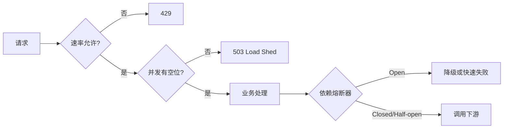
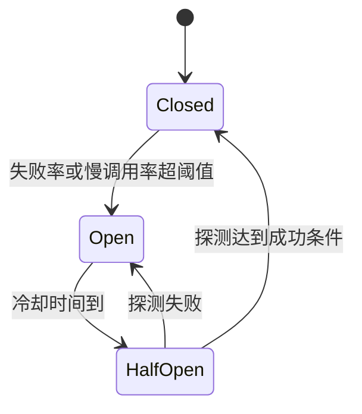

# 流量治理与故障隔离：限流、超时、重试、熔断与降级

> 本章解决两个问题：流量超过容量时怎样保护自己；下游变慢或失败时怎样阻止故障扩散。
>
> 任何保护策略都必须说明保护对象、统计范围、拒绝语义和恢复条件。只记算法名无法形成可靠系统。

---

## 1. 定位与分层

### 1.1 现在必学

- 区分速率、并发、配额、背压和降级
- 为每个外部调用传递 `context` deadline
- 设置连接池、队列和并发上限
- 知道 429 与 503 的区别
- 只对可安全重试的错误做有限重试
- 使用本地令牌桶保护单实例

### 1.2 项目再学

- Redis Lua 分布式限流
- 熔断状态机和半开探测
- 舱壁隔离与 retry budget
- 多层限流、租户配额和热点参数治理
- 故障注入与自动降级

### 1.3 面试进阶

- 全局精确限流与本地近似限流的权衡
- 多地域配额、控制面与数据面
- 自适应并发限制和排队论
- 重试风暴、级联故障和错误预算

---

## 2. 五个容易混淆的概念

| 概念 | 控制什么 | 典型单位 | 超限动作 |
|---|---|---|---|
| Rate limit | 到达/接纳速率 | 请求/秒 | 429、排队或丢弃 |
| Concurrency limit | 同时在处理的工作 | 在途请求数 | 503、短暂排队 |
| Quota | 一段周期内可消费总量 | 次/天、token/月 | 429 或业务拒绝 |
| Backpressure | 下游让上游减速 | 队列水位、消费速率 | 阻塞、减速、暂停读取 |
| Load shedding | 过载时主动丢工作 | 优先级、资源饱和度 | 快速失败或降级 |

库存数量也不是 rate limit。库存是业务可售总量；Redis 预扣库存解决配额和并发正确性，不能替代入口速率限制。

### 2.1 限流、熔断、降级

- **限流**：请求太多，即使依赖健康也只接纳容量范围内的流量。
- **熔断**：依赖正在失败或变慢，暂时停止调用并快速失败。
- **降级**：牺牲部分能力或新鲜度，保住核心路径。



---

## 3. 核心不变量

### 3.1 所有等待都有上限

- 请求总 deadline 有上限
- 单次下游调用超时小于剩余总 deadline
- 重试次数和总耗时有上限
- 队列长度和排队时间有上限
- 并发槽、连接池和 goroutine 产生速率有上限

### 3.2 重试必须满足三个条件

1. 错误是暂时性的，例如连接重置、明确的 503。
2. 操作本身幂等，或请求带有服务端持久化的幂等键。
3. 仍有 deadline 和 retry budget。

参数错误、权限错误和多数业务冲突不应重试。支付、创建订单等非幂等操作不能在语义不清时盲目重放。

### 3.3 拒绝比无界等待更安全

系统已经饱和时，继续排队只会让请求错过 deadline，并占用更多内存。过载保护的目标不是“一个请求都不拒绝”，而是让已接纳请求在 SLO 内完成。

### 3.4 保护阈值来自容量证据

阈值应结合：

- 单实例压测曲线
- 下游数据库或第三方容量
- 实例数与流量分布不均
- 故障时少一台实例的余量
- 可接受延迟与错误率

`单机 QPS × 实例数 × 0.7` 只能是初始假设，不能替代混合链路压测。

---

## 4. Deadline 与取消：第一道防线

Go 服务应从入站请求接收 `r.Context()`，并把它传给数据库、Redis和下游 HTTP 调用。

```go
func loadLink(ctx context.Context, db *sql.DB, code string) (string, error) {
	ctx, cancel := context.WithTimeout(ctx, 200*time.Millisecond)
	defer cancel()

	var target string
	err := db.QueryRowContext(
		ctx,
		`SELECT target_url FROM short_link WHERE code = ? AND status = 1`,
		code,
	).Scan(&target)
	return target, err
}
```

注意：

- 不要用 `context.Background()` 截断请求取消链
- 子调用超时要小于请求剩余时间
- 客户端断开后，数据库和下游调用也应尽快取消
- 超时日志要区分客户端取消、内部 deadline 和依赖超时

只有 timeout 没有并发上限仍可能在超时窗口内堆积大量请求，因此还需要舱壁或并发限制。

---

## 5. Rate limit 算法

### 5.1 固定窗口

把时间分成固定区间，每个区间最多接纳 `N` 次。

优点：实现和存储成本低。
缺点：边界附近可能在一个很短的滚动时间段内接纳约 `2N` 次。

Redis 实现不能把 `INCR` 和首次 `EXPIRE` 当成两个无保护命令；进程在中间失败会留下无过期 key。应使用 Lua，或把时间桶编码进 key 并原子设置过期。

### 5.2 滑动窗口

- 滑动日志保存每次请求时间，精确但内存和操作成本高
- 分桶计数用多个小窗口近似，成本更可控

Redis ZSET 的“删旧记录、加入当前记录、计数、设置 TTL”必须在 Lua 中作为一次原子决策。还要明确被拒请求是否进入统计；两种语义都可以，但不能无意中让攻击请求长期挤占窗口。

### 5.3 令牌桶

令牌以速率 `r` 生成，容量为 `B`。请求消耗令牌：

- 长期平均速率受 `r` 控制
- 空闲时最多积累 `B`，因此允许受控突发
- 无令牌时可立即拒绝或在有界时间内等待

适合大多数 API 入口和客户端调用保护。

### 5.4 漏桶与整形

请求先进入有界队列，消费者以较稳定速率处理。适合第三方短信、邮件等要求平滑输出的场景。

队列必须有长度和等待上限；无界队列只是把失败从请求阶段推迟到内存耗尽阶段。

### 5.5 算法不是场景的唯一答案

| 场景 | 常见起点 | 还要考虑 |
|---|---|---|
| 单实例 API | 本地令牌桶 | 多实例总量会随实例数变化 |
| 用户公平配额 | 用户维度令牌桶/滑动窗口 | key 数量和恶意身份 |
| 第三方 API | 令牌桶 + 并发上限 | 对方 429、重试时间 |
| 全局严格配额 | 集中式原子决策 | Redis 成为依赖和延迟成本 |
| 极高吞吐入口 | 各实例本地近似限流 | 配额误差与动态分配 |

---

## 6. 正确的 Redis Lua 令牌桶语义

下面脚本使用 Redis `TIME`，避免不同应用实例时钟偏差。状态保存在一个 Hash 中；补充和扣减在 Redis 内原子完成。

参数：

- `KEYS[1]`：限流 key，例如 `rate:{user:42}:create`
- `ARGV[1]`：每秒补充速率
- `ARGV[2]`：桶容量
- `ARGV[3]`：本次成本
- `ARGV[4]`：空闲状态 TTL，毫秒

```lua
local key = KEYS[1]
local rate = tonumber(ARGV[1])
local capacity = tonumber(ARGV[2])
local cost = tonumber(ARGV[3])
local ttl_ms = tonumber(ARGV[4])

if rate <= 0 or capacity <= 0 or cost <= 0 or cost > capacity then
    return redis.error_reply("invalid token bucket arguments")
end

local now = redis.call("TIME")
local now_ms = now[1] * 1000 + math.floor(now[2] / 1000)
local state = redis.call("HMGET", key, "tokens", "last_ms")

local tokens = tonumber(state[1])
local last_ms = tonumber(state[2])
if tokens == nil then tokens = capacity end
if last_ms == nil then last_ms = now_ms end

local elapsed = math.max(0, now_ms - last_ms)
tokens = math.min(capacity, tokens + elapsed * rate / 1000)

local allowed = 0
if tokens >= cost then
    tokens = tokens - cost
    allowed = 1
end

redis.call("HSET", key, "tokens", tokens, "last_ms", now_ms)
redis.call("PEXPIRE", key, ttl_ms)
return {allowed, tostring(tokens), now_ms}
```

语义：只有被接纳的请求消耗 token；被拒请求不消耗。TTL 应大于桶从空补满所需时间，并留有空闲余量。

使用 Redis Cluster 时，一个限流状态 key 仍只落到一个 slot。Cluster 能分散不同 key，不能自动分散单个热点 key。单个全局 key 过热时，应考虑分层配额、本地预分配或专用限流服务，而不是简单“加 Cluster”。

---

## 7. Concurrency limit 与舱壁

并发上限保护的是同时占用的稀缺资源，例如数据库连接、昂贵计算或第三方调用。

Go 中可用有界 channel 实现非阻塞 semaphore：成功发送表示获得槽位，`default` 分支表示已满，结束后接收一个值释放。不同依赖应使用不同的 semaphore、HTTP transport、连接池或任务队列；这就是舱壁，不必绑定到线程池模型。

---

## 8. 重试、退避与 retry budget

### 8.1 指数退避加 full jitter

第 `n` 次重试的最大等待时间可按指数增长，再在 `[0, maxDelay]` 中随机选择：

```text
cap(n) = min(maxBackoff, base × 2^n)
sleep = random(0, cap(n))
```

jitter 防止大量客户端在相同时间再次冲击下游。

### 8.2 Go 落地顺序

循环最多 `maxAttempts` 次：调用失败后先用分类函数判断是否可重试，再计算有上限的 full jitter；使用 timer 并同时监听 `ctx.Done()`。每次 attempt 都记录指标，deadline 不足以完成下一次调用时立即停止。生产代码还要防止指数计算溢出。

### 8.3 Retry budget

即使每个请求只重试两次，故障时也可能把流量放大三倍。可规定一个滚动窗口内：

```text
重试请求数 ≤ 原始请求数 × 10%
```

预算耗尽后停止重试，直接返回或降级。具体比例由业务和错误预算决定，10% 只是示例。

---

## 9. 熔断器

### 9.1 三个状态



- **Closed**：正常调用并统计结果
- **Open**：不调用下游，快速失败
- **Half-Open**：只允许少量探测请求

### 9.2 统计必须分类

不应把所有错误都计入熔断：

- 连接错误、超时、5xx 通常代表依赖问题
- 业务 4xx 通常不代表依赖故障
- 调用者主动取消要单独统计
- 慢调用即使最终成功，也可能耗尽资源

### 9.3 熔断不是恢复方案

熔断器只阻止继续施压。下游仍需要修复、扩容或恢复；上游需要明确 fallback 是否正确。对短链跳转，数据库故障时不能把“找不到短码”当 fallback，因为这会把依赖故障伪装成业务 404。

---

## 10. 降级与 HTTP 语义

| 情况 | 常见响应 |
|---|---|
| 单用户请求过快 | 429 + 可选 `Retry-After` |
| 服务整体过载 | 503 + 可选 `Retry-After` |
| 非核心推荐不可用，但主体完整 | 200，响应中可标记推荐缺失 |
| 核心数据无法确认 | 503/明确错误，不能伪装 200 |
| 异步任务已可靠接收 | 202 + task/event ID |

降级返回 200 只适用于请求核心语义仍然成功的情况。例如商品详情成功、推荐为空可以是 200；支付结果未知不能简单返回“支付失败”。

---

## 11. 可运行 Go 实验：速率与并发双重保护

创建空目录后执行：

```bash
go mod init resilience-demo
go get golang.org/x/time/rate
```

保存为 `main.go`：

```go
package main

import (
	"context"
	"log"
	"net/http"
	"time"

	"golang.org/x/time/rate"
)

type gate struct {
	limiter *rate.Limiter
	sem     chan struct{}
}

func (g *gate) wrap(next http.Handler) http.Handler {
	return http.HandlerFunc(func(w http.ResponseWriter, r *http.Request) {
		if !g.limiter.Allow() {
			w.Header().Set("Retry-After", "1")
			http.Error(w, "rate limited", http.StatusTooManyRequests)
			return
		}

		select {
		case g.sem <- struct{}{}:
			defer func() { <-g.sem }()
		default:
			w.Header().Set("Retry-After", "1")
			http.Error(w, "server overloaded", http.StatusServiceUnavailable)
			return
		}

		ctx, cancel := context.WithTimeout(r.Context(), 800*time.Millisecond)
		defer cancel()
		next.ServeHTTP(w, r.WithContext(ctx))
	})
}

func work(w http.ResponseWriter, r *http.Request) {
	select {
	case <-time.After(100 * time.Millisecond):
		_, _ = w.Write([]byte("ok\n"))
	case <-r.Context().Done():
		http.Error(w, "deadline exceeded", http.StatusGatewayTimeout)
	}
}

func main() {
	g := &gate{
		limiter: rate.NewLimiter(10, 20),
		sem:     make(chan struct{}, 4),
	}

	mux := http.NewServeMux()
	mux.Handle("GET /work", g.wrap(http.HandlerFunc(work)))
	srv := http.Server{
		Addr:              ":8080",
		Handler:           mux,
		ReadHeaderTimeout: 2 * time.Second,
	}
	log.Println("listening on http://localhost:8080")
	log.Fatal(srv.ListenAndServe())
}
```

运行 `go run .` 后并发请求 `/work`。该实验中：

- 长期接纳速率约 10 次/秒
- 空闲后允许最多 20 个 token 的受控突发
- 同时处理最多 4 个请求
- 速率超限返回 429，并发饱和返回 503

验收时分别统计 200、429、503，不能只看“服务有没有崩”。

---

## 12. 多层保护、安全与热点

| 层 | 保护对象 | 常见维度 |
|---|---|---|
| CDN/WAF | 边缘与源站 | IP、网络/应用攻击特征 |
| 网关 | 整个服务集群 | 路由、租户、用户 |
| 应用 | 具体业务资源 | 接口、用户、热点参数 |
| 依赖客户端 | 下游服务 | 并发、超时、重试预算 |
| Worker | 队列消费者和数据库 | 批量、消费速率、队列水位 |

CDN/WAF 能吸收或过滤部分流量，但不能概括为“自动防住所有 DDoS”。

登录防刷不能只按用户名失败次数硬锁账号，否则攻击者可锁定他人。应组合 IP、设备、账号、渐进延迟、验证码、异常通知，并避免泄露账号是否存在。

单个 Redis key 只落到一个分片，Cluster 不能自动拆散热点。可用 L1、`singleflight`、读副本、副本 key、参数级并发限制或业务拆 key；副本和拆分会引入失效、版本与聚合成本，需结合 [03 缓存架构](./03-缓存架构设计.md) 设计。

---

## 13. 观测与验收

### 14.1 指标

- 请求状态码、在途请求、rate/concurrency 拒绝数
- 依赖延迟、超时、重试次数与 retry budget 耗尽数
- 熔断状态与切换次数、队列深度和最老消息年龄

指标要按有限标签聚合，不能直接把用户 ID、URL 等高基数值作为 Prometheus label。

### 14.2 四个故障实验

1. 将下游延迟提高到超过 deadline，确认请求按时取消，goroutine 不持续增长。
2. 让下游连续返回 503，确认重试受次数和预算限制。
3. 用高并发打满 semaphore，确认快速返回 503，而不是无界排队。
4. 打开熔断器后恢复下游，确认只通过少量半开探测并最终关闭。

### 14.3 验收问题

- 拒绝发生在资源耗尽之前吗？
- 429 与 503 是否能被客户端区分？
- 重试是否放大流量，放大多少？
- Redis 限流依赖故障时采用 fail-open 还是 fail-closed？为什么？
- 降级结果是否仍满足核心业务语义？

---

## 14. 短链关联

| 短链场景 | 建议保护 |
|---|---|
| 匿名创建短链 | IP 速率 + 全局容量 + 请求体上限 |
| 登录用户创建 | 用户速率 + 日配额 |
| 热门短码跳转 | 并发上限、缓存、热点 key 治理 |
| 随机扫描短码 | IP/设备风控、404 速率监控 |
| MySQL/Redis 变慢 | deadline、舱壁、熔断、受控回源 |
| 点击统计 | 有界异步队列、背压、可说明的降级 |

短链跳转的核心数据无法读取时应返回依赖故障，而不是假装短码不存在。点击统计失败则可以根据产品要求降级，因为它不是完成跳转的前置条件。

---

## 15. 复习清单

- [ ] 能区分 rate、concurrency、quota、backpressure 和 load shedding
- [ ] 能解释库存上限为什么不是速率限制
- [ ] 能把请求 `context` 传到 DB、Redis 和下游 HTTP
- [ ] 知道哪些错误和操作可以重试
- [ ] 能解释指数退避、jitter 和 retry budget
- [ ] 能对比固定窗口、滑动窗口、令牌桶和漏桶
- [ ] 能说明 Redis Lua 为什么要原子完成补充与扣减
- [ ] 知道 Redis Cluster 不能自动分散单个热点 key
- [ ] 能画 Closed、Open、Half-Open 三态
- [ ] 能说明 Go 舱壁为何不等于创建更多 goroutine
- [ ] 能正确选择 429、503 和 200 降级响应
- [ ] 能在短链上完成 deadline、限流、并发保护和故障实验

下一章：[03-缓存架构设计](./03-缓存架构设计.md)。缓存会降低读压力，也会引入失效、热点和故障回源的新风险。
