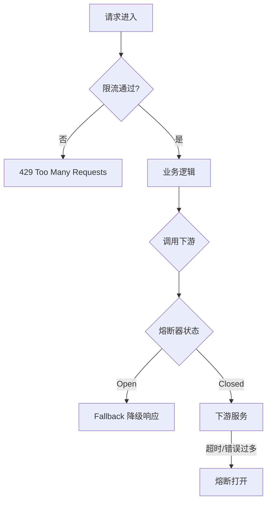
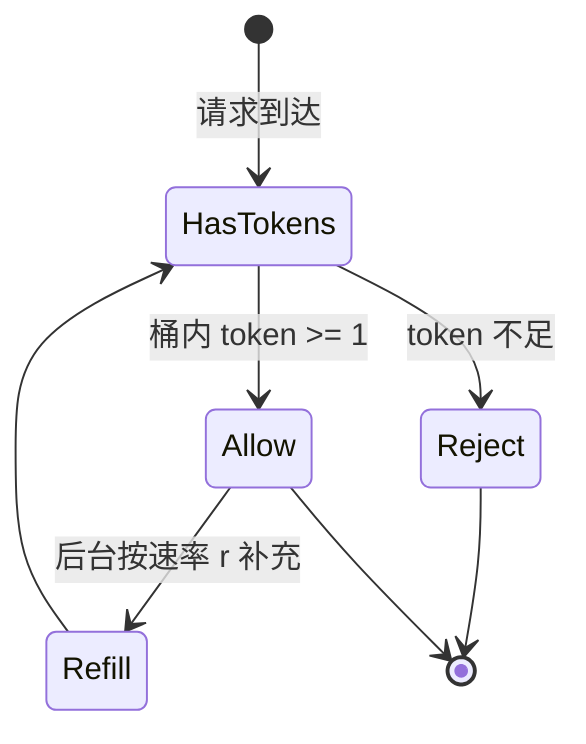
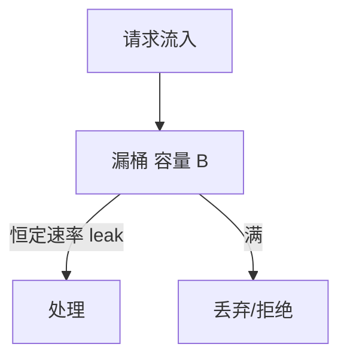
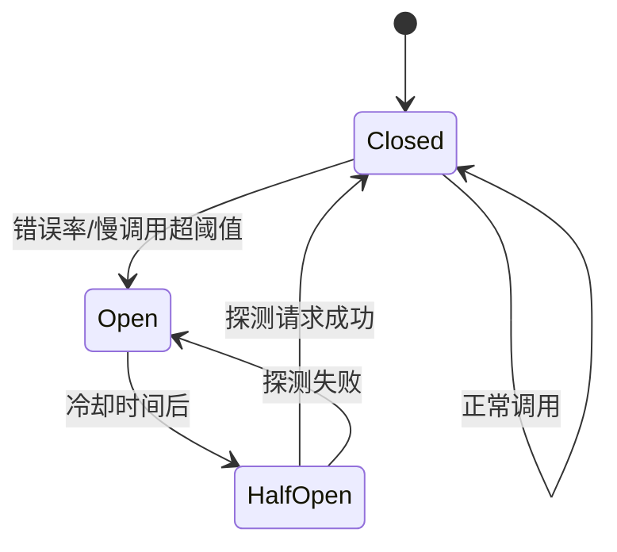
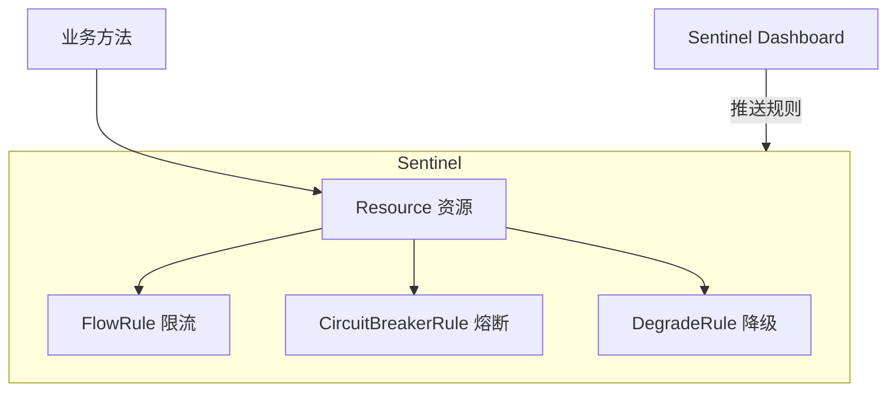
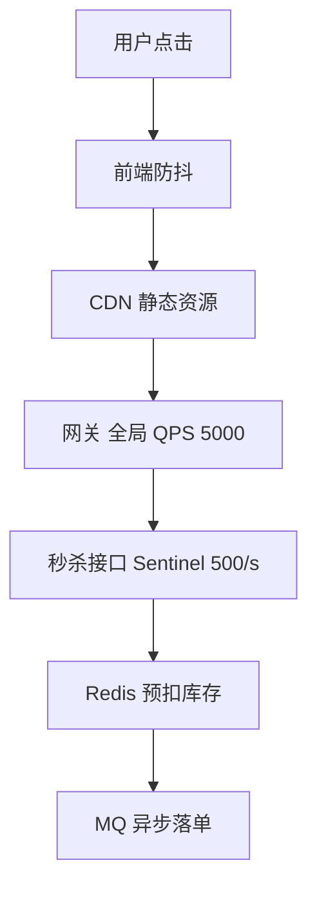
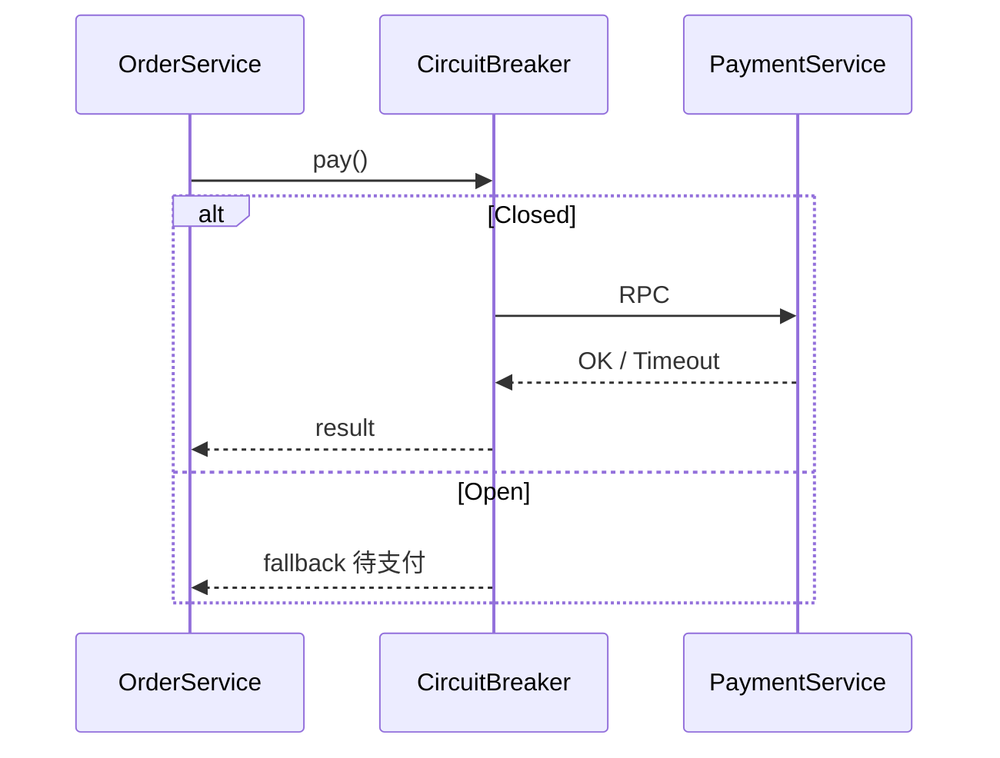
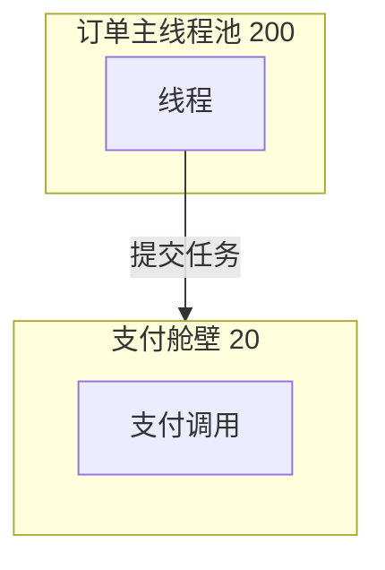

# 限流、熔断与降级

> **文件编码**：UTF-8  
> **前置**：[01 方法论](./01-系统设计方法论与面试框架.md)、[Java/12 高并发](../Java/12-高并发与分布式系统基础.md)  
> **后续**：[03 缓存架构设计](./03-缓存架构设计.md)

---

## 0. 读前导读（零基础也能跟上）

### 0.1 用一句话弄懂本章

流量太大或下游挂了时，系统不能一起死——本章讲三道防线：**限流**（门口排队票）、**熔断**（坏电梯别坐）、**降级**（先保主菜砍掉赠品）。

### 0.2 你需要提前知道什么（真不会就先跳到哪一章）

| 你已会 | 可以直接学本章 |
|--------|----------------|
| [01 方法论 4+1](./01-系统设计方法论与面试框架.md) | ✅ 本章 |
| Java 12 限流/熔断词汇 | ✅ 本章 |
| 知道 QPS、线程池是什么 | ✅ 本章 |
| 完全不懂 HTTP 429 | 先 [Java 12](../Java/12-高并发与分布式系统基础.md) |

### 0.3 本章知识地图（学完后应能勾选全部 ☐→☑）

- ☐ 说清 **限流 / 熔断 / 降级** 区别与口诀
- ☐ 掌握 **四种限流算法**及边界突刺问题
- ☐ 能画 **熔断三状态** Closed/Open/Half-Open
- ☐ 知道限流在 **CDN / 网关 / 应用 / 依赖** 四层的位置
- ☐ 完成 **订单调支付 Case**（§15）步骤表
- ☐ 闭卷自测（§27）≥ 8/10

### 0.4 建议学习时长与节奏

| 阶段 | 内容 | 建议时长 |
|------|------|----------|
| 第 1 天 | §1～§6 概念 + 固定/滑动窗口 | 2～3 小时 |
| 第 2 天 | §7～§9 令牌桶/漏桶 + Sentinel | 2～3 小时 |
| 第 3 天 | §10～§16 熔断降级 + Case | 2 小时 |
| 第 4 天 | 练习 + Guava/Sentinel demo | 2 小时 |

### 0.5 学完本章你能做什么（可验证的具体动作）

1. 用一句话向同学解释「限流和熔断区别」
2. 画出四种限流算法对比表（含边界突刺）
3. 口述 §15 订单-支付 Case 的五层防护
4. 说明网关限流和应用限流如何分工
5. 在架构图上标出秒杀场景各层限流点

---

## 本章与上一章的关系

[01 章](./01-系统设计方法论与面试框架.md) 的 **+1 扩展** 里会问到：「峰值 QPS 打满怎么办？」——限流、熔断、降级是保护系统的**第一道防线**。

[Java/12](../Java/12-高并发与分布式系统基础.md) 已介绍概念；本章从**算法原理、状态机、接入层次、面试 Case** 系统加深，并配合 Sentinel / Hystrix 语义（不要求手写源码）。

---

## 1. 三个概念的区别（必背）

| 概念 | 目的 | 触发条件 | 典型动作 |
|------|------|----------|----------|
| **限流** | 控制进入系统的**速率** | QPS/并发超阈值 | 返回 429，排队 |
| **熔断** | 切断对**故障依赖**的调用 | 错误率/慢调用超阈值 | 快速失败，走 fallback |
| **降级** | 牺牲非核心，**保住核心** | 手动或自动触发 | 关推荐、默认文案 |

**限流（Rate Limiting）**：控制进入系统的请求速率，超过阈值拒绝或排队。
**生活类比**：**景区限流**——每秒只放 100 人进门，多了在外面排队或不让进。
**为什么重要**：保护线程池、DB 连接不被打满；秒杀第一道防线。
**本章用到的地方**：§2～§9 算法、§15 Case

**熔断（Circuit Breaking）**：下游故障时快速失败，不再傻等超时。
**生活类比**：**跳闸的保险丝**——插座短路就断电，避免烧整栋楼。
**为什么重要**：防止慢调用占满线程池导致全站不可用。
**本章用到的地方**：§10～§14、§15 Case

**降级（Degradation）**：主动关闭非核心功能，保核心路径可用。
**生活类比**：**战时配给**——先保证米饭，停供甜品。
**为什么重要**：大促或故障时用户体验「部分可用」优于「全站 500」。
**本章用到的地方**：§11、§15 fallback



**记忆口诀**：限流防**量**，熔断防**坏**，降级防**垮**。

---

## 2. 为什么需要限流

### 2.1 没有限流的后果

- 线程池打满 → 整个服务不可用（连健康检查都进不来）
- 数据库连接耗尽 → 雪崩
- 恶意刷接口 → 成本与数据污染

### 2.2 限流层次

| 层次 | 位置 | 示例 |
|------|------|------|
| CDN / WAF | 边缘 | 防 DDoS |
| 网关 | 统一入口 | Spring Cloud Gateway + Redis |
| 应用 | 接口级 | Sentinel `@SentinelResource` |
| 依赖 | 客户端 | Feign 限并发调订单服务 |


---

## 3. 固定窗口计数器（Fixed Window）

### 3.1 原理

将时间划分为固定窗口（如 1 秒），每个窗口内计数，超过阈值 `limit` 则拒绝。

```text
窗口 [0s, 1s): count++
若 count > limit → 拒绝
```

### 3.2 实现（Redis INCR + EXPIRE）

```java
public boolean allowFixedWindow(String key, int limit, int windowSeconds) {
    Long count = redisTemplate.opsForValue().increment(key);
    if (count != null && count == 1L) {
        redisTemplate.expire(key, Duration.ofSeconds(windowSeconds));
    }
    return count != null && count <= limit;
}
```

### 3.3 优缺点

| 优点 | 缺点 |
|------|------|
| 实现极简 | **窗口边界突刺**：相邻两窗口交界处可瞬间 2× 流量 |

**边界突刺示例**：limit=100/s，在 0.9s～1.1s 内可通过 200 次。

---

## 4. 滑动窗口（Sliding Window）

### 4.1 原理

只统计**最近 window 时间**内的请求数，平滑边界。

常见实现：

1. **滑动窗口日志**：存每次请求时间戳，清理过期记录（精确，占内存）
2. **滑动窗口计数器**：多个小格子加权（近似）
3. **Redis ZSET**：`score=timestamp`，`ZREMRANGEBYSCORE` 删过期

### 4.2 Redis ZSET 示例

```java
public boolean allowSlidingWindow(String key, int limit, long windowMs) {
    long now = System.currentTimeMillis();
    String member = now + "-" + ThreadLocalRandom.current().nextInt();
    redisTemplate.opsForZSet().add(key, member, now);
    redisTemplate.opsForZSet().removeRangeByScore(key, 0, now - windowMs);
    Long count = redisTemplate.opsForZSet().zCard(key);
    redisTemplate.expire(key, Duration.ofMillis(windowMs));
    return count != null && count <= limit;
}
```

### 4.3 对比固定窗口

| 维度 | 固定窗口 | 滑动窗口 |
|------|----------|----------|
| 边界公平 | 差 | 好 |
| 内存 | 低 | 较高 |
| 精度 | 粗 | 可调 |
| 面试推荐 | 理解即可 | **常作分布式限流答案** |

---

## 5. 令牌桶（Token Bucket）

### 5.1 原理

以恒定速率 `r` 向桶中放入令牌，桶容量 `B`。请求消耗 1 个令牌；无令牌则拒绝或等待。

**特点**：允许**一定程度的突发**（桶内积攒的令牌）。



### 5.2 与漏桶区别（高频考点）

| 算法 | 输出速率 | 突发 |
|------|----------|------|
| **令牌桶** | 可突发（最多 B） | 允许 |
| **漏桶** | 严格恒定 | 不允许突发，多余请求排队或丢弃 |

**Guava RateLimiter**、**Sentinel 匀速排队** 分别对应令牌桶与漏桶思想。

### 5.3 Guava RateLimiter 示例

```java
// 每秒 100 个令牌，平滑突发
RateLimiter limiter = RateLimiter.create(100.0);

public void handleRequest() {
    if (!limiter.tryAcquire()) {
        throw new TooManyRequestsException();
    }
    // 业务逻辑
}
```

### 5.5 手把手：Guava RateLimiter 本地 demo

| 步骤 | 你的动作 | 预期看到什么 | 若不对 |
|------|----------|--------------|--------|
| 1 | Maven 引入 `guava` | 依赖下载成功 | 检查 pom |
| 2 | `RateLimiter.create(2.0)` | 每秒 2 令牌 | — |
| 3 | 循环 10 次 `tryAcquire()` | 前 2 次 true，其余 false | 理解桶容量 |
| 4 | 改 `tryAcquire(500, MILLISECONDS)` | 部分请求会等待 | 对比非阻塞 |
| 5 | 压测 100 线程 | 稳定 ~2 QPS | JVM 单局限流 |

### 5.6 RateLimiter 代码逐行读

| 行号/代码 | 含义 | 改错会怎样 |
|-----------|------|------------|
| `RateLimiter.create(100.0)` | 每秒补充 100 令牌，默认突发=100 | 改太小全 429 |
| `tryAcquire()` | 无令牌立即 false，不阻塞 | 用 `acquire()` 会阻塞排队 |
| `if (!limiter.tryAcquire()) throw` | 超限快速失败 | 忘记 throw 则无限流效果 |
| 放在 `handleRequest` 入口 | 业务执行前扣令牌 | 放业务后可能已占线程 |

### 5.7 分布式令牌桶（Redis Lua 思路）

```text
KEYS[1] = tokens
KEYS[2] = last_refill_ts
-- 按 elapsed × rate 补充 token，上限 capacity
-- token >= 1 则 DECR 并允许，否则拒绝
```

面试答：**Lua 保证 refill + 扣减原子性**；多 JVM 共享同一 Redis key。

---

## 6. 漏桶（Leaky Bucket）

### 6.1 原理

请求像水一样进入桶，桶底以固定速率「漏水」处理请求；桶满则溢出（拒绝）。

适合**整形流量**：下游只能承受固定 QPS（如写第三方 API）。



### 6.2 场景选型

| 场景 | 推荐算法 |
|------|----------|
| 秒杀入口 QPS | 令牌桶 / 滑动窗口 |
| 调用外部短信 API | 漏桶 |
| 网关全局限流 | 滑动窗口 + Redis |
| 单 JVM 热点接口 | Guava 令牌桶 |

---

## 7. 四种算法总对比表

| 算法 | 实现难度 | 突发 | 分布式 | 典型产品 |
|------|----------|------|--------|----------|
| 固定窗口 | ★ | 边界 2× | Redis INCR | Nginx limit_req 简化 |
| 滑动窗口 | ★★ | 平滑 | Redis ZSET | Gateway 自定义 |
| 令牌桶 | ★★ | 可控突发 | Redis Lua | Guava、Sentinel QPS |
| 漏桶 | ★★ | 无 | 队列消费 | Sentinel 匀速 |

---

## 8. 熔断（Circuit Breaker）

### 8.1 为什么需要熔断

下游支付服务响应 30s，上游线程被占满 → **级联故障**。熔断器在错误率过高时**快速失败**，给下游恢复时间。

### 8.2 Hystrix / Sentinel 三状态



| 状态 | 行为 |
|------|------|
| **Closed** | 正常调用，统计成功/失败 |
| **Open** | 直接 fallback，不调下游 |
| **Half-Open** | 放行少量探测请求 |

### 8.3 关键参数（口述）

- **失败率阈值**：如 50%（10 秒内）
- **最小请求数**：样本太少不熔断
- **熔断时长**：如 10s 后 Half-Open
- **半开探测数**：如 3 个请求

### 8.4 Java 示例（Resilience4j 风格伪代码）

```java
CircuitBreakerConfig config = CircuitBreakerConfig.custom()
        .failureRateThreshold(50)
        .waitDurationInOpenState(Duration.ofSeconds(10))
        .slidingWindowSize(20)
        .build();

CircuitBreaker cb = CircuitBreaker.of("payment", config);

Supplier<PayResult> decorated = CircuitBreaker
        .decorateSupplier(cb, () -> paymentClient.pay(order));

try {
    return decorated.get();
} catch (CallNotPermittedException e) {
    return PayResult.degraded("支付繁忙，请稍后");
}
```

### 8.5 Sentinel 熔断策略

| 策略 | 说明 |
|------|------|
| 慢调用比例 | RT 超阈值比例达限 |
| 异常比例 | 业务异常比例 |
| 异常数 | 时间窗口内异常个数 |

与 [Java/12 §熔断](../Java/12-高并发与分布式系统基础.md) 对照。

### 8.6 熔断三状态手把手（默画练习）

| 步骤 | 你的动作 | 预期 | 若不对 |
|------|----------|------|--------|
| 1 | 画 Closed 正常调用 | 请求到下游 | — |
| 2 | 错误率超阈值 → Open | 直接 fallback | 忘记快速失败 |
| 3 | 冷却 N 秒 → Half-Open | 放 1 个探测 | 永远 Open |
| 4 | 探测成功 → Closed | 恢复调用 | — |
| 5 | 探测失败 → Open | 再等冷却 | 无限重试下游 |

**面试口述模板**：「10 秒内 50% 超时则 Open 10 秒；Half-Open 放 3 个请求，成功则 Closed。」

---

## 9. 降级（Degradation）

### 9.1 自动 vs 手动

| 类型 | 触发 | 示例 |
|------|------|------|
| 自动 | 熔断、超时、限流 | 推荐模块返回空列表 |
| 手动 | 运维开关、大促预案 | 关闭「猜你喜欢」 |
| 预案 | 配置中心 | Nacos 推送 `feature.xxx=false` |

### 9.2 降级策略矩阵

| 业务 | 核心级 | 可降级 |
|------|--------|--------|
| 电商 | 下单、支付 | 评论、推荐、优惠券弹窗 |
| 社交 | 发帖、私信 | 非关注人 Feed 推荐 |
| RAG | 核心问答 | 引用高亮、相关文档推荐 |

### 9.3 降级响应设计

- 返回**可理解的默认数据**，不要 500
- HTTP 可用 200 + 业务码表示「降级中」
- 记录降级指标，便于复盘

```java
public ProductDetail getDetail(Long productId) {
    try {
        return recommendService.getRecommendations(productId);
    } catch (Exception e) {
        log.warn("recommend degrade", e);
        return ProductDetail.withoutRecommend(productId);
    }
}
```

---

## 10. Sentinel 体系结构（概念）



### 10.1 流控效果

| 效果 | 对应算法思想 |
|------|-------------|
| 快速失败 | 直接拒绝 |
| Warm Up | 冷启动预热 |
| 排队等待 | 漏桶匀速 |

### 10.2 规则配置示例（概念 JSON）

```json
{
  "resource": "createOrder",
  "grade": 1,
  "count": 500,
  "strategy": 0,
  "controlBehavior": 0
}
```

`grade=1` 表示 QPS 模式；`count=500` 即每秒 500。

### 10.3 与 Hystrix 对比（面试）

| 维度 | Hystrix | Sentinel |
|------|---------|----------|
| 维护状态 | 停更 | 阿里活跃 |
| 限流 | 较弱 | 核心能力 |
| 控制台 | 基础 | Dashboard 丰富 |
| Spring Cloud | 老项目多 | 国内主流 |

新项目优先 **Sentinel** 或 **Resilience4j**。

---

## 11. 接入实践：多层防护

### 11.1 秒杀三层限流（与 Java/14 呼应）



| 层 | 限流目的 |
|----|----------|
| 前端 | 减少无效请求 |
| 网关 | 保护整个集群 |
| 接口 | 保护 Redis/DB |
| Redis | 库存本身即「限量」 |

详见 [07 秒杀](./07-秒杀系统简化设计.md)（若已发布）。

### 11.2 登录防刷

- 网关：单 IP 100 次/分钟
- 业务：用户名错误 5 次 → 锁定 15 分钟（Redis）
- 验证码：滑块 / 短信（见 [01 API 设计](./01-系统设计方法论与面试框架.md)）

### 11.3 LLM API 配额（AI Agent 交叉）

调用 OpenAI / 本地 GPU 推理时：

- **令牌桶** 限制每分钟 token 数
- **并发限制** 防止 OOM
- **降级**：返回缓存回答或「请稍后」

见 [AIAgent 路线图](../AIAgent/00-学习路线图与说明.md)。

---

## 12. 限流维度

| 维度 | Key 示例 | 场景 |
|------|----------|------|
| 全局限流 | `global:api` | 保护集群 |
| IP | `ip:1.2.3.4` | 防刷 |
| 用户 | `user:10001` | 公平使用 |
| 接口 | `api:POST:/orders` | 热点写 |
| 租户 | `tenant:abc` | SaaS |

**组合**：网关 IP + 应用 user + 依赖 client 限流。

---

## 13. 返回与用户体验

### 13.1 HTTP 429

```http
HTTP/1.1 429 Too Many Requests
Retry-After: 1
Content-Type: application/json

{"code":"RATE_LIMITED","message":"请求过于频繁"}
```

### 13.2 排队 vs 拒绝

| 策略 | 适用 |
|------|------|
| 直接拒绝 | 秒杀、读接口 |
| 排队等待 | 可容忍延迟的写（漏桶） |
| 异步受理 | 返回 202 + 任务 id |

---

## 14. 监控与调参

| 指标 | 说明 |
|------|------|
| `rate_limit_rejected_total` | 被拒绝次数 |
| `circuit_breaker_state` | 0/1/2 三态 |
| `degrade_active` | 是否降级中 |
| P99 RT | 限流前就应关注 |

**调参原则**：阈值从压测得出，留 20%～30% 余量；大促前演练熔断 fallback。

---

## 15. Case Study：订单服务依赖支付服务

### 15.0 手把手步骤表

| 步骤 | 你的动作 | 预期产出 | 若卡住 |
|------|----------|----------|--------|
| 1 现象 | 描述支付超时如何拖垮订单 | 200 线程被占满 | §15.1 |
| 2 超时 | 设 Feign 连接/读超时 | 1s/2s | §15.2-1 |
| 3 熔断 | 定错误率阈值与 Open 时长 | 50%/10s | §10 三状态 |
| 4 降级 | 设计 fallback 文案 | 「待支付」+ 异步补偿 | §11 |
| 5 舱壁 | 支付独立线程池 | max 20 线程 | §24 |
| 6 限流 | 订单 1000 QPS、支付 200 QPS | 双层阈值 | §2.2 |
| 7 画图 | 画 sequence 含 CB 分支 | §15.2 Mermaid | 纸笔复现 |

### 15.1 问题

支付服务偶发超时 5s，订单服务 Tomcat 线程池 200 被占满，全部接口变慢。

### 15.2 方案

1. **Feign 超时**：连接 1s，读 2s
2. **熔断**：10s 内 50% 失败 → Open 10s
3. **降级**：返回「待支付」，异步补偿查询
4. **舱壁**：支付调用独立线程池，最多 20 线程
5. **限流**：创建订单 1000 QPS，支付调用 200 QPS



---

## 16. Case Study：Redis 热点 key 与限流联动

### 16.0 手把手步骤表

| 步骤 | 动作 | 产出 |
|------|------|------|
| 1 | 识别热点 key（某商品 id） | 监控单 key QPS |
| 2 | L1 本地缓存 | Caffeine 减 Redis 压力 |
| 3 | 应用层单 key 限流 | 防止打穿单节点 |
| 4 | Redis Cluster / 多副本 key | 分散热点 |
| 5 | 与 [03 缓存](./03-缓存架构设计.md) 击穿方案组合 | 互斥锁 + 本地缓存 |

热点 key 打满单 Redis 节点时：

- 本地缓存（Caffeine）减轻 Redis
- **单 key 访问限流**（应用层）
- Redis Cluster 分散（见 [03](./03-缓存架构设计.md)）

---

## 17. 常见面试题精答

### 17.1 限流和熔断有什么区别？

限流控制**进入本服务的流量**；熔断控制**本服务对外部依赖的调用**，依赖故障时快速失败。

### 17.2 分布式限流如何实现？

Redis 滑动窗口 / 令牌桶 Lua；或网关集群共享 Redis；大厂用自研或 Envoy rate limit service。

### 17.3 令牌桶和漏桶选型？

要允许合理突发用**令牌桶**；要严格平滑输出用**漏桶**。

### 17.4 熔断 Half-Open 意义？

探测下游是否恢复，避免一直 Open 也无法恢复 Closed。

---

## 18. 分级练习

### 18.1 基础档

**题 1**：解释固定窗口在 1s 边界为何可能出现 2 倍流量。

**题 2**：画出熔断器三状态转换图（Closed / Open / Half-Open）。

**题 3**：列举 3 种可降级的非核心业务。

### 18.2 进阶档

**题 4**：设计「单用户每秒最多 10 次点赞」的 Redis Key 与算法选型。

**题 5**：比较 Sentinel 的 QPS 限流与线程数限流适用场景。

**题 6**：支付超时导致线程池耗尽，除熔断外还有哪些手段？（至少 3 个）

### 18.3 挑战档

**题 7**：网关限流 1 万 QPS，单实例 2000 QPS，需要几台？秒杀接口还要再限 500/s，规则应放在哪一层？

**题 8**：设计 LLM 对话接口的限流维度（用户、IP、全局 token/min）。

---

## 19. 分级练习参考答案

### 19.1 基础档

**题 1**：两个相邻 1s 窗口各允许 limit 次，在边界附近各打满 limit，2 秒内可通过 2×limit。

**题 2**：见 §8.2 Mermaid 状态图。

**题 3**：推荐、评论、优惠券弹窗、搜索联想、非实时统计。

### 19.2 进阶档

**题 4**：`rate:like:user:{userId}`，滑动窗口 1s 内 ZSET 计数 ≤10；或令牌桶 `rate:10/s`。

**题 5**：

| 模式 | 场景 |
|------|------|
| QPS | 一般 HTTP 接口 |
| 线程数 | 慢调用、占用线程资源（报表生成） |

**题 6**：缩短超时；独立线程池舱壁；异步化；限流；降级；扩容。

### 19.3 挑战档

**题 7**：网关至少 `ceil(10000/2000)=5` 台；秒杀 500/s 放在**秒杀服务接口级** Sentinel，避免网关单一规则误伤其他 API。

**题 8**：

- 全局限流：集群 token/min
- 用户：防滥用 `user:{id}`
- IP：未登录防刷
- 按模型算力：并发数上限 + 排队

---

## 20. 学完标准

- [ ] 能口述 **限流 / 熔断 / 降级** 区别与配合关系
- [ ] 能对比 **固定窗口、滑动窗口、令牌桶、漏桶** 并选型
- [ ] 能画 **熔断三状态** Mermaid 状态图
- [ ] 知道 **Sentinel** 流控与熔断规则类型
- [ ] 能设计 **秒杀 / 登录防刷** 的多层限流方案
- [ ] 能写 **Guava RateLimiter** 或 Redis 滑动窗口简化代码
- [ ] 知道降级时 **HTTP 与用户体验** 如何处理

---

## 21. FAQ

**Q：限流阈值怎么定？**  
压测得出单机安全 QPS × 实例数 × 0.7；无压测数据则从小调大，看拒绝率与 RT。

**Q：被限流用户一直重试怎么办？**  
客户端指数退避 + `Retry-After`；服务端可对同一用户连续 429 加长封禁。

**Q：Hystrix 还要学吗？**  
老项目维护需要；面试以 Sentinel / Resilience4j 为主，**三状态模型**通用。

**Q：限流和降级会同时发生吗？**  
会。例如全局限流仍允许核心接口，非核心接口主动降级。

**Q：和 [03 缓存](./03-缓存架构设计.md) 关系？**  
缓存减轻读压力；限流防止写/热点把系统打垮。常组合使用。

**Q：用户 VIP 要不要不限流？**  
可**单独更高配额**，不建议完全豁免；否则 VIP 脚本也能打垮系统。

**Q：429 和 503 怎么选？**  
429 = 你请求太多（限流）；503 = 服务暂时不可用（过载/熔断/维护）。

**Q：单机限流够用吗？**  
多实例必须 **Redis 分布式限流** 或网关集中限流，否则总量 = 单机×N 仍超标。

**Q：Sentinel 和 Resilience4j 选哪个？**  
国内面试 **Sentinel** 提及多；Spring 生态 **Resilience4j** 也常见；**三状态模型**通用。

**Q：漏桶和令牌桶面试怎么一句话？**  
要平滑输出用漏桶；要允许合理突发用令牌桶。

**Q：秒杀限流放哪一层？**  
CDN/网关粗限 + 应用细限 + Redis 预减库存；多层叠加。

---

## 22. 与 Java 章节交叉索引

| 本章 | Java |
|------|------|
| 限流算法入门 | [12 §4](../Java/12-高并发与分布式系统基础.md) |
| Redis 限流实现 | [07 Redis](../Java/07-Redis核心原理与缓存实战.md) |
| 秒杀限流 | [14 §30.2](../Java/14-高频场景设计与面试专题.md) |
| 网关 | [11 微服务](../Java/11-微服务与SpringCloud基础.md) |

---

## 23. Nginx 与网关层限流（补充）

### 23.1 Nginx limit_req（漏桶思想）

```nginx
limit_req_zone $binary_remote_addr zone=api:10m rate=100r/s;

server {
    location /api/ {
        limit_req zone=api burst=20 nodelay;
        proxy_pass http://backend;
    }
}
```

| 参数 | 含义 |
|------|------|
| `rate=100r/s` | 平均每秒 100 请求 |
| `burst=20` | 允许突发 20（令牌桶类似） |
| `nodelay` | 突发立即处理不排队 |

### 23.2 Spring Cloud Gateway 限流（概念）

```yaml
spring:
  cloud:
    gateway:
      routes:
        - id: order
          uri: lb://order-service
          filters:
            - name: RequestRateLimiter
              args:
                redis-rate-limiter.replenishRate: 100
                redis-rate-limiter.burstCapacity: 200
```

`replenishRate` 类似令牌补充速率；`burstCapacity` 桶容量。底层常基于 **Redis + Lua** 实现分布式限流。

### 23.3 网关 vs 应用限流分工

| 层级 | 保护对象 | 粒度 |
|------|----------|------|
| 网关 | 整个集群入口 | IP、路由、租户 |
| 应用 | 单服务资源 | 接口、用户、热点参数 |
| 依赖客户端 | 下游服务 | 防止拖垮被调方 |

**面试话术**：网关做粗粒度全局限流，Sentinel 做细粒度资源限流与熔断，两者互补而非二选一。

---

## 24. 线程池与舱壁（Bulkhead）

### 24.1 舱壁模式

把不同依赖放到**独立线程池**，避免支付慢调用占满订单服务的全部线程。

```java
@Bean
public Executor paymentExecutor() {
    ThreadPoolTaskExecutor ex = new ThreadPoolTaskExecutor();
    ex.setCorePoolSize(10);
    ex.setMaxPoolSize(20);
    ex.setQueueCapacity(100);
    ex.setThreadNamePrefix("pay-");
    ex.initialize();
    return ex;
}
```



### 24.2 与限流关系

- **限流**：控制请求进入速率
- **舱壁**：控制并发占用，防止资源耗尽
- **熔断**：依赖故障时快速失败

三者常一起出现在「订单调支付」类面试题中。

---

## 25. 压测与容量规划表

| 阶段 | 动作 | 产出 |
|------|------|------|
| 基线 | 单接口空跑压测 | 单机极限 QPS |
| 混合 | 核心链路混合场景 | P99 RT |
| 限流标定 | 逐步加压到错误率 1% | 阈值建议值 |
| 演练 | 手动开熔断 / 降级开关 | 预案有效性 |

**示例记录**：

```text
createOrder 单机安全 QPS: 800（P99<200ms）
集群 5 台 → 理论 4000，限流设 2800（70%）
Sentinel 规则: QPS 560/实例
```

---

## 26. 我的笔记区

```text
四种限流算法我最熟：
熔断三状态我能否默画：
Sentinel vs 网关限流分工：
本周 demo：Guava RateLimiter 或 Redis 滑动窗口
```

---

## 27. 闭卷自测

完成后再看 §27.1 参考答案。

1. **概念** 限流、熔断、降级各解决什么问题？口诀是什么？
2. **概念** 固定窗口限流的「边界突刺」是什么？
3. **概念** 滑动窗口相对固定窗口改进在哪？
4. **概念** 令牌桶 vs 漏桶：谁允许突发？
5. **概念** 熔断 Half-Open 状态做什么？
6. **概念** 限流通常接入哪四个层次？
7. **动手** Redis INCR 实现固定窗口限流的核心两行逻辑？
8. **动手** §15 Case：列出保护订单服务的 5 个手段。
9. **综合** 网关限流 1000 QPS、5 台应用各 200 QPS，集群总限流是多少？够吗？
10. **综合** 秒杀场景在架构图哪几层加限流？各防什么？

### 27.1 自测参考答案

1. 限量/防坏/防垮；限流防**量**，熔断防**坏**，降级防**垮**。
2. 相邻两窗口交界处可瞬间通过约 2×limit 请求。
3. 窗口滑动，边界更平滑，突刺减轻。
4. **令牌桶**允许突发（桶内有存量令牌）。
5. 放少量探测请求，下游恢复则 Closed，仍失败则回 Open。
6. CDN/WAF、网关、应用、依赖客户端。
7. `INCR key`；首次 `EXPIRE windowSeconds`；`count <= limit` 则通过。
8. Feign 超时、熔断、降级 fallback、舱壁线程池、双层限流。
9. 应用层总 1000；若网关也 1000 则匹配；需压测标定 70% 余量。
10. CDN 防 DDoS；网关防总流量；应用防接口；Redis 防热点 key；库存层防超卖（配合 07）。

---

## 28. 费曼检验

用 **3 分钟**向朋友解释：**「限流、熔断、降级像什么？各什么时候用？」**

**对照提纲**：

1. **限流 = 景区检票**：人太多就不让进；防量大。
2. **熔断 = 跳闸**：支付坏了就别一直等；防依赖坏。
3. **降级 = 战时配给**：推荐关了，下单还能用；防全站垮。
4. **组合**：请求先进限流，调下游看熔断，大促手动降级非核心。

---

## 29. 本章核心速记卡

| 算法 | 一句话 | 坑 |
|------|--------|-----|
| 固定窗口 | INCR + EXPIRE | 边界 2× 突刺 |
| 滑动窗口 | 多桶或 ZSET | 实现稍复杂 |
| 令牌桶 | 允许突发 | 面试最常考 |
| 漏桶 | 平滑输出 | 不适合突发 |

---

## 30. 秒杀场景限流分层总表（联动 07 章）

| 层次 | 限流手段 | 阈值思路 | 拒绝表现 |
|------|----------|----------|----------|
| CDN/WAF | IP 频率 | 防脚本 | 403 |
| 网关 | 全站 QPS | 集群容量 70% | 429 |
| 应用 | `/seckill` 接口 | 单机压测×实例 | 429 + 排队页 |
| Redis | 预减库存 Lua | 库存上限 | 售罄 |
| MQ | 入队速率 | 消费者处理能力 | 202 异步 |
| DB | 连接池 + 舱壁 | 连接数上限 | 503 降级 |

**Case 口述顺序**：用户 → CDN → 网关 → 秒杀 API → Redis 预减 → MQ → Worker 落库。

### 30.1 限流算法选型决策表（扩展）

| 场景 | 首选 | 备选 | 避免 |
|------|------|------|------|
| 网关全局限流 | 滑动窗口+Redis | 令牌桶 | 固定窗口 alone |
| 单 JVM 接口 | Guava 令牌桶 | — | 无上限 |
| 调用第三方 SMS | 漏桶 | 队列 | 无限制并发 |
| 分布式 API | Redis Lua 令牌桶 | Sentinel | 各实例独立计数 |
| 热点 Redis key | 应用层单 key 限流 | 本地缓存 | 仅加 Redis 内存 |

### 30.2 Nginx limit_req 逐行读（复习 §23）

| 配置 | 含义 | 改错 |
|------|------|------|
| `limit_req_zone ... rate=100r/s` | 每 IP 平均 100/s | rate 过大无保护 |
| `burst=20` | 允许突发 20 | burst=0 无突发 |
| `nodelay` | 突发立即处理 | 去掉则排队延迟 |

---

## 下一章预告

[03-缓存架构设计](./03-缓存架构设计.md) 在流量被**合法地**放进系统后，如何用**多级缓存**扛住读 QPS，并处理穿透、击穿、雪崩与一致性。02 章保入口，03 章优化读路径。

---

*复习时画一张「限流 + 熔断 + 降级」组合图，标出秒杀案例各层位置*
