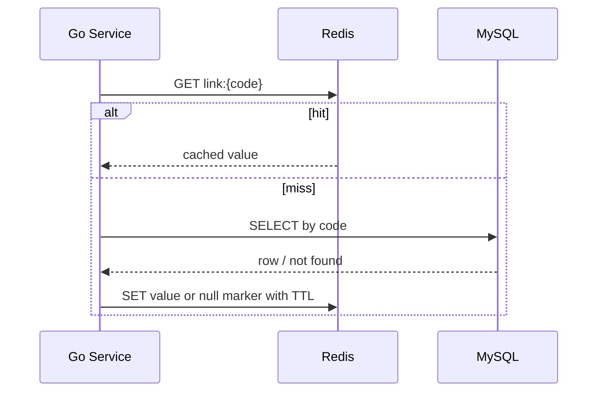
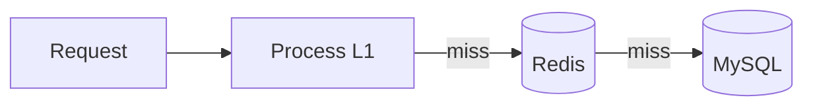

# 缓存架构：性能、失效与一致性边界

> 缓存是派生副本，不是真相源。它用更低延迟换取额外的一致性、失效和故障处理成本。
>
> 本章以短链跳转为主线：先测 MySQL 读路径，再按证据加入缓存，并验证 Redis 故障时不会把数据库打垮。

---

## 1. 定位与分层

### 1.1 现在必学

- Cache Aside 读写路径
- key、TTL、序列化和容量上限
- 穿透、击穿（cache stampede）和雪崩
- 空值缓存、TTL jitter、`singleflight`
- Redis 失败时受控回源
- 命中率、回源量和 P95/P99 的验收

### 1.2 项目再学

- L1 本地缓存 + Redis 多级缓存
- 提交后失效、重试、Outbox 和 CDC
- 热点 key、副本 key 与版本控制
- 布隆过滤器容量规划和重建
- 安全的分布式锁释放语义

### 1.3 面试进阶

- 强一致缓存、版本化读和租约
- 多地域缓存、复制延迟和失效广播
- 大规模热点探测、自适应 TTL
- CDN、浏览器缓存与边缘计算

---

## 2. 六个核心不变量

- **真相源明确**：短链 V1 的 MySQL 是真相源；Redis/L1 可删除重建，cache miss 不能证明数据不存在。
- **陈旧窗口明确**：说明正常更新、失效失败和安全封禁分别允许旧多久，以及如何修复。
- **回源有上限**：Redis 故障或热点过期时，用请求合并、并发限制、限流或降级保护 MySQL。
- **容量有上限**：限制 L1 条目/内存，规划 Redis 内存与淘汰，并观测 key/value 大小；TTL 不等于完整内存治理。
- **commit 后失效**：事务未提交时删缓存会让读请求回填旧 DB，失效动作应在 commit 成功后执行。
- **锁不保业务正确性**：重建锁只降低回源并发；唯一性、库存和余额仍由数据库约束、事务或一致性协议保证。

---

## 3. 什么时候应该加缓存

先记录无缓存的 QPS、P95/P99、MySQL 延迟/CPU、连接池等待、热点占比和允许旧值窗口。数据库读成为瓶颈、结果可复用、热点明显或计算昂贵时，再评估缓存。

余额、库存最终扣减等强一致判断，不可复用的结果，已经达标的小数据接口，以及无法承受旧值却没有失效策略的状态，不应直接套缓存。

---

## 4. Cache Aside

### 4.1 读路径



基本步骤：

1. 读缓存
2. miss 后读真相源
3. 将结果以有限 TTL 写入缓存
4. 返回结果

需要补充的生产语义：

- 区分 `redis.Nil` 与 Redis 网络错误
- DB 不存在可写短 TTL 空值
- 同 key 回源使用 `singleflight` 或锁合并
- 写缓存失败不应把已经成功的 DB 读取伪装成业务失败，但要记录指标

### 4.2 写路径

常用基线：

```text
数据库事务 commit
  → 删除缓存
  → 删除失败则可靠重试
```

“更新 DB 后直接更新缓存”在并发写、部分失败和多字段聚合时更难维护，因此通用业务常优先删除，让下次读取重建。

但“更新 DB 后删缓存”也不是强一致保证。典型竞态：

```text
Reader: cache miss，开始读取旧 DB
Writer: 更新并 commit DB，删除缓存
Reader: 把之前读到的旧值写回缓存
```

候选缓解措施：

- 短 TTL，限制旧值存在时间
- 缓存值携带版本，旧版本禁止覆盖新版本
- 对热点回源合并并在写入前复核版本
- 延迟再次删除，只作为概率缓解，延迟来自实测而非固定 500ms
- 对不能容忍旧值的读旁路缓存或读取真相源

### 4.3 先删缓存再更新 DB 的风险

```text
Writer 删除缓存
Reader miss，读到旧 DB 并回填
Writer 更新并 commit DB
```

此时旧缓存可能一直存在到 TTL，因此通常不把“先删后更”作为普通 Cache Aside 的默认顺序。

---

## 5. 提交后失效、Outbox 与 CDC

### 5.1 简单项目：commit 后删除并重试

单体短链项目可在数据库 commit 成功后删除 Redis；删除失败写入有界重试队列或任务表，TTL 作为最后兜底。不要在事务尚未确认 commit 时失效缓存。

### 5.2 Transactional Outbox

当失效事件需要“最终一定执行”时，在同一事务内完成：

```text
BEGIN
UPDATE short_link ...
INSERT outbox_event(event_id UNIQUE, aggregate_id, event_type, payload)
COMMIT
```

Worker 轮询未发布事件，删除缓存后标记完成。Worker 可能重复执行，因此事件 ID、删除和状态更新都要幂等；还要监控积压与最老事件年龄。

### 5.3 CDC

CDC 从 binlog 捕获已提交变更，再由消费者失效缓存。它减少业务代码双写，但仍要处理延迟、重复、顺序、schema 变化、重放和版本覆盖。Outbox 与 CDC 都提供“最终会处理”的路径，不提供零延迟强一致。

---

## 6. 多级缓存



L1 能避免热门 key 的网络访问，并在 Redis 短时故障时提供有限旧值；代价是每实例副本、冷启动、多副本失效和 Go 进程内存。必须限制容量，先用于少量热点和可接受旧值的对象。

### 6.1 热点 key 与 Redis Cluster

Redis Cluster 把不同 key 分布到不同 slot，但一个 key 仍只属于一个 slot。它不能自动把单个热点 key 的请求拆到多个主节点。

候选方案包括 L1、读副本、多个物理副本 key、业务拆 key、单 key 并发限制与请求合并。副本 key 必须定义写入、失效、版本和修复策略。

---

## 7. 穿透：查询不存在的数据

缓存和数据库都不存在该 key，恶意或无效请求持续打到数据库。

### 7.1 空值缓存

```text
link:null:{code} = 1，TTL 30～120 秒
```

优点：实现简单。
风险：随机 key 攻击会制造大量空值，因此还需要格式校验、请求限流和容量上限。

### 7.2 布隆过滤器

布隆过滤器由位数组和多个哈希函数组成：

- 返回“可能存在”：可能是真的，也可能是假阳性
- 返回“一定不存在”：在元素已正确加入且未被标准 Bloom 删除的前提下，可以直接拒绝
- 不会把已正确加入的元素判断为不存在，即无假阴性

标准 Bloom 不支持安全删除。需要删除时可使用 Counting Bloom、定期重建，或接受过滤器只增不减并让 DB 做最终确认。

算法没有假阴性，不代表工程链路永远没有：若 DB 已提交但增量 add 失败，过滤器会暂时缺少真实元素。只有在全量构建完成、增量更新可靠且健康状态正常时，才能把“Bloom 判不存在”作为硬拒绝；否则应降级为受控回源 DB。

容量规划取决于预计元素数和目标假阳性率。元素远超规划容量后，假阳性率会明显升高。

### 7.3 安全顺序

```text
格式/权限校验
  → Bloom 判断
  → Cache
  → 受控回源 DB
  → 不存在则写空值
```

Bloom 只能减少确定不存在的查询，不能替代认证、限流和 DB 唯一约束。

---

## 8. 击穿：热点失效与 Cache Stampede

同一个热点 key 失效后，大量并发同时 miss 并回源。

### 8.1 单进程请求合并

Go 可使用 `golang.org/x/sync/singleflight`。相同 key 同时只执行一次加载，其余调用共享结果。

优点：简单、无需分布式锁。
边界：只合并单个进程内请求；多实例仍可能各回源一次。

### 8.2 逻辑过期与 stale-while-revalidate

缓存值携带逻辑过期时间：

- 未过期直接返回
- 过期后允许短时间返回旧值
- 只有一个请求触发后台刷新

需要定义最大陈旧窗口。不能让物理 key 永不过期且刷新失败后永久返回旧值；应设置物理兜底 TTL、刷新失败告警和最大 stale 时间。

### 8.3 分布式锁只用于合并回源

获得锁后仍要再次检查缓存，因为在首次 miss 与拿锁之间，其他实例可能已经完成重建。

锁必须：

- 使用随机唯一 token
- 原子设置 TTL：`SET key token NX PX ttl`
- 释放时比较 token，再删除
- 有有限等待与退避
- 处理工作时间超过 lease 的情况

释放 Lua：

```lua
if redis.call("GET", KEYS[1]) == ARGV[1] then
    return redis.call("DEL", KEYS[1])
end
return 0
```

Go 片段：

```go
var unlockScript = redis.NewScript(`
if redis.call("GET", KEYS[1]) == ARGV[1] then
    return redis.call("DEL", KEYS[1])
end
return 0
`)

func unlock(ctx context.Context, rdb *redis.Client, key, token string) error {
	_, err := unlockScript.Run(ctx, rdb, []string{key}, token).Result()
	return err
}
```

若锁用于保护业务写入而不仅是缓存重建，还要考虑 lease 过期后的并发持有者和 fencing token。不要把简单 Redis 锁当成强一致事务。

---

## 9. 雪崩：大量 key 同时失效或缓存整体故障

### 9.1 TTL jitter

```text
actualTTL = baseTTL + random(0, jitter)
```

随机偏移能分散批量过期，但不能解决 Redis 整体不可用。

### 9.2 高可用不是完整降级

主从、Sentinel 或 Cluster 能降低部分节点故障时间，但切换、网络分区、客户端连接风暴仍会造成错误。应用侧还需要：

- Redis 调用 deadline
- 熔断与错误分类
- L1 或静态旧值
- DB 回源并发上限
- 对非核心请求快速失败
- 恢复后的渐进预热

### 9.3 禁止全量无上限回源

Redis 出错时直接把所有流量转到 MySQL，可能把缓存故障升级为数据库故障。

推荐顺序：

```text
尝试 L1/允许的旧值
  → singleflight 合并同 key
  → semaphore 限制总回源并发
  → 核心流量访问 DB
  → 其余请求 503 或业务降级
```

是否 fail-open 必须按业务决定。短链跳转可允许受控 DB 回源；安全封禁状态则可能选择 fail-closed 或旁路缓存读取真相源。

---

## 10. Key、TTL 与数据格式

```text
{service}:{environment}:{entity}:v{schema}:{id}
shortlink:prod:link:v1:abc123
```

多租户系统必须把 tenant 放入 key 或保证 ID 全局隔离；key 不应包含密码、token、完整 URL。TTL 由允许旧多久、更新频率、重建成本、内存预算和热点风险决定。

所有 key 都设 TTL 是常见缓存策略，但是否会被淘汰还取决于 Redis `maxmemory-policy`。在 `allkeys-*` 策略下，无 TTL key 也可能被淘汰；在 `volatile-*` 策略下，只有带 TTL 的 key 参与淘汰。

Big Key 没有统一的 10KB 红线，应结合序列化字节数、集合元素数、命令复杂度、网络阻塞和复制/持久化成本判断。检测工具可能扫描 key，生产使用前要评估开销。

---

## 11. CDN 与浏览器缓存

静态资源和公开响应可使用 `max-age`、`s-maxage`、`ETag`、`stale-while-revalidate`；敏感响应要正确使用 `private` 或 `no-store`，响应受请求头影响时配置 `Vary`。

短链跳转常使用 302/307，以便修改目标和保留统计控制；301/308 可能被浏览器和中间缓存长期记住。选择必须与产品语义一致。

---

## 12. 可运行 Go 实验：singleflight 合并回源

创建目录后执行：

```bash
go mod init cache-demo
go get golang.org/x/sync/singleflight
```

保存为 `main.go`：

```go
package main

import (
	"context"
	"fmt"
	"sync"
	"sync/atomic"
	"time"

	"golang.org/x/sync/singleflight"
)

var group singleflight.Group
var dbLoads atomic.Int64
var cached atomic.Value

func resolve(ctx context.Context, code string) (string, error) {
	if value := cached.Load(); value != nil {
		return value.(string), nil
	}
	result := group.DoChan(code, func() (any, error) {
		if value := cached.Load(); value != nil {
			return value.(string), nil
		}
		dbLoads.Add(1)
		time.Sleep(100 * time.Millisecond)
		value := "https://example.com/docs"
		cached.Store(value)
		return value, nil
	})

	select {
	case <-ctx.Done():
		return "", ctx.Err()
	case out := <-result:
		if out.Err != nil {
			return "", out.Err
		}
		return out.Val.(string), nil
	}
}

func main() {
	var wg sync.WaitGroup
	for i := 0; i < 100; i++ {
		wg.Add(1)
		go func() {
			defer wg.Done()
			ctx, cancel := context.WithTimeout(context.Background(), time.Second)
			defer cancel()
			if _, err := resolve(ctx, "abc123"); err != nil {
				fmt.Println("resolve:", err)
			}
		}()
	}
	wg.Wait()
	fmt.Println("database loads:", dbLoads.Load())
}
```

运行 `go run .`，预期 `database loads: 1`。生产读路径应先查缓存，并在 `Do` 内再次检查缓存后才回源、回填。再做三项实验：

1. 去掉 `singleflight`，观察回源次数。
2. 把 context deadline 改成 20ms，确认调用方能按时取消等待。
3. 启动两个进程，理解单进程合并为何不能消除跨实例回源。

---

## 13. 排行榜与计数不是简单缓存

若用 Redis ZSet 做排行榜，必须定义业务真相源和事件语义：

- 订单事件重复投递时，`ZINCRBY` 会重复计数
- 退款、取消需要反向事件或重算
- 消费者按 event ID 幂等
- 定期从订单数据对账或重建
- AOF 提高 Redis 恢复能力，但不自动成为业务真相源

实时排名可以是派生数据；订单和支付记录仍是权威来源。

---

## 14. 观测与验收

### 14.1 指标

- L1、Redis 分层命中率
- DB 回源 QPS 与回源并发
- cache load 成功、失败和耗时
- 空值缓存命中数
- `singleflight` 共享请求数
- Redis 超时、错误和熔断状态
- eviction、内存、key/value 大小分布
- 热点 key 请求占比
- 失效事件积压和最老事件年龄
- 业务可观测时的 stale read 数量

命中率没有统一健康线。高命中率但 value 巨大、延迟很高，仍可能是坏缓存；低命中率也可能是业务数据天然离散。

### 14.2 故障实验

1. 关闭 Redis，确认 DB 回源并发有上限，服务不会拖垮 MySQL。
2. 让一个热点 key 同时过期，确认回源次数接近实例数而不是请求数。
3. 模拟缓存删除失败，确认 Outbox/重试最终清理旧值。
4. 批量设置相同 TTL 与带 jitter TTL，对比过期时的回源曲线。
5. 更新短链后立即访问，记录可见旧值的最长时间。

### 14.3 验收标准示例

目标应基于自己的环境，例如：

- 缓存版本的跳转 P99 比基线明显下降
- Redis 故障时 DB 回源不超过设定并发
- 热点过期时数据库实际加载次数可解释
- 更新后旧值窗口不超过产品承诺
- 缓存删除失败有指标、重试和最终修复证据

---

## 15. 短链关联

| 问题 | 方案起点 |
|---|---|
| 跳转读多写少 | Cache Aside |
| 随机扫描不存在 code | 格式校验 + 限流 + 空值/Bloom |
| 热门短码过期 | `singleflight`、L1、逻辑过期 |
| Redis 故障 | deadline、熔断、受控 DB 回源 |
| 修改目标 URL | commit 后失效 + 可靠重试 |
| 紧急禁用恶意短链 | 不接受长旧值；必要时旁路缓存 |
| 多实例 L1 | 短 TTL、版本或失效广播 |
| 点击排行榜 | 幂等事件 + 可重建派生数据 |

缓存设计必须区分普通目标更新与紧急安全封禁。两者可以采用不同 TTL、旁路和失效强度。

---

## 16. 复习清单

- [ ] 能说明 MySQL、Redis、L1 中谁是真相源
- [ ] 能画 Cache Aside 读路径和 commit 后失效写路径
- [ ] 能描述更新 DB 后删缓存仍存在的读写竞态
- [ ] 知道固定延迟双删只是概率缓解
- [ ] 能解释 Outbox/CDC 解决什么、不保证什么
- [ ] 能正确说明 Bloom 的假阳性与无假阴性条件
- [ ] 能区分穿透、击穿/cache stampede 和雪崩
- [ ] 能用 `singleflight` 合并单实例回源
- [ ] 能写出 token 比较后删除锁的 Lua
- [ ] 知道 Redis Cluster 不能自动拆散单个热点 key
- [ ] 能说明 Redis 故障时为何不能全量回源 DB
- [ ] 能用指标和故障实验验收短链缓存方案

下一章：[04-消息队列架构设计](./04-消息队列架构设计.md)。点击统计等非核心写路径可以异步化，但必须先定义可靠性与幂等语义。
