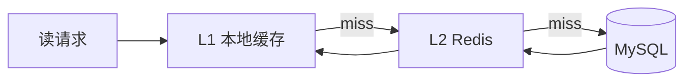
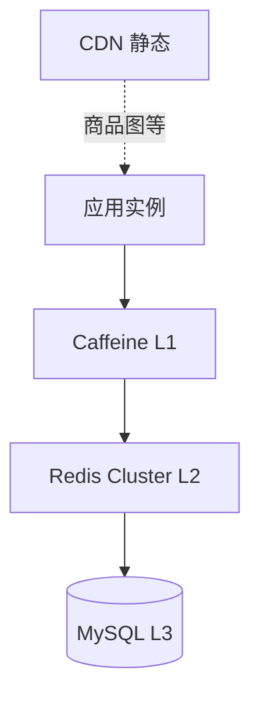
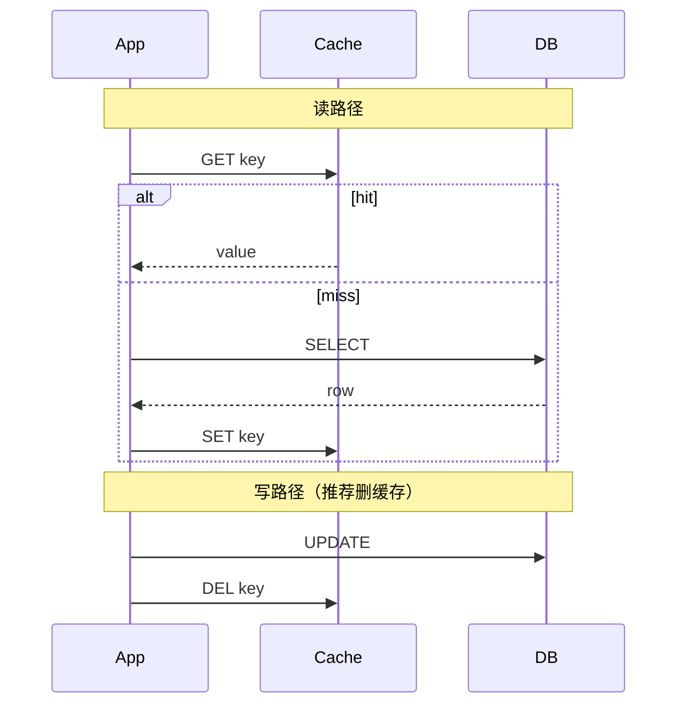
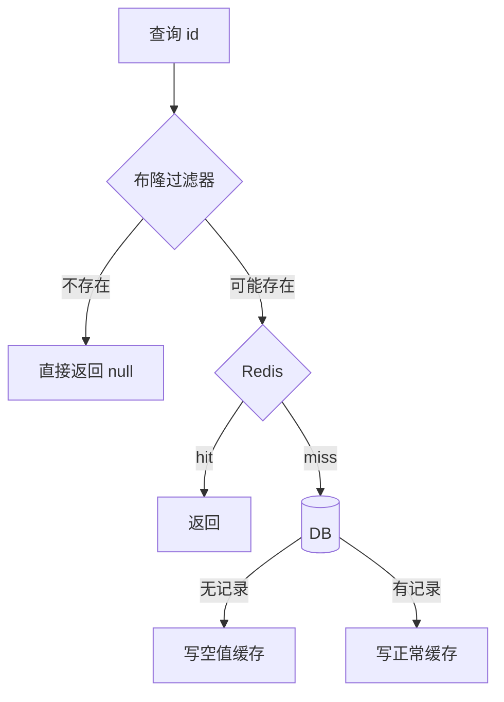
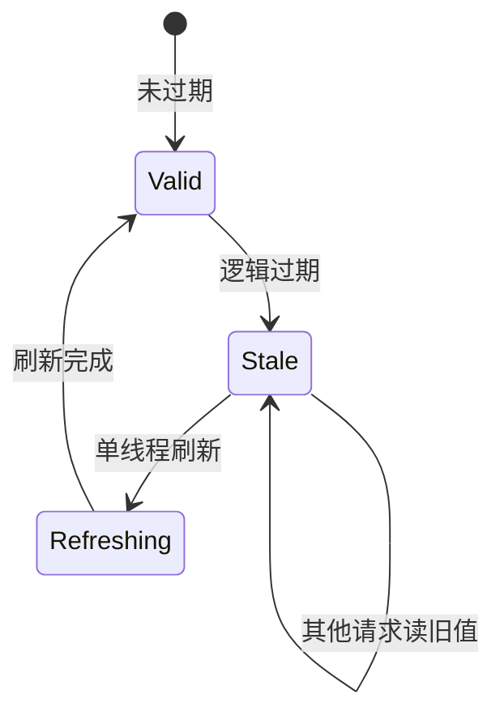
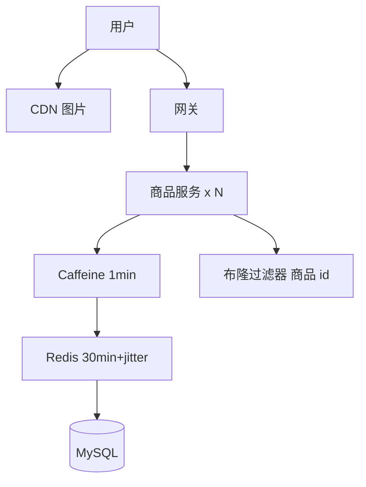
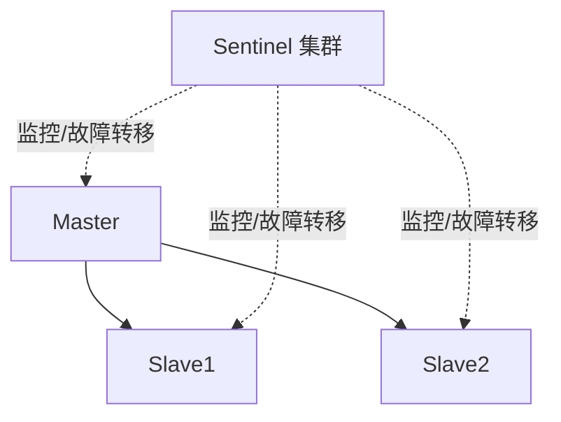
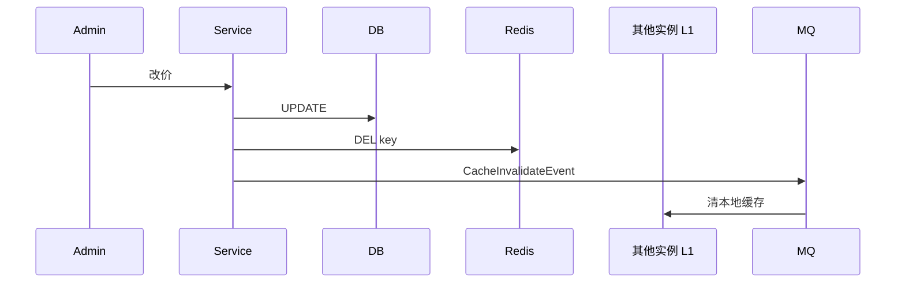

# 缓存架构设计

> **文件编码**：UTF-8  
> **前置**：[02 限流熔断](./02-限流熔断与降级.md)、[Java/07 Redis](../Java/07-Redis核心原理与缓存实战.md)  
> **后续**：[04 消息队列架构设计](./04-消息队列架构设计.md)

---

## 0. 读前导读（零基础也能跟上）

### 0.1 用一句话弄懂本章

读数据库太慢——把热数据放「离用户更近的抽屉」里；本章讲 **多级缓存**怎么叠（本地→Redis→MySQL）、怎么保持一致、以及穿透/击穿/雪崩三大坑。

### 0.2 你需要提前知道什么（真不会就先跳到哪一章）

| 你已会 | 可以直接学本章 |
|--------|----------------|
| [Java 07 Redis](../Java/07-Redis核心原理与缓存实战.md) Cache Aside | ✅ 本章 |
| [02 限流](./02-限流熔断与降级.md) | ✅ 本章 |
| 不知道 Redis 五种类型 | 先 Java 07 |

### 0.3 本章知识地图（学完后应能勾选全部 ☐→☑）

- ☐ 画 **三级缓存** L1/L2/L3 架构图
- ☐ 默写 **Cache Aside** 读写顺序
- ☐ 区分 **穿透 / 击穿 / 雪崩** 及对策
- ☐ 完成 **商品详情 Case**（§11）步骤表
- ☐ 知道 **删缓存 vs 更新缓存** 为何选删
- ☐ 闭卷自测（§24）≥ 8/10

### 0.4 建议学习时长与节奏

| 阶段 | 内容 | 建议时长 |
|------|------|----------|
| 第 1 天 | §1～§3 多级缓存 + 模式 | 2～3 小时 |
| 第 2 天 | §4～§6 三大问题 | 2～3 小时 |
| 第 3 天 | §7～§13 Case + 一致性 | 2 小时 |
| 第 4 天 | 练习 + 画时序图 | 2 小时 |

### 0.5 学完本章你能做什么（可验证的具体动作）

1. 画出读路径：Caffeine → Redis → MySQL
2. 口述改价后「先更新 DB 再删缓存」的原因
3. 为商品 id 设计布隆过滤器防穿透
4. 说明热点 key 击穿时互斥锁 + 本地缓存方案
5. 完成 §11 商品详情 Case 6 步表

---

## 本章与上一章的关系

[02 章](./02-限流熔断与降级.md) 在入口控制流量；多数互联网系统是**读多写少**，读 QPS 往往是第一个瓶颈。[Java/07](../Java/07-Redis核心原理与缓存实战.md) 讲了 Redis 数据结构与 Cache Aside 入门；本章上升到**架构层**：多级缓存、一致性策略、三大经典问题（穿透/击穿/雪崩），以及和 MQ、DB 的组合。

---

## 1. 为什么需要缓存架构

### 1.1 单一 Redis 不够时

| 问题 | 架构回应 |
|------|----------|
| 跨机房延迟 | 本地缓存 + 远程 Redis |
| 热点 key | 多副本、本地缓存 |
| Redis 故障 | 多级降级、集群 HA |
| 一致性 | 删缓存策略、延迟双删 |

### 1.2 缓存在 4+1 中的位置

见 [01 方法论](./01-系统设计方法论与面试框架.md) **+1 扩展**：读路径优先加缓存。



---

## 2. 多级缓存体系

### 2.1 典型三级结构

| 层级 | 技术 | 延迟 | 容量 |
|------|------|------|------|
| L1 | Caffeine / Guava | 微秒 | 百 MB 级 |
| L2 | Redis 集群 | 亚毫秒～毫秒 | GB～TB |
| L3 | MySQL | 毫秒～十毫秒 | 持久化全量 |



### 2.2 L1 本地缓存示例

```java
@Configuration
public class CacheConfig {

    @Bean
    public Cache<Long, ProductDTO> productLocalCache() {
        return Caffeine.newBuilder()
                .maximumSize(10_000)
                .expireAfterWrite(Duration.ofMinutes(1))
                .build();
    }
}

@Service
@RequiredArgsConstructor
public class ProductQueryService {

    private final Cache<Long, ProductDTO> localCache;
    private final RedisTemplate<String, String> redis;
    private final ProductMapper mapper;

    public ProductDTO getById(Long id) {
        ProductDTO hit = localCache.getIfPresent(id);
        if (hit != null) {
            return hit;
        }
        String key = "product:" + id;
        String json = redis.opsForValue().get(key);
        if (json != null) {
            ProductDTO dto = parse(json);
            localCache.put(id, dto);
            return dto;
        }
        ProductDTO db = mapper.selectById(id);
        if (db != null) {
            redis.opsForValue().set(key, toJson(db), Duration.ofMinutes(30));
            localCache.put(id, db);
        }
        return db;
    }
}
```

**ProductQueryService.getById 逐行读**：

| 行号/代码 | 含义 | 改错会怎样 |
|-----------|------|------------|
| `localCache.getIfPresent(id)` | L1 命中直接返回 | 跳过则每次都打 Redis |
| `redis.opsForValue().get(key)` | L2 查 Redis | key 无版本号难批量失效 |
| `mapper.selectById(id)` | L3 回源 DB | 缺索引则慢查询 |
| `set(..., Duration.ofMinutes(30))` | 回写 Redis 带 TTL | 不设 TTL 可能内存打满 |
| `localCache.put(id, db)` | 回填 L1 | 不写则 L1 永远 miss |

### 2.4 Cache Aside 读路径手把手

| 步骤 | 动作 | 预期 | 若不对 |
|------|------|------|--------|
| 1 | GET L1 | 微秒级命中 | 检查 Caffeine 配置 |
| 2 | GET Redis | 亚毫秒命中 | 检查 key/TTL |
| 3 | SELECT MySQL | 毫秒级 | 索引、慢 SQL |
| 4 | SET Redis + PUT L1 | 下次命中 | 顺序反了可能旧数据 |
| 5 | 写路径 UPDATE DB → DEL Redis | 一致性 | 见 §3.2 |

### 2.3 多级缓存一致性难点

L1 在各实例**独立**，更新后需：

- 缩短 L1 TTL（接受短暂不一致）
- 或广播失效消息（Redis Pub/Sub、MQ）
- 热点数据接受秒级不一致 + 最终一致

---

## 3. 缓存模式（Patterns）

### 3.1 Cache Aside（旁路缓存，最常用）

**读**：先缓存，miss 则读 DB 并回写缓存。  
**写**：先更新 DB，**再删缓存**（推荐）或更新缓存。



与 [Java/07 Cache Aside](../Java/07-Redis核心原理与缓存实战.md) 完全一致，本章补充并发边界。

### 3.2 为什么是「更新 DB + 删缓存」而非「更新缓存」？

并发下「先删缓存再更新 DB」可能出现：

```text
A 删缓存 → B 读 miss 读旧 DB 写回旧缓存 → A 更新 DB
→ 缓存里是旧值
```

**先更新 DB 再删缓存**在多数场景更稳妥；仍有一极小窗口，可用**延迟双删**：

```java
public void updateProduct(Product p) {
    mapper.update(p);
    redis.delete("product:" + p.getId());
    asyncExecutor.schedule(
        () -> redis.delete("product:" + p.getId()),
        500, TimeUnit.MILLISECONDS);
}
```

### 3.3 Read Through / Write Through

缓存组件负责读写 DB，应用只和缓存层交互。适合 **独立缓存服务**（如 Google Guava LoadingCache 算简化版 Read Through）。

### 3.4 Write Behind（写回）

先写缓存，异步批量刷 DB。**高性能**，**有丢数据风险**，用于计数、日志等可容忍场景。

| 模式 | 一致性 | 复杂度 | 场景 |
|------|--------|--------|------|
| Cache Aside | 较好 | 低 | **通用业务** |
| Read/Write Through | 中 | 中 | 缓存中间件 |
| Write Behind | 弱 | 高 | 计数、浏览量 |

---

## 4. 缓存穿透（Penetration）

**缓存穿透（Cache Penetration）**：查询不存在的数据，缓存与 DB 均无，每次请求都打穿到 DB。
**生活类比**：**查字典没有的字**——每次都要去档案馆（DB）翻一遍，恶意乱查会把档案馆累死。
**为什么重要**：爬虫随机 id、恶意攻击可导致 DB 瘫痪。
**本章用到的地方**：§4.2 对策、§11 Case 布隆过滤器

### 4.1 现象

查询**不存在**的数据，缓存和 DB 都没有，每次请求都打穿到 DB。恶意随机 id 可打垮数据库。

### 4.2 解决方案

| 方案 | 说明 |
|------|------|
| **缓存空值** | `SET key null EX 60`，注意大量恶意 key 占内存 |
| **布隆过滤器** | 判断 id 是否可能存在，不存在直接返回 |
| **接口校验** | id 格式、范围校验 |
| **限流** | [02 章](./02-限流熔断与降级.md) 防刷 |



### 4.3 布隆过滤器（概念）

```text
位数组 + 多个 hash 函数
插入：各位置 1
查询：各位都为 1 → 可能存在；有 0 → 一定不存在
```

**特点**：有误判率（不存在判为存在），无漏判（不存在不会判为存在）。

### 4.4 Java 空值缓存

```java
public ProductDTO getById(Long id) {
    String key = "product:" + id;
    String cached = redis.opsForValue().get(key);
    if (NULL_MARKER.equals(cached)) {
        return null;
    }
    if (cached != null) {
        return parse(cached);
    }
    ProductDTO db = mapper.selectById(id);
    if (db == null) {
        redis.opsForValue().set(key, NULL_MARKER, Duration.ofMinutes(5));
        return null;
    }
    redis.opsForValue().set(key, toJson(db), Duration.ofMinutes(30));
    return db;
}
```

---

## 5. 缓存击穿（Breakdown / Hot Key）

**缓存击穿（Cache Breakdown）**：热点 key 过期瞬间，大量并发同时回源 DB。
**生活类比**：**网红店限时优惠券到期**——同一秒所有人冲进仓库拿货，仓库瞬间挤爆。
**为什么重要**：秒杀、热点商品、大 V 主页典型故障模式。
**本章用到的地方**：§5.2 互斥锁、§11 Case

### 5.1 现象

**单个热点 key** 过期瞬间，大量并发同时 miss，齐打 DB。

### 5.2 解决方案

| 方案 | 说明 |
|------|------|
| **互斥锁** | 只有一个线程查 DB 并回写，其他等待或重试 |
| **逻辑过期** | 值带过期时间，物理 key 不过期，异步刷新 |
| **热点永不过期** | 后台定时更新 |
| **本地缓存** | L1 扛热点 |

### 5.3 互斥锁（Redis SETNX）

```java
public ProductDTO getWithMutex(Long id) {
    String key = "product:" + id;
    String json = redis.opsForValue().get(key);
    if (json != null) {
        return parse(json);
    }
    String lockKey = "lock:product:" + id;
    boolean locked = Boolean.TRUE.equals(
        redis.opsForValue().setIfAbsent(lockKey, "1", Duration.ofSeconds(10)));
    if (locked) {
        try {
            ProductDTO db = mapper.selectById(id);
            if (db != null) {
                redis.opsForValue().set(key, toJson(db), Duration.ofMinutes(30));
            }
            return db;
        } finally {
            redis.delete(lockKey);
        }
    } else {
        Thread.sleep(50);
        return getWithMutex(id);
    }
}
```

### 5.4 逻辑过期结构

```json
{
  "expireAt": 1710000000000,
  "data": { "id": 1, "name": "..." }
}
```

过期后返回旧数据，同时仅一个线程异步加载新版本（见 Java/07 热点专题）。



---

## 6. 缓存雪崩（Avalanche）

**缓存雪崩（Cache Avalanche）**：大量 key 同时过期或 Redis 宕机，请求洪峰打到 DB。
**生活类比**：**全城冰箱同时断电**——大家都去同一个超市抢货，超市瞬间瘫痪。
**为什么重要**：大促前若 TTL 相同，零点集体失效引发全站故障。
**本章用到的地方**：§6.2 TTL jitter、Redis Cluster HA

### 6.1 现象

大量 key **同时过期** 或 **Redis 整体不可用**，请求涌向 DB。

### 6.2 解决方案

| 方案 | 说明 |
|------|------|
| **TTL 随机偏移** | `30min + random(0,300)s` |
| **Redis 高可用** | 主从 + Sentinel / Cluster |
| **多级缓存** | L1 缓冲 |
| **限流降级** | [02 章](./02-限流熔断与降级.md) |
| **预热** | 大促前加载热点 |

```java
int baseTtl = 1800;
int jitter = ThreadLocalRandom.current().nextInt(300);
redis.opsForValue().set(key, value, Duration.ofSeconds(baseTtl + jitter));
```

### 6.3 Redis 宕机降级

```text
1. 熔断 Redis 访问，快速失败或走 L1
2. 限流保护 MySQL
3. 只读降级：返回静态兜底页
4. 恢复后预热热点 key
```

---

## 7. 三大问题对比总表

| 问题 | 原因 | 打谁 | 核心对策 |
|------|------|------|----------|
| 穿透 | 数据不存在 | DB | 布隆、空值、校验 |
| 击穿 | 热点 key 过期 | DB 单点 | 互斥锁、逻辑过期 |
| 雪崩 | 大量同时失效 / Redis 挂 | DB 整体 | 随机 TTL、HA、限流 |

---

## 8. 一致性深度讨论

### 8.1 强一致 vs 最终一致

缓存场景多数接受**最终一致**（秒级）。支付余额等强一致场景**慎用过重缓存**，或以 DB 为准 + 短 TTL + 失效策略。

### 8.2 和 MQ 配合（Canal / 订阅 binlog）


解耦业务代码与缓存失效，见 [04 MQ](./04-消息队列架构设计.md)。

### 8.3 双写不一致面试题

**问**：先更新 DB 再删缓存，删缓存失败怎么办？  
**答**：重试队列、MQ 异步删、对账任务比对 DB 与缓存、设置较短 TTL 兜底。

---

## 9. 缓存 Key 设计规范

| 规范 | 示例 |
|------|------|
| 命名空间 | `业务:实体:id` → `order:detail:10001` |
| 版本号 | `product:v2:1` 批量结构升级 |
| 不过长 | 影响内存与网络 |
| 避免 Big Key | 单 value < 10KB 为宜，大列表分段 |

### 9.1 热门数据结构选型（复习 Java/07）

| 结构 | 场景 |
|------|------|
| String | 对象 JSON 序列化 |
| Hash | 对象字段部分更新 |
| ZSet | 排行榜、延迟队列 |
| Set | 去重、共同关注 |
| Bitmap | 签到、布隆简化 |

---

## 10. CDN 与浏览器缓存

静态资源（图片、JS、CSS）走 **CDN**，`Cache-Control: max-age=...`。

```text
用户 → CDN 边缘 → 源站（仅 miss）
```

与 Redis 组成「边缘 + 中心 + DB」完整读链路。

---

## 11. Case Study：商品详情页

### 11.0 手把手步骤表

| 步骤 | 动作 | 预期产出 | 若卡住 |
|------|------|----------|--------|
| 1 需求 | 确认读 3 万 QPS、写少、1% 热点 | §11.1 数字 | [01 估算](./01-系统设计方法论与面试框架.md) |
| 2 分层 | 画 CDN + L1 + Redis + MySQL | §11.2 Mermaid | §2.1 |
| 3 模式 | 选 Cache Aside | 读 miss 回源写回 | §3 |
| 4 三大问题 | 布隆/空值、互斥锁、TTL jitter | §11.3 表 | §4～§6 |
| 5 写路径 | 改价 UPDATE + DEL 缓存 | 时序图 | §8 |
| 6 监控 | 命中率、evicted_keys | §14 | — |

### 11.1 需求

峰值读 QPS 3 万，写少；商品数 100 万，热点 1% 占 80% 流量。

### 11.2 架构



### 11.3 策略汇总

- Cache Aside 读；运营改价 → 更新 DB + 删缓存
- 穿透：布隆 + 空值
- 击穿：互斥锁 + 热点本地缓存
- 雪崩：TTL 随机 + Redis Cluster

---

## 12. Case Study：排行榜

### 12.0 手把手步骤表

| 步骤 | 动作 | 产出 |
|------|------|------|
| 1 | 选 Redis ZSet | `rank:sales` |
| 2 | 写路径 | 下单 `ZINCRBY` |
| 3 | 读路径 | `ZREVRANGE 0 9` Top10 |
| 4 | 持久化 | 定时快照或 AOF |
| 5 | 与 MySQL 关系 | 一般实时读 ZSet，不做 SQL 聚合 |

使用 **ZSet** `ZREVRANGE rank:sales 0 9`。

- 写：下单成功后 `ZINCRBY`
- 读：直接 ZSet，一般**不走 MySQL 实时算**
- 持久化：定时快照到 DB 或 Redis AOF

见 [Java/07 ZSet](../Java/07-Redis核心原理与缓存实战.md)。

---

## 13. Case Study：RAG 向量与 Embedding 缓存（AI Agent）

### 13.0 手把手步骤表

| 步骤 | 动作 | Key/TTL |
|------|------|---------|
| 1 | 缓存 query Embedding | `emb:hash(q)` 长 TTL |
| 2 | 缓存检索 chunk 列表 | `rag:chunks:hash` 中 TTL |
| 3 | LLM 完整回答 | 慎用，短 TTL |
| 4 | 知识库更新 | 按 docId 批量 DEL |
| 5 | 与 MQ 索引联动 | 见 [04 §14](./04-消息队列架构设计.md) |

| 缓存对象 | Key | TTL |
|----------|-----|-----|
| 相同 query Embedding | `emb:hash(query)` | 长 |
| 检索结果 | `rag:chunks:hash` | 中 |
| LLM 完整回答 | 慎用以避免过时 | 短 |

注意 **知识库更新** 后需失效相关 chunk 缓存，见 [AIAgent](../AIAgent/00-学习路线图与说明.md)。

---

## 14. 监控指标

| 指标 | 健康参考 |
|------|----------|
| 命中率 | > 90%（视业务） |
| 平均 RT | Redis < 2ms |
| 慢查询 | Big Key 排查 |
| 内存使用率 | < 80%，留碎片空间 |
| evicted_keys | 突增说明内存不足 |

---

## 15. 分级练习

### 15.1 基础档

**题 1**：Cache Aside 写路径推荐「更新 DB 后删缓存」，简述原因。

**题 2**：穿透、击穿、雪崩各举一句话区别。

**题 3**：TTL 为什么要加随机偏移？

### 15.2 进阶档

**题 4**：画出「互斥锁防击穿」时序图（Mermaid）。

**题 5**：L1 本地缓存 1 分钟，Redis 30 分钟，运营改价后用户最多多久看到旧价？如何缩短？

**题 6**：布隆过滤器能防止缓存穿透吗？有什么局限？

### 15.3 挑战档

**题 7**：设计微博大 V 用户资料的热点 key 方案（粉丝千万级读）。

**题 8**：Canal + MQ 删缓存与业务代码里删缓存各有什么优缺点？

---

## 16. 分级练习参考答案

### 16.1 基础档

**题 1**：并发下先删缓存再更新 DB，其他线程可能把旧 DB 数据写回缓存；先更新 DB 再删缓存窗口更小，配合延迟双删更稳。

**题 2**：

- 穿透：查不存在的数据，每次都打到 DB
- 击穿：单个热点 key 过期，并发打 DB
- 雪崩：大量 key 同时失效或 Redis 不可用

**题 3**：避免同一时刻集体过期引发 DB 峰值。

### 16.2 进阶档

**题 4**：

```mermaid
sequenceDiagram
    participant T1 as 线程1
    participant T2 as 线程2
    participant R as Redis
    participant D as DB

    T1->>R: GET miss
    T2->>R: GET miss
    T1->>R: SETNX lock OK
    T2->>R: SETNX lock FAIL
    T1->>D: SELECT
    T1->>R: SET cache; DEL lock
    T2->>T2: sleep retry
    T2->>R: GET hit
```

**题 5**：最坏 L1 未过期约 1 分钟；缩短则减小 L1 TTL、改价后广播失效本地缓存、或不用 L1 对该字段。

**题 6**：能过滤**一定不存在**的 id；局限：有误判、不支持删除（需重建或 Counting Bloom）、内存规划要预估元素量。

### 16.3 挑战档

**题 7**：大 V 资料多副本 Redis key、应用 L1、逻辑过期永不过期 + 异步刷新、读多写少 CDN 头像；写路径 MQ 广播失效各节点 L1。

**题 8**：

| 方式 | 优点 | 缺点 |
|------|------|------|
| 业务删 | 简单、实时 | 遗漏删、耦合 |
| Canal+MQ | 解耦、统一 | 延迟、链路复杂、顺序与幂等 |

---

## 17. 学完标准

- [ ] 能画 **三级缓存** 架构图
- [ ] 能讲清 **Cache Aside** 读写顺序与删缓存原因
- [ ] 能区分 **穿透 / 击穿 / 雪崩** 并各给 2 种对策
- [ ] 能写 **互斥锁** 或 **空值缓存** 简化代码
- [ ] 知道 **布隆过滤器** 适用与局限
- [ ] 能说明 **Redis 宕机** 时降级思路（联动 02 章）
- [ ] 复习完成 [Java/07](../Java/07-Redis核心原理与缓存实战.md) 对应小节

---

## 18. FAQ

**Q：缓存和数据库一致性要保证强一致吗？**  
多数读场景最终一致即可；金融核心余额以 DB + 事务为准，缓存仅作辅助。

**Q：用 `@Cacheable` 就够了吗？**  
单体够用；分布式要明确失效策略、热点与三大问题，往往要手写 Redis。

**Q：Redis 和 Memcached？**  
Redis 功能全（持久化、数据结构）；新项目几乎清一色 Redis。

**Q：本地缓存最大风险？**  
多实例**不一致**与**堆内存**；必须有 TTL 和大小上限。

**Q：和 [04 MQ](./04-消息队列架构设计.md) 如何配合？**  
写后发 MQ 通知缓存失效；或 Canal 订阅 binlog 异步删缓存。

**Q：先删缓存还是先更新 DB？**  
推荐 **先更新 DB 再删缓存**；删失败可重试/MQ 补偿。

**Q：双写（同时写 DB 和缓存）为何慎用？**  
并发下 DB 与缓存顺序难保证，易出现脏数据。

**Q：缓存 null 值防穿透占内存怎么办？**  
短 TTL（如 60s）+ 布隆过滤器；恶意 id 仍要网关限流。

**Q：Caffeine 和 Redis 数据不一致？**  
L1 必须 **短 TTL**；写路径删 Redis + MQ 广播清 L1。

**Q：热点 key 多副本 key 是什么？**  
`product:1001` 复制为 `product:1001:{0..n}` 随机读，分散单 key QPS。

**Q：CDN 和 Redis 缓存区别？**  
CDN 缓存静态资源/边缘；Redis 缓存动态 API 聚合结果。

---

## 19. 与 Java 章节交叉索引

| 话题 | Java |
|------|------|
| Redis 五种类型 | [07](../Java/07-Redis核心原理与缓存实战.md) |
| 分布式锁 SETNX | [07](../Java/07-Redis核心原理与缓存实战.md) |
| 商品详情场景 | [14 §29.1](../Java/14-高频场景设计与面试专题.md) |
| 慢接口排查 | [14 §9](../Java/14-高频场景设计与面试专题.md) |

---

## 20. Redis 集群与高可用（架构补充）

### 20.1 主从 + 哨兵



| 模式 | 说明 |
|------|------|
| 主从复制 | 读可分担到 Slave；写仍 Master |
| 哨兵 | 自动故障转移，客户端连逻辑主节点 |
| Cluster | 16384 slot 分片，水平扩展 |

### 20.2 缓存与持久化取舍

| 策略 | 场景 |
|------|------|
| 纯缓存 | 可重建，丢了回源 DB |
| RDB+AOF | 缓存同时承担会话等需持久化数据 |
| 无持久化 | 极致性能，接受重启冷启动 |

复习 [Java/07 持久化](../Java/07-Redis核心原理与缓存实战.md)。

### 20.3 大 Key 与热 Key 治理

| 问题 | 检测 | 治理 |
|------|------|------|
| Big Key | `redis-cli --bigkeys` | 拆分、压缩、Hash 分 field |
| Hot Key | 监控单 key QPS | 本地缓存、多副本 key、读从 |

---

## 21. 缓存预热与淘汰策略

### 21.1 预热时机

- 应用启动：加载配置、类目树
- 大促前：脚本灌入 TOP 商品
- 发布新版本：灰度实例预热后再接流量

```java
@EventListener(ApplicationReadyEvent.class)
public void warmUp() {
    List<Long> hotIds = productMapper.selectHotProductIds(1000);
    hotIds.forEach(id -> productQueryService.getById(id));
}
```

### 21.2 淘汰策略（Redis maxmemory-policy）

| 策略 | 行为 |
|------|------|
| allkeys-lru | 所有 key LRU 淘汰 |
| volatile-lru | 仅 TTL key LRU |
| allkeys-lfu | 访问频率低优先（Redis 4+） |

业务缓存 key **务必设 TTL**，否则可能永不淘汰。

---

## 22. 面试综合题：改价后用户看到旧价

**追问链**：

1. 是否用了缓存？— Cache Aside
2. 写路径是否删缓存？— 可能删失败
3. 是否有 L1？— 多实例不一致
4. 对策：删缓存 + 短 TTL + MQ 广播失效 + 对账



---

## 23. 我的笔记区

```text
Cache Aside 读写顺序：
穿透/击穿/雪崩各一个对策：
三级缓存画过了吗：
与 Java/07 差异点（本章架构层）：
```

---

## 24. 闭卷自测

完成后再看 §24.1 参考答案。

1. **概念** L1/L2/L3 各用什么技术？典型延迟量级？
2. **概念** Cache Aside 读路径四步？
3. **概念** 穿透、击穿、雪崩各是什么？各一句对策。
4. **概念** 为什么写路径「更新 DB 后删缓存」而非更新缓存？
5. **概念** TTL 加随机 jitter 防什么？
6. **概念** 布隆过滤器能 100% 判断 key 存在吗？
7. **动手** 写出商品缓存 key 命名示例（含版本号）。
8. **动手** §11 Case：1% 商品占 80% 流量，列 3 个架构手段。
9. **综合** 改价后用户仍看到旧价，追问链怎么答（§22）？
10. **综合** 读 3 万 QPS，MySQL 扛 2000，Redis 扛 10 万，架构怎么叠？

### 24.1 自测参考答案

1. L1 Caffeine 微秒；L2 Redis 亚毫秒～毫秒；L3 MySQL 毫秒级。
2. 读缓存 → miss 读 DB → 写回缓存 → 返回。
3. 穿透：不存在打穿 DB→布隆+空值；击穿：热点过期→互斥锁+本地缓存；雪崩：集体过期→TTL jitter+集群。
4. 并发双写缓存易出现 DB 新、缓存旧；删缓存下次读回源更稳。
5. 防雪崩（同一时刻大量 key 过期）。
6. **不能**；有误判（说存在可能不存在），无漏判（说不存在则一定不存在）。
7. 如 `product:v2:{id}`。
8. L1 本地缓存热点、Redis 集群、CDN 静态图、布隆、单 key 限流（02 章）。
9. Cache Aside？删缓存？L1 未失效？→ 删缓存+短 TTL+MQ 广播失效。
10. CDN/L1/Redis 扛读，MySQL 仅 miss 回源；命中率 >95% 则 DB 压力可控。

---

## 25. 费曼检验

用 **3 分钟**解释：**「缓存像什么？为什么改数据库还要删缓存？」**

**对照提纲**：

1. **抽屉比喻**：L1 手边抽屉、L2 仓库 Redis、L3 档案室 MySQL；先翻近的。
2. **Cache Aside**：读 miss 才去档案室拿，复印一份放仓库。
3. **删缓存**：改档案室记录后，把仓库旧复印件扔掉，下次拿新的。

---

## 26. 本章核心速记卡

| 问题 | 对策 |
|------|------|
| 穿透 | 布隆 + 空值短 TTL |
| 击穿 | 互斥锁 + 本地缓存 |
| 雪崩 | TTL jitter + 集群 |
| 不一致 | 更 DB → 删缓存 → MQ 失效 L1 |

---

## 27. 模拟面试：商品详情 3 分钟话术

```text
【30s 需求+估算】读 3 万 QPS，写少，100 万 SKU，1% 热点占 80% 流量
【30s 架构】CDN 静态图 → 网关 → 服务 → Caffeine 1min → Redis 30min+jitter → MySQL
【30s 模式】Cache Aside；改价 UPDATE DB 后 DEL 缓存
【30s 三坑】穿透布隆+空值；击穿互斥锁+本地缓存；雪崩 TTL 随机+Cluster
【30s 监控】命中率>90%；evicted 突增告警；改价不一致用 MQ 失效 L1
```

### 27.1 缓存模式选型表（扩展）

| 模式 | 一致性 | 适用 | 不适用 |
|------|--------|------|--------|
| Cache Aside | 较好 | **通用 OLTP** | — |
| Read Through | 中 | 独立缓存服务 | 需精细控制 |
| Write Behind | 弱 | 浏览量、计数 | 订单金额 |
| 多级 L1+L2 | 秒级不一致 | 热点读 | 强一致金融 |

### 27.2 改价不一致 FAQ 快答

| 追问 | 15 秒答 |
|------|---------|
| 删缓存失败？ | 重试 + MQ 补偿删 + 短 TTL |
| 并发读写？ | 先 DB 后删缓存；极端用分布式锁 |
| 多实例 L1？ | MQ 广播失效 + L1 短 TTL |

---

## 下一章预告

[04-消息队列架构设计](./04-消息队列架构设计.md) 处理**写路径**：异步、削峰、解耦，以及顺序、幂等、重复消费——读用缓存，写用 MQ 是后端架构组合拳。

---

*合上书画出：读路径三级缓存 + 写路径删缓存时序图*
