# 消息队列架构设计

> **文件编码**：UTF-8  
> **前置**：[03 缓存架构](./03-缓存架构设计.md)、[Java/08 RabbitMQ](../Java/08-RabbitMQ与消息队列实战.md)  
> **后续**：[05 数据库扩展](./05-数据库扩展与读写分离.md)

---

## 0. 读前导读（零基础也能跟上）

### 0.1 用一句话弄懂本章

下单后还要发短信、加积分、建搜索索引——若全同步做完，用户要等很久；**消息队列**让主流程「发张纸条」就返回，后台慢慢消费。

### 0.2 你需要提前知道什么（真不会就先跳到哪一章）

| 你已会 | 可以直接学本章 |
|--------|----------------|
| [Java 08 RabbitMQ](../Java/08-RabbitMQ与消息队列实战.md) 发过消息 | ✅ 本章 |
| [03 缓存](./03-缓存架构设计.md) | ✅ 本章 |
| 没用过 MQ | 先 Java 08 手把手 demo |

### 0.3 本章知识地图（学完后应能勾选全部 ☐→☑）

- ☐ 说清 MQ **异步、解耦、削峰** 三大价值
- ☐ 掌握 **ACK、幂等、顺序、延迟消息** 面试点
- ☐ 能画 **下单 → MQ → 多消费者** 架构图
- ☐ 完成 **下单通知链 Case**（§12）步骤表
- ☐ 知道 **本地消息表 / Outbox** 解决 DB+MQ 一致
- ☐ 闭卷自测（§28）≥ 8/10

### 0.4 建议学习时长与节奏

| 阶段 | 内容 | 建议时长 |
|------|------|----------|
| 第 1 天 | §1～§5 价值 + 可靠性 | 2～3 小时 |
| 第 2 天 | §6～§10 幂等/顺序/事务 | 2～3 小时 |
| 第 3 天 | §12～§14 Case | 2 小时 |
| 第 4 天 | Java 08 demo 对照 + 练习 | 2 小时 |

### 0.5 学完本章你能做什么（可验证的具体动作）

1. 划分「下单链路」哪些同步、哪些 MQ
2. 设计幂等表字段（messageId + 唯一索引）
3. 画延迟关单时序（延迟消息 + 再查状态）
4. 3 分钟讲清「为什么会重复消费、怎么防」
5. 完成 §12 下单通知链 6 步表

---

## 本章与上一章的关系

[03 章](./03-缓存架构设计.md) 优化了**读路径**；写路径若全部同步完成，用户等待时间长，且峰值写会打垮 DB。[Java/08](../Java/08-RabbitMQ与消息队列实战.md) 教你 Spring Boot 接 RabbitMQ；本章从**架构视角**讲 MQ 的定位、选型、可靠性、顺序、幂等，以及与缓存、DB 的协同。

---

## 1. MQ 在架构中的位置

### 1.1 三大价值（复习 + 深化）

| 价值 | 说明 | 典型场景 |
|------|------|----------|
| **异步** | 主流程只发消息，后续慢慢做 | 下单后发短信 |
| **解耦** | 生产者不依赖消费者实现 | 订单 → 库存/积分/搜索 |
| **削峰** | 请求先入队，消费者按能力处理 | 秒杀落单 |

**消息队列（Message Queue, MQ）**：生产者发消息到队列，消费者异步拉取处理。
**生活类比**：**餐厅叫号机**——你点完拿号（发 MQ），厨房按顺序做（消费），不用站在柜台等。
**为什么重要**：解耦、削峰、异步是后端架构三大支柱；秒杀/通知/索引离不开 MQ。
**本章用到的地方**：§1、§12 Case

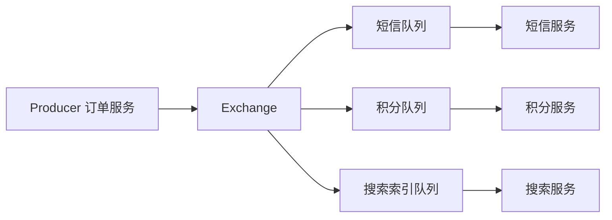

### 1.2 在 4+1 框架中的阶段

[01 方法论](./01-系统设计方法论与面试框架.md) 的 **+1 扩展**：写 QPS 高、非核心路径耗时、需解耦时引入 MQ。

---

## 2. 何时用 MQ、何时不用

### 2.1 适合用

- 非核心路径可异步（通知、日志、统计）
- 峰值写远大于 DB 承受能力
- 多下游订阅同一事件
- 需要重试与削峰

### 2.2 不适合用

- 强同步查询（用户要等结果）
- 链路简单、无性能问题（过度设计）
- 团队无运维 MQ 能力且量级小

### 2.3 决策表

| 问题 | 是 → 考虑 MQ |
|------|-------------|
| 用户能否接受异步？ | |
| 失败能否补偿？ | |
| 写 QPS 是否超过 DB 安全线？ | |
| 是否有 2+ 下游？ | |

---

## 3. 主流 MQ 对比（架构选型）

| 产品 | 模型 | 顺序 | 延迟消息 | 吞吐 | 适用 |
|------|------|------|----------|------|------|
| RabbitMQ | Exchange-Queue | 单队列可 | 插件/死信 | 万级 | Java 生态、路由灵活 |
| Kafka | Topic-Partition | 分区内有序 | 不原生 | 极高 | 日志、大数据、事件流 |
| RocketMQ | Topic-Queue | 支持 | 支持 | 高 | 国内电商、事务消息 |
| Redis Stream | Stream | 支持 | 近似 | 中高 | 轻量、已有 Redis |

本仓库实战以 **RabbitMQ** 为主（Java/08），面试需知 **Kafka 分区有序** 概念。

---

## 4. 消息模型核心概念

### 4.1 RabbitMQ 回顾

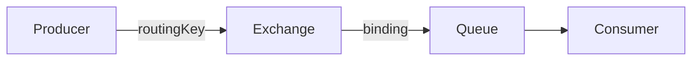

| 概念 | 作用 |
|------|------|
| Exchange | 路由策略（direct/topic/fanout） |
| Queue | 存储消息 |
| Binding | 绑定规则 |
| ACK | 消费确认 |

### 4.2 Kafka 分区模型（面试）

```text
Topic → 多个 Partition → 每分区有序
同一 key hash 到同一分区 → 保证 key 级顺序
```

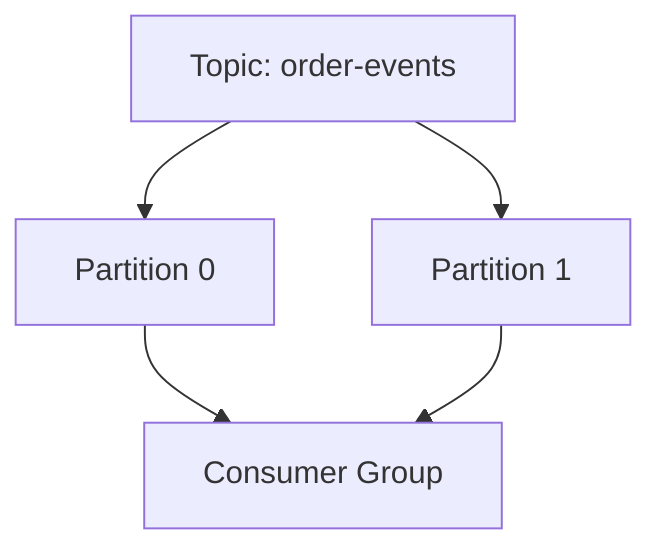

---

## 5. 可靠性：不丢消息

### 5.1 三个环节

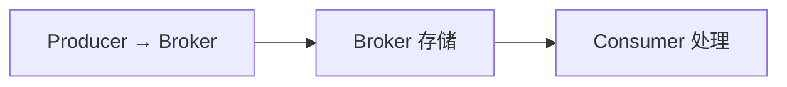

| 环节 | 对策 |
|------|------|
| 生产 | Publisher Confirm、事务（性能差） |
| 存储 | 持久化队列、镜像/副本 |
| 消费 | 手动 ACK，处理完再确认 |

### 5.2 Spring AMQP 手动 ACK 示例

```java
@RabbitListener(queues = "order.created")
public void onOrderCreated(OrderCreatedEvent event, Channel channel,
                           @Header(AmqpHeaders.DELIVERY_TAG) long tag) throws IOException {
    try {
        smsService.send(event.getUserId());
        channel.basicAck(tag, false);
    } catch (Exception e) {
        channel.basicNack(tag, false, true); // requeue 慎用，防毒消息
    }
}
```

### 5.3 死信队列（DLQ）

消费失败 N 次 → 进入 DLQ，人工或定时补偿。

```text
主队列 --x-dead-letter-exchange--> 死信交换机 --> 死信队列
```

与 [Java/08 延迟关单](../Java/08-RabbitMQ与消息队列实战.md) 联动。

---

## 6. 重复消费与幂等

### 6.1 为什么会有重复

- 生产者重试
- Broker 重复投递
- 消费者 ACK 前崩溃，消息再次投递

**结论**：MQ 语义常为 **At least once**，业务必须**幂等**。

### 6.2 幂等实现手段

| 手段 | 说明 | 可靠性 |
|------|------|--------|
| 数据库唯一索引 | `order_no` UNIQUE | 高 |
| Redis SETNX | `consume:msgId` | 高 |
| 状态机 | 仅 `CREATED` 可转 `PAID` | 高 |
| 幂等表 | 记录已处理 messageId | 高 |

```java
@Transactional
public void handlePayment(PaymentEvent event) {
    if (idempotentMapper.exists(event.getMessageId())) {
        return;
    }
    idempotentMapper.insert(event.getMessageId());
    orderService.markPaid(event.getOrderId());
}
```

```sql
CREATE TABLE mq_idempotent (
    message_id VARCHAR(64) PRIMARY KEY,
    create_time DATETIME NOT NULL DEFAULT CURRENT_TIMESTAMP
);
```

### 6.3 与 [Java/14 §30.3](../Java/14-高频场景设计与面试专题.md) 对照

接口幂等（Idempotency-Key）+ MQ 消费幂等（messageId）**双层**防护。

---

## 7. 顺序消息

### 7.1 全局顺序 vs 局部顺序

| 类型 | 实现 | 成本 |
|------|------|------|
| 全局顺序 | 单队列单消费者 | 吞吐低 |
| 局部顺序 | 同一 `orderId` 进同一分区/队列 | **常用** |

### 7.2 场景

- 同一订单：创建 → 支付 → 发货 事件有序
- 同一用户钱包：扣款流水有序

### 7.3 RabbitMQ 实现局部顺序

```text
routingKey = orderId
单队列 + 单消费者（或一致性 hash 多队列）
```

### 7.4 乱序时业务兜底

用**版本号 / 状态机**拒绝旧事件：

```java
if (event.getVersion() <= order.getVersion()) {
    return; // 过期事件丢弃
}
```

---

## 8. 延迟消息

### 8.1 场景

- 订单 30 分钟未支付自动取消（[Java/14 §30.4](../Java/14-高频场景设计与面试专题.md)）
- 延迟重试
- 定时提醒

### 8.2 实现方式

| 方式 | 说明 |
|------|------|
| RabbitMQ TTL + DLX | 消息过期进死信队列 |
| RocketMQ 延迟级别 | 内置 |
| 时间轮 + 定时扫描 | 自研，订单量大 |
| Redis ZSet | score=执行时间 |

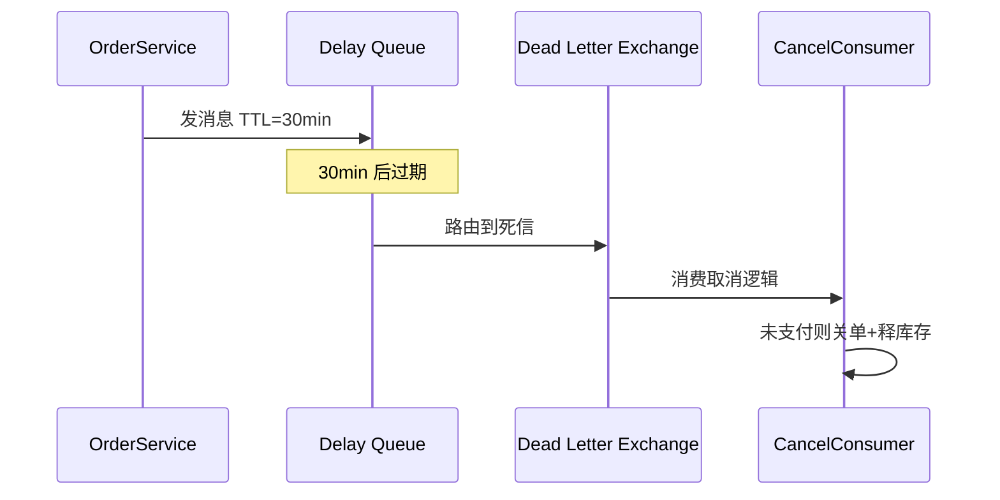

---

## 9. 削峰填谷

### 9.1 秒杀写路径

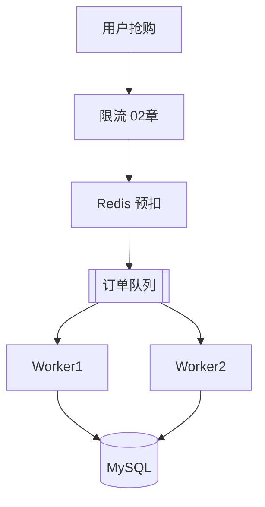

队列长度监控：`queue_depth` 突增说明消费跟不上，需扩容消费者或优化单条处理。

### 9.2 消费者数量估算

```text
所需消费者 ≈ 峰值生产速率 × 单条处理耗时（秒）
```

例：峰值 5000 msg/s，每条处理 50ms → 需 250 并发消费线程（粗算）。

---

## 10. 事务消息与本地消息表

### 10.1 问题

DB 提交成功但 MQ 发送失败，或反之 → 不一致。

### 10.2 本地消息表（最终一致）

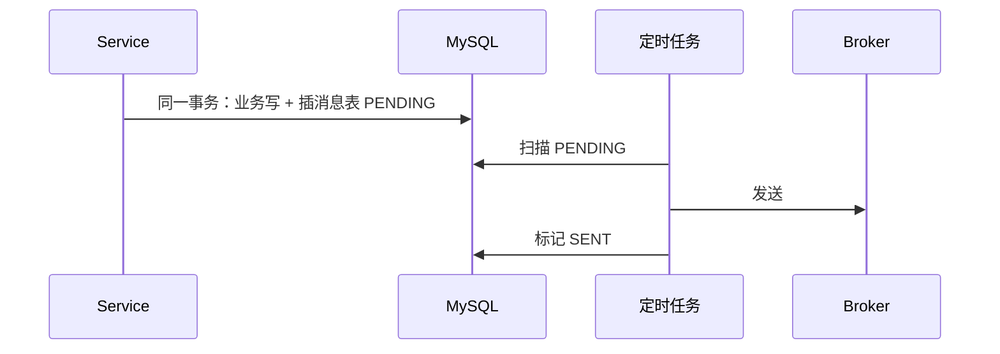

```sql
CREATE TABLE outbox_message (
    id BIGINT PRIMARY KEY AUTO_INCREMENT,
    payload JSON NOT NULL,
    status TINYINT NOT NULL, -- 0待发送 1已发送
    create_time DATETIME NOT NULL,
    KEY idx_status_time (status, create_time)
);
```

### 10.4 本地消息表手把手

| 步骤 | 动作 | 预期 | 若不对 |
|------|------|------|--------|
| 1 | 业务与 outbox INSERT 同一事务 | 同时 commit/rollback | 分开事务仍不一致 |
| 2 | 定时任务扫 `status=0` | 批量发送 | 扫全表锁表 → 加索引 |
| 3 | 发送成功 UPDATE status=1 | 不重复发 | 缺幂等下游重复 |
| 4 | 发送失败保留 PENDING | 下次重试 | 无限重试需上限 |
| 5 | 监控 PENDING 堆积 | 告警 | JOB 挂了无人知 |

**与 §12 下单 Case 关系**：事务内插订单 + outbox；提交后 JOB 发 `OrderCreated`，比「先 commit 再发 MQ」更安全。

### 10.5 RocketMQ 事务消息（了解）

半消息 → 执行本地事务 → commit/rollback 消息。与 [06 一致性](./06-分布式一致性与CAP.md) 章呼应。

---

## 11. 与缓存、DB 协同

### 11.1 写后失效缓存

```text
更新 DB → 发 MQ「缓存失效」→ 消费者 DEL Redis key
```

避免业务线程同步删缓存失败，见 [03 章](./03-缓存架构设计.md)。

### 11.2 异步建索引

```text
发帖 → 写 tweet 表 → MQ → ES 消费者建索引
```

读路径走 ES，接受秒级延迟。

---

## 12. Case Study：下单后通知链

### 12.0 手把手步骤表

| 步骤 | 动作 | 预期产出 | 若卡住 |
|------|------|----------|--------|
| 1 划分 | 同步 vs 异步步骤 | §12.2 表 | §2.1 |
| 2 事务 | 扣库存+插订单同一 `@Transactional` | 强一致核心 | Java 05 |
| 3 发消息 | 事务提交后发 OrderCreated | Outbox 可选 | §10 |
| 4 消息体 | 含 messageId、orderId | §12.3 JSON | §6 幂等 |
| 5 消费者 | 短信/积分/搜索各自队列 | §12.2 图 | §4 |
| 6 失败 | ACK、重试、DLQ | §15 毒消息 | §5 |

### 12.1 需求

下单成功：扣库存（同步）、发短信、加积分、同步搜索。

### 12.2 同步 vs 异步划分

| 步骤 | 方式 | 原因 |
|------|------|------|
| 扣库存 | 同步事务 | 强一致 |
| 创建订单 | 同步 | 需返回 orderId |
| 短信/积分/搜索 | MQ | 可重试、解耦 |

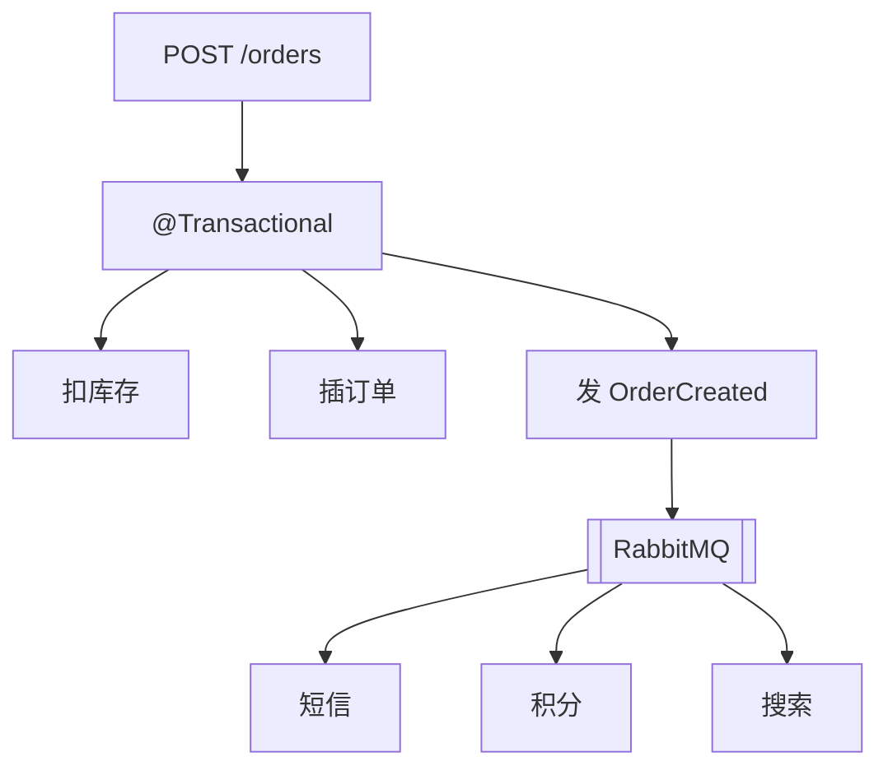

### 12.3 消息体设计

```json
{
  "messageId": "uuid",
  "orderId": 10001,
  "userId": 42,
  "amount": "99.00",
  "occurredAt": "2026-06-30T10:00:00Z"
}
```

**消息体 JSON 逐行读**：

| 字段 | 含义 | 缺失会怎样 |
|------|------|------------|
| `messageId` | 全局唯一，幂等键 | 重复消费无法去重 |
| `orderId` | 业务主键 | 下游不知处理哪单 |
| `userId` | 用户维度 | 积分/短信路由失败 |
| `amount` | 金额字符串 | 精度丢失若用 float |
| `occurredAt` | 事件时间 ISO8601 | 乱序排查困难 |

---

## 13. Case Study：订单超时取消

### 13.0 手把手步骤表

| 步骤 | 动作 | 产出 |
|------|------|------|
| 1 | 下单成功发延迟消息 | TTL = 30min |
| 2 | 消费时**再查订单状态** | 已支付则忽略 |
| 3 | 关单 + 释库存 | 同一事务或 Saga |
| 4 | 幂等 | 关单操作可重复执行 |
| 5 | 高量 | 分片扫描 + 延迟消息混合 |

完整流程见 [Java/14 §30.4](../Java/14-高频场景设计与面试专题.md)。

要点：

- 延迟消息 + 消费时**再查状态**（可能已支付）
- 关单 + 释库存要**幂等**
- 高订单量时定时扫描分片

---

## 14. Case Study：AI 文档异步索引（AI Agent）

### 14.0 手把手步骤表

| 步骤 | 动作 | 产出 |
|------|------|------|
| 1 | API 存元数据 + 对象存储 | 文档 id |
| 2 | 发 `index-queue` 消息 | messageId 幂等 |
| 3 | Worker 分片读大文件 | 控制 GPU/内存 |
| 4 | Embedding 写入向量库 | collection 按 tenant |
| 5 | 失效 RAG 相关缓存 | 见 [03 §13](./03-缓存架构设计.md) |
| 6 | 监控 lag 与 DLQ | 索引失败可重试 |

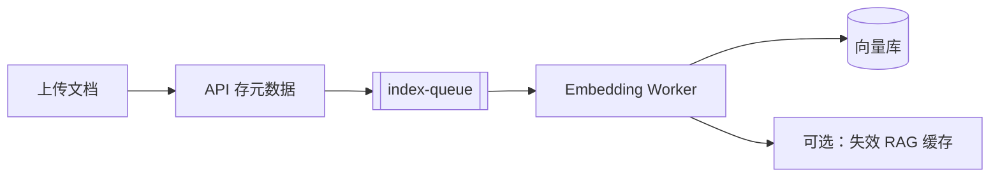

与 [AIAgent](../AIAgent/00-学习路线图与说明.md) 中 ingestion 流水线一致；注意**大文件分片**与**消费并发**控制 GPU 资源。

---

## 15. 毒消息与监控

### 15.1 毒消息

反复消费失败 → 阻塞队列。对策：

- 最大重试次数后进 DLQ
- 告警 + 人工修复
- 勿无限 `requeue=true`

### 15.2 监控指标

| 指标 | 含义 |
|------|------|
| 堆积量 | 消费跟不上 |
| 消费延迟 | 端到端 lag |
| DLQ 速率 | 异常业务 |
| 发布确认失败率 | 生产端问题 |

---

## 16. 面试高频对比

### 16.1 Kafka vs RabbitMQ

| 维度 | RabbitMQ | Kafka |
|------|----------|-------|
| 定位 | 消息队列 | 分布式日志/流 |
| 消息删除 | 消费后删 | 保留策略按时间 |
| 回溯 | 弱 | 强 |
| 电商订单 | 常用 | 事件溯源 |

### 16.2 同步调用 vs MQ

| 维度 | Feign 同步 | MQ |
|------|-----------|-----|
| 一致性 | 强（同事务难） | 最终一致 |
| 延迟 | 低 | 有排队 |
| 耦合 | 高 | 低 |
| 峰值 | 同步放大 | 削峰 |

---

## 17. Java 生产者完整示例

```java
@Service
@RequiredArgsConstructor
public class OrderEventPublisher {

    private final RabbitTemplate rabbitTemplate;

    public void publishCreated(OrderCreatedEvent event) {
        rabbitTemplate.convertAndSend(
                "order.exchange",
                "order.created",
                event,
                msg -> {
                    msg.getMessageProperties().setMessageId(event.getMessageId());
                    return msg;
                });
    }
}
```

**OrderEventPublisher 逐行读**：

| 行号/代码 | 含义 | 改错会怎样 |
|-----------|------|------------|
| `convertAndSend(exchange, routingKey, event)` | 发到 topic 交换机 | routingKey 错则无人消费 |
| `order.exchange` | 逻辑交换机名 | 与 Config 不一致则丢消息 |
| `order.created` | 路由键 | 与 Queue binding 必须匹配 |
| `setMessageId(...)` | 幂等键写入消息头 | 缺则消费者无法去重 |
| `durable("order.created")` | 队列持久化 | 非 durable 重启丢消息 |
| `deadLetterExchange("order.dlx")` | 失败进死信 | 无 DLQ 则毒消息阻塞 |

### 17.1 手把手：Spring Boot 发第一条 MQ

| 步骤 | 动作 | 预期 | 若不对 |
|------|------|------|--------|
| 1 | Docker 起 RabbitMQ | 15672 管理台可开 | 见 Java 08 |
| 2 | 声明 Exchange + Queue + Binding | 管理台可见 | 检查 Bean |
| 3 | `publishCreated` 发一条 | 队列 +1 | 交换机名 |
| 4 | `@RabbitListener` 消费打印 | 控制台日志 | ACK 模式 |
| 5 | 故意抛异常 | 进 DLQ 或重试 | 见 §15 |

```java
@Configuration
public class RabbitConfig {

    @Bean
    public TopicExchange orderExchange() {
        return new TopicExchange("order.exchange", true, false);
    }

    @Bean
    public Queue orderCreatedQueue() {
        return QueueBuilder.durable("order.created")
                .deadLetterExchange("order.dlx")
                .build();
    }

    @Bean
    public Binding orderCreatedBinding(Queue orderCreatedQueue, TopicExchange orderExchange) {
        return BindingBuilder.bind(orderCreatedQueue).to(orderExchange).with("order.created");
    }
}
```

---

## 18. 分级练习

### 18.1 基础档

**题 1**：MQ 三大价值各举一个例子。

**题 2**：为什么消费端必须做幂等？

**题 3**：手动 ACK 和自动 ACK 区别？

### 18.2 进阶档

**题 4**：设计「同一订单事件有序」的 RabbitMQ 路由方案。

**题 5**：画出本地消息表 + 定时扫描发 MQ 的时序图。

**题 6**：秒杀异步落单，如何保证不超卖？（联动 Redis + DB）

### 18.3 挑战档

**题 7**：下单成功但积分服务长时间不可用，消息堆积 100 万，如何处理？

**题 8**：比较 Outbox、RocketMQ 事务消息、Seata 分布式事务的适用场景。

---

## 19. 分级练习参考答案

### 19.1 基础档

**题 1**：异步—发短信；解耦—订单不直接调积分；削峰—秒杀队列慢慢写库。

**题 2**：Broker 至少一次投递，网络重试会导致重复消费。

**题 3**：自动 ACK 收到即确认，可能丢消息；手动 ACK 处理成功再确认，需防重复与死信。

### 19.2 进阶档

**题 4**：`routingKey=order.{orderId}` 映射到固定队列，每队列单消费者；或 hash(orderId)%N 选队列。

**题 5**：见 §10.2 Mermaid。

**题 6**：同步 Redis 预扣 + MQ 异步；消费者 `UPDATE stock WHERE stock>=?` + 订单唯一索引；失败回滚 Redis 或补偿。

### 19.3 挑战档

**题 7**：扩容消费者；积分恢复后加速消费；临时降级停积分；超期消息进 DLQ；核心业务与积分**分队列**避免阻塞。

**题 8**：

| 方案 | 适用 |
|------|------|
| Outbox | 通用、最终一致、实现可控 |
| RocketMQ 事务 | 已用 Rocket、要原生事务消息 |
| Seata AT | 多服务强一致、能接受性能与复杂度 |

---

## 20. 学完标准

- [ ] 能讲清 MQ **异步、解耦、削峰** 及适用边界
- [ ] 能设计 **生产确认 + 手动 ACK + DLQ** 可靠性链路
- [ ] 至少掌握 **3 种消费幂等** 实现
- [ ] 能解释 **局部顺序** 如何实现
- [ ] 能画 **延迟关单** 死信队列流程
- [ ] 知道 **本地消息表** 解决 DB 与 MQ 一致
- [ ] 复习 [Java/08](../Java/08-RabbitMQ与消息队列实战.md) 手把手 demo

---

## 21. FAQ

**Q：小项目要不要上 MQ？**  
单体、日订单几百可不用；要练技术栈或已有异步需求可上。

**Q：消息积压先扩容消费者还是加队列？**  
先查消费慢原因；盲目扩容若 DB 瓶颈无效；可临时降级非核心队列。

**Q：Kafka 能替代 RabbitMQ 吗？**  
看场景；传统业务路由 Rabbit 简单；大数据管道 Kafka 更强。

**Q：和 [05 DB](./05-数据库扩展与读写分离.md) 关系？**  
MQ 削峰减轻写压力；DB 仍可能是瓶颈，需分库分表。

**Q：AI  pipeline 必须用 Kafka？**  
数据量大、要回溯用 Kafka；轻量 Redis Stream / Rabbit 也可。

**Q：消息丢失怎么防？**  
生产者 confirm、Broker 持久化、消费者 manual ACK；三处都要配。

**Q：顺序消息怎么保证？**  
单分区/单队列 + 单消费者；或按 orderId hash 到同一分区。

**Q：幂等键放哪？**  
messageId 或 businessKey（orderId+操作类型）+ DB 唯一索引。

**Q：事务消息和本地消息表区别？**  
RocketMQ 事务消息 Broker 参与；本地消息表更通用，定时扫表发 MQ。

**Q：堆积 100 万条先怎么办？**  
诊断消费慢原因 → 扩容 consumer → 非核心队列降级 → 勿盲目加队列。

**Q：同步调用改 MQ 的边界？**  
必须立即知道的（库存、余额）同步；通知、统计、索引可 MQ。

---

## 22. 与 Java 章节交叉索引

| 话题 | Java |
|------|------|
| RabbitMQ 入门 | [08](../Java/08-RabbitMQ与消息队列实战.md) |
| 延迟关单 | [14 §30.4](../Java/14-高频场景设计与面试专题.md) |
| 下单发 MQ | [14 §4](../Java/14-高频场景设计与面试专题.md) |
| 重复消费 | [14 §8](../Java/14-高频场景设计与面试专题.md) |

---

## 23. 消息堆积处理 playbook

### 23.1 堆积原因诊断

| 原因 | 现象 | 动作 |
|------|------|------|
| 消费慢 | CPU/DB 高 | 优化 SQL、批处理 |
| 消费者少 | lag 线性涨 | 扩容 consumer |
| 单条太大 | 序列化耗时 | 压缩、传 id 不传大对象 |
| 下游不可用 | 重试风暴 | 熔断 + DLQ |
| 生产突增 | 大促 | 提前扩容 + 限流 |

### 23.2 临时扩容消费者注意点

- RabbitMQ：** competing consumers**，增加实例即可
- Kafka：消费者数 ≤ 分区数才有用，可能需**增加分区**（新消息有效，旧 lag 仍要消费）
- 消费逻辑必须**幂等**，扩容后重复风险上升

### 23.3 降级策略

```text
非核心队列（积分、推荐）可暂停消费
核心队列（订单落库）优先保障资源
堆积超阈值 → 告警 + 人工开关降级
```

---

## 24. 事件驱动与领域事件（架构视角）

### 24.1 领域事件

```java
public record OrderCreatedEvent(
    String messageId,
    Long orderId,
    Long userId,
    BigDecimal amount
) {}
```

订单聚合根在事务提交后发布事件，避免在 Service 里直接 `feign` 五个下游。

### 24.2 事件命名与版本

| 规范 | 示例 |
|------|------|
| 过去式 | `OrderCreated` 非 `CreateOrder` |
| 带版本 | `schemaVersion: 2` 兼容演进 |
| 幂等键 | `messageId` 全局唯一 |

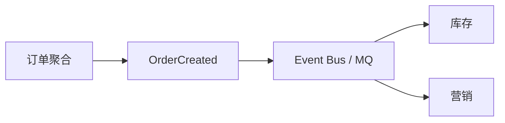

---

## 25. 批量消费与性能

```java
@RabbitListener(queues = "log.batch", containerFactory = "batchFactory")
public void onBatch(List<LogEvent> events) {
    logRepository.batchInsert(events);
}
```

| 技巧 | 说明 |
|------|------|
| 批量 insert | 减少 DB round trip |
| 预取 prefetch | 平衡吞吐与公平 |
| 异步线程池 | 消费线程快速 ACK，业务异步（注意顺序） |

**权衡**：批量增大延迟，日志类可接受，支付类慎用。

---

## 26. MQ 选型决策树

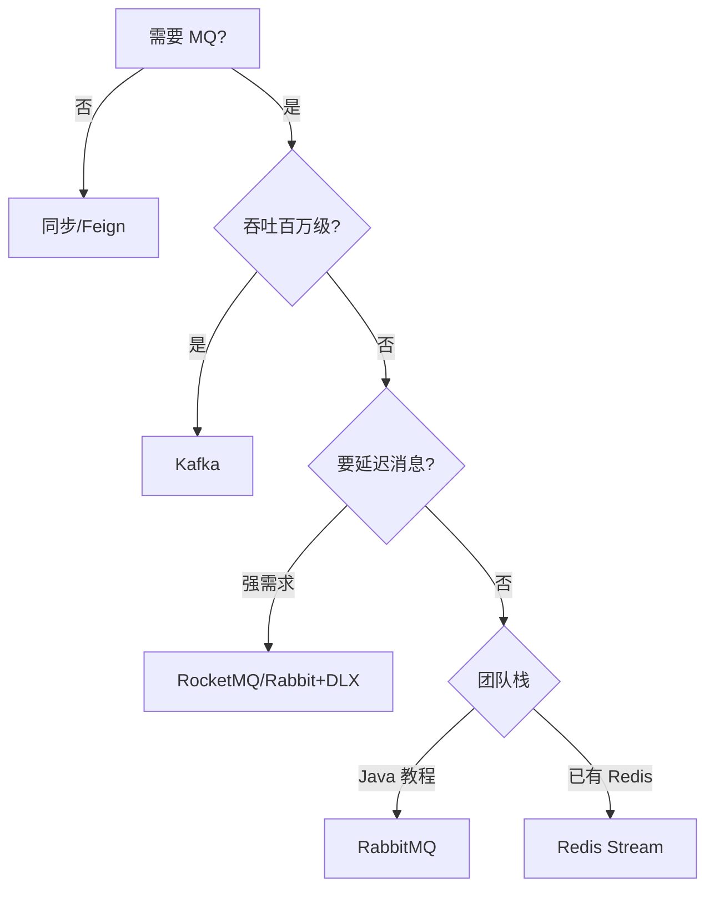

---

## 27. 我的笔记区

```text
手动 ACK 流程：
幂等表字段设计：
延迟关单画过图吗：
本地消息表 vs 事务消息：
```

---

## 28. 闭卷自测

完成后再看 §28.1 参考答案。

1. **概念** MQ 三大价值是什么？各举一场景。
2. **概念** 为什么需要消费者 manual ACK？
3. **概念** 重复消费和消息丢失分别怎么防？
4. **概念** 本地消息表解决什么问题？
5. **概念** 延迟关单为什么要「消费时再查状态」？
6. **概念** Kafka 消费者数与分区数关系？
7. **动手** OrderCreated 消息体应含哪些字段（至少 4 个）？
8. **动手** §12 Case：哪些步骤必须同步、哪些适合 MQ？
9. **综合** 下单发 MQ 后 DB 回滚了怎么办？（Outbox/事务）
10. **综合** 秒杀写路径如何用 MQ 削峰？（配合 07）

### 28.1 自测参考答案

1. 异步（短信）、解耦（多下游）、削峰（秒杀落单）。
2. 处理完再 ACK；自动 ACK 可能处理失败但消息已丢。
3. 重复：幂等表/唯一键；丢失：confirm+持久化+manual ACK。
4. DB 提交与发 MQ 的原子性——表记录与业务同事务，异步扫表发送。
5. 延迟期间用户可能已支付，不能无脑关单。
6. 消费者数 ≤ 分区数才有并行效果；多则空闲。
7. messageId、orderId、userId、amount、occurredAt。
8. 同步：扣库存、插订单；MQ：短信、积分、搜索。
9. 事务内写 Outbox 表，提交后异步发；或 RocketMQ 事务消息。
10. 请求快速入队/Redis 预减，消费者按能力落库，保护 DB。

---

## 29. 费曼检验

用 **3 分钟**解释：**「消息队列像什么？下单为什么还用它？」**

**对照提纲**：

1. **叫号机**：点完拿号就走，不用等厨房炒完。
2. **削峰**：高峰订单先排队，后台按能力消化，DB 不被打垮。
3. **解耦**：加积分不用改订单代码，订阅新队列即可。

---

## 30. 本章核心速记卡

| 话题 | 一句话 |
|------|--------|
| 可靠 | confirm + 持久化 + manual ACK |
| 幂等 | messageId + 唯一索引 |
| 顺序 | 同 key 同分区 |
| 延迟 | TTL 消息 + 再查状态 |

---

## 31. 模拟面试：下单全链路 3 分钟话术

```text
【30s 划分】同步：扣库存+插订单；异步：短信/积分/搜索
【30s 可靠】生产者 confirm；队列 durable；消费者 manual ACK
【30s 幂等】messageId + 消费表唯一索引；业务键 orderId+操作
【30s 延迟关单】TTL 30min → DLX → 消费再查状态 → 幂等关单释库存
【30s 一致】Outbox 与订单同事务；或 RocketMQ 事务消息
【30s 堆积】看 lag；扩 consumer；非核心队列降级
```

### 31.1 MQ 可靠性检查清单（上线前）

| 检查项 | 生产者 | Broker | 消费者 |
|--------|--------|--------|--------|
| 持久化 | confirm | durable queue | manual ACK |
| 幂等 | messageId | — | 唯一索引表 |
| 失败 | 重试上限 | DLX | 进 DLQ 告警 |
| 顺序 | 同 key 路由 | 单队列 | 单线程/分区 |
| 监控 | send 失败率 | queue depth | consume lag |

### 31.2 不适合 MQ 的场景（反模式）

- 必须同步返回结果的支付确认（可部分异步查状态）
- 强一致跨库事务（MQ 只能最终一致）
- 极低延迟 <10ms 的读路径
- 无消费者的小项目（增加运维复杂度）

---

## 下一章预告

[05-数据库扩展与读写分离](./05-数据库扩展与读写分离.md) 解决 **数据层** 瓶颈：读副本、主从延迟、分库分表入门与一致性哈希——当缓存和 MQ 仍不够时，扩展 MySQL。

---

*模拟面试：用 3 分钟讲「下单 + MQ 通知 + 幂等 + 延迟关单」完整链路*
